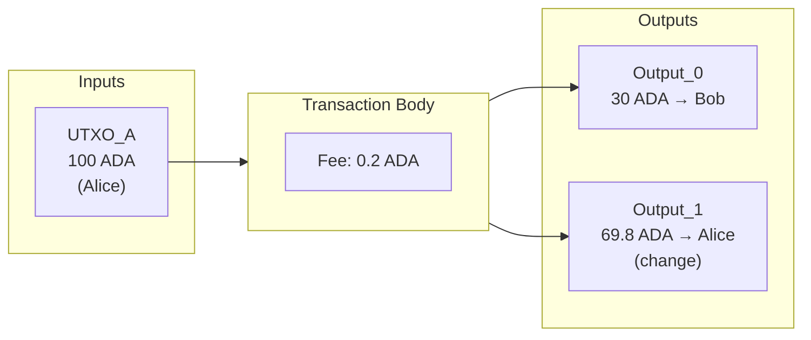
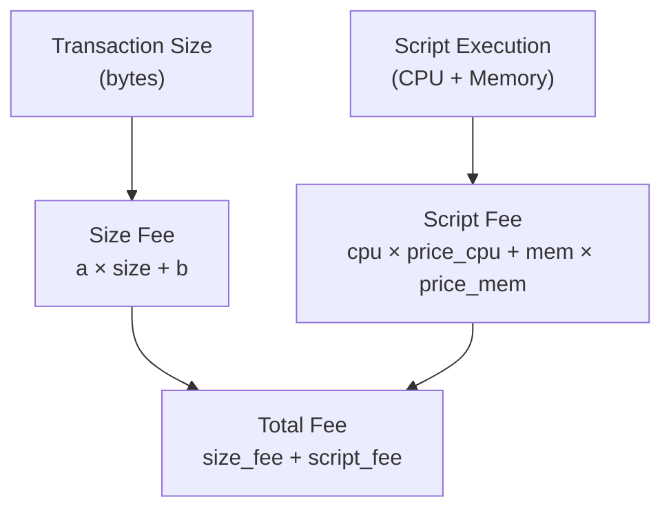
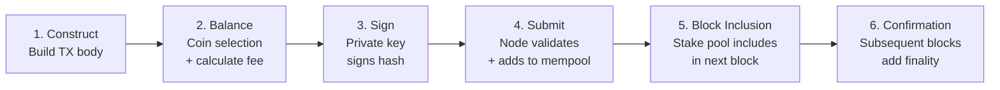

# レッスン #06: トランザクション

Cardanoトランザクションとは、既存のUTXOをインプットとして消費し、新しいUTXOをアウトプットとして生成する署名付きデータ構造であり、プロトコルのルールに従って価値を移転します。あらゆる価値の移転、スマートコントラクトの実行、トークンのミントは、すべてトランザクションから始まり、トランザクションで終わります。CardanoのUTXOベースのトランザクションモデルは、台帳全体の状態変化を表現する、非常に強力で予測可能な方法を提供します。

このレッスンでは、Cardanoトランザクションの構造を内側から分解します。インプットとアウトプットがどのように連携するか、手数料がなぜ存在しどのように計算されるか、メタデータで何ができるか、有効期間がどのようにあなたを保護するか、そしてこれらすべてがネットワーク向けにどのようにコンパクトなバイナリ形式にシリアライズされるかを学びます。

## Cardanoトランザクションの構造とは？

Cardanoトランザクションは、台帳への変更提案を記述する自己完結型のデータ構造です。すべてのトランザクションは、インプット（消費する既存UTXOへの参照）、アウトプット（作成する新しいUTXO）、ネットワークに支払う手数料、およびウィットネス（認可を証明する暗号署名）で構成されます。

これらの基本要素に加えて、トランザクションにはオプションでメタデータ、有効期間、ミント命令、証明書、引き出しなどを含めることができます。まず基本から始めましょう。



### トランザクションインプット

インプットは値そのものではありません。台帳上に存在する既存UTXOへの*ポインタ*です。各インプットは2つの情報で識別されます：

- **トランザクションハッシュ**: そのUTXOを作成したトランザクションのハッシュ。
- **アウトプットインデックス**: そのトランザクション内での特定のアウトプットの位置。

これらを組み合わせると、`tx_hash#index`という形式で書かれる一意の識別子になります。例えば、`a1b2c3...#0`はハッシュ`a1b2c3...`のトランザクションの最初のアウトプットを指します。

トランザクションにインプットが含まれる場合、「この特定のUTXOを消費したい」と宣言していることになります。プロトコルは、そのUTXOが存在すること、まだ使われていないこと、そしてトランザクションが適切な認可（所有者の秘密鍵による有効な署名、またはスクリプト評価の合格）を提供していることを検証します。

インプットは、換金される小切手のようなものと考えてください。小切手（UTXO）は過去のある時点で書かれたもので、今それを銀行（ネットワーク）に持ち込んで新しいものに変換するのです。

### トランザクションアウトプット

トランザクション内の各アウトプットは、台帳上に新しいUTXOを作成します。アウトプットには以下が指定されます：

- **アドレス**: 価値の送信先（支払いアドレス、スクリプトアドレスなど）。
- **値**: アウトプットが保持するADA（lovelace単位）やその他のネイティブトークンの量。
- **オプションのDatum**: アウトプットに添付されるデータで、主にスマートコントラクトで使用されます。

1つのトランザクションで複数のアウトプットを作成できます。これが「おつり」の仕組みです。100 ADAのUTXOがあり、30 ADAを誰かに送りたい場合、トランザクションには2つのアウトプットがあります：受取人に30 ADAを送るものと、自分自身に約70 ADA（手数料を差し引いた分）を戻すものです。

基本的なルールは以下の通りです：**すべてのインプット値の合計は、すべてのアウトプット値の合計と手数料の合計に等しくなければなりません。** これは価値の保存則です。通常のトランザクションではADAを作成したり破壊したりすることはできません（ミントは独自のルールを持つ別のメカニズムです）。

### バランス方程式

```
Sum(Inputs) = Sum(Outputs) + Fee
```

この方程式は正確に成り立たなければなりません。おおよそではなく、*正確に*です。少しでも差異があれば、トランザクションは無効となり、ネットワークに拒否されます。これは、単に「AからBにXを送る」と指定すれば、プロトコルが内部的に計算を処理するアカウントベースのシステムとの重要な違いです。

## Cardanoのトランザクション手数料はどのように計算されますか？

Cardanoは、トランザクションのシリアライズされたバイトサイズに基づく決定論的な線形計算式と、スマートコントラクトスクリプト用の追加の実行ベースコンポーネントを使用してトランザクション手数料を計算します。これにより、トランザクションを送信する前に正確な手数料を予測できます。オークションやガス価格の変動、予期しないコストはありません。

手数料は複数の目的を果たします：

1. **スパムの防止**: 手数料がなければ、攻撃者が何百万もの無意味なトランザクションでネットワークを溢れさせることができます。
2. **ステークプールオペレーターへの報酬**: 手数料は、ノードがブロックの検証と生成を行うインセンティブとなる報酬メカニズムの一部です。
3. **経済的持続可能性の確保**: 手数料メカニズムにより、ネットワークの長期的な運用が維持されます。

### 手数料の計算式はどのように機能しますか？

Cardanoは、シンプルで決定論的な手数料計算式を使用します：

```
fee = a * tx_size_in_bytes + b
```

各パラメータ：
- `a`はバイトあたりのコスト（プロトコルパラメータで、現在約44 lovelace/バイト）。
- `b`は固定のベースコスト（現在約155,381 lovelace、約0.155381 ADA）。
- `tx_size_in_bytes`はシリアライズされたトランザクションのバイト単位のサイズ。

一般的なシンプルなトランザクションのコストは約0.17〜0.20 ADAです。スクリプト、メタデータ、多数のインプット/アウトプットを含むより複雑なトランザクションは、バイトサイズが大きくなるため、コストが高くなります。



### スクリプト実行手数料はどのように処理されますか？

トランザクションにPlusスクリプト（スマートコントラクト）が含まれる場合、**ExUnits（実行ユニット）**に基づく追加コストが発生します。ExUnitsはCPU時間とメモリ消費を測定します。ExUnitsについてはレッスン8で詳しく説明しますが、ここではスクリプトを含むトランザクションにはサイズベースの手数料と実行ベースの手数料の2つのコンポーネントがあることを理解しておいてください。

```
total_fee = size_fee + script_execution_fee
```

このデュアル手数料モデルにより、ネットワーク帯域幅（トランザクションサイズ）と計算リソース（スクリプト実行）の両方が適正に価格設定されます。

## Cardanoのトランザクションメタデータで何ができますか？

トランザクションメタデータは、トランザクションの有効性や台帳の状態に直接影響しない、オンチェーンに保存される任意の構造化データです。Cardanoはメタデータを整数キーから値へのマップとして整理し、値には文字列、整数、バイト配列、リスト、またはネストされたマップを使用できます。

```
Metadata example:
{
  674: {
    "msg": ["Invoice #1234", "Payment for consulting services"]
  }
}
```

### メタデータは何に使用されますか？

- **トランザクションメッセージ**: 人間が読めるメモの添付（CIP-20標準はキー674を使用）。
- **NFTミント情報**: CIP-25はミント時にNFTメタデータ（名前、画像、属性）を添付する方法を定義しています。
- **分散型アイデンティティ**: オンチェーントランザクションとオフチェーンのアイデンティティ請求のリンク。
- **監査証跡**: 金融トランザクションとともにビジネスロジックのコンテキストを記録。
- **オラクルデータ**: スマートコントラクトが参照するための外部データのオンチェーンへの投稿。

### メタデータの制限事項は？

メタデータはPlusスマートコントラクトのスクリプト実行中にアクセス**できません**。バリデータスクリプトは、それをトリガーしたトランザクションのメタデータを読み取ることができません。スクリプトにデータを利用可能にする必要がある場合は、Datum（レッスン9で取り上げます）を使用する必要があります。メタデータは純粋にオフチェーンでの利用を目的としています。ウォレット、エクスプローラー、インデクサー、アプリケーションがそれを読み取りますが、プロトコルの検証ロジックはそれを無視します。

メタデータはトランザクションサイズを増加させ、手数料も増加します。大きなメタデータペイロードは、トランザクションを最大サイズ制限（現在トランザクションボディで16 KB）に近づける可能性があります。

## 有効期間はトランザクションをどのように保護しますか？

有効期間は、トランザクションが有効と見なされる時間ウィンドウ（スロット番号の範囲で表現）を定義します。ネットワークがトランザクションをブロックに含めることができるタイミングを正確に制御でき、古い実行からの保護やタイムロック付きスマートコントラクトロジックを可能にします。

```
validity_interval = {
  invalid_before: slot_500,
  invalid_hereafter: slot_1000
}
```

このトランザクションは、スロット番号が500から999の間のブロックに含まれる場合にのみ有効です（開始を含み、終了を含まない）。

### なぜ有効期間が重要なのですか？

従来のWebアプリケーションでは、リクエストは通常すぐに処理されるかタイムアウトします。しかし、ブロックチェーントランザクションはブロックに含まれるまで数分間メンプールに留まる可能性があります。有効期間はこれを制御します：

- **古いトランザクションからの保護**: トランザクションが時間内に含まれなかった場合、予期しない将来の状態で実行されるのではなく、期限切れになります。
- **タイムロック付きコントラクト**: スマートコントラクトは、特定の時間の前後にのみ特定のアクションが発生するようにすることができます。例えば、クラウドファンディングコントラクトは、期限後にのみ返金請求が有効であることを要求できます。
- **決定論的な時間推論**: CardanoのOuroborosプロトコルはスロットを壁時計の時間にマッピングします（メインネットでは各スロットは1秒）ので、スマートコントラクトは外部オラクルを必要とせずに時間について推論できます。

### オープンインターバルはどのように機能しますか？

どちらの境界も省略できます：
- `invalid_before`なし: トランザクションは時間の始まり（スロット0）から有効です。
- `invalid_hereafter`なし: トランザクションは期限切れになりません（永遠に有効）。
- どちらも指定なし: トランザクションには時間制約がありません。

ほとんどのシンプルなADA送金トランザクションは、下限を省略し、余裕のある上限（通常は現在のスロットプラス数時間）を設定して、何か問題が発生した場合にトランザクションが無期限に残らないようにします。

## 最小UTXO値（Min ADA）要件とは？

Cardanoは、台帳の肥大化を防ぐために、すべてのUTXOに最小ADA値を適用します。すべてのUTXOはネットワーク上のすべてのノードのメモリを消費するため、一定量未満のADAを含むアウトプットを作成することはできません。ダストUTXO（極めて少額またはゼロのADAを持つアウトプット）を許可すると、UTXOセットが肥大化し、ネットワークのパフォーマンスが低下します。

### Min UTXOはどのように計算されますか？

最小ADAはアウトプットのサイズに依存します。ADAのみを含むシンプルなアウトプットには約1 ADAが必要です。ネイティブトークンやDatumハッシュを含むアウトプットはサイズが大きいため、より多くのADAが必要です：

```
Approximate min ADA values:
- Simple ADA-only output: ~1.0 ADA
- Output with one native token: ~1.2 ADA
- Output with datum hash: ~1.2 ADA
- Output with inline datum (small): ~1.5 ADA
- Output with many tokens: ~3-5 ADA (varies with count)
```

正確な計算式は、アウトプットのシリアライズされたサイズと`coinsPerUTxOByte`（現在4,310 lovelace/バイト）というプロトコルパラメータを使用します。アウトプットが大きいほど、より多くのADAを伴う必要があります。

### Min ADAの実際の影響は？

誰かに「トークンだけ」を送ることはできません。常に十分なADAを一緒にバンドルする必要があります。NFTをミントするアプリケーションを構築する場合、各NFTアウトプットには最低約1.5〜2 ADAが必要であることを考慮する必要があります。これは、ERC-20トークンがETH残高とは独立して存在するEthereumから来た開発者にとって、混乱の一般的な原因です。

## Cardanoトランザクションのライフサイクルとは？

Cardanoトランザクションのライフサイクルは、構築、バランシング、署名、送信、ブロック包含、確認の6つの段階に従います。作成からファイナリティまでの過程を理解することで、信頼性の高いアプリケーションを構築できます。



### ステップ1: 構築

アプリケーション（ウォレット、dApp、CLIツール）がトランザクションボディを構築します：インプットの選択、アウトプットの定義、手数料の設定、メタデータの添付、有効期間の定義を行います。この段階では、トランザクションはメモリ内のデータに過ぎません。

### ステップ2: バランシング

トランザクションはバランスが取れていなければなりません。インプットがアウトプットと手数料をカバーする必要があります。アプリケーションはユーザーのウォレットからUTXOを選択し、推定トランザクションサイズに基づいて手数料を計算し、おつりアウトプットを追加し、方程式がバランスするまで反復します。このプロセスは**コインセレクション**と呼ばれます。

### ステップ3: 署名

トランザクションボディがハッシュ化され、ユーザーの秘密鍵がそのハッシュに署名します。複数のインプットが異なるアドレスから来ている場合、複数の署名が必要になることがあります。署名がトランザクションのウィットネスになります。

### ステップ4: 送信

署名されたトランザクションは、通常ノードのローカル送信APIまたはBlockfrostやKoiosなどのリモートサービスを通じて、Cardanoノードに送信されます。ノードは初期検証を実行します：

- すべてのインプットが未使用か？
- ウィットネスがインプットに一致するか？
- 手数料が最低額を満たしているか？
- 有効期間が満たされているか？
- すべてのアウトプットがmin UTXO要件を満たしているか？
- スクリプトが関与する場合、評価に合格するか？

検証に通過すると、トランザクションはノードの**メンプール**（有効だがまだ確認されていないトランザクションの保持エリア）に入ります。

### ステップ5: ブロック包含

Ouroborosプロトコルによって次のブロックを生成するために選ばれたステークプールオペレーターが、メンプールからトランザクションを選び、新しいブロックに含めます。ブロックはネットワーク全体に伝播されます。

### ステップ6: 確認

トランザクションがブロックに含まれると、1つの確認があります。後続の各ブロックにより信頼度が増します。一定の深さ（メインネットでは通常2160ブロック、セキュリティパラメータkに対応）の後、トランザクションは実用上不変と見なされます。

### トランザクションはどこで失敗する可能性がありますか？

トランザクションは複数のポイントで失敗する可能性があります：

- **構築時**: 無効なアドレス、負の値、サイズ制限の超過。
- **送信時**: インプットが既に使用済み（UTXOの競合）、手数料不足、有効期間の期限切れ。
- **メンプール受理後は決して失敗しない**: 送信時の検証を通過しメンプールに入ったトランザクションは、（有効期間が過ぎていない限り）最終的にブロックに含まれることが*保証*されます。Ethereumのような「リバートされたトランザクション」という概念はありません。送信時に有効であれば、含まれる時も有効です。

この決定論性はCardanoの設計の基盤です。トランザクションを送信する前に、その正確な結果を知ることができます。

## CardanoはどのようにCBORでトランザクションをシリアライズしますか？

Cardanoは、RFC 8949で定義されたバイナリエンコーディング形式であるCBOR（Concise Binary Object Representation）を使用して、すべてのトランザクションをシリアライズします。CBORは、Web APIにおけるJSONのCardano版のようなものですが、テキストベース（人間が読める）ではなく、バイナリ（コンパクトで効率的）です。

### なぜCardanoはCBORを使用するのですか？

- **コンパクトさ**: バイナリエンコーディングはJSONやXMLよりも大幅に小さく、トランザクションサイズ、ひいては手数料を削減します。
- **決定論性**: CBORには明確に定義された正規化エンコーディングルールがあり、同じデータが常に同じバイトを生成することを保証します。これはハッシュにとって重要です。シリアライゼーションが非決定論的であれば、同じ論理的トランザクションが異なるハッシュを生成する可能性があります。
- **クロス言語サポート**: CBORライブラリはほぼすべてのプログラミング言語で利用可能であり、異なる実装間の相互運用性を容易にします。
- **スキーマの柔軟性**: CBORは複雑なネストされたデータ構造、マップ、配列、タグ付き値をサポートしており、Cardanoトランザクションのリッチな構造を表現するために必要なすべてを備えています。

### CDDLとは何か、トランザクション構造をどのように定義しますか？

Cardanoは、CBORのスキーマ言語である**CDDL（Concise Data Definition Language）**を使用して、トランザクションの正確な構造を定義します。CDDL仕様は、すべてのフィールド、その型、オプションかどうか、CBORエンコーディングへのマッピングを定義します。これは、バイトレベルで有効なCardanoトランザクションがどのようなものかの権威あるリファレンスです。

```
; Simplified CDDL for a Cardano transaction
transaction = [
  transaction_body,
  transaction_witness_set,
  bool,               ; is_valid flag
  auxiliary_data / null
]

transaction_body = {
  0 : set<transaction_input>,    ; inputs
  1 : [* transaction_output],    ; outputs
  2 : coin,                      ; fee
  ? 3 : uint,                    ; time to live (invalid_hereafter)
  ...
}
```

生のCBORを直接扱う必要はほとんどありません。`cardano-serialization-lib`、`Lucid`、`MeshJS`、`cardano-cli`などのライブラリがシリアライゼーションとデシリアライゼーションを処理してくれます。しかし、CBORが基盤となるフォーマットであることを理解しておくと、問題のデバッグ、ブロックエクスプローラーのデータの解釈、トランザクションサイズの計算の理解に役立ちます。

### トランザクションハッシュはどのように計算されますか？

トランザクションハッシュ（すべてのトランザクションの一意の識別子）は、CBORシリアライズされたトランザクションボディ（ウィットネスを含む完全なトランザクションではない）のBlake2b-256ハッシュです。これは以下を意味します：

- ハッシュは署名前に決定されます（ウィットネスはボディの一部ではありません）。
- トランザクションを送信する前にトランザクションIDを計算できます。
- 同じボディに対する異なるウィットネスセットがトランザクションIDを変更することはありません。

## コラテラルとは何か、なぜスクリプトトランザクションにそれが必要なのですか？

コラテラルインプットとは、Plutusスクリプトがフェーズ2検証中に失敗した場合にCardanoが消費するUTXOです。トランザクションにPlusスクリプトが含まれる場合、ネットワークはスクリプトの評価に計算リソースを既に消費しているため、コラテラルを含める必要があります。スクリプトが失敗した場合、通常のインプットとアウトプットは破棄されますが、コラテラルは補償として取得されます。

コラテラルに関する主要なルール：
- コラテラルインプットはシンプルなADAのみのUTXO（ネイティブトークンなし、Datumなし）でなければなりません。
- コラテラルはトランザクション手数料の少なくとも150%をカバーする必要があります（このパーセンテージはプロトコルパラメータです）。
- スクリプトが成功した場合、コラテラルには手を付けません。
- Vasilアップグレード以降、**コラテラルリターンアウトプット**を指定できるため、UTXO全体ではなく、正確なコラテラル額のみが没収されます。

このメカニズムは、正直なユーザーにペナルティを課すことなくネットワークを保護します。

## Cardanoのリファレンスインプットはどのように機能しますか？

リファレンスインプット（CIP-31によるVasilハードフォークで導入）は、トランザクションがUTXOを消費せずに読み取ることを可能にします。この機能は、共有された非競合のデータアクセスを可能にすることで、多くのユースケースを変革します。

- **共有データ**: オラクルがUTXOにデータを投稿し、多くのトランザクションが競合なしに同時に読み取ることができます。
- **リファレンススクリプト**: スクリプトをUTXOに保存し、すべてのトランザクションに完全なスクリプトを含めるのではなく、必要なトランザクションから参照できます（手数料の節約）。
- **競合の削減**: 標準モデルでは、同じインプットを消費しようとする2つのトランザクションは競合します。リファレンスインプットは読み取り専用アクセスでこれを排除します。

```
Transaction:
  Inputs (consumed):
    - UTXO_A (Alice's payment)

  Reference Inputs (read-only):
    - UTXO_Oracle (price feed data)
    - UTXO_Script (reference script)

  Outputs:
    - Output_0: result of computation using oracle data
```

## Web2アナロジー

Web開発のバックグラウンドがある方のために、Cardanoトランザクションと馴染みのある概念のマッピングを示します：

**トランザクション = HTTPリクエスト**: Cardanoトランザクションは、REST APIへのHTTPリクエストのようなものです。構築し（リクエストを作成）、署名し（認証ヘッダーを添付）、送信し（リクエストを送信）、確認を受け取ります（レスポンスを取得）。主な違いは、ブロックチェーントランザクションは非同期であり、即座にレスポンスを受け取るのではなく、ブロック包含を待つことです。

**インプット/アウトプット = ACIDを備えたデータベーストランザクション**: UTXOモデルは、行のアトミックな読み取りと書き込みを行うデータベーストランザクションに類似しています。インプットは`SELECT ... FOR UPDATE`（変更のために行をロック）に、アウトプットは新しい行を作成する`INSERT`文に相当します。アトミック性の保証により、トランザクション全体が成功するか失敗するかのどちらかであり、適切なACIDコンプライアンスを備えたデータベーストランザクションと同様に、部分的な更新はありません。

**手数料 = APIレート制限**: トランザクション手数料は、クラウドサービスにおけるAPIレート制限や従量課金のように機能します。AWSがAPI Gatewayリクエストごとに課金したり、Stripeがトランザクションごとに課金するように、Cardanoはサイズと複雑さに基づいてトランザクションごとに課金します。手数料は悪用を防止し（レート制限がDDoSを防止するように）、インフラストラクチャオペレーターに報酬を与えます（使用料がクラウドプロバイダーに報酬を与えるように）。

**有効期間 = リクエストタイムアウト**: `invalid_hereafter`フィールドは、HTTPリクエストのタイムアウトやJWTトークンの`exp`（有効期限）クレームに類似しています。トランザクションがウィンドウ内に処理されなかった場合、破棄されます。これは期限切れのJWTがサーバーに拒否されるのと同じです。

**CBOR = Protocol Buffers**: WebサービスがJSONの代わりにProtocol BuffersやMessagePackを効率のために使用するように、Cardanoはテキストベースのフォーマットの代わりにCBORを使用します。動機は同じです：より小さなペイロード、より高速なパース、決定論的なエンコーディング。

**メタデータ = HTTPヘッダー**: トランザクションメタデータは、カスタムHTTPヘッダーに似ています。メインペイロードとともに送信される追加情報ですが、コアの処理ロジックには影響しません。`X-Request-ID`ヘッダーがAPIの動作を変えないのと同様に、メタデータはトランザクションの動作を変えません。

**コラテラル = セキュリティデポジット**: コラテラルは、クラウドサービスアカウントのセキュリティデポジットやクレジットカードの事前承認ホールドのようなものです。スマートコントラクトが失敗した場合（アプリケーションがクラッシュしてサーバーリソースを消費するのと同様）、コラテラルがそのコストをカバーします。すべてが正常に動作すれば、デポジットは返還されます。

## 重要なポイント

- **トランザクションはCardanoにおける変更のアトミックな単位**です。台帳へのすべての変更は、既存のUTXO（インプット）を消費し、新しいもの（アウトプット）を作成するトランザクションを通じて行われます。
- **手数料は決定論的で予測可能**であり、トランザクションのバイトサイズと（スクリプトの場合は）実行コストから計算されます。ガスオークションや手数料市場の変動はありません。
- **有効期間は時間ベースの制御を提供**し、トランザクションがいつ処理されるかを制御できます。期限切れの保護やタイムロック付きスマートコントラクトロジックを可能にします。
- **min UTXOルールは台帳の健全性を確保**し、UTXOセットを肥大化させるダストアウトプットを防止します。すべてのアウトプットはそのストレージコストを正当化するのに十分なADAを含む必要があります。
- **CBORシリアライゼーションは普遍的なエンコーディング**であり、Cardanoトランザクションをすべてのツールと言語間でコンパクト、決定論的、相互運用可能にします。

## 次のステップ

トランザクションが台帳全体で価値とデータをどのように移動するかを理解したところで、次はその上に位置するプログラマブルレイヤーを探求する時です。レッスン7では、スマートコントラクトを概念的に紹介します：バリデータとは何か、オンチェーンとオフチェーンのコードがどのように相互作用するか、そしてなぜCardanoのプログラマビリティへのアプローチが他のブロックチェーンで見たものとは根本的に異なるのかを学びます。
