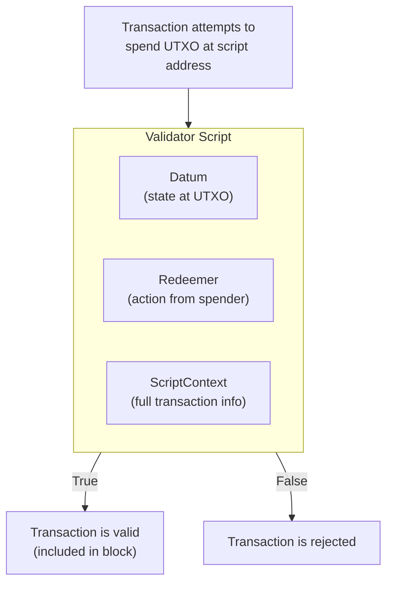
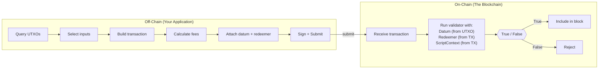
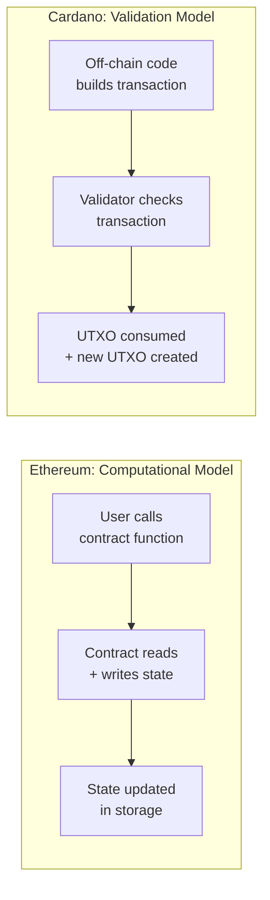

# レッスン #07: スマートコントラクトの概念

Cardanoのスマートコントラクトはバリデータです。提案されたトランザクションを検査し、「はい、これは許可されます」または「いいえ、これは許可されません」のいずれかを返す純粋関数です。バリデータは状態を保持せず、呼び出し可能な関数を公開せず、ストレージを変更しません。単に検証するだけです。これにより、CardanoのアプローチはEthereumのようなアカウントベースのチェーンとは根本的に異なります。

このレッスンでは、Cardanoにおけるスマートコントラクトのメンタルモデルを構築します。バリデータが何をするか、なぜCardanoがオンチェーンとオフチェーンのロジックを分離するか、決定論性が実際に何を意味するか、そしてCardanoのモデルがEthereumとどのように比較されるかを学びます。最終的には、特定のプログラミング言語を理解する必要なしに、スマートコントラクトの設計について論理的に考えることができるようになるでしょう。

## Cardanoにおけるスマートコントラクトとは？

Cardanoにおけるスマートコントラクトとは、提案されたトランザクションに関する情報を受け取り、許可または拒否のブール値を返すバリデータスクリプトです。状態を保存し呼び出し可能な関数を公開するEthereumのコントラクトとは異なり、Cardanoのバリデータは、トランザクションが事前定義されたルールを満たすかどうかのみを検証するステートレスな純粋関数です。

最も一般的なレベルで、スマートコントラクトとは**ブロックチェーン上で実行され、価値の移動に関するルールを強制するコード**です。しかし、その定義は危険なほど曖昧です。なぜなら、*どのように*行うかが非常に重要だからです。

Ethereumでは、スマートコントラクトはアドレスに存在する永続的なプログラムであり、独自の状態（ストレージ変数）を保持し、誰でも呼び出せる関数を公開します。Ethereumのスマートコントラクトと対話する場合、実質的にグローバルなミュータブル状態を読み書きする関数を呼び出していることになります。

Cardanoでは、スマートコントラクトは提案されたトランザクションを検査し、`True`または`False`を返す**バリデータ**です。状態を保持しません。呼び出し可能な関数を公開しません。ストレージを変更しません。

この区別は根本的なものであり、このレッスンの他のすべてはこの点から派生します。

## Cardanoのバリデータはどのように機能しますか？

Cardanoのバリデータは、ブロックチェーンアドレスに関連付けられたスクリプトであり、誰かがそのスクリプトアドレスのUTXOを使おうとしたときに実行されます。バリデータは3つの引数（Datum、Redeemer、ScriptContext）を受け取り、トランザクションを検査し、`True`を返して承認するか、`False`を返してトランザクション全体を拒否します。



### バリデータは何を見ることができますか？

バリデータは3つの情報にアクセスできます（レッスン9で詳しく説明します）：

1. **Datum**: 使用されるUTXOに添付されたデータ。このスクリプトアドレスに保存された「状態」と考えてください。
2. **Redeemer**: UTXOを使おうとしている人が提供するデータ。彼らが提出する「アクション」または「引数」と考えてください。
3. **ScriptContext**: トランザクション自体に関する情報：すべてのインプット、すべてのアウトプット、手数料、有効期間、誰が署名したか、何がミントされているかなど。

バリデータはこれら3つのインプットを使用して判断を下します。以下のようなことをチェックできます：

- 「このトランザクションは正しい公開鍵で署名されていますか？」
- 「アウトプットはスクリプトアドレスに少なくとも10 ADAを送り返していますか？」
- 「現在の時間は期限後ですか？」
- 「トランザクションは正しいポリシーで正確に1つのトークンをミントしていますか？」

### バリデータの制限事項は？

これも同様に重要です。Cardanoのバリデータは以下の操作が**できません**：

- ネットワークリクエストの送信や外部データへの直接アクセス。
- 乱数の生成。
- 状態の変更（書き込み可能なストレージがありません）。
- 他のコントラクトの命令的な呼び出し（トランザクションに関する特定の条件が成り立つかどうかのみチェックできます）。
- 無限ループ（実行バジェットが終了を強制します）。

これらの制限はバグではなく、機能です。バリデータを**決定論的**にします：同じインプットは常に同じアウトプットを生成します。これがCardanoの予測可能性保証の基盤です。

## オンチェーンコードとオフチェーンコードはどのように異なりますか？

オンチェーンコードは、すべての検証ノードで実行され、「このトランザクションは有効ですか？」に答えるバリデータスクリプトです。オフチェーンコードはユーザーのマシンで実行され、適切に構成されたトランザクションを構築し、「バリデータが受け入れるトランザクションをどのように構築しますか？」に答えます。この分離により、効率性、柔軟性、独立したテスト可能性が実現されます。



### オンチェーンコード：バリデータ

オンチェーンコードはバリデータスクリプトそのものです。トランザクションを検証するすべてのノードで実行されます。数百または数千のマシンで実行されるため、以下の要件があります：

- **小さいこと**: スクリプトのすべてのバイトが手数料とリソースを消費します。
- **効率的であること**: 実行はCPUとメモリの制限（ExUnits）によって制約されます。
- **純粋であること**: 副作用なし、I/Oなし、状態の変更なし。
- **決定論的であること**: 同じインプットは常に同じ結果を生成する必要があります。

オンチェーンコードは1つの質問に答えます：「このトランザクションは私のルールに従って有効ですか？」

### オフチェーンコード：トランザクションビルダー

オフチェーンコードはユーザーのマシン（またはバックエンドサーバー）で実行されます。以下を担当します：

- ブロックチェーンから利用可能なUTXOのクエリ。
- インプットとして使用するUTXOの選択。
- 適切なアウトプット、手数料、メタデータを含むトランザクションボディの構築。
- 正しいDatumとRedeemerの値の提供。
- トランザクションのバランシング（インプット = アウトプット + 手数料の確保）。
- 署名と送信。

オフチェーンコードは別の質問に答えます：「バリデータが受け入れるトランザクションをどのように構築しますか？」

### それらはどのように関連しますか？

このように考えてください：オフチェーンコードは**契約を起草する弁護士**であり、オンチェーンコードは**それを審査する裁判官**です。弁護士は合意がどのようなものであるべきかを考える創造的で複雑な作業を行います。裁判官は、それがルールに準拠しているかどうかを単にチェックします。

この分離には深い意味があります：

- **効率性**: ブロックチェーンは検証ロジックのみを実行し、構築ロジックは実行しません。これにより、オンチェーンの実行コストが大幅に削減されます。
- **柔軟性**: オフチェーンコードはどの言語でも書くことができ、どのライブラリでも使用できます。バリデータのみがオンチェーンコードにコンパイルされる必要があります。
- **テスト可能性**: オフチェーンとオンチェーンのロジックを独立してテストできます。
- **アップグレード可能性**: オンチェーンのバリデータを変更せずに、オフチェーンコード（トランザクションの構築方法）を更新できます。

## なぜ決定論性がCardanoのスマートコントラクトにとって重要なのですか？

決定論性とは、トランザクションの結果が送信前に完全に知ることができることを意味します。Cardanoトランザクションをローカルで構築し、検証に通過した場合、ブロックチェーン上でも検証に通過することを確信できます。結果はローカルテストと実際の実行との間で変わりません。これにより、無駄な手数料、フロントランニング、MEV攻撃が排除されます。

### Cardanoはどのように決定論性を実現していますか？

いくつかの設計上の選択がこの特性に貢献しています：

1. **UTXOモデル**: トランザクションのインプットは特定のUTXOであり、アカウント残高ではありません。トランザクションが読み取る状態は実行時ではなく、構築時に固定されます。

2. **グローバルなミュータブル状態がない**: バリデータは共有ストレージから読み取ったり書き込んだりしません。検証対象のトランザクションのみを見ます。

3. **明示的な時間処理**: 時間は「たまたま実行された時の現在時刻」ではなく、有効期間のスロット範囲として表現されます。バリデータは、トランザクションが特定の時間ウィンドウ内にのみ含まれることを知っています。

4. **純粋関数**: バリデータは数学的な関数です。同じインプット、同じアウトプット、毎回。ランダム性なし、外部データソースなし、環境状態なし。

### なぜEthereumは決定論的ではないのですか？

Ethereumでは、トランザクションの結果は送信時から実行時までの間に変わる可能性があります：

- 他のトランザクションが、あなたのトランザクションの実行前に同じ状態変数を変更する可能性があります。
- ガス価格が変化し、異なる実行パスを引き起こす可能性があります。
- ブロックのタイムスタンプやその他の環境値は送信時には不明です。
- ブロック内のトランザクションの順序はマイナー/バリデータが制御しており、MEV（Maximal Extractable Value）攻撃につながります。

この非決定論性が、Ethereumのトランザクションが送信後に「失敗」する（リバートしてガスを消費する）ことがある理由であり、MEVがこれほど重大な問題である理由です。Cardanoの決定論的設計は、これらの問題を設計段階で排除します。

### 決定論性の実際的な利点は？

決定論性は以下を意味します：
- **無駄な手数料がない**: トランザクションが失敗する場合、送信前にわかります。失敗したトランザクションに手数料を支払うことはありません（唯一の例外はフェーズ2のスクリプト失敗でコラテラルが消費される場合ですが、これはオフチェーンコードのバグであり、根本的な不確実性ではありません）。
- **フロントランニングがない**: 結果は構築時に固定され、トランザクションの順序に依存しないため、MEV攻撃はほとんどのトランザクションタイプに対して構造的に不可能です。
- **予測可能なコスト**: トランザクションが正確にいくらかかるかを送信前に知ることができます。

## スクリプトアドレスはCardanoでどのように機能しますか？

スクリプトアドレスは、コンパイルされたバリデータスクリプトのハッシュから導出されるオンチェーンアドレスです。誰でもこのアドレスにADAやトークンを送信でき、バリデータによって「ロック」されたUTXOを作成します。それらのUTXOを使用するには、トランザクションが有効なRedeemerを提供し、評価に通過することでバリデータの条件を満たす必要があります。

### スクリプトアドレスの導出プロセスとは？

1. バリデータを書きます（Plutus、Aiken、または他の言語で）。
2. バリデータがUPLC（Untyped Plutus Lambda Calculus）、つまり低レベルのオンチェーンバイトコードにコンパイルされます。
3. コンパイルされたスクリプトのハッシュがスクリプトアドレスを決定します。
4. このアドレスに送信されたUTXOは、バリデータに通過するトランザクションによってのみ使用できます。

```
Validator Source Code (Aiken, Plutus, etc.)
        |
        v  [Compilation]
UPLC Bytecode
        |
        v  [Blake2b-224 Hash]
Script Hash
        |
        v  [Address Construction]
Script Address (addr1w8...)
        |
        v
UTXOs locked at this address
require the validator to approve spending
```

### スクリプトアドレスと支払いアドレスの違いは？

通常の支払いアドレス（アリスのウォレットアドレスなど）は公開鍵から導出されます。そこから使用するには、対応する秘密鍵からの署名が必要です。シンプルです。

スクリプトアドレスはスクリプトハッシュから導出されます。そこから使用するには、Redeemerと（エラに応じて）スクリプト自体を提供する必要があり、スクリプトが`True`に評価される必要があります。秘密鍵はありません。スクリプトが認可メカニズム*そのもの*です。

これは非常に強力です。認可ロジックが任意に複雑になり得ることを意味します：

- マルチシグ要件（「5人の取締役のうち3人が署名する必要がある」）。
- 時間ベースの条件（「2027年1月1日以降にのみ資金を引き出せる」）。
- 値ベースの条件（「値の少なくとも50%が特定のアドレスに送られなければならない」）。
- トークンゲートアクセス（「トランザクションには特定のNFTがインプットとして含まれている必要がある」）。

## CardanoのスマートコントラクトモデルはEthereumとどのように異なりますか？

Cardanoは、事前に構築されたトランザクションが許可されるかどうかをバリデータがチェックする検証モデルを使用しますが、Ethereumはコントラクトが命令的に状態変更を実行する計算モデルを使用します。Cardanoのバリデータには永続的な状態も呼び出し可能な関数もありません。Ethereumのコントラクトは状態を保存し、関数エンドポイントを公開します。



### Ethereum：汎用計算

Ethereumでは、スマートコントラクトは以下を持つ永続オブジェクトです：
- **状態**: 呼び出し間で保持されるストレージ変数。
- **関数**: 状態を変更する呼び出し可能なエントリポイント。
- **メッセージコール**: コントラクトが他のコントラクトを呼び出し、複雑なコールチェーンを作成できます。
- **ガスモデル**: 各計算ステップに対して支払い、実行途中でガスが尽きた場合、トランザクションはリバートされます（ただしガスは消費されます）。

Ethereumのコントラクトはこう言うかもしれません：「誰かが`transfer(to, amount)`を呼び出したとき、残高を確認し、彼らのストレージスロットから差し引き、受取人のストレージスロットに追加する。」

### Cardano：計算ではなく検証

Cardanoでは、バリデータは結果を計算しません。オフチェーンで構築されたトランザクションを検証します：

- **永続的な状態なし**: 状態はコントラクトストレージではなく、UTXOに（Datumを介して）エンコードされます。
- **呼び出し可能な関数なし**: 「このコントラクトを呼び出す」という概念はありません。代わりに、「このスクリプトアドレスのUTXOを使用する」のです。
- **コントラクト間呼び出しなし**: トランザクションは複数のバリデータに関与でき（異なるスクリプトアドレスからUTXOを使用する）、各バリデータは独立して実行されます。同じトランザクションコンテキストを観察できますが、互いを呼び出すことはありません。
- **失敗時のガス消費なし**: トランザクションがローカル検証に失敗した場合、送信されることはなく、コストもかかりません。

### 具体的な例での比較

シンプルなエスクローを考えてみましょう：アリスがボブのために資金をロックし、ボブはシークレットを提供することでそれを請求できます。

**Ethereumのアプローチ：**
```
contract Escrow {
    address payable beneficiary;
    bytes32 secretHash;

    function claim(bytes secret) {
        require(hash(secret) == secretHash);   // check secret
        beneficiary.transfer(address(this).balance);  // move funds
    }
}
```
コントラクトは状態（beneficiary、secretHash）を保存し、関数（claim）を公開し、命令的に資金を送金します。

**Cardanoのアプローチ：**
バリデータはただチェックするだけです：「トランザクションはDatumのハッシュに一致するRedeemerを提供しているか？はいなら承認。いいえなら拒否。」
```
validator escrow(datum: SecretHash, redeemer: Secret, ctx: ScriptContext) -> Bool {
    hash(redeemer) == datum
}
```
オフチェーンコードが資金をボブに送るトランザクションを構築する責任を負います。バリデータは条件が満たされているかどうかをチェックするだけです。実際の「資金の送金」はスクリプトによって実行されるのではなく、トランザクションのアウトプットにエンコードされます。

### 哲学的な違いとは？

Ethereumは言います：「何をすべきか教えてくれれば、私がやります。」
Cardanoは言います：「何をしたいか見せてくれれば、それが許可されるかどうか教えます。」

これが、Cardanoのモデルが**「宣言的」または「検証」モデル**と呼ばれ、Ethereumの**「命令的」または「計算」モデル**と呼ばれる理由です。どちらが本質的に優れているわけではありませんが、非常に異なるアーキテクチャ、パターン、トレードオフにつながります。

## Cardanoはどのような種類のスクリプトをサポートしていますか？

Cardanoは、シンプル（ネイティブ）スクリプト（基本的な署名やタイムロック要件用）と、チューリング完全な検証ロジック用のPlusスクリプト（V1、V2、V3）の複数のカテゴリのスクリプトをサポートしています。さらに、ミントポリシーやステーキングバリデータとして特化されたスクリプトもあります。

### シンプルスクリプト（ネイティブスクリプト）

これらは、Plutus以前から利用可能な基本的な非チューリング完全スクリプトです。以下をサポートします：
- **署名要件**: 「鍵Xによる署名が必要。」
- **タイムロック**: 「スロットN以降のみ有効」または「スロットM以前のみ有効。」
- **マルチシグ**: 「N個の鍵のうち少なくともK個の署名が必要。」
- **論理的な組み合わせ**: 上記のAND、OR、しきい値の組み合わせ。

シンプルスクリプトは軽量で、標準のトランザクション手数料以上の実行手数料は必要ありません。マルチシグウォレットやタイムロック付きミントポリシーに一般的に使用されます。

### Plutusスクリプト（V1、V2、V3）

Plutusスクリプトは、高レベル言語で書かれUPLCにコンパイルされるチューリング完全なバリデータです。任意の検証ロジックを表現でき、複数のバージョンにわたって進化してきました：

- **Plutus V1**（Alonzoエラ）: 最初のスマートコントラクト機能。限定的なスクリプトコンテキスト。
- **Plutus V2**（Vasilエラ）: リファレンスインプット、インラインDatum、リファレンススクリプト、拡張されたスクリプトコンテキストが追加されました。
- **Plutus V3**（Changハードフォーク、Conwayエラ）: ガバナンス関連の機能、新しい暗号プリミティブ、さらなる最適化が追加されました。

各バージョンはバリデータが見たりできたりすることを拡張し、後方互換性を損なうことはありません。

### ミントポリシー

ミントポリシーは、ネイティブトークンのミントやバーンを制御する特殊なスクリプトです。トランザクションにmintフィールドが含まれると、対応するミントポリシースクリプトが実行されます。ミントポリシーについてはレッスン10で詳しく説明します。

### ステーキングバリデータ

これらのスクリプトは、スクリプトベースのステーキング認証情報のステーク委任とリワード引き出しを制御します。あまり一般的ではありませんが、プロトコルレベルのアプリケーションにとって重要です。

## eUTXOモデルはどのようにスマートコントラクトを可能にしますか？

Extended UTXO（eUTXO）モデルは、基本的なUTXOモデルにDatum（UTXOに添付された任意のデータ）、Redeemer（使用者からのアクションデータ）、リッチなスクリプトコンテキスト（完全なトランザクション可視性）、およびバリデータスクリプト（プログラマブルアドレス）を追加することで拡張します。これらの拡張により、決定論性と並列性を維持しながら、シンプルな価値の移転を完全なスマートコントラクトプラットフォームに変換します。

```
Basic UTXO:                    Extended UTXO (EUTXO):
+------------------+           +---------------------------+
| Address          |           | Script Address            |
| Value (ADA)      |           | Value (ADA + tokens)      |
+------------------+           | Datum (arbitrary data)    |
                               | Reference Script (optional)|
                               +---------------------------+

Spent by:                      Spent by:
  Signature from               Transaction that passes
  private key                  the validator with a
                               redeemer and valid context
```

これらの拡張により、UTXOモデルはシンプルな価値移転メカニズムから完全なスマートコントラクトプラットフォームに変換され、UTXOモデルの決定論性、並列性、ローカル検証の利点が維持されます。

## Web2アナロジー

Web開発で既に知っているパターンにこれらの概念をマッピングしましょう。

**バリデータ = ミドルウェアバリデーション**: Express.jsやその他のWebフレームワークでは、受信リクエストがルートハンドラに到達する前にチェックするミドルウェアを書きます。Cardanoのバリデータはブロックチェーンのミドルウェアです。「リクエスト」（トランザクション）を検査し、通過させるか拒否します。重要な違いは、ブロックチェーンのミドルウェアはデプロイ後に不変であり、あなたのサーバーだけでなく、すべてのノードで実行されることです。

**バリデータ = データベース制約**: PostgreSQLの`CHECK`制約、`FOREIGN KEY`制約、またはトリガー関数を考えてください。これらはインサートやアップデート自体を実行しません。提案された変更が特定のルールを満たすことを検証します。Cardanoのバリデータはまさにこれです：そのアドレスのUTXOに対してどのような変更が許可されるかの制約です。

**オフチェーンコード = APIクライアントロジック**: 典型的なWebアーキテクチャでは、フロントエンド（React、Vue）がAPIリクエストを構築します：パラメータの選択、ペイロードのフォーマット、認証トークンの処理。サーバー（バリデータ）がそれらのリクエストを検証して処理します。Cardanoのオフチェーンコードはフロントエンドと同じ役割を果たします：オンチェーンの「サーバー」（バリデータ）が受け入れる適切に構成された「リクエスト」（トランザクション）を構築します。

**サーバーレス関数（インプット/アウトプット）**: AWS Lambda関数はインプットイベントを受け取り、処理し、結果を返します。永続的な接続や長期の状態を維持しません。Cardanoのバリデータも同様です。特定のインプット（Datum、Redeemer、コンテキスト）で呼び出され、純粋な計算を実行し、ブール値の結果を返します。各呼び出しは独立しています。

**スクリプトアドレス = 保護されたAPIエンドポイント**: スクリプトアドレスは、アクセスするために特定の認証と認可が必要なAPIエンドポイントのようなものです。誰でもデータを送信でき（UTXOの作成）、適切にフォーマットされた認可済みリクエスト（正しいRedeemerを持つトランザクション）のみがデータを取得できます（UTXOの使用）。

**決定論性 = べき等なAPI**: RESTでは、べき等な操作（GET、PUT、DELETE）は同じインプットで何回呼び出しても同じ結果を返します。Cardanoトランザクションはさらに強力です。べき等であるだけでなく、完全に決定論的です。結果は実行前にわかります。既知の引数で純粋関数を呼び出すようなものです。

## 重要なポイント

- **Cardanoのスマートコントラクトはバリデータ**であり、汎用プログラムではありません。トランザクションが許可されるかどうかをチェックし、トランザクションのロジック自体を実行するわけではありません。
- **オンチェーンとオフチェーンのコードは異なる役割を果たします**: オンチェーンコードは検証し、オフチェーンコードは構築します。この分離により、効率性、柔軟性、決定論性が実現されます。
- **決定論性はCardanoの最大の強み**です。トランザクションを送信する前にその正確な結果を知ることができ、無駄な手数料、フロントランニング、MEV攻撃を排除します。
- **スクリプトアドレスはプログラマブルなルールの下でUTXOをロック**し、秘密鍵による認可を任意の検証ロジックに置き換えます。
- **eUTXOモデルはUTXOモデルを拡張**し、Datum、Redeemer、スクリプトコンテキストを追加して、UTXOモデルの利点を維持しながら完全なスマートコントラクト機能を実現します。

## 次のステップ

バリデータが何であるか、そしてなぜCardanoのアプローチが異なるかについて概念的な理解を得ました。レッスン8では、これらのバリデータを書くために使用される言語とツールを探求します：Plutus、Aiken、そして高レベルコードからUPLCバイトコードまでのコンパイルパイプライン、さらに実行コストの測定と管理方法について学びます。
