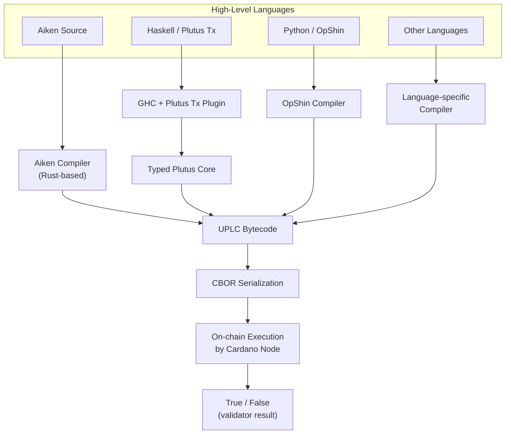
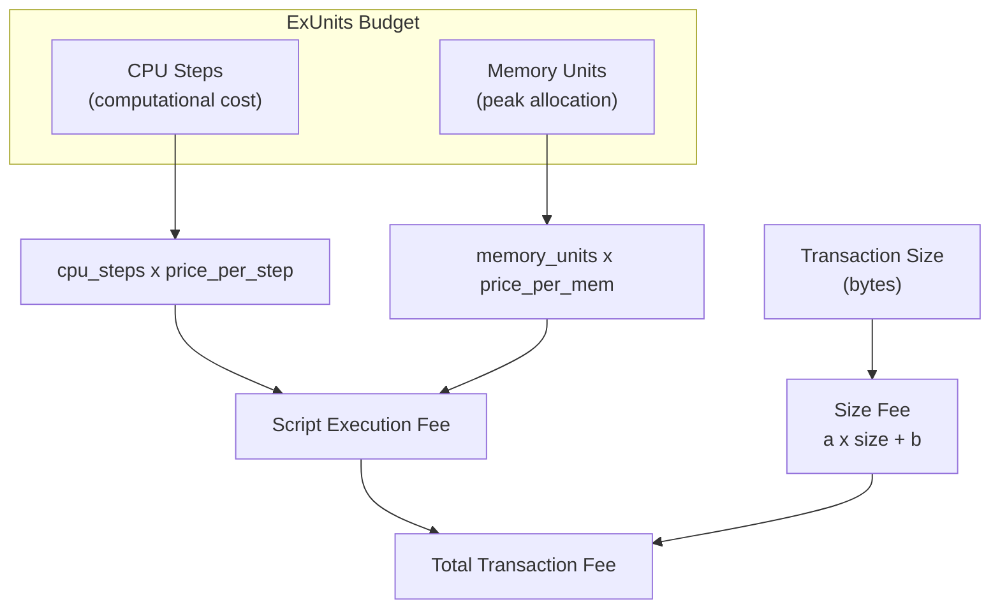

# レッスン #08: Plutus、Aiken、および言語

すべてのCardanoスマートコントラクトは、ソース言語に関係なく、UPLC（Untyped Plutus Lambda Calculus）にコンパイルされます。UPLCはCardanoノードが解釈し実行するミニマリストのバイトコードです。このユニバーサルなコンパイルターゲットにより、Aiken、Plutus Tx、OpShin、Helios、plu-tsなど、人間工学、パフォーマンス、成熟度においてそれぞれ異なるトレードオフを持つ豊かな言語エコシステムが可能になっています。

このレッスンでは、高レベルのソースコードからオンチェーン実行までの経路をたどります。UPLCとは何か、なぜ存在するのか、Plutus TxとAikenがコンパイルの問題にどのように異なるアプローチをとるか、実行コストがどのように測定されバジェットされるか、CIP-57ブループリントが何を提供するか、そしてデプロイされたコードが不変な世界でなぜ形式検証が重要なのかを学びます。

## UPLCとは何か、なぜCardanoのオンチェーンバイトコードなのですか？

UPLC（Untyped Plutus Lambda Calculus）は、スマートコントラクトトランザクションを検証する際に、すべてのCardanoノードが解釈し実行する低レベルのラムダ計算ベースのバイトコードです。どの高レベル言語でもコンパイル出力としてターゲットにできる、最小限で決定論的かつ数学的に厳密な実行レイヤーを提供します。

### UPLCはどのように機能しますか？

UPLCはラムダ計算に基づくミニマリストの関数型プログラミング言語です。このレベルでは型システムが消去されているため「型なし（untyped）」です。Plutusスマートコントラクトプラットフォームの一部として設計されたため「Plutus」です。そして、すべての関数型プログラミングの基礎となる数学的基盤の上に構築されているため「ラムダ計算（Lambda Calculus）」です。

UPLCは少数の操作セットをサポートします：

- **変数**: 束縛された値への参照。
- **ラムダ抽象**: 無名関数（関数定義）。
- **適用**: 関数を引数に適用する（関数呼び出し）。
- **定数**: リテラル値（整数、バイト文字列、ブール値など）。
- **ビルトイン関数**: 固定されたプリミティブ操作のセット（算術、比較、暗号ハッシュ、データ操作など）。
- **ForceとDelay**: 評価を制御するメカニズム（ポリモーフィズムの消去に関連）。
- **Error**: 実行を即座に失敗で停止するターム。

これですべてです。ループなし、ミュータブル変数なし、オブジェクトなし、クラスなし。すべては関数適用と再帰で表現されます。この極端なシンプルさは意図的なものです。言語の分析、推論、すべてのノードでの正確な実装を容易にします。

### なぜCardanoはラムダ計算を選んだのですか？

ラムダ計算を基盤として選択したのは、意図的かつ戦略的な決定でした：

1. **数学的厳密性**: ラムダ計算は1930年代から研究されてきました。その性質は徹底的に理解されており、プログラムの振る舞いについて形式的に推論することが可能です。

2. **決定論性**: 純粋なラムダ計算は本質的に決定論的です。副作用なし、状態の変更なし、I/Oなし。これはCardanoの決定論性要件と完全に一致しています。

3. **実装のシンプルさ**: 各CardanoノードのUPLC評価器は、小さく監査可能なコードです。より単純なランタイムは、バグやセキュリティ脆弱性が少ないことを意味します。

4. **ユニバーサルコンパイルターゲット**: どの高レベル言語でもラムダ計算にコンパイルできます。Webアセンブリ（WebAssembly）がWeb言語のユニバーサルターゲットとして機能するのと同様に、スマートコントラクト言語の「共通語」として機能します。

## Cardanoスマートコントラクトのコンパイルパイプラインはどのように機能しますか？

コンパイルパイプラインは、高レベルのソースコード（Aiken、Plutus Tx、OpShinなど）を言語固有のコンパイラを通じてUPLCバイトコードに変換し、その後CBORシリアライズしてCardanoノードによるオンチェーンストレージと実行に使用します。正確な中間ステップは言語によって異なりますが、最終的にはすべてCBORとしてシリアライズされたUPLCになります。



## HaskellベースのスマートコントラクトにおけるPlutus Txの仕組みは？

Plutus Txは、GHC（Glasgow Haskell Compiler）プラグインとTemplate Haskellメタプログラミングを使用して、コンパイル時にHaskellの式をキャプチャし、Plutus Coreに変換してからUPLCに降下させるオリジナルのCardanoスマートコントラクトフレームワークです。通常のHaskellコードのように見えるものを書き、特殊なスプライスでアノテーションを付けると、コンパイラプラグインがそれをオンチェーンバイトコードに変換します。

```
-- Conceptual Plutus Tx validator structure
mkValidator :: Datum -> Redeemer -> ScriptContext -> Bool
mkValidator datum redeemer ctx =
    -- Validation logic here
    traceIfFalse "wrong redeemer" (redeemer == expectedValue)
```

### Plutus Txの強みは？

- **Haskellエコシステム**: 代数的データ型、型クラス、パラメトリック多相性を含むHaskellの強力な型システムへのアクセス。
- **共有コード**: オンチェーンとオフチェーンのコードで型定義を共有でき、不整合の可能性が減少します。
- **形式検証のポテンシャル**: Haskellの型システムと純粋性により、形式的手法に適しています。
- **成熟したツーリング**: Haskellにはテスト、プロファイリング、分析のための数十年にわたるツールがあります。

### Plutus Txの課題は？

- **急勾配の学習曲線**: Haskellは命令型言語から来た開発者にとって難しいことで知られています。Haskell + ブロックチェーン + Template Haskellの組み合わせは、手強い学習の壁を作ります。
- **コンパイルの複雑さ**: GHCプラグインのアプローチは、ビルド時間が長くなり、エラーメッセージが暗号的になり、すべてのHaskell機能が利用できるわけではないことを意味します（一部の標準ライブラリ関数はPluuts Coreにコンパイルできません）。
- **スクリプトサイズ**: Plutus Txバリデータはバイトサイズが比較的大きくなる可能性があり、手数料が高くなります。
- **限定されたサブセット**: 任意のHaskellは使用できません。Plutus Txコンパイラプラグインが変換できるサブセットのみです。つまり、レイジーI/O、unsafePerformIO、FFI、制限された標準ライブラリの使用はできません。

## Aikenとは何か、なぜ最も人気のあるCardanoスマートコントラクト言語になったのですか？

Aikenは、Cardanoスマートコントラクトの記述のためにゼロから設計された専用プログラミング言語です。開発者体験、高速コンパイル（サブ秒）、効率的なUPLC出力を優先し、Rust、Elm、Gleamなどの現代言語からシンタックスと概念を借りて、馴染みがありながらオンチェーンバリデーション専用に構築されたものを作り出しています。

```
// Conceptual Aiken validator structure
validator my_validator {
  spend(datum: MyDatum, redeemer: MyRedeemer, ctx: ScriptContext) {
    // Validation logic returns Bool
    redeemer.secret == datum.expected_hash
  }
}
```

### Aikenの主な特徴は？

- **高速コンパイル**: Aikenは分単位ではなく秒単位でコンパイルされます。コンパイラはRustで書かれており、非常に高速です。
- **明確なエラーメッセージ**: Elm/Rustの伝統に従い、Aikenは問題を直接指し示す、役立つ人間が読めるエラーメッセージを提供します。
- **組み込みテスト**: Aikenにはテストランナーが含まれているため、外部ツールなしでバリデータのユニットテストを書いて実行できます。
- **効率的な出力**: Aikenのコンパイラは小さく最適化されたUPLCを生成し、同等のPlutus Txバリデータと比較して実行コストが低くなることが多いです。
- **専用の標準ライブラリ**: 標準ライブラリには、スマートコントラクト開発に必要なものだけが含まれています。それ以上でも以下でもありません。
- **強い静的型付け**: 完全な代数的データ型、パターンマッチング、ジェネリクス、型推論。現代の型付き言語のすべての安全性を備えています。
- **ランタイムなし**: Aikenにはガベージコレクタやランタイムシステムがありません。すべてが直接UPLCにコンパイルされます。

### なぜAikenはこれほど強い採用を得ているのですか？

Aikenが新しいCardanoスマートコントラクト開発で最も人気のある選択肢になった理由はいくつかあります：

1. **低い参入障壁**: Rust、TypeScript、またはMLファミリー言語に精通した開発者は、Aikenですぐに生産的になれます。
2. **高速なイテレーション**: サブ秒のコンパイル時間は、開発中の高速なフィードバックループを意味します。
3. **小さなスクリプト**: 最適化されたUPLC出力は、エンドユーザーのトランザクション手数料が低くなることを意味します。
4. **活発なコミュニティ**: Aikenにはライブラリ、ツール、教育リソースの成長するエコシステムがあります。
5. **明確な分離**: Aikenはオンチェーンコード専用です。オフチェーンコードはアプリケーションが使用する言語（TypeScript、Python、Rustなど）で書かれ、Cardanoのアーキテクチャが求めるクリーンなオンチェーン/オフチェーンの分離を促進します。

## Cardanoは他にどのようなスマートコントラクト言語をサポートしていますか？

CardanoはAikenとPlutus Txに加えて、異なる開発者コミュニティをターゲットにしたいくつかの追加言語をサポートしています。OpShinはPythonのサブセットをUPLCにコンパイルし、Heliosは純粋関数型のDSLを提供し、plu-tsではTypeScriptでバリデータを書くことができ、ScalusはScala/JVMサポートを提供します。

### OpShin

OpShinは、Pythonで Cardanoスマートコントラクトを書くことを可能にします。Pythonのサブセットをllに変換してUPLCにコンパイルします。Haskellやさらに Aikenも馴染みがないと感じるPythonの専門知識を持つチームにとって、OpShinはアクセスしやすいエントリーポイントを提供します。

### Helios

Heliosは、Cardanoスマートコントラクト用の純粋関数型ドメイン固有言語です。直接UPLCにコンパイルされ、完全にブラウザで実行できるため、書き込み、コンパイル、送信のフルパイプラインがクライアント側で行われるdApp開発にとって興味深いものです。

### plu-ts

plu-tsは、TypeScriptでCardanoスマートコントラクトを書くことを可能にします。バリデータロジックは、ランタイムに（JavaScriptで）UPLCにコンパイルされるTypeScript関数を使用して表現されます。これはフルスタックTypeScript開発者にとって特に魅力的です。

### Scalus

Scalusは、Cardanoスマートコントラクト開発をScala/JVMエコシステムにもたらし、Scalaの式をUPLCにコンパイルします。

### なぜ言語の多様性が強みなのですか？

言語の多様性はCardanoのアーキテクチャの強みです。UPLCがクリーンで明確に仕様化されたコンパイルターゲットであるため、どの言語でもそれをターゲットにできます。これは、複数の言語（Rust、Go、C++）がWebAssemblyにコンパイルできるのと同様であり、複数のJVM言語（Java、Kotlin、Scala、Clojure）が同じバイトコードをターゲットにするのと同様です。

## Cardanoでスマートコントラクトの実行コストはどのように計算されますか？

Cardanoは、ExUnits（実行ユニット）を使用して2つの次元でスマートコントラクトの実行コストを測定します：CPUステップ（実行された計算ステップ数）とメモリユニット（評価中のピークメモリ消費量）。各スクリプトはリソースバジェットを事前に宣言する必要があり、手数料は消費されたリソースにユニットあたりのプロトコル価格を掛けて計算されます。



### CPUステップとメモリはどのように機能しますか？

**CPU（ステップ）**: CPUはスクリプトが実行する計算ステップの数を測定します。各UPLCビルトイン関数には、その引数に基づいて定義されたCPUコストがあります。小さな整数の加算は安価で、暗号ハッシュは高価です。コストは、各プリミティブ操作をそのCPUコストにマッピングする**コストモデル**によって定義されます。

**メモリ**: メモリは、実行中にスクリプトが使用するメモリの最大量を測定します。評価中に作成される各値はメモリを消費し、合計ピークメモリ使用量がメモリコストを決定します。CPUとは異なり、メモリは累積割り当てではなく、ピーク使用量に関するものです。

### ExUnitsバジェットの制限は？

すべてのPluusスクリプトの実行は、リソースバジェットを（トランザクションの一部として）事前に宣言する必要があります。バジェットは、スクリプトが消費できるCPUステップ数とメモリユニット数を正確に指定します。スクリプトがいずれかの制限を超えると、失敗します。

トランザクションごとおよびブロックごとの制限もあります：

```
Resource Hierarchy:
  Per-Block Budget (shared by all transactions in the block)
    |
    +-- Per-Transaction Budget (shared by all scripts in the transaction)
          |
          +-- Per-Script Budget (declared in the transaction)
```

現在の概算制限（これらはガバナンスを通じて変更可能なプロトコルパラメータです）：

- **トランザクションあたり**: 約100億CPUステップ、約1400万メモリユニット。
- **ブロックあたり**: 約200億CPUステップ、約6200万メモリユニット。

### なぜExUnitsが開発にとって重要なのですか？

ExUnitsを理解することは、以下に直接影響するため不可欠です：

- **実現可能性**: バリデータがトランザクションごとの制限を超えた場合、単純に使用できません。最適化または再構築する必要があります。
- **コスト**: ExUnitsが高いほど、ユーザーの手数料が高くなります。
- **ブロックスペース**: より多くのExUnitsを消費するトランザクションは、ブロックごとのバジェットのより多くを占め、同じブロックに収まる他のトランザクションが少なくなります。

これが、Aikenの効率的なUPLC出力が重要な理由です。より小さく高速なスクリプトは、直接的にコストの削減とユーザー体験の向上につながります。

## CIP-57 Plutusブループリントとは何か、なぜ重要なのですか？

CIP-57 Plutusブループリントは、コンパイルされたスマートコントラクトのインターフェースを記述する標準化された機械可読のJSONドキュメントです。バリデータ名、Datum/Redeemerスキーマ、データ型定義、コンパイルされたUPLCバイトコードを含みます。CardanoにおけるABI（Application Binary Interface）の同等物として機能し、自動コード生成とツーリングの相互運用性を可能にします。

### ブループリントには何が含まれますか？

Plutusブループリントには以下が含まれます：

- **バリデータ情報**: 名前、目的（スペンディング、ミンティングなど）、コンパイルされたスクリプトハッシュ。
- **パラメータスキーマ**: Datum、Redeemer、およびパラメータ化の型と構造。
- **データ定義**: コントラクトで使用されるすべてのカスタムデータ型の完全な型定義。
- **コンパイル済みコード**: 実際のUPLCバイトコード（またはその参照）。

```
// Simplified blueprint structure (conceptual)
{
  "preamble": {
    "title": "My Escrow Contract",
    "version": "1.0.0"
  },
  "validators": [
    {
      "title": "escrow.spend",
      "datum": {
        "schema": { "$ref": "#/definitions/EscrowDatum" }
      },
      "redeemer": {
        "schema": { "$ref": "#/definitions/EscrowAction" }
      },
      "compiledCode": "5901a2010000...",
      "hash": "a1b2c3d4e5..."
    }
  ],
  "definitions": {
    "EscrowDatum": {
      "dataType": "constructor",
      "fields": [
        { "title": "beneficiary", "dataType": "bytes" },
        { "title": "deadline", "dataType": "integer" }
      ]
    }
  }
}
```

### ブループリントは開発をどのように改善しますか？

CIP-57以前は、Cardanoスマートコントラクトとの統合には以下のいずれかが必要でした：
- ソースコードを読んで期待されるDatumとRedeemerの形式を理解する。
- 古くなっている可能性のあるドキュメントに頼る。
- コンパイルされたUPLCをリバースエンジニアリングする（非常に困難）。

ブループリントは、オフチェーンアプリケーションがコントラクトと対話するために必要なすべてを含む、単一の標準化された機械可読のアーティファクトを提供することでこれを解決します。これにより以下が可能になります：

- **コード生成**: ツールがブループリントからTypeScript、Python、またはRustの型を自動的に生成でき、コントラクトとの型安全な対話を保証します。
- **バリデーション**: オフチェーンコードがトランザクションを構築する前に、ブループリントスキーマに対してDatumとRedeemerの値を検証できます。
- **発見可能性**: 開発者はソースコードなしでブループリントを検査してコントラクトのインターフェースを理解できます。
- **ツーリングの相互運用性**: 異なるオフチェーンフレームワーク（Lucid、MeshJS、PyCardanoなど）がすべて同じブループリント形式を利用できます。

Aikenはビルドプロセスの一部としてブループリントを自動的に生成します。Plutus Txの場合、追加のツーリングでブループリントを生成できます。

## なぜ形式検証がスマートコントラクトにとって重要なのですか？

形式検証は、プログラムがテストされた例だけでなく、すべての可能な入力に対して仕様を満たすことを数学的に証明する技術を使用します。バグが取り返しのつかない資金の損失を引き起こし、デプロイされたコードが不変であるスマートコントラクトにおいて、形式検証は検証ロジックがあらゆるシナリオで正しく動作することの最も強力な保証を提供します。

### なぜリスクが特に高いのですか？

Cardano上のスマートコントラクトは、（特定のスクリプトハッシュで）一度デプロイされると不変です。稼働中のコントラクトにパッチを当てることはできません。バリデータに不正な支出を許可するバグがある場合、そのアドレスの資金は危険にさらされ、新しいコントラクトをデプロイして移行する以外に修正する方法はありません（元のコントラクトに移行ロジックが含まれていない場合、不可能かもしれません）。

リスクが特に高い理由：
- **不変性**: ホットフィックスなし、ロールバックなし。
- **財務的エクスポージャー**: コントラクトは多くの場合、相当な価値を保持しています。
- **敵対的環境**: プライベートAPIとは異なり、世界中の誰でもスマートコントラクトの悪用を試みることができます。

### Cardanoはどのような検証アプローチをサポートしていますか？

1. **プロパティベーステスト**: QuickCheck（Haskell）やAikenの組み込みテストなどのツールが、数千のランダムなテストケースを生成し、プロパティが保持されることを確認します。これは形式検証ではありませんが、例ベースのテストでは見逃される多くのバグをキャッチします。

2. **型駆動の正確性**: 強力な型システム（HaskellやAikenのような）は、コンパイル時にバグのカテゴリ全体を防止します。値が正の整数でなければならない場合、型システムがこれを静的に強制できます。

3. **UPLC上の形式的手法**: UPLCはよく理解されたセマンティクスを持つラムダ計算に基づいているため、コンパイルされたバイトコードに形式検証技術を直接適用することが理論的に可能です。

4. **監査**: 専門の監査ファームがスマートコントラクトのソースコードを脆弱性についてレビューします。数学的証明ではありませんが、専門家のレビューは自動化ツールが見逃すバグをキャッチします。

5. **Agdaと形式的証明**: Cardano自体のコアライブラリは、数学的証明を表現しチェックできる依存型言語であるAgdaを使用して形式的に検証されています。一部の研究はこれをスマートコントラクトの検証に拡張しています。

### コントラクトの安全性への実践的な道筋は？

ほとんどの開発者にとって、コントラクトの安全性への現実的な道筋は以下の通りです：

- 強く型付けされた言語（AikenまたはPlutus Tx）で書く。
- プロパティベーステストを広範に使用する。
- 徹底的なユニットテストと統合テストを書く。
- 重要な価値を扱うコントラクトについては専門的な監査を受ける。
- バリデータを小さく焦点を絞ったものに保つ。コードが少ないほど、バグの表面積が少なくなります。
- 新しいパターンを発明するのではなく、確立されたパターン（次のレッスンで取り上げます）を使用する。

## コストモデルはUPLCプリミティブをどのように価格設定しますか？

コストモデルは、各UPLCビルトイン関数をその引数に基づく決定論的なコスト計算式にマッピングするプロトコルパラメータ（Cardanoガバナンスを通じて調整可能）のセットです。シンプルな操作は安価で、入力サイズに応じてスケールする操作はそれに応じて価格設定され、暗号操作はその計算集約性のためにより高価です。

```
Examples of cost model entries (conceptual):
  addInteger:       cpu = 205665 + 812 * max(arg1_size, arg2_size)
  sha2_256:         cpu = 1927926 + 82523 * arg_size
  equalsByteString: cpu = 245000 + 216773 * min(arg1_size, arg2_size)
  ifThenElse:       cpu = 80556 (constant)
```

コストモデルは以下を保証します：
- シンプルな操作は安価です。
- 入力サイズに応じてスケールする操作はそれに応じて価格設定されます。
- 計算コストが高い暗号操作はより高価です。
- コストは決定論的です。同じ操作と同じ引数は常に同じコストになります。

コストモデルを理解することは、効率的なバリデータを書くのに役立ちます。例えば、2つのバイト文字列を比較する必要がある場合、1回の比較は両方をハッシュしてハッシュを比較するよりもはるかに安価です（ハッシュが高価なため）。

## Web2アナロジー

**UPLC = JavaScript（コンパイルターゲット）**: TypeScript、CoffeeScript、Elm、PureScriptがすべてブラウザでの実行のためにJavaScriptにコンパイルされるように、Aiken、Plutus Tx、OpShin、その他のCardano言語はすべてオンチェーンでの実行のためにUPLCにコンパイルされます。チームの専門知識や好みに合う言語を選択しますが、ランタイムは同じです。

**UPLC = WebAssembly**: さらに近いアナロジーはWASM（WebAssembly）です。WASMはRust、C++、Goなどのコンパイルターゲットとなる低レベルのバイナリ形式です。制御されたリソース制限を持つサンドボックス環境で実行されます。UPLCはCardanoにとって同じ役割を果たします：低レベルでサンドボックス化された、リソース制限のある実行ターゲットです。

**ExUnits = クラウド関数の課金**: AWS Lambdaはリクエスト数、実行時間（ミリ秒単位）、割り当てられたメモリに基づいて課金されます。CardanoのExUnitsも同じように機能します。CPUステップ（実行時間）とメモリ（割り当て）に対して支払います。Lambda関数を最適化してコストを削減するように、バリデータを最適化してExUnitsを削減します。

**CIP-57ブループリント = APIスキーマ（OpenAPI/Swagger）**: OpenAPI仕様はREST APIのエンドポイント、リクエストボディ、レスポンススキーマ、認証要件を記述します。Plutusブループリントはバリデータの Datumスキーマ、Redeemerスキーマ、コンパイル済みコードを記述します。どちらも同じ目的を果たします：その実装を読まずに、ツールと開発者がサービスと正しく対話できるようにします。

**コストモデル = クラウドの価格ティア**: クラウドプロバイダーは、APIコールあたり、GBストレージあたり、100万リクエストあたりのコストを示す詳細な価格ページを公開しています。Cardanoのコストモデルも同じ概念です：すべての計算操作に対する公開された透明な価格構造です。主な違いは、Cardanoの価格設定が企業の課金部門ではなく、プロトコルのコンセンサスによって強制されることです。

**形式検証 = 型安全なAPI**: TypeScriptの厳密モードを使用したことがあれば、ランタイムではなくコンパイル時にエラーをキャッチする価値を知っているでしょう。形式検証はこのアイデアを拡張します。型エラーをキャッチする代わりに、論理エラーをキャッチします。ビジネスロジック用のTypeScriptの型システムのようなもので、ルールが違反されないことの数学的証明を伴います。

## 重要なポイント

- **UPLCはユニバーサルな実行レイヤー**です：すべてのCardanoスマートコントラクト言語は、ソース言語に関係なく、このラムダ計算ベースのバイトコードにコンパイルされます。
- **Aikenは最も人気のある選択肢**であり、新しいCardanoスマートコントラクト開発において、高速コンパイル、明確なエラーメッセージ、効率的な出力、穏やかな学習曲線を提供しています。
- **Plutus TxはHaskellの完全なパワーを提供**しますが、より急な学習曲線とより複雑なビルドプロセスがあります。Haskellエコシステムに深く組み込まれたプロジェクトにとって引き続き重要です。
- **実行コスト（ExUnits）は2次元**です：CPUステップとメモリであり、スクリプトを含むトランザクションの手数料を直接決定します。
- **CIP-57ブループリントはコントラクトインターフェースを標準化**し、コード生成、ツーリングの相互運用性、信頼性の高いオフチェーン統合を可能にします。

## 次のステップ

バリデータがどのように書かれコンパイルされるかを理解したところで、次はすべてのバリデータが受け取る3つの引数を理解する時です。レッスン9では、Datum、Redeemer、ScriptContextについて深く掘り下げます。すべてのCardanoスマートコントラクトロジックを支えるデータモデルと、このアーキテクチャから生まれる一般的なパターンを探求します。
