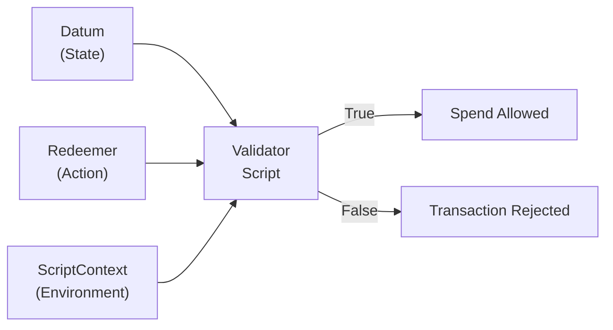
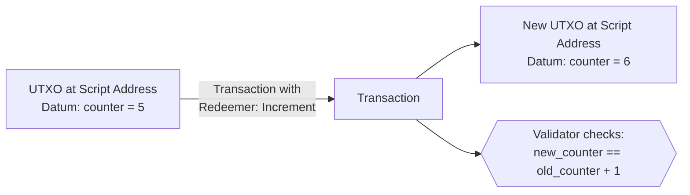

# レッスン #09: Datum、Redeemer、ScriptContext

すべてのCardanoバリデータは、正確に3つの引数を受け取ります：Datum（スクリプトアドレスにロックされた状態）、Redeemer（使用者が提出するアクション）、およびScriptContext（トランザクション全体の包括的なスナップショット）。これら3つの引数により、バリデータはUTXOが使用可能かどうかについて認可判断を下すために必要なすべての情報を得ます。

このレッスンでは、各引数を詳細に分析し、それらがどのように連携するかを探り、Datumがオンチェーンでどのように保存されるかの進化を検証し、リファレンススクリプトを理解し、この3引数アーキテクチャから生まれる一般的な設計パターンを調査します。

## すべてのCardanoバリデータが受け取る3つの引数とは？

すべてのCardanoバリデータは、Datum（UTXOにロックされた状態）、Redeemer（使用者が実行したいアクション）、およびScriptContext（すべてのインプット、アウトプット、署名、ミント操作を含むトランザクションの完全なスナップショット）を受け取ります。バリデータは3つすべてを検査し、`True`（許可）または`False`（拒否）を返します。



トランザクションがスクリプトアドレスにあるUTXOを使おうとすると、Cardanoノードはこれら3つの引数でバリデータスクリプトを呼び出します：

```
validator(datum, redeemer, scriptContext) -> Bool
```

1. **Datum**: 使用されるUTXOに関連付けられたデータ。スクリプトアドレスにロックされた「状態」を表します。
2. **Redeemer**: UTXOを使おうとしているトランザクションが提供するデータ。使用者が取りたい「アクション」を表します。
3. **ScriptContext**: すべてのインプット、アウトプット、署名、ミントなどを含む、トランザクション全体の包括的なスナップショット。検証が行われる「環境」を表します。

それぞれを詳しく見ていきましょう。

## DatumはCardanoでどのように状態を表現しますか？

Datumは、UTXOの作成時に添付される構造化データであり、バリデータがその特定のUTXOについて判断を下すために必要な情報をエンコードします。Cardanoには永続的なコントラクトストレージがないため、状態はUTXOに添付されたDatumを通じて表現されます。状態の「更新」とは、古いUTXOを消費し、更新されたDatumを持つ新しいものを作成することを意味します。

### Datumには何を含めることができますか？

Datumは、Cardanoのオンチェーンデータ形式（PlutusData）にシリアライズできる任意の構造化データを含むことができます。一般的な例は以下の通りです：

- **所有権情報**: UTXOを請求できる人を識別する公開鍵ハッシュ。
- **期限**: 特定のアクションが許可または禁止された後のPOSIXタイムスタンプまたはスロット番号。
- **状態値**: カウンター、残高、設定パラメータ、またはアプリケーション固有の状態。
- **ハッシュまたは識別子**: オフチェーンデータ、他のUTXO、またはポリシーIDへの参照。

```
-- Example: Escrow datum
EscrowDatum {
  beneficiary: PubKeyHash,       -- who can claim
  deadline: POSIXTime,           -- when the deadline expires
  refund_address: PubKeyHash     -- who gets a refund after deadline
}

-- Example: Auction datum
AuctionDatum {
  seller: PubKeyHash,
  highest_bid: Integer,
  highest_bidder: PubKeyHash,
  lot_asset: AssetClass,
  min_bid_increment: Integer,
  auction_end: POSIXTime
}
```

### Datumベースの状態管理はどのように機能しますか？

Ethereumのようなアカウントベースのシステムでは、スマートコントラクトの状態は永続的なストレージ変数に存在します。Cardanoには永続的なストレージがありません。代わりに、**状態はUTXOに添付されたDatumにエンコードされます**。

バリデータが状態を「更新」したい場合、トランザクションは古いUTXO（古いDatum付き）を消費し、同じスクリプトアドレスに新しいUTXO（更新されたDatum付き）を作成します。バリデータは状態遷移が有効であることをチェックします。



このパターン（UTXOを消費し、更新された状態で再作成する）は、Cardanoにおける状態管理の基本的なメカニズムです。スクリプトアドレスが引き続きUTXOを保持し、新しいデータを持つだけなので、**「継続アウトプット」パターン**と呼ばれることもあります。

### Datumハッシュとインラインの違いは？

歴史的に、Cardanoは2つの方法でDatumを保存しており、その進化を理解することが重要です：

**Datumハッシュ（Vasil以前）**: UTXO自体にはDatumの*ハッシュ*のみが含まれていました。実際のDatumデータは、UTXOを作成したトランザクション（トランザクションの補助データに保存）またはUTXOを使用するトランザクションで提供される必要がありました。これは以下を意味しました：
- UTXOを使用するには、完全なDatum（ハッシュだけでなく）を知る必要がありました。
- Datumは使用トランザクションに含める必要があり、サイズが増加しました。
- Datumが大きい場合、手数料が大幅に増加しました。
- Datumを見失った場合、UTXOは事実上使用不能になりました（資金が永遠にロックされました）。

**インラインDatum（Vasil以降、CIP-32）**: Vasilハードフォーク以降、DatumをUTXO自体に直接（「インライン」で）保存できるようになりました。これは以下を意味します：
- オンチェーンのUTXOを検査することで、誰でもDatumを読み取ることができます。
- 使用トランザクションは完全なDatumを別途含める必要がありません。
- Datumデータを見失うリスクがありません。
- 他のトランザクションがリファレンスインプット（CIP-31）を介してこのDatumを参照できます。

```
Pre-Vasil UTXO:                    Post-Vasil UTXO:
+---------------------+            +---------------------+
| Address             |            | Address             |
| Value               |            | Value               |
| Datum Hash: 0xabc.. |            | Inline Datum:       |
+---------------------+            |   { counter: 5,     |
                                   |     owner: 0x123 }  |
Full datum must be                 +---------------------+
stored and provided
separately                         Datum is right there,
                                   readable by anyone
```

**ベストプラクティス**: 実質的にすべての新しい開発でインラインDatumを使用してください。Datumハッシュは後方互換性のために引き続き機能しますが、ほぼすべてのシナリオでインラインDatumが優れています。

## RedeemerはCardanoスマートコントラクトでどのようにアクションを表現しますか？

Redeemerは、UTXOを使おうとするトランザクションが提供するデータであり、使用者が実行したいアクションをバリデータに伝えます。その構造はバリデータによって完全に定義され（プロトコルは要件を課しません）、一般的にタグ付きアクションコンストラクタの形式を取り、単一のバリデータが複数の異なる操作をサポートすることを可能にします。

### Redeemerには何を含めることができますか？

Redeemerは任意のPlutusData値を取ることができます。一般的なパターンは以下の通りです：

**シンプルな値**: パスワード、シークレット、数値。
```
-- Simple: just provide the secret
Redeemer = ByteString   -- the secret that hashes to the datum
```

**アクションタグ**: 使用者が実行したいアクションを指定する列挙型。
```
-- Tagged actions for a multi-action contract
Redeemer =
  | Bid { amount: Integer }
  | Close
  | Cancel
  | Update { new_price: Integer }
```

**証明データ**: 使用者が認可されていることの証拠。
```
-- Merkle proof for airdrop claiming
Redeemer = MerkleProof {
  leaf_index: Integer,
  proof_hashes: List<ByteString>
}
```

### マルチアクションバリデータはどのようにRedeemerを使用しますか？

Redeemerは、使用者が試みている*操作の種類*をバリデータに伝えます。これにより、単一のバリデータが複数の異なる操作をサポートできます。バリデータはRedeemerに対してパターンマッチングを行い、どの検証ルールを適用するかを決定します：

```
validator multi_action(datum: State, redeemer: Action, ctx: ScriptContext) -> Bool {
  when redeemer is {
    Bid { amount } ->
      -- Check bid is higher than current, signed by bidder, etc.
      validate_bid(datum, amount, ctx)

    Close ->
      -- Check auction has ended, winner gets the lot, seller gets payment
      validate_close(datum, ctx)

    Cancel ->
      -- Check only the seller can cancel, and only before any bids
      validate_cancel(datum, ctx)
  }
}
```

このパターンはCardanoのスマートコントラクト開発において普遍的です。ほぼすべての非自明なバリデータは、異なる操作を表現するために複数のコンストラクタを持つRedeemerを使用します。

### Redeemerのサイズはトランザクションコストにどのように影響しますか？

Redeemerはトランザクションボディに含まれるため、そのサイズがトランザクション手数料に影響します。Redeemerは実用的な範囲でできるだけ小さく保ちましょう。Redeemerに大きなマークル証明やその他のかさばるデータが含まれる場合、コストが増加します。

## ScriptContextはバリデータにどのような情報を提供しますか？

ScriptContextは3つの引数の中で最もリッチです：検証対象のトランザクション全体を記述する、Cardanoノードが提供する包括的なデータ構造です。TxInfo（すべてのインプット、アウトプット、署名、ミント、手数料、有効期間など）と、バリデータが呼び出される理由を示すScriptPurpose（スペンディング、ミンティング、認証、報酬）を含みます。

### TxInfoには何が含まれますか？

```
TxInfo {
  inputs:             List<TxInInfo>,       -- all inputs being consumed
  reference_inputs:   List<TxInInfo>,       -- all reference inputs (read-only)
  outputs:            List<TxOut>,          -- all outputs being created
  fee:                Value,                -- transaction fee
  mint:               Value,                -- tokens being minted/burned
  certificates:       List<DCert>,          -- stake certificates
  withdrawals:        Map<StakingCred, Int>,-- reward withdrawals
  valid_range:        POSIXTimeRange,       -- validity interval
  signatories:        List<PubKeyHash>,     -- who signed the transaction
  redeemers:          Map<ScriptPurpose, Redeemer>,
  datums:             Map<DatumHash, Datum>,
  id:                 TxId                  -- the transaction hash
}
```

### ScriptPurposeとは？

ScriptPurposeは、バリデータが*なぜ*呼び出されているかを伝えます：

```
ScriptPurpose =
  | Spending TxOutRef      -- spending a UTXO at a script address
  | Minting PolicyId       -- minting/burning tokens under this policy
  | Certifying DCert       -- issuing a stake certificate
  | Rewarding StakeCred    -- withdrawing staking rewards
  | Voting Voter           -- governance voting (Plutus V3)
  | Proposing              -- governance proposals (Plutus V3)
```

### バリデータは通常ScriptContextで何をチェックしますか？

ScriptContextは、最も興味深い検証ロジックが行われる場所です。以下は最も一般的なチェックです：

**署名検証**: 「トランザクションは期待される鍵で署名されていますか？」
```
-- Check that the datum's owner signed the transaction
list.has(ctx.transaction.signatories, datum.owner)
```

**アウトプット検査**: 「トランザクションは正しいアウトプットを作成していますか？」
```
-- Check that value is sent to the correct address
expect Some(output) = find_output_to(ctx.transaction.outputs, beneficiary_address)
output.value >= expected_amount
```

**時間範囲チェック**: 「トランザクションは許可された時間ウィンドウ内ですか？」
```
-- Check that the deadline has passed
valid_range_start(ctx.transaction.valid_range) > datum.deadline
```

**ミント検査**: 「正しいトークンがミントされていますか？」
```
-- Check that exactly one token is minted under our policy
let minted = ctx.transaction.mint
quantity_of(minted, own_policy_id, token_name) == 1
```

**インプットカウント**: 「正しいUTXOが消費されていますか？」
```
-- Check that the oracle UTXO is included as a reference input
list.any(ctx.transaction.reference_inputs, fn(input) {
  input.output.address == oracle_address
})
```

### なぜScriptContextはそれほど強力なのですか？

ScriptContextは、Cardanoのバリデータが「ただの」ブール関数でありながら非常に表現力豊かな理由です。バリデータは、それが守っている単一のUTXOだけでなく、*トランザクション全体*について複雑な条件を強制できます。これにより、バリデータが自分のインプットしか見ることができない場合には不可能なパターンが可能になります：

- **マルチバリデータの協調**: 同じトランザクション内で実行される2つのバリデータが、互いが強制する条件をそれぞれチェックでき、直接通信なしに協調的な検証ロジックを作成します。
- **アトミックスワップ**: バリデータはトランザクション内に特定のアウトプットが存在することを検証でき、単一のトランザクションでトラストレスな交換を可能にします。
- **フォワーダーパターン**: バリデータは、トランザクション内に別のスクリプトインプットが存在することをチェックすることで、その判断を別のバリデータに委任できます。

## Cardanoにおける一般的なスマートコントラクト設計パターンは？

Datum-Redeemer-Contextアーキテクチャから、ステートマシン、マルチバリデータの協調、ワンショットのユニークネス保証、効率化のためのwithdraw-zeroトリック、UTXO発見可能性のためのビーコン/ポインタートークンなど、いくつかの設計パターンが生まれました。これらのパターンを理解することは、Cardanoにおけるスマートコントラクト設計に不可欠です。

### パターン1: ステートマシン

ステートマシンは、Datumに有限の状態のセットを、Redeemerに遷移のセットをエンコードします。バリデータは、現在の状態に対して各遷移が有効であることをチェックします。

```
Datum (State):          Redeemer (Transition):
  | Collecting          | Contribute { amount }
  | Funded              | Dispute
  | Disputed            | Resolve { ruling }
  | Completed           | Complete

Validator checks:
  Collecting + Contribute -> is amount sufficient? -> Collecting or Funded
  Funded + Dispute -> is disputer authorized? -> Disputed
  Disputed + Resolve -> is resolver the arbiter? -> Completed
  Funded + Complete -> has timeout passed? -> Completed
```

トランザクションは古い状態のUTXOを消費し、新しい状態のUTXOを作成します。バリデータは遷移が合法であることを検証します。

### パターン2: マルチバリデータ（バリデータリンキング）

複雑なアプリケーションは、単一のトランザクション内で協調する複数のバリデータを使用することがよくあります。例えば、DEX（分散型取引所）は以下を持つ可能性があります：

- プールの準備金を守る**流動性プールバリデータ**。
- LPトークンを制御する**ミントポリシー**。
- 保留中のスワップ注文を保持する**注文バリデータ**。

3つのバリデータすべてが単一のトランザクション内で実行されます。流動性プールバリデータはミントポリシーが正しいLPトークンを作成したことをチェックします。ミントポリシーはプールUTXOが消費されていることをチェックします。互いを呼び出すのではなく、ScriptContextを通じて同じトランザクションについて条件を独立して検証します。

```
Single Transaction:
  Inputs:
    - Pool UTXO (guarded by pool validator)
    - Order UTXO (guarded by order validator)

  Mint:
    - LP tokens (guarded by minting policy)

  Outputs:
    - Updated Pool UTXO (new reserves)
    - LP tokens to liquidity provider
    - Swapped tokens to trader

Each validator independently checks its rules against ScriptContext:
  Pool validator:  "Are reserves correctly updated? Are LP tokens minted?"
  Order validator: "Is the swap executed at the correct price?"
  Minting policy:  "Is the pool UTXO consumed? Is the amount correct?"
```

### パターン3: ワンショットパターン

ワンショットパターンは、特定のUTXOをインプットとして使用してユニークネスを保証します。各UTXOは一度しか使用できないため、特定のUTXOをインプットとして要求するバリデータやミントポリシーは、ブロックチェーンの全履歴を通じて一度だけ成功できます。これは一般的に以下に使用されます：

- **ユニークトークンのミント**: 特定のUTXOをインプットとして要求してNFTをミントします。そのUTXOは二度と存在できないため、ミントは繰り返せません。
- **コントラクトの初期化**: コントラクトの初期状態が一度だけ作成されることを保証します。

### パターン4: Withdraw Zeroトリック

スペンディングバリデータが、ステーキングスクリプトアドレスからのゼロADA引き出しを要求することで、そのロジックをステーキングバリデータに委任する巧妙なパターンです。ステーキングバリデータはトランザクション全体に対して一度実行されますが（トリガーするインプットの数に関係なく）、スペンディングバリデータはインプットごとに一度実行されます。これは、トランザクションが同じスクリプトアドレスから多くのUTXOを使用する場合により効率的です。

```
Spending validator (runs per input):
  "Check that the transaction includes a withdrawal from staking_script_address"

Staking validator (runs once for the whole transaction):
  "Perform the actual validation logic for all inputs"
```

### パターン5: ビーコン/ポインタートークン

ビーコントークンは、Datumとともにスクリプトアドレスにロックされたネイティブトークンです。UTXOを見つけやすくする「ポインタ」として機能します。ビーコンがなければ、スクリプトアドレスで特定のUTXOを見つけるには、そのアドレスのすべてのUTXOをスキャンしてDatumを検査する必要があります。ビーコントークン（スクリプトアドレスに保持されるユニークなトークン）があれば、チェーンにトークンの場所をクエリして、即座に正しいUTXOを見つけることができます。

```
UTXO at script address:
  Value: 5 ADA + 1 BEACON_TOKEN
  Datum: { state data... }

Querying for BEACON_TOKEN immediately locates this specific UTXO
among potentially thousands at the same script address.
```

## リファレンススクリプト（CIP-33）はどのようにトランザクションコストを削減しますか？

リファレンススクリプトにより、コンパイルされたバリデータをUTXOに一度保存し、それを必要とするすべての将来のトランザクションから参照できます。すべてのトランザクションにフルスクリプトバイトを含める代わりに参照することで、トランザクションサイズを削減し（手数料の低下）、バリデータの複雑さに対する実用的な制限を取り除き、すべてのユーザー間で共有されるワンタイムデプロイメントコストを可能にします。

```
Step 1: Store the script in a UTXO
  Transaction creates:
    UTXO_Script at some_address
      Value: min ADA
      Reference Script: [compiled validator bytecode]

Step 2: Use the script via reference
  Transaction spends from script_address:
    Reference Input: UTXO_Script (not consumed, just referenced)
    Input: UTXO at script_address (being spent)
    Redeemer: { action data }

    The node reads the script from UTXO_Script
    and uses it to validate the spend.
```

### リファレンススクリプトの利点は？

- **低い手数料**: トランザクションにスクリプトバイトを含めないため、数千バイトを節約できます。
- **ワンタイムデプロイメントコスト**: スクリプトは一度保存され、すべてのトランザクションで再利用されます。
- **より大きなバリデータ**: スクリプトがトランザクションに含まれないため、トランザクションごとのサイズ制限が制約になりにくくなります。
- **より良いユーザー体験**: ウォレットはスクリプトをローカルに持つ必要がなく、オンチェーンのコピーを参照するだけです。

### リファレンススクリプトのデプロイ方法は？

リファレンススクリプトのデプロイは通常以下のように行われます：

1. バリデータをUPLCにコンパイルします。
2. リファレンススクリプトフィールドにコンパイルされたスクリプトを含むUTXOを出力するトランザクションを作成します。
3. このUTXOを管理するアドレスに送信します（使用する必要はなく、存在するだけで良いですが、管理できるようにします）。
4. UTXOリファレンス（トランザクションハッシュ + インデックス）をユーザーとオフチェーンアプリケーションに配布します。
5. バリデータと対話するすべての後続のトランザクションは、スクリプトを含める代わりにこのUTXOを参照します。

リファレンススクリプトのUTXOは、利用可能にしたい限り未使用のままでなければなりません。消費された場合、それを参照するトランザクションは失敗します。これが、リファレンススクリプトが通常、誤って使用されることのないアドレスに送信される理由です。

## Datum、Redeemer、ScriptContextはどのように連携しますか？

Datum、Redeemer、ScriptContextがどのように連携するかを見るために、完全な例をたどりましょう。シンプルなベスティングコントラクトを考えます：アリスが1000 ADAをボブのためにロックし、ボブは特定の日付以降にそれを請求できます。

**ステップ1: 資金のロック**

アリスはベスティングスクリプトアドレスにアウトプットを持つトランザクションを作成します：
```
Output:
  Address: vesting_script_address
  Value: 1000 ADA
  Inline Datum: {
    beneficiary: Bob's PubKeyHash,
    deadline: 1735689600  (January 1, 2025, as POSIX time)
  }
```

**ステップ2: ボブの請求（期限後）**

ボブはスペンディングトランザクションを構築します：
```
Input: The UTXO Alice created (at vesting_script_address)
Redeemer: Claim   (a simple tag indicating the action)
Output: 999.8 ADA to Bob's wallet address
Fee: 0.2 ADA
Validity Interval: invalid_before = slot corresponding to Jan 2, 2025
Signatures: Bob's signature
```

**ステップ3: バリデータの実行**

ノードはベスティングバリデータを以下の引数で呼び出します：

- **Datum**: `{ beneficiary: Bob's PubKeyHash, deadline: 1735689600 }`
- **Redeemer**: `Claim`
- **ScriptContext**: 以下を含む完全なトランザクション情報：
  - `signatories`: [Bob's PubKeyHash]
  - `valid_range`: 2025年1月1日以降に開始
  - `outputs`: [999.8 ADA to Bob's address]

バリデータのチェック：
1. トランザクションは`datum.beneficiary`（ボブ）によって署名されていますか？`ctx.transaction.signatories`をチェックします。
2. 期限は過ぎていますか？`datum.deadline`が`ctx.transaction.valid_range`の開始より前であることをチェックします。

両方の条件がtrueなので、バリデータは`True`を返し、トランザクションは次のブロックに含まれます。

**ステップ3b: 誰かが早期に請求しようとした場合は？**

イブが2025年1月1日より前に開始する有効期間で期限前に請求しようとした場合、バリデータは時間条件をチェックして`False`を返します。トランザクションは拒否されます。トランザクションがオンチェーンに載らなかったため、イブは何も支払いません。

## Web2アナロジー

**Datum = データベースの行**: Datumはデータベーステーブルの行のようなものです。特定のレコード（UTXO）に関連付けられた構造化データ（「状態」）を保持します。状態を更新する場合、基本的に古い行をDELETEして新しい行をINSERTします（古いUTXOを消費し、新しいものを作成する）。バリデータは更新が有効であることをチェックするデータベースの制約やトリガーとして機能します。

**Redeemer = APIリクエストボディ**: Redeemerは、REST APIへのPOSTまたはPUTリクエストのJSONボディのようなものです。サーバー（バリデータ）にクライアントが実行したいアクションを伝え、それを行うために必要なデータを提供します。`{ "action": "bid", "amount": 500 }`というリクエストボディは、`Bid { amount: 500 }`というRedeemerと全く同じものに類似しています。

**ScriptContext = リクエストコンテキスト/ミドルウェア**: ScriptContextは、ExpressやDjangoのミドルウェアで利用可能な完全なHTTPリクエストコンテキストのようなものです。リクエストヘッダー（署名）、リクエストボディ（Redeemer、インプット）、構築中のレスポンス（アウトプット）、認証情報（署名者）、タイミング情報（有効期間）を含みます。ミドルウェアがリクエストの任意の側面を検査して認可判断を下せるように、バリデータはトランザクションの任意の側面を検査できます。

**インラインDatum = 埋め込みドキュメント（MongoDB）**: DatumハッシュからインラインDatumへの移行は、外部キー（他の場所のデータへの参照）を保存することと、完全なドキュメントを直接埋め込む（MongoDBのように）ことの違いに類似しています。インラインDatumは「埋め込みドキュメント」アプローチです。データがそこにあり、自己完結的で即座にアクセス可能です。

**リファレンススクリプト = 共有ライブラリ/CDN**: リファレンススクリプトは、CDNにホストされたJavaScriptライブラリのようなものです。すべてのページがjQueryをローカルにバンドルする代わりに、同じCDNホストのコピーを参照します。同様に、すべてのトランザクションが完全なバリデータスクリプトを含める代わりに、同じオンチェーンのコピーを参照します。利点は同じです：小さなペイロード、高速な読み込み、シングルソースの更新。

**ステートマシン = ワークフローエンジン**: ステートマシンパターンは、使用したことがあるかもしれないワークフローエンジンに直接マッピングされます：AWS Step Functions、Temporal、またはReduxのシンプルなステートマシンなどのツールです。各状態（Datum）には有効な遷移のセット（Redeemer）があり、エンジン（バリデータ）は遷移が定義されたルールに従うことを保証します。

**マルチバリデータ = マイクロサービストランザクション**: マルチバリデータパターンは、マイクロサービス間の分散トランザクションのようなものです。サーガパターンでは、複数のサービスがそれぞれ操作の一部を検証します。Cardanoでは、複数のバリデータがそれぞれトランザクションの一部をチェックします。主な違いは、Cardanoのアプローチがアトミックであることです。すべてのバリデータが同意するか、トランザクション全体が失敗します。処理すべき部分的な失敗はありません。

## 重要なポイント

- **Datumは状態です**: スクリプトアドレスにロックされたデータを表し、バリデータが必要とする情報をエンコードします。すべての新しい開発でインラインDatumを使用してください。
- **Redeemerはアクションです**: 使用者が何をしたいかを表し、通常タグ付きコンストラクタを使用して単一のバリデータ内で複数の操作をサポートします。
- **ScriptContextは環境です**: トランザクションの完全なビューを提供し、バリデータがインプット、アウトプット、署名、時間、ミントなどに関するルールを強制できるようにします。
- **状態はUTXOの消費と作成を通じて管理されます**: 「継続アウトプット」パターンは、ミュータブルストレージをアトミックな状態遷移に置き換えます。
- **リファレンススクリプトとインラインDatumは効率を大幅に改善します**: トランザクションサイズの削減、手数料の低下、オフチェーン開発の簡素化を実現します。

## 次のステップ

バリデータがどのように機能し、どのようなデータを受け取るかをしっかりと理解したところで、Cardanoの最も特徴的な機能の1つを探求する準備が整いました：ネイティブトークンです。レッスン10では、ミントポリシーが同じDatum-Redeemer-Contextアーキテクチャを使用してトークン作成を制御する方法と、Cardanoのマルチアセット台帳が他のチェーンのトークンモデルとどのように根本的に異なるかを学びます。
