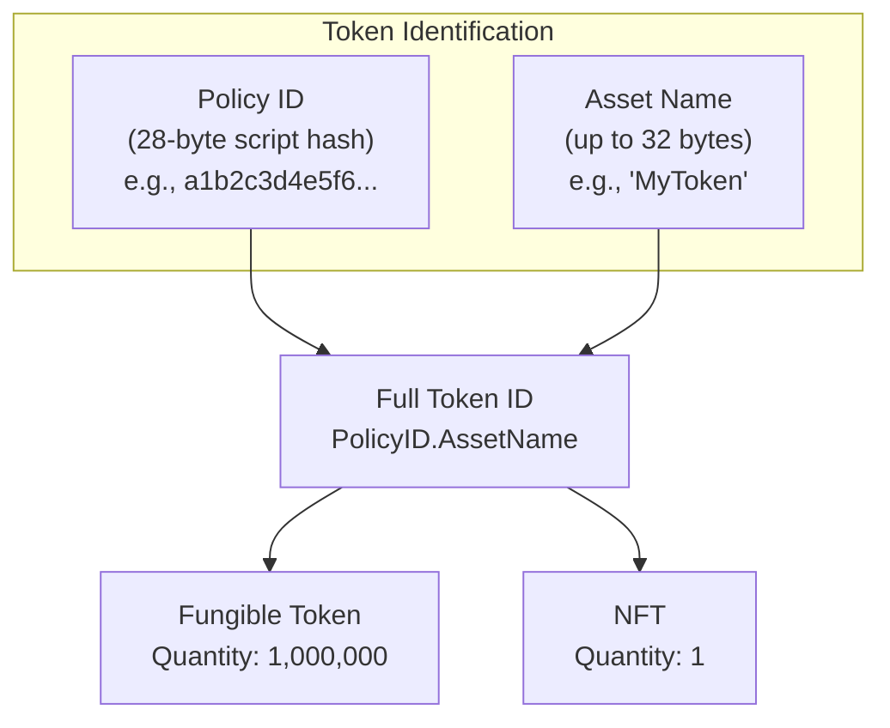
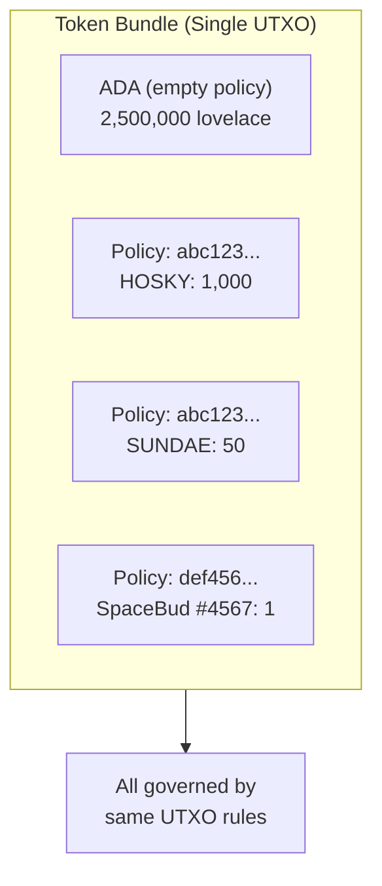
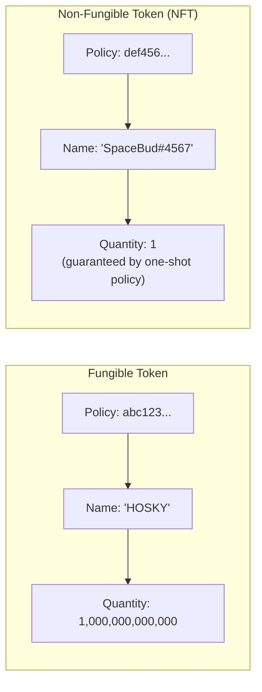
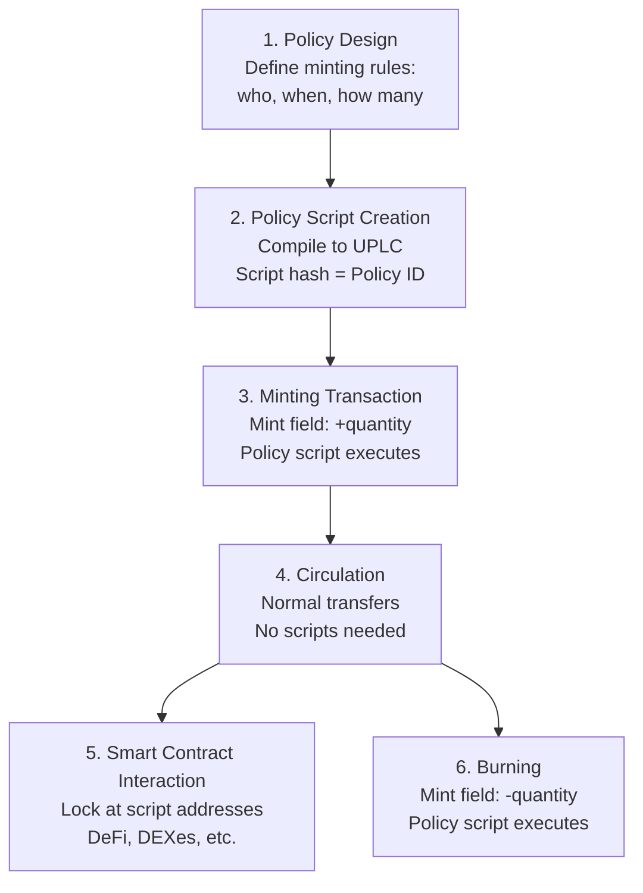

# レッスン #10: ネイティブトークンとミントポリシー

Cardanoのネイティブトークンは、スマートコントラクトを必要とせずに、ADAとともにプロトコルの台帳インフラストラクチャによって直接追跡されるカスタムアセットです。EthereumのERC-20やERC-721トークン（独自の台帳を維持するスマートコントラクト）とは異なり、CardanoのトークンはADAと同じUTXOシステム内にネイティブに存在し、送金をより安価で安全、かつアトミックにコンポーザブルにします。

このレッスンでは、Cardanoにおけるネイティブトークンの仕組みを、ポリシーIDとアセット名の基本からトークン作成を制御するミントポリシーまで探求します。ファンジブルトークンとNFTの違い、トークンを含むUTXOのmin ADA要件を理解し、ミントポリシーが前のレッスンで学んだバリデータ、Datum、Redeemerにどのように接続するかを確認します。

## Cardanoのトークンが他のブロックチェーンと比べて「ネイティブ」な理由は？

Cardanoのトークンが「ネイティブ」なのは、プロトコルの台帳がADAを追跡するのと同じUTXO機構を使用してトークンを追跡し、基本的な送金にスマートコントラクトの実行を必要としないためです。これにより、手数料が低く、送金にコントラクト実行のリスクがなく、単一のアウトプットでアトミックなマルチアセットトランザクションが可能になり、プロトコルレベルの保存則がトークンの不正な作成や使用を防止します。

Ethereumでは、トークンを作成するということは、インターフェース（ファンジブルトークン用のERC-20、NFT用のERC-721）を実装するスマートコントラクトをデプロイすることを意味します。トークンの台帳（誰がいくら所有しているか）はコントラクトの状態に保存されます。トークンの送金は、ストレージ変数を更新するコントラクトの`transfer`関数を呼び出すことを意味します。

Cardanoでは、トークンは**ネイティブ**です。ADAを追跡する同じ台帳機構によって追跡されます。トランザクションでネイティブトークンを送信する場合、プロトコルはADAと同じ方法で処理します：インプットとアウトプットを通じて。基本的な送金にスマートコントラクトの実行は必要ありません。

## Cardanoでトークンはどのように識別されますか？

Cardanoのすべてのネイティブトークンは、ポリシーID（トークンの作成を認可したミントポリシースクリプトの28バイトハッシュ）とオプションのアセット名（同じポリシー内の個々のトークンを区別する最大32バイト）の2つのコンポーネントによって一意に識別されます。これらが合わさって、グローバルにユニークで不変の識別子を形成します。



### ポリシーIDとは？

**ポリシーID**は、トークンの作成を認可したミントポリシースクリプトのハッシュです。関連するトークンをグループ化する28バイト（56文字の16進数）の識別子です。同じポリシーの下でミントされたすべてのトークンは同じポリシーIDを共有します。

```
Policy ID: a1b2c3d4e5f6...  (56 hex characters)
```

ポリシーIDは不変です。スクリプトハッシュから導出されるため、ミントポリシーを変更するとポリシーIDが変わり、完全に異なるトークンが作成されます。これは、トークンのミントとバーンのルールがそのアイデンティティに暗号的に結び付けられていることを意味します。

### アセット名とは？

**アセット名**は、同じポリシー内の個々のトークンを区別するオプションのラベル（最大32バイト）です。ファンジブルトークンには通常1つのアセット名があります。NFTコレクションでは、各NFTが同じポリシーの下でユニークなアセット名を持ちます。

```
Policy ID: a1b2c3d4e5f6...
Asset Name: "MyToken"        (for a fungible token)

Policy ID: a1b2c3d4e5f6...
Asset Name: "Ape#0001"       (for NFT #1 in a collection)
Asset Name: "Ape#0002"       (for NFT #2 in the same collection)
```

アセット名は空（ゼロバイト）にすることもでき、これは有効であり、シングルトークンポリシーで使用されることがあります。

### なぜADAは特別なのですか？

ADAはCardano上でポリシーIDを持たない唯一のトークンです。プロトコルの**基本通貨**であり、手数料の支払い、報酬の分配、最小UTXO値の計算に使用される単位です。マルチアセットの値構造では、ADAは空のポリシーIDと空のアセット名で表現されます：

```
Value structure:
{
  "": {                          -- ADA (empty policy ID)
    "": 5000000                  -- 5 ADA in lovelace (empty asset name)
  },
  "a1b2c3...": {                 -- Custom token policy
    "MyToken": 100               -- 100 units of MyToken
  },
  "d4e5f6...": {                 -- NFT policy
    "UniqueArt": 1               -- 1 NFT
  }
}
```

この値構造（ポリシーIDからアセット名から数量へのネストされたマップ）は、**トークンバンドル**または**マルチアセット値**と呼ばれます。

## トークンバンドルとマルチアセット値はどのように機能しますか？

トークンバンドルは、単一のUTXOがADAに加えて任意の数の異なるネイティブトークンを同時に運ぶことを可能にするネストされたマップ構造（`Map<PolicyID, Map<AssetName, Quantity>>`）です。バンドル内のすべてのアセットは一緒に移動し、1つのトランザクションアウトプットで送金され、同じUTXOルールに準拠するため、アトミックなマルチアセットトランザクションが可能になります。



### Value型はどのように機能しますか？

Cardanoでは、すべてのUTXOの「値」フィールドは単なる数値（ADAの量）ではありません。構造化されたマップです：

```
Value = Map<PolicyID, Map<AssetName, Quantity>>
```

これは、単一のアウトプットが以下を含めることができることを意味します：

```
Output value:
  2.5 ADA
  + 1000 HOSKY tokens
  + 50 SUNDAE tokens
  + 1 SpaceBudz #4567 NFT
  + 3 WingRiders LP tokens
```

これらすべてが1つのUTXOに一緒に収まり、1つのトランザクションアウトプットで送金され、同じUTXOルールに準拠します。

### トークンバンドルの意味は？

**効率性**: 複数のアセットを単一のUTXOにバンドルすることは、各トークンタイプに対して別々のUTXOを持つよりもストレージ効率が高いです。

**アトミックな送金**: 複数の異なるトークンタイプを1つのアウトプットで誰かに送ることができます。これにより、アトミックスワップや複雑なマルチアセットトランザクションが可能になります。

**コインセレクションの複雑さ**: トランザクションを構築する際、コインセレクションアルゴリズムはADA残高だけでなく、各UTXOの完全なマルチアセット構成を考慮する必要があります。これは単一アセットのコインセレクションよりもはるかに複雑です。

**Min ADAへの影響**: 単一のアウトプットにより多くのトークンがあると、バイト数が増え、最小ADA要件が高くなります（以下で説明します）。

## ミントポリシーはトークンの作成と破壊をどのように制御しますか？

ミントポリシーは、2つの引数（RedeemerとScriptContext）を受け取り、そのポリシーIDの下でトークンをミント（正の数量で作成）またはバーン（負の数量で破壊）できるかどうかのブール値を返すスクリプトです。トランザクションの`mint`フィールドにそのポリシーのトークンが含まれるたびにポリシーが実行され、ポリシーID自体がスクリプトのハッシュです。

ミントポリシーは2つの引数を受け取ります（スペンディングバリデータの3つではなく）：

```
minting_policy(redeemer, scriptContext) -> Bool
```

ミントポリシーにはDatumがありません。使用される特定のUTXOに関連付けられていないためです。代わりに、トランザクションが提供するRedeemerと完全なScriptContextに基づいて評価されます。

ScriptContextの`purpose`フィールドは`Minting(policy_id)`となり、スクリプトがミントポリシーとして呼び出されていることを伝えます。スクリプトはトランザクションを検査して、ミントやバーンを許可すべきかどうかを判断できます。

### ミントとバーンの違いは？

- **ミント**: 新しいトークンの作成。`mint`フィールドには正の数量が含まれます。
- **バーン**: 既存のトークンの破壊。`mint`フィールドには負の数量が含まれます。

ミントポリシーは両方の操作に対して呼び出されます。ミントは許可するがバーンは許可しない、またはその逆、あるいはそれぞれに異なるルールを適用することができます。

```
Transaction with minting:
  Mint: { policy_abc: { "Token": +100 } }    -- mint 100 tokens

Transaction with burning:
  Mint: { policy_abc: { "Token": -50 } }     -- burn 50 tokens

Transaction with both:
  Mint: {
    policy_abc: { "Token": +100 },           -- mint 100 Token
    policy_xyz: { "OtherToken": -25 }         -- burn 25 OtherToken
  }
```

## Cardanoではどのような種類のミントポリシーを作成できますか？

Cardanoは、シンプルなネイティブスクリプトポリシー（署名とタイムロックベースで、Plutus不要）、ワンショットポリシー（UTXO消費による使い切りミントの保証）、パラメータ化ポリシー（コンパイル時の設定を持つ）、マルチアクションのPlusポリシー（Redeemerパターンマッチングによる複数操作のサポート）など、いくつかのミントポリシータイプをサポートしています。

### シンプルスクリプトポリシー（Plutus不要）

最もシンプルなミントポリシーは、Cardanoのネイティブスクリプト言語（Plutusではない）を使用し、署名や時間制約のみを必要とします：

**署名ベース**: 「鍵Xの所有者のみがこのポリシーの下でトークンをミントできます。」
```
Policy: RequireSignature(pub_key_hash_of_issuer)
```

**タイムロック付き**: 「トークンはスロットNの前にのみミントできます。」
```
Policy: RequireAllOf [
  RequireSignature(pub_key_hash_of_issuer),
  RequireTimeBefore(slot_1000000)
]
```

タイムロック付きポリシーは、時間ウィンドウが閉じると、元の発行者を含め、誰もトークンをミントできなくなるため、特に重要です。これにより、トークン保有者にとって強力な保証である**証明可能な固定供給量**が作成されます。

### ワンショットミントポリシー

ワンショットパターン（レッスン9で言及）はPlusを使用して、ミントが永遠に一度だけ発生できることを保証します。ポリシーは特定のUTXOをトランザクションインプットとして要求します：

```
one_shot_policy(redeemer, ctx: ScriptContext) -> Bool {
  // Check that a specific UTXO is consumed as input
  let must_consume = TxOutRef { tx_hash: specific_tx_hash, output_index: 0 }

  list.any(ctx.transaction.inputs, fn(input) {
    input.output_reference == must_consume
  })
}
```

UTXOは一度しか使用できず、ポリシーIDは（特定のUTXO参照を含む）スクリプトから導出されるため、このミントポリシーはブロックチェーンの全履歴で一度しか成功できません。これはCardanoでNFTを作成する標準的な方法です。

### パラメータ化ミントポリシー

パラメータ化ミントポリシーは、コンパイル時にスクリプトに組み込まれるパラメータを受け取ります。これにより、異なるパラメータ値に対して異なるポリシーIDが作成されます：

```
parameterized_policy(oracle_address: Address) -> MintingPolicy {
  fn(redeemer, ctx) -> Bool {
    // Check oracle UTXO for current price
    let oracle_input = find_reference_input(ctx, oracle_address)
    let price = extract_price(oracle_input)

    // Apply minting rules based on oracle price
    price > minimum_threshold
  }
}
```

パラメータ化は、異なる設定を持つ関連ポリシーのファミリーを作成でき、それぞれが独自のユニークなポリシーIDを持つため、強力です。

### マルチアクションミントポリシー

スペンディングバリデータと同様に、ミントポリシーもRedeemerを使用して複数のアクションをサポートできます：

```
nft_collection_policy(redeemer: Action, ctx: ScriptContext) -> Bool {
  when redeemer is {
    MintNFT { token_name } ->
      // Check: minting exactly 1 token, metadata is valid, signed by artist
      validate_mint(token_name, ctx)

    BurnNFT { token_name } ->
      // Check: burning exactly 1 token, signed by current holder
      validate_burn(token_name, ctx)

    MintCollectionToken ->
      // Check: one-shot condition met, creating collection reference NFT
      validate_collection_init(ctx)
  }
}
```

## Cardanoにおけるファンジブルトークンとの違いは？

Cardanoにおけるファンジブルトークンとの区別は単に数量の問題です：ファンジブルトークンは数量が1より大きく（すべてのユニットが同一で交換可能）、NFTは数量が正確に1です（ワンショットミントポリシーによって保証されます）。どちらも同じPolicyID/AssetNameの識別構造を使用します。



### ファンジブルトークン

ファンジブルトークンは数量が1より大きい（通常ははるかに大きい）トークンです。すべてのユニットが同一で交換可能です。100のHOSKYトークンは、どの特定のユニットを保持していても同じです。

Cardano上のファンジブルトークンは任意の供給量を持つことができます。ミントポリシーが以下を決定します：
- いくつミントできるか（固定供給、インフレーション型、上限付きなど）。
- 誰がミントできるか（誰でも、特定の鍵、ガバナンス投票など）。
- いつミントできるか（期限前、継続的、エポックごとなど）。

### 非代替性トークン（NFT）

NFTは単に数量が正確に1のトークンです。ミントポリシーが1つのユニットしか存在できないことを保証します。上記で説明したワンショットパターンが標準的なアプローチです。

**NFTメタデータ**（名前、画像、説明、属性）は通常、CIP-25またはCIP-68メタデータ標準を使用してミントトランザクションに添付されます：

- **CIP-25**: メタデータはミント時にトランザクションのメタデータフィールド（キー721）に保存されます。UTXO自体にはありませんが、オンチェーンのトランザクションに永続的に記録されます。
- **CIP-68**: リファレンスNFTのDatum（UTXOのインラインDatum）にメタデータを保存する、より高度な標準です。リファレンスUTXOを消費して再作成することでメタデータを更新できます。

```
CIP-68 pattern:
  Reference NFT (quantity: 1, asset name prefix: 000643b0):
    Locked at script address
    Inline datum: { name, image, attributes, ... }
    Can be updated by authorized transactions

  User NFT (quantity: 1, asset name prefix: 000de140):
    Held in user's wallet
    Proves ownership
    Metadata is read from the reference NFT
```

### セミファンジブルトークン

一部のトークンはファンジブルと非代替性の間に位置します。特定のトークン名の数量が例えば100であれば、イベントへの100枚のチケットを表す可能性があります。各チケットは同一（セット内で代替可能）ですが、他のトークンとは異なるカテゴリを表します。

## Min ADAはトークンを含むUTXOにどのように影響しますか？

Cardano上のトークンを含むすべてのUTXOは、アウトプットのバイトサイズに応じてスケールする最小量のADAを含む必要があります。追加のトークンごとに、ポリシーIDバイト（28）、アセット名バイト（最大32）、数量バイトがシリアライズされたアウトプットに追加され、シンプルなアウトプットの約1.0 ADAから、多数の異なるトークンを含むアウトプットの3-5+ ADAまで最小ADA要件が増加します。

### なぜトークンはMin ADAを増加させるのですか？

UTXO内の各トークンはアウトプットにデータを追加します：
- ポリシーID（28バイト）。
- アセット名（最大32バイト）。
- 数量（可変サイズの整数）。

トークンが多いほど、シリアライズされたアウトプットが大きくなり、バイト数が増え、最小ADA要件が高くなります。

### 実用的なMin ADAの推定値は？

```
ADA-only output:                          ~1.0 ADA
1 token (1 policy, 1 name):              ~1.2 ADA
1 NFT with CIP-68 inline datum:          ~1.5-2.0 ADA
5 different tokens (5 policies):          ~2.0 ADA
20 different tokens (various policies):   ~3.5-5.0 ADA
Output with many tokens near size limit:  ~7-10+ ADA
```

### 設計上の意味は？

**トークン配布コスト**: 10,000のウォレットにトークンをエアドロップしたい場合、各アウトプットに少なくとも約1.2 ADAが必要です。これはmin UTXO要件だけで12,000 ADAです（受取人のウォレットはトークンとともにこのADAを保持します）。

**トークンの統合**: ユーザーが別々のUTXOで多くの小さなトークン量を受け取った場合、それぞれが独自のmin ADAを持ちます。統合（複数のUTXOを1つにまとめる）により、余分なADAが解放されます。

**NFTミントコスト**: ミントする各NFTはmin ADA付きのUTXOで送信する必要があります。10,000のNFTコレクションの場合、ミントプロセス中にかなりのADA要件があります。

**トークンバンドルの最適化**: 複数のトークンタイプを1つのアウトプットで送信する方が、各トークンを別々のアウトプットで送信するよりもADA効率が高いです。min ADAのオーバーヘッドが共有されるためです。

## Cardano上のネイティブトークンの完全なライフサイクルとは？

ネイティブトークンのライフサイクルは6つの段階にわたります：ポリシー設計（ミントルールの決定）、ポリシースクリプトの作成（ポリシーIDを取得するためのコンパイル）、ミントトランザクション（オンチェーンでのトークン作成）、流通（スクリプトなしの標準トランザクションでの送金）、スマートコントラクトとのインタラクション（DeFi用のスクリプトアドレスへのロック）、バーン（流通からのトークンの永久削除）。



### 1. ポリシー設計

作成者がミントルールを決定します：
- 誰がミントできるか？（特定の鍵、条件を満たす誰でも、DAO投票？）
- いつミントできるか？（無期限、期間限定、一回限り？）
- いくつ？（固定供給、上限付き、無制限？）
- トークンをバーンできるか？（常に、保有者のみ、決して？）

### 2. ポリシースクリプトの作成

ミントポリシーがネイティブスクリプトまたはPluuts/Aikenバリデータとして書かれ、コンパイルされます。スクリプトハッシュがポリシーIDになります。

```
Source code (Aiken/Plutus)
  -> Compiled UPLC
  -> Script hash
  -> Policy ID: abc123def456...
```

### 3. ミントトランザクション

以下を含むトランザクションが作成されます：
- `mint`フィールド: `{ policy_id: { "TokenName": +quantity } }`
- ミントポリシースクリプト（またはその参照）。
- ミントポリシーのRedeemer。
- 新しくミントされたトークンを受け取るアウトプット（min ADA付き）。

ミントポリシースクリプトが実行され、トランザクションが有効であるためには`True`を返す必要があります。

```
Minting Transaction:
  Inputs:
    - UTXO_funding (ADA to cover fees and min UTXO)

  Mint:
    - abc123...: { "MYTOKEN": +1000000 }

  Outputs:
    - 1000000 MYTOKEN + 1.5 ADA -> Creator's address
    - Change ADA -> Creator's address

  Fee: ~0.2 ADA

  Witnesses:
    - Minting policy script (or reference)
    - Redeemer: MintAction
    - Creator's signature
```

### 4. 流通

ミントされたトークンは、スクリプト不要で通常のトランザクションを通じて流通します。ユーザーは標準トランザクションと標準手数料でトークンUTXOの送信、受信、分割、統合を行えます。

```
Transfer Transaction (no scripts):
  Inputs:
    - UTXO with 500 MYTOKEN + 2 ADA

  Outputs:
    - 200 MYTOKEN + 1.2 ADA -> Recipient
    - 300 MYTOKEN + 0.6 ADA -> Sender (change)

  Fee: ~0.18 ADA
```

### 5. スマートコントラクトとのインタラクション

トークンはスクリプトアドレスにロックしたり、DeFiプロトコルで使用したり、DEXで取引したり、任意のスマートコントラクトロジックに関与したりできます。スクリプトアドレスのバリデータは、ADA値を検査するのと同様に、ScriptContext内のトークン値を検査できます。

### 6. バーン

ミントポリシーが許可する場合、`mint`フィールドに負の数量を含めることでトークンをバーンできます。ミントポリシースクリプトがバーンを認可するために再度実行されます。バーンされたトークンは流通から永久に削除されます。

```
Burn Transaction:
  Inputs:
    - UTXO with 100 MYTOKEN + 1.5 ADA

  Mint:
    - abc123...: { "MYTOKEN": -100 }  (burning all 100)

  Outputs:
    - 1.3 ADA -> Sender (recovered min ADA minus fee)

  Fee: ~0.2 ADA
```

## Cardanoのトークン標準とは？

Cardanoコミュニティは、トークンのためにいくつかのCIP（Cardano Improvement Proposal）標準を開発しました：CIP-25はミント時に添付されるNFTメタデータ（トランザクションメタデータキー721の下）を定義し、CIP-68はリファレンスNFTのインラインDatumに更新可能なメタデータを保存し、CIP-26は名前、ティッカー、小数点、ロゴなどの人間が読めるトークン情報のオフチェーンレジストリを提供します。

### CIP-25: メディアトークンメタデータ標準

CIP-25はミント時にNFTにメタデータを添付する方法を定義します。メタデータはトランザクションのメタデータフィールドのキー721の下に配置されます。

```
Metadata key 721:
{
  "policy_id_hex": {
    "asset_name": {
      "name": "My NFT",
      "image": "ipfs://Qm...",
      "mediaType": "image/png",
      "description": "A unique digital artwork",
      "attributes": {
        "background": "blue",
        "rarity": "legendary"
      }
    }
  }
}
```

### CIP-68: Datumメタデータ標準

リファレンスNFTのインラインDatumにメタデータを保存する、より高度な標準です。これにより以下が可能になります：
- **更新可能なメタデータ**: リファレンスUTXOを消費して新しいメタデータで再作成できます。
- **オンチェーンのクエリ可能性**: インラインDatum内のメタデータは、リファレンスインプットを介してスマートコントラクトから読み取ることができます。
- **所有権とメタデータの分離**: ユーザートークン（保有者のウォレット内）とリファレンストークン（メタデータを含むスクリプトアドレス）は別々です。

### CIP-26: Cardanoオフチェーンメタデータ

トークンプロジェクトがトークンの人間が読める情報（名前、ティッカー、小数点、ロゴ）を登録できるオフチェーンレジストリです。これはウォレットとエクスプローラーがユーザーフレンドリーな方法でトークン情報を表示するために使用するものです。

### ファンジブルトークンの小数点はどのように機能しますか？

重要な注意点：Cardanoのネイティブトークンには組み込みの小数点の概念がありません。すべての数量は整数です。小数点以下6桁のトークン（USDCのような）が必要な場合、マイクロユニットでトークンをミントし、オフチェーンの規約（CIP-26で登録）を使用して小数点付きで表示します。

```
On-chain: 1000000 (integer quantity)
Display:  1.000000 (with 6 decimals, per CIP-26 registration)
```

これはADAとlovelaceの仕組みと似ています。1 ADA = 1,000,000 lovelaceであり、プロトコルはlovelaceのみを認識しています。

## Cardanoのマルチアセット台帳はEthereumのスマートコントラクトトークンとどう比較されますか？

Cardanoのネイティブトークンはllセット内の台帳エントリとして存在し、標準手数料で通常のトランザクションアウトプットを通じて送金されます。一方、Ethereumのトークンは独自のストレージを持つスマートコントラクトであり、すべての送金に関数呼び出し（およびガス）が必要です。Cardanoのアプローチは基本的な送金にとってよりシンプルで安全ですが、プロトコルレベルでカスタム送金ロジック（ブラックリストなど）を強制することはできません。

```
Ethereum (ERC-20):                    Cardano (Native Tokens):
============================          ============================
Token = Smart contract                Token = Ledger entry
State in contract storage             State in UTXOs
Transfer = Contract function call     Transfer = Normal TX output
Approval pattern (approve + spend)    No approval needed
Each token has its own "ledger"       All tokens share one ledger
Transfer requires gas for execution   Transfer has standard TX fee
Transfer can fail (contract logic)    Transfer cannot fail (ledger rule)
Composability via contract calls      Composability via TX structure
```

### ネイティブトークンの利点は？

- **よりシンプルで安全**: 基本的なトークン送金にスマートコントラクトのバグがありません。
- **より安価**: 標準送金に実行手数料がかかりません。
- **アトミックなマルチアセット**: 1つのアウトプット、多くのトークン。
- **均一な扱い**: プロトコルはすべてのトークンを等しく扱います（手数料におけるADAの特別な役割を除く）。

### トレードオフは？

- **組み込みの送金ロジックがない**: プロトコルレベルでカスタム送金ルール（ブラックリストや送金手数料など）を実装することはできません。Ethereumでは、ERC-20コントラクトが送金を拒否できます。Cardanoでは、トークンが存在すれば送金は制限されません。カスタムルールにはトークンをスクリプトアドレスにロックする必要があります。
- **Min ADAオーバーヘッド**: トークンを含むすべてのUTXOはADAを含む必要があり、これはEthereumのモデルにはない追加コストです。
- **組み込みの小数点がない**: 前述の通り、小数点表示はプロトコル機能ではなくオフチェーンの規約です。

## Web2アナロジー

**ポリシーIDとアセット名 = 複合データベースキー**: リレーショナルデータベースでは、`(product_id, variant_sku)`の複合キーで製品バリアントを識別するかもしれません。ポリシーIDは`product_id`のようなもの（関連アイテムのグループ化）で、アセット名は`variant_sku`のようなもの（グループ内の特定アイテムの区別）です。合わせて、グローバルにユニークな識別子を形成します。

**ミントポリシー = APIパーミッション/OAuthスコープ**: ミントポリシーは、誰がどのような条件でトークンを作成できるかを定義します。これはAPIパーミッションやOAuthスコープが行うこととまったく同じです。`admin:write`スコープがリソースの作成を許可するように、署名要件を持つミントポリシーがトークンの作成を許可します。タイムロック付きポリシーは有効期限付きのAPIキーのようなものです。ワンショットポリシーは使い切りの招待リンクのようなものです。

**ネイティブトークン = CMSアセット**: コンテンツ管理システム（CMS）では、システムのネイティブストレージに存在するアセット（画像、ドキュメント、動画）を作成します。それらにタグを付け、コレクションに整理し、パーミッションを管理できます。Cardanoのネイティブトークンも同様に機能します。台帳の「コンテンツ管理システム」によってネイティブに管理されるアセットであり、ポリシーがパーミッションルールとして、アセット名が識別子として機能します。

**トークンバンドル = ショッピングカートのアイテム**: トークンバンドル（複数のトークンタイプを含むUTXO）は、複数のベンダーからのアイテムを含むショッピングカートのようなものです。すべてが一緒に移動し、チェックアウト（トランザクション）がすべてのアイテムをアトミックに処理します。各ベンダーのアイテムに対して個別のトランザクションは必要ありません。

**CIP-25/CIP-68メタデータ = 商品カタログエントリ**: トークンメタデータ標準は、標準化された商品データ形式（Googleショッピングフィードやdozon商品リスティングなど）のようなものです。トークンの説明方法（名前、画像、属性）のスキーマを定義し、eコマースプラットフォームが標準化された商品データを使用して商品を一貫して表示するのと同様に、ウォレットやマーケットプレイスがトークンを一貫して表示できるようにします。

**Min ADA = ストレージクオータ**: min ADA要件は、クラウドサービスのストレージクオータに類似しています。データの保存（UTXO内のトークン）には最小リソース割り当て（ADA）が必要です。データが多いほど（トークンが多いほど）、より多くのリソースが必要です。データを削除した場合（トークンをバーンしたりUTXOを統合したり）、リソース（ADA）を回収できます。

## 重要なポイント

- **Cardanoのトークンはネイティブ**です：ADAと同じ台帳に存在し、基本的な送金にスマートコントラクトを必要としません。これにより、スマートコントラクトベースのトークンよりもシンプル、安価、安全になります。
- **すべてのトークンはポリシーID（スクリプトハッシュ）とアセット名で識別**され、グローバルにユニークで不変の識別子を形成し、ミントルールがトークンのアイデンティティに暗号的に結び付けられています。
- **ミントポリシーがトークンの作成と破壊を制御**し、シンプルな署名/タイムロックスクリプトからワンショット、パラメータ化、マルチアクションロジックを実装する複雑なPlusバリデータまで多岐にわたります。
- **マルチアセット値モデル**により、単一のUTXOがADAに加えて任意の数の異なるトークンを運ぶことができ、アトミックなマルチアセットトランザクションと効率的なトークンバンドリングが可能になります。
- **Min ADA要件が台帳の持続可能性を確保**し、トークンを含むすべてのUTXOはそのストレージコストを正当化するのに十分なADAを含む必要があり、その量はアウトプットのバイトサイズに基づいてスケールします。

## 次のステップ

おめでとうございます：Cardanoブロックチェーン技術の包括的な理論的基盤を構築しました。UTXOモデルとコンセンサスからトランザクション、スマートコントラクト、ネイティブトークンまで、最も原則的なブロックチェーンプラットフォームの1つを支える概念的アーキテクチャを理解しました。次のステップは、理論から実践に移り、これらの概念を実際のツール、実際のコード、Cardanoテストネット上の実際のトランザクションで適用することです。
