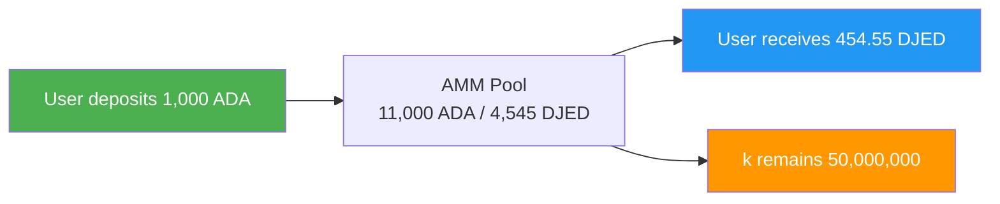
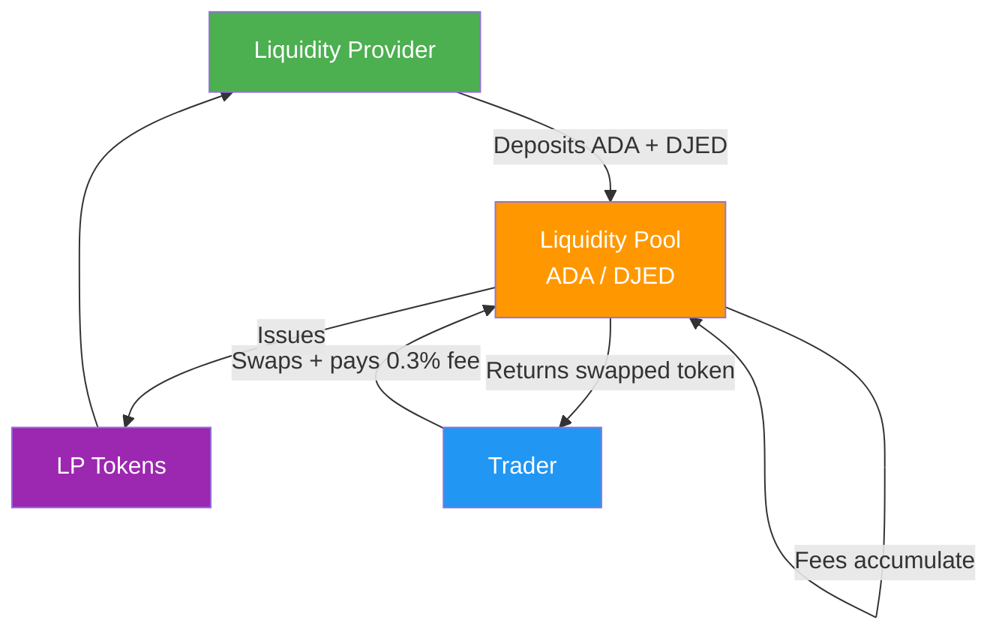
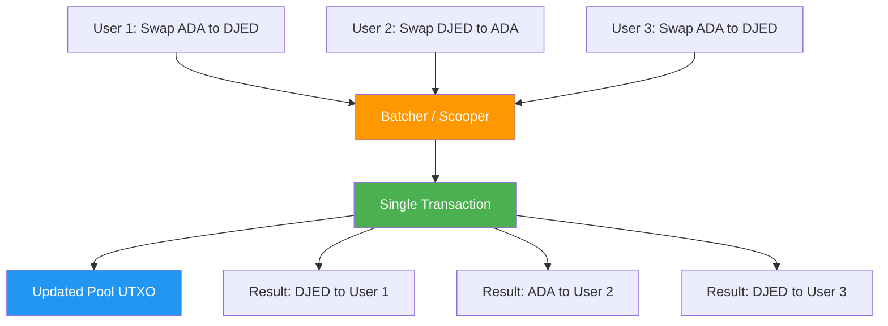

# レッスン #11：開発者のためのDeFi概念

分散型金融（DeFi）は、従来の金融仲介者をスマートコントラクトプロトコルに置き換え、ブロックチェーン上で直接パーミッションレスな取引、貸付、利回り生成を可能にします。Web2開発者にとって、DeFiは金融ロジックがオンチェーンに存在するパラダイムを導入します。マイクロサービスのようにコンポーザブルでありながら、トラストレスかつパーミッションレスです。このレッスンでは、DeFiの主要なプリミティブ、その仕組み、そしてCardanoのeUTXOモデルでDeFiプロトコルを構築する際に生じる特有の設計課題とソリューションについて探求します。

## DeFiランドスケープとは？

DeFiランドスケープは、従来の仲介者（銀行、証券会社、クリアリングハウス）を、ブロックチェーン上で実行される決定論的なスマートコントラクトに置き換えるすべての金融プロトコルを包含します。DeFiが排除する各仲介者は、手数料を削減し、レイテンシーを低減し、信頼の必要性を取り除きます。

DeFiエコシステムは、いくつかのカテゴリのプロトコルにまたがります：

- **分散型取引所（DEX）**：中央集権的なオーダーブックなしでトークンを取引
- **貸付と借入**：資産を提供して利回りを得る。担保に対して借入
- **ステーブルコイン**：アルゴリズムまたは担保ベースのメカニズムを通じて法定通貨にペッグされたトークン
- **イールドアグリゲーター**：複数のプロトコルにわたってリターンを自動最適化
- **合成資産**：実世界資産のオンチェーン表現
- **保険**：スマートコントラクトの障害に対する分散型カバレッジ

Cardanoでは、DeFiエコシステムにMinswap、SundaeSwap、WingRiders（DEX）、Liqwid FinanceとLenfi（貸付）、DjedとiUSD（ステーブルコイン）、Optim Finance（イールド最適化）などのプロトコルが含まれます。これらの各プロトコルは、CardanoのeUTXOモデルの制約と利点の中で動作し、独特なアーキテクチャパターンをもたらします。

## 分散型取引所（DEX）とは？

分散型取引所（DEX）は、中央集権的な仲介者が資金を保管することなく、スマートコントラクトを通じてユーザーがあるトークンを別のトークンにスワップすることを可能にします。CoinbaseやBinanceのように取引中に取引所があなたの資産を管理するのとは異なり、DEXではカストディを失うことなくスワップが実行されます。

### オーダーブックとAMMの比較

伝統的な証券取引所や中央集権的な暗号取引所は**オーダーブック**を使用します。これは、特定の価格で買い注文と売り注文をマッチングするデータ構造です。マーケットメーカーはブックの両側に指値注文を置き、買い手の価格が売り手の価格に合致すると取引が実行されます。

```
従来のオーダーブック:
+------------------------------------------+
|  SELL ORDERS (Asks)                      |
|  Sell 100 ADA @ $0.52                    |
|  Sell 250 ADA @ $0.51                    |
|  Sell 500 ADA @ $0.505                   |
|-------------- SPREAD -------------------|
|  Buy 300 ADA @ $0.50                     |
|  Buy 150 ADA @ $0.49                     |
|  Buy 400 ADA @ $0.485                    |
|  BUY ORDERS (Bids)                       |
+------------------------------------------+
```

オンチェーンのオーダーブックは、すべての注文の発注、キャンセル、変更にトランザクションが必要なため、コストが高くなります。スループットが限られたブロックチェーンでは、このモデルは非実用的になります。Genius YieldなどのCardano DEXはオンチェーンオーダーブックモデルを実装しており、eUTXOモデルの各注文を個別のUTXOとして表現する能力を活用しています。しかし、DeFiにおける主流のモデルは**自動マーケットメーカー（AMM）**です。

### 自動マーケットメーカー（AMM）の仕組み

AMMは、オーダーブックを**流動性プール**の準備金比率に基づいて資産価格を決定する数学的公式に置き換えます。個々の買い手と売り手をマッチングする代わりに、誰でもプールに対して取引でき、公式が需要と供給に基づいて価格を自動調整します。

最も一般的な公式は**定積公式**で、EthereumのUniswapで普及し、多くのCardano DEXでも採用されています：

```
x * y = k

ここで:
  x = プール内のToken Aの数量
  y = プール内のToken Bの数量
  k = 定数（積はすべての取引後も同じでなければならない）
```

具体的な例を示します。流動性プールに以下が含まれているとします：

- 10,000 ADA（Token A）
- 5,000 DJED（Token B）
- k = 10,000 * 5,000 = 50,000,000

トレーダーが1,000 ADAでDJEDを購入したいとします。取引後：

```
プール内の新しいADA:   10,000 + 1,000 = 11,000
プール内の新しいDJED:  k / new_x = 50,000,000 / 11,000 = 4,545.45
受け取るDJED:         5,000 - 4,545.45 = 454.55 DJED
実効価格:             1,000 ADA / 454.55 DJED = 2.20 ADA per DJED
```

トレーダーは期待される500 DJED（初期レートの2 ADA per DJEDの場合）の代わりに、約454.55 DJEDを受け取ることに注意してください。この差は**スリッページ**と呼ばれ、プールサイズに対する取引が大きくなるほど増加します。定積公式は、プールの片側が枯渇するにつれて価格がより劇的に変動する曲線を作成します。



### その他のAMM公式

定積公式が唯一の選択肢ではありません。異なる公式は異なるユースケースに最適化されています：

- **定和公式（x + y = k）**：スリッページはゼロですが、片方の資産が完全に枯渇する可能性があります。実際にはほとんど使用されません。
- **StableSwap（Curve）**：1:1に近い取引が期待される資産（ステーブルコインペアなど）に最適化されたハイブリッド公式です。中心付近では定和のように、極端な場合は定積のように振る舞い、バランスの取れた取引では低スリッページを提供します。
- **集中流動性**：流動性プロバイダーが価格レンジを指定でき、最も有用な範囲に資本を集中させます。資本効率が劇的に向上しますが、複雑さも増します。

Cardanoでは、Minswapがステーブルペア向けのStableSwapバリアントを持つ定積AMMを使用しています。SundaeSwapも定積モデルを実装しています。公式の選択は、ユーザー体験、資本効率、実装の複雑さに影響します。

## 流動性プールとプロバイダーの仕組み

流動性プールは、トレーダーがスワップする対象となるペアのトークン準備金を保持します。**流動性プロバイダー（LP）**は両方のトークンを等価で預け、見返りに**LPトークン**を受け取ります。これはプール内のシェアを表します。取引手数料はプールに蓄積され、時間とともに各LPトークンの価値を増加させます。



LPが引き出しを希望する場合、LPトークンをバーンし、蓄積された手数料を含むプールの比例シェアを受け取ります。これがLPが利回りを得る仕組みです。スワッパーが支払う取引手数料がプールに蓄積され、時間とともに各LPトークンの価値が増加します。

### インパーマネントロスとは？

インパーマネントロス（IL）は、AMMプールにトークンを保持する場合と、単にウォレットに保持する場合の価値の差です。プールされた資産の価格比率が預入時の比率から乖離すると、AMMの絶え間ないリバランスにより、LPは単に保持していた場合よりも値上がりした資産の量が少なくなります。

1,000 ADAと500 DJED（2 ADA per DJEDの価格）を預けたLPを考えてみましょう。ADAの価格がDJEDに対して2倍になった場合：

```
初期預入:  1,000 ADA + 500 DJED
保持した場合（LP非参加）:  1,000 ADA (今は2倍の価値) + 500 DJED = $3,000相当
LP参加後の価格変動後: ~707 ADA + ~707 DJED = ~$2,828相当

インパーマネントロス: ~5.7%
```

この損失が「インパーマネント（一時的）」と呼ばれるのは、価格が元の比率に戻れば損失が消えるためです。LPが異なる価格比率で引き出した場合にのみ恒久的な損失となります。取引手数料はインパーマネントロスを相殺できますが、高ボラティリティの期間中は、ILが手数料収入を超える場合があります。

Web2開発者にとって、インパーマネントロスは「リバランスコスト」と考えてください。AMMは常に値上がりした資産を売り、値下がりした資産を買います。LPは本質的に価格発見のコストを支払っているのです。

## オラクルはどのようにオフチェーンデータをオンチェーンに持ち込むのか？

オラクルは外部データをブロックチェーンにフィードし、オンチェーンスマートコントラクトと、価格フィード、天気データ、スポーツ結果などのオフチェーン情報ソースとの間のギャップを橋渡しします。スマートコントラクトはネイティブにAPIをクエリできないため、オラクルはコントラクトが参照できるオンチェーンDatumとして検証済みデータを投稿します。

Cardanoでは、オラクルは通常、既知のスクリプトアドレスにあるUTXOにアタッチされた**Datum**としてデータを投稿します。スマートコントラクトはこれらのUTXOをインプットとして参照し、最新のデータを読み取ります。Cardanoエコシステムの主要なオラクルプロバイダーには以下が含まれます：

- **Charli3**：価格フィードおよびその他のデータを提供するCardanoネイティブオラクル
- **Orcfax**：データの真正性と来歴を重視する分散型オラクルソリューション
- **Iagon**：Cardanoエコシステムにおける分散型ストレージおよびコンピュートオラクルプロバイダー

**オラクル問題**は根本的なものです。オンチェーンに投稿されたデータが正確であることをどのように信頼するのでしょうか？ソリューションには、複数の独立したデータソースの使用、経済的インセンティブ（不正データに対してスラッシュされる担保のステーキング）、暗号学的証明が含まれます。オラクルはDeFiインフラストラクチャの中で最も重要かつ脆弱なコンポーネントの1つです。侵害されたオラクルは、レンディングプロトコルのポジションの不正な清算、DEXでの不正な価格での取引の提供、またはステーブルコインのペッグ喪失を引き起こす可能性があります。

## DeFiにおけるeUTXO設計の課題とは？

CardanoのeUTXOモデルでは、DeFiプロトコルはEthereumのアカウントモデルとは異なる方法で並行性を解決する必要があります。これは、単一のUTXOがブロックごとに1つのトランザクションでのみ消費できるためです。開発者は、モデルの決定性とフロントランニング耐性を維持しながら、この制約に対処するためのオーダーバッチングとプールシャーディングのパターンを作成しました。

### 並行性の問題とは？

アカウントベースモデル（Ethereum）では、スマートコントラクトは単一の可変状態を保持します。複数のユーザーが同じブロック内でそれとやりとりでき、ブロックチェーンが順序を解決します。CardanoのeUTXOモデルでは、UTXOは一度しか使えません。流動性プールが単一のUTXOとして表現される場合、ブロックごとに1人のユーザーしかそれとやりとりできません。

```
並行性の課題:

Block N:
  User A wants to swap ADA to DJED  --+
  User B wants to swap ADA to DJED  --+--> Only ONE can spend the pool UTXO
  User C wants to swap DJED to ADA  --+

  Result: Two transactions fail with "UTXO already spent"
```

これはeUTXOのバグではなく、モデルの根本的な違いです。Cardano開発者はこの課題に対処するためにいくつかのパターンを作成しました。

### オーダーバッチングによる並行性の解決

Cardano DEXで最も一般的なパターンは**オーダーバッチング**です。ユーザーが流動性プールと直接やりとりする代わりに、意図を表現する**オーダーUTXO**を送信します（例えば、「100 ADAをDJEDにスワップ、最大スリッページ2%」）。**バッチャー**（スクーパーとも呼ばれる）が複数のオーダーを収集し、単一のトランザクションでプールに対して実行します。



このパターンにはいくつかの利点があります。複数のオーダーが単一のトランザクションでアトミックに処理され、競合が減少します。バッチャーは実行順序を最適化できます。ユーザーはプールUTXOを直接取り合う必要がありません。

ただし、バッチングはレイテンシーを導入し（ユーザーはバッチャーがオーダーを含めるまで待つ必要がある）、バッチャーへの信頼が必要です（ただし、スマートコントラクトが正しさを強制します）。ほとんどのCardano DEXは、誰でもバッチャーを実行して手数料を獲得できるようにすることで、バッチャーの役割を分散化しています。

### プールシャーディングの仕組み

もう1つのアプローチは、流動性プールを複数のUTXOに分割するものです。すべての流動性を保持する1つのUTXOの代わりに、プールは各部分を保持する複数のより小さなUTXOとして表現できます。これにより、複数のトランザクションが異なるUTXOに対して同時に実行できます。

```
複数のプールUTXO:

100,000 ADA / 50,000 DJEDを持つ1つのプールUTXOの代わりに:

+----------------+  +----------------+  +----------------+
| Pool Shard 1   |  | Pool Shard 2   |  | Pool Shard 3   |
| 33,333 ADA     |  | 33,333 ADA     |  | 33,334 ADA     |
| 16,667 DJED    |  | 16,667 DJED    |  | 16,666 DJED    |
+----------------+  +----------------+  +----------------+

3人のユーザーが異なるシャードに対して同時にスワップできます。
```

トレードオフは、シャード間で一貫した価格を維持する複雑さの増加と、個々のシャードでの高いスリッページの可能性（各シャードに含まれる流動性が少ないため）です。

### eUTXOの決定性がDeFiにおいてどのような優位性をもたらすか？

並行性は課題ですが、eUTXOモデルはDeFiに強力な優位性を提供します：**決定性**です。Ethereumでは、トランザクションがローカルシミュレーションで成功しても、送信から実行までの間に他のトランザクションがコントラクトの状態を変更したためにオンチェーンで失敗する可能性があります（MEV、またはMiner/Maximal Extractable Valueとして知られています）。Cardanoでは、トランザクションの結果は完全に決定論的です。トランザクションがローカルでバリデートされれば、インプットUTXOが使用されていない限り、オンチェーンでまったく同じ結果を生成します。

この決定性はまた、Cardanoが**フロントランニング**に対して本質的に耐性があることを意味します。フロントランニングとは、マイナーやバリデーターがトランザクションを並べ替えてユーザーの犠牲で利益を得る慣行です。Cardanoのトランザクションは正確なインプットとアウトプットを指定するため、バリデーターは価格を操作するためにあなたのトランザクションの前に自分のトランザクションを挿入することができません。

## コンポーザビリティがDeFiのスーパーパワーである理由

コンポーザビリティにより、開発者は単一のアトミックトランザクションで複数のDeFiプロトコルを組み合わせ、シンプルな構成要素から複雑な金融オペレーションを作成できます。Web2の用語で言えば、世界中のすべてのAPIが同じ認証システム、同じデータフォーマットを共有し、完全に成功するか完全にロールバックする単一のアトミックリクエストで呼び出せると想像してください。

Cardanoでは、コンポーザビリティは単一のトランザクションで複数のスクリプトインプットとアウトプットを参照する能力を通じて実現されます。単一のトランザクションで以下のことが可能です：

1. レンディングプロトコルから担保を引き出す
2. DEXでその担保をスワップする
3. 別のプールに流動性を提供する
4. NFTレシートをミントする

すべてアトミックに。いずれかのステップが失敗すると、トランザクション全体が無効となり、状態変更は発生しません。

このコンポーザビリティこそが、DeFiプロトコルを「マネーレゴ」のように機能させるものです。スタック可能で交換可能な構成要素が、シンプルなプリミティブからますます複雑な金融商品を作り出します。

## なぜCardanoにフラッシュローンがないのか？

Ethereumのフラッシュローンは、同一トランザクション内でローンを返済することを条件に、ユーザーが無担保で無制限のトークンを借りることを可能にします。CardanoのeUTXOモデルは、各トランザクションが構築時にインプットとアウトプットのバランスを取る必要があるため、トランザクション途中で資産を「借りる」ことができず、これを防止します。

Ethereumでは、EVMがブロック内のトランザクションを順次処理し、トランザクションの最後にローンが返済されたかどうかを確認できるため、フラッシュローンが機能します。Cardanoでは、トランザクションは送信前に完全に定義されなければなりません。

一部のプロトコルは、複数のチェーンされたトランザクションを使用する「フラッシュローン的」パターンなどの代替案を検討していますが、eUTXOモデルはEthereumのフラッシュローンを特徴づける単一トランザクション内の無担保借入を根本的に防止します。

これは実際にはセキュリティ上の利点です。Ethereumのフラッシュローンは、DeFiプロトコルに対する複雑な攻撃の実行に使用されており、単一のトランザクションで価格を操作し、資金を排出しています。Cardanoのモデルは、これらの攻撃ベクトルの悪用を大幅に困難にします。

## イールドファーミングと流動性マイニングの仕組み

イールドファーミングは、リターンを最大化するためにDeFiプロトコル全体に戦略的に資本を配置する実践であり、流動性マイニングは取引手数料に加えた追加インセンティブとして、流動性プロバイダーにガバナンストークンを配布するものです。

Cardanoでのイールドファーミングの機会には以下が含まれます：

- DEXに流動性を提供し、取引手数料とプロトコルトークンを獲得（例：MinswapからのMINトークン）
- LiqwidなどのプラットフォームでAssetを貸し付け、利息とプロトコルトークンを獲得
- LPトークンを「ファーム」にステーキングして追加報酬を獲得
- 新しいトークンの流動性ブートストラッピングイベントに参加

DeFiの利回りは魔法ではありません。取引手数料（実際の経済活動）、トークンエミッション（価値を維持するかもしれないインフレーション報酬）、プロトコル収益の共有から来ています。利回りの源泉を理解することは、リスク評価にとって重要です。

## Web2アナロジー

Web2から来た方にとって、多くのDeFi概念には馴染みのあるアナログがあります：

**DEXは証券取引所のマッチングエンジンのようなものです。** ただし、マッチングロジックが公開されており、誰でもマーケットメーカーになれ、あなたと市場の間にブローカーがいません。証券取引所が独自のマッチングアルゴリズムを持つのに対し、AMMは誰でも検証しやりとりできる公式を公開しています。

**AMMの流動性プールはWebサーバーのコネクションプールのようなものです。** コネクションプールは、複数のリクエストが使用できる事前確立されたデータベース接続のセットを維持します。同様に、流動性プールは複数のトレーダーがスワップできる資産の準備金を維持します。プールは需要に対して適切なサイズでなければなりません。小さすぎると輻輳（高スリッページ）が発生し、大きすぎるとリソースが活用されません（LPの低リターン）。

**オラクルはAPIアグリゲーターやWebhookプロバイダーのようなものです。** Web2では、Plaidのようなサービスを使用してバンキングデータを集約したり、Alpha VantageのようなプライスフィードAPIを使用したりするかもしれません。オラクルは同じ目的を果たしますが、トラストレス性の問題を解決する必要があります。単一のAPIプロバイダーを信頼できないシステムを構築することを想像してください。5つのプロバイダーにクエリし、外れ値を破棄し、中央値を取ります。これが基本的に分散型オラクルの仕組みです。

**オーダーバッチングはメッセージキューのバッチ処理のようなものです。** 各メッセージ（オーダー）を個別に処理する代わりに、コンシューマー（バッチャー）がキューからメッセージを収集し、一括処理し、結果を書き戻します。Amazon SQSのLambda関数がメッセージをポーリングしてバッチで処理するのと同じように考えてください。

**インパーマネントロスは書き込み集中ワークロード下でキャッシュを維持するコストのようなものです。** リクエスト（取引）をより効率的にサーブするためにリソース（流動性）を事前に割り当てますが、基礎となるデータ（価格）が急速に変化すると、キャッシュ（プール比率）が古くなり、リバランスのコストがキャッシュの利点を超えてしまいます。

**コンポーザビリティはUnixパイプのようなものです。** あるプログラムの出力が別のプログラムの入力になりますが、パイプラインのすべてのコマンドが完全に成功するか完全にロールバックします。`grep | sort | uniq`のようなものですが、Web2開発者が夢見るしかないアトミシティの保証付きです。

## 重要なポイント

- **AMMはオーダーブックを置き換えます。** 数学的公式（定積公式など）を使用して、プール準備金に基づいて資産を自動的に価格設定し、中央集権的な仲介者なしでパーミッションレスな取引を可能にします。
- **流動性プロバイダーは手数料を得ますが、インパーマネントロスに直面します**：プールされた資産の価格比率が預入時の比率から乖離すると発生する隠れたコストです。
- **オラクルはオンチェーン/オフチェーンのギャップを橋渡しします。** 外部データをDatumとして投稿しますが、慎重に管理する必要のある信頼の前提を導入します。
- **CardanoのeUTXOモデルはDeFi特有のパターンを必要とします。** オーダーバッチングやプールシャーディングなどで並行性に対処しますが、強力な補償的利点として決定性とフロントランニング耐性を提供します。
- **コンポーザビリティはDeFiプロトコルを相互運用可能な構成要素にします。** 単一のアトミックトランザクションで複雑な金融オペレーションを可能にします。

## 次のステップ

DeFiを支える金融プリミティブを理解したので、次のレッスンでは、Cardanoのネットワークを支えるインフラストラクチャを探求します：ステークプール、デリゲーション、そしてこれまで議論してきたすべてのトランザクションを保護するコンセンサスメカニズムです。
