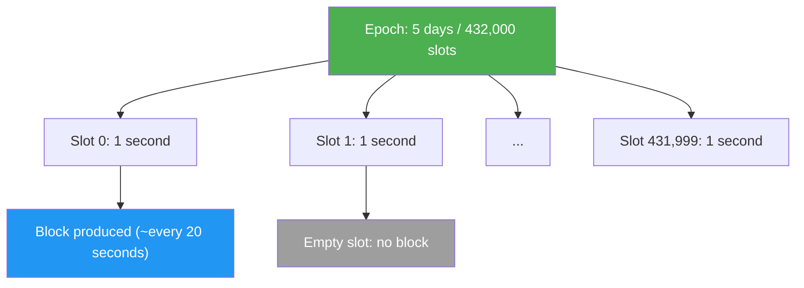
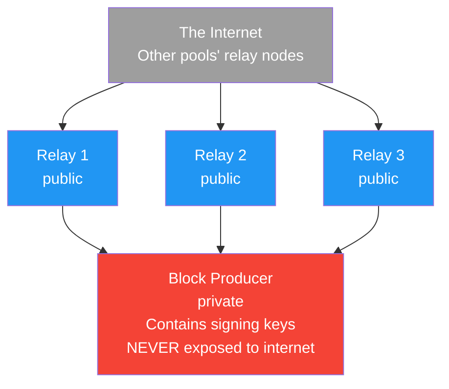
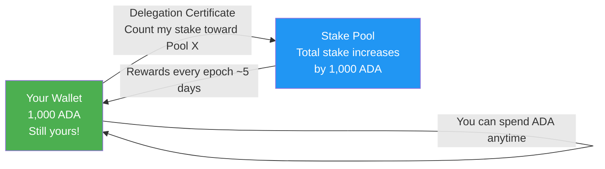
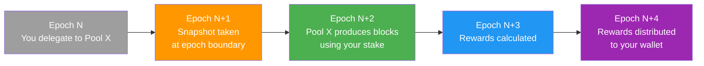

# レッスン #12：ステークプール、デリゲーション、ネットワーク

Cardanoのプルーフ・オブ・ステークコンセンサスは、ADAホルダーが集合的にステークプールにステークをデリゲートすることでネットワークを保護し、プールはデリゲートされた合計ステークに比例してブロックを生成し報酬を獲得します。Web2開発者にとって、ステークプール、デリゲーション、ネットワークトポロジーの仕組みを理解することは不可欠です。これらのメカニズムがトランザクションのファイナリティ、ネットワークスループット、そしてシステムの誠実性を保つ経済的インセンティブに直接影響するためです。このレッスンでは、Cardanoのコンセンサスレイヤーを支える仕組みについて深く掘り下げます。

## Proof of Stakeとは何か、なぜ重要なのか？

Proof of Stakeは、エネルギー集約型のマイニングを経済的ステークに置き換え、「最も多くのコンピューティングパワーを持つのは誰か？」ではなく「最も失うものが大きいのは誰か？」を問います。バリデーターは自分の資産を担保としてコミットします：誠実な行動は報酬を得、不正行為はステークの喪失リスクを伴います。セキュリティの前提は、重大な経済的エクスポージャーを持つ合理的なアクターがネットワークの最善の利益のために行動するということです。

BitcoinのようなProof of Workシステムでは、マイナーは計算的に高価なパズルを解くために競争します。勝者は次のブロックを提案し、報酬を獲得します。セキュリティは、ネットワークを攻撃するには世界のマイニングパワーの過半数を制御する必要があるという事実から来ており、天文学的に高価な命題です。

Cardanoのプルーフ・オブ・ステークプロトコルは**Ouroboros**と呼ばれ、査読付き学術会議で公表された厳密な数学的セキュリティ証明を持つ最初のプルーフ・オブ・ステークプロトコルです。Ouroborosはいくつかのイテレーションを経て進化してきました：

- **Ouroboros Classic**（2017年）：PoSがPoWと同じセキュリティ保証を達成できることを証明した基礎プロトコル
- **Ouroboros Praos**（2018年）：半同期ネットワーク仮定と、次のブロック生成者への標的攻撃を防ぐプライベートリーダー選出を追加
- **Ouroboros Genesis**（論文2018年、実装進行中）：新しいノードが信頼できるチェックポイントを必要とせずにジェネシスブロックからブートストラップすることを可能に
- **Ouroboros Leios**（開発中）：インプットエンドーサーとパイプラインスタイルのブロック生成により、スループットを劇的に向上させることを目指す

## Ouroborosはどのようにブロック生成者を選出するのか？

Ouroborosは時間をエポック（各5日間）とスロット（各1秒）に分割し、各スロットのスロットリーダーとしてステークプールを擬似ランダムに選出します。選出確率はプールの合計デリゲートステークに比例します。選出されたプールだけがそれを知ることができ、次のブロック生成者へのサービス拒否攻撃を防ぎます。



各エポックの開始時に、プロトコルは**リーダー選出**プロセスを実行します。次のエポックの各スロットについて、**スロットリーダー**（そのスロットのブロック生成を許可されたエンティティ）としてステークプールを擬似ランダムに選出します。選出の確率はプールの合計ステーク（自身のプレッジとすべてのデリゲートされたADA）に比例します。

```
リーダー選出確率:

Pool A:  50 million ADA staked  -->  ~0.14% chance per slot
Pool B: 200 million ADA staked  -->  ~0.56% chance per slot
Pool C:   5 million ADA staked  -->  ~0.014% chance per slot

Circulating ADA supply: ~37.6 billion (as of 2025)
```

選出は**プライベート**であり、選出されたプールだけが特定のスロットで選ばれたことを知っています。これにより、攻撃者が次のブロック生成者をサービス拒否攻撃の標的にすることを防ぎます。プールはブロックを生成する際に検証可能ランダム関数（VRF）の出力を明らかにすることで、選出を証明します。

## ステークプールのアーキテクチャはどのようなものか？

Cardanoステークプールは、暗号署名鍵を保持するプライベートブロック生成者ノードが、より広いネットワークに接続する複数のパブリックリレーノードの背後に配置される構成です。この分離により、攻撃者がリレーを侵害しても、署名鍵は隔離されて安全です。

### ステークプールを構成するノードタイプ



**ブロック生成者ノード**：ステークプールのコアです。プールの暗号鍵（コールドキー、KESキー、VRFキー）を保持し、プールがスロットリーダーに選出された際にブロックをミントする責任があります。ブロック生成者はインターネットから直接アクセスできてはなりません。プール自身のリレーノードとのみ通信します。

**リレーノード**：より広いCardanoネットワークに接続するパブリックアクセス可能なノードです。他のノードからトランザクションとブロックを受信し、ブロック生成者に転送し、プールが新たにミントしたブロックをネットワークに伝播します。異なる地理的地域で複数のリレーを運用することで、冗長性とネットワーク接続性が向上します。

### ステークプールが使用する鍵と証明書

ステークプールの運用には、それぞれ異なる目的を持つ複数の暗号鍵が関わります：

- **コールドキー**：プールのアイデンティティキーです。プール登録証明書の署名に使用されます。最大限のセキュリティのためにオフラインで保管されます。プールのルートCA証明書と考えてください。
- **KESキー（Key Evolving Signature）**：ブロックの署名に使用されます。定期的に（129,600スロットごと、約36時間）進化し、古い鍵は削除されることで**前方秘匿性**を提供します。攻撃者が現在のKESキーを入手しても、過去の期間のブロックを偽造することはできません。
- **VRFキー（Verifiable Random Function）**：特定のスロットでプールがブロック生成の資格があることを証明するために使用されます。VRFの出力は証明としてブロックヘッダーに含まれます。
- **オペレーショナル証明書**：コールドキーとKESキーをリンクし、コールドキーを公開せずにブロック生成者がプールに代わってブロックに署名できるようにします。

```
鍵の階層:

Cold Key (offline, pool identity)
    |
    +--> Signs: Pool Registration Certificate
    |              (registers/updates pool on-chain)
    |
    +--> Signs: Operational Certificate
                    |
                    +--> Authorizes: KES Key (online, signs blocks)
                                         |
                                         +--> Proves: VRF Key output
                                                      (slot leadership)
```

## ノンカストディアルデリゲーションの仕組み

Cardanoのデリゲーションはノンカストディアルです。あなたのADAはウォレットから離れることはありません。代わりに、ステーキング権を選んだプールに割り当てるオンチェーン証明書を発行しますが、ロックアップ期間なし、最低金額なし、スラッシングリスクなしで、完全な支出コントロールを維持します。



これは、トークンをロックしたり、バリデーターに送ったり、取り戻すために「アンボンディング期間」を待つ必要がある他の多くのブロックチェーンでのステーキングとは根本的に異なります。Cardanoでは：

- **ロックアップなし**：あなたのADAは常に流動的です。いつでも使うことができます。
- **最低額なし**：任意の金額のADAをデリゲートできます。
- **スラッシングなし**：デリゲートされたADAがリスクにさらされることはありません。プールオペレーターが不正行為をした場合、そのエポックの報酬を逃すだけで、元本を失うことはありません。
- **自動再デリゲーション**：ウォレットにADAを追加すると、次のスナップショットから自動的にデリゲーションに含まれます。

スラッシングなしの特性は特に注目に値します。Ethereumでは、バリデーターが矛盾するブロックに署名したり、長期間オフラインになったりすると、ステークされたETHの一部をスラッシングによって失う可能性があります。Cardanoは異なるアプローチを選択しました：悪い行動に金銭的ペナルティで罰する代わりに、プロトコルは単にそれに報酬を与えません。割り当てられたブロックを逃したプールはそれらのスロットの報酬を獲得せず、デリゲーターは自然とより信頼性の高いプールに移動します。

### デリゲーションサイクルとは？

デリゲーションはエポックに紐づいた特定のタイミングサイクルに従います：



この遅延は、Ouroborosがスロットリーダーシップを計算する方法に起因します。Epoch Nのステークスナップショットがエポック N+2のスロットリーダーを決定し、Epoch N+2の報酬はEpoch N+3とN+4で計算・分配されます。最初の遅延（約15〜20日）の後、プールがブロックを生成する限り、報酬はエポックごと（5日ごと）に届きます。

## ステーキング報酬はどのように分配されるのか？

ステーキング報酬は2つの源泉から来ます：マネタリーエクスパンション（リザーブからミントされる新しいADA）とユーザーが支払うトランザクション手数料です。プロトコルは合計報酬ポットをトレジャリー（20%）とステークプール報酬（80%）に分割し、プール報酬はさらにパフォーマンス、プレッジ、オペレーターマージンに基づいて分配されます。

### プール報酬を決定する要因

報酬の公式はいくつかの要因を考慮します：

```
プール報酬の要因:

1. Performance: 実際に生成されたブロック数と期待されるブロック数の比率
   (100スロットを割り当てられたプールが98ブロックを生成 = performance = 0.98)

2. Pledge (s): プールオペレーター自身がプールにコミットしたADA
   (高いプレッジはa0パラメーターにより若干高い報酬につながる)

3. Total Stake (z): ステークされた全ADAに対するプールのシェア
   (より多くのステーク = より多くのスロット、ブロック、報酬)

4. Saturation (k): 最大有効プールサイズ
   (現在k = 500、つまり最適プールサイズは約7,100万ADA)
   (飽和以上のプールはステークされたADAあたりの報酬が減少)

5. Fixed Cost (最低170 ADA/エポック): 運用費用をカバー
   (報酬がデリゲーターと共有される前に差し引かれる)

6. Margin (0-100%): 残りの報酬からのプールオペレーターの取り分
   (一般的なマージンは1%〜5%)
```

## 飽和はどのように分散化を促進するのか？

飽和メカニズムは、飽和点（ADAの総供給量をkパラメーターで割ったもの、現在約7,100万ADA）を超えるプールに対してADAあたりの報酬を減らすことで、ステークの集中を防ぎます。これにより、デリゲーターがステークをより小さな未飽和プールに移動する自然なインセンティブが生まれます。

**飽和点**は次のように計算されます：

```
Saturation Point = Total Active Stake / k
                 ≈ 37.6 billion / 500
                 ≈ 75 million ADA
```

プールの合計ステークが飽和点を超えると、ステークされたADAあたりの報酬が減少し始めます。これにより、デリゲーターがステークをより小さな未飽和プールに移動する自然なインセンティブが生まれます。

Cardanoコミュニティがより多くの分散化を望む場合、kパラメーターを増やす（例えば1,000に）ことができ、飽和点が下がり、ステークがより多くのプールに分散するインセンティブとなります。これはオンチェーンガバナンスプロセスを通じて行われるガバナンス上の決定です。

## プレッジはステークプールの経済においてどのような役割を果たすのか？

プレッジは、プールオペレーターが自分のプールに個人的にコミットするADAの量であり、シビル耐性、インセンティブの整合、そしてデリゲーターへの信頼シグナルとして機能します。報酬公式のa0パラメーターは、より高いプレッジを持つプールにボーナスを与え、多数のゼロプレッジプールを運用するよりも、1つの十分にプレッジされたプールを運用する方が収益性が高くなるようにします。

1. **シビル耐性**：プレッジインセンティブがなければ、攻撃者は個人的な投資なしに何千ものプールを作成できます。

2. **インセンティブの整合**：重要なプレッジを持つプールオペレーターは、自分のステークに比例した報酬を個人的に獲得するため、プールを確実に運用し続ける強い動機を持ちます。

3. **信頼シグナル**：より高いプレッジは、オペレーターが自分のプールに自信を持っていることを示し、オペレーターがスキンインザゲーム（当事者意識）を持っていることをデリゲーターに保証します。

```
プレッジの影響の例:

Pool A: 100,000 ADA pledge, 50M total stake
Pool B: 1,000,000 ADA pledge, 50M total stake

両プールは同じ数のブロックを生成しますが、Pool Bは
a0パラメーターにより、より高いプレッジに報酬を与えるため、
若干高い合計報酬を獲得します。

現在のところ差は控えめ（a0 = 0.3）ですが、スケールで
意味のあるシグナルとインセンティブを提供します。
```

## Cardanoネットワークはどのように構造化されているのか？

Cardanoのネットワークは、ノードがゴシッププロトコルを通じてピアを動的に発見・接続するピアツーピアシステムであり、パフォーマンスと耐障害性を最適化するために接続をhot（アクティブ）、warm（アイドル）、cold（既知だが切断）に分類します。

### Cardanoはどのように静的トポロジーから動的トポロジーに移行したのか？

当初、Cardanoは**静的トポロジー**を使用しており、リレーノードは手動でピアリストを設定していました。**ピアツーピア（P2P）ネットワーキング**（Ouroborosネットワークスタックで有効化）のロールアウトにより、ノードは中央集権的な調整なしにピアを動的に発見・接続できるようになりました。

P2Pシステムにはいくつかのコンポーネントが含まれます：

- **ピアディスカバリー**：ノードがゴシッププロトコルを通じて既知のピアを他のノードと共有
- **ピアセレクション**：ノードがピアを「hot」（アクティブにデータ交換中）、「warm」（接続済みだがアイドル）、「cold」（既知だが未接続）に分類し、パフォーマンスに基づいて接続を動的に調整
- **コネクションマネージャー**：接続制限、優先順位付け、ピア間のグレースフルなハンドオフを処理

### ブロック伝播の仕組み

ステークプールがブロックを生成すると、次のブロックの期限前にすべての他のノードが受信できるよう、十分に速くネットワークを通じて伝播する必要があります。目標は、ブロックが5秒以内にネットワークの95%に到達することです。

ブロックサイズ、ネットワークレイテンシー、ノード間のホップ数はすべて伝播時間に影響します。このため、リレーノードの地理的分散が重要です。北米、ヨーロッパ、アジアにリレーを持つプールは、すべてのリレーが単一のデータセンターにあるプールよりも速くブロックを伝播します。

## ステークプール運用の要件とは？

これは理論コースですが、運用要件を理解することで開発者はSPOが行うことをより深く理解できます：

- **ハードウェア**：最低16 GB RAM、4 CPUコア、200 GB SSDストレージ（ブロックチェーンの成長に伴い増加）、信頼性の高いインターネット接続
- **アップタイム**：プールはスロットリーダーシップが割り当てられた際にオンラインである必要があります。ブロックを逃すと報酬を逃し、デリゲーターの信頼を失います
- **鍵管理**：コールドキーはオフラインで安全に保管する必要があります。KESキーは62 KES期間（約90日）ごとにローテーションが必要です。オペレーショナル証明書はKESローテーションごとに再発行する必要があります
- **モニタリング**：SPOはブロック生成、ネットワーク接続、リソース使用量、ピア接続を監視します。単一のブロックの欠落もCNCLI、Prometheus、Grafanaなどのツールで検出・診断できます
- **アップデート**：SPOは新バージョンがリリースされた際、特にプロトコルルールが変更されるハードフォークイベントの際に、ノードソフトウェアをアップグレードする必要があります

## Web2アナロジー

Cardanoのステーキングエコシステムは、Web2のインフラストラクチャパターンに驚くほどよくマッピングされます：

**ステークプールはCDNエッジノードのようなものです。** コンテンツデリバリーネットワーク（CloudflareやAWS CloudFrontなど）はコンテンツのコピーを世界中の多くのサーバーに分散させます。各エッジノードはリクエストの一部を処理します。同様に、ステークプールはブロック生成の作業を多くのオペレーターに分散させます。CDNプロバイダーがパフォーマンス、アップタイム、価格で競争するように、ステークプールは信頼性、手数料、コミュニティエンゲージメントで競争します。

**リレーノードはロードバランサーのようなものです。** 典型的なWeb2デプロイメントでは、ロードバランサー（Nginx、HAProxy、AWS ALBなど）がアプリケーションサーバーの前に配置され、受信トラフィックを分配し安定したエントリーポイントを提供します。リレーノードは同じ目的を果たします：より広いネットワークからの接続を受け入れ、トラフィックをブロック生成者にルーティングします。ブロック生成者は（アプリケーションサーバーのように）直接公開されることはありません。

**デリゲーションはDNSベースのトラフィックルーティングのようなものです。** DNSを特定のCDNやホスティングプロバイダーにポイントするように設定する場合、トラフィックをそのインフラストラクチャに「デリゲート」しているのです。ドメイン（あなたのADA）はあなたが所有し、いつでもプロバイダーを変更でき（再デリゲート）、ロックイン期間はありません。プロバイダーがトラフィックのサービス（ブロック生成）の運用負担を処理します。

**飽和メカニズムはオートスケーリングポリシーのようなものです。** クラウド環境では、単一のサーバーが過負荷になるのを防ぐために、最大インスタンス数とスケーリングポリシーを設定します。飽和はネットワークレベルで同じ目的を果たします：単一のプールが大きくなりすぎるのを防ぎ、多くのオペレーターにわたる負荷分散を促進します。ブロックチェーン版の「サーバーあたりの最大接続数」設定です。

**KESキーローテーションはTLS証明書の更新のようなものです。** SSL/TLS証明書を定期的に更新する必要があるのと同様に（Let's Encryptのようなサービスが90日のローテーションを自動化）、SPOは約129日ごとにKESキーをローテーションする必要があります。KESキーの前方秘匿性はTLSの前方秘匿性に類似しています：現在の鍵が侵害されても、過去のセッションやブロックは侵害されません。

**エポックベースの報酬分配は月次クラウド請求のようなものです。** 各API呼び出しごとにリアルタイムで課金されるのではなく、使用量が集計され請求期間の終わりに請求されます。同様に、ステーキング報酬はエポックごとに計算され、ブロックごとではなくバッチで分配されます。

## 重要なポイント

- **OuroborosはCardanoのプルーフ・オブ・ステークプロトコルです。** 時間をエポックとスロットに分割し、ステークプールが合計デリゲートステークに比例してランダムにブロック生成に選出されます。
- **デリゲーションはノンカストディアルです**：あなたのADAはウォレットから離れることがなく、ロックアップ期間もなく、スラッシングリスクもないため、Cardanoのステーキングは独自のユーザーフレンドリーさを持ちます。
- **飽和（kパラメーター）は分散化を促進します。** 過大なプールのADAあたりの報酬を減らすことで、多くのオペレーターにわたるステーク分配を自然に促進します。
- **ステークプールインフラストラクチャはブロック生成者をリレーから分離します。** セキュリティのために、前方秘匿性と運用の柔軟性を提供する洗練された鍵階層（コールド、KES、VRF）を備えています。
- **P2Pネットワーキング**は中央集権的トポロジーアップデーターに代わり、Cardanoネットワーク全体で真に分散化されたピア発見と接続管理を可能にしました。

## 次のステップ

コンセンサスレイヤーでのネットワークの動作をしっかり理解したので、次のレッスンでは、実際にCardano上で構築するために使用する開発者ツールとインフラストラクチャを探求します：独自のノードの実行からマネージドAPIやチェーンインデクサーの使用までです。
