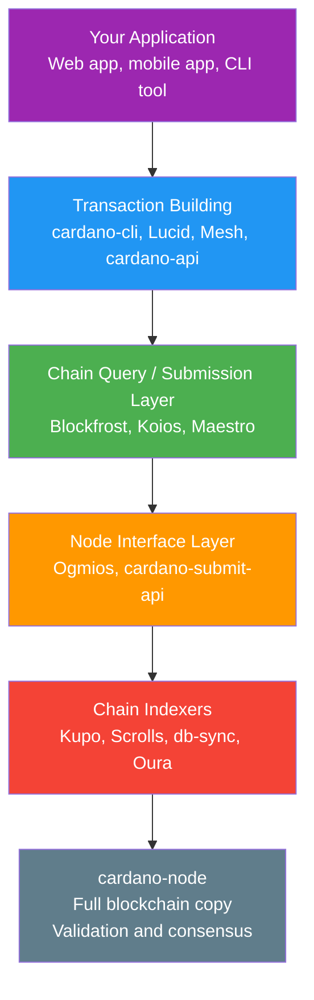
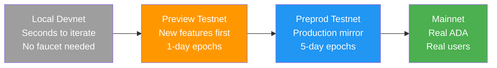
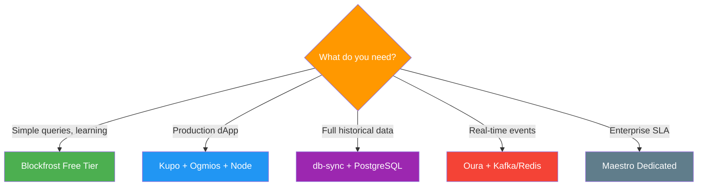

# レッスン #13：開発者インフラストラクチャ

Cardanoの開発者インフラストラクチャは、フルノードからマネージドAPI、チェーンインデクサーまでのレイヤードスタックを提供し、生のブロックチェーンデータをクエリ可能でアプリケーションに適したフォーマットに変換してdApp構築を可能にします。すべてのWeb2開発者は、アプリケーション構築にはビジネスロジック以上のもの（データベース、API、ホスティング、モニタリング、ステージング環境、デプロイメントパイプライン）が必要であることを知っています。このレッスンでは、独自のフルノードの実行からマネージドAPIサービスの使用、チェーンインデクサーから実際のADAをリスクにさらすことなく実験できるテストネットまで、Cardano開発者インフラストラクチャのランドスケープをマッピングします。

## Cardano開発者インフラストラクチャスタックの構造

Cardano開発者スタックは5つのレイヤーで構成されます：最上部にアプリケーション、中間にトランザクション構築ライブラリ、その下にチェーンクエリ・送信サービス、データ変換のためのチェーンインデクサー、そして基盤にcardano-nodeがあります。各レイヤーは異なる目的を果たし、開発者は分散化、パフォーマンス、コスト、利便性の必要性に基づいてスタックを選択します。



## cardano-nodeとは何か、いつ実行すべきか？

cardano-nodeは、Cardanoの公式フルノード実装（Haskellで記述）であり、すべてのブロックとトランザクションを独立して検証し、現在のUTXOセットを維持し、ブロックチェーンとやりとりする最もトラストレスな方法を提供します。独自のノードを実行することは、サードパーティに頼ることなくチェーン全体を自分で検証することを意味します。

ノードの機能：

- ピアに接続し、ジェネシスからのすべてのブロックをダウンロード
- 台帳ルールに従ってすべてのトランザクションとブロックを検証
- 現在のUTXOセット（ブロックチェーンの「状態」）を維持
- 有効なトランザクションをネットワークのメモリプールに転送
- トランザクションをネットワークに直接送信可能

### いつ独自のノードを実行すべきか？

独自のcardano-nodeを実行することは最もトラストレスなオプションです。サードパーティにブロックチェーンの状態を教えてもらうことに依存せず、自分で検証します。これは以下の場合に重要です：

- **ステークプールオペレーター**：ブロックを生成するために定義上必要
- **高セキュリティアプリケーション**：サードパーティのAPIを信頼できない場合
- **チェーンインデクサーオペレーター**：ほとんどのインデクサーはローカルノードに直接接続
- **プロトコル開発者**：コンセンサスレイヤーの変更を構築・テストする場合

ただし、ノードの実行には重大な運用オーバーヘッドが伴います：

```
cardano-node リソース要件 (Mainnet, 2025):

Storage:    ~180 GB (年間約15 GBずつ増加)
RAM:        16+ GB (24 GB推奨)
CPU:        4+ cores
Sync time:  ジェネシスからの初期同期に12-48時間
Bandwidth:  ピアとの継続的データ交換
Uptime:     クエリを処理するには実行中である必要
```

多くのアプリケーション開発者にとって、フルノードの実行は過剰です。ここでマネージドサービスの出番です。

## Cardanoで利用可能なマネージドAPIサービス

マネージドAPIサービス（Blockfrost、Koios、Maestro）は、独自のノードを実行せずにCardanoブロックチェーンデータへのRESTfulおよびWebSocketアクセスを提供し、クリーンなAPIエンドポイントの背後でノード、インデクサー、データベースの運用の複雑さを処理します。

### Blockfrostとは？

**Blockfrost**は最も広く使用されているCardano APIサービスです。ブロック、トランザクション、アドレス、アセット、スクリプト、エポックなどをカバーする包括的なREST APIを提供します。

```
Blockfrost API Example (Conceptual):

GET /addresses/{address}/utxos
Response:
[
  {
    "tx_hash": "abc123...",
    "output_index": 0,
    "amount": [
      { "unit": "lovelace", "quantity": "5000000" },
      { "unit": "policy_id.asset_name", "quantity": "1" }
    ],
    "data_hash": "datum_hash_if_present"
  }
]
```

Blockfrostは無料プランと有料プランを提供しており、無料プランにはレートリミットがあります。メインネット、テストネット（PreviewとPreprod）、およびオフチェーンメタデータストレージのためのIPFSピンニングをサポートしています。

**強み**：包括的なカバレッジ、優れたドキュメント、SDKを通じた幅広い言語サポート、IPFS統合、信頼性の高いアップタイム。

**トレードオフ**：中央集権的サービス（Blockfrostが正確なデータを返すことを信頼）、無料プランのレートリミット、チェーンイベントのリアルタイムストリーミングには不向き。

### Koiosとは？

**Koios**は、Cardanoのコミュニティ主導の分散型APIレイヤーです。Blockfrost（単一企業が運営）とは異なり、Koiosは複数の独立したオペレーターにわたって実行され、単一障害点を減らします。PostgRESTベースのAPIで、フィルタリング、ページネーション、他のサービスでは複数の呼び出しが必要な複雑なクエリを含む強力なクエリ機能を提供します。基本的な使用にはAPIキーが不要で、無料で使用できます（CatalystプロポーザルとコミュニティサポートによりFunding）。

**強み**：分散型運用、強力なクエリ構文（PostgRESTを活用）、基本的な使用にAPIキー不要、コミュニティガバナンス。

**トレードオフ**：初心者にはクエリ構文が複雑な場合がある、インスタンス間でレスポンス時間が異なる可能性、BlockfrostよりSDKラッパーが少ない。

### Maestroとは？

**Maestro**は、本番グレードのCardanoアプリケーション構築のためのインフラストラクチャレイヤーとして位置付けられるブロックチェーンインデクシングおよびAPIプラットフォームです。いくつかの製品を提供しています：

- **Blockchain API**：チェーンデータをクエリするREST API（Blockfrostに類似）
- **Transaction Manager**：トランザクションの送信、モニタリング、自動再送信を処理
- **DEX Market API**：取引アプリケーション構築のための集約されたDEXデータ
- **マネージドインフラストラクチャ**：エンタープライズ顧客向けの専用ノードとインデクサークラスター

**強み**：トランザクション管理機能（自動リトライ、モニタリング）、DEXデータ集約、エンタープライズサポート、Plutusスクリプトデバッグツール。

**トレードオフ**：主にコマーシャル（有料プラン）、Blockfrostより小さい無料プラン。

## ノードインターフェースレイヤーとは？

ノードインターフェースレイヤー（OgmiosとCardano-submit-api）は、生のcardano-nodeと高レベルAPIの間に位置し、ノードのカスタムバイナリプロトコルを、任意のプログラミング言語からアクセス可能な開発者フレンドリーなWebSocket/JSONおよびHTTPインターフェースに変換します。

### Ogmiosとは？

**Ogmios**は、cardano-nodeの内部プロトコルをWebSocket JSONインターフェースを通じて公開する軽量ブリッジです。Cardanoノードはローカル通信に**Node-to-Client**ミニプロトコルと呼ばれるカスタムバイナリプロトコルを使用します。OgmiosはこれをJSON over WebSocketに変換し、任意のプログラミング言語からアクセス可能にします。

Ogmiosはいくつかの強力な機能を公開します：

- **Chain Sync**：任意のポイントからブロックチェーンをストリーミングし、各ブロックをJSONオブジェクトとして受信します。カスタムインデクサーの構築に不可欠です。
- **Transaction Submission**：シリアライズされたトランザクションをノードのメモリプールに直接送信します。
- **State Query**：現在のレジャー状態（プロトコルパラメーター、ステーク分布、UTXOセット）をクエリします。
- **Mempool Monitoring**：ブロックに含まれる前のローカルメモリプール内のトランザクションを監視します。

Ogmiosは、カスタムのチェーンフォローイングアプリケーションを構築する開発者や、完全なインデクサーデータベースのオーバーヘッドなしにチェーンイベントへのリアルタイムアクセスが必要な開発者にとって特に価値があります。

### cardano-submit-apiとは？

**cardano-submit-api**は、シリアライズされたトランザクションを受け入れてローカルのcardano-nodeに送信するシンプルなHTTPサービスです。cardano-cliを直接使用せずにトランザクションを送信する最もミニマルな方法です。

```
トランザクション送信オプション:

Option 1: cardano-cli (local, CLI-based)
  $ cardano-cli transaction submit --tx-file signed.tx

Option 2: cardano-submit-api (local, HTTP-based)
  POST /api/submit/tx
  Content-Type: application/cbor
  Body: <raw transaction bytes>

Option 3: Ogmios (local, WebSocket-based)
  { "jsonrpc": "2.0", "method": "submitTransaction",
    "params": { "transaction": { "cbor": "84a4..." } } }

Option 4: Blockfrost/Koios/Maestro (remote, HTTP-based)
  POST /api/v0/tx/submit
  Content-Type: application/cbor
  Body: <raw transaction bytes>
```

## チェーンインデクサーとは何か、なぜ必要なのか？

チェーンインデクサーはブロックチェーンをリアルタイムでフォローし、ブロックが生成されると読み取り、生のcardano-nodeがネイティブにサポートしないアプリケーションクエリに最適化されたフォーマット（SQLデータベース、キーバリューストア、イベントストリーム）にデータを格納します。

### db-syncとは？

**cardano-db-sync**は、IOG（Input Output Global）が保守する公式チェーンインデクサーです。cardano-nodeをフォローし、ブロックチェーンのあらゆる側面（ブロック、トランザクション、アセット、ステーク、報酬など40以上のテーブル）をカバーする包括的なリレーショナルスキーマでPostgreSQLデータベースを構築します。

db-syncは包括的ですがリソース集約型です：

- 150 GB以上のストレージを持つ別のPostgreSQLインスタンスが必要
- 初期同期に2〜3日かかる
- 同期中の高RAM使用量（32 GB以上推奨）
- 「すべてを含む」データベースは、クエリしないデータもインデクシングすることを意味

**db-syncを使うべき場合**：ブロックチェーン全履歴にわたる複雑なSQLクエリが必要な場合、またはアナリティクスプラットフォーム、ブロックエクスプローラー、包括的なデータサービスを構築する場合。

### Kupoとは？

**Kupo**は、**マッチ**の追跡に特化した軽量チェーンインデクサーです：設定可能なパターン（アドレス、ペイメントクレデンシャル、ポリシーIDなど）にマッチするUTXOです。db-syncのようにすべてをインデクシングする代わりに、Kupoはアプリケーションが必要とするものだけをインデクシングできます。

Kupoは高速で軽量（最小限のハードウェアで実行可能）であり、日数ではなく数時間で同期します。特定のスクリプトアドレスでUTXOを追跡する必要があるdAppバックエンドに最適です。

**強み**：高速同期、低リソース使用、設定可能なパターン、Datum解決を含む。

**トレードオフ**：すべてをインデクシングしない（設計上）、履歴トランザクショングラフクエリなし、UTXOベースのデータに限定。

### ScrollsとOuraとは？

**Scrolls**は、設定可能な**リデューサー**（特定のデータを抽出し、選択したバックエンド（Redis、Elasticsearch、ファイル、またはカスタムシンク）に格納する変換）を通じてブロックチェーンデータを処理します。**TxPipe**エコシステムの一部であり、イベント駆動型アーキテクチャの構築用に設計されています。

**Oura**（TxPipeから）は、cardano-nodeからブロックチェーンイベントを読み取り、さまざまなシンク（Kafka、Elasticsearch、Webhook、ファイル、またはカスタムデスティネーション）に転送します。オンチェーンイベントにニアリアルタイムで応答するリアクティブシステムの構築に優れた、Cardano固有のデータパイプラインツールと考えてください。

## テストネットはどのようにステージング環境として機能するのか？

Cardanoは複数のテストネットワーク（Preview、Preprod、ローカルDevnet）を提供しており、Web2開発者がすでに使用しているステージング環境の進行をミラーし、高速なローカル開発から本番に近い検証まで、実際のADAでメインネットにデプロイする前に段階的に進めることができます。



### Previewテストネットとは？

**Preview**はCardanoの「最先端」テストネットです。プロトコルのアップグレードと新機能を最初に受け取るネットワークであり、通常メインネットに届く数週間前です。Previewは開発サイクルを加速するためにより短いエポック長（5日ではなく1日）を使用します。新しいプロトコル機能のテストや迅速なスマートコントラクトのイテレーションに最適です。

### Preprodテストネットとは？

**Preprod**（Pre-Production）はメインネットをできる限り忠実にミラーします。同じエポック長（5日）、同じプロトコルパラメーターを使用し、メインネットと同じハードフォークスケジュール（わずかに先行）に従います。Preprodはメインネットデプロイメント前の最終テスト段階です。最終的な統合テスト、タイミングに敏感なテスト、現実的なデプロイメントリハーサルに最適です。

### テストADAの入手方法

両テストネットは金銭的価値のない「テストADA」（tADA）を使用します。**Cardano Faucet**（faucet.cardano.org）から入手でき、任意の有効なテストネットアドレスにテストトークンを配布します。一部のコミュニティFaucetやDiscordボットもテストADAを配布しています。

### Devnetとローカルテストオプション

さらに高速なイテレーションのために、開発者はローカル開発ネットワークを実行できます：

- **Cardano-testnet**：迅速なプロトタイピングのためにローカルマシン上でプライベートCardanoネットワークを起動
- **Yaci DevKit**：組み込みAPIとツールを備えたマネージドローカルCardano Devnetを提供する開発者ツールキットで、ローカル開発体験を劇的に簡素化
- **Demeter.run**：Webブラウザからアクセス可能な事前設定済みCardano開発環境（ノード、インデクサー、APIを含む）を提供するクラウドベースの開発プラットフォーム

## 適切なインフラストラクチャスタックの選び方

適切なインフラストラクチャスタックはユースケースによって異なります。一般的なパターンは以下のとおりです：

### 趣味 / 学習プロジェクト
```
Stack: Blockfrost (free tier) + Preview testnet
理由:  管理するインフラなし、寛大な無料制限、
       Previewの1日エポックで高速イテレーション
```

### 本番dAppバックエンド
```
Stack: Kupo + Ogmios + cardano-node (self-hosted)
       OR Maestro (managed) + ステージングにPreprod
理由:  スクリプトアドレスでの高速UTXOクエリにKupo、
       トランザクション送信とチェーンフォローイングにOgmios、
       インフラストラクチャの完全なコントロール
```

### ブロックエクスプローラー / アナリティクスプラットフォーム
```
Stack: db-sync + PostgreSQL + cardano-node
理由:  ブロックチェーン全体にわたる複雑な
       SQLクエリを含む包括的な履歴データが必要
```

### イベント駆動型アプリケーション
```
Stack: Oura + Kafka/Redis + Blockfrost (for queries)
理由:  オンチェーンイベントにニアリアルタイムで応答、
       既存のイベントパイプラインにデータをフィード
```

### エンタープライズ / 高スループット
```
Stack: Maestro (dedicated) + multiple node instances
       + カスタムインデクシングにScrolls
理由:  SLA保証、専用インフラストラクチャ、
       カスタムデータ変換
```



## Web2アナロジー

Cardanoの開発者インフラストラクチャは、Web2開発者がすでに知っているパターンにきれいにマッピングされます：

**cardano-nodeは自分のデータベースサーバーを運用するようなものです。** PostgreSQLを自分のハードウェアで実行して完全なコントロールとサードパーティへの依存ゼロを得るように、cardano-nodeの実行はブロックチェーンへのソブリンなアクセスを提供します。しかし、自分のデータベースサーバーの管理（バックアップ、更新、モニタリング、スケーリング）と同様に、運用へのコミットメントが必要です。

**Blockfrost、Koios、Maestroはマネージドデータベースサービスのようなものです。** AWS RDS、PlanetScale、SupabaseのCardano版です。コントロールと信頼の一部を運用の簡素さと引き換えにします。サイドプロジェクトでPlanetScaleの無料プランがあるのに自分のPostgreSQLクラスターを運用しないように、ハッカソンプロジェクトでBlockfrostがあるのに自分のノードを運用すべきではないでしょう。

**OgmiosはデータベースドライバーやORMのようなものです。** ノードの内部プロトコルと開発者フレンドリーなインターフェースの間を変換します。`pg`（Node.js用PostgreSQLドライバー）がアプリケーションコードとPostgreSQLのワイヤプロトコルの間を変換するように、またはPrismaが生のSQLの上に高レベルAPIを提供するようなものです。

**チェーンインデクサーはマテリアライズドビューやリードレプリカのようなものです。** Web2データベースでは、複雑なクエリを事前計算するマテリアライズドビューを作成したり、特定のクエリパターンに最適化されたリードレプリカを使用したりするかもしれません。db-syncはブロックチェーン全体の包括的なマテリアライズドビューです。Kupoは気になるUTXOだけのターゲットマテリアライズドビューです。Scrollsは特定のデータニーズのためのカスタムマテリアライズドビューを構築できます。

**テストネットはステージング環境のようなものです。** Previewは最初にデプロイして壊す開発/ステージングサーバーです。Preprodは本番をできる限り忠実にミラーするプリプロダクション環境です。メインネットが本番です。重要な機能をステージングでテストせずに本番に直接デプロイしないように、スマートコントラクトをPreprodでテストせずにメインネットにデプロイすべきではありません。

**OuraはChange Data Capture（CDC）ツールのようなものです。** Web2では、Debeziumのようなツールがデータベースの変更をキャプチャし、Kafkaトピックにストリーミングします。Ouraはブロックチェーンデータに対して同じことを行います：オンチェーンイベントをキャプチャし、メッセージングインフラストラクチャにストリーミングします。

**Cardano FaucetはStripeのテストモードのようなものです。** Stripeで構築する際は、テストAPIキーとテストカード番号を使用します。偽のお金で支払いフローをテストします。Cardano Faucetは同じ目的で偽のADAを提供します：価値のないトークンを使用してアプリケーションのブロックチェーンとのやりとりをテストします。

## 重要なポイント

- **cardano-nodeはソブリンな基盤です**：独自のノードの実行はブロックチェーンへのトラストレスなアクセスを提供しますが、ほとんどのアプリケーション開発者には不要な重大な運用オーバーヘッドを伴います。
- **マネージドAPI（Blockfrost、Koios、Maestro）は利便性を提供します**：Web2のマネージドデータベースサービスのように、インフラストラクチャの複雑さを処理し、クリーンなREST APIを公開します。
- **チェーンインデクサーは生のブロックチェーンデータをクエリ可能なフォーマットに変換します**：包括的なSQLアクセスにdb-sync、軽量UTXOトラッキングにKupo、カスタムデータパイプラインとイベント駆動型アーキテクチャにScrollsとOura。
- **テストネット（PreviewとPreprod）はステージング環境です**：新機能での高速イテレーションにPreview、本番に近い検証にPreprod、最速のフィードバックループにローカルDevnetを使用します。
- **ニーズに基づいてスタックを選択します**：趣味の方はBlockfrostの無料プランから始められ、本番アプリケーションは信頼性と信頼の最小化のためにセルフホストインフラストラクチャが必要な場合があります。

## 次のステップ

開発者インフラストラクチャのランドスケープをマッピングしたので、次のレッスンでは、あらゆるブロックチェーン開発者にとって最も重要なトピックの1つに取り組みます：セキュリティです。ブロックチェーンシステムが直面する脅威、スマートコントラクト固有の脆弱性、そしてCardanoのeUTXOモデルが提供する具体的なセキュリティ上の利点を探求します。
