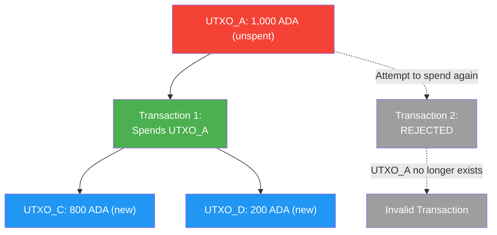
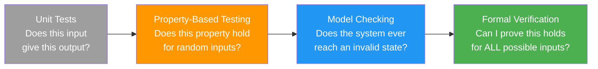
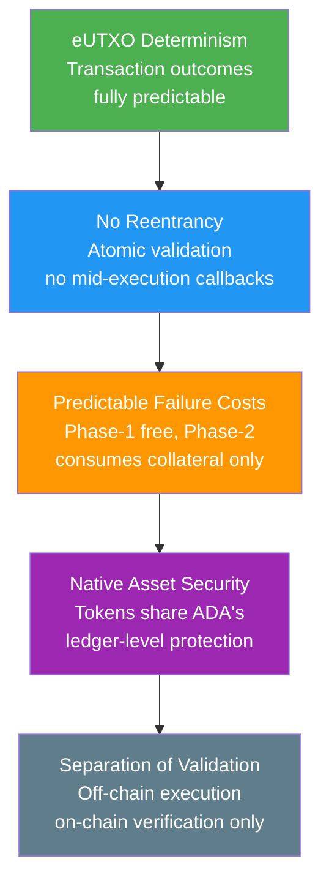

# レッスン #14：ブロックチェーンセキュリティ

ブロックチェーンセキュリティは、ネットワークレベルのコンセンサス保護からスマートコントラクトの脆弱性防止まで、検閲耐性、不変性、オンチェーントランザクションのトラストレスな実行を確保する防御の全範囲を包含します。ブロックチェーン空間に参入するWeb2開発者にとって、セキュリティモデルは根本的に異なります。スマートコントラクトのバグは恥ずかしいだけでなく、取り消し不能な金銭的損失です。このレッスンでは、ネットワークレベルの攻撃からスマートコントラクトの脆弱性まで、セキュリティのランドスケープ全体をカバーし、Cardanoの設計が最も壊滅的な攻撃ベクトルの多くに対して意味のある保護を提供する理由を説明します。

## 主要なネットワークレベルのセキュリティ脅威とは？

ネットワークレベルの脅威はコンセンサスメカニズム自体を標的とし、51%攻撃（過半数のステーク制御を必要とする）、長距離攻撃（過去のステークポジションを悪用する）、エクリプス攻撃（正直なネットワークからノードを隔離する）が、CardanoのOuroborosプロトコルが防御する主要なカテゴリを代表します。

### 51%攻撃とは？

**51%攻撃**（または過半数攻撃）により、コンセンサスパワーの半分以上を制御する攻撃者は、二重支出、トランザクションの検閲、チェーンの再編成が可能になります。Proof of Workシステムではマイニングパワーの過半数の制御を意味し、Cardanoのプルーフ・オブ・ステークモデルでは、ステークされた全ADAの50%以上の制御が必要になります。

```
51% Attack (Double Spend):

Honest Chain:    [Block 1] -> [Block 2] -> [Block 3: Pay Alice 100 ADA]
                                            Alice sees payment,
                                            ships goods to attacker

Attacker's Chain: [Block 1] -> [Block 2] -> [Block 3': No payment to Alice]
(created secretly                           -> [Block 4': Attacker spends
 with >50% stake)                               coins elsewhere]

When attacker publishes longer chain, network adopts it.
Alice's payment disappears. Attacker has both the goods AND the coins.
```

何千ものステークプールにわたって約220〜240億ADAがステークされているため、51%攻撃には数十億ドル相当のADAを購入・ステークする必要があり、それ自体が価格を劇的に押し上げ、攻撃をますます高コストにします。ノンカストディアルデリゲーションモデルは、攻撃者が単にステークを「レンタル」できないことも意味します。実際にトークンを取得してステークする必要があります。

さらに、Ouroborosは特定の仮定のもとで**証明可能なセキュリティ**を提供します。セキュリティ証明は、正直なステークが50%を超える限り、攻撃成功の確率は確認数の増加とともに指数関数的に減少することを保証します。

### 長距離攻撃とは？

長距離攻撃は、かつて重要なステークを保持していた（がその後売却した）攻撃者が、十分なステークを持っていた時点から始まる代替チェーンを作成しようとする、プルーフ・オブ・ステークシステム固有の懸念です。CardanoのOuroboros Genesisプロトコルは、チェーンの密度とブロック生成パターンを分析することで、新しいノードが正直なチェーンと長距離攻撃チェーンを区別できるようにすることでこれに対処します。

### エクリプス攻撃とシビル攻撃とは？

**エクリプス攻撃**は、攻撃者が制御するピアでノードを囲むことで、正直なネットワークからノードを隔離します。被害者ノードは攻撃者のブロックチェーンのビューのみを見ることになり、二重支出トランザクションや検閲されたブロックを含む可能性があります。

**シビル攻撃**は、ネットワークに対して不釣り合いな影響力を得るために多数の偽のアイデンティティ（ノード、ステークプール）を作成します。Cardanoの文脈では、飽和メカニズムとプレッジ要件（レッスン12で議論）がシビル耐性として機能します：多数のプールを作成するには比例した資本が必要であり、プレッジのないプールは報酬が減少します。

CardanoのP2Pネットワーキングレイヤーは、多様なピア選択を通じたエクリプス攻撃に対する防御を含み、ノードが異なるネットワークセグメントと地理的地域にわたるピアとの接続を維持することを確保します。

## eUTXOはどのように二重支出を防止するのか？

eUTXOモデルは、すべての未使用トランザクションアウトプットを追跡し、消費された瞬間にUTXOセットから削除することで、プロトコルレベルで二重支出を防止し、同じアウトプットを再度使用しようとする試みを構造的に無効にします。



これは、ノンストラッキングと注意深い状態管理を通じて二重支出を防止する必要があるアカウントモデルよりもシンプルで堅牢です。UTXOモデルは二重支出防止を手続き的ではなく構造的にします。

## 開発者が知るべきスマートコントラクトの脆弱性とは？

スマートコントラクトのバグは、デプロイされたコントラクトが不変（または変更が非常に困難）であり、しばしば重要な金融的価値を制御するため、特に危険です。単一の脆弱性が取り消し不能な資金の喪失につながる可能性があります。主要な脆弱性カテゴリには、リエントランシー（Cardanoでは不可能）、Datumハイジャッキング、二重充足、トークン偽造が含まれます。

### なぜCardanoはリエントランシー攻撃に対して免疫があるのか？

**リエントランシー攻撃**は最も有名なスマートコントラクトの脆弱性であり、2016年のDAO Hackで6,000万ドルのETH損失の原因となりました。Ethereumのアカウントモデルでは、コントラクトが別のコントラクトを呼び出すことができ、その呼び出し先が最初の呼び出しが完了する前に元のコントラクトにコールバックできます。元のコントラクトがまだ状態を更新していない場合、リエントラント呼び出しが古いデータを悪用します。

**Cardanoはリエントランシー攻撃に対して本質的に免疫があります。** eUTXOモデルでは、トランザクションは完全なアトミック単位です。バリデータースクリプトはインプットごとに一度実行され、与えられた条件のもとでUTXOを使用できるかどうかを評価します。実行中にコントラクトが別のコントラクトを「呼び出す」という概念がありません。トランザクション全体（すべてのインプット、アウトプット、スクリプト実行を含む）が単一の単位として検証されます。すべてが成功するかすべてが失敗するかです。リエントラント呼び出しが古いデータを悪用できる実行中の状態はありません。

### Datumハイジャッキングとは？

**Datumハイジャッキング**は、スクリプトアウトプットがアタッチされたDatumを適切に検証しない場合に発生し、攻撃者が継続するUTXOの所有権やその他の重要なフィールドを変更する悪意あるDatumを置換できるようにします。

```
Datum Hijacking:

Normal Flow:
  Input UTXO:  [Script Address, Datum: {owner: "Alice", amount: 100}]
  Output UTXO: [Script Address, Datum: {owner: "Alice", amount: 80}]
  (Alice withdrew 20 ADA)

Attack:
  Input UTXO:  [Script Address, Datum: {owner: "Alice", amount: 100}]
  Output UTXO: [Script Address, Datum: {owner: "Attacker", amount: 100}]
  (Attacker changes the owner in the continuing datum!)
```

**防止策**：バリデーターは、アウトプットDatumがすべての期待される制約を満たすことを明示的にチェックする必要があります。これには、不変フィールド（所有権など）が変更されていないことの検証、可変フィールド（残高など）が許可されたルールに従って変更されていることの検証、Datum構造が期待されるスキーマに一致することの検証が含まれます。

### 二重充足脆弱性とは？

**二重充足**は、同一トランザクション内で単一のUTXOが複数のバリデーターの条件を満たす場合に発生し、攻撃者が2つのスクリプトの要件を2つではなく1つのアウトプットで満たすことを可能にします。

```
Double Satisfaction Attack:

Script A (DEX Pool): "This swap is valid if output contains 100 DJED"
Script B (Lending):  "This withdrawal is valid if output contains 100 DJED"

Attacker's Transaction:
  Inputs:
    - DEX Pool UTXO (Script A)
    - Lending Pool UTXO (Script B)
  Outputs:
    - ONE output with 100 DJED

  Both Script A and Script B see the 100 DJED output and consider
  their conditions satisfied, but only ONE output exists.
  The attacker effectively got 100 DJED for the price of 0.
```

**防止策**：スクリプトはアウトプットにユニークな識別子（「ステートトークン」または「ビーコントークン」と呼ばれる特定のNFTなど）を含め、「何らかのアウトプット」が条件を満たすかどうかをチェックするだけでなく、特定のアウトプットが存在することを検証すべきです。

### リソース枯渇攻撃の仕組み

Cardanoバリデーターにはエクゼキューションバジェット（トランザクションあたりのCPUとメモリの制限）があります。より巧妙な攻撃は、許可される最大リソースを消費するトランザクションを作成し、プロトコルに対するサービス拒否状態を効果的に作り出すことです。

**防止策**：スクリプト作成者は最悪ケースの実行コストを意識すべきです。パラメーター化されたスクリプトの使用、ループのイテレーション制限、コストの高い操作のオフチェーンでの事前計算がすべて、オンチェーンバリデーションを軽量に保つのに役立ちます。

### トークン偽造とポリシーの脆弱性

ミンティングポリシーが注意深く記述されていない場合、攻撃者が不正なトークンをミントする可能性があります。一般的な脆弱性には以下が含まれます：

- **認可チェックの欠如**：特定のUTXOインプットまたは署名の存在を検証しないポリシー
- **再利用可能なミンティングポリシー**：実際には複数回呼び出せるワンタイムミンティングポリシー（NFT用）
- **ポリシーパラメーターの操作**：パラメーターを受け入れるが適切に検証しないポリシー

```
One-Time Minting (Correct Pattern):

Policy: "Minting is allowed ONLY if this specific UTXO is consumed as input"

  Transaction 1 (Minting):
    Inputs: [UTXO_Unique_123]    <-- This UTXO is consumed (destroyed)
    Mints:  [1 MyNFT]

  Transaction 2 (Attempted Re-Mint):
    Inputs: [???]                <-- UTXO_Unique_123 no longer exists!
    Mints:  [1 MyNFT]           <-- FAILS: Cannot satisfy minting policy
```

## 形式検証はどのようにスマートコントラクトのセキュリティを向上させるのか？

形式検証は、プログラムがすべての可能な入力に対して正しく動作することを数学的証明で示す手法であり（テストした入力だけでなく）、航空宇宙、医療機器、暗号プロトコルなどの安全性が重要なシステムで使用されるソフトウェア検証のゴールドスタンダードです。

Cardanoのスマートコントラクト言語Plutusは、形式的推論に自然に適したHaskell（関数型プログラミング言語）上に構築されています。純粋関数型パラダイム（副作用なし、可変状態なし）により、コードの動作に関するプロパティの証明がはるかに容易になります。



**Agda**は依存型プログラミング言語であり、Cardanoの形式仕様で使用される証明支援系です。Cardanoの台帳仕様自体がAgdaで形式化されており、ブロックチェーンを支配するルールが数学的に検証されていることを意味します。ほとんどのアプリケーション開発者がAgdaを書くことはありませんが、基盤となるプロトコルが形式的に検証されているという事実は、強固な基盤を提供します。

### プロパティベーステストはどのようにスマートコントラクトを強化するのか？

**プロパティベーステスト**（PBT）は、ユニットテストと形式検証の中間的な手法です。個別のテストケースを指定する代わりに、常に成り立つべきプロパティを定義し、テストフレームワークが何千ものランダムな入力を生成して違反を見つけようとします。

Cardanoバリデーターのプロパティには以下が含まれる可能性があります：

- 「いかなるトランザクションも、預入額に許可された報酬を加えた額以上の価値を引き出すことはできない」
- 「指定された所有者のみが引き出しを認可できる」
- 「スクリプトにロックされた合計価値は、認可された操作以外では減少できない」
- 「バリデーションを通過するすべてのトランザクションは、インプットから手数料を引いた合計価値に等しいアウトプットを生成する」

プロパティベーステストは、入力空間（可能なトランザクション、Datum、Redeemer）が複雑で、手動のテストケースでカバーするのが困難なため、スマートコントラクトに特に効果的です。QuickCheck（Haskell）やHedgehogなどのツールは、開発者が手動でテストすることを決して思いつかないエッジケースを体系的に探索できます。

### 監査とピアレビューが不可欠な理由

自動テスト以外にも、専門のセキュリティ企業によるスマートコントラクト監査は、ブロックチェーン業界の標準的な実践です。監査には通常以下が含まれます：

1. **コードレビュー**：スマートコントラクトコードの一行ごとの検査
2. **アーキテクチャレビュー**：全体的なプロトコル設計と信頼の前提の分析
3. **攻撃対象領域の分析**：すべての可能な攻撃ベクトルの特定
4. **形式分析**：重要なプロパティの数学的検証（該当する場合）
5. **ペネトレーションテスト**：テストネット上でのコントラクトの悪用試行

Cardanoでは、Tweag、MLabs、Anastasia Labsなど、複数の企業がPlutusスマートコントラクト監査を専門としています。Minswap、Liqwid、SundaeSwapなどのプロトコルは、メインネットデプロイメント前に複数回の監査を受けています。

## Cardanoのアーキテクチャが提供するセキュリティ上の利点

Cardanoのアーキテクチャは、4つの構造的セキュリティ利点を提供します：決定論的トランザクション評価（MEVの排除）、固有のリエントランシー免疫、予測可能な失敗コスト（Phase-1バリデーション失敗はコストゼロ、Phase-2スクリプト失敗は担保のみを消費）、そしてADAの台帳レベルの保護を共有するネイティブアセットセキュリティです。



### 決定論的評価はどのようにMEVを排除するのか？

Ethereumでは、トランザクションの結果は実行時のグローバル状態に依存し、トランザクションが構築された時点の状態と異なる可能性があります。これにより、マイナーやバリデーターがトランザクションの並べ替え、挿入、検閲によって利益を得る**MEV（Maximal Extractable Value）**と総称される攻撃のクラスが生まれます。

Cardanoでは、トランザクションの結果は**完全に決定論的**です。トランザクションは正確なインプット（消費するUTXO）と正確なアウトプット（作成するUTXO）を指定します。指定されたインプットがトランザクションがチェーンに到達した時点でまだ存在していれば、構築された通りに正確に実行されます。いずれかのインプットが使用されていれば、トランザクションは部分的な実行や予期しない副作用なしに単純に失敗します。

この決定性は攻撃のカテゴリ全体を排除し、スマートコントラクトのセキュリティについて推論することをはるかに容易にします。

### ネイティブアセットはどのようにセキュリティを強化するのか？

Ethereumでは、トークンはスマートコントラクト（ERC-20）として実装されており、各トークンコントラクトは独自の攻撃対象領域です。トークンコントラクトの脆弱性は重大な損失につながっています。Cardanoでは、ネイティブアセット（トークン）は台帳自体によって処理され、ADAと同じセキュリティ保証を共有します。悪用するトークンコントラクトはありません。ミンティングポリシーが作成を制御しますが、トークンが存在すれば、ADAの転送、保有、計上と同じ台帳ルールが適用されます。

### バリデーションと実行の分離はどのように役立つのか？

Cardanoでは、スマートコントラクトの「実行」はオフチェーンで完全に行われます（正しいインプットとアウトプットでトランザクションを構築する）。オンチェーンバリデーターはトランザクションが正しいことを検証するだけです。この分離は以下を意味します：

- オンチェーンで実行されるコードが少なく、攻撃対象領域が縮小
- オフチェーンコードはオンチェーンバリデーターを変更せずに更新可能
- 複雑なビジネスロジックはトランザクション送信前にオフチェーンで徹底的にテスト可能

## Cardanoにおける一般的なセキュリティパターン

経験豊富なCardano開発者は、安全なバリデーターを記述するために確立されたパターンに従います：

### ステートトークンパターン
ワンタイムポリシーでミントされたユニークなNFTを「ステートトークン」として使用し、スクリプトアドレスのすべてのUTXOに存在する必要があります。これにより、不正なUTXOがアドレスに作成されることを防ぎ、二重充足問題を解決します。

### 価値保全チェック
スクリプトアウトプットの合計価値が期待される価値（インプット価値から認可された引き出しを差し引き、認可された預入を加えたもの）と等しいことを常に検証します。暗黙的な価値保全に依存しないでください。

### Datum継続性バリデーション
スクリプトUTXOが「継続」する必要がある場合（消費されて更新された状態で再作成される）、期待される遷移ルールに対してアウトプットDatumのすべてのフィールドを明示的に検証します。Datumが存在するからといって正しいと仮定しないでください。

### デッドライン強制
トランザクションの有効性範囲（valid-fromおよびvalid-toスロット）を使用して時間ベースの条件を強制します。Cardanoのトランザクション有効性インターバルはプロトコルレベルでチェックされ、スクリプトロジックに信頼性の高い時間制限を提供します。

### 最小限のオンチェーンロジック
バリデーターをできるだけシンプルに保ちます。オンチェーンコードのすべての行が潜在的な脆弱性です。複雑なロジックをオフチェーンに移動し、バリデーターは重要な不変条件のチェックにのみ使用します。

## Web2アナロジー

ブロックチェーンセキュリティには、Web2セキュリティとの多くの類似点があり、既存の知識がよく転用されます：

**リエントランシーはCSRF（クロスサイトリクエストフォージェリ）攻撃のようなものです。** CSRFでは、悪意あるWebサイトが、サーバーがリクエストの発信元を検証しないために、別のサイトでの認証済みセッションでアクションをトリガーします。リエントランシーでは、悪意あるコントラクトが実行の予期しないポイントでコントラクトへのコールバックをトリガーします。どちらも操作中の適切な状態管理の欠如を悪用します。CardanoはSameSiteクッキーやCSRFトークンがWeb2でそれに対処するように、構造的にこれを排除します。

**DatumハイジャッキングはSQLインジェクションのようなものです。** SQLインジェクションでは、攻撃者が入力データを操作してクエリの意味を変更します。Datumハイジャッキングでは、攻撃者がDatumを操作してスクリプトの状態の意味を変更します。どちらもすべての入力データの検証によって防止されます。境界にあるデータが適切な形式であるか認可されていると決して信頼しないでください。

**二重充足はパラメーター改ざんやIDOR（安全でない直接オブジェクト参照）のようなものです。** 攻撃者は自分の認可チェックを満たすために他人のリソース（アウトプット）を参照します。両方のドメインでの防止には、検証されるリソースが実際にそれが属すべきエンティティに属していることを確認する必要があります。

**スマートコントラクト監査はペネトレーションテストとコード監査のようなものです。** ローンチ前にWebアプリケーションのペンテストをセキュリティ企業に依頼する（OWASPガイドラインに従う）のと同様に、メインネットデプロイメント前にスマートコントラクトのレビューを監査者に依頼します。ステークは類似しています（データ漏洩vs資金損失）が、スマートコントラクトエクスプロイトの取り消し不能性により、監査はさらに重要になります。

**形式検証は型システムのステロイド版のようなものです。** TypeScriptはコードが型を正しく処理することを確認することで、コンパイル時に多くのバグをキャッチします。形式検証はこの概念を任意のプロパティに拡張します：「これは数値か？」だけでなく、「残高がマイナスになることはあり得るか？」や「不正なユーザーが資金を引き出すことは不可能か？」を検証します。

**51%攻撃はインフラストラクチャの敵対的買収のようなものです。** 攻撃者がCDNエッジノードの過半数の制御を獲得したことを想像してください。正当なデータを受け取っていると信じるユーザーに悪意あるコンテンツを提供できます。51%攻撃はブロックチェーンの同等物です：偽の履歴を提供するためにコンセンサスパワーの過半数を制御します。

## 重要なポイント

- **ネットワークレベルの攻撃（51%、長距離、エクリプス）はCardanoのOuroborosプロトコルによって緩和されます。** 正直多数派の仮定のもとで証明可能なセキュリティを提供し、ステーク分配とP2Pネットワーキングを通じた実用的な防御を備えています。
- **Cardanoのスマートコントラクト脆弱性はEthereumとは異なります**：リエントランシーは設計上不可能ですが、開発者は慎重なバリデーター設計を通じてDatumハイジャッキング、二重充足、トークン偽造に対して防御する必要があります。
- **形式検証とプロパティベーステスト**は、ユニットテストだけよりもはるかに強力な保証を提供し、CardanoのHaskellベースのエコシステムはこれらの厳密な検証技術に適しています。
- **Cardanoの決定論的トランザクションモデルはMEVとフロントランニングを排除します。** ユーザーは、トランザクションが構築通りに正確に実行されるか、まったく実行されないかの信頼を得ます。
- **セキュリティは機能ではなく設計原則です**：eUTXOモデル、ネイティブアセット、バリデーションと実行の分離はすべて、金融アプリケーション構築のための構造的により安全なプラットフォームに貢献します。

## 次のステップ

セキュリティがシステムを保護しますが、システムの進化を誰が決定するのでしょうか？このコースの最後のレッスンでは、Cardanoのガバナンスモデルをカバーします：プロトコルの変更がどのように提案され、議論され、投票され、ブロックチェーンで最も野心的なオンチェーンガバナンスシステムを通じて制定されるかです。
