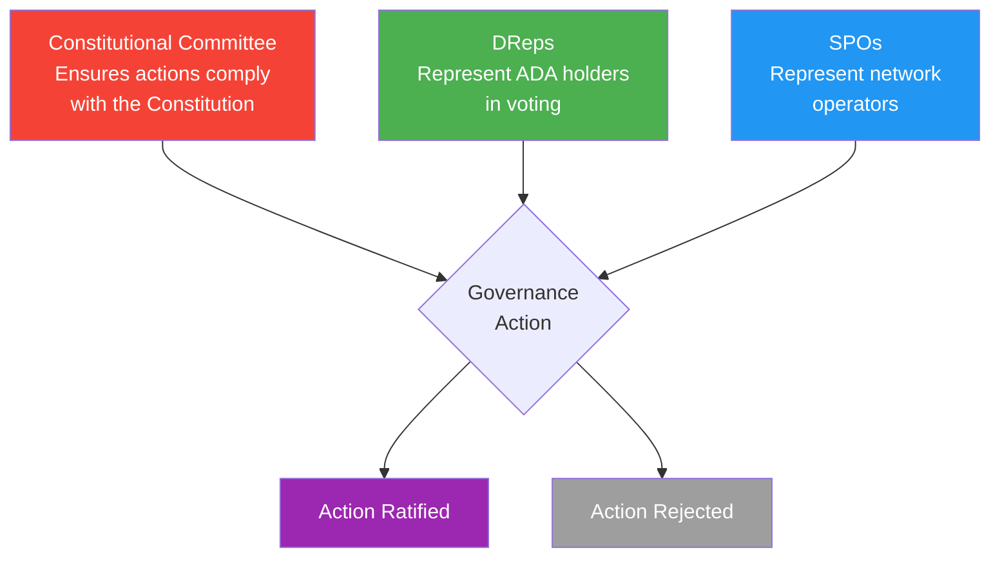
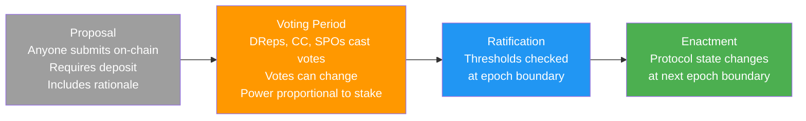
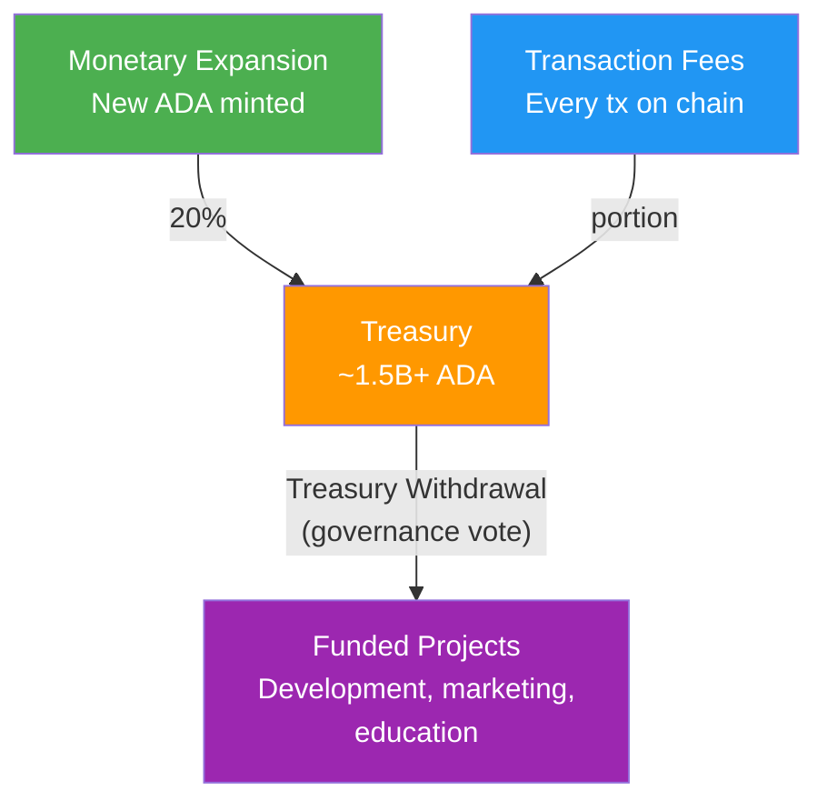

# レッスン #15：Cardanoガバナンス

Cardanoのオンチェーンガバナンスシステム（CIP-1694で定義）は、ADAホルダーがConstitutional Committee、Delegated Representatives（DReps）、Stake Pool Operators（SPOs）の3つの機関を通じてプロトコル変更を提案、投票、制定することを可能にします。このレッスンでは、Voltaire時代の仕組み、その重要性、そしてプラットフォーム上で構築する開発者にとっての意味を探求します。

## なぜガバナンスが開発者にとって重要なのか？

ガバナンスは、Cardano開発者が依存するパラメーター、言語バージョン、資金調達メカニズムを直接形成するため、プラットフォーム上でスマートコントラクトを構築または保守する人にとってガバナンスリテラシーは不可欠です。

- **プロトコルパラメーターがコードに影響します**：トランザクションサイズ制限、エクゼキューションユニットバジェット、最小UTXO値、手数料計算はすべてガバナンスで制御されるパラメーターです。ガバナンス投票によりこれらのパラメーターが変更され、スマートコントラクトに直接影響する可能性があります。
- **ハードフォークには調整が必要です**：プロトコルがアップグレードされる場合（スマートコントラクトを導入したAlonzoハードフォークや、オンチェーンガバナンスを有効化したChangハードフォークなど）、すべてのステークプールとノードオペレーターがアップグレードする必要があります。ガバナンスプロセスを理解することで、これらの変更を予測し準備できます。
- **トレジャリー資金調達**：Cardanoのトレジャリーは数億ADAを保持しており、ガバナンスがその使途を決定します。開発者として、トレジャリー資金調達のためのプロジェクトを提案できます。
- **ユーザーが参加します**：ADAホルダーはガバナンス参加者です。ウォレット、DeFiプロトコル、またはCardanoアプリケーションを構築する場合、ユーザーはあなたのインターフェースを通じてガバナンス機能とやりとりする可能性があります。

## Cardanoはどのようにしてvoltaire時代に到達したのか？

Cardanoの開発は段階的なロードマップ（Byron、Shelley、Goguen、Basho、Voltaire）に従い、各フェーズが基盤的な機能を追加し、Voltaire時代の完全なオンチェーンガバナンスに至り、創設エンティティからADAホルダーコミュニティへの制御の移行を実現しました。

```
Cardano開発フェーズ:

Byron (2017)       : 基盤：基本的なトランザクション、ADA送金
Shelley (2020)     : 分散化：ステーキング、デリゲーション、ステークプール
Goguen (2021)      : スマートコントラクト：Plutus、ネイティブアセット、DeFi
Basho (ongoing)    : スケーリング：Hydra、サイドチェーン、パフォーマンス最適化
Voltaire (2024+)   : ガバナンス：オンチェーン投票、トレジャリー、自己持続性
```

Voltaire時代は、Cardanoが創設エンティティ（Input Output Global、Cardano Foundation、EMURGO）によって統治されるシステムから、ADAホルダーのコミュニティによって統治されるシステムへの移行を表しています。これは表面的な変更ではありません。単一の企業や組織がプロトコルの将来を一方的に制御できなくなることを意味します。

**Changハードフォーク**（2024年9月）がオンチェーンガバナンスの第1フェーズを有効化し、**Plominハードフォーク**（2025年1月29日、当初Chang #2と呼ばれていた）が残りのガバナンス機能を有効化し、CIP-1694を完全に実装しました。

## CIP-1694の3つのガバナンス機関とは？

CIP-1694は、Constitutional Committee、Delegated Representatives、Stake Pool Operatorsの3つのガバナンス機関を確立し、各機関が異なる構成員を代表し異なるガバナンスアクションタイプに投票するチェック・アンド・バランスシステムを形成します。



**Constitutional Committee（CC）**：憲法の守護者として選出されたメンバーのグループです。提案されたガバナンスアクションがCardano Constitutionに準拠しているかを検証する役割を担います。Constitutionは、ブロックチェーンを統治する価値、原則、ルールを定義する基礎文書です。CCはアクションが良いアイデアかどうかを決定するのではなく、憲法上許容されるかどうかを決定します。憲法裁判所のようなものと考えてください。

CCは任期制限があり（メンバーは定められた期間務め、再選される必要がある）、サイズ閾値があり（最低限のメンバー数が投票する必要がある）、コミュニティがその役割を果たしていないと判断した場合は「不信任」投票で交代させることができます。

**Delegated Representatives（DReps）**：DRepsはガバナンスにおけるADAホルダーの主要な声です。任意のADAホルダーがDRepとして登録するか、信頼するDRepに投票権を委譲できます。これは代議制民主主義に類似しています：すべてのガバナンス提案を評価する時間がないかもしれないので、あなたの利益を代表する誰かに投票を委譲します。

**Stake Pool Operators（SPOs）**：SPOsは特定のアクションタイプ、特にハードフォークの開始と特定のプロトコルパラメーター変更に関するガバナンス投票に参加します。その投票は、プロトコル変更を実装する必要があるネットワークインフラストラクチャオペレーターの視点を反映します。

### ガバナンスデリゲーションの仕組み

ADAホルダーがブロック生成のためにステークプールにステークをデリゲートする（レッスン12）のと同様に、ガバナンスのためにDRepに投票権をデリゲートします。重要なのは、ステークデリゲーションとガバナンスデリゲーションは独立していることです。報酬のためにPool Aにステークをデリゲートしながら、ガバナンスのためにDRep Bに投票をデリゲートできます。

```
デリゲーション：ステーク vs ガバナンス

+------------------+
|   ADA Holder     |
|   (10,000 ADA)   |
+--------+---------+
         |
    +----+----+
    |         |
    v         v
+--------+ +--------+
| Stake  | | Vote   |
| Deleg. | | Deleg. |
|        | |        |
| Pool A | | DRep B |
|(rewards| |(govrnce|
| & block| | voting)|
| prod.) | |        |
+--------+ +--------+

これらは別々のデリゲーションです。
一方を変更しても他方に影響しません。
```

特定のDRepを選びたくないADAホルダーのための2つの特別なデリゲーションオプションもあります：

- **Abstain**：投票権はいかなる投票にもカウントされません。参加しないことを明示的に選択します。
- **No Confidence**：投票権は自動的にいかなるガバナンスアクションにも反対票を投じ、現在のガバナンスシステムへの不信を表明します。これは抗議のデリゲーションの一形態です。

すべてのADAホルダーは、ステーキング報酬の資格を得るためにガバナンスデリゲーション（特定のDRep、Abstain、またはNo Confidence）を選択する必要があります。これにより、ガバナンスへの幅広い参加が確保されます。

## 7つのガバナンスアクションタイプとは？

CIP-1694は7つのガバナンスアクションタイプ（不信任、新委員会、憲法更新、ハードフォーク開始、パラメーター変更、トレジャリー引き出し、情報アクション）を定義し、各タイプは特定の投票閾値で特定のガバナンス機関の組み合わせからの承認を必要とします。

```
ガバナンスアクションタイプ:

+-------------------------+----------+-------+------+
| Action Type             |    CC    | DReps | SPOs |
+-------------------------+----------+-------+------+
| 1. No Confidence        |    --    |  Yes  | Yes  |
| 2. New Committee/       |    --    |  Yes  | Yes  |
|    Threshold            |          |       |      |
| 3. Constitution Update  |   Yes    |  Yes  |  --  |
| 4. Hard Fork Initiation |   Yes    |  Yes  | Yes  |
| 5. Protocol Parameter   |   Yes    |  Yes  |  *   |
|    Changes              |          |       |      |
| 6. Treasury Withdrawal  |   Yes    |  Yes  |  --  |
| 7. Info Action          |    --    |  Yes  | Yes  |
+-------------------------+----------+-------+------+

CC  = Constitutional Committee must approve
Yes = This body votes on this action
--  = This body does not vote on this action
*   = SPOs vote on specific parameter groups only
```

**1. 不信任動議**：現在のConstitutional Committeeを解散させる投票です。可決された場合、CCは解散され、他のほとんどのガバナンスアクションが進行できるようになる前に新しい委員会が選出される必要があります。これは正統性を失ったCCを排除するためのコミュニティの緊急メカニズムです。

**2. 新Constitutional Committee / 閾値変更**：新しいCCメンバーを提案、既存メンバーを除外、またはCCのサイズ/閾値要件を変更します。これはコミュニティが憲法の守護者を選出または交代させる方法です。

**3. 憲法更新**：Cardano Constitution自体を変更します。これは最高レベルのガバナンス変更であり、他のすべてのアクションが準拠しなければならない基礎文書を変更します。CCとDRepの承認が必要ですが、SPOの投票は不要です。

**4. ハードフォーク開始**：コンセンサスルールを変更するプロトコルアップグレードをトリガーします。ハードフォークは全員に影響するため（憲法上許可されていなければならず、コミュニティが変更を受け入れなければならず、オペレーターがソフトウェアを更新しなければならない）、3つのガバナンス機関すべてが必要です。

**5. プロトコルパラメーター変更**：ネットワーク（スループット）、経済（手数料とインセンティブ）、技術（スクリプト制限）、ガバナンスカテゴリにグループ化された数十の設定可能なプロトコルパラメーターを変更します。

**6. トレジャリー引き出し**：プロジェクト、開発、またはエコシステムイニシアチブに資金を提供するためにオンチェーントレジャリーからADAを引き出します。これはコミュニティがリソースを割り当てるメカニズムです。

**7. 情報アクション**：拘束力のない「コミュニティの意見確認」投票です。情報アクションはプロトコルを変更しませんが、コミュニティが意見を表明し、方向性を設定し、立場を支持するための正式なメカニズムとして機能します。

## ガバナンスアクションのライフサイクルとは？

ガバナンスアクションは4つの段階を経ます：提案（誰でもデポジットとともにオンチェーンで提出）、投票期間（DReps、CC、SPOsが投票）、承認（プロトコルがエポック境界で閾値をチェック）、制定（次のエポック境界でプロトコル状態が変更）。



### 投票閾値とは？

各ガバナンスアクションタイプには、各ガバナンス機関の特定の閾値要件があります。これらの閾値自体がガバナンスで制御されるパラメーターであり、コミュニティがガバナンスプロセスを通じて調整できることを意味します。

例えば、ハードフォーク開始には以下が必要な場合があります：

- CC：アクティブメンバーの過半数が承認
- DReps：アクティブ投票権の67%がYesに投票
- SPOs：アクティブステークの51%がYesに投票

情報アクションには以下が必要な場合があります：

- DReps：アクティブ投票権の51%
- SPOs：アクティブステークの51%

正確な閾値はプロトコルパラメーターとして設定されており、オンチェーンで確認できます。

## Cardano Constitutionとは？

Cardano Constitutionは、オンチェーンガバナンス投票を通じて批准された基礎文書であり、ブロックチェーンを統治する原則、価値、権利、ガードレールを確立し、Constitutional Committeeがすべてのガバナンスアクションを評価する「最高法規」として機能します。

Constitutionがカバーする内容：

- **目的と原則**：Cardanoが存在する理由とガバナンスを導く価値
- **ADAホルダーの権利**：エコシステム参加者の保護
- **ガバナンスフレームワーク**：CIP-1694で定義された構造とルール
- **プロトコルパラメーター**：単一のアクションでパラメーターをどこまで変更できるかを制約するガードレール（極端または危険な変更の防止）
- **修正プロセス**：Constitution自体をどのように変更できるか

Constitutional Committeeはすべてのガバナンスアクションをこの文書に照らして評価します。アクションがConstitutionに違反する場合（例えば、ガードレール範囲外のパラメーター変更を提案する場合）、CCはDRepやSPOのサポートに関わらず反対票を投じ、承認を阻止すべきです。

```
Constitutionalガードレールの例:

Parameter: Maximum Block Size
Current value: 90,112 bytes
Guardrail: Cannot be changed by more than 2x in a single action

Proposed Action: Set max block size to 200,000 bytes
CC Assessment: 200,000 > 90,112 * 2 = 180,224
              This exceeds the guardrail. CC votes NO.

Proposed Action: Set max block size to 131,072 bytes
CC Assessment: 131,072 < 180,224
              Within guardrails. CC evaluates on merit.
```

## Cardanoトレジャリーの仕組み

Cardanoトレジャリーはマネタリーエクスパンション（各エポックの報酬の20%）とトランザクション手数料からADAを蓄積し、現在15億ADA以上を保有しています。これはオンチェーンガバナンス投票を通じてのみ使用でき、ブロックチェーンにおける最大級の分散型トレジャリーの1つです。



CIP-1694以前は、トレジャリーの引き出しは**Project Catalyst**（部分的にオンチェーン、部分的にオフチェーンの資金調達メカニズム）を通じて管理されていました。Voltaire時代では、トレジャリーの引き出しは正式なガバナンスアクションタイプとなり、ADAホルダーが共有リソースの配分を直接制御できるようになりました。

## Intersectのガバナンスにおける役割

**Intersect**は、Cardanoのガバナンスの管理的バックボーンとして機能するメンバーベースの組織であり、コードベースのメンテナンス、ガバナンスツーリング、コミュニティプログラムを調整しますが、統治権限自体は行使しません。

Intersectの役割には以下が含まれます：

- **Cardanoコードベースの保守**：コアソフトウェア（cardano-node、Plutusなど）の開発調整
- **ガバナンスプロセスの促進**：ガバナンス参加のためのツール、ドキュメント、インフラストラクチャの提供
- **ガバナンスエコシステムの管理**：DRepsのサポート、Constitutional Committee選挙の調整、ガバナンスツーリングの保守
- **コミュニティ調整**：ガバナンスに関するワークショップ、タウンホール、教育プログラムの組織

Intersectのメンバーシップは組織と個人に開放されています。メンバーはワーキンググループに参加し、技術的決定に貢献し、ガバナンスプロセスの形成を支援できます。単一のエンティティが支配することを防ぐ構造で、多様な理事会と透明な運営を備えています。

## 利用可能なガバナンスツール

ガバナンスが機能するためには、参加者が提案を発見、評価、投票するためのツールが必要です。Cardanoエコシステムにはいくつかのガバナンスツールが含まれます：

- **GovTool**：ガバナンスアクションの閲覧、DRepへのデリゲーション、投票のためのWebベースインターフェースです。トランザクション署名のためにCardanoウォレット（Eternl、Lace、Yoroiなど）に接続します。
- **SanchoNet**：メインネットデプロイメント前にガバナンス機能がテストされた専用ガバナンステストネットです。ドン・キホーテの実践的な相棒サンチョ・パンサにちなんで名付けられました（Voltaireが時代の名前の由来）。
- **DRep Explorer**：DRepsの発見、投票履歴の閲覧、立場の評価のためのツールです。
- **Cardanoscan / CExplorer**：トランザクションデータとともにガバナンスアクション、投票、委員会情報を表示するブロックエクスプローラーです。

ウォレット開発者にとって、ガバナンス統合とは以下のサポートを意味します：
- DRep登録トランザクション
- 投票デリゲーショントランザクション（ステークデリゲーションとは別）
- ガバナンス提案と投票状況の表示
- 登録されたDRepsの直接投票の有効化

## ガバナンスはスマートコントラクト開発にどう影響するのか？

ガバナンスの決定は、エクゼキューションバジェットの変更からPlutus言語のアップグレード、トレジャリーが資金提供する開発機会まで、スマートコントラクト開発者に具体的な方法で影響します。

**パラメーター変更がスクリプトのエクゼキューションバジェットに影響します。** ガバナンスがトランザクションあたりの最大エクゼキューションユニットを削減した場合、現在の制限に近い値を使用している既存のスクリプトが動作しなくなる可能性があります。スマートコントラクト開発者はマージンを持って設計し、技術パラメーターに影響するガバナンス提案を監視すべきです。

**ハードフォークはPlutus言語を変更できます。** プロトコルアップグレードにより、新しいPlutusバージョン（Plutus V1、V2、V3）が新機能とともに導入される可能性があります。後方互換性は維持されますが（V1スクリプトは引き続き動作）、新機能にはV3スクリプトが必要な場合があります。例えば、Changハードフォークはガバナンスとのやりとりのための新しいビルトイン関数を備えたPlutus V3を導入しました。

**トレジャリーの引き出しがエコシステム開発に資金を提供します。** 開発者として、プロジェクトの資金調達のためにトレジャリー引き出し提案を提出できます。これは、ベンチャーキャピタルや中央集権的エンティティからの助成金に代わる、直接的なオンチェーンの選択肢です。

**ガバナンスアクションはオンチェーントランザクションです。** DRep登録、投票デリゲーション、ガバナンス投票はすべて標準的なCardanoトランザクションです。開発者としてすでにやりとりしているのと同じインフラストラクチャ（ウォレット、API、ノード）を使用します。レッスン13と同じスキルとツールを使用して、ガバナンスツーリング、アナリティクスダッシュボード、DRepプラットフォームを構築できます。

## ブートストラップフェーズで何が起きたのか？

Changハードフォークが最初にガバナンスを有効化した際、Cardanoは一時的なConstitutional Committee、制限されたガバナンスアクション、暫定Constitutionが有効な**ブートストラップフェーズ**に入りました。コミュニティが新しいシステムに慣れ、完全な批准プロセスが並行して進行する間の移行期間でした。

- 一時的な（「暫定」）Constitutional Committeeが設立された
- コミュニティが新しいシステムに慣れる間、時期尚早な変更を防ぐためガバナンスアクションが制限された
- DRep登録とデリゲーションがアクティブになり、ガバナンスエコシステムが有機的に発展することを可能にした
- 暫定Constitutionが有効であり、最終Constitutionの完全な批准プロセスが並行して進行した

ブートストラップフェーズはPlominハードフォーク（2025年1月29日）で終了し、完全なガバナンス機能を有効化し、批准されたConstitutionと選出されたConstitutional Committeeに移行しました。

## オンチェーンガバナンスが直面する課題

オンチェーンガバナンスは実験的であり、Cardanoの実装はすべての民主主義システムに共通するいくつかの課題に直面しています：有権者参加、情報の非対称性、金権政治的ダイナミクス、敵対的耐性です。

**有権者参加**：すべての民主主義システムと同様に、ガバナンスにはアクティブな参加が必要です。ほとんどのADAホルダーが「Abstain」にデリゲートするか単に関与しない場合、少数派がガバナンス決定を制御する可能性があります。ステーキング報酬を得るためにデリゲーションオプションを選択する要件は、参加を促す1つのメカニズムです。

**情報の非対称性**：複雑な技術的提案（プロトコルパラメーター変更など）の評価には、ほとんどのADAホルダーが持たない専門知識が必要です。DRepsはガバナンス評価に特化することでこれに対処しますが、DRepエコシステムはまだ成熟途上です。

**金権政治の懸念**：投票権はステークに比例します。1億ADAを保持するクジラは、1万ADAを保持する人の10,000倍の投票権を持ちます。これはステークベースのガバナンスに内在するものであり、意図的な設計選択です（より多くのステークを持つ者は悪い決定からより多くを失う）が、公平性とアクセシビリティに関する疑問を提起します。

**ガバナンス攻撃ベクトル**：十分な資金を持つ敵対者が、ガバナンス投票に影響を与えるのに十分なADAを取得する可能性があります。チェック・アンド・バランスシステム（3つのガバナンス機関、憲法ガードレール、段階的閾値）がこれを困難にしますが、どのシステムも攻撃に対して免疫ではありません。

これらの課題はCardano固有のものではありません。すべてのガバナンスシステム（国家政府からオープンソースプロジェクトまで）が参加、専門知識、権力分配、耐性に取り組んでいます。Cardanoのオンチェーンガバナンスはこれらのダイナミクスを透明でプログラム可能にしており、それ自体が利点です。

## Web2アナロジー

Cardanoのガバナンスは、Web2とオープンソースの世界のいくつかの馴染みあるパターンにマッピングされます：

**DRepsはオープンソース財団の選出された代表者のようなものです。** Linux Foundationにはメンバーによって選出された理事会があります。Apache Software Foundationにもメンバーによって選出された理事会があります。DRepsは同様の役割を果たします：ADAホルダーによって（デリゲーションを通じて）選出され、ガバナンス決定において利益を代表します。主な違いは、DRepデリゲーションが流動的（いつでもDRepを変更可能）であり、比例的（投票の重みがADA保有量に等しい）であることです。

**Constitutional Committeeは標準化団体のようなものです。** IETF（Internet Engineering Task Force）はRFCが技術的標準を満たしているかを審査します。CCはガバナンスアクションが憲法上の標準を満たしているかを審査します。どちらの機関も何を構築すべきかを決定するのではなく、提案が確立されたルールと原則に準拠しているかを検証します。

**ガバナンスアクションプロセスはRFC（Request for Comments）のようなものです。** IETFでは、誰でも新しい標準を提案するRFCを提出できます。RFCはレビュー、議論を経て、最終的に受理、却下、または取り下げられます。Cardanoガバナンスアクションも同様のライフサイクルに従います：提案、コミュニティ評価、投票、そして制定または期限切れです。

**トレジャリーは企業のベンチャーファンドやオープンソース助成金プログラムのようなものです。** GoogleのOSPO（Open Source Programs Office）、Sovereign Tech Fund、Apache Software Foundationの助成金はすべて、コミュニティに利益をもたらすプロジェクトに共有リソースを割り当てます。Cardanoのトレジャリーは同じ目的を果たしますが、完全に透明なオンチェーンの意思決定を伴います。

**IntersectはLinux FoundationやApache Foundationのようなものです。** 管理的な調整を提供し、共有インフラストラクチャを維持し、コミュニティガバナンスを制御することなく促進します。Linux FoundationがLinuxカーネルにどのコードが入るかを指示しない（それはLinus Torvaldsとメンテナーが行う）ように、IntersectもCardanoガバナンスの決定を指示しません（それはDReps、CC、SPOsが行います）。

**ガードレールはレートリミッターとサーキットブレーカーのようなものです。** Web2システムでは、単一のユーザーがAPIを圧倒するのを防ぐためにレートリミットを設定し、カスケード障害を防ぐためにサーキットブレーカーを設定します。憲法ガードレールは同じ目的を果たします：単一のガバナンスアクションがネットワークを不安定にする可能性のある極端な変更を行うことを防ぎます。

## 重要なポイント

- **CIP-1694は3つのガバナンス機関を確立します**（Constitutional Committee、DReps、SPOs）。チェック・アンド・バランスにより、単一のグループがCardanoの方向性を一方的に制御できないことを確保します。
- **7つのガバナンスアクションタイプ**が、ハードフォークとパラメーター変更からトレジャリーの引き出しと憲法修正まで、プロトコル管理のあらゆる側面をカバーし、それぞれ適切な投票閾値を備えています。
- **ガバナンスデリゲーションはステークデリゲーションとは別です**：ADAホルダーはステークプールの選択とは独立してガバナンス投票のためにDRepを選択でき、ステーキング報酬を得るためにすべてのホルダーが参加（または明示的に棄権）する必要があります。
- **Cardanoトレジャリー**は15億ADA以上を保有し、完全にオンチェーンガバナンスを通じて制御されており、中央集権的エンティティに依存しないエコシステム開発のための持続可能な資金調達メカニズムを提供します。
- **オンチェーンガバナンスは開発者に直接影響します**：プロトコルパラメーター、Plutus言語バージョン、資金調達の機会はすべてガバナンスで制御されるため、Cardano上で構築する人にとってガバナンスリテラシーは不可欠です。

## 次のステップ

おめでとうございます！ブロックチェーン理論コースを完了しました。これらの15のレッスンを通じて、暗号ハッシュと分散コンセンサスの基礎からスマートコントラクト、ネイティブアセット、DeFi、ガバナンスまでの旅を終えました。Cardanoがどのように機能し、なぜそのように設計されたかを理解するための確固たる理論的基盤を手に入れました。

次の自然なステップは、この知識を実践に移すことです。[Hello Cardano](/jp/course-cardano)コーディングコースに進み、Cardano上での構築を始めましょう：開発環境のセットアップ、トランザクションの構築、スマートコントラクトとのやりとり、そして最初のオンチェーンアプリケーションのデプロイです。ここで学んだ理論は、ブロックチェーン開発の実践的な課題をナビゲートする際の羅針盤となるでしょう。
