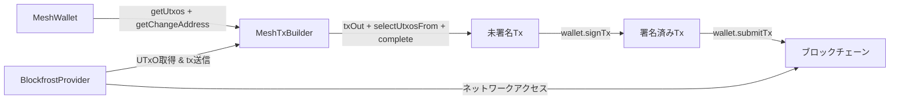

# レッスン #01: Hello World

このレッスンでは、Cardanoアプリケーション開発の基礎を学びます。[Mesh SDK](https://meshjs.dev/)のインストール、`MeshWallet`によるウォレットの作成、`MeshTxBuilder`を使ったlovelaceの送金を扱います。

> ソースコード: [GitHub](https://github.com/cardanobuilders/cardanobuilders.github.io/tree/main/codes/course-cardano/01-wallet-send-lovelace)

## システムセットアップ

このコースにはNode.js v24以上が必要です。Nodeのバージョン管理には[nvm](https://github.com/nvm-sh/nvm)の使用をお勧めします。

### package.jsonファイルの作成

まず、プロジェクトのルートに以下の内容で`package.json`ファイルを作成します:

```json
{
  "type": "module",
  "dependencies": {},
  "scripts": {}
}
```

### 必要なパッケージのインストール

ターミナルを開き、以下のコマンドを実行してMeshSDKをインストールします:

```bash
npm install
npm install @meshsdk/core
```

パッケージのインストール後、`package.json`ファイルは以下のようになります:

```json
{
  "type": "module",
  "dependencies": {
    "@meshsdk/core": "^1.9.0",
  },
  "scripts": {}
}
```

- `@meshsdk/core`: ネットワークとの通信、ウォレット、トランザクションのためのコア機能を提供します。

## ウォレットの作成


[`MeshWallet`](https://meshjs.dev/apis/wallets/meshwallet)は、ウォレットの作成、mnemonic（ニーモニック）フレーズの生成、ウォレットアドレスの取得などのメソッドを提供します。

### mnemonicフレーズの生成

mnemonicフレーズはウォレットを復元するための単語の組み合わせです。mnemonicフレーズは安全に保管してください。これにアクセスできる人は誰でもあなたの資金を操作できます。

新しいmnemonicを生成します:

```ts
import { MeshWallet } from "@meshsdk/core";

// Generate new mnemonic phrases for your wallet
const mnemonic = MeshWallet.brew();
console.log("Your mnemonic phrases are:", mnemonic);
```

- `brew`メソッドを使って新しいmnemonicフレーズを生成します。

### ウォレットの初期化とウォレットアドレスの取得

mnemonicフレーズが生成できたら、ウォレットを初期化します:

```ts
// Initialize the wallet with a mnemonic key
const wallet = new MeshWallet({
  networkId: 0, // preprod testnet
  key: {
    type: "mnemonic",
    words: mnemonic as string[],
  },
});

// Get the wallet address
const address = await wallet.getChangeAddress();
console.log("Your wallet address is:", address);
```

- `networkId`: ネットワークを指定します。0はpreprodテストネットです。
- `key`: キーの種類とmnemonicフレーズを指定します。
- `getChangeAddress`: ウォレットアドレスを取得するメソッドです。

### コードの実行

以下のコードで`mnemonic.ts`ファイルを作成します:

```ts
import { MeshWallet } from "@meshsdk/core";

// Generate new mnemonic phrases for your wallet
const mnemonic = MeshWallet.brew();
console.log("Your mnemonic phrases are:", mnemonic);

// Initialize the wallet with a mnemonic key
const wallet = new MeshWallet({
  networkId: 0, // preprod testnet
  key: {
    type: "mnemonic",
    words: mnemonic as string[],
  },
});

// Get the wallet address
const address = await wallet.getChangeAddress();
console.log("Your wallet address is:", address);
```

`package.json`ファイルにスクリプトを追加します:

```json
{
  "type": "module",
  "dependencies": {
    "@meshsdk/core": "^1.9.0",
  },
  "scripts": {
    "mnemonic": "node mnemonic.ts"
  }
}
```

スクリプトを実行します:

```bash
npm run mnemonic
```
これにより、新しいmnemonicフレーズとウォレットアドレスが生成されます。出力は以下のようになります:

```bash
> mnemonic
> node mnemonic.ts

Your mnemonic phrases are: [
  'access',  'spawn',   'taxi',
  'prefer',  'fortune', 'sword',
  'nerve',   'price',   'valid',
  'panther', 'sure',    'hello',
  'layer',   'try',     'grace',
  'seven',   'fossil',  'voice',
  'tobacco', 'circle',  'measure',
  'solar',   'pride',   'together'
]
Your wallet address is: addr_test1qptwuv6dl863u3k93mjrg0hgs0ahl08lfhsudxrwshcsx59cjxatme29s6cl7drjceknunry049shu9eudnsjvwqq9qsuem66d
```

## lovelaceの送金

ウォレットに資金がある状態で、`MeshTxBuilder`クラスを使ってトランザクションを構築し、ネットワークに送信することでlovelaceを送金できます。

### フォーセットからlovelaceを取得

[Cardano Preprodテストネットフォーセット](https://docs.cardano.org/cardano-testnets/tools/faucet)を使ってテスト用のlovelaceを取得します。ウォレットアドレスを貼り付け、「Request funds」をクリックすると、すぐにlovelaceが届きます。

### Blockfrost APIキーの取得

トランザクションの構築にはネットワークからUTXOを取得する必要があります。[Blockfrost](https://blockfrost.io/)の無料アカウントに登録し、preprod APIキー（`preprod`で始まるもの）を取得してください。キーはBlockfrostダッシュボードの「Projects」セクションにあります。

### ウォレット情報の取得

ウォレットのUTXOとお釣りアドレスを取得します:

```ts
// Get wallet data needed for the transaction
const utxos = await wallet.getUtxos();
const changeAddress = await wallet.getChangeAddress();
```

- `getUtxos`: ウォレットからUTXOを取得するメソッドです。
- `getChangeAddress`: お釣りアドレスを取得するメソッドです。

### lovelace送金トランザクションの作成

[`MeshTxBuilder`](https://meshjs.dev/apis/txbuilder)を使ってトランザクションを構築します:

```ts
// Create the transaction
const txBuilder = new MeshTxBuilder({
  fetcher: provider,
  verbose: true, // optional, prints the transaction body
});

const unsignedTx = await txBuilder
  .txOut(
    "addr_test1qpvx0sacufuypa2k4sngk7q40zc5c4npl337uusdh64kv0uafhxhu32dys6pvn6wlw8dav6cmp4pmtv7cc3yel9uu0nq93swx9",
    [{ unit: "lovelace", quantity: "1500000" }]
  )
  .changeAddress(changeAddress)
  .selectUtxosFrom(utxos)
  .complete();
```

- `txOut`: 受取人のアドレスと金額を追加します。
- `changeAddress`: お釣りアドレスを設定します。
- `selectUtxosFrom`: ウォレットのUTXOをトランザクションの入力として提供します。
- `complete`: トランザクションを作成します。

### トランザクションの署名と送信

トランザクションに署名し、ネットワークに送信します:

```ts
const signedTx = await wallet.signTx(unsignedTx);
const txHash = await wallet.submitTx(signedTx);
console.log("Transaction hash:", txHash);
```

- `signTx`: トランザクションに署名し、署名済みトランザクションを返すメソッドです。
- `submitTx`: トランザクションをネットワークに送信するメソッドです。

### コードの実行

完全なコードで`send-lovelace.ts`ファイルを作成します:

```ts
import { BlockfrostProvider, MeshTxBuilder, MeshWallet } from "@meshsdk/core";

// Set up the blockchain provider with your key
const provider = new BlockfrostProvider("YOUR_KEY_HERE");

// Initialize the wallet with a mnemonic key
const wallet = new MeshWallet({
  networkId: 0,
  fetcher: provider,
  submitter: provider,
  key: {
    type: "mnemonic",
    words: ["your", "mnemonic", "...", "here"],
  },
});

// Get wallet data needed for the transaction
const utxos = await wallet.getUtxos();
const changeAddress = await wallet.getChangeAddress();

// Create the transaction
const txBuilder = new MeshTxBuilder({
  fetcher: provider,
  verbose: true, // optional, prints the transaction body
});

const unsignedTx = await txBuilder
  .txOut(
    "addr_test1qpvx0sacufuypa2k4sngk7q40zc5c4npl337uusdh64kv0uafhxhu32dys6pvn6wlw8dav6cmp4pmtv7cc3yel9uu0nq93swx9",
    [{ unit: "lovelace", quantity: "1500000" }]
  )
  .changeAddress(changeAddress)
  .selectUtxosFrom(utxos)
  .complete();

const signedTx = await wallet.signTx(unsignedTx);
const txHash = await wallet.submitTx(signedTx);
console.log("Transaction hash:", txHash);
```

`package.json`ファイルにスクリプトを追加します:

```json
{
  "type": "module",
  "dependencies": {
    "@meshsdk/core": "^1.9.0",
  },
  "scripts": {
    "mnemonic": "node mnemonic.ts",
    "send-lovelace": "node send-lovelace.ts"
  }
}
```

スクリプトを実行します:

```bash
npm run send-lovelace
```

これにより、lovelaceトランザクションの構築、署名、送信が行われます。出力は以下のようになります:

```bash
> send-lovelace
> node send-lovelace.ts

txBodyJson - before coin selection {"inputs":[],"outputs":[{"address":"addr_test1qpvx0sacufuypa2k4sngk7q40zc5c4npl337uusdh64kv0uafhxhu32dys6pvn6wlw8dav6cmp4pmtv7cc3yel9uu0nq93swx9","amount":[{"unit":"lovelace","quantity":"1500000"}]}],"fee":"0","collaterals":[],"requiredSignatures":[],"referenceInputs":[],"mints":[],"changeAddress":"addr_test1qp2k7wnshzngpqw0xmy33hvexw4aeg60yr79x3yeeqt3s2uvldqg2n2p8y4kyjm8sqfyg0tpq9042atz0fr8c3grjmysdp6yv3","metadata":{},"validityRange":{},"certificates":[],"withdrawals":[],"votes":[],"signingKey":[],"chainedTxs":[],"inputsForEvaluation":{},"network":"mainnet","expectedNumberKeyWitnesses":0,"expectedByronAddressWitnesses":[]}
txBodyJson - after coin selection {"inputs":[{"type":"PubKey","txIn":{"txHash":"99d859b305ab8021e497fad0dc55373e50fffd3e7026142fa3cf5accfe0d3aab","txIndex":1,"amount":[{"unit":"lovelace","quantity":"9823719"}],"address":"addr_test1qp2k7wnshzngpqw0xmy33hvexw4aeg60yr79x3yeeqt3s2uvldqg2n2p8y4kyjm8sqfyg0tpq9042atz0fr8c3grjmysdp6yv3"}}],"outputs":[{"address":"addr_test1qpvx0sacufuypa2k4sngk7q40zc5c4npl337uusdh64kv0uafhxhu32dys6pvn6wlw8dav6cmp4pmtv7cc3yel9uu0nq93swx9","amount":[{"unit":"lovelace","quantity":"1500000"}]},{"address":"addr_test1qp2k7wnshzngpqw0xmy33hvexw4aeg60yr79x3yeeqt3s2uvldqg2n2p8y4kyjm8sqfyg0tpq9042atz0fr8c3grjmysdp6yv3","amount":[{"unit":"lovelace","quantity":"8153730"}]}],"fee":"169989","collaterals":[],"requiredSignatures":[],"referenceInputs":[],"mints":[],"changeAddress":"addr_test1qp2k7wnshzngpqw0xmy33hvexw4aeg60yr79x3yeeqt3s2uvldqg2n2p8y4kyjm8sqfyg0tpq9042atz0fr8c3grjmysdp6yv3","metadata":{},"validityRange":{},"certificates":[],"withdrawals":[],"votes":[],"signingKey":[],"chainedTxs":[],"inputsForEvaluation":{"99d859b305ab8021e497fad0dc55373e50fffd3e7026142fa3cf5accfe0d3aab1":{"input":{"outputIndex":1,"txHash":"99d859b305ab8021e497fad0dc55373e50fffd3e7026142fa3cf5accfe0d3aab"},"output":{"address":"addr_test1qp2k7wnshzngpqw0xmy33hvexw4aeg60yr79x3yeeqt3s2uvldqg2n2p8y4kyjm8sqfyg0tpq9042atz0fr8c3grjmysdp6yv3","amount":[{"unit":"lovelace","quantity":"9823719"}]}}},"network":"mainnet","expectedNumberKeyWitnesses":0,"expectedByronAddressWitnesses":[]}
Transaction hash: 62a825c607e4ca5766325c2fccd7ee98313ff81b7e8a4af67eac421b0f0866ff
```

トランザクションハッシュは、トランザクションが送信されたことを確認するものです。`MeshTxBuilder`で`verbose: true`を設定すると、コイン選択の前後のトランザクション本体が表示され、デバッグに役立ちます。

## ソースコード解説

このセクションでは、構築した全体像、ファイルの関連性、そしてWeb開発で既に馴染みのあるパターンへの概念の対応付けをまとめます。

### プロジェクト構成

```
01-wallet-send-lovelace/
├── package.json          # @meshsdk/core依存関係を持つプロジェクト設定
├── mnemonic.ts           # ウォレット認証情報（mnemonic + アドレス）を生成
└── send-lovelace.ts      # lovelace送金トランザクションの構築、署名、送信
```

これはフレームワークなしの最小限のNode.jsプロジェクトで、2つのスタンドアロンTypeScriptスクリプトと1つの依存関係だけで構成されています。リモートAPIと通信するCLIツールのようなものですが、「API」がCardanoブロックチェーンである点が異なります。

- **package.json**はプロジェクトをESモジュールとして宣言し、`@meshsdk/core`を導入します。このパッケージがすべてのブロックチェーン通信、ウォレット管理、トランザクション構築を処理します。
- **mnemonic.ts**は一度だけ実行するセットアップスクリプトです。ウォレット認証情報（mnemonicフレーズ＋導出アドレス）を生成します。一度実行して出力を保存し、次のスクリプトで使用します。
- **send-lovelace.ts**がメインスクリプトです。保存したmnemonicからウォレットを初期化し、Blockfrostを通じてブロックチェーンに接続し、トランザクションを構築し、署名して送信します。

### トランザクションフロー




このフローは**構築-署名-送信**パターンに従います:
1. **状態の取得** -- ウォレットが（Blockfrost経由で）ブロックチェーンに問い合わせ、利用可能なUTxOを取得します。
2. **トランザクション構築** -- `MeshTxBuilder`がトランザクションを組み立てます：誰が資金を受け取るか、どのUTxOを消費するか、お釣りの送り先を決めます。
3. **署名** -- ウォレットの秘密鍵でトランザクションに署名し、支出を承認したことを証明します。
4. **送信** -- 署名済みトランザクションがBlockfrostを通じてブロックチェーンネットワークに送信されます。

### Web2との対応

従来のWeb開発の経験がある方のために、このレッスンのブロックチェーン概念を既に知っているパターンに対応付けた表です。

| Cardanoの概念 | Web2の対応物 | 説明 |
|---|---|---|
| Mnemonicフレーズ | マスターパスワード / リカバリーキー | すべての秘密鍵を導出する単語の組み合わせです。紛失すると永久にアクセスを失います -- 「パスワードを忘れた」フローはありません。 |
| MeshWallet | 認証情報 + セッション | 鍵を保持し、あなたに代わってリクエストに署名します。認証済みセッションがAPIコールを承認する仕組みに似ています。 |
| UTxO（未使用トランザクション出力） | 残高を持つデータベース行 | 各UTxOは個別の値の塊です。消費とは、既存の行を使い新しい行を作成することで、残高フィールドをその場で更新するのではありません。 |
| BlockfrostProvider | REST APIクライアント / SDK | Cardanoネットワークとのすべての HTTP通信を処理します。サードパーティサービスSDKと同様にAPIキーで設定します。 |
| MeshTxBuilder | リクエストビルダー（ORMクエリビルダーのようなもの） | メソッドをチェーンしてトランザクションを構築します。クエリビルダーが`.where()`、`.select()`、`.limit()`をチェーンするのと同様です。 |
| トランザクション署名 | リクエスト署名（HMAC / JWT） | この特定のトランザクションを承認したことを暗号的に証明します。秘密鍵でAPIリクエストに署名するのと同様です。 |
| トランザクションハッシュ | レスポンスID / 受領証 | 送信されたトランザクションの一意の識別子です。確認IDで支払いを追跡するように、ブロックエクスプローラーでトランザクションを検索するために使用します。 |
| テストネットフォーセット | テストデータ付きサンドボックス環境 | StripeのテストモードやサンドボックスAPIのように、実験用の無料テストトークンを提供します。 |

## ソースコード

このレッスンのソースコードは[GitHub](https://github.com/cardanobuilders/cardanobuilders.github.io/tree/main/codes/course-cardano/01-wallet-send-lovelace)で公開されています。

## チャレンジ

複数のアセットを複数のアドレスに送信するトランザクションを作成してみましょう。詳しくはMesh SDKのドキュメントをご覧ください！
