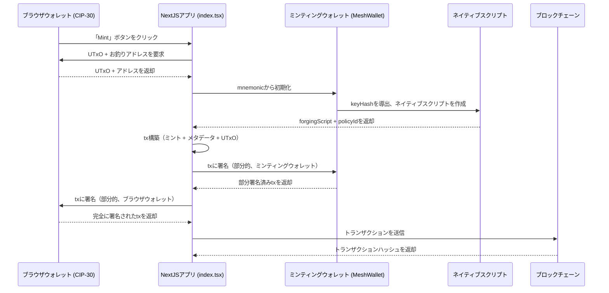

# レッスン #02: マルチシグトランザクション

マルチシグ（複数署名）トランザクションとは、ブロックチェーンに送信する前に複数の当事者が署名する必要があるトランザクションです。マルチシグは、すべての必要な当事者が支出を承認しなければならない共同口座のように機能します。トランザクションには2人以上の署名者が必要で、それはウォレットまたはスクリプトのいずれかです。


このレッスンでは以下を学びます:
- トークンをミントするためのマルチシグトランザクションの構築
- Cardanoブロックチェーンと対話するためのウェブインターフェースを持つNextJSアプリのセットアップ

> ソースコード: [GitHub](https://github.com/cardanobuilders/cardanobuilders.github.io/tree/main/codes/course-cardano/02-multisig)

## システムセットアップ

### CIP30ウォレット拡張機能のダウンロード

CIP30規格をサポートするブラウザウォレット拡張機能が必要です。[Cardanoデベロッパーショーケース](https://developers.cardano.org/showcase/?tags=wallet)から選んでインストールしてください。

インストール後、前回のレッスンで作成したシードフレーズを使ってウォレットを復元します。

### NextJSとMeshのセットアップ

新しいNextJSアプリケーションを作成します:

```bash
npx create-next-app@latest --typescript mesh-multisig
```

プロンプトに従います:

```bash
Need to install the following packages:
Ok to proceed? (y)

✔ Would you like to use ESLint? … Yes
✔ Would you like to use Tailwind CSS? … Yes
✔ Would you like your code inside a `src/` directory? … Yes
✔ Would you like to use App Router? … No
✔ Would you like to use Turbopack for next dev? … No
✔ Would you like to customize the import alias (@/* by default)? … No
```

新しく作成されたフォルダに移動します:

```bash
cd mesh-multisig
```

最新版のMeshをインストールします:

```bash
npm install @meshsdk/core @meshsdk/react
```

### MeshProviderの追加

アプリケーションを`MeshProvider`でラップして、Mesh Reactコンポーネントを有効にします。`src/app/layout.tsx`を開き、以下を追加します:

```ts
import "@/styles/globals.css";
import type { AppProps } from "next/app";
import "@meshsdk/react/styles.css";
import { MeshProvider } from "@meshsdk/react";

export default function App({ Component, pageProps }: AppProps) {
  return (
    <MeshProvider>
      <Component {...pageProps} />
    </MeshProvider>
  );
}
```

### CardanoWalletコンポーネントの追加

ブロックチェーンとの対話のためにウォレットコンポーネントを追加します。`src/pages/index.tsx`の内容を以下で置き換えます:

```ts
import { CardanoWallet, useWallet } from "@meshsdk/react";

export default function Home() {
  const { wallet, connected } = useWallet();
  return (
    <div>
      <CardanoWallet isDark={true} />
    </div>
  );
}
```

開発サーバーを起動します:

```bash
npm run dev
```

[http://localhost:3000](http://localhost:3000/)にアクセスしてアプリケーションを確認してください。サーバーを停止するには**CTRL+C**を押します。

「Connect Wallet」コンポーネントが表示されるはずです。ウォレットへの接続を試してみてください。

## ミントスクリプト

このセクションでは、マルチシグトークンミント用のミントスクリプトの作成手順を説明します。

### ミントスクリプトの定義

ミントスクリプトの定数を設定します:

```ts
const provider = new BlockfrostProvider("YOUR_KEY_HERE");

const demoAssetMetadata = {
  name: "Mesh Token",
  image: "ipfs://QmRzicpReutwCkM6aotuKjErFCUD213DpwPq6ByuzMJaua",
  mediaType: "image/jpg",
  description: "This NFT was minted by Mesh (https://meshjs.dev/).",
};

const mintingWallet = ["your", "mnemonic", "...", "here"];
```

- `YOUR_KEY_HERE`をあなたのBlockfrost APIキーに置き換えてください。
- `demoAssetMetadata`にアセットメタデータを定義します。
- ミントウォレットのmnemonicを使用します。

### ミント用アプリケーションウォレットの作成

ミントトランザクションを構築する関数を作成します:

```ts
async function buildMintTx(inputs: UTxO[], changeAddress: string) {
  const wallet = new MeshWallet({
    networkId: 0,
    key: {
      type: "mnemonic",
      words: mintingWallet,
    },
  });

  const { pubKeyHash: keyHash } = deserializeAddress(
    await wallet.getChangeAddress()
  );
}
```

- `inputs`: ミント手数料を支払うウォレットからのUTxOです。
- mnemonicでウォレットを初期化します。
- ミントスクリプト用に`pubKeyHash`を導出します。

### ネイティブスクリプトの作成


ネイティブスクリプトを定義します:

```ts
const nativeScript: NativeScript = {
  type: "all",
  scripts: [
    {
      type: "before",
      slot: "99999999",
    },
    {
      type: "sig",
      keyHash: keyHash,
    },
  ],
};
const forgingScript = ForgeScript.fromNativeScript(nativeScript);
```

- `nativeScript`: スクリプトのパラメータです。
- `ForgeScript.fromNativeScript`: 鍛造スクリプトを作成します。

### アセットメタデータの定義

アセットメタデータを設定します:

```ts
const policyId = resolveScriptHash(forgingScript);
const tokenName = "MeshToken";
const tokenNameHex = stringToHex(tokenName);
const metadata = { [policyId]: { [tokenName]: { ...demoAssetMetadata } } };
```

- `policyId`: 鍛造スクリプトから導出されます。
- `tokenName`: トークンの名前です。
- `metadata`: アセットメタデータです。

### トランザクションの作成

ミントトランザクションを構築します:

```ts
const txBuilder = new MeshTxBuilder({
  fetcher: provider,
  verbose: true,
});

const unsignedTx = await txBuilder
  .mint("1", policyId, tokenNameHex)
  .mintingScript(forgingScript)
  .metadataValue(721, metadata)
  .changeAddress(changeAddress)
  .invalidHereafter(99999999)
  .requiredSignerHash(keyHash)
  .selectUtxosFrom(inputs)
  .complete();
```

- `mint`: トークンの詳細を追加します。
- `mintingScript`: ミントスクリプトを添付します。
- `metadataValue`: アセットメタデータを追加します。
- `changeAddress`: お釣りアドレスを指定します。
- `invalidHereafter`: トランザクションの有効期限を設定します。
- `selectUtxosFrom`: 手数料用のUTxOを使用します。
- `requiredSignerHash`: ミンターウォレットの公開鍵hashが必要であることを宣言します。
- `complete`: トランザクションを確定します。

### トランザクションへの署名

ミントウォレットでトランザクションに署名します:

```ts
const signedTx = await wallet.signTx(unsignedTx, true);
```

### ソースコード

ミントトランザクション構築の完全なコードは以下の通りです:

```ts
async function buildMintTx(inputs: UTxO[], changeAddress: string) {
  // minting wallet
  const wallet = new MeshWallet({
    networkId: 0,
    key: {
      type: "mnemonic",
      words: mintingWallet,
    },
  });

  const { pubKeyHash: keyHash } = deserializeAddress(
    await wallet.getChangeAddress()
  );

  // create minting script
  const nativeScript: NativeScript = {
    type: "all",
    scripts: [
      {
        type: "before",
        slot: "99999999",
      },
      {
        type: "sig",
        keyHash: keyHash,
      },
    ],
  };
  const forgingScript = ForgeScript.fromNativeScript(nativeScript);

  // create metadata
  const policyId = resolveScriptHash(forgingScript);
  const tokenName = "MeshToken";
  const tokenNameHex = stringToHex(tokenName);
  const metadata = { [policyId]: { [tokenName]: { ...demoAssetMetadata } } };

  // create transaction
  const txBuilder = new MeshTxBuilder({
    fetcher: provider,
    verbose: true,
  });

  const unsignedTx = await txBuilder
    .mint("1", policyId, tokenNameHex)
    .mintingScript(forgingScript)
    .metadataValue(721, metadata)
    .changeAddress(changeAddress)
    .invalidHereafter(99999999)
    .requiredSignerHash(keyHash)
    .selectUtxosFrom(inputs)
    .complete();

  const signedTx = await wallet.signTx(unsignedTx, true);
  return signedTx;
}
```

## トランザクションの実行

ミントトランザクションの構築が完了したら、フロントエンドから実行します:

```ts
async function mint() {
  if (connected) {
    const inputs = await wallet.getUtxos();
    const changeAddress = await wallet.getChangeAddress();

    const tx = await buildMintTx(inputs, changeAddress);
    const signedTx = await wallet.signTx(tx, true);

    const txHash = await wallet.submitTx(signedTx);
    console.log("Transaction hash:", txHash);
  }
}
```

- ウォレットの接続状態を確認します。
- UTxOとお釣りアドレスを取得します。
- トランザクションを構築、署名、送信します。

## ソースコード解説

このセクションでは、マルチシグミンティングアプリの全体アーキテクチャ、ファイル間の接続、そしてこれらのブロックチェーン概念がWeb開発で既に知っているパターンにどう対応するかを説明します。

### プロジェクト構成

```
02-multisig/
├── package.json              # @meshsdk/coreと@meshsdk/reactを含むNextJSアプリ
├── src/
│   └── pages/
│       ├── _app.tsx          # MeshProviderラッパー（ウォレットコンテキストを有効化）
│       └── index.tsx         # メインページ：ウォレットUI、buildMintTx、ミントロジック
└── ...                       # 標準的なNextJSファイル（設定、スタイルなど）
```

これはNextJS Pages Routerアプリケーションで、あなたが書いた2つの重要なファイルがあります:

- **_app.tsx**はアプリケーション全体を`MeshProvider`でラップします。これはReactコンテキストプロバイダーです。認証プロバイダーやテーマプロバイダーでアプリをラップするのと同じパターンで、ウォレットの状態（接続状態、ウォレットメソッド）を`useWallet`フックを通じてすべてのコンポーネントで利用可能にします。
- **index.tsx**にはすべてのビジネスロジックが1つのページに含まれています。`CardanoWallet`接続ボタンのレンダリング、`buildMintTx`（ミンティングトランザクションをサーバー側で構築し部分的に署名する関数）の定義、そして`mint`（ブラウザからフロー全体を管理する関数）の定義を行います。

この分離は重要です。`_app.tsx`は純粋なインフラ（一度設定すれば忘れるもの）であり、`index.tsx`はドメインロジックが存在する場所です。

### マルチシグミンティングフロー



重要なポイントは**2段階の署名**です。レッスン1では単一のウォレットがすべてに署名しましたが、マルチシグでは両方のウォレットが同じトランザクションに署名してはじめて有効になります:

1. **構築** -- アプリはブラウザウォレットのUTxO（手数料を支払う）とミンティングウォレットの鍵ハッシュから導出されたネイティブスクリプトを使ってトランザクションを構築します。
2. **最初の署名** -- ミンティングウォレット（サーバー側、mnemonicから）がトランザクションに部分署名します。`wallet.signTx(unsignedTx, true)`の`true`パラメータは「部分署名」を意味し、トランザクションはまだ完了していません。
3. **2番目の署名** -- ブラウザウォレット（CIP-30、ユーザー向け）も部分署名します。これで必要な両方の署名が揃います。
4. **送信** -- 完全に署名されたトランザクションがブロックチェーンに送信されます。

ネイティブスクリプトは**両方**の署名が存在することを強制します。どちらかが欠けている場合、ブロックチェーンはトランザクションを拒否します。

### Web2との対応

| Cardanoの概念 | Web2の対応物 | 説明 |
|---|---|---|
| マルチシグトランザクション | 多要素承認（例：2人制の銀行振込） | アクションの実行前に複数の独立した当事者による承認が必要です。大きな発注書に管理者と経理の両方の承認が必要なのと同様です。 |
| ネイティブスクリプト | ビジネスルール / ポリシーエンジン | 満たすべき条件を宣言的に定義するルールです。`"all"`タイプはすべての条件を満たす必要があることを意味し、ポリシーエンジンのAND句のようなものです。 |
| `type: "sig"` 条件 | 必須承認者 | 特定のキーが署名する必要があることを指定します。プルリクエストに必須レビュアーを追加するのと同様です。 |
| `type: "before"` 条件 | 有効期限 / TTL | トランザクションは特定のスロット（時間）より前でのみ有効です。招待リンクやJWTトークンに有効期限を設定するのと同様です。 |
| CIP-30ブラウザウォレット | OAuth / SSOログイン | Webアプリがユーザーウォレットと対話するための標準化されたインターフェースで、OAuthがIDプロバイダー間でログインフローを標準化するのと同様です。 |
| MeshProvider | 認証コンテキストプロバイダー（React） | ウォレットの状態をコンポーネントツリー全体で利用可能にするReactコンテキストです。`<AuthProvider>`や`<SessionProvider>`と同一のパターンです。 |
| NFTメタデータ（CIP-25） | データベースレコード / APIリソース | トークンにオンチェーンで添付される構造化データです。メタデータスキーマ（ラベル721）はCardanoの標準で、REST APIがレスポンススキーマを定義するのと同様です。 |
| Policy ID | 名前空間 / テナントID | ミンティングスクリプトから導出される一意の識別子です。同じスクリプトの下でミントされたすべてのトークンがPolicy IDを共有し、マルチテナントアプリのリソースがテナントIDを共有するのと同様です。 |
| 部分署名 (`signTx(tx, true)`) | 段階的承認ワークフロー | 各当事者が確定せずに自分の署名を追加します。複数の関係者から署名を集めてから送信するドキュメントのようなものです。 |

## ソースコード

このレッスンのソースコードは[GitHub](https://github.com/cardanobuilders/cardanobuilders.github.io/tree/main/codes/course-cardano/02-multisig)で公開されています。

## チャレンジ

3人中2人の署名者の承認が必要なマルチシグウォレットを作成してください。2人の署名者でトランザクションを構築・署名し、送信して成功を確認しましょう。
