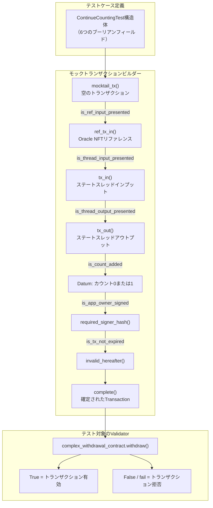

# レッスン #04: コントラクトテスト

Aikenコントラクトのテストは、デプロイ前に期待通りに動作することを確認するために不可欠です。このレッスンでは以下を扱います:

- テスト用の複雑なコントラクトの準備
- Aikenでのモックトランザクションの構築と`aiken check`によるテスト実行

> ソースコード: [GitHub](https://github.com/cardanobuilders/cardanobuilders.github.io/tree/main/codes/course-cardano/04-contract-testing)

## 複雑なコントラクトの準備

前回のレッスンの引き出しコントラクトに、`ContinueCounting`と`StopCounting`という2つのユーザーアクションを追加して拡張します。

1. **ContinueCounting**:
   - トランザクションがアプリオーナーによって署名されていることを検証します。
   - アプリが期限切れでないことを確認します（POSIXタイムスタンプを使用）。
   - ステートスレッドトークンをアウトプットに引き継ぎます。
   - ステートスレッドトークンのdatum内のカウントを1増加させます。

2. **StopCounting**:
   - トランザクションがアプリオーナーによって署名されていることを検証します。
   - ステートスレッドトークンがバーンされている（どのアウトプットにも引き継がれていない）ことを確認します。

### コントラクトコード

```rs
use aiken/crypto.{VerificationKeyHash}
use cardano/address.{Address, Credential}
use cardano/assets.{PolicyId}
use cardano/certificate.{Certificate}
use cardano/transaction.{Transaction}
use cocktail.{input_inline_datum, inputs_with_policy, key_signed, valid_before}

pub type OracleDatum {
  app_owner: VerificationKeyHash,
  app_expiry: Int,
  spending_validator_address: Address,
  state_thread_token_policy_id: PolicyId,
}

pub type MyRedeemer {
  ContinueCounting
  StopCounting
}

validator complex_withdrawal_contract(oracle_nft: PolicyId) {
  withdraw(redeemer: MyRedeemer, _credential: Credential, tx: Transaction) {
    let Transaction {
      reference_inputs,
      mint,
      extra_signatories,
      validity_range,
      ..
    } = tx

    expect [oracle_ref_input] = inputs_with_policy(reference_inputs, oracle_nft)
    expect OracleDatum {
      app_owner,
      app_expiry,
      ..
    } = input_inline_datum(oracle_ref_input)

    let is_app_owner_signed = key_signed(extra_signatories, app_owner)

    when redeemer is {
      ContinueCounting -> {
        let is_app_not_expired = valid_before(validity_range, app_expiry)
        let is_nothing_minted = mint == assets.zero

        is_app_owner_signed? && is_app_not_expired? && is_nothing_minted?
      }
      StopCounting -> todo
    }
  }

  publish(_redeemer: Data, _credential: Certificate, _tx: Transaction) {
    True
  }

  else(_) {
    fail @"unsupported purpose"
  }
}
```

このセットアップでは、`MyRedeemer`で`ContinueCounting`と`StopCounting`の2つのユーザーアクションを定義しています。`ContinueCounting`の部分的なロジックは、レッスン3で扱ったバリデーションパターンを適用しています。

### `expect`

`expect`キーワードは変数に対して正確なパターンマッチを強制します。この例では、`inputs_with_policy(reference_inputs, oracle_nft)`は`List<Input>`を返します。`oracle_nft`は一意なので、リストには必ず1つの要素が含まれ、`expect [oracle_ref_input]`は安全な分割代入となります。

### `?`演算子

`ContinueCounting`ブランチの`?`演算子はトレーシング演算子です。validatorが失敗した場合、どの条件がfalseと評価されたかを報告します。例えば、`is_app_owner_signed`がfalseの場合、validatorは`is_app_owner_signed?`というメッセージで失敗し、根本原因の特定が容易になります。

## インプットとアウトプットのバリデーション

インプットとアウトプットのバリデーションを追加してコントラクトを完成させます:

```rs
use aiken/crypto.{VerificationKeyHash}
use cardano/address.{Address, Credential}
use cardano/assets.{PolicyId, without_lovelace}
use cardano/certificate.{Certificate}
use cardano/transaction.{Transaction}
use cocktail.{
  input_inline_datum, inputs_at_with_policy, inputs_with_policy, key_signed,
  output_inline_datum, outputs_at_with_policy, valid_before,
}

pub type OracleDatum {
  app_owner: VerificationKeyHash,
  app_expiry: Int,
  spending_validator_address: Address,
  state_thread_token_policy_id: PolicyId,
}

pub type SpendingValidatorDatum {
  count: Int,
}

pub type MyRedeemer {
  ContinueCounting
  StopCounting
}

validator complex_withdrawal_contract(oracle_nft: PolicyId) {
  withdraw(redeemer: MyRedeemer, _credential: Credential, tx: Transaction) {
    let Transaction {
      reference_inputs,
      inputs,
      outputs,
      mint,
      extra_signatories,
      validity_range,
      ..
    } = tx

    expect [oracle_ref_input] = inputs_with_policy(reference_inputs, oracle_nft)
    expect OracleDatum {
      app_owner,
      app_expiry,
      spending_validator_address,
      state_thread_token_policy_id,
    } = input_inline_datum(oracle_ref_input)

    expect [state_thread_input] =
      inputs_at_with_policy(
        inputs,
        spending_validator_address,
        state_thread_token_policy_id,
      )

    let is_app_owner_signed = key_signed(extra_signatories, app_owner)

    when redeemer is {
      ContinueCounting -> {
        expect [state_thread_output] =
          outputs_at_with_policy(
            outputs,
            spending_validator_address,
            state_thread_token_policy_id,
          )
        expect input_datum: SpendingValidatorDatum =
          input_inline_datum(state_thread_input)
        expect output_datum: SpendingValidatorDatum =
          output_inline_datum(state_thread_output)

        let is_app_not_expired = valid_before(validity_range, app_expiry)
        let is_count_added = input_datum.count + 1 == output_datum.count
        let is_nothing_minted = mint == assets.zero

        is_app_owner_signed? && is_app_not_expired? && is_count_added && is_nothing_minted?
      }
      StopCounting -> {
        let state_thread_value =
          state_thread_input.output.value |> without_lovelace()
        let is_thread_token_burned = mint == assets.negate(state_thread_value)
        is_app_owner_signed? && is_thread_token_burned?
      }
    }
  }

  publish(_redeemer: Data, _credential: Certificate, _tx: Transaction) {
    True
  }

  else(_) {
    fail @"unsupported purpose"
  }
}
```

このバージョンでは以下の新しいテクニックが導入されています:

- `input_inline_datum`と`output_inline_datum`はステートスレッドトークンのインプットとアウトプットからインラインdatumを抽出します
- `inputs_at_with_policy`と`outputs_at_with_policy`はアドレスとポリシーIDでインプットとアウトプットをフィルタリングします
- datumの比較によりカウントが正確に1増加することを確認します

`StopCounting`では、validatorは`mint`フィールドをチェックしてステートスレッドトークンがバーンされたことを確認します。`without_lovelace`関数はクリーンな比較のためにvalueからlovelace部分を除去します。

## Aikenでモックトランザクションを構築する

すべてのAikenコントラクトはパラメータを受け取りブーリアンを返す関数です。そのため、テストは簡単です。モックデータを提供し、結果をアサートします。

`test`キーワードでテスト関数を定義し、プロジェクトルートから`aiken check`を実行してテストを実行します。

最小限の例:

```rs
test always_true() {
  True
}
```

`aiken check`を実行すると以下が表示されます:


### 常に成功・常に失敗のケースのテスト

複雑な引き出しコントラクトには常に`True`を返す`publish`関数があります。以下のようにテストします:

```rs
use mocktail.{complete, mock_utxo_ref, mocktail_tx}

test test_publish() {
  let data = Void
  complex_withdrawal_contract.publish(
    "",
    data,
    RegisterCredential(Script(#""), Never),
    mocktail_tx() |> complete(),
  )
}
```

このテストではモックパラメータで`publish`を呼び出します。`mocktail_tx()`はモックトランザクションを作成し、`complete()`はそれを空の`Transaction`として確定します。

その他すべてのスクリプト目的は`else`ブランチに落ち、常に失敗します。この期待される失敗をテストします:

```rs
test test_else() fail {
  complex_withdrawal_contract.else(
    "",
    ScriptContext(
      mocktail_tx() |> complete(),
      Void,
      Spending(mock_utxo_ref(0, 0), None),
    ),
  )
}
```

このテストは`False`を返すのではなく、プログラムが`fail`で中断します。テスト名の後に`fail`を追加することで、失敗が期待されるテストとしてマークします。

`aiken check`を実行すると以下が表示されます:


### `withdraw`関数のテスト

`withdraw`関数は`Transaction`構造をバリデーションするため、正確なモックデータの作成が不可欠です。必要なAiken型をすべて手動で構築するのは面倒ですが、`vodka`ライブラリがそれを助けてくれます。

`vodka`の`mocktail`モジュールはモックデータ作成のための関数を提供します。`mocktail_tx()`でベースの`Transaction`を作成し、テストケースに合わせて修飾関数をチェーンします:

```rs
const mock_oracle_nft = mock_policy_id(0)

const mock_oracle_address = mock_script_address(0, None)

const mock_oracle_value =
  assets.from_asset(mock_oracle_nft, "", 1) |> assets.add("", "", 2_000_000)

const mock_app_owner = mock_pub_key_hash(0)

const mock_spending_validator_address = mock_script_address(1, None)

const mock_state_thread_token_policy_id = mock_policy_id(1)

const mock_state_thread_value =
  assets.from_asset(mock_state_thread_token_policy_id, "", 1)
    |> assets.add("", "", 2_000_000)

const mock_oracle_datum =
  OracleDatum {
    app_owner: mock_app_owner,
    app_expiry: 1000,
    spending_validator_address: mock_spending_validator_address,
    state_thread_token_policy_id: mock_state_thread_token_policy_id,
  }

fn mock_datum(count: Int) -> SpendingValidatorDatum {
  SpendingValidatorDatum { count }
}

fn mock_continue_counting_tx() -> Transaction {
  mocktail_tx()
    |> ref_tx_in(
        True,
        mock_tx_hash(0),
        0,
        mock_oracle_value,
        mock_oracle_address,
      )
    |> ref_tx_in_inline_datum(True, mock_oracle_datum)
    |> tx_in(
        True,
        mock_tx_hash(1),
        0,
        mock_state_thread_value,
        mock_spending_validator_address,
      )
    |> tx_in_inline_datum(True, mock_datum(0))
    |> tx_out(True, mock_spending_validator_address, mock_state_thread_value)
    |> tx_out_inline_datum(True, mock_datum(1))
    |> required_signer_hash(True, mock_app_owner)
    |> invalid_hereafter(True, 999)
    |> complete()
}
```

`mocktail`モジュールの`mock_...`関数で必要な型を構築します。この`ContinueCounting`用のモックトランザクションには、インラインdatum付きのoracle NFTリファレンスインプット、インラインdatum付きのステートスレッドトークンのインプットとアウトプット、必要な署名者、有効期限が含まれています。

`ContinueCounting`アクションのテスト:

```rs
test success_continue_counting() {
  complex_withdrawal_contract.withdraw(
    mock_oracle_nft,
    ContinueCounting,
    Credential.Script(#""),
    mock_continue_counting_tx(),
  )
}
```

### 失敗ケースの動的テスト


mocktailビルダーメソッドはフィールドを含めるか除外するかを制御するブーリアンパラメータを受け取ります。これにより、個々の条件をトグルすることで動的な失敗ケース生成が可能になります:

```rs
type ContinueCountingTest {
  is_ref_input_presented: Bool,
  is_thread_input_presented: Bool,
  is_thread_output_presented: Bool,
  is_count_added: Bool,
  is_app_owner_signed: Bool,
  is_tx_not_expired: Bool,
}

fn mock_continue_counting_tx(test_case: ContinueCountingTest) -> Transaction {
  let ContinueCountingTest {
    is_ref_input_presented,
    is_thread_input_presented,
    is_thread_output_presented,
    is_count_added,
    is_app_owner_signed,
    is_tx_not_expired,
  } = test_case

  let output_datum =
    if is_count_added {
      mock_datum(1)
    } else {
      mock_datum(0)
    }
  mocktail_tx()
    |> ref_tx_in(
        is_ref_input_presented,
        mock_tx_hash(0),
        0,
        mock_oracle_value,
        mock_oracle_address,
      )
    |> ref_tx_in_inline_datum(is_ref_input_presented, mock_oracle_datum)
    |> tx_in(
        is_thread_input_presented,
        mock_tx_hash(1),
        0,
        mock_state_thread_value,
        mock_spending_validator_address,
      )
    |> tx_in_inline_datum(is_thread_input_presented, mock_datum(0))
    |> tx_out(
        is_thread_output_presented,
        mock_spending_validator_address,
        mock_state_thread_value,
      )
    |> tx_out_inline_datum(is_thread_output_presented, output_datum)
    |> required_signer_hash(is_app_owner_signed, mock_app_owner)
    |> invalid_hereafter(is_tx_not_expired, 999)
    |> complete()
}
```

パラメータ化された構造を使って成功テストを更新します:

```rs
test success_continue_counting() {
  let test_case =
    ContinueCountingTest {
      is_ref_input_presented: True,
      is_thread_input_presented: True,
      is_thread_output_presented: True,
      is_count_added: True,
      is_app_owner_signed: True,
      is_tx_not_expired: True,
    }

  complex_withdrawal_contract.withdraw(
    mock_oracle_nft,
    ContinueCounting,
    Credential.Script(#""),
    mock_continue_counting_tx(test_case),
  )
}
```

単一のブーリアンをトグルするだけで、失敗ケースを簡単に作成できます:

```rs
test fail_continue_counting_no_ref_input() fail {
  let test_case =
    ContinueCountingTest {
      is_ref_input_presented: False,
      is_thread_input_presented: True,
      is_thread_output_presented: True,
      is_count_added: True,
      is_app_owner_signed: True,
      is_tx_not_expired: True,
    }

  complex_withdrawal_contract.withdraw(
    mock_oracle_nft,
    ContinueCounting,
    Credential.Script(#""),
    mock_continue_counting_tx(test_case),
  )
}

test fail_continue_counting_no_thread_input() fail {
  let test_case =
    ContinueCountingTest {
      is_ref_input_presented: True,
      is_thread_input_presented: False,
      is_thread_output_presented: True,
      is_count_added: True,
      is_app_owner_signed: True,
      is_tx_not_expired: True,
    }

  complex_withdrawal_contract.withdraw(
    mock_oracle_nft,
    ContinueCounting,
    Credential.Script(#""),
    mock_continue_counting_tx(test_case),
  )
}

test fail_continue_counting_no_thread_output() fail {
  let test_case =
    ContinueCountingTest {
      is_ref_input_presented: True,
      is_thread_input_presented: True,
      is_thread_output_presented: False,
      is_count_added: True,
      is_app_owner_signed: True,
      is_tx_not_expired: True,
    }

  complex_withdrawal_contract.withdraw(
    mock_oracle_nft,
    ContinueCounting,
    Credential.Script(#""),
    mock_continue_counting_tx(test_case),
  )
}

test fail_continue_counting_incorrect_count() {
  let test_case =
    ContinueCountingTest {
      is_ref_input_presented: True,
      is_thread_input_presented: True,
      is_thread_output_presented: True,
      is_count_added: False,
      is_app_owner_signed: True,
      is_tx_not_expired: True,
    }

  !complex_withdrawal_contract.withdraw(
    mock_oracle_nft,
    ContinueCounting,
    Credential.Script(#""),
    mock_continue_counting_tx(test_case),
  )
}

test fail_continue_counting_not_signed_by_owner() {
  let test_case =
    ContinueCountingTest {
      is_ref_input_presented: True,
      is_thread_input_presented: True,
      is_thread_output_presented: True,
      is_count_added: True,
      is_app_owner_signed: False,
      is_tx_not_expired: True,
    }

  !complex_withdrawal_contract.withdraw(
    mock_oracle_nft,
    ContinueCounting,
    Credential.Script(#""),
    mock_continue_counting_tx(test_case),
  )
}

test fail_continue_counting_app_expired() {
  let test_case =
    ContinueCountingTest {
      is_ref_input_presented: True,
      is_thread_input_presented: True,
      is_thread_output_presented: True,
      is_count_added: True,
      is_app_owner_signed: True,
      is_tx_not_expired: False,
    }

  !complex_withdrawal_contract.withdraw(
    mock_oracle_nft,
    ContinueCounting,
    Credential.Script(#""),
    mock_continue_counting_tx(test_case),
  )
}
```

`aiken check`を実行すると以下が表示されます:


### 演習

同じパターンを使って`StopCounting`アクションのテストを書いてみましょう。`ContinueCounting`のテストを参考にしてください。解答例はコード例に含まれています。

## ソースコード解説

このセクションでは、ソースコードで使用されているプロジェクト構成とテストパターンを解説し、Web2開発で既に知っているテストプラクティスに結びつけます。

### プロジェクト構成

```
04-contract-testing/
├── validators/
│   └── withdraw.ak       # すべてのテストを含む複雑な引き出しコントラクト
├── aiken.toml             # プロジェクト設定（AikenのpackageJSONに相当）
├── aiken.lock             # 依存関係ロックファイル（package-lock.jsonに相当）
└── plutus.json            # コンパイル済みblueprintの出力（ビルド成果物）
```

レッスン3のスキャフォールドされたプロジェクトと比較して、これは`mesh/`フォルダや`aiken-workspace/`ラッパーのないスタンドアロンAikenプロジェクトです。すべてがルートに配置されています。

| Aikenファイル | Web2の対応物 | 目的 |
|---|---|---|
| `aiken.toml` | `package.json` | プロジェクト名、バージョン、依存関係（例：テストユーティリティ用の`vodka`）を宣言します。 |
| `aiken.lock` | `package-lock.json` / `bun.lockb` | 再現可能なビルドのために正確な依存関係バージョンを固定します。 |
| `plutus.json` | コンパイル済みビルド出力（例：`dist/`） | コンパイルされたPlutus blueprint。`aiken build`で生成され、コントラクトとやり取りするためにオフチェーンコードが使用します。 |
| `validators/withdraw.ak` | `src/` + `__tests__/` の統合 | コントラクトロジックとそのテスト関数の両方を同じファイルに含みます。Aikenではソースとテストディレクトリを分離しません。 |

### テストアーキテクチャ: モックトランザクションビルダーパターン

このレッスンのコアとなるテストパターンは、設定可能なブーリアントグルを持つモックトランザクションの構築です。これはパラメータ化テストとフィクスチャファクトリのAiken版です。



フローは以下のように機能します:

1. **テストケース構造体を定義** -- コントラクト内のバリデーション条件ごとに1つのブーリアンフィールドを持ちます。
2. **構造体をビルダー関数に渡す** -- `mocktail`ヘルパーをチェーンします。各ブーリアンが特定のトランザクションデータの包含/除外を制御します。
3. **validatorを呼び出す** -- 組み立てたモックトランザクションで結果をアサートします。

このパターンはWeb2のテスト概念に直接対応します:

| Aikenテスト概念 | Web2の対応物 | 説明 |
|---|---|---|
| `aiken check` | `npm test` / `bun test` | プロジェクト内のすべての`test`関数を検出して実行するCLIコマンドです。 |
| `mocktail_tx()` + ビルダーチェーン | テストフィクスチャファクトリ / リクエストビルダー | ヘッダー、ボディ、認証トークンでモックHTTPリクエストを構築するのと同じ方法で偽のトランザクションを構築します。 |
| `ContinueCountingTest`構造体 | パラメータ化テスト設定 | 個々の条件をトグルするブーリアンの構造体で、Jestの`test.each()`やGoのテーブル駆動テストに似ています。 |
| ブーリアントグル（`True`/`False`） | テストフィクスチャのフィーチャーフラグ | 各ブーリアンがモックトランザクションの1つのデータを含めたり除外したりし、テストごとに単一の失敗条件を分離します。 |
| `test ... fail`キーワード | `expect(...).toThrow()` | 失敗が期待されるテストとしてマークします。validatorがクラッシュまたは`False`を返した場合にのみテストが通過します。 |
| `expect`キーワード | `assert` / ランタイム型チェック | 値をパターンマッチし、形状が一致しない場合にクラッシュします。ランタイムスキーマバリデーションのようなものです。 |
| `?`トレース演算子 | アサーション失敗時のデバッグログ | 条件が`False`のときにエラートレースに変数名を追加するため、どのチェックが失敗したかが即座にわかります。 |

### このパターンが効果的な理由

Web2のテストでは、通常、失敗モードごとに1つのテストを書きます：認証ヘッダーの欠落、トークンの期限切れ、不正なボディなど。ブーリアントグルパターンはCardano validatorでも同じことを実現します。成功テストではすべてのブーリアンが`True`に設定されます。各失敗テストではちょうど1つのブーリアンを`False`に切り替え、テスト対象の特定のバリデーションルールを分離します。

このアプローチはきれいにスケールします：コントラクトに新しいバリデーション条件を追加する場合、構造体にブーリアンを1つ追加し、成功テストでは`True`に設定し、そのブーリアンを`False`にした新しい失敗テストを1つ書くだけです。

## ソースコード

このレッスンのソースコードは[GitHub](https://github.com/cardanobuilders/cardanobuilders.github.io/tree/main/codes/course-cardano/04-contract-testing)で公開されています。
