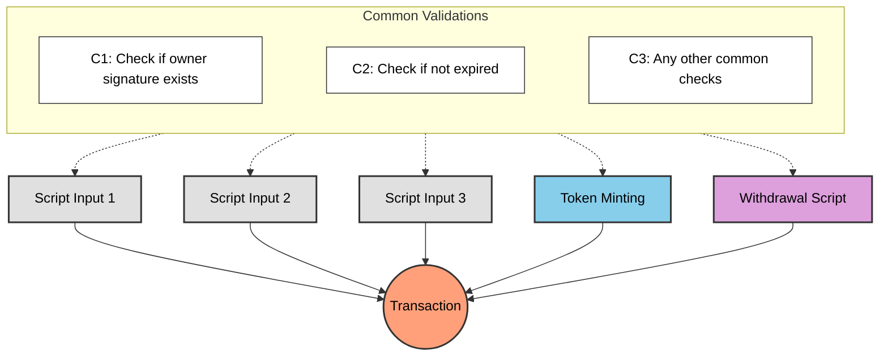
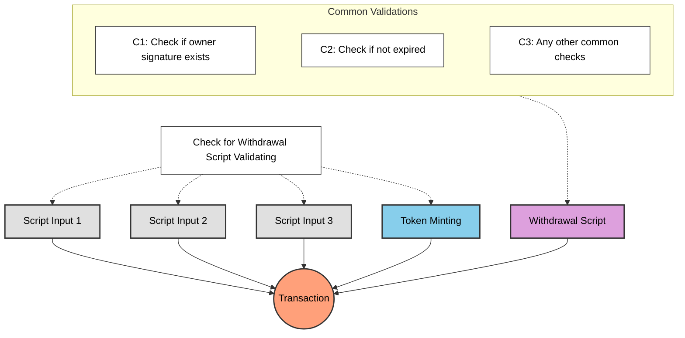
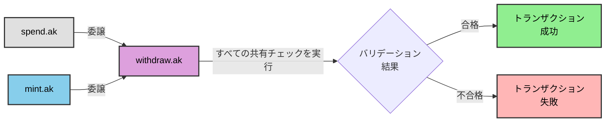

# レッスン #05: 冗長なバリデーションの回避

前回までのレッスンでよくある質問: ミントやステート更新にスペンディングvalidatorで直接バリデーションせず、なぜ引き出しスクリプトを使うのか？ スペンディングvalidatorからUTXOが消費されるたびにバリデーションがトリガーされるのだから、そこにロジックを置けばよいのでは？

> ソースコード: [GitHub](https://github.com/cardanobuilders/cardanobuilders.github.io/tree/main/codes/course-cardano/05-avoid-redundant-validation)

## 複数のスクリプトバリデーションを含むトランザクション

トークンのミント、複数のスクリプトUTXOの消費、資金の引き出しなど、複数のスクリプトバリデーションを含む複雑なトランザクションを考えてみましょう。各アクションにはそれぞれ独自のチェックセットが必要になる場合があります。



すべてのスクリプトで共通のチェックを実行すると冗長なバリデーションが発生します。同じロジックが複数回実行され、トランザクションコストとスクリプトサイズが増大します。

## より良い方法は？


共通のチェックを1つのスクリプトに集約し、一度だけ実行するようにします。他のすべてのスクリプトはそのスクリプトに委譲し、重複ロジックを排除しながらすべての必要なバリデーションを維持します。



`WithdrawalCheck`スクリプトが共通のバリデーションを一度だけ実行し、トランザクション内の他のすべてのスクリプトの条件をチェックします。

## 例: レッスン4からの続き

レッスン4の引き出しスクリプトにすべての共通バリデーションロジックが含まれていると仮定します。それらのチェックをスペンディングやミントのvalidatorで重複させる代わりに、引き出しスクリプトに委譲します:

### スペンディング

```rs
use aiken/crypto.{ScriptHash}
use cardano/transaction.{OutputReference, Transaction}
use cocktail.{withdrawal_script_validated}

validator spending_logics_delegated(
  delegated_withdrawal_script_hash: ScriptHash,
) {
  spend(
    _datum_opt: Option<Data>,
    _redeemer: Data,
    _input: OutputReference,
    tx: Transaction,
  ) {
    withdrawal_script_validated(
      tx.withdrawals,
      delegated_withdrawal_script_hash,
    )
  }

  else(_) {
    fail @"unsupported purpose"
  }
}
```

### ミント

```rs
use aiken/crypto.{ScriptHash}
use cardano/assets.{PolicyId}
use cardano/transaction.{Transaction}
use cocktail.{withdrawal_script_validated}

validator minting_logics_delegated(
  delegated_withdrawal_script_hash: ScriptHash,
) {
  mint(_redeemer: Data, _policy_id: PolicyId, tx: Transaction) {
    withdrawal_script_validated(
      tx.withdrawals,
      delegated_withdrawal_script_hash,
    )
  }

  else(_) {
    fail @"unsupported purpose"
  }
}
```

## なぜ引き出しスクリプトに委譲するのか？

引き出しスクリプトへのバリデーション委譲は、Cardanoスマートコントラクトの一般的なパターンです。スペンディングやミントのvalidatorに委譲することも可能ですが、引き出しスクリプトには明確な利点があります。

### クリーンなトリガー

スペンディングバリデーションはUTXOが消費されたときにトリガーされ、ミントバリデーションはトークンがミントされたときにトリガーされます。どちらも実際のオンチェーンアクションが必要です。一方、引き出しスクリプトは0 lovelaceの引き出し（[`withdraw 0 trick`](https://aiken-lang.org/fundamentals/common-design-patterns#forwarding-validation--other-withdrawal-tricks)）でトリガーできます。これにより、トランザクションのロジックやステートに影響を与えずに、クリーンにバリデーションをトリガーできます。

## わかりやすい説明

### なぜ冗長なバリデーションを避けるのか？
複数のスクリプトがトランザクションに参加する場合、各スクリプトで同じチェックを繰り返すと実行バジェットが無駄になり、手数料が増加します。共通チェックを1つのスクリプトに集約すれば、一度だけ実行されます。

### 委譲の仕組み
引き出しスクリプトが中央のvalidatorとして機能します:

- **スペンディングvalidator**: 引き出しスクリプトがトランザクションに存在することを確認します
- **ミントvalidator**: 同様に引き出しスクリプトの存在を確認します
- **引き出しスクリプト**: すべての共有バリデーションロジックを一度だけ実行します

### Withdraw-Zeroトリック
引き出しスクリプトは`withdraw 0 trick`でトリガーされます。0 lovelaceの引き出しによってトランザクションのステートに影響を与えずにバリデーションを起動します。このアプローチはそのシンプルさから広く採用されています。

### 主なメリット
- **効率性**: 共通チェックがスクリプトごとではなく一度だけ実行されます
- **低手数料**: 実行バジェットの削減によりトランザクションコストが低下します
- **保守性**: バリデーションロジックが一箇所に集約されます

## ソースコード解説

このセクションでは、委譲パターンが実際にどのように構成されているかをプロジェクトファイルを通じて解説します。Web2のバックグラウンドがある方は、バックエンドサービスのミドルウェアアーキテクチャを調べるような感覚で読んでください。

### プロジェクト構成

```
05-avoid-redundant-validation/
├── validators/
│   ├── withdraw.ak    # 共有ミドルウェア -- すべての共通バリデーションがここにあります
│   ├── spend.ak       # スペンディングvalidator -- withdraw.akに委譲
│   └── mint.ak        # ミンティングvalidator -- withdraw.akに委譲
├── aiken.toml         # プロジェクトマニフェスト（package.jsonに相当）
├── aiken.lock         # 依存関係ロックファイル（bun.lockbに相当）
└── plutus.json        # コンパイル済み出力（dist/ビルド成果物に相当）
```

### Web2のメンタルモデル

Express.jsやHonoのミドルウェアチェーンを構築した経験がある方は、このパターンに馴染みがあるでしょう:

| Cardanoの概念 | Web2の対応物 |
|---|---|
| `withdraw.ak`（引き出しスクリプト） | 共有ミドルウェア関数（例：`authMiddleware`） |
| `spend.ak` / `mint.ak`が引き出しに委譲 | ミドルウェアチェーンを通じて`next()`を呼ぶルートハンドラ |
| Withdraw-zeroトリック | ノーオプトリガー -- ミドルウェアの副作用を起動するためだけにヘルスチェックエンドポイントを呼ぶようなもの |
| バリデーションを1つのスクリプトに集約 | DRY原則 -- 認証チェックを一度書いて、どこにでも適用 |

Expressの用語で言えば、すべてのルートハンドラに認証チェックをコピペする代わりに、ミドルウェア関数に抽出してルーターにアタッチします。`withdraw.ak`がオンチェーンバリデーションで行っていることはまさにそれです。

### ファイルの連携方法



このレッスンの前半の図が示すように、委譲がなければすべてのvalidatorが同じチェックを独立して繰り返します。委譲があれば、`spend.ak`と`mint.ak`はそれぞれ単一のガードのみを含みます：「この引き出しスクリプトがこのトランザクションに存在するか？」もしそうなら通過します。すべての実際のバリデーションロジックは`withdraw.ak`内で一度だけ実行されます。

### `withdraw.ak` -- 共有ミドルウェア

これはすべての共通チェックが存在する中央のvalidatorです。トランザクションコンテキストを受け取り、オーナー署名、有効期限、その他の共有ビジネスルールなどの条件をバリデーションします。上の図では、すべての共通バリデーションの矢印を受け取る紫色の「引き出しスクリプト」ノードに対応します。

### `spend.ak` -- スペンディング委譲

スペンディングvalidatorの唯一の仕事は、`withdraw.ak`がトランザクションに参加していることを確認することです。`withdrawal_script_validated(tx.withdrawals, delegated_withdrawal_script_hash)`を呼び出して結果を返します。ボディ全体が`return authMiddleware(req)`であるルートハンドラのようなものです。

### `mint.ak` -- ミンティング委譲

`spend.ak`と同一の委譲パターンですが、ミンティング操作用です。引き出しスクリプトが存在することを確認し、中央のvalidatorに実際のロジックを処理させます。これにより、新しいミンティングルールの追加は`withdraw.ak`の変更だけで済み、すべてのミンティングvalidatorを変更する必要がありません。

### `aiken.toml`と`aiken.lock`

Node.jsプロジェクトの`package.json`とロックファイルと同じ役割を果たします。`aiken.toml`はプロジェクト名、バージョン、依存関係（`withdrawal_script_validated`を提供する`cocktail`ライブラリなど）を宣言します。`aiken.lock`は再現可能なビルドのために正確な依存関係バージョンを固定します。

### `plutus.json`

`aiken build`で生成されるコンパイル済み出力です。このJSONファイルには3つすべてのvalidatorのコンパイル済みバイトコードと型情報が含まれています。オフチェーンTypeScriptコードがこのファイルを読み取ってトランザクションを構築します。次のレッスンでこのファイルを詳しく扱います。

## ソースコード

このレッスンのソースコードは[GitHub](https://github.com/cardanobuilders/cardanobuilders.github.io/tree/main/codes/course-cardano/05-avoid-redundant-validation)で公開されています。
