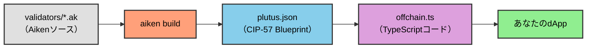

# レッスン #06: Blueprintの解釈

Plutus blueprintは、オンチェーンコードとオフチェーンコードをつなぐ架け橋です。このレッスンでは、Aikenが生成するblueprintを解釈し、スマートコントラクトとやり取りするためのオフチェーンTypeScriptコードに変換する方法を説明します。

> ソースコード: [GitHub](https://github.com/cardanobuilders/cardanobuilders.github.io/tree/main/codes/course-cardano/06-interpreting-blueprint)

## Blueprintとは？


Blueprintは、[CIP-57](https://cips.cardano.org/cip/CIP-57)で定義された標準化されたJSONファイルです。Cardanoスマートコントラクトのコンパイルの主要な出力であり、コントラクトとやり取りするために必要なすべての情報が含まれています。すべてのblueprintには以下が含まれます：

- **`preamble`**: コントラクトに関するメタ情報。
- **`validators`**: 型定義とコンパイル済みコードを持つ名前付きvalidator。
- **`definitions`**: 仕様全体で再利用可能な定義のレジストリ。

### Blueprintの生成

Aikenでblueprintを生成するには：

1. コントラクトをビルドします：

```sh
aiken build
```

2. プロジェクトのルートにある`plutus.json`ファイルでblueprintを確認します。

## Blueprintの理解

### `preamble`

`preamble`にはコントラクトのメタデータ（名前、説明、バージョン、Plutusバージョン）が含まれています。Plutusバージョンは、オフチェーンコードの準備において重要です。

例：

```json
{
  "preamble": {
    "title": "meshsdk/aiken-template",
    "description": "Aiken contracts for project 'meshsdk/aiken-template'",
    "version": "0.0.0",
    "plutusVersion": "v3", // Key information for offchain code
    "compiler": {
      "name": "Aiken",
      "version": "v1.1.16+23061c0"
    },
    "license": "Apache-2.0"
  }
}
```

### `validators`

`validators`セクションには、`datum`、`redeemer`、`parameters`の型情報と、コンパイル済みのvalidatorコードが含まれています。型は`definitions`セクションの再利用可能な定義を参照する場合があります。

例：

```json
{
  "title": "spend.spending_logics_delegated.spend",
  "datum": {
    "title": "_datum_opt",
    "schema": {
      "$ref": "#/definitions/Data"
    }
  },
  "redeemer": {
    "title": "_redeemer",
    "schema": {
      "$ref": "#/definitions/Data"
    }
  },
  "parameters": [
    {
      "title": "delegated_withdrawal_script_hash",
      "schema": {
        "$ref": "#/definitions/aiken~1crypto~1ScriptHash"
      }
    }
  ],
  "compiledCode": "58ac010100229800aba2aba1aba0aab9faab9eaab9dab9a9bae0024888888896600264646644b30013370e900118039baa001899914c004c03400a601a601c0052259800800c528456600266ebc00cc02cc03c00629462660040046020002805100d2444660020026eacc040c044c044c044c044c044c044c034dd518080048c020dd500099ba548008cc028dd4802a5eb822c8030c024004c024c028004c024004c010dd5004c52689b2b200401",
  "hash": "9c9666ddc12fc42f0151cd029c150c7d410ede9fe3885c248c8c26a0"
}
```

`spend.spending_logics_delegated.else`は`spend.spending_logics_delegated.spend`と同じhashにコンパイルされることに注意してください。両方のpurposeが同じコンパイル済みスクリプトを共有しています。マルチパーパスvalidatorは単一のhashにコンパイルされ、特定のアーキテクチャではこの特性を活用できます。

```json
{
  "title": "spend.spending_logics_delegated.else",
  "redeemer": {
    "schema": {}
  },
  "parameters": [
    {
      "title": "delegated_withdrawal_script_hash",
      "schema": {
        "$ref": "#/definitions/aiken~1crypto~1ScriptHash"
      }
    }
  ],
  "compiledCode": "58ac010100229800aba2aba1aba0aab9faab9eaab9dab9a9bae0024888888896600264646644b30013370e900118039baa001899914c004c03400a601a601c0052259800800c528456600266ebc00cc02cc03c00629462660040046020002805100d2444660020026eacc040c044c044c044c044c044c044c034dd518080048c020dd500099ba548008cc028dd4802a5eb822c8030c024004c024c028004c024004c010dd5004c52689b2b200401",
  "hash": "9c9666ddc12fc42f0151cd029c150c7d410ede9fe3885c248c8c26a0"
}
```

### `definitions`

`definitions`セクションには、`validators`セクションから参照される再利用可能な型スキーマが含まれています。

例：

```json
{
  "definitions": {
    "Data": {
      "title": "Data",
      "description": "Any Plutus data."
    },
    "aiken/crypto/ScriptHash": {
      "title": "ScriptHash",
      "dataType": "bytes"
    },
    "cardano/assets/PolicyId": {
      "title": "PolicyId",
      "dataType": "bytes"
    },
    "withdraw/MyRedeemer": {
      "title": "MyRedeemer",
      "anyOf": [
        {
          "title": "ContinueCounting",
          "dataType": "constructor",
          "index": 0,
          "fields": []
        },
        {
          "title": "StopCounting",
          "dataType": "constructor",
          "index": 1,
          "fields": []
        }
      ]
    }
  }
}
```

## オフチェーンコード生成の自動化

blueprintをオフチェーンコードに手動で変換するのは時間がかかります。[`Cardano Bar VSCode Extension`](https://marketplace.visualstudio.com/items/?itemName=sidan-lab.cardano-bar-vscode)を使えば、このプロセスを自動化できます。以下の3ステップでblueprintからオフチェーンコードを生成できます：

1. 新しいTypeScriptファイル（例：`offchain.ts`）を作成します。
2. VSCodeのコマンドパレットを開きます（Ctrl+Shift+PまたはCmd+Shift+P）。
3. `Parse blueprint to Typescript - Mesh`と入力して選択します。


4. blueprintが含まれている`plutus.json`ファイルを選択します。


生成された`offchain.ts`ファイルには、オンチェーンコードとやり取りするために必要なすべての関数（送金、ミンティング、コントラクトのクエリ）が含まれます。詳細は[Mesh SDKドキュメント](https://meshjs.dev/apis/utilities/blueprints)を参照してください。

## まとめ

Plutus blueprintの解釈は、オンチェーンvalidatorとオフチェーンアプリケーションを接続するために不可欠です。Meshの`Blueprint`クラスやCardano Bar拡張機能などのツールが変換作業の大部分を自動化するため、アプリケーション開発に集中できます。

## ソースコード解説

このセクションでは、Plutus blueprint（`plutus.json`）がオンチェーンAikenコードとオフチェーンTypeScriptアプリケーションの間のギャップをどのように埋めるかに焦点を当てて、プロジェクトファイルを解説します。

### プロジェクト構成

```
06-interpreting-blueprint/
├── validators/
│   ├── withdraw.ak    # 引き出しvalidator（OracleDatum、MyRedeemer型）
│   ├── spend.ak       # 引き出しに委譲するスペンディングvalidator
│   └── mint.ak        # 引き出しに委譲するミンティングvalidator
├── aiken.toml         # プロジェクトマニフェスト（package.jsonに相当）
├── aiken.lock         # 依存関係ロックファイル（bun.lockbに相当）
└── plutus.json        # CIP-57 blueprint -- このレッスンの重要ファイル
```

3つの`.ak` validatorはレッスン5と同じ委譲パターンに従います。ここでの新しい点は、`plutus.json`の理解です。これがオフチェーン統合を可能にするコンパイル済み成果物です。

### コンパイルパイプライン



これはスマートコントラクトのソースコードから実行中のアプリケーションまでの完全なパスです。blueprintは中心に位置し、ブロックチェーンとTypeScriptコードの両方が理解する成果物です。

### Web2のメンタルモデル

REST APIの開発経験がある方は、blueprintを既に知っている概念にきれいに対応付けられます:

| Blueprintセクション | Web2の対応物 | 役割 |
|---|---|---|
| `preamble` | `package.json`のメタデータ | プロジェクト名、バージョン、コンパイラ情報、Plutusバージョン |
| `validators` | APIエンドポイント定義 | 各validatorの目的、パラメータ、コンパイル済みバイトコード |
| `validators[].compiledCode` | コンパイル済みバイナリまたはWASMモジュール | オンチェーンにデプロイされる実際の実行可能コード |
| `validators[].parameters` | 関数の引数 / ルートパラメータ | validatorが実行される前に提供する必要がある値 |
| `definitions` | JSON Schema / TypeScript型定義 | validatorから参照される再利用可能な型スキーマ |
| 完全な`plutus.json` | OpenAPI（Swagger）仕様 | コントラクトのインターフェースを記述する唯一の情報源 |

OpenAPI仕様からAPIクライアントを自動生成できるように、Plutus blueprintはMesh SDKなどのツールでコントラクトとやり取りするためのTypeScriptコードを自動生成できます。

### `plutus.json` -- Blueprintの詳細

これはオフチェーン開発における最も重要なファイルです。`aiken build`を実行すると、コンパイラがすべての`.ak`ファイルを読み取り、以下を含む単一のJSONファイルを生成します:

**Preamble** -- プロジェクトに関するメタデータ。`plutusVersion`フィールド（例：`"v3"`）は、トランザクション構築時にどのPlutus言語バージョンをターゲットにするかをオフチェーンライブラリに伝えるため重要です。

**Validators** -- 各validatorエントリには、ファイル名、モジュール名、目的をエンコードした`title`（例：`"spend.spending_logics_delegated.spend"`）が含まれます。また、`compiledCode`（Plutusスクリプトの16進エンコードCBOR）と`hash`（スクリプトのオンチェーンアドレス識別子）も含まれます。`spend.spending_logics_delegated.spend`と`spend.spending_logics_delegated.else`のようなマルチパーパスvalidatorは同じコンパイル済みコードとハッシュを共有することに注意してください。

**Definitions** -- 再利用可能な型のレジストリ。validatorのdatumやredeemerが`"$ref": "#/definitions/withdraw/MyRedeemer"`を参照する場合、実際の型スキーマはここにあります。これはJSON Schemaが型定義の重複を避けるために`$ref`を使用するのと全く同じです。

### Validatorファイル

3つの`.ak`ファイルはblueprintにコンパイルされるオンチェーンロジックを定義します:

**`withdraw.ak`**はコア型（`OracleDatum`、`ContinueCounting`と`StopCounting`バリアントを持つ`MyRedeemer`）と共有バリデーションロジックを定義します。これらの型はblueprintの`definitions`セクションに表示されます。

**`spend.ak`**と**`mint.ak`**はレッスン5で扱ったように引き出しスクリプトに委譲します。それらのコンパイル済みコードはblueprintに別々のvalidatorエントリとして表示され、オンチェーンアドレッシング用のそれぞれ独自のハッシュを持ちます。

### BlueprintからTypeScriptへ

Cardano Bar VSCode拡張機能（上のセクションで説明）は`plutus.json`を読み取り、各validatorに対応するTypeScript関数を生成します。生成されたコードはMesh SDKの`Blueprint`クラスを使用してコンパイル済みコードをデシリアライズし、パラメータを適用し、トランザクションを構築します。これはOpenAPI仕様からAPIクライアントを生成するのと同じワークフローです。blueprintがコントラクトであり、生成されたコードがクライアントです。

## ソースコード

このレッスンのソースコードは[GitHub](https://github.com/cardanobuilders/cardanobuilders.github.io/tree/main/codes/course-cardano/06-interpreting-blueprint)で公開されています。
