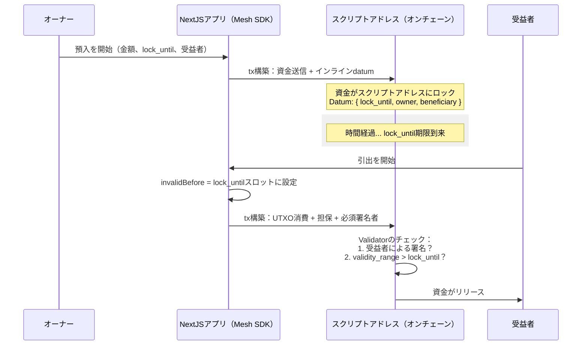

# レッスン #07: Vestingコントラクト

Vestingコントラクトは、指定された期間中に資金をロックし、ロック期間が終了した後にのみ指定された受益者が引き出せるようにします。このレッスンでは、AikenとMesh SDKを使用してCardano上のvestingコントラクトの実装とやり取りの方法を説明します。

> ソースコード: [GitHub](https://github.com/cardanobuilders/cardanobuilders.github.io/tree/main/codes/course-cardano/07-vesting)

## 概要

### Vestingコントラクトとは？
Vestingコントラクトは資金をロックし、指定された時間が経過した後にのみ受益者に資金をリリースします。資金の分配に対するセキュリティと制御を提供します。


### 主な特徴：
- **ロック期間**: 特定のタイムスタンプまで資金がロックされます。
- **オーナーと受益者**: オーナーが資金を預け入れ、受益者がロック期間後に引き出します。

## スマートコントラクトの詳細

### Datumの定義
Datumは3つのパラメータでvestingコントラクトを構成します：

- **`lock_until`**: 資金がロックされるPOSIXタイムスタンプ
- **`owner`**: 資金オーナーの資格情報
- **`beneficiary`**: 受益者の資格情報

```
pub type VestingDatum {
  /// POSIX time in milliseconds, e.g. 1672843961000
  lock_until: Int,
  /// Owner's credentials
  owner: ByteArray,
  /// Beneficiary's credentials
  beneficiary: ByteArray,
}
```

このdatumは`aiken-vesting/aiken-workspace/lib/vesting/types.ak`にあります。

次に、spend validatorを定義します。

```
validator vesting {
  spend(
    datum_opt: Option<VestingDatum>,
    _redeemer: Data,
    _input: OutputReference,
    tx: Transaction,
  ) {
    // In principle, scripts can be used for different purpose (e.g. minting
    // assets). Here we make sure it's only used when 'spending' from a eUTxO
    expect Some(datum) = datum_opt
    or {
      key_signed(tx.extra_signatories, datum.owner),
      and {
        key_signed(tx.extra_signatories, datum.beneficiary),
        valid_after(tx.validity_range, datum.lock_until),
      },
    }
  }

  else(_) {
    fail
  }
}
```

`vesting` validatorは以下の2つの条件で引き出しを許可します：

1. トランザクションが**オーナー**によって署名されている場合（いつでも引き出し可能）、または
2. トランザクションが**受益者**によって署名されており、かつ現在の時刻がロック期間を過ぎている場合


### 動作の仕組み

オーナーはvestingコントラクトに資金を預け入れ、ロック期間が終了するまでロックします。

Cardanoのトランザクションには、トランザクションが有効な期間を指定する有効性区間が含まれています。台帳はスクリプトを実行する前にこれらの境界を検証します。これにより、決定論性を維持しながらスクリプトに時間の概念を与えます。トランザクションの下限が`A`である場合、現在の時刻は少なくとも`A`です。

上限は制御されないため、トランザクションはvesting期間をはるかに過ぎた後に実行される可能性があります。スクリプトの観点からこれは許容されます。コントラクトは最小待機時間のみを強制します。

### テスト

包括的なテストスクリプトが提供されています。`aiken check`でテストを実行してください。

テストスクリプトには以下のテストケースが含まれています：

- ロック解除の成功
- オーナーの署名のみでのロック解除の成功
- 受益者の署名と時間経過によるロック解除の成功
- 受益者の署名のみでのロック解除の失敗
- 時間経過のみでのロック解除の失敗

完全なテストソースは[`vesting.ak`](https://github.com/cardanobuilders/cardanobuilders.github.io/blob/main/codes/course-cardano/07-vesting/src/aiken-workspace/validators/vesting.ak)を参照してください。

### コンパイルとビルド

スクリプトをコンパイルするには、以下のコマンドを実行します：

```sh
aiken build
```

このコマンドはCIP-0057 Plutus blueprintを生成します。[`plutus.json`](https://github.com/cardanobuilders/cardanobuilders.github.io/blob/main/codes/course-cardano/07-vesting/src/aiken-workspace/plutus.json)で確認できます。

## 資金の預け入れ

オーナーはvestingコントラクトに資金を預け入れ、ロック期間を指定します。

```ts
const assets: Asset[] = [
  {
    unit: "lovelace",
    quantity: "10000000",
  },
];

const lockUntilTimeStamp = new Date();
lockUntilTimeStamp.setMinutes(lockUntilTimeStamp.getMinutes() + 1);
```

これにより、1分間のロック期間で10 ADAがvestingコントラクトに預け入れられます。

```ts
// app wallet
const wallet = new MeshWallet({
  networkId: 0,
  key: {
    type: "mnemonic",
    words: appWallet,
  },
  fetcher: provider,
  submitter: provider,
});

const utxos = await wallet.getUtxos();
const changeAddress = await wallet.getChangeAddress();

const { pubKeyHash: ownerPubKeyHash } = deserializeAddress(changeAddress);
const { pubKeyHash: beneficiaryPubKeyHash } =
  deserializeAddress(beneficiaryAddress);
```

このチュートリアルでは、預け入れ資金に別のアプリウォレットを使用します。オーナーと受益者の両方の公開鍵hashは`deserializeAddress`を使って取得します。

```ts
const txBuilder = new MeshTxBuilder({
  fetcher: provider,
  verbose: true,
});

const unsignedTx = await txBuilder
  .txOut(script.address, amount)
  .txOutInlineDatumValue(
    mConStr0([lockUntilTimeStampMs, ownerPubKeyHash, beneficiaryPubKeyHash])
  )
  .changeAddress(changeAddress)
  .selectUtxosFrom(utxos)
  .complete();
```

このトランザクションは、ロック期間、オーナー、受益者を含むインラインdatumとともに、vestingコントラクトのスクリプトアドレスに資金を送信します。

署名して送信：

```ts
const signedTx = await wallet.signTx(unsignedTx);
const txHash = await wallet.submitTx(signedTx);
```

返されたトランザクションhashを保存してください。資金の引き出しに必要です。

[預け入れトランザクション成功例](https://preprod.cardanoscan.io/transaction/556f2bfcd447e146509996343178c046b1b9ad4ac091a7a32f85ae206345e925)。

## 資金の引き出し

ロック期間が終了すると、受益者（またはオーナー）は資金を引き出すことができます。

まず、ロックされた資金を含むUTXOを取得します：

```ts
const txHashFromDesposit =
  "556f2bfcd447e146509996343178c046b1b9ad4ac091a7a32f85ae206345e925";
const utxos = await provider.fetchUTxOs(txHash);
const vestingUtxo = utxos[0];
```

これにより、預け入れトランザクションからUTXOが取得されます。次に、datumを準備し、トランザクション有効性区間のスロット番号を計算します：

```ts
const datum = deserializeDatum<VestingDatum>(vestingUtxo.output.plutusData!);

const invalidBefore =
  unixTimeToEnclosingSlot(
    Math.min(datum.fields[0].int as number, Date.now() - 15000),
    SLOT_CONFIG_NETWORK.preprod
  ) + 1;
```

datumのロック期間から`invalidBefore`スロットが決定され、トランザクションがロック期間終了後にのみ有効になることが保証されます。

引き出しトランザクションを構築します：

```ts
const txBuilder = new MeshTxBuilder({
  fetcher: provider,
  verbose: true,
});

const unsignedTx = await txBuilder
  .spendingPlutusScript("V3")
  .txIn(
    vestingUtxo.input.txHash,
    vestingUtxo.input.outputIndex,
    vestingUtxo.output.amount,
    script.address
  )
  .spendingReferenceTxInInlineDatumPresent()
  .spendingReferenceTxInRedeemerValue("")
  .txInScript(script.cbor)
  .txOut(walletAddress, [])
  .txInCollateral(
    collateralInput.txHash,
    collateralInput.outputIndex,
    collateralOutput.amount,
    collateralOutput.address
  )
  .invalidBefore(invalidBefore)
  .requiredSignerHash(pubKeyHash)
  .changeAddress(walletAddress)
  .selectUtxosFrom(inputUtxos)
  .complete();
```

このトランザクションは、vestingコントラクトからロックされたUTXOを使用し、スクリプト、datum、redeemer、担保、有効性区間、必要な署名者を指定します。

署名して送信：

[引き出しトランザクション成功例](https://preprod.cardanoscan.io/transaction/13d6b2258680bbdf08f50a3bbc03e7ed674f5614844ce773fc191c9582282b04)。

## ソースコード解説

このセクションでは、プロジェクト構成を分解し、ブロックチェーン概念をWeb2の馴染みあるパターンに対応付けて、vestingコントラクトのエンドツーエンドの動作を理解する助けとします。

### プロジェクト構成

```
07-vesting/
├── src/                    # NextJSアプリケーション
│   ├── app/                # App routerのページとAPIルート
│   ├── components/         # 預入/引出UIのReactコンポーネント
│   └── lib/                # 共有ユーティリティとコントラクトヘルパー
├── aiken-workspace/        # オンチェーンスマートコントラクトコード
│   ├── lib/
│   │   └── vesting/
│   │       └── types.ak    # VestingDatum型定義
│   ├── validators/
│   │   └── vesting.ak      # Spend validator + テスト
│   └── plutus.json         # コンパイル済みPlutus blueprint（CIP-0057）
├── eslint.config.mjs
├── next.config.ts
├── package.json            # 依存関係：NextJS + @meshsdk/core
├── postcss.config.mjs
└── tsconfig.json
```

プロジェクトには2つの明確な半分があります。`aiken-workspace/`ディレクトリにはAikenで書かれたオンチェーンvalidatorが含まれています。これは誰かがロックされた資金を使おうとする際にCardano台帳が実行するスマートコントラクトです。`src/`ディレクトリはMesh SDKを使用して預入および引出トランザクションを構築・送信する標準的なNextJSアプリです。Aikenコードをブロックチェーン上で動作するバックエンドビジネスロジック、NextJSアプリをそれを呼び出すフロントエンドクライアントと考えてください。

### Vestingライフサイクル



### Web2との対応

Webアプリケーションでエスクローやスケジュールリリース機能を構築した経験がある方は、コアとなるアイデアを既に理解しています。各Cardano概念の対応は以下の通りです:

| Cardanoの概念 | Web2の対応物 | 役割 |
|---|---|---|
| **Vestingコントラクト** | エスクローサービス（例：Stripe Connectの遅延支払い） | 条件が満たされたときに資金を保持しリリースします |
| **Datum**（`VestingDatum`） | データベース行に保存されたエスクロー条件 | ロック時間、オーナー、受益者をオンチェーンに記録します |
| **`lock_until`** | スケジュールリリース日 / cronジョブのトリガー時間 | 資金が引出可能になるPOSIXタイムスタンプ |
| **`validity_range`** | リクエストタイムスタンプの検証（例：JWTの`nbf`クレーム） | 台帳がトランザクションをこの時間枠内でのみ有効として強制し、スクリプトに信頼できる「現在時刻」の感覚を与えます |
| **担保（Collateral）** | 失敗したAPIコール用のセキュリティデポジット（ホールドチャージのようなもの） | スクリプト実行が失敗した場合のコストをカバーするために差し入れる小さなUTXO -- 成功すれば返金されます |
| **スクリプトアドレス** | エスクローアカウント / カストディアル保管口座 | 秘密鍵ではなくコードによって制御されるブロックチェーンアドレス |

Web2との最大の違い：資金をリリースするかどうかを決定するサーバーが存在しません。validatorロジックはすべてのCardanoノード上で決定論的に実行され、`validity_range`メカニズムにより台帳自体がスクリプト内のクロックに頼ることなく時間制約を強制します。

## ソースコード

このレッスンのソースコードは[GitHub](https://github.com/cardanobuilders/cardanobuilders.github.io/tree/main/codes/course-cardano/07-vesting)で公開されています。

## チャレンジ

vestingコントラクトを変更して、一度にすべてではなく、時間の経過とともに段階的に資金がリリースされるvesting スケジュールを実装してください。あるいは、受益者がトークンを受け取る前に一定期間待たなければならないクリフ期間を追加してみてください。
