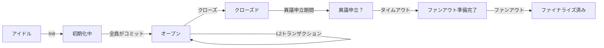

# レッスン #09: Hydraエンドツーエンドハッピーフロー

Hydraは、Cardanoのレイヤー2スケーリングソリューションであり、参加者間でほぼ即時かつ低コストのトランザクションを可能にします。ステートチャネルとして機能し、複数の当事者がCardanoメインチェーン（レイヤー1）のセキュリティ保証を維持しながら、毎秒数千件のトランザクションを処理できる一時的なオフチェーン台帳です。

このレッスンでは以下を学びます：
- Hydraノードのセットアップと接続
- 2人の参加者間でHydra Headを開く
- レイヤー1からHeadに資金をコミット
- MeshJSを使用して即時レイヤー2トランザクションを構築・送信
- Headを閉じて最終状態をレイヤー1に決済

> ソースコード: [GitHub](https://github.com/cardanobuilders/cardanobuilders.github.io/tree/main/codes/course-cardano/09-hydra)

## 概要

### Hydraの仕組み

Hydra Headは、定義されたライフサイクルを持つステートチャネルです：

1. **初期化**: 参加者がレイヤー1上でHeadを開くことに合意
2. **コミット**: 各参加者がレイヤー1からHeadに資金をロック
3. **トランザクション**: オフチェーンで無制限のトランザクションを即時処理
4. **クローズ**: 合意された最終状態をレイヤー1に送信
5. **ファンアウト**: 最終状態に従ってレイヤー1上で資金を分配

Head内のトランザクションはCardanoレイヤー1と同じフォーマットを使用します。手数料はゼロで、確認は即時（参加者間のネットワーク遅延のみに制限）であり、すべての当事者がすべての状態遷移に合意する必要があります。


### Hydraの活用場面

Hydraは以下の用途に最適です：
- **高頻度トランザクション**: ゲーム、マイクロペイメント、リアルタイムアプリケーション
- **コスト重視のアプリケーション**: 多くのトランザクションをオフチェーンでバッチ処理し、L1手数料はオープンとクローズのみ
- **プライベートトランザクション**: 決済までトランザクションの詳細をオフチェーンに保持
- **インタラクティブアプリケーション**: 迅速な状態更新を必要とするマルチパーティプロトコル


## システムセットアップ

### 前提条件

開始する前に以下が必要です：
- `cardano-cli`にアクセスできるCardanoノード（preprodテストネットに同期済み）
- `hydra-node`バイナリ（[インストールガイド](https://hydra.family/head-protocol/docs/getting-started/installation)）
- preprodのテストADA（ノード手数料として参加者あたり少なくとも30 tADA、さらにコミットする資金）
- 参加者マシン間のネットワークアクセス

### パッケージのインストール

新しいプロジェクトディレクトリを作成し、必要なMeshJSパッケージをインストールします：

```bash
mkdir mesh-hydra && cd mesh-hydra
npm init -y
npm install @meshsdk/hydra @meshsdk/core @meshsdk/wallet
npm install -D typescript tsx
```

### 鍵の生成

各参加者は2つの鍵ペアが必要です：Cardano鍵（レイヤー1操作用）とHydra鍵（Head内のスナップショット署名用）。

Aliceの鍵を生成します：

```bash
mkdir -p credentials

# Cardano keys (for L1 fees and identity)
cardano-cli address key-gen \
  --verification-key-file credentials/alice-node.vk \
  --signing-key-file credentials/alice-node.sk

cardano-cli address build \
  --payment-verification-key-file credentials/alice-node.vk \
  --out-file credentials/alice-node.addr \
  --testnet-magic 1

# Funds keys (for committing to the Head)
cardano-cli address key-gen \
  --verification-key-file credentials/alice-funds.vk \
  --signing-key-file credentials/alice-funds.sk

cardano-cli address build \
  --payment-verification-key-file credentials/alice-funds.vk \
  --out-file credentials/alice-funds.addr \
  --testnet-magic 1

# Hydra keys (for Head protocol signing)
hydra-node gen-hydra-key --output-file credentials/alice-hydra
```

Bobについても同じ手順を繰り返します（すべてのファイル名で`alice`を`bob`に置き換えます）。

[Cardanoテストネットフォーセット](https://docs.cardano.org/cardano-testnets/tools/faucet/)からノードアドレスにそれぞれ少なくとも30 tADAを入金してください。資金アドレスにはHeadにコミットしたい任意の金額を保持できます。

### プロトコルパラメータの設定

`protocol-parameters.json`ファイルを作成します。Hydra Head内では手数料はゼロに設定されます：

```json
{
  "txFeeFixed": 0,
  "txFeePerByte": 0,
  "executionUnitPrices": {
    "priceMemory": 0,
    "priceSteps": 0
  }
}
```

preprodのプロトコルパラメータをコピーし、上記の手数料関連フィールドをゼロに上書きします。その他のパラメータはすべてレイヤー1と同じままです。

### Hydraノードの起動

AliceのHydraノードを起動します：

```bash
hydra-node \
  --node-id alice-node \
  --api-host 0.0.0.0 \
  --api-port 4001 \
  --listen 0.0.0.0:5001 \
  --peer <BOB_IP>:5001 \
  --hydra-scripts-tx-id <HYDRA_SCRIPTS_TX_ID> \
  --cardano-signing-key credentials/alice-node.sk \
  --cardano-verification-key credentials/bob-node.vk \
  --hydra-signing-key credentials/alice-hydra.sk \
  --hydra-verification-key credentials/bob-hydra.vk \
  --ledger-protocol-parameters protocol-parameters.json \
  --testnet-magic 1 \
  --node-socket "${CARDANO_NODE_SOCKET_PATH}" \
  --contestation-period 300s
```

Bobのノードも同様に、Bobの認証情報、APIポート`4002`、Aliceをピアとして起動します。

主要なパラメータ：
- `--api-port`: MeshJSが接続するHTTP/WebSocket APIポート
- `--peer`: 他の参加者のリッスンアドレス
- `--hydra-scripts-tx-id`: preprod上に公開されたHydraスクリプト（[リファレンス](https://hydra.family/head-protocol/docs/getting-started/quickstart)）
- `--contestation-period`: 最終状態を異議申し立てするための時間枠（ここでは300秒）

## Hydraへの接続

ノードが稼働した状態で、`HydraProvider`を使用してHydraノードに接続します：

```ts
import { HydraProvider, HydraInstance } from "@meshsdk/hydra";
import { BlockfrostProvider } from "@meshsdk/core";

const blockfrost = new BlockfrostProvider("YOUR_BLOCKFROST_KEY");

const hydraProvider = new HydraProvider({
  httpUrl: "http://localhost:4001",
});

const instance = new HydraInstance({
  provider: hydraProvider,
  fetcher: blockfrost,
  submitter: blockfrost,
});

await hydraProvider.connect();
const connected = await hydraProvider.isConnected();
console.log("Connected to Hydra node:", connected);
```

- `HydraProvider`はHydraノードAPIへのWebSocket接続を管理します。
- `HydraInstance`は資金のコミットのための高レベルメソッドを提供します。
- `BlockfrostProvider`はレイヤー1操作（UTxOの取得、コミットトランザクションの送信）に使用されます。

## Headの初期化

接続後、任意の参加者がHeadを初期化できます：

```ts
await hydraProvider.init();
```

これにより`Init`コマンドがHydraノードに送信されます。接続されたすべてのノードが`HeadIsInitializing`イベントを受信します。Headは`Idle`から`Initializing`状態に移行します。

## 資金のコミット

`Initializing`フェーズ中に、各参加者はHeadに資金（または空のコミット）をコミットする必要があります。コミットされた資金はHeadが開いた後にレイヤー2で利用可能になります。

CLIキーからウォレットを作成し、UTxOをコミットします：

```ts
import { MeshCardanoHeadlessWallet, AddressType } from "@meshsdk/wallet";

const wallet = await MeshCardanoHeadlessWallet.fromCliKeys({
  networkId: 0,
  walletAddressType: AddressType.Base,
  fetcher: blockfrost,
  submitter: blockfrost,
  paymentSkey: "credentials/alice-funds.sk",
});

const utxos = await wallet.getUtxosMesh();
const utxo = utxos[0];

const commitTx = await instance.commitFunds(
  utxo.input.txHash,
  utxo.input.outputIndex
);
const signedTx = await wallet.signTx(commitTx, true, false);
const txHash = await wallet.submitTx(signedTx);
console.log("Committed funds:", txHash);
```

- `commitFunds`は、指定されたUTxOをHeadにロックするレイヤー1トランザクションを作成します。
- トランザクションには部分署名が必要です（`signTx`の第2引数に`true`を指定）。
- Headが開くには、両方の参加者がコミットする必要があります。参加者が資金をコミットしない場合は`commitEmpty()`を使用してください。

Headが開くのをリッスンします：

```ts
hydraProvider.onMessage((message) => {
  if (message.tag === "HeadIsOpen") {
    console.log("Head is open! Ready for L2 transactions.");
  }
});
```

## レイヤー2でのトランザクション

Headが開いた状態で、即座に確定するトランザクションを構築して送信できます。レイヤー2トランザクションは、`isHydra`フラグを`true`に設定した同じ`MeshTxBuilder`を使用します：

```ts
import { MeshTxBuilder } from "@meshsdk/core";

const protocolParams = await hydraProvider.fetchProtocolParameters();
const aliceAddress = await wallet.getChangeAddressBech32();
const l2Utxos = await hydraProvider.fetchAddressUTxOs(aliceAddress);

const txBuilder = new MeshTxBuilder({
  fetcher: hydraProvider,
  submitter: hydraProvider,
  isHydra: true,
  params: protocolParams,
});

const unsignedTx = await txBuilder
  .txOut(bobAddress, [{ unit: "lovelace", quantity: "5000000" }])
  .changeAddress(aliceAddress)
  .selectUtxosFrom(l2Utxos)
  .setNetwork("preprod")
  .complete();

const signedTx = await wallet.signTx(unsignedTx, false);
const txHash = await hydraProvider.submitTx(signedTx);
console.log("L2 transaction submitted:", txHash);
```

- `fetchProtocolParameters()`はHeadのプロトコルパラメータ（手数料ゼロ）を返します。
- `fetchAddressUTxOs()`は指定されたアドレスのHead内のUTxOを取得します。
- `isHydra: true`は`MeshTxBuilder`にHydra環境向けにビルドすることを指示します。
- `submitTx()`はトランザクションをHeadに送信します（レイヤー1には送信しません）。

トランザクションの確認をリッスンします：

```ts
hydraProvider.onMessage((message) => {
  if (message.tag === "TxValid") {
    console.log("Transaction confirmed:", message.transactionId);
  }
  if (message.tag === "TxInvalid") {
    console.log("Transaction rejected:", message.validationError);
  }
  if (message.tag === "SnapshotConfirmed") {
    console.log("New snapshot confirmed by all participants");
  }
});
```

Head内では必要な数だけトランザクションを送信できます。確認された各トランザクションは、すべての参加者が署名した新しいスナップショットによって共有状態を更新します。

## Headのクローズ

トランザクションが完了したら、任意の参加者がHeadを閉じることができます：

```ts
await hydraProvider.close();
```

これにより、最新の確認済みスナップショットがレイヤー1に投稿されます。異議申し立て期間が開始されます（この設定では300秒）。この期間中、より新しいスナップショットを持つ参加者は異議を申し立てることができます。

異議申し立て期間が終了した後、最終状態をレイヤー1にファンアウトします：

```ts
hydraProvider.onMessage(async (message) => {
  if (message.tag === "ReadyToFanout") {
    await hydraProvider.fanout();
    console.log("Fanout initiated");
  }
  if (message.tag === "HeadIsFinalized") {
    console.log("Head finalized! Funds are back on Layer 1.");
    await hydraProvider.disconnect();
  }
});
```

- `close()`はクローズプロセスを開始し、最終状態をオンチェーンに投稿します。
- `fanout()`は最終的なHead状態に従ってレイヤー1上で資金を分配します。
- `HeadIsFinalized`の後、すべての資金は最終アドレスのレイヤー1に戻ります。

## 完全な例

以下のスクリプトは、完全なハッピーフローを実行します：Headの初期化、資金のコミット、トランザクションの送信、クローズ。

```ts
import { HydraProvider, HydraInstance } from "@meshsdk/hydra";
import { BlockfrostProvider, MeshTxBuilder } from "@meshsdk/core";
import { MeshCardanoHeadlessWallet, AddressType } from "@meshsdk/wallet";

async function main() {
  const blockfrost = new BlockfrostProvider("YOUR_BLOCKFROST_KEY");

  const hydraProvider = new HydraProvider({
    httpUrl: "http://localhost:4001",
  });

  const instance = new HydraInstance({
    provider: hydraProvider,
    fetcher: blockfrost,
    submitter: blockfrost,
  });

  const wallet = await MeshCardanoHeadlessWallet.fromCliKeys({
    networkId: 0,
    walletAddressType: AddressType.Base,
    fetcher: blockfrost,
    submitter: blockfrost,
    paymentSkey: "credentials/alice-funds.sk",
  });

  const aliceAddress = await wallet.getChangeAddressBech32();
  const bobAddress = "addr_test1..."; // Bob's address

  await hydraProvider.connect();

  hydraProvider.onMessage(async (message) => {
    switch (message.tag) {
      case "HeadIsInitializing": {
        console.log("Head initializing, committing funds...");
        const utxos = await wallet.getUtxosMesh();
        const commitTx = await instance.commitFunds(
          utxos[0].input.txHash,
          utxos[0].input.outputIndex
        );
        const signedCommit = await wallet.signTx(commitTx, true, false);
        await wallet.submitTx(signedCommit);
        break;
      }

      case "HeadIsOpen": {
        console.log("Head is open, sending transaction...");
        const pp = await hydraProvider.fetchProtocolParameters();
        const l2Utxos = await hydraProvider.fetchAddressUTxOs(aliceAddress);

        const txBuilder = new MeshTxBuilder({
          fetcher: hydraProvider,
          submitter: hydraProvider,
          isHydra: true,
          params: pp,
        });

        const unsignedTx = await txBuilder
          .txOut(bobAddress, [{ unit: "lovelace", quantity: "5000000" }])
          .changeAddress(aliceAddress)
          .selectUtxosFrom(l2Utxos)
          .setNetwork("preprod")
          .complete();

        const signedTx = await wallet.signTx(unsignedTx, false);
        await hydraProvider.submitTx(signedTx);
        break;
      }

      case "SnapshotConfirmed": {
        console.log("Transaction confirmed, closing Head...");
        await hydraProvider.close();
        break;
      }

      case "ReadyToFanout": {
        console.log("Contestation period ended, fanning out...");
        await hydraProvider.fanout();
        break;
      }

      case "HeadIsFinalized": {
        console.log("Head finalized! Funds are back on L1.");
        await hydraProvider.disconnect();
        break;
      }
    }
  });

  await hydraProvider.init();
}

main().catch(console.error);
```

## ソースコード解説

このプロジェクトはインフラセットアップ（シェルスクリプト）とアプリケーションロジック（TypeScript）を分離しています。Web2プロジェクトがDocker/Terraform設定とNode.jsコードを分離するのと同様のパターンです。

### プロジェクト構成

```
09-hydra/
├── src/                        # TypeScriptアプリケーションロジック
│   └── （Hydraフロースクリプト）    #   接続、コミット、トランザクション、クローズ
├── generate-keys.sh            # インフラ：Cardano + Hydra鍵ペアの生成
├── start-node-alice.sh         # インフラ：AliceのHydraノード起動
├── start-node-bob.sh           # インフラ：BobのHydraノード起動
├── protocol-parameters.json    # L2設定：Head内の手数料ゼロ
├── package.json                # @meshsdk/hydra, @meshsdk/core, @meshsdk/wallet
└── tsconfig.json
```

**シェルスクリプト**はインフラ層を処理します：暗号鍵の生成と正しいピア設定でのHydraノードの起動です。典型的なWeb2プロジェクトの`docker-compose.yml`やデプロイメントスクリプトのようなものです。環境を立ち上げるために一度実行します。

**`src/`のTypeScriptファイル**には、実行中のHydraノードに接続し、資金をコミットし、トランザクションを構築し、Headライフサイクルを管理するアプリケーションロジックが含まれています。ここがMeshJSが開発者向けAPIを提供する場所です。

**`protocol-parameters.json`**はHydra Head内のルールを定義します。レイヤー1との主な違いは、すべての手数料フィールドがゼロに設定されていることで、Head内のトランザクションが無料であることを意味します。これはクエリごとのコストがないローカルキャッシュ層を設定するようなものです。

### Hydra Headライフサイクル

Hydra Headは厳格なステートマシンに従います。すべての参加者が各遷移に同意する必要があり、小グループ内のコンセンサスプロトコルに似ています。



- **アイドルから初期化中**: 任意の参加者が`hydraProvider.init()`を呼びます。レイヤー1トランザクションがオンチェーンでHeadをアナウンスします。
- **初期化中からオープン**: すべての参加者が資金をコミット（または空のコミット）します。すべてのコミットが収集されると、Headが自動的に開きます。
- **オープン（L2ループ）**: 参加者はトランザクションを自由に構築・送信します。確認された各トランザクションは、すべての当事者が署名した新しいスナップショットを作成します。手数料はゼロで確認はほぼ即時です。
- **クローズ**: 任意の参加者が`hydraProvider.close()`を呼び、最新のスナップショットをレイヤー1に投稿します。
- **異議申立期間**: 任意の参加者が新しいスナップショットを持っている場合に投稿された状態に異議を申し立てることができる時間枠（このレッスンでは300秒）。
- **ファンアウト**: 異議申立期間が異議なく経過した後、`hydraProvider.fanout()`が最終残高をレイヤー1アドレスに分配します。

### Web2との対応

Web2のバックグラウンドがある方は、以下のマッピングがHydraの理解に役立ちます:

| Hydraの概念 | Web2の対応物 | 理由 |
|---|---|---|
| Hydra Head | プライベートデータベースまたはキャッシュ層 | 既知の参加者セットが共有する一時的で高速な環境 |
| レイヤー1（Cardano） | メインデータベース（PostgreSQL） | 権威ある永続的な記録保管庫 |
| レイヤー2（Head内） | インメモリキャッシュ（Redis） | 操作ごとのコストなしで高速な読み書き |
| 資金のコミット | キャッシュにデータをロード | 遅い永続ストアから高速層に状態を移動 |
| ファンアウト | キャッシュをメインDBにフラッシュ | 最終状態を権威あるストアに永続化 |
| 異議申立期間 | コンフリクト解決ウィンドウ | ファイナライゼーション前の不整合の検出と解決のための猶予期間 |
| WebSocket API | リアルタイムイベントストリーム（Socket.io） | Hydraノードが`HeadIsOpen`、`TxValid`、`SnapshotConfirmed`などのイベントをWebSocket経由でプッシュ |
| L2のゼロ手数料 | キャッシュのクエリごとのコストなし | Headを開くコストを一度支払えば、内部のトランザクションは無料 |
| スナップショット | キャッシュチェックポイント | すべての参加者がサインオフする定期的な合意された状態 |

主要なメンタルモデル：Headを開閉するためにレイヤー1コストを支払いますが（キャッシュクラスターのプロビジョニングとデコミッションのように）、内部のすべては高速で無料です。

## ソースコード

このレッスンのソースコードは[GitHub](https://github.com/cardanobuilders/cardanobuilders.github.io/tree/main/codes/course-cardano/09-hydra)で公開されています。

## チャレンジ

2人の参加者間でHydra Headを開き、双方から資金をコミットし、複数のトランザクションをやり取りしてください。その後、Headを閉じてファンアウトし、[preprod.cardanoscan.io](https://preprod.cardanoscan.io)で最終的なレイヤー1残高がすべてのレイヤー2トランザクションを反映していることを確認してください。
