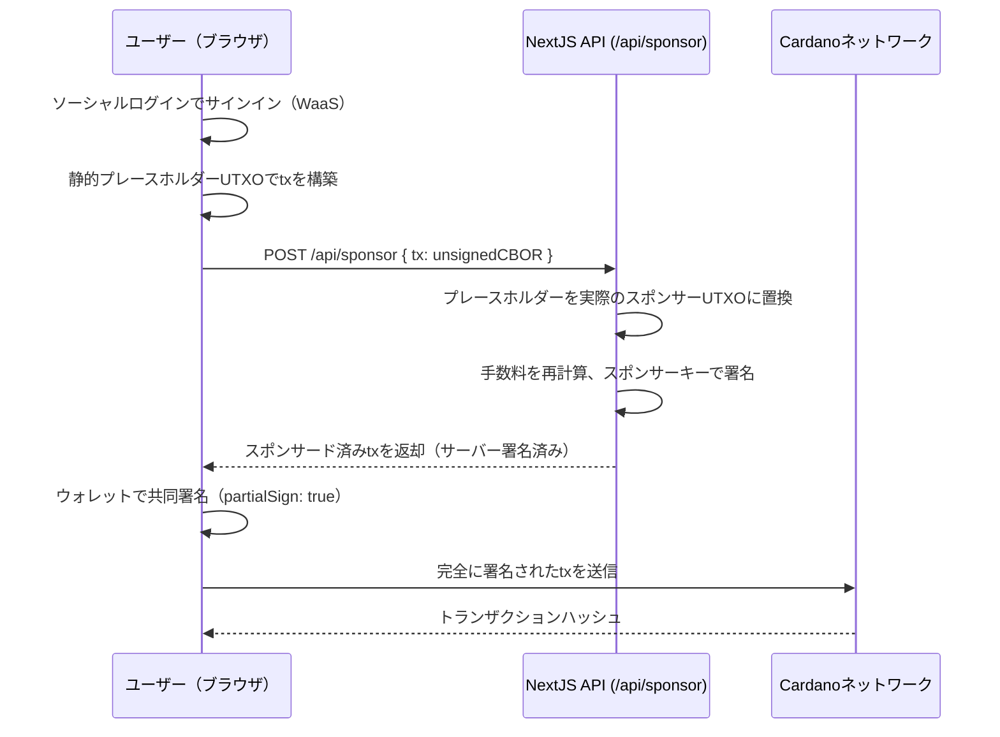

# レッスン #10: シームレスなオンボーディングのためのWeb3サービス

Web3サービスは、ブロックチェーン普及における2つの最大の障壁であるウォレットのセットアップとトランザクション手数料を取り除きます。ユーザーにブラウザ拡張機能のインストールやADAの購入を求める代わりに、アプリケーションがソーシャルログインウォレットを提供し、ユーザーに代わってネットワーク手数料を負担します。

このレッスンでは以下を学びます：
- Wallet-as-a-Service（WaaS）を統合し、ユーザーがソーシャルログインでウォレットを作成できるようにする
- Blockfrostプロキシを設定してAPIキーをサーバー側に保持する
- 開発者がネットワーク手数料を負担するスポンサードトランザクションを構築する
- Cardano preprod上で完全にスポンサーされたADA送金トランザクションを送信する

## 仕組み

### Wallet as a Service

Wallet-as-a-Service（WaaS）により、ユーザーは秘密鍵を管理することなくオンチェーンで取引できます。ユーザーはGoogle、Discord、Twitter、またはAppleでサインインし、即座にノンカストディアルウォレットを受け取ります。


鍵管理システムはShamir's Secret Sharingを使用して秘密鍵を3つのシェアに分割し、別々の場所に保管します。UTXOSも開発者のアプリケーションも完全な鍵にアクセスすることはできません。トランザクション署名時には、鍵はユーザーのデバイス上の分離されたiframe内でのみ再構成され、メモリ上に保持された後、署名完了後に破棄されます。

### トランザクションスポンサーシップ

Cardanoのネットワーク手数料はADAで支払われます。これが摩擦点となります：エンドユーザーはアプリケーションとやり取りする前にADAを保有する必要があります。


トランザクションスポンサーシップはこの障壁を取り除きます。開発者が管理するウォレットが、ユーザーに代わってトランザクション入力とネットワーク手数料を負担します。SDKは静的なプレースホルダーでトランザクションを構築し、スポンサーウォレットの実際のUTXOに置き換え、サーバー側で署名し、ユーザーが共同署名するためにトランザクションを返します。

## システムセットアップ

### 前提条件

開始する前に以下が必要です：

- [utxos.dev/dashboard](https://utxos.dev/dashboard)からのUTXOSアカウントとプロジェクト
- [Blockfrost](https://blockfrost.io/) APIキー（preprodネットワーク）
- UTXOSダッシュボードで作成された、資金が入ったウォレットを持つスポンサーシップ
- Node.js 18以上がインストールされていること

### NextJSアプリケーションの作成

新しいNextJSアプリケーションを作成します：

```bash
npx create-next-app@latest --typescript web3-services-demo
```

プロンプトに従います：

```bash
Need to install the following packages:
Ok to proceed? (y)

✔ Would you like to use ESLint? … Yes
✔ Would you like to use Tailwind CSS? … Yes
✔ Would you like your code inside a `src/` directory? … Yes
✔ Would you like to use App Router? … Yes
✔ Would you like to use Turbopack for next dev? … No
✔ Would you like to customize the import alias (@/* by default)? … No
```

プロジェクトディレクトリに移動します：

```bash
cd web3-services-demo
```

### 依存関係のインストール

UTXOS SDKとMeshパッケージをインストールします：

```bash
npm install @utxos/sdk @meshsdk/core
```

### 環境変数の設定

プロジェクトルートに`.env`ファイルを作成します：

```bash
# Client-side (safe to expose)
NEXT_PUBLIC_UTXOS_PROJECT_ID=your_project_id
NEXT_PUBLIC_NETWORK_ID=0

# Server-side only (never expose to client)
BLOCKFROST_API_KEY_PREPROD=your_blockfrost_preprod_key
UTXOS_API_KEY=your_utxos_api_key
UTXOS_PRIVATE_KEY=your_entity_secret_private_key
SPONSORSHIP_ID=your_sponsorship_id
```

- `NEXT_PUBLIC_UTXOS_PROJECT_ID`: UTXOSダッシュボードからのプロジェクトID。
- `NEXT_PUBLIC_NETWORK_ID`: preprodの場合は`0`、mainnetの場合は`1`。
- `BLOCKFROST_API_KEY_PREPROD`: preprodネットワーク用のBlockfrost APIキー。
- `UTXOS_API_KEY`: UTXOSダッシュボードからのAPIキー。
- `UTXOS_PRIVATE_KEY`: スポンサードトランザクション署名用のエンティティシークレット秘密鍵。
- `SPONSORSHIP_ID`: UTXOSダッシュボードからのスポンサーシップID。

## Blockfrostプロキシ

Blockfrost APIキーはサーバー側に保持する必要があります。ブラウザからキーを隠しながらBlockfrostにリクエストを転送するプロキシルートを作成します。

`src/app/api/blockfrost/[...slug]/route.ts`ファイルを作成します：

```ts
import { NextRequest } from "next/server";

export async function GET(
  request: NextRequest,
  { params }: { params: { slug: string[] } }
) {
  return handleBlockfrostRequest(request, params.slug, "GET");
}

export async function POST(
  request: NextRequest,
  { params }: { params: { slug: string[] } }
) {
  return handleBlockfrostRequest(request, params.slug, "POST");
}

async function handleBlockfrostRequest(
  request: NextRequest,
  slug: string[],
  method: string
) {
  const network = slug[0]; // "preprod" | "mainnet"
  const key =
    network === "mainnet"
      ? process.env.BLOCKFROST_API_KEY_MAINNET
      : process.env.BLOCKFROST_API_KEY_PREPROD;

  const baseUrl =
    network === "mainnet"
      ? "https://cardano-mainnet.blockfrost.io/api/v0"
      : "https://cardano-preprod.blockfrost.io/api/v0";

  if (!key) {
    return Response.json(
      { error: `Missing Blockfrost API key for ${network}` },
      { status: 500 }
    );
  }

  const endpointPath = slug.slice(1).join("/") || "";
  const queryString = request.url.includes("?")
    ? request.url.substring(request.url.indexOf("?"))
    : "";
  const url = `${baseUrl}/${endpointPath}${queryString}`;

  const isCborEndpoint =
    endpointPath === "tx/submit" || endpointPath === "utils/txs/evaluate";

  const response = await fetch(url, {
    method,
    headers: {
      project_id: key,
      "Content-Type": isCborEndpoint
        ? "application/cbor"
        : "application/json",
    },
    body: method !== "GET" ? request.body : undefined,
    // @ts-ignore
    duplex: method !== "GET" ? "half" : undefined,
  });

  if (response.status === 404 && endpointPath.includes("/utxos")) {
    return Response.json([]);
  }

  if (!response.ok) {
    const errorBody = await response.text();
    return Response.json(
      { error: `Blockfrost error: ${response.status}`, details: errorBody },
      { status: response.status }
    );
  }

  if (isCborEndpoint) {
    const data = await response.text();
    return Response.json(data);
  }

  const data = await response.json();
  return Response.json(data);
}
```

このプロキシは`/api/blockfrost/preprod/addresses/addr_test1...`のようなリクエストを、サーバー側でキーを注入してBlockfrost APIに転送します。

## Wallet-as-a-Serviceの統合

### ウォレットの初期化

`Web3Wallet.enable()`メソッドは、ユーザーがソーシャルプロバイダーで認証するポップアップウィンドウを開きます。認証後、SDKはアドレスクエリ、UTxO検索、トランザクション署名、データ署名をサポートするCardanoウォレットを持つウォレットインスタンスを返します。

`src/lib/wallet.ts`ファイルを作成します：

```ts
import { Web3Wallet, EnableWeb3WalletOptions } from "@utxos/sdk";
import { BlockfrostProvider } from "@meshsdk/core";

const provider = new BlockfrostProvider("/api/blockfrost/preprod/");

export async function connectWallet() {
  const options: EnableWeb3WalletOptions = {
    projectId: process.env.NEXT_PUBLIC_UTXOS_PROJECT_ID!,
    networkId: 0,
    fetcher: provider,
    submitter: provider,
  };

  const wallet = await Web3Wallet.enable(options);
  return wallet;
}

export { provider };
```

- `Web3Wallet.enable()`: 認証ポップアップを開き、ウォレットインスタンスを返します。
- `projectId`: ホワイトリストとアナリティクスのためにプロジェクトを識別します。
- `networkId`: preprodテストネットの場合は`0`、mainnetの場合は`1`。
- `fetcher`と`submitter`: Blockfrostプロバイダーがプロキシ経由でルーティングします。

### ウォレットページの構築

`src/app/page.tsx`の内容を置き換えます：

```tsx
"use client";

import { useState } from "react";
import { Web3Wallet } from "@utxos/sdk";
import { connectWallet, provider } from "@/lib/wallet";

export default function Home() {
  const [wallet, setWallet] = useState<Web3Wallet | null>(null);
  const [address, setAddress] = useState("");
  const [status, setStatus] = useState("");

  async function handleConnect() {
    try {
      setStatus("Connecting...");
      const w = await connectWallet();
      setWallet(w);
      const addr = await w.cardano.getChangeAddress();
      setAddress(addr);
      setStatus("Connected");
    } catch (error) {
      setStatus("Connection failed");
      console.error(error);
    }
  }

  return (
    <main className="flex min-h-screen flex-col items-center justify-center gap-4 p-8">
      <h1 className="text-2xl font-bold">Web3 Services Demo</h1>

      {!wallet ? (
        <button
          onClick={handleConnect}
          className="rounded bg-blue-600 px-6 py-2 text-white hover:bg-blue-700"
        >
          Connect Wallet
        </button>
      ) : (
        <div className="flex flex-col items-center gap-4">
          <p className="text-sm text-gray-500">
            {address.slice(0, 20)}...{address.slice(-10)}
          </p>
          <p className="text-green-600">{status}</p>
        </div>
      )}
    </main>
  );
}
```

開発サーバーを起動します：

```bash
npm run dev
```

[http://localhost:3000](http://localhost:3000/)にアクセスし、「Connect Wallet」をクリックします。ソーシャルログインのポップアップが開きます。認証後、ウォレットアドレスがページに表示されます。

## トランザクションスポンサーシップ

### サーバー側スポンサーエンドポイント

スポンサーシップロジックはエンティティシークレット秘密鍵を必要とするため、サーバー側で実行されます。`src/app/api/sponsor/route.ts`ファイルを作成します：

```ts
import { NextRequest } from "next/server";
import { Web3Sdk } from "@utxos/sdk";
import { BlockfrostProvider } from "@meshsdk/core";

const provider = new BlockfrostProvider(
  process.env.BLOCKFROST_API_KEY_PREPROD!
);

const sdk = new Web3Sdk({
  projectId: process.env.NEXT_PUBLIC_UTXOS_PROJECT_ID!,
  apiKey: process.env.UTXOS_API_KEY!,
  network: "testnet",
  privateKey: process.env.UTXOS_PRIVATE_KEY!,
  fetcher: provider,
  submitter: provider,
});

export async function POST(request: NextRequest) {
  try {
    const { tx } = await request.json();

    const result = await sdk.sponsorship.sponsorTx({
      sponsorshipId: process.env.SPONSORSHIP_ID!,
      tx,
    });

    if (!result.success) {
      return Response.json(
        { error: result.error },
        { status: 400 }
      );
    }

    return Response.json({ tx: result.data });
  } catch (error: any) {
    return Response.json(
      { error: error.message },
      { status: 500 }
    );
  }
}
```

- `Web3Sdk`: 開発者管理のウォレットとスポンサーシップを管理するサーバー側SDK。
- `sponsorTx`: 未署名のCBORトランザクションを受け取り、静的プレースホルダーUTXOをスポンサーウォレットの実際のUTXOに置き換え、署名し、スポンサードトランザクションを返します。

### スポンサードトランザクションの構築

スポンサーシップフローは3つのステップで動作します：

1. SDKの静的プレースホルダー入力を使用してクライアント側でトランザクションを**構築**
2. `/api/sponsor`エンドポイントを呼び出してサーバー側でトランザクションを**スポンサー**
3. ユーザーのウォレットでスポンサードトランザクションに**署名して送信**

`src/app/page.tsx`に送金関数を追加します：

```tsx
"use client";

import { useState } from "react";
import { Web3Wallet, Web3Sdk } from "@utxos/sdk";
import { MeshTxBuilder } from "@meshsdk/core";
import { connectWallet, provider } from "@/lib/wallet";

// Static sponsorship info for building the transaction
const staticInfo = {
  changeAddress:
    "addr_test1qrsj3xj6q99m4g9tu9mm2lzzdafy04035eya7hjhpus55r204nlu6dmhgpruq7df228h9gpujt0mtnfcnkcaj3wj457q5zv6kz",
  utxo: {
    input: {
      outputIndex: 0,
      txHash:
        "5a1edf7da58eff2059030abd456947a96cb2d16b9d8c3822ffff58d167ed8bfc",
    },
    output: {
      address:
        "addr_test1qrsj3xj6q99m4g9tu9mm2lzzdafy04035eya7hjhpus55r204nlu6dmhgpruq7df228h9gpujt0mtnfcnkcaj3wj457q5zv6kz",
      amount: [{ unit: "lovelace", quantity: "5000000" }],
    },
  },
};

export default function Home() {
  const [wallet, setWallet] = useState<Web3Wallet | null>(null);
  const [address, setAddress] = useState("");
  const [status, setStatus] = useState("");
  const [recipient, setRecipient] = useState("");
  const [txHash, setTxHash] = useState("");

  async function handleConnect() {
    try {
      setStatus("Connecting...");
      const w = await connectWallet();
      setWallet(w);
      const addr = await w.cardano.getChangeAddress();
      setAddress(addr);
      setStatus("Connected");
    } catch (error) {
      setStatus("Connection failed");
      console.error(error);
    }
  }

  async function handleSend() {
    if (!wallet || !recipient) return;

    try {
      setStatus("Building transaction...");

      // Step 1: Build the transaction with static sponsorship placeholders
      const txBuilder = new MeshTxBuilder({ fetcher: provider });

      txBuilder
        .txOut(recipient, [{ unit: "lovelace", quantity: "2000000" }])
        .changeAddress(staticInfo.changeAddress)
        .txIn(
          staticInfo.utxo.input.txHash,
          staticInfo.utxo.input.outputIndex,
          staticInfo.utxo.output.amount,
          staticInfo.utxo.output.address,
          0
        );

      const unsignedTx = await txBuilder.complete();

      // Step 2: Send to server for sponsorship
      setStatus("Requesting sponsorship...");
      const res = await fetch("/api/sponsor", {
        method: "POST",
        headers: { "Content-Type": "application/json" },
        body: JSON.stringify({ tx: unsignedTx }),
      });

      const data = await res.json();
      if (!res.ok) throw new Error(data.error);

      // Step 3: User signs the sponsored transaction
      setStatus("Awaiting signature...");
      const signedTx = await wallet.cardano.signTx(data.tx, true);

      // Step 4: Submit to the network
      setStatus("Submitting...");
      const hash = await provider.submitTx(signedTx);
      setTxHash(hash);
      setStatus("Transaction submitted!");
    } catch (error: any) {
      setStatus(`Error: ${error.message}`);
      console.error(error);
    }
  }

  return (
    <main className="flex min-h-screen flex-col items-center justify-center gap-4 p-8">
      <h1 className="text-2xl font-bold">Web3 Services Demo</h1>

      {!wallet ? (
        <button
          onClick={handleConnect}
          className="rounded bg-blue-600 px-6 py-2 text-white hover:bg-blue-700"
        >
          Connect Wallet
        </button>
      ) : (
        <div className="flex flex-col items-center gap-4 w-full max-w-md">
          <p className="text-sm text-gray-500">
            {address.slice(0, 20)}...{address.slice(-10)}
          </p>

          <input
            type="text"
            placeholder="Recipient address (addr_test1...)"
            value={recipient}
            onChange={(e) => setRecipient(e.target.value)}
            className="w-full rounded border px-4 py-2"
          />

          <button
            onClick={handleSend}
            className="rounded bg-green-600 px-6 py-2 text-white hover:bg-green-700"
          >
            Send 2 ADA (Sponsored)
          </button>

          {status && <p className="text-sm">{status}</p>}

          {txHash && (
            <a
              href={`https://preprod.cardanoscan.io/transaction/${txHash}`}
              target="_blank"
              rel="noopener noreferrer"
              className="text-blue-600 underline text-sm"
            >
              View on Cardanoscan
            </a>
          )}
        </div>
      )}
    </main>
  );
}
```

このトランザクションは受取人アドレスに2 ADAを送信します。開発者のスポンサーシップウォレットがすべてを負担するため、ユーザーのウォレットは手数料用のADAを保持する必要がありません。

### スポンサーシップフローの仕組み

1. **静的プレースホルダー**: `getStaticInfo()`は、トランザクション構築時にプレースホルダーとして使用される固定UTXOとお釣りアドレスを返します。これらは実際のUTXOではなく、SDKが書き換えるための有効なCBORを生成するためだけに存在します。

2. **サーバー側の書き換え**: `sponsorTx()`はCBORトランザクションを解析し、静的プレースホルダー入力を削除し、スポンサーウォレットの実際のUTXOを注入し、手数料を再計算し、開発者管理のウォレットでトランザクションに署名します。

3. **ユーザーの共同署名**: 開発者ウォレットが既に署名しているため、ユーザーは`partialSign: true`で署名します。両方の署名が最終トランザクションに結合されます。

4. **送信**: 完全に署名されたトランザクションがCardanoネットワークに送信されます。ユーザーは手数料をゼロで済ませられます。

## ソースコード解説

このプロジェクトは標準的なNextJS App Routerアプリケーションです。NextJSアプリを構築した経験がある方は、この構造に馴染みがあるでしょう。ブロックチェーン固有の部分はAPIルートと小さなウォレットヘルパーに配置されています。

### プロジェクト構成

```
10-web3-services/
├── src/
│   ├── app/
│   │   ├── api/
│   │   │   ├── blockfrost/[...slug]/route.ts  # APIゲートウェイ：Blockfrostをプロキシしキーを隠蔽
│   │   │   └── sponsor/route.ts               # サーバーエンドポイント：ユーザートランザクションをスポンサー
│   │   └── page.tsx                            # クライアントUI：ウォレット接続 + ADA送金
│   └── lib/
│       └── wallet.ts                           # ウォレット接続ヘルパー（WaaS初期化）
├── eslint.config.mjs
├── next.config.ts
├── package.json      # NextJS + @utxos/sdk + @meshsdk/core
├── postcss.config.mjs
└── tsconfig.json
```

**`api/blockfrost/[...slug]/route.ts`**はAPIゲートウェイです。Web2のバックエンド・フォー・フロントエンドプロキシと全く同じように機能します：ブラウザがNextJSルートを呼び出し、ルートがサーバー側でAPIキーを注入してBlockfrostにリクエストを転送します。StripeのシークレットキーやサードパーティAPI認証情報を自分のエンドポイントの背後に隠すのと同じパターンです。

**`api/sponsor/route.ts`**はスポンサーシップエンドポイントです。クライアントから未署名トランザクションを受信し、開発者のウォレットから実際のUTXOを差し替え、署名し、スポンサード済みトランザクションを返します。マーチャント（開発者）がカスタマー（ユーザー）の代わりにコストを負担する決済処理エンドポイントのようなものです。

**`lib/wallet.ts`**はWallet-as-a-Service接続を初期化します。プロジェクトIDとネットワークで`Web3Wallet.enable()`を設定し、fetcherとsubmitterをBlockfrostプロキシ経由でルーティングします。Web2でのOAuthクライアントの初期化と同等です。

**`page.tsx`**はウォレット状態、アドレス表示、トランザクションステータスに`useState`フックを使用する標準的なReactクライアントコンポーネントです。ブロックチェーンとのやり取りは`connectWallet()`と`MeshTxBuilder`の背後に抽象化されているため、コンポーネントはフォームベースの通常のReactページのように読めます。

### スポンサーシップフロー

スポンサードトランザクションフローは、クライアント（ブラウザ）、サーバー（NextJS APIルート）、ブロックチェーンネットワーク間の連携を含みます。これは決済ゲートウェイの動作に似ています：クライアントが開始し、サーバーが承認・資金提供し、クライアントが確認します。



**ステップ1 - ソーシャルログイン**: ユーザーが「Connect Wallet」をクリックし、ソーシャルプロバイダーのポップアップ（Google、Discordなど）で認証します。裏側では、`Web3Wallet.enable()`がShamir's Secret Sharingを使用してノンカストディアルウォレットを作成します。シードフレーズもブラウザ拡張機能も不要です。

**ステップ2 - プレースホルダーで構築**: クライアントは`MeshTxBuilder`で静的プレースホルダーUTXOとお釣りアドレスを使用してトランザクションを構築します。これらは実際のオンチェーン値ではありません。サーバーが書き換えるための有効なCBORを生成するためだけに存在します。処理前にサーバー側で置換されるモックデータでフォームを構築するようなものです。

**ステップ3 - サーバーがスポンサー**: `/api/sponsor`エンドポイントが`sdk.sponsorship.sponsorTx()`を呼び出し、CBORを解析し、プレースホルダー入力を削除し、開発者の資金提供ウォレットから実際のUTXOを注入し、手数料を再計算して署名します。これはトークン化されたカードを実際の請求に置き換える決済プロセッサに類似しています。

**ステップ4 - ユーザーが共同署名**: スポンサード済みトランザクションはサーバーの署名が既に付与された状態で返されます。ユーザーが`partialSign: true`で署名し、自分の承認を追加します。これで両方の署名が揃いました。これはマルチパーティ承認で、返金処理に従業員バッジとマネージャーの承認の両方が必要なのと同様です。

**ステップ5 - 送信**: 完全に署名されたトランザクションがCardanoネットワークに送信されます。ユーザーは手数料ゼロです。開発者のスポンサーシップウォレットがすべてを負担しました。

### Web2との対応

| Web3の概念 | Web2の対応物 | 理由 |
|---|---|---|
| Wallet-as-a-Service（WaaS） | OAuth / ソーシャルログイン（Auth0、Firebase Auth） | ユーザーは馴染みのあるプロバイダーで認証し、暗号固有のセットアップは不要 |
| Blockfrostプロキシルート | APIゲートウェイ（nginxプロキシ、BFFパターン） | サードパーティAPIキーをサーバー側に隠し、クリーンな内部エンドポイントを公開 |
| トランザクションスポンサーシップ | マーチャントが支払うStripe/決済処理 | 開発者がネットワーク手数料を負担し、ユーザーは何も支払わない |
| 静的プレースホルダーUTXO | テスト用のモック/スタブ | 実際のデータで置換される有効な構造を構築するための偽の入力 |
| 部分署名（`partialSign: true`） | マルチパーティ承認（2FA、共同署名） | アクションのファイナライゼーション前に複数の当事者が承認する必要がある |
| Shamir's Secret Sharing | 分散鍵管理（HSM、ボールトシャーディング） | 秘密鍵が複数の場所に分割され、単一の当事者が完全な鍵を持たない |
| `Web3Sdk`（サーバー側） | 管理者SDK（Firebase Admin、Stripeサーバー SDK） | 秘密鍵を必要とする操作のための昇格された権限を持つサーバー側SDK |
| CBORトランザクションフォーマット | Protocol Buffers / バイナリシリアライゼーション | 構造化されたブロックチェーンデータのコンパクトなバイナリエンコーディング |

全体的なパターンは、決済フローを構築したことのあるWeb2開発者には馴染み深いものです：クライアントが開始し、サーバーが承認して資金提供し、クライアントが確認し、結果がネットワークに送信されます。

## ソースコード

このレッスンの完全なソースコードは[GitHub](https://github.com/cardanobuilders/cardanobuilders.github.io/tree/main/codes/course-cardano/10-web3-services)で公開されています。

## チャレンジ

スポンサードNFTミンティングアプリケーションを構築してください。ユーザーがソーシャルログインで接続し、NFTのメタデータを提供し、開発者のウォレットがミンティングトランザクションをスポンサーします。ユーザーはミントを承認するために署名しますが、手数料は一切かかりません。

ヒント：
- `ForgeScript.withOneSignature(userAddress)`を使用して、ユーザーのアドレスに紐づいたミンティングポリシーを作成
- トランザクションビルダーに`.mint("1", policyId, tokenNameHex)`と`.mintingScript(forgingScript)`を追加
- CIP-25 NFTメタデータ用に`.metadataValue(721, metadata)`を含める
- 静的スポンサーシップ情報にはスクリプトトランザクション用の担保UTXOが含まれる
