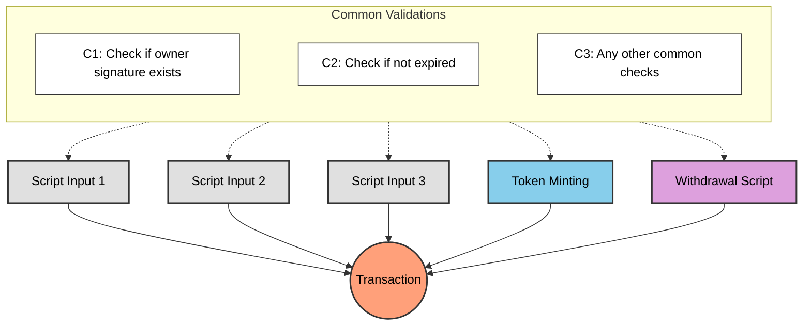
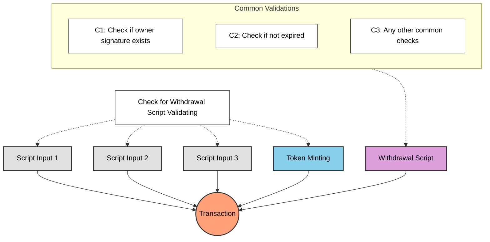

# レッスン #05: 冗長なバリデーションの回避

前回までのレッスンでよくある質問: ミントやステート更新にスペンディングvalidatorで直接バリデーションせず、なぜ引き出しスクリプトを使うのか？ スペンディングvalidatorからUTXOが消費されるたびにバリデーションがトリガーされるのだから、そこにロジックを置けばよいのでは？

> ソースコード: [GitHub](https://github.com/cardanobuilders/cardanobuilders.github.io/tree/main/codes/course-hello-cardano/05-avoid-redundant-validation)

## 複数のスクリプトバリデーションを含むトランザクション

トークンのミント、複数のスクリプトUTXOの消費、資金の引き出しなど、複数のスクリプトバリデーションを含む複雑なトランザクションを考えてみましょう。各アクションにはそれぞれ独自のチェックセットが必要になる場合があります。



すべてのスクリプトで共通のチェックを実行すると冗長なバリデーションが発生します。同じロジックが複数回実行され、トランザクションコストとスクリプトサイズが増大します。

## より良い方法は？

共通のチェックを1つのスクリプトに集約し、一度だけ実行するようにします。他のすべてのスクリプトはそのスクリプトに委譲し、重複ロジックを排除しながらすべての必要なバリデーションを維持します。



`WithdrawalCheck`スクリプトが共通のバリデーションを一度だけ実行し、トランザクション内の他のすべてのスクリプトの条件をチェックします。

## 例: レッスン4からの続き

レッスン4の引き出しスクリプトにすべての共通バリデーションロジックが含まれていると仮定します。それらのチェックをスペンディングやミントのvalidatorで重複させる代わりに、引き出しスクリプトに委譲します:

### スペンディング

```rs
use aiken/crypto.{ScriptHash}
use cardano/transaction.{OutputReference, Transaction}
use cocktail.{withdrawal_script_validated}

validator spending_logics_delegated(
  delegated_withdrawal_script_hash: ScriptHash,
) {
  spend(
    _datum_opt: Option<Data>,
    _redeemer: Data,
    _input: OutputReference,
    tx: Transaction,
  ) {
    withdrawal_script_validated(
      tx.withdrawals,
      delegated_withdrawal_script_hash,
    )
  }

  else(_) {
    fail @"unsupported purpose"
  }
}
```

### ミント

```rs
use aiken/crypto.{ScriptHash}
use cardano/assets.{PolicyId}
use cardano/transaction.{Transaction}
use cocktail.{withdrawal_script_validated}

validator minting_logics_delegated(
  delegated_withdrawal_script_hash: ScriptHash,
) {
  mint(_redeemer: Data, _policy_id: PolicyId, tx: Transaction) {
    withdrawal_script_validated(
      tx.withdrawals,
      delegated_withdrawal_script_hash,
    )
  }

  else(_) {
    fail @"unsupported purpose"
  }
}
```

## なぜ引き出しスクリプトに委譲するのか？

引き出しスクリプトへのバリデーション委譲は、Cardanoスマートコントラクトの一般的なパターンです。スペンディングやミントのvalidatorに委譲することも可能ですが、引き出しスクリプトには明確な利点があります。

### クリーンなトリガー

スペンディングバリデーションはUTXOが消費されたときにトリガーされ、ミントバリデーションはトークンがミントされたときにトリガーされます。どちらも実際のオンチェーンアクションが必要です。一方、引き出しスクリプトは0 lovelaceの引き出し（[`withdraw 0 trick`](https://aiken-lang.org/fundamentals/common-design-patterns#forwarding-validation--other-withdrawal-tricks)）でトリガーできます。これにより、トランザクションのロジックやステートに影響を与えずに、クリーンにバリデーションをトリガーできます。

## わかりやすい説明

### なぜ冗長なバリデーションを避けるのか？
複数のスクリプトがトランザクションに参加する場合、各スクリプトで同じチェックを繰り返すと実行バジェットが無駄になり、手数料が増加します。共通チェックを1つのスクリプトに集約すれば、一度だけ実行されます。

### 委譲の仕組み
引き出しスクリプトが中央のvalidatorとして機能します:

- **スペンディングvalidator**: 引き出しスクリプトがトランザクションに存在することを確認します
- **ミントvalidator**: 同様に引き出しスクリプトの存在を確認します
- **引き出しスクリプト**: すべての共有バリデーションロジックを一度だけ実行します

### Withdraw-Zeroトリック
引き出しスクリプトは`withdraw 0 trick`でトリガーされます。0 lovelaceの引き出しによってトランザクションのステートに影響を与えずにバリデーションを起動します。このアプローチはそのシンプルさから広く採用されています。

### 主なメリット
- **効率性**: 共通チェックがスクリプトごとではなく一度だけ実行されます
- **低手数料**: 実行バジェットの削減によりトランザクションコストが低下します
- **保守性**: バリデーションロジックが一箇所に集約されます

## ソースコード

このレッスンのソースコードは[GitHub](https://github.com/cardanobuilders/cardanobuilders.github.io/tree/main/codes/course-hello-cardano/05-avoid-redundant-validation)で公開されています。
