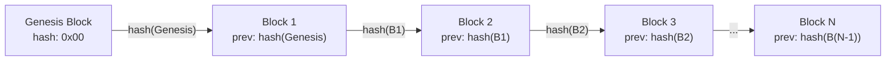
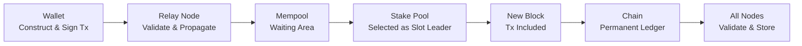

# Bài #01: Blockchain là gì?

Blockchain là một cấu trúc dữ liệu phân tán, chỉ cho phép thêm mới (append-only), cho phép nhiều bên tham gia đồng thuận về trạng thái chung mà không cần một cơ quan trung ương. Nó liên kết các khối giao dịch bằng mật mã, tạo ra một sổ cái bất biến mà không bên nào có thể kiểm soát đơn phương. Trong bài học này, chúng ta sẽ loại bỏ những lời quảng cáo phóng đại và xây dựng một mô hình tư duy chính xác về blockchain thực sự là gì, tại sao nó được phát minh, và cách Cardano triển khai những ý tưởng này với các lựa chọn thiết kế quan trọng đối với bạn với tư cách là nhà phát triển.

Khi kết thúc bài học này, bạn sẽ hiểu tại sao blockchain tồn tại, những vấn đề nào nó giải quyết được mà cơ sở dữ liệu truyền thống không thể, và kiến trúc nền tảng mà mọi bài học tiếp theo đều được xây dựng dựa trên đó.

## Blockchain giải quyết vấn đề gì?

Blockchain giải quyết bài toán tin cậy: cho phép các bên tham gia không tin cậy lẫn nhau đồng thuận về một sổ cái sự thật chung mà không có bất kỳ bên nào nắm quyền kiểm soát. Các hệ thống truyền thống tập trung niềm tin vào một thực thể duy nhất (ngân hàng, nền tảng, nhà điều hành máy chủ), và sự tập trung đó tạo ra các lỗ hổng.

Trong phát triển web truyền thống, niềm tin được tập trung. Khi người dùng chuyển tiền qua ứng dụng ngân hàng, cả người gửi và người nhận đều tin tưởng ngân hàng sẽ cập nhật số dư một cách trung thực. Khi bạn lưu trữ dữ liệu trong cơ sở dữ liệu PostgreSQL, ứng dụng của bạn tin tưởng rằng máy chủ cơ sở dữ liệu không bị can thiệp. Khi hai dịch vụ giao tiếp qua REST API, chúng tin tưởng lớp xác thực (OAuth, JWT) để xác minh danh tính.

Điều này hoạt động tốt một cách đáng ngạc nhiên cho đến khi nó không còn tốt nữa. Niềm tin tập trung tạo ra một số lỗ hổng:

- **Điểm lỗi duy nhất**: Nếu máy chủ của ngân hàng ngừng hoạt động, không có giao dịch nào được thực hiện. Nếu cơ sở dữ liệu bị hỏng, dữ liệu sẽ bị mất.
- **Điểm kiểm soát duy nhất**: Thực thể quản lý hệ thống có thể đơn phương thay đổi quy tắc. Ngân hàng có thể đóng băng tài khoản của bạn. Nền tảng có thể xóa dữ liệu của bạn.
- **Điểm tin cậy duy nhất**: Người dùng phải tin rằng cơ quan trung ương là trung thực, có năng lực, và sẽ duy trì như vậy vô thời hạn.

Câu hỏi cốt lõi mà blockchain trả lời là: **Liệu một nhóm các bên tham gia không tin cậy lẫn nhau có thể đồng thuận về một sổ cái sự thật chung, mà không có bất kỳ bên nào nắm quyền kiểm soát?**

Đây không phải là vấn đề mới. Các nhà nghiên cứu hệ thống phân tán đã nghiên cứu nó hàng thập kỷ dưới các tên gọi như "Bài toán các vị tướng Byzantine." Điều mà Bitcoin (và sau đó là Cardano) đạt được là giải pháp thực tiễn, quy mô lớn đầu tiên.

## Sổ cái là gì?

Sổ cái là một danh sách có thứ tự các bản ghi theo dõi các sự kiện hoặc giao dịch theo trình tự, đảm bảo tất cả các bên đều nhìn thấy cùng thông tin nhất quán và bền vững. Bảng sao kê ngân hàng của bạn là một sổ cái. Một bảng tính theo dõi hàng tồn kho cũng là một sổ cái.

Các thuộc tính chính của một sổ cái hữu ích là:

1. **Có thứ tự**: Các sự kiện được ghi lại theo trình tự. Giao dịch A xảy ra trước Giao dịch B.
2. **Nhất quán**: Tất cả các bên nhìn vào sổ cái đều thấy cùng thông tin.
3. **Bền vững**: Một khi đã ghi lại, các mục không bị mất.

Trong các hệ thống web2, sổ cái thường là một bảng cơ sở dữ liệu với dấu thời gian và ID tự tăng. Một máy chủ đơn lẻ (hoặc một cụm chính-bản sao) duy trì nó. Tổ chức vận hành máy chủ đó là nguồn sự thật.

**Sổ cái phân tán** là sổ cái được duy trì bởi nhiều bên tham gia độc lập, không ai trong số họ có quyền kiểm soát đơn phương. Mỗi bên tham gia giữ một bản sao hoàn chỉnh, và họ tuân theo một giao thức để đồng thuận về những gì được thêm vào.

## Các khối gom nhóm giao dịch như thế nào?

Các khối gom nhóm giao dịch thành các đơn vị rời rạc, được niêm phong bằng mật mã để mạng lưới có thể xử lý chúng hiệu quả mà không cần giao tiếp liên tục giữa tất cả các bên tham gia. Mỗi khối chứa một tiêu đề (với siêu dữ liệu và hash liên kết đến khối trước) và một thân (chứa các giao dịch).

Một khối là một cấu trúc dữ liệu chứa:

```
Block {
  header: {
    block_number: 9821453
    timestamp: 2026-02-25T14:32:00Z
    previous_block_hash: "a4f2c8..."
    merkle_root: "7b3d1e..."      // dấu vân tay của tất cả giao dịch
    block_producer: "pool1abc..."  // stake pool đã tạo khối này
  }
  body: {
    transactions: [tx1, tx2, tx3, ... tx_n]
  }
}
```

Mỗi khối tham chiếu **hash của khối trước đó** trong tiêu đề của nó. Đây chính là "chuỗi" trong "blockchain." Nếu ai đó thay đổi một giao dịch trong khối 100, hash của khối 100 sẽ thay đổi, nghĩa là tham chiếu trong khối 101 không còn khớp nữa, khiến khối 101 bị vô hiệu, và cứ tiếp tục như vậy. Can thiệp vào bất kỳ khối lịch sử nào sẽ phá vỡ toàn bộ chuỗi từ điểm đó trở đi.

Đây là nguồn gốc của **tính bất biến**. Không phải việc thay đổi dữ liệu là bất khả thi về mặt vật lý; mà là việc thay đổi dữ liệu có thể bị phát hiện ngay lập tức và sẽ đòi hỏi phải tái tạo mọi khối tiếp theo, điều mà (như chúng ta sẽ thấy trong bài học về đồng thuận) là không khả thi về mặt tính toán hoặc kinh tế.

## Chuỗi liên kết các khối với nhau như thế nào?

Chuỗi liên kết các khối thông qua các tham chiếu hash mật mã: mỗi tiêu đề khối chứa hash của khối trước đó, tạo thành một chuỗi không bị gián đoạn từ khối khởi nguyên đến khối gần nhất. Cấu trúc này làm cho sổ cái chỉ có thể thêm mới và chống giả mạo.



**Khối khởi nguyên** (genesis block) là khối đầu tiên. Nó không có khối tiền nhiệm. Trên Cardano, khối khởi nguyên được tạo vào ngày 23 tháng 9 năm 2017 (kỷ nguyên Byron). Mọi khối kể từ đó đều liên kết ngược về nó thông qua một chuỗi tham chiếu hash không bị gián đoạn.

Các thuộc tính chính của cấu trúc này:

- **Chỉ thêm mới**: Các khối mới được thêm vào cuối. Bạn không bao giờ chèn một khối vào giữa hoặc xóa một khối.
- **Chống giả mạo**: Bất kỳ sự thay đổi nào đối với bất kỳ khối nào đều có thể bị phát hiện ngay lập tức bằng cách tính lại hash.
- **Có thứ tự**: Chuỗi cung cấp một trật tự toàn phần của tất cả giao dịch qua mọi thời điểm. Giao dịch A trong khối 1000 chắc chắn xảy ra trước giao dịch B trong khối 1001.

Trên mainnet của Cardano, một khối mới được tạo ra khoảng mỗi 20 giây. Mỗi khối có thể chứa hàng trăm giao dịch. Tính đến đầu năm 2026, chuỗi chứa hàng triệu khối.

## Ai vận hành mạng lưới blockchain?

Một mạng lưới phi tập trung gồm các nhà điều hành nút (node) độc lập vận hành blockchain. Trên Cardano, bất kỳ ai cũng có thể chạy một nút bằng cách cài đặt phần mềm `cardano-node`; không cần đăng ký, không cần xin phép, và không có cơ quan trung ương nào quyết định ai được tham gia.

Các nút phục vụ hai vai trò:

1. **Nút chuyển tiếp (relay node)**: Truyền bá các khối và giao dịch trong mạng lưới. Chúng đảm bảo rằng khi một khối mới được tạo, mọi bên tham gia đều nhận được nó.
2. **Nút tạo khối (stake pool)**: Tạo các khối mới theo giao thức đồng thuận (Ouroboros, sẽ được đề cập trong Bài 3).

Tính đến năm 2026, Cardano có khoảng 3.000 stake pool hoạt động do các thực thể độc lập trên toàn thế giới vận hành. Không có thực thể nào (kể cả Input Output Global (IOG), công ty đã xây dựng Cardano) kiểm soát mạng lưới.

**Phi tập trung là một phổ, không phải nhị phân.** Một mạng lưới có 3 trình xác nhận phi tập trung hơn mạng lưới có 1, nhưng ít phi tập trung hơn mạng lưới có 3.000. Thiết kế của Cardano đặc biệt khuyến khích phi tập trung thông qua cơ chế chia sẻ phần thưởng: nếu bất kỳ pool nào quá lớn, người ủy quyền sẽ nhận được ít phần thưởng hơn, tự nhiên khuyến khích họ phân bổ tiền cược (stake) cho nhiều pool hơn.

### Tại sao phi tập trung quan trọng đối với nhà phát triển?

Là một nhà phát triển web2, bạn có thể thắc mắc: "Nếu phi tập trung khiến mọi thứ chậm hơn và phức tạp hơn, tại sao phải bận tâm?"

Câu trả lời nằm ở những gì bạn đạt được:

- **Khả năng chống kiểm duyệt**: Không thực thể nào có thể ngăn một giao dịch hợp lệ được xử lý.
- **Triển khai không cần cấp phép**: Bạn có thể triển khai hợp đồng thông minh mà không cần sự chấp thuận từ bất kỳ nền tảng nào.
- **Thực thi đảm bảo**: Một khi đã triển khai, hợp đồng thông minh thực thi chính xác như đã viết. Không ai có thể thay đổi nó.
- **Trạng thái minh bạch**: Mọi bên tham gia đều có thể xác minh toàn bộ lịch sử. Không có cơ sở dữ liệu ẩn nào.

Các thuộc tính này cho phép tạo ra các ứng dụng hoàn toàn bất khả thi trên hạ tầng tập trung: tài chính phi tập trung (DeFi), chứng chỉ có thể xác minh, quản trị minh bạch, và nhiều hơn nữa.

## Điều gì làm cho dữ liệu blockchain bất biến?

Ba cơ chế phối hợp với nhau để thực thi tính bất biến: hash mật mã (mỗi khối chứa hash của khối trước), sao chép phân tán (mọi nút giữ một bản sao hoàn chỉnh), và giao thức đồng thuận (khiến việc viết lại lịch sử trở nên phi lý về mặt kinh tế).

Tính bất biến có những hệ quả sâu sắc:

- **Sai lầm là vĩnh viễn**: Nếu bạn gửi ADA đến sai địa chỉ, không có nút "hoàn tác" nào. Không quản trị viên nào có thể đảo ngược giao dịch.
- **Lịch sử có thể kiểm toán**: Mọi giao dịch từng được thực hiện trên Cardano đều có thể xác minh công khai. Bạn có thể truy vết sự di chuyển của bất kỳ token nào từ khi nó được tạo.
- **Lưu trữ dữ liệu là vĩnh viễn**: Bất cứ thứ gì được ghi lên chuỗi sẽ tồn tại chừng nào mạng lưới còn hoạt động.

Đối với nhà phát triển, điều này có nghĩa là một sự thay đổi tư duy căn bản. Trong web2, bạn thường xuyên UPDATE và DELETE các bản ghi. Trong phát triển blockchain, bạn chỉ INSERT. Các sửa chữa được thực hiện bằng cách thêm giao dịch mới thay thế giao dịch cũ, chứ không phải bằng cách sửa đổi lịch sử.

## Khả năng chịu lỗi Byzantine là gì?

Khả năng chịu lỗi Byzantine (BFT) là khả năng của một hệ thống phân tán hoạt động chính xác ngay cả khi một số bên tham gia cố tình gây hại - không chỉ ngoại tuyến mà còn cố tình nói dối. Khái niệm này bắt nguồn từ Bài toán các vị tướng Byzantine, được Leslie Lamport, Robert Shostak, và Marshall Pease đề xuất vào năm 1982.

Trong thuật ngữ blockchain:

- **Các vị tướng** = các nút trong mạng lưới
- **Kế hoạch chiến đấu** = khối tiếp theo cần thêm vào chuỗi
- **Kẻ phản bội** = các nút độc hại có thể cố gắng tạo các khối gian lận hoặc phá vỡ đồng thuận

Giao thức Ouroboros của Cardano cung cấp BFT miễn là phần lớn tiền cược (đo bằng ADA) được kiểm soát bởi các bên tham gia trung thực. Cụ thể, giao thức an toàn miễn là ít nhất 51% ADA đã stake được nắm giữ bởi các bên trung thực. Do ADA có giá trị và các nhà điều hành stake pool có động lực kinh tế để trung thực, giả định này đã được duy trì kể từ khi mạng lưới ra đời.

Đây là một đảm bảo mạnh hơn hầu hết các hệ thống web2 cung cấp. Cơ sở dữ liệu phân tán truyền thống (sử dụng Raft hoặc Paxos) chịu được lỗi sập nhưng không chịu được lỗi Byzantine; chúng giả định tất cả các nút đều trung thực nhưng có thể ngoại tuyến. Blockchain giả định rằng một số nút đang chủ động đối kháng.

## Kiến trúc của Cardano có gì đặc biệt?

Cardano tách biệt chức năng thành các lớp riêng biệt và sử dụng mô hình kế toán độc đáo, hỗ trợ token bản địa, và quản trị trên chuỗi. Các lựa chọn thiết kế này phân biệt Cardano với các blockchain khác và ảnh hưởng trực tiếp đến cách bạn xây dựng ứng dụng.

### Kiến trúc phân lớp

Cardano tách biệt chức năng thành hai lớp:

- **Lớp thanh toán Cardano (CSL - Cardano Settlement Layer)**: Xử lý các giao dịch ADA và kế toán. Đây là nơi chuyển giá trị diễn ra.
- **Lớp tính toán Cardano (CCL - Cardano Computation Layer)**: Xử lý việc thực thi hợp đồng thông minh (Plutus script). Đây là nơi logic có thể lập trình tồn tại.

Sự tách biệt này cho phép mỗi lớp phát triển độc lập và cung cấp các thuộc tính bảo mật rõ ràng hơn.

### Mô hình UTXO mở rộng

Khác với mô hình dựa trên tài khoản của Ethereum, Cardano sử dụng mô hình **UTXO mở rộng (eUTXO)** để theo dõi giá trị. Chúng ta dành toàn bộ Bài 4 cho chủ đề này, nhưng điểm chính là: Cardano theo dõi các "đồng tiền" riêng lẻ (đầu ra giao dịch chưa chi tiêu) thay vì số dư tài khoản. Điều này có ý nghĩa quan trọng đối với cách bạn thiết kế ứng dụng.

### Token bản địa

Trên Cardano, các token tùy chỉnh (có thể thay thế và không thể thay thế) là **bản địa**; chúng tồn tại trên lớp thanh toán cùng với ADA, không phải bên trong hợp đồng thông minh. Điều này có nghĩa là các token kế thừa tất cả các thuộc tính bảo mật của chính ADA, mà không cần thực thi hợp đồng thông minh cho các giao dịch chuyển đổi cơ bản.

### Quản trị

Cardano đang tiến tới quản trị trên chuỗi (on-chain governance) nơi người nắm giữ ADA bỏ phiếu cho các thay đổi giao thức. Đây là một phần của kỷ nguyên Voltaire và đại diện cho một mức độ ra quyết định phi tập trung không có tiền lệ nào trong các hệ thống web2.

## Dữ liệu lưu chuyển qua mạng lưới Cardano như thế nào?

Khi bạn gửi một giao dịch trên Cardano, nó đi từ ví của bạn qua các nút chuyển tiếp, vào vùng đệm giao dịch (mempool), được stake pool chọn để đưa vào khối, và sau đó được truyền bá đến tất cả các nút để xác thực và lưu trữ vĩnh viễn. Toàn bộ quá trình thường mất từ 20 đến 60 giây.



Dưới đây là quy trình từng bước:

```
1. Bạn tạo một giao dịch (gửi 100 ADA đến addr_test1...)
2. Bạn ký nó bằng khóa riêng tư của mình
3. Ví của bạn gửi nó đến một nút chuyển tiếp
4. Nút chuyển tiếp xác thực giao dịch:
   - Chữ ký có hợp lệ không?
   - Các đầu vào (UTXO) có tồn tại và chưa chi tiêu không?
   - Phí có đủ không?
5. Nếu hợp lệ, nút chuyển tiếp truyền bá nó đến các nút chuyển tiếp khác
6. Giao dịch nằm trong "mempool" (vùng chờ)
7. Một stake pool được chọn để tạo khối tiếp theo
8. Stake pool đưa giao dịch của bạn vào khối mới
9. Khối được truyền bá đến tất cả các nút
10. Mỗi nút xác thực khối và thêm nó vào chuỗi của họ
11. Giao dịch của bạn giờ đã là một phần của sổ cái vĩnh viễn
```

Từ khi gửi đến khi được đưa vào một khối thường mất từ 20 đến 60 giây trên Cardano. Sau khi thêm vài khối nữa phía trên, giao dịch được coi là chung cuộc với độ tin cậy cực kỳ cao.

## Những hiểu lầm phổ biến về blockchain là gì?

Nhiều người mới đến mang theo những hiểu lầm về blockchain có thể dẫn đến các quyết định thiết kế kém. Dưới đây là những hiểu lầm phổ biến nhất, được làm rõ trực tiếp.

**"Blockchain chỉ là một cơ sở dữ liệu."**
Blockchain là một loại cấu trúc dữ liệu rất đặc biệt với các thuộc tính (phi tập trung, bất biến, truy cập không cần cấp phép) mà cơ sở dữ liệu truyền thống cố tình tránh vì chúng tạo thêm chi phí. Hãy sử dụng cơ sở dữ liệu khi bạn tin tưởng nhà điều hành. Hãy sử dụng blockchain khi bạn cần phối hợp không cần tin cậy.

**"Mọi thứ nên được đưa lên blockchain."**
Lưu trữ trên blockchain đắt đỏ và chậm so với lưu trữ truyền thống. Chỉ lưu trữ trên chuỗi những gì cần xác minh và bất biến. Sử dụng lưu trữ ngoài chuỗi (IPFS, cơ sở dữ liệu truyền thống) cho mọi thứ khác, với hash trên chuỗi làm mỏ neo.

**"Blockchain là ẩn danh."**
Cardano (giống Bitcoin) là **bút danh** (pseudonymous), không phải ẩn danh. Các giao dịch là công khai. Các địa chỉ có thể nhìn thấy được. Mặc dù các địa chỉ không liên kết trực tiếp với danh tính thực, nhưng các mô hình sử dụng thường có thể được phân tích. Đừng bao giờ giả định rằng các giao dịch blockchain là riêng tư.

## So sánh với Web2

Hãy ánh xạ mọi khái niệm blockchain chính sang thứ bạn đã biết từ phát triển web2:

| Khái niệm Blockchain | Tương đương Web2 | Khác biệt chính |
|---|---|---|
| **Sổ cái phân tán** | Cơ sở dữ liệu sao chép (PostgreSQL với bản sao đọc) | Không có nút chính duy nhất; tất cả các nút đều bình đẳng |
| **Khối** | Lô giao dịch cơ sở dữ liệu / đoạn nhật ký ghi trước | Các khối được liên kết bằng mật mã và bất biến |
| **Chuỗi hash** | Lịch sử commit Git | Git cho phép rebase và force-push; blockchain thì không |
| **Nút** | Máy chủ ứng dụng | Nút không cần cấp phép; bất kỳ ai cũng có thể chạy |
| **Mempool** | Hàng đợi tin nhắn (RabbitMQ, SQS) | Mempool là cục bộ cho mỗi nút; không đảm bảo xử lý theo thứ tự |
| **Đồng thuận** | Bầu cử leader (Raft/Paxos) | Đồng thuận blockchain chịu được tác nhân độc hại, không chỉ sập máy |
| **Bất biến** | Nhật ký sự kiện chỉ thêm (Kafka, event sourcing) | Tính bất biến blockchain được thực thi bằng mật mã trên tất cả bên tham gia |
| **Hợp đồng thông minh** | Hàm serverless (AWS Lambda) | Một khi triển khai, không ai có thể sửa đổi hoặc xóa nó |
| **Khối khởi nguyên** | Migration cơ sở dữ liệu #001 | Chỉ có đúng một, và nó xác định trạng thái ban đầu |

**Phép so sánh với Git đặc biệt mạnh mẽ.** Hãy nghĩ blockchain như một kho lưu trữ Git mà:
- Mỗi commit tham chiếu đến commit cha (giống khối tham chiếu khối trước)
- Lịch sử chỉ có thể thêm mới (không force push, không rebase, không squash)
- Mỗi nhà phát triển có một bản clone đầy đủ (sao chép phân tán)
- Hợp nhất (đồng thuận) xảy ra tự động theo giao thức, không phải bởi quyết định của con người
- Kho lưu trữ là công khai và bất kỳ ai cũng có thể clone nó

## Điểm chính cần nhớ

- **Blockchain là một sổ cái phân tán, chỉ thêm mới** được duy trì bởi một mạng lưới các nút độc lập tuân theo một giao thức chung để đồng thuận về trạng thái.
- **"Chuỗi" đến từ liên kết hash mật mã**: mỗi khối chứa hash của khối trước, khiến việc giả mạo có thể bị phát hiện và không khả thi.
- **Phi tập trung loại bỏ các điểm lỗi và kiểm soát duy nhất**, cho phép tạo các ứng dụng mà không bên nào có thể kiểm duyệt, thay đổi, hoặc tắt hệ thống.
- **Bất biến là một tính năng, không phải hạn chế**: nó cung cấp khả năng kiểm toán, dự đoán được, và niềm tin mà không cần trung gian đáng tin cậy.
- **Cardano cụ thể** sử dụng kiến trúc phân lớp, mô hình UTXO mở rộng, và token bản địa; các lựa chọn thiết kế phân biệt nó với các blockchain khác và ảnh hưởng đến cách bạn xây dựng ứng dụng.

## Tiếp theo là gì

Bây giờ bạn đã hiểu blockchain là gì và tại sao nó tồn tại, bài học tiếp theo sẽ khám phá các khối xây dựng mật mã làm cho mọi thứ hoạt động. Hàm hash, cây Merkle, và chữ ký số là các nền tảng toán học biến các thuộc tính lý thuyết chúng ta đã thảo luận (bất biến, chống giả mạo, xác minh danh tính) thành các đảm bảo cụ thể, có thể thực thi.
