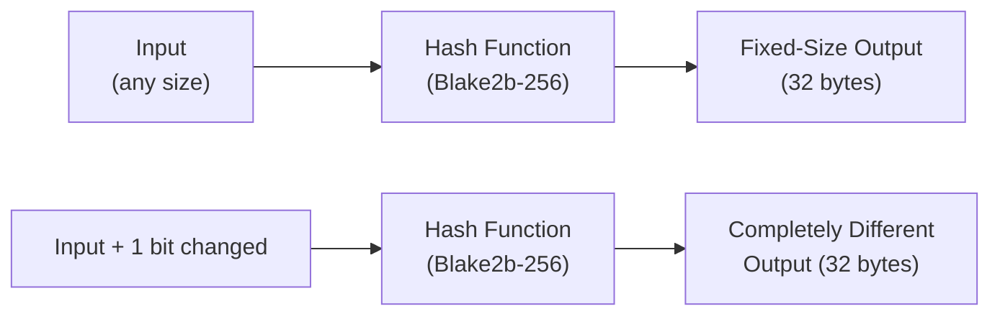
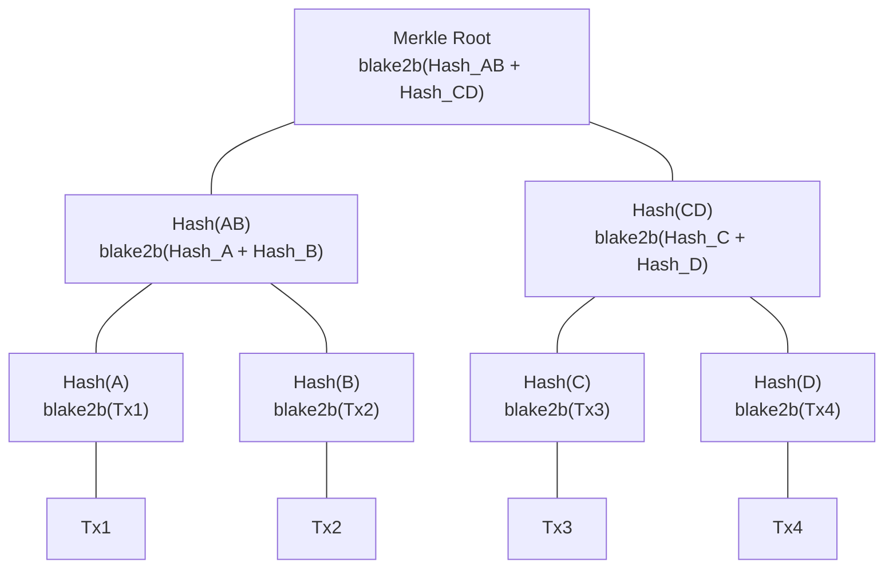
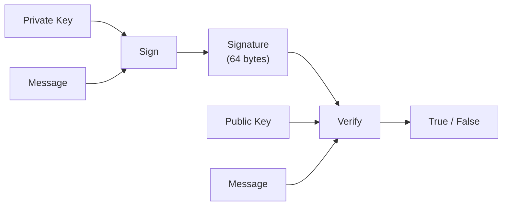

# Bài #02: Các nguyên thủy mật mã

Các nguyên thủy mật mã là các hàm toán học có các thuộc tính đặc biệt khiến việc gian lận trở nên bất khả thi về mặt tính toán, và chúng tạo thành nền tảng bảo mật của mọi giao dịch blockchain. Trong bài trước, chúng ta đã mô tả các thuộc tính blockchain như tính bất biến và khả năng chống giả mạo. Bài học này tiết lộ các công cụ cụ thể thực thi các thuộc tính đó: hàm hash, cây Merkle, và chữ ký số.

Bạn sẽ hiểu không chỉ các nguyên thủy này làm gì, mà còn tại sao Cardano chọn các thuật toán cụ thể (Blake2b, Ed25519) và cách những lựa chọn này ảnh hưởng đến hiệu năng, bảo mật, và trải nghiệm nhà phát triển.

## Hàm hash mật mã là gì?

Hàm hash mật mã nhận đầu vào có kích thước bất kỳ và tạo ra đầu ra có kích thước cố định (gọi là "hash" hay "digest") sao cho cùng một đầu vào luôn tạo ra cùng một đầu ra, nhưng ngay cả một thay đổi nhỏ trong đầu vào cũng tạo ra hash hoàn toàn khác. Hàm hash là khối xây dựng cơ bản nhất trong bảo mật blockchain.



### Hàm hash mật mã cần có những thuộc tính nào?

Không phải mọi hàm hash đều là mật mã. Một hàm hash mật mã phải thỏa mãn các thuộc tính sau:

**1. Tất định**: Cùng một đầu vào luôn tạo ra cùng một đầu ra.
```
hash("Hello, Cardano") = "8a3b2c..." (luôn luôn, mọi lúc, trên mọi máy tính)
```

**2. Kích thước đầu ra cố định**: Bất kể kích thước đầu vào, độ dài đầu ra luôn không đổi.
```
hash("a")                    = "4a3b2c..." (32 byte)
hash("toàn bộ tác phẩm Shakespeare") = "7f2d1e..." (32 byte)
```

**3. Kháng tiền ảnh**: Cho trước một hash đầu ra, việc tìm đầu vào ban đầu là bất khả thi về mặt tính toán. Bạn không thể "đảo ngược" một hash.
```
Cho:  "8a3b2c..."
Tìm:  ??? sao cho hash(???) = "8a3b2c..."
Điều này cần khoảng 2^256 lần thử (nhiều hơn số nguyên tử trong vũ trụ).
```

**4. Kháng tiền ảnh thứ hai**: Cho trước một đầu vào và hash của nó, việc tìm một đầu vào khác tạo ra cùng hash là bất khả thi.
```
Cho:  "Hello, Cardano" -> "8a3b2c..."
Tìm:  đầu_vào_khác sao cho hash(đầu_vào_khác) = "8a3b2c..."
Điều này phải bất khả thi về mặt tính toán.
```

**5. Kháng va chạm**: Việc tìm bất kỳ hai đầu vào khác nhau nào tạo ra cùng hash là bất khả thi.
```
Tìm: đầu_vào_A và đầu_vào_B sao cho đầu_vào_A != đầu_vào_B
     nhưng hash(đầu_vào_A) = hash(đầu_vào_B)
Điều này cần khoảng 2^128 phép tính (giới hạn sinh nhật).
```

**6. Hiệu ứng tuyết lở**: Một thay đổi nhỏ trong đầu vào tạo ra đầu ra khác biệt hoàn toàn.
```
hash("Hello, Cardano")  = "8a3b2c4d..."
hash("Hello, cardano")  = "f17e9a2b..."  (hoàn toàn khác!)
```

### Tại sao Cardano sử dụng Blake2b thay vì SHA-256?

**SHA-256** (Thuật toán Hash An toàn, 256-bit) là hàm hash mà Bitcoin sử dụng. NSA thiết kế nó và NIST chuẩn hóa nó. Nó tạo ra digest 256-bit (32-byte) và đã được nghiên cứu kỹ lưỡng.

**Blake2b** là hàm hash mới hơn mà Cardano sử dụng rộng rãi. Jean-Philippe Aumasson và các đồng nghiệp đã thiết kế nó, dựa trên hàm hash BLAKE (ứng cử viên chung kết cuộc thi SHA-3). Cardano cụ thể sử dụng Blake2b-256 (đầu ra 256-bit) cho hầu hết nhu cầu hash và Blake2b-224 (đầu ra 224-bit) cho việc tạo địa chỉ.

| Thuộc tính | SHA-256 | Blake2b-256 |
|---|---|---|
| **Tốc độ** | Chậm hơn trên phần mềm | Nhanh hơn 2-3 lần trên phần mềm |
| **Biên an toàn** | Đã được thiết lập tốt | Bảo mật tương đương, dựa trên bộ mã hóa dòng ChaCha |
| **Song song hóa** | Cấu trúc nội bộ tuần tự | Được thiết kế cho xử lý song song |
| **Tính linh hoạt** | Cấu hình cố định | Độ dài đầu ra có thể cấu hình, hash có khóa, cá nhân hóa |
| **Tối ưu phần cứng** | Hiệu quả trên ASIC chuyên dụng | Hiệu quả trên CPU đa năng |

Ưu thế tốc độ của Blake2b quan trọng vì hash diễn ra liên tục trong các hoạt động blockchain (xác thực khối, xác minh giao dịch, tính toán địa chỉ). Hash nhanh hơn nghĩa là xác thực nhanh hơn, nghĩa là thông lượng cao hơn.

### Cardano sử dụng hash ở đâu?

Hàm hash xuất hiện ở mọi nơi trong kiến trúc của Cardano:

1. **Hash tiêu đề khối**: Mỗi tiêu đề khối được hash, và digest kết quả được đưa vào tiêu đề của khối tiếp theo. Đây là cách tạo ra chuỗi.

2. **ID giao dịch**: Mỗi giao dịch trên Cardano được xác định bằng hash của nội dung đã tuần tự hóa. ID giao dịch (TxId) là hash Blake2b-256.

3. **Tạo địa chỉ**: Các địa chỉ Cardano được tạo bằng cách hash khóa công khai với Blake2b-224, sau đó mã hóa kết quả.

4. **Hash script**: Các hợp đồng thông minh (bộ xác thực Plutus) được xác định bằng hash mã biên dịch. Hash này trở thành địa chỉ script.

5. **Hash datum**: Dữ liệu đính kèm vào UTXO có thể được lưu trữ dưới dạng hash (datum hash) để tiết kiệm không gian trên chuỗi.

6. **Policy ID**: Các chính sách đúc (minting policy) cho token bản địa được xác định bằng hash của policy script.

```
Transaction                    Block Header
+-----------+                  +--------------------+
| inputs    |                  | block_number       |
| outputs   |  hash(tx) ->     | previous_hash      |
| fee       |  TxId            | merkle_root        |
| metadata  |                  | slot_leader        |
+-----------+                  +--------------------+
                                        |
                               hash(header) -> được đưa vào khối tiếp theo
```

## Cây Merkle cho phép xác minh hiệu quả như thế nào?

Cây Merkle tổ chức các hash giao dịch thành cấu trúc cây nhị phân, trong đó mỗi lá chứa hash của một giao dịch, mỗi nút nội bộ chứa hash của hai nút con, và gốc (được lưu trong tiêu đề khối) đại diện cho tất cả giao dịch trong một dấu vân tay 32 byte duy nhất. Cấu trúc này cho phép chứng minh thành viên trong thời gian logarit.



### Cây Merkle được xây dựng như thế nào?

Giả sử một khối chứa bốn giao dịch: Tx1, Tx2, Tx3, Tx4.

Quy trình xây dựng:

```
Bước 1: Hash từng giao dịch riêng lẻ
  Hash(A) = blake2b(Tx1)
  Hash(B) = blake2b(Tx2)
  Hash(C) = blake2b(Tx3)
  Hash(D) = blake2b(Tx4)

Bước 2: Hash các cặp hash lại với nhau
  Hash(AB) = blake2b(Hash(A) + Hash(B))
  Hash(CD) = blake2b(Hash(C) + Hash(D))

Bước 3: Hash cặp của các cặp
  Merkle Root = blake2b(Hash(AB) + Hash(CD))
```

**Merkle root** là một hash duy nhất đại diện cho tất cả giao dịch trong khối. Nó được lưu trong tiêu đề khối.

### Tại sao cây Merkle quan trọng?

**Xác minh hiệu quả**: Để chứng minh rằng Tx3 nằm trong một khối, bạn không cần tải tất cả giao dịch. Bạn chỉ cần:

```
Chứng minh rằng Tx3 có trong khối:
  - Hash(D)   (nút anh em của hash Tx3)
  - Hash(AB)  (nút anh em của Hash(CD))

Xác minh:
  1. Tính Hash(C) = blake2b(Tx3)
  2. Tính Hash(CD) = blake2b(Hash(C) + Hash(D))
  3. Tính Root = blake2b(Hash(AB) + Hash(CD))
  4. So sánh Root tính được với Merkle Root trong tiêu đề khối
```

Đây gọi là **bằng chứng Merkle** (hay bằng chứng bao hàm Merkle). Với một khối có N giao dịch, bạn chỉ cần log2(N) hash để xác minh tư cách thành viên. Trong một khối có 1.000 giao dịch, bạn chỉ cần khoảng 10 hash thay vì toàn bộ 1.000.

**Phát hiện giả mạo**: Nếu bất kỳ giao dịch nào bị sửa đổi, hash của nó thay đổi, dẫn đến hash nút cha thay đổi, lan truyền lên đến Merkle root. Root trong tiêu đề khối sẽ không còn khớp, ngay lập tức tiết lộ việc giả mạo.

**Hỗ trợ ứng dụng khách nhẹ**: Bằng chứng Merkle cho phép các ví nhẹ không cần lưu trữ toàn bộ blockchain. Một ví nhẹ có thể xác minh rằng một giao dịch cụ thể tồn tại mà không cần tải mọi giao dịch trong mọi khối. Nó chỉ cần tiêu đề khối và đường dẫn bằng chứng Merkle.

### Cardano sử dụng cây Merkle như thế nào?

Cardano sử dụng cây Merkle trong nhiều ngữ cảnh:

- **Xác minh giao dịch**: Merkle root của giao dịch trong mỗi tiêu đề khối cho phép xác minh hiệu quả việc bao hàm giao dịch.
- **Ảnh chụp phân phối tiền cược**: Cây Merkle biểu diễn hiệu quả phân phối tiền cược trên tất cả các địa chỉ tại ranh giới epoch.
- **Dữ liệu script**: Cây Merkle có thể cam kết (commit) các tập dữ liệu lớn trong khi chỉ lưu root trên chuỗi, với bằng chứng ngoài chuỗi cho từng phần tử.

## Chữ ký số chứng minh danh tính như thế nào?

Sơ đồ chữ ký số cho phép ai đó ký một thông điệp bằng khóa riêng tư sao cho bất kỳ ai cũng có thể xác minh chữ ký đó bằng khóa công khai tương ứng. Chữ ký số cung cấp ba đảm bảo: xác thực (chữ ký chứng minh người tạo thông điệp sở hữu khóa riêng tư), toàn vẹn (bất kỳ sửa đổi nào đều làm mất hiệu lực chữ ký), và không thể phủ nhận (người ký không thể phủ nhận đã ký).



### Chữ ký số hoạt động như thế nào về mặt khái niệm?

Một sơ đồ chữ ký số có ba phép toán:

```
Tạo khóa:
  (private_key, public_key) = generate_keypair()
  // private_key: giữ bí mật, dùng để ký
  // public_key: chia sẻ công khai, dùng để xác minh

Ký:
  signature = sign(message, private_key)
  // Chỉ người có private_key mới có thể tạo ra chữ ký này

Xác minh:
  is_valid = verify(message, signature, public_key)
  // Bất kỳ ai có public_key đều có thể xác minh
  // Trả về true nếu chữ ký là xác thực
```

Mối quan hệ toán học giữa các khóa đảm bảo rằng:
- Chỉ người có khóa riêng tư mới có thể tạo ra chữ ký hợp lệ
- Khóa công khai có thể xác minh chữ ký mà không tiết lộ khóa riêng tư
- Chữ ký được gắn với thông điệp cụ thể; nó không thể chuyển sang thông điệp khác

### Tại sao Cardano sử dụng Ed25519?

Cardano sử dụng **Ed25519**, một triển khai của Thuật toán Chữ ký Số đường cong Edwards (EdDSA) sử dụng Curve25519. Daniel J. Bernstein và các đồng nghiệp đã thiết kế Ed25519 với các mục tiêu hiệu năng và bảo mật rõ ràng.

| Thuộc tính | Ed25519 | ECDSA (Bitcoin/Ethereum sử dụng) |
|---|---|---|
| **Kích thước khóa** | 32 byte (riêng tư), 32 byte (công khai) | 32 byte (riêng tư), 33 byte (công khai, nén) |
| **Kích thước chữ ký** | 64 byte | ~72 byte (mã hóa DER) |
| **Tốc độ** | Ký và xác minh rất nhanh | Chậm hơn |
| **Tất định** | Có (cùng thông điệp + khóa = cùng chữ ký) | Yêu cầu nonce ngẫu nhiên (nguồn gốc nhiều lỗi) |
| **Kháng kênh phụ** | Được thiết kế để chống tấn công thời gian | Dễ bị tổn thương nếu triển khai bất cẩn |
| **Xác minh hàng loạt** | Có thể xác minh hàng loạt hiệu quả | Không hỗ trợ natively |

Tính ký tất định của Ed25519 là một lợi thế bảo mật đáng kể. Với ECDSA (được Bitcoin và Ethereum sử dụng), việc ký yêu cầu một số ngẫu nhiên (nonce). Nếu bộ tạo số ngẫu nhiên bị lỗi, khóa riêng tư có thể bị trích xuất từ các chữ ký. Điều này đã gây ra các vụ xâm phạm khóa thực tế. Ed25519 loại bỏ hoàn toàn loại lỗ hổng này bằng cách dẫn xuất nonce một cách tất định từ thông điệp và khóa riêng tư.

### Chữ ký hoạt động trong giao dịch Cardano như thế nào?

Mỗi giao dịch Cardano phải được ký bởi các khóa riêng tư kiểm soát các đầu vào đang được chi tiêu. Dưới đây là luồng khái niệm:

```
1. Xây dựng thân giao dịch:
   TransactionBody {
     inputs:  [utxo_1, utxo_2]
     outputs: [output_to_recipient, change_output]
     fee:     200000 lovelace
   }

2. Tuần tự hóa và hash thân giao dịch:
   tx_body_hash = blake2b_256(serialize(transaction_body))

3. Ký hash bằng mỗi khóa riêng tư cần thiết:
   signature_1 = ed25519_sign(tx_body_hash, private_key_1)
   signature_2 = ed25519_sign(tx_body_hash, private_key_2)

4. Lắp ráp giao dịch hoàn chỉnh:
   Transaction {
     body:       transaction_body
     witnesses:  [
       (public_key_1, signature_1),
       (public_key_2, signature_2)
     ]
   }

5. Gửi lên mạng lưới. Mỗi nút xác minh:
   - ed25519_verify(tx_body_hash, signature_1, public_key_1) == true
   - ed25519_verify(tx_body_hash, signature_2, public_key_2) == true
   - public_key_1 tương ứng với địa chỉ kiểm soát utxo_1
   - public_key_2 tương ứng với địa chỉ kiểm soát utxo_2
```

Lưu ý rằng cái được ký là **hash của thân giao dịch**, không phải giao dịch thô. Điều này hiệu quả hơn (ký hash 32 byte nhanh hơn ký thân giao dịch có thể rất lớn) và đảm bảo rằng chữ ký bao phủ toàn bộ dữ liệu giao dịch thông qua khả năng kháng va chạm của hash.

### Giao dịch đa chữ ký hoạt động như thế nào?

Cardano hỗ trợ sẵn các giao dịch yêu cầu nhiều chữ ký. Điều này thiết yếu cho:

- **Ví chung**: Quỹ yêu cầu sự chấp thuận của nhiều bên
- **Giao dịch đa tài sản**: Khi giao dịch chi tiêu UTXO được kiểm soát bởi các địa chỉ khác nhau
- **Xác thực script**: Khi cần cả chữ ký khóa và thực thi script

Khác với một số blockchain nơi đa chữ ký yêu cầu hợp đồng thông minh, Cardano xử lý điều này ở cấp giao thức. Giao dịch đơn giản bao gồm nhiều mục chứng nhận (witness), và nút xác minh tất cả chúng.

## Các nguyên thủy này kết hợp để tạo bảo mật như thế nào?

Sức mạnh thực sự xuất hiện khi hàm hash, cây Merkle, và chữ ký số làm việc cùng nhau. Mỗi nguyên thủy cung cấp một đảm bảo cụ thể, và sự kết hợp của chúng tạo ra bảo mật phân lớp, tăng cường lẫn nhau, khiến các cuộc tấn công thực tế trở nên bất khả thi.

```
Bước 1: Người dùng tạo giao dịch chi tiêu 50 ADA
  - Thân giao dịch chỉ định đầu vào, đầu ra, và phí
  - Thân được hash: tx_hash = blake2b_256(tx_body)
  - Hash được ký: sig = ed25519_sign(tx_hash, private_key)
  -> Đảm bảo: tính xác thực, toàn vẹn của giao dịch

Bước 2: Giao dịch được đưa vào khối
  - Nhà sản xuất khối thu thập các giao dịch hợp lệ
  - Các hash giao dịch tạo thành lá của cây Merkle
  - Merkle root được đưa vào tiêu đề khối
  -> Đảm bảo: xác minh hiệu quả, phát hiện giả mạo bất kỳ giao dịch nào

Bước 3: Khối được thêm vào chuỗi
  - Tiêu đề khối được hash: block_hash = blake2b_256(header)
  - Khối tiếp theo tham chiếu hash này trong tiêu đề
  -> Đảm bảo: tính bất biến, chống giả mạo trên toàn chuỗi

Bước 4: Chuỗi phát triển
  - Mỗi khối mới tăng cường đảm bảo cho tất cả khối trước đó
  - Để thay đổi một giao dịch lịch sử, kẻ tấn công cần:
    a) Ký lại giao dịch (cần khóa riêng tư)
    b) Tính lại Merkle root cho khối đó
    c) Tính lại hash khối
    d) Tính lại hash mọi khối tiếp theo
    e) Làm tất cả nhanh hơn phần còn lại của mạng lưới thêm khối mới
  -> Hiệu ứng kết hợp: tính bất biến thực tế
```

Hệ thống phòng thủ phân lớp này là lý do blockchain được coi là an toàn. Không nguyên thủy nào một mình làm được việc này. Hàm hash cung cấp tính toàn vẹn và ràng buộc. Cây Merkle cung cấp hiệu quả và cấu trúc. Chữ ký số cung cấp xác thực và ủy quyền. Kết hợp lại, chúng tạo ra hệ thống mà chi phí gian lận vượt quá mọi lợi ích có thể.

## Hàm ngẫu nhiên có thể xác minh (VRF) là gì?

Hàm ngẫu nhiên có thể xác minh (VRF) kết hợp chữ ký số với bộ tạo số ngẫu nhiên: cho trước khóa riêng tư và đầu vào, nó tạo ra đầu ra ngẫu nhiên không thể dự đoán nếu không có khóa riêng tư, cộng với một bằng chứng mà bất kỳ ai có khóa công khai đều có thể xác minh. Giao thức Ouroboros của Cardano sử dụng VRF để xác định stake pool nào tạo mỗi khối.

VRF tạo ra:
1. Một **đầu ra ngẫu nhiên** không thể dự đoán nếu không có khóa riêng tư
2. Một **bằng chứng** rằng đầu ra được tạo chính xác

Trong Ouroboros, VRF xác định stake pool nào được quyền tạo mỗi khối. Số slot là đầu vào, khóa VRF của pool là khóa riêng tư, và đầu ra xác định liệu pool đó "thắng" quyền tạo khối hay không. Điều này làm cho việc chọn nhà sản xuất khối vừa ngẫu nhiên (không thể dự đoán) vừa có thể xác minh (có thể chứng minh), ngăn bất kỳ ai thao túng ai được thêm khối tiếp theo.

Chúng ta sẽ khám phá điều này sâu hơn trong Bài 3 khi đề cập đến các cơ chế đồng thuận.

## Hash bảo mật dữ liệu ngoài chuỗi như thế nào?

Một mô hình phổ biến trong phát triển Cardano là lưu hash của dữ liệu lớn trên chuỗi trong khi giữ dữ liệu đầy đủ ngoài chuỗi. Điều này cung cấp khả năng xác minh mà không làm phình blockchain: bất kỳ ai cũng có thể tải dữ liệu ngoài chuỗi và xác nhận nó khớp với hash trên chuỗi.

```
Ngoài chuỗi:                     Trên chuỗi:
+-------------------+            +---------------------------+
| Tài liệu lớn     |            | Siêu dữ liệu giao dịch:  |
| (PDF, JSON, v.v.) |  hash ->   |   document_hash: "7f2d..."  |
| Lưu trên IPFS     |            |   ipfs_cid: "Qm..."      |
+-------------------+            +---------------------------+

Bất kỳ ai cũng có thể xác minh:
  blake2b_256(tài_liệu_đã_tải) == hash_trên_chuỗi
  Nếu khớp, tài liệu là xác thực và chưa bị sửa đổi.
```

Mô hình này được sử dụng cho:
- **Siêu dữ liệu NFT**: Tệp hình ảnh hoặc phương tiện thực tế được lưu ngoài chuỗi (thường trên IPFS), nhưng hash của nó được cam kết trên chuỗi.
- **Đề xuất quản trị**: Văn bản đề xuất đầy đủ nằm ngoài chuỗi; hash neo nó vào chuỗi.
- **Dấu vết kiểm toán**: Chuỗi hash có thể chứng minh thứ tự và tính toàn vẹn của các sự kiện ngoài chuỗi.
- **Tiêu chuẩn token CIP-25 / CIP-68**: Xác định cách hash siêu dữ liệu liên quan đến tài sản token.

## So sánh với Web2

Mọi nguyên thủy mật mã trong bài học này đều có đối phần web2. Sự khác biệt nằm ở phạm vi và đảm bảo.

| Nguyên thủy Blockchain | Tương đương Web2 | Khác biệt chính |
|---|---|---|
| **Hash Blake2b** | bcrypt/argon2 cho lưu mật khẩu | Hash blockchain là để đảm bảo tính toàn vẹn, không phải bí mật. Mật khẩu cần hash chậm; blockchain cần hash nhanh |
| **ID giao dịch (hash)** | Lưu trữ định địa chỉ nội dung (SHA commit Git) | Cùng khái niệm: nội dung quyết định danh tính |
| **Cây Merkle** | Cây hash trong BitTorrent / đối tượng cây Git | Cây Merkle blockchain quan trọng cho đồng thuận và có thể xác minh công khai |
| **Bằng chứng Merkle** | Nhật ký minh bạch chứng chỉ (CT log) | Cả hai đều chứng minh bao hàm mà không tiết lộ toàn bộ tập dữ liệu |
| **Chữ ký Ed25519** | Ký JWT RS256/ES256 | JWT ký xác nhận cho máy chủ xác minh; blockchain ký giao dịch cho toàn mạng lưới xác minh |
| **VRF** | Tạo số ngẫu nhiên phía máy chủ | VRF có thể xác minh bởi bất kỳ ai; `Math.random()` thì không |
| **Hash dữ liệu ngoài chuỗi** | Tiêu đề HTTP ETag / Content-MD5 | Cùng khái niệm toàn vẹn, nhưng hash blockchain là vĩnh viễn và có thể xác minh toàn cầu |

**Phép so sánh JWT đặc biệt hữu ích.** Khi bạn tạo JWT:
1. Bạn lấy payload (các xác nhận về người dùng)
2. Bạn ký nó bằng khóa riêng tư (RS256, ES256, hoặc tương tự)
3. Bất kỳ ai có khóa công khai đều có thể xác minh chữ ký
4. Sửa đổi payload làm mất hiệu lực chữ ký

Giao dịch Cardano tuân theo đúng mô hình đó:
1. Bạn lấy payload (thân giao dịch)
2. Bạn ký nó bằng khóa riêng tư (Ed25519)
3. Bất kỳ ai có khóa công khai (bất kỳ nút nào) đều có thể xác minh chữ ký
4. Sửa đổi thân giao dịch làm mất hiệu lực chữ ký

Sự khác biệt là xác minh JWT diễn ra trên một máy chủ duy nhất bạn kiểm soát, trong khi xác minh chữ ký Cardano diễn ra trên hàng ngàn nút độc lập trên toàn thế giới.

**Tổng kiểm tra nội dung** là một khái niệm quen thuộc khác. Khi bạn tải tệp và xác minh tổng kiểm tra SHA-256, bạn đang làm chính xác những gì nút Cardano làm khi xác minh hash giao dịch. Nguyên lý giống hệt nhau; quy mô và mô hình tin cậy là khác.

## Điểm chính cần nhớ

- **Hàm hash** (Blake2b trên Cardano) tạo ra các dấu vân tay kích thước cố định duy nhất của dữ liệu. Chúng là nền tảng của xác minh tính toàn vẹn, ID giao dịch, địa chỉ, và chính cấu trúc chuỗi.
- **Cây Merkle** tổ chức hash thành cấu trúc phân cấp cho phép xác minh hiệu quả theo thời gian logarit cho từng giao dịch trong một khối, và thiết yếu cho ứng dụng khách nhẹ.
- **Chữ ký số** (Ed25519 trên Cardano) chứng minh rằng giao dịch đã được ủy quyền bởi người nắm giữ khóa riêng tư tương ứng, cung cấp xác thực, toàn vẹn, và không thể phủ nhận.
- **Các nguyên thủy này kết hợp** tạo ra bảo mật phân lớp: chữ ký ủy quyền giao dịch, cây Merkle tổ chức chúng thành khối, và chuỗi hash liên kết các khối thành lịch sử bất biến.
- **Cardano chọn Blake2b và Ed25519** vì hiệu năng, bảo mật, và tính tất định; những lựa chọn ảnh hưởng đến thông lượng giao dịch và trải nghiệm nhà phát triển.

## Tiếp theo là gì

Với hàm hash, cây Merkle, và chữ ký số trong bộ công cụ, bạn giờ đã hiểu các đảm bảo bảo mật toán học của từng khối và giao dịch riêng lẻ. Nhưng ai quyết định khối nào được thêm tiếp? Làm thế nào hàng ngàn nút độc lập đồng thuận trên cùng một chuỗi? Bài 3 giải quyết các cơ chế đồng thuận: bộ quy tắc cấp giao thức phối hợp toàn bộ mạng lưới, với phân tích sâu về giao thức Ouroboros của Cardano.
