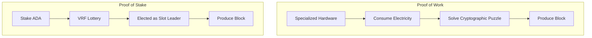
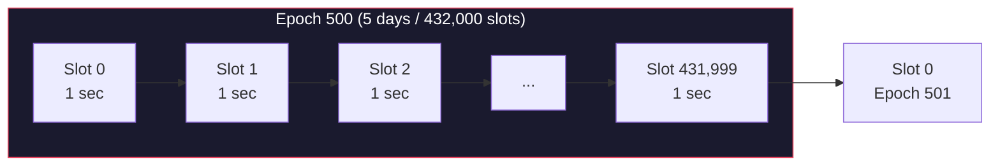
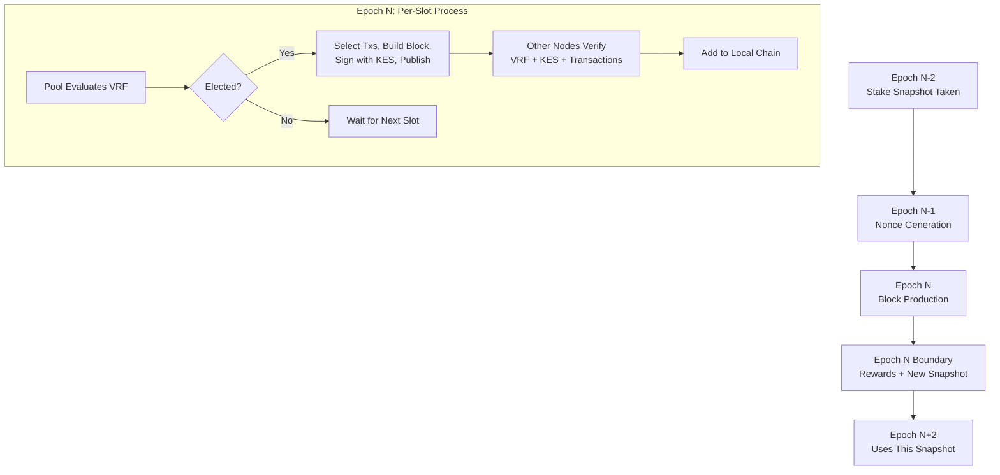

# Bài #03: Cơ chế đồng thuận

Cơ chế đồng thuận là bộ quy tắc cấp giao thức cho phép hàng ngàn nút độc lập đồng thuận trên một chuỗi chính thức duy nhất mà không cần bất kỳ bên điều phối trung tâm nào. Chúng ta đã xác lập rằng blockchain là sổ cái phân tán và các nguyên thủy mật mã bảo mật từng giao dịch và khối riêng lẻ. Bài học này trả lời câu hỏi quan trọng còn lại: khi nhiều nút đề xuất các khối khác nhau cùng lúc, mạng lưới quyết định khối nào trở thành phần của chuỗi như thế nào?

Chúng ta sẽ xem xét cách đồng thuận hoạt động, so sánh hai phương pháp tiếp cận chủ đạo (Proof of Work và Proof of Stake), và phân tích chi tiết giao thức Ouroboros của Cardano, hệ thống Proof of Stake đầu tiên được chứng minh an toàn.

## Tại sao đồng thuận lại khó trong hệ thống phân tán?

Đồng thuận khó vì các nút phân tán có cái nhìn khác nhau về các giao dịch đang chờ, đối mặt với độ trễ mạng, có thể ngoại tuyến, và một số có thể hành động ác ý, nhưng tất cả phải đồng thuận trên một sự thật duy nhất mà không có bên điều phối trung tâm. Trong hệ thống tập trung, một máy chủ quyết định và mọi người chấp nhận. Nếu không có quyền hạn đó, vấn đề trở nên căn bản.

Hãy xem xét kịch bản này:

```
Thời gian: Slot 7.241.000

Node A (ở Tokyo) nhận các giao dịch [T1, T2, T3]
Node B (ở New York) nhận các giao dịch [T2, T4, T5]
Node C (ở Berlin) nhận các giao dịch [T1, T4, T6]

Mỗi nút có cái nhìn khác nhau về các giao dịch đang chờ.
Giao dịch nào sẽ vào khối tiếp theo?
Ai quyết định?
Nếu Node B là độc hại và ngụy tạo T5 thì sao?
```

Mạng lưới phải đồng thuận về:
1. **Ai** được quyền tạo khối tiếp theo
2. **Những gì** giao dịch nào vào khối đó
3. **Khi nào** khối được coi là chung cuộc (không thể đảo ngược)

Và phải làm điều này bất chấp:
- Độ trễ mạng (tin nhắn cần thời gian để truyền bá toàn cầu)
- Lỗi nút (một số nút có thể ngoại tuyến)
- Tác nhân độc hại (một số nút có thể cố tình phá hoại mạng lưới)
- Không có bên điều phối trung tâm

## Proof of Work (PoW) đạt được đồng thuận như thế nào?

Proof of Work đạt được đồng thuận bằng cách yêu cầu nhà sản xuất khối giải một bài toán mật mã tốn kém về tính toán trước khi có thể thêm khối. Thợ đào đầu tiên tìm ra lời giải hợp lệ "thắng" quyền tạo khối tiếp theo, và chi phí tính toán khiến các cuộc tấn công trở nên phi lý về kinh tế.

### PoW hoạt động như thế nào

Trong PoW, việc tạo khối yêu cầu tìm một giá trị (gọi là **nonce**) sao cho hash của tiêu đề khối nằm dưới ngưỡng mục tiêu.

```
Tìm nonce sao cho:
  hash(block_header + nonce) < target

Ví dụ (đơn giản hóa):
  target = 0000000000FFFFFFFFFFFFFFFFFFFF...

  Thử nonce = 0: hash = "7a4f2c..." -- quá cao
  Thử nonce = 1: hash = "b31e8a..." -- quá cao
  Thử nonce = 2: hash = "1d7f3b..." -- quá cao
  ...
  Thử nonce = 8.294.712: hash = "0000000000a3f..." -- dưới ngưỡng!
```

Quá trình này được gọi là **đào** (mining). Nó đòi hỏi nỗ lực tính toán khổng lồ (hàng nghìn tỷ lần thử hash) nhưng xác minh thì tức thì (tính một hash, kiểm tra xem nó có dưới ngưỡng không). Độ khó điều chỉnh sao cho toàn mạng lưới tìm ra lời giải khoảng mỗi 10 phút (đối với Bitcoin).

### Điểm mạnh và điểm yếu của PoW là gì?

**Mô hình bảo mật**: Để tấn công PoW, bạn cần sức mạnh tính toán lớn hơn phần còn lại của mạng lưới cộng lại ("tấn công 51%"). Chi phí tập hợp lượng phần cứng và điện năng đó khiến các cuộc tấn công trở nên phi lý về kinh tế cho các chuỗi đã thiết lập.

**Tiêu thụ năng lượng**: PoW cố tình lãng phí. Ngân sách bảo mật CHÍNH LÀ điện năng tiêu thụ. Tiêu thụ năng lượng hàng năm của Bitcoin sánh ngang với các quốc gia cỡ trung. Đây không phải lỗi; đó là chi phí của bảo mật không cần tin cậy. Nhưng đây là nhược điểm đáng kể.

**Tập trung phần cứng**: PoW thưởng cho phần cứng chuyên dụng (ASIC). Điều này dẫn đến tập trung khai thác ở các khu vực có điện giá rẻ và gần nhà sản xuất phần cứng đào, làm suy yếu mục tiêu phi tập trung.

**Tính chung cuộc**: PoW cung cấp **tính chung cuộc xác suất**. Một giao dịch không bao giờ "chung cuộc" về mặt toán học; nó chỉ trở nên cực kỳ khó bị đảo ngược khi thêm nhiều khối phía trên. Quy ước Bitcoin coi 6 xác nhận (khoảng 60 phút) là "đủ an toàn."

## Proof of Stake (PoS) khác Proof of Work như thế nào?

Proof of Stake thay thế công việc tính toán bằng cam kết kinh tế: thay vì chứng minh bạn đã tiêu tốn điện, bạn chứng minh bạn nắm giữ (và đã stake) tiền tệ gốc của mạng lưới. Quyền tạo khối tỷ lệ thuận với lượng tiền điện tử bạn stake, khiến mô hình bảo mật là "tấn công tốn tiền" thay vì "tấn công tốn điện."



Nếu bạn nắm giữ 1% tổng số token đã stake, bạn sẽ tạo khoảng 1% khối.

Mô hình bảo mật chuyển từ "tấn công tốn điện" sang "tấn công tốn tiền." Để kiểm soát mạng lưới, kẻ tấn công cần mua phần lớn token đã stake. Việc mua nhiều token như vậy đẩy giá lên rất cao, và nếu bạn tấn công mạng lưới, giá trị token bạn nắm giữ sẽ sụp đổ. Tấn công hệ thống PoS là hành vi tự hủy hoại về mặt kinh tế.

### So sánh PoW và PoS

| Thuộc tính | Proof of Work (Bitcoin) | Proof of Stake (Cardano) |
|---|---|---|
| **Tài nguyên tiêu thụ** | Điện + phần cứng | Tiền điện tử đã stake |
| **Chọn nhà sản xuất khối** | Người đầu tiên giải bài toán | Giao thức chọn dựa trên tiền cược |
| **Hiệu quả năng lượng** | Rất thấp (có chủ đích) | Rất cao (giảm 99,9%+) |
| **Yêu cầu phần cứng** | ASIC chuyên dụng | Phần cứng máy chủ tiêu chuẩn |
| **Rào cản gia nhập** | Cao (phần cứng đắt) | Thấp hơn (stake ADA, ủy quyền) |
| **Chi phí tấn công** | 51% sức mạnh hash | 51% ADA đã stake |
| **Tính chung cuộc** | Xác suất (~60 phút) | Xác suất (~5-10 phút trên Cardano) |
| **Áp lực phi tập trung** | Tập trung về điện rẻ | Thiết kế Cardano khuyến khích phân phối |

## Giao thức Ouroboros của Cardano là gì?

Ouroboros là giao thức đồng thuận của Cardano và là giao thức Proof of Stake đầu tiên có chứng minh bảo mật nghiêm ngặt qua bình duyệt. Được xuất bản lần đầu bởi Aggelos Kiayias, Alexander Russell, Bernardo David, và Roman Oliynykov tại CRYPTO 2017, nó chia thời gian thành epoch và slot, sử dụng VRF để bầu slot leader riêng tư, và cung cấp đảm bảo bảo mật có thể chứng minh dưới giả định rằng các bên trung thực kiểm soát đa số ADA đã stake.

Tên "Ouroboros" xuất phát từ biểu tượng cổ đại của con rắn ăn đuôi mình, đại diện cho bản chất tuần hoàn của giao thức.

### Ouroboros đã phát triển như thế nào?

Ouroboros không phải một giao thức đơn lẻ mà là một họ giao thức:

| Phiên bản | Kỷ nguyên | Đổi mới chính |
|---|---|---|
| **Ouroboros Classic** | Nghiên cứu | PoS đầu tiên được chứng minh an toàn; giả định đồng hồ đồng bộ |
| **Ouroboros BFT** | Khởi động lại Byron | Biến thể BFT đơn giản hóa cho chuyển đổi Byron-sang-Shelley |
| **Ouroboros Praos** | Shelley (hiện tại) | Thêm VRF cho bầu leader riêng tư; mô hình mạng bán đồng bộ |
| **Ouroboros Genesis** | Đang phát triển | Cho phép khởi động an toàn từ genesis; không cần checkpoint tin cậy |
| **Ouroboros Leios** | Nghiên cứu | Bộ chứng thực đầu vào cho tăng thông lượng đáng kể |

Mainnet Cardano hiện tại chạy **Ouroboros Praos**. Phần còn lại của bài học tập trung vào Praos.

### Epoch và slot cấu trúc thời gian trong Ouroboros như thế nào?

Ouroboros chia thời gian thành cấu trúc phân cấp: **slot** (mỗi slot 1 giây) được nhóm thành **epoch** (432.000 slot, kéo dài đúng 5 ngày). Epoch đóng vai trò ranh giới quản trị cho ảnh chụp tiền cược, phân phối phần thưởng, thay đổi tham số giao thức, và đăng ký pool.



**Slot**: Đơn vị thời gian nhỏ nhất. Trên Cardano, mỗi slot là **1 giây**. Một slot có thể có hoặc không có khối. Không phải slot nào cũng tạo khối; mục tiêu là khoảng một khối mỗi 20 giây.

**Epoch**: Tập hợp 432.000 slot, kéo dài đúng **5 ngày**. Epoch là ranh giới quản trị cho nhiều hoạt động giao thức:
- Ảnh chụp tiền cược được thực hiện tại ranh giới epoch
- Phần thưởng được tính toán và phân phối mỗi epoch
- Thay đổi tham số giao thức có hiệu lực tại ranh giới epoch
- Đăng ký và nghỉ hưu stake pool có hiệu lực tại ranh giới epoch

### Bầu slot leader hoạt động như thế nào?

Với mỗi slot, giao thức xác định liệu có **slot leader** hay không và ai là slot leader bằng Hàm ngẫu nhiên có thể xác minh (VRF từ Bài 2). Mỗi nhà điều hành stake pool đánh giá VRF cục bộ; kết quả là riêng tư cho đến khi pool công bố khối với bằng chứng VRF.

Mỗi nhà điều hành stake pool có khóa VRF. Với mỗi slot, pool chạy hàm VRF:

```
Với slot S trong epoch E:
  (vrf_output, vrf_proof) = VRF_eval(pool_vrf_key, epoch_nonce + slot_number)

  threshold = calculate_threshold(pool_stake / total_stake)

  if vrf_output < threshold:
    Pool này LÀ slot leader cho slot S
    // Pool có thể (và nên) tạo khối
  else:
    Pool này KHÔNG PHẢI slot leader cho slot S
    // Không có gì để làm cho slot này
```

Các thuộc tính quan trọng của bầu cử này:

**Riêng tư**: Pool biết nó thắng slot, nhưng không ai khác biết cho đến khi pool công bố khối với bằng chứng VRF. Điều này ngăn các cuộc tấn công nhắm mục tiêu vào leader sắp tới.

**Tỷ lệ**: Ngưỡng được điều chỉnh dựa trên tiền cược tương đối của pool. Pool có 1% tiền cược sẽ được bầu cho khoảng 1% slot.

**Có thể xác minh**: Khi khối được công bố, bằng chứng VRF cho phép bất kỳ ai xác minh rằng pool đã được bầu hợp pháp cho slot đó.

**Có thể có nhiều leader**: Trong một số slot, không có pool nào được bầu (không tạo khối). Trong slot khác, nhiều pool được bầu đồng thời. Giao thức xử lý cả hai trường hợp một cách linh hoạt thông qua quy tắc chọn chuỗi.

### Cơ chế ảnh chụp tiền cược hoạt động như thế nào?

Tiền cược dùng cho bầu leader không phải tiền cược hiện tại; nó là **ảnh chụp** từ hai epoch trước. Độ trễ hai epoch này ngăn kẻ tấn công nhanh chóng mua tiền cược và ngay lập tức sử dụng nó để ảnh hưởng đến sản xuất khối.

```
Epoch 500 (hiện tại):
  Sản xuất khối sử dụng ảnh chụp tiền cược từ Epoch 498

Tại sao có độ trễ?
  - Ảnh chụp Epoch 498: xác định tại ranh giới 497/498
  - Epoch 499: nonce được tính toán sử dụng ảnh chụp này
  - Epoch 500: khối được tạo sử dụng tiền cược của 498 và nonce của 499
```

Kẻ tấn công cần giữ tiền cược ít nhất hai epoch đầy đủ (10 ngày) trước khi nó trở nên "hoạt động" cho mục đích đồng thuận.

Đối với người ủy quyền, điều này có nghĩa: khi bạn ủy quyền ADA cho stake pool, ủy quyền có hiệu lực hai epoch sau ảnh chụp. Từ thời điểm ủy quyền, thường phải chờ 15-20 ngày trước khi tiền cược của bạn đóng góp vào sản xuất khối và bạn bắt đầu nhận phần thưởng.

### Chọn chuỗi hoạt động như thế nào khi xảy ra phân nhánh?

Khi tồn tại nhiều chuỗi hợp lệ (vì nhiều pool được bầu cho cùng slot, hoặc do độ trễ mạng), các nút tuân theo **quy tắc chuỗi dài nhất**: chúng chấp nhận chuỗi có nhiều khối nhất. Chính xác hơn, Ouroboros Praos sử dụng mật độ chuỗi trong các slot gần nhất để phân biệt.

```
Chain A: [B100] -- [B101] -- [B102] -- [B103]
Chain B: [B100] -- [B101'] -- [B102']

Nút thấy cả hai chuỗi. Chain A có 4 khối, Chain B có 3.
Nút chấp nhận Chain A.
```

Chuỗi tạo nhiều khối hơn trong cửa sổ gần đây được ưu tiên, vì nó cho thấy sự hỗ trợ mạnh hơn từ tiền cược trung thực.

Các khối trên nhánh bị bỏ sẽ bị loại bỏ, và giao dịch của chúng quay về mempool. Đây là lý do giao dịch Cardano cần vài xác nhận khối trước khi được coi là đã ổn định; có một cửa sổ nhỏ mà khối có thể thuộc nhánh bị bỏ.

### Truyền bá và phân phối khối hoạt động như thế nào?

Khi slot leader tạo khối, nó phải đến tất cả các nút khác nhanh chóng. Cardano sử dụng mạng lưới **ngang hàng có cấu trúc (P2P)** cho việc này:

```
Block Producer       Relay Layer          Other Nodes
     |                   |                     |
     | --- new block --> |                     |
     |                   | --- forward ------> |
     |                   | --- forward ------> |
     |                   | --- forward ------> |
     |                   |                     |
```

Thời gian truyền bá khối rất quan trọng. Nếu khối không đến các nút khác trong vài giây, nó có nguy cơ bị mồ côi (leader khác trong slot gần tạo khối cạnh tranh truyền bá nhanh hơn). Cardano nhắm đến truyền bá khối trong **5 giây** trên toàn mạng lưới toàn cầu.

### Tham số bảo mật k là gì?

Tham số giao thức **k** (hiện được đặt là 2160 trên mainnet) xác định ngưỡng bảo mật: một khối được coi là **đã ổn định** (cực kỳ khó bị hoàn tác) khi k khối đã được tạo sau nó. Với Cardano tạo khoảng một khối mỗi 20 giây, k = 2160 tương đương khoảng 12 giờ.

Trong thực tế, hầu hết ứng dụng coi giao dịch là "an toàn" sau ít xác nhận hơn nhiều. Vài phút (10-20 khối) cung cấp độ tin cậy rất cao cho các giao dịch thông thường. Tham số k xác định giới hạn toán học tuyệt đối.

### Phần thưởng và động lực thúc đẩy phi tập trung như thế nào?

Ouroboros khuyến khích hành vi trung thực thông qua hệ thống phần thưởng được thiết kế với các thuộc tính lý thuyết trò chơi cụ thể. Mỗi epoch, giao thức phân phối phần thưởng từ phí giao dịch và mở rộng tiền tệ (ADA mới được tạo từ kho dự trữ) cho các nhà điều hành stake pool và người ủy quyền.

Phần thưởng được phân phối cho:
- **Nhà điều hành stake pool**: Nhận chi phí cố định cộng phần trăm lợi nhuận
- **Người ủy quyền**: Nhận phần còn lại, tỷ lệ với tiền cược

Công thức phần thưởng tạo ra trạng thái cân bằng tự nhiên:

```
Kích thước pool mong muốn = 1 / k0  (k0 là số pool mục tiêu, hiện tại 500)

Nếu pool phát triển vượt quá kích thước mong muốn:
  - Phần thưởng cho pool đó bị GIỚI HẠN
  - Tiền cược dư thừa KHÔNG kiếm thêm phần thưởng
  - Người ủy quyền được khuyến khích chuyển sang pool nhỏ hơn

Kết quả: Cân bằng tự nhiên hướng tới ~500 pool có kích thước đồng đều
```

Điều này tạo ra cân bằng Nash, nơi người ủy quyền hợp lý phân bổ tiền cược trên nhiều pool, tự nhiên duy trì phi tập trung. Đây là một trong những đặc điểm thiết kế thanh lịch nhất của Cardano; phi tập trung không được thực thi bằng quy tắc mà xuất hiện từ động lực kinh tế.

### Cơ chế pledge chống tấn công Sybil như thế nào?

Nhà điều hành pool có thể **pledge** (cam kết) ADA của chính họ cho pool, và pledge cao hơn dẫn đến phần thưởng cao hơn một chút. Điều này đóng vai trò cơ chế kháng Sybil vì việc tạo nhiều pool nhỏ (tấn công Sybil) kém sinh lời hơn việc vận hành một pool có pledge tốt.

- Pledge thể hiện cam kết dài hạn; nhà điều hành có giá trị thực tại đặt cược
- Nó tăng chi phí tấn công hệ thống thông qua phát sinh pool

## Tính chung cuộc hoạt động trên Cardano như thế nào?

Cardano cung cấp **tính chung cuộc xác suất**, nghĩa là xác suất giao dịch bị đảo ngược giảm theo hàm mũ với mỗi khối mới được thêm sau nó. Tính chung cuộc thực tế (độ tin cậy cực kỳ cao) đạt được trong 5 đến 10 phút; giới hạn bảo mật toán học đạt được tại k = 2160 khối (khoảng 12 giờ).

```
Số xác nhận  |  Xác suất đảo ngược (xấp xỉ)
      1       |  Đáng kể (có thể trong tranh slot)
      5       |  Rất khó xảy ra
     20       |  Nhỏ không đáng kể cho hầu hết mục đích
    100       |  Gần như không thể
   2160 (k)   |  Bị ràng buộc toán học bởi chứng minh bảo mật
```

Để so sánh, tính chung cuộc trên các mạng lưới:

| Mạng lưới | Tính chung cuộc thông thường | Cơ chế |
|---|---|---|
| Bitcoin (PoW) | ~60 phút (6 khối) | Xác suất, dựa trên sức mạnh hash |
| Ethereum (PoS) | ~15 phút (2 epoch) | Tất định sau khi chung cuộc hóa |
| Cardano (Ouroboros Praos) | ~5-10 phút thực tế, ~12 giờ giới hạn toán học | Xác suất, dựa trên tiền cược |
| Solana | ~13 giây | Lạc quan với khả năng hoàn tác |

Cardano đang nghiên cứu **tính chung cuộc nhanh hơn** thông qua nghiên cứu các giao thức Ouroboros bao gồm cơ chế chung cuộc hóa tường minh, sẽ cung cấp tính chung cuộc tất định bổ sung cho các đảm bảo xác suất hiện có.

## Điều gì xảy ra trong một epoch hoàn chỉnh?

Một epoch tuân theo vòng đời có cấu trúc: ảnh chụp tiền cược từ hai epoch trước xác định sản xuất khối, bầu leader dựa trên VRF diễn ra mỗi slot, khối được tạo và truyền bá, và tại ranh giới epoch giao thức tính phần thưởng, lấy ảnh chụp mới, và xử lý các thay đổi trong hàng đợi.



Dưới đây là mô tả chi tiết:

```
Epoch N-2: Lấy ảnh chụp tiền cược
  - Ghi lại lượng ADA trong mỗi địa chỉ stake
  - Ghi lại tất cả ủy quyền pool
  - Ảnh chụp này được lưu trữ và trở thành "tiền cược hoạt động" cho Epoch N

Epoch N-1: Tạo nonce
  - Đầu ra VRF từ các nhà sản xuất khối đóng góp vào epoch nonce
  - Nonce này sẽ được sử dụng cho bầu leader trong Epoch N

Epoch N: Sản xuất khối
  - Với mỗi slot trong 432.000 slot:
    a) Mỗi pool đánh giá VRF để kiểm tra xem nó có phải slot leader
    b) Nếu được bầu, pool:
       - Chọn giao dịch từ mempool
       - Xây dựng khối (tuân thủ giới hạn kích thước)
       - Ký khối bằng khóa KES
       - Công bố khối với bằng chứng VRF
    c) Các nút khác:
       - Nhận khối
       - Xác minh bằng chứng VRF (pool có được bầu hợp pháp?)
       - Xác minh chữ ký KES
       - Xác minh tất cả giao dịch trong khối
       - Thêm khối vào chuỗi cục bộ

Ranh giới Epoch N:
  - Tính phần thưởng cho tất cả pool và người ủy quyền
  - Phân phối phần thưởng (xuất hiện trong tài khoản phần thưởng)
  - Lấy ảnh chụp tiền cược mới (sử dụng trong Epoch N+2)
  - Áp dụng các thay đổi tham số giao thức trong hàng đợi
  - Xử lý đăng ký và nghỉ hưu pool
```

### Khóa KES là gì và tại sao chúng quan trọng?

Khóa **Key-Evolving Signature (KES)** là cơ chế bảo mật tiến (forward-security) đặc trưng của Ouroboros. Khóa KES tiến hóa theo khoảng thời gian đều đặn (mỗi 36 giờ trên Cardano), và sau khi tiến hóa, vật liệu khóa cũ bị xóa.

Điều này có nghĩa:

- Nếu kẻ tấn công xâm phạm khóa KES của pool, họ chỉ có thể giả mạo khối từ thời điểm đó trở đi, không thể hồi tố
- Nhà điều hành pool có thể tạo khóa KES mới từ khóa lạnh, thu hồi khóa bị xâm phạm
- Các khối lịch sử vẫn hợp lệ vì chúng được ký bằng phiên bản khóa tồn tại tại thời điểm đó

Điều này tương tự như chứng chỉ TLS ngắn hạn tự động xoay vòng, nhưng áp dụng cho sản xuất khối.

## Các cuộc tấn công phổ biến vào đồng thuận và cách phòng thủ?

Hiểu đồng thuận có nghĩa là hiểu cách nó có thể bị tấn công:

**Tấn công 51%**: Mua phần lớn tiền cược để kiểm soát sản xuất khối.
- Phòng thủ: Chi phí khổng lồ (mua phần lớn ADA), và thành công hủy hoại giá trị tài sản của kẻ tấn công.

**Nothing-at-Stake**: Trong PoS ngây thơ, việc tạo khối trên nhiều nhánh đồng thời không tốn gì, có thể ngăn đồng thuận.
- Phòng thủ: Bầu cử dựa trên VRF của Ouroboros khiến chiến lược này không sinh lời. Chứng minh bảo mật chính thức của giao thức giải quyết trực tiếp vấn đề này.

**Tấn công tầm xa**: Tạo chuỗi thay thế bắt đầu từ quá khứ xa.
- Phòng thủ: Cơ chế ảnh chụp tiền cược (độ trễ 2 epoch) giới hạn kẻ tấn công có thể quay lại bao xa. Ouroboros Genesis (sắp tới) giải quyết hoàn toàn vấn đề này.

**Tấn công xay**: Thao túng tính ngẫu nhiên dùng cho bầu leader.
- Phòng thủ: Epoch nonce được dẫn xuất từ đầu ra VRF của nhiều khối, khiến bất kỳ tác nhân đơn lẻ nào cũng không thể kiểm soát.

## So sánh với Web2

Các cơ chế đồng thuận có các tương đương trực tiếp trong hệ thống phân tán bạn có thể đã biết:

| Đồng thuận Blockchain | Tương đương Web2 | Khác biệt chính |
|---|---|---|
| **Bầu slot leader** | Bầu leader Raft | Nút Raft được tin cậy; slot leader không được tin cậy và được xác minh |
| **Cấu trúc epoch** | Khoảng cron job / cửa sổ bảo trì | Epoch được thực thi bởi giao thức, không phải lên lịch quản trị |
| **Bỏ phiếu theo tiền cược** | Cân bằng tải round-robin có trọng số | Tiền cược đại diện cam kết kinh tế, không chỉ năng lực |
| **Chọn chuỗi (chuỗi dài nhất)** | Truyền bá DNS (nhất quán cuối cùng) | Chọn chuỗi là tất định; DNS có thể bị chia não |
| **Truyền bá khối** | Vô hiệu hóa cache CDN | Cả hai phải đến tất cả nút nhanh; blockchain thêm xác minh mật mã |
| **Tính chung cuộc (~20 khối)** | Độ trễ sao chép cơ sở dữ liệu | Tính chung cuộc blockchain là về đảm bảo bảo mật, không chỉ độ mới dữ liệu |
| **Phần thưởng/động lực** | Chia sẻ doanh thu / chương trình liên kết | Được thực thi bởi giao thức, không phải hợp đồng |

**Phép so sánh Raft/Paxos đáng được mở rộng.** Trong cơ sở dữ liệu phân tán (CockroachDB, etcd, Consul), giao thức đồng thuận Raft bầu leader để sắp xếp tất cả ghi. Nếu leader thất bại, bầu cử mới diễn ra. Điều này rất giống Ouroboros:

- **Bầu leader Raft** tương ứng **chọn slot leader**
- **Mục nhật ký Raft** tương ứng **khối**
- **Nhiệm kỳ Raft** tương ứng **epoch**
- **Heartbeat Raft** tương ứng **truyền bá khối**

Khác biệt quan trọng: Raft giả định tất cả nút đều trung thực (chịu lỗi sập). Ouroboros giả định một số nút là độc hại (chịu lỗi Byzantine). Đây là lý do Ouroboros cần VRF, bầu cử theo tiền cược, và chứng minh bảo mật chính thức; nó giải quyết bài toán khó hơn nghiêm ngặt.

**Sao chép cơ sở dữ liệu** là một phép so sánh hữu ích khác. Trong thiết lập sao chép streaming PostgreSQL, nút chính ghi các mục WAL (Write-Ahead Log), và bản sao áp dụng chúng. Có độ trễ sao chép; bản sao hơi chậm hơn nút chính. Điều này tương tự khối truyền bá qua mạng lưới. Khác biệt là blockchain không có "nút chính"; leader thay đổi mỗi slot.

## Điểm chính cần nhớ

- **Đồng thuận là cách các nút phân tán đồng thuận trên một chuỗi duy nhất** mà không cần cơ quan trung ương. Nó phải chịu được độ trễ mạng, lỗi nút, và tác nhân độc hại.
- **Proof of Work** (Bitcoin) bảo mật mạng lưới thông qua chi phí tính toán. Nó hoạt động nhưng tiêu tốn năng lượng và có xu hướng tập trung phần cứng.
- **Proof of Stake** (Cardano) bảo mật mạng lưới thông qua tiền cược kinh tế. Ouroboros Praos là giao thức PoS đầu tiên có chứng minh bảo mật chính thức, chọn slot leader qua VRF tỷ lệ với tiền cược.
- **Thời gian trên Cardano được chia thành epoch (5 ngày) và slot (1 giây)**, với ảnh chụp tiền cược, tạo nonce, và phân phối phần thưởng diễn ra tại ranh giới epoch.
- **Thiết kế động lực của Cardano** tự nhiên thúc đẩy phi tập trung thông qua giới hạn phần thưởng, cơ chế pledge, và phân phối tiền cược; biến phi tập trung thành trạng thái cân bằng kinh tế tự phát thay vì quy tắc bắt buộc.

## Tiếp theo là gì

Bây giờ bạn đã hiểu cách khối được tạo và mạng lưới đạt đồng thuận, bài học tiếp theo khám phá những gì thực sự bên trong các khối đó. Cardano sử dụng mô hình kế toán độc đáo gọi là mô hình UTXO mở rộng (eUTXO) khác biệt cơ bản so với cả cơ sở dữ liệu truyền thống và mô hình tài khoản của Ethereum. Hiểu eUTXO là thiết yếu cho việc xây dựng ứng dụng trên Cardano.
