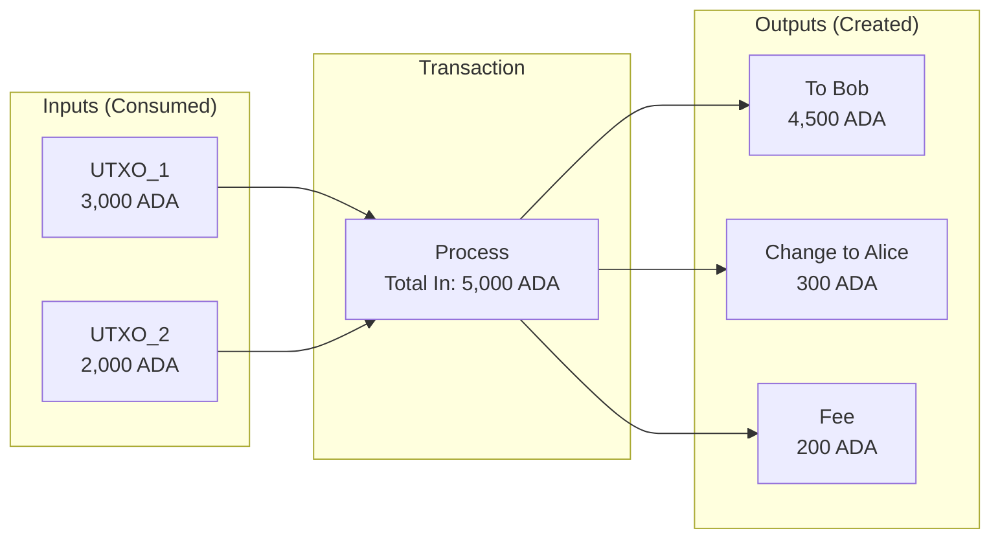
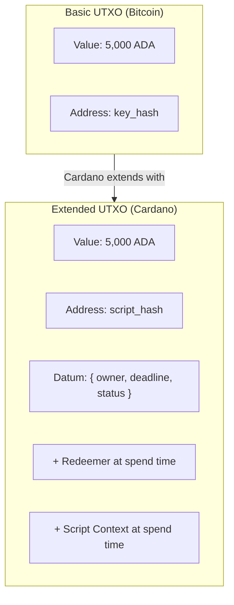

# Bài #04: Mô hình UTXO

Mô hình UTXO (Unspent Transaction Output - Đầu ra giao dịch chưa chi tiêu) là phương pháp theo dõi quyền sở hữu trên blockchain bằng cách ghi lại các "đồng tiền" rời rạc, bất biến thay vì số dư tài khoản có thể thay đổi. Cardano mở rộng mô hình này với datum, redeemer, và script context để hỗ trợ hợp đồng thông minh trong khi vẫn bảo toàn tính tất định và khả năng song song hóa. Bài học này giải thích cách UTXO hoạt động, tại sao Cardano chọn mô hình này, và cách tư duy theo eUTXO với tư cách nhà phát triển.

Mỗi blockchain cần một cách theo dõi ai sở hữu gì. Có hai cách tiếp cận khác biệt cơ bản: **mô hình tài khoản** (Ethereum sử dụng) và **mô hình UTXO** (Bitcoin sử dụng, và Cardano sử dụng dạng mở rộng). Đây không phải chi tiết triển khai nhỏ; nó định hình cách bạn suy nghĩ về giao dịch, cách bạn thiết kế hợp đồng thông minh, và những đảm bảo mà giao thức có thể cung cấp.

## Mô hình tài khoản hoạt động như thế nào?

Mô hình tài khoản hoạt động giống tài khoản ngân hàng: mỗi địa chỉ có số dư có thể thay đổi, và giao dịch cập nhật số dư tại chỗ bằng cách trừ người gửi và cộng người nhận. Nếu bạn đã làm việc với cơ sở dữ liệu hoặc Ethereum, bạn đã hiểu mô hình này một cách trực quan.

```
Trạng thái tài khoản (giống dòng cơ sở dữ liệu):

| Địa chỉ            | Số dư     |
|--------------------|------------|
| addr_alice         | 5.000 ADA  |
| addr_bob           | 3.000 ADA  |
| addr_charlie       | 1.500 ADA  |

Giao dịch: Alice gửi 1.000 ADA cho Bob

UPDATE accounts SET balance = balance - 1000 WHERE address = 'addr_alice';
UPDATE accounts SET balance = balance + 1000 WHERE address = 'addr_bob';

Kết quả:
| Địa chỉ            | Số dư     |
|--------------------|------------|
| addr_alice         | 4.000 ADA  |
| addr_bob           | 4.000 ADA  |
| addr_charlie       | 1.500 ADA  |
```

Điều này quen thuộc. Về bản chất đây là sổ cái có thể thay đổi, nơi số dư được cập nhật tại chỗ. Nhưng sự đơn giản này đi kèm với thách thức trong bối cảnh phi tập trung:

- **Tranh chấp trạng thái**: Hai giao dịch sửa đổi cùng tài khoản phải được tuần tự hóa. Chúng không thể thực thi song song an toàn.
- **Không tất định**: Kết quả của giao dịch có thể phụ thuộc vào các giao dịch khác thực thi trước nó. Bạn không thể biết kết quả cho đến thời điểm thực thi.
- **Phụ thuộc trạng thái toàn cục**: Hợp đồng thông minh thường đọc và ghi trạng thái toàn cục chung, tạo ra các phụ thuộc phức tạp.

## Mô hình UTXO theo dõi quyền sở hữu như thế nào?

Mô hình UTXO theo dõi quyền sở hữu thông qua các "đồng tiền" rời rạc, bất biến (đầu ra giao dịch chưa chi tiêu từ các giao dịch trước) thay vì số dư có thể thay đổi. Khi bạn chi tiêu, bạn tiêu thụ toàn bộ UTXO làm đầu vào và tạo UTXO mới làm đầu ra, nhận "tiền thừa" trả lại cho mình, giống như thanh toán bằng tiền mặt.

### Phép so sánh tiền mặt

Phép so sánh tốt nhất là tiền mặt. Khi bạn có 50 đô la, bạn không có "số dư trừu tượng 50"; bạn có các tờ tiền cụ thể (có thể là tờ 20, tờ 20, và tờ 10). Khi bạn mua thứ gì đó giá 25 đô la, bạn đưa tờ 20 và tờ 10 (đưa 30), và bạn nhận lại 5 đô la tiền thừa.

UTXO hoạt động tương tự:



```
Các UTXO của Alice (ví của cô ấy):
  UTXO_1: 3.000 ADA  (nhận từ giao dịch trước tx_abc, đầu ra #0)
  UTXO_2: 2.000 ADA  (nhận từ giao dịch trước tx_def, đầu ra #1)

Tổng: 5.000 ADA (nhưng lưu trữ dưới dạng hai UTXO riêng biệt)

Alice muốn gửi 4.500 ADA cho Bob:

Giao dịch:
  ĐẦU VÀO:                      ĐẦU RA:
  +-----------+               +-----------+
  | UTXO_1    | 3.000 ADA    | Cho Bob   | 4.500 ADA   (UTXO mới cho Bob)
  | UTXO_2    | 2.000 ADA    | Cho Alice |   300 ADA   (tiền thừa cho Alice)
  +-----------+               +-----------+
  Tổng vào: 5.000 ADA        | Phí       |   200 ADA   (phí giao dịch)
                              Tổng ra: 5.000 ADA

Sau giao dịch:
  UTXO_1: ĐÃ CHI TIÊU (bị hủy, không còn tồn tại)
  UTXO_2: ĐÃ CHI TIÊU (bị hủy, không còn tồn tại)
  UTXO_3: 4.500 ADA thuộc về Bob (mới tạo)
  UTXO_4:   300 ADA thuộc về Alice (mới tạo, đây là "tiền thừa")
```

Các quan sát chính:

1. **UTXO được tiêu thụ toàn bộ**. Bạn không thể chi tiêu một phần UTXO. Nếu bạn có UTXO 3.000 ADA và muốn gửi 1.000 ADA, bạn tiêu thụ toàn bộ UTXO 3.000 ADA và tạo hai đầu ra mới: 1.000 ADA cho người nhận và 2.000 ADA trả lại cho mình dưới dạng tiền thừa.

2. **Đầu vào luôn bằng đầu ra cộng phí**. Mọi giao dịch phải cân bằng. Tổng tất cả UTXO đầu vào phải bằng tổng tất cả UTXO đầu ra cộng phí giao dịch. Giao thức thực thi điều này.

3. **UTXO là bất biến**. Một khi tạo, UTXO không bao giờ thay đổi. Nó hoặc tồn tại (chưa chi tiêu) hoặc không (đã chi tiêu). Không có thao tác UPDATE; chỉ có CREATE (dưới dạng đầu ra giao dịch) và CONSUME (dưới dạng đầu vào giao dịch).

4. **Mỗi UTXO chỉ có thể chi tiêu một lần**. Đây là cách ngăn chi tiêu hai lần. Một khi UTXO xuất hiện làm đầu vào cho giao dịch đã xác nhận, nó được đánh dấu là đã chi tiêu và không bao giờ có thể sử dụng lại.

### Tập UTXO là gì?

**Tập UTXO** là tập hợp hoàn chỉnh tất cả đầu ra giao dịch chưa chi tiêu tại bất kỳ thời điểm nào. Nó đại diện cho trạng thái hiện tại của blockchain.

```
Tập UTXO (đơn giản hóa):

| TxId:Index | Địa chỉ      | Giá trị   |
|------------|---------------|-----------|
| tx_01:#0   | addr_alice    | 300 ADA   |
| tx_02:#0   | addr_bob      | 4.500 ADA |
| tx_03:#0   | addr_charlie  | 1.500 ADA |
| tx_03:#1   | addr_dave     | 750 ADA   |
| ...        | ...           | ...       |
```

Mỗi UTXO được xác định duy nhất bằng **ID giao dịch** đã tạo nó và **chỉ số đầu ra** trong giao dịch đó. Cặp (TxId, Index) này được gọi là **tham chiếu đầu ra giao dịch** (TxOutRef).

Trên mainnet Cardano, tập UTXO chứa hàng triệu mục. Nút đầy đủ duy trì tập này trong bộ nhớ để xác thực nhanh.

## Mô hình UTXO mở rộng (eUTXO) là gì?

Mô hình UTXO mở rộng thêm ba thành phần vào khái niệm UTXO gốc của Bitcoin: **datum** (dữ liệu tùy ý đính kèm UTXO), **redeemer** (đối số cung cấp khi chi tiêu), và **script context** (cái nhìn toàn diện về toàn bộ giao dịch). Các mở rộng này cho phép hợp đồng thông minh trong khi bảo toàn tính tất định và song song hóa của UTXO.



### 1. Datum: Đính kèm dữ liệu vào UTXO

Trong eUTXO, mỗi đầu ra có thể mang theo dữ liệu tùy ý gọi là **datum**. Hãy nghĩ nó như trạng thái đính kèm vào UTXO cụ thể.

```
UTXO mở rộng:
+---------------------------+
| Value:  5.000 ADA         |
| Address: script_addr_xyz  |  <- bị khóa bởi script, không phải khóa
| Datum: {                  |  <- dữ liệu tùy ý đính kèm UTXO này
|   owner: "alice",         |
|   deadline: 1740000000,   |
|   status: "active"        |
| }                         |
+---------------------------+
```

Datum là câu trả lời của Cardano cho "hợp đồng thông minh lưu trạng thái ở đâu?" Trong mô hình tài khoản (Ethereum), trạng thái được lưu trong kho lưu trữ hợp đồng (bộ lưu trữ khóa-giá trị có thể thay đổi). Trong eUTXO, trạng thái sống bên trong chính các UTXO. Để cập nhật trạng thái, bạn tiêu thụ một UTXO và tạo UTXO mới với dữ liệu đã cập nhật.

Cardano hỗ trợ hai chế độ lưu trữ datum:
- **Hash datum**: Chỉ hash của datum được lưu trên chuỗi. Datum thực tế được cung cấp khi UTXO được chi tiêu. Điều này tiết kiệm không gian trên chuỗi.
- **Inline datum**: Datum đầy đủ được lưu trực tiếp trên chuỗi trong UTXO. Điều này giúp các giao dịch khác dễ đọc datum hơn mà không cần phối hợp ngoài chuỗi.

### 2. Redeemer: Cung cấp đầu vào cho script

Khi bạn chi tiêu UTXO bị khóa bởi script, bạn cung cấp **redeemer**: đối số mà script sử dụng để xác định liệu việc chi tiêu có được phép hay không.

```
Chi tiêu UTXO bị khóa bởi script:

Đầu vào:
  UTXO cần chi tiêu: tx_01:#0 (bị khóa bởi script_addr_xyz)
  Redeemer: { action: "claim", proof: "abc123" }

Script xác thực nhận:
  - Datum:    { owner: "alice", deadline: 1740000000, status: "active" }
  - Redeemer: { action: "claim", proof: "abc123" }
  - Context:  (thông tin về toàn bộ giao dịch)

Script đánh giá và trả về:
  True  -> giao dịch hợp lệ, UTXO có thể chi tiêu
  False -> giao dịch KHÔNG HỢP LỆ, bị mạng lưới từ chối
```

### 3. Script Context: Nhận thức giao dịch

Script xác thực cũng nhận **script context**: cái nhìn toàn diện về toàn bộ giao dịch, bao gồm tất cả đầu vào, tất cả đầu ra, phí, khoảng thời gian hợp lệ, người ký, và nhiều hơn nữa.

Điều này cực kỳ mạnh mẽ. Script có thể thực thi các điều kiện phức tạp như:

- "UTXO này chỉ có thể chi tiêu nếu giao dịch cũng gửi 100 ADA đến địa chỉ X"
- "UTXO này chỉ có thể chi tiêu sau slot 50.000.000"
- "UTXO này chỉ có thể chi tiêu nếu giao dịch tạo đầu ra mới tại cùng địa chỉ script với datum đã cập nhật"

Mẫu cuối cùng là nền tảng của **hợp đồng thông minh có trạng thái** trong eUTXO. Script thực thi rằng trạng thái của chính nó được truyền chính xác.

## Một giao dịch eUTXO hoàn chỉnh hoạt động như thế nào?

Một tương tác hợp đồng thông minh eUTXO hoàn chỉnh tiêu thụ UTXO bị khóa bởi script với redeemer, bộ xác thực trên chuỗi kiểm tra điều kiện (datum, redeemer, và script context), và nếu xác thực thành công, giao dịch tạo UTXO mới với trạng thái đã cập nhật. Dưới đây là ví dụ cụ thể.

```
Kịch bản: Alice đã khóa 1.000 ADA trong hợp đồng vesting.
          Hợp đồng giải phóng quỹ sau một slot nhất định.

TRƯỚC:
  UTXO Script (tại vesting_script_addr):
    Value: 1.000 ADA
    Datum: { beneficiary: addr_alice, release_slot: 50000000 }

  UTXO của Alice (tại addr_alice):
    Value: 10 ADA  (cho phí)

GIAO DỊCH:
  Đầu vào:
    [1] UTXO Script (vesting_script_addr, tx_old:#0)
        Redeemer: { action: "withdraw" }
    [2] UTXO phí của Alice (addr_alice, tx_fee:#0)

  Đầu ra:
    [1] Đến addr_alice: 1.000 ADA  (quỹ vesting)
    [2] Đến addr_alice: 8 ADA      (tiền thừa từ UTXO phí)

  Phí: 2 ADA
  Khoảng thời gian hợp lệ: [50000000, infinity)  <- chỉ hợp lệ sau release slot

XÁC THỰC SCRIPT:
  Script vesting kiểm tra:
    1. Slot hiện tại >= datum.release_slot? CÓ (được thực thi bởi khoảng hợp lệ)
    2. Giao dịch có thanh toán cho datum.beneficiary? CÓ (đầu ra #1 đến addr_alice)
    3. Giao dịch có được ký bởi datum.beneficiary? CÓ (Alice đã ký)
  Kết quả: TRUE -> giao dịch hợp lệ

SAU:
  UTXO Script: ĐÃ CHI TIÊU (bị hủy)
  UTXO mới tại addr_alice: 1.000 ADA (quỹ vesting)
  UTXO mới tại addr_alice: 8 ADA (tiền thừa)
```

## Tại sao xác thực giao dịch tất định lại quan trọng?

Xác thực tất định nghĩa là bạn có thể dự đoán chính xác giao dịch sẽ làm gì trước khi gửi, vì giao dịch eUTXO tham chiếu UTXO cụ thể theo ID thay vì đọc trạng thái toàn cục có thể thay đổi. Hoặc kết quả chính xác như mong đợi xảy ra, hoặc giao dịch thất bại mà không có bất kỳ tác động nào.

Trong mô hình tài khoản, kết quả giao dịch phụ thuộc vào trạng thái toàn cục có thể thay đổi giữa lúc xây dựng và thực thi:

```
Mô hình tài khoản (Ethereum):
  1. Alice xây dựng giao dịch gọi hợp đồng DEX
  2. Tại thời điểm xây dựng, giá là 100 TOKEN mỗi ETH
  3. Giữa xây dựng và thực thi, giao dịch Bob thay đổi giá thành 200
  4. Giao dịch Alice thực thi ở giá tệ hơn (hoặc thất bại)

  -> Kết quả không thể dự đoán tại thời điểm xây dựng
```

Trong eUTXO, giao dịch chỉ định chính xác đầu vào (UTXO cụ thể theo tham chiếu):

```
Mô hình eUTXO (Cardano):
  1. Alice xây dựng giao dịch tiêu thụ UTXO_A và UTXO_B
  2. Nếu UTXO_A hoặc UTXO_B đã bị chi tiêu khi giao dịch
     đến bộ xác thực, giao dịch đơn giản thất bại
  3. Nếu chúng chưa bị chi tiêu, giao dịch thực thi với chính xác
     trạng thái Alice nhìn thấy khi xây dựng

  -> Kết quả hoàn toàn có thể dự đoán. Hoặc kết quả chính xác
     như mong đợi xảy ra, hoặc giao dịch thất bại không tác động.
```

Tính tất định này có nghĩa:

- **Không phí bất ngờ**: Bạn biết chính xác phí trước khi gửi.
- **Không front-running**: Các giao dịch khác không thể thao túng trạng thái giao dịch bạn nhìn thấy (chúng chỉ có thể khiến giao dịch bạn thất bại, không thể thực thi với kết quả khác).
- **Xác thực ngoài chuỗi**: Bạn có thể chạy chính xác cùng logic xác thực cục bộ mà blockchain sẽ chạy, xác nhận thành công trước khi trả phí.
- **Hoàn phí khi thất bại**: Nếu giao dịch thất bại xác thực Giai đoạn 1 (kiểm tra cấu trúc), không tính phí. Chỉ thất bại Giai đoạn 2 (thất bại thực thi script) mới tiêu tốn phí.

## Đồng thời hoạt động trong mô hình eUTXO như thế nào?

Đồng thời trong eUTXO yêu cầu thiết kế tường minh vì hai giao dịch không thể tiêu thụ cùng UTXO đồng thời; chỉ một thành công và cái kia thất bại. Cộng đồng Cardano đã phát triển nhiều mẫu thiết kế (UTXO fan-out, gom nhóm, đầu vào tham chiếu) để xử lý đánh đổi này hiệu quả.

```
Kịch bản có vấn đề:
  UTXO Script tại DEX: { price: 100, liquidity: 10000 }

  Giao dịch Alice: tiêu thụ UTXO DEX, mua 100 token
  Giao dịch Bob:   tiêu thụ UTXO DEX, mua 50 token

  Chỉ MỘT trong hai có thể thành công. Cái còn lại tham chiếu UTXO đã chi tiêu.
```

Điều này khác với mô hình tài khoản, nơi cả hai giao dịch sẽ được tuần tự hóa và cả hai có thể thành công (dù có thể thay đổi trạng thái giữa chúng).

### Có những giải pháp đồng thời nào?

**1. Nhiều UTXO (UTXO fan-out)**

Thay vì một UTXO chứa tất cả thanh khoản, phân phối trạng thái trên nhiều UTXO:

```
Thay vì:
  [Một UTXO: 10.000 ADA thanh khoản]

Sử dụng:
  [UTXO_1: 1.000 ADA]  [UTXO_2: 1.000 ADA]  [UTXO_3: 1.000 ADA]
  [UTXO_4: 1.000 ADA]  [UTXO_5: 1.000 ADA]  ... (10 UTXO)

Giờ 10 người dùng có thể giao dịch đồng thời, mỗi người tiêu thụ UTXO khác nhau.
```

**2. Gom nhóm (mẫu sổ lệnh)**

Người dùng gửi lệnh dưới dạng UTXO riêng lẻ. Bộ gom nhóm thu thập nhiều lệnh và thực thi trong một giao dịch:

```
Bước 1: Người dùng gửi lệnh dưới dạng UTXO
  [Lệnh: Alice mua 100 TOKEN]  [Lệnh: Bob mua 50 TOKEN]  [Lệnh: Carol bán 200 TOKEN]

Bước 2: Bộ gom nhóm xây dựng một giao dịch mà:
  - Tiêu thụ tất cả UTXO lệnh
  - Tiêu thụ UTXO thanh khoản DEX
  - Tạo đầu ra đã thanh toán cho mỗi người dùng
  - Tạo UTXO DEX mới với trạng thái đã cập nhật

Không tranh chấp: mỗi người dùng chỉ tạo UTXO của riêng mình.
```

Đây là mẫu được hầu hết các DEX trên Cardano sử dụng (SundaeSwap, Minswap, WingRiders).

**3. Đầu vào tham chiếu (CIP-31)**

Cardano cho phép giao dịch **tham chiếu** UTXO mà không tiêu thụ. Nếu giao dịch chỉ cần đọc dữ liệu từ UTXO (không sửa đổi), nó có thể sử dụng đầu vào tham chiếu. Nhiều giao dịch có thể tham chiếu cùng UTXO đồng thời.

```
UTXO Oracle: { price_feed: 1.50, timestamp: 1740000000 }

Giao dịch Alice: THAM CHIẾU UTXO Oracle (đọc giá, không tiêu thụ)
Giao dịch Bob:   THAM CHIẾU UTXO Oracle (đọc giá, không tiêu thụ)
Giao dịch Carol: THAM CHIẾU UTXO Oracle (đọc giá, không tiêu thụ)

Cả ba giao dịch có thể xử lý trong cùng khối.
UTXO Oracle vẫn chưa chi tiêu.
```

**4. Script tham chiếu (CIP-33)**

Mã script có thể được lưu trong UTXO và tham chiếu bởi giao dịch, thay vì bao gồm toàn bộ script trong mỗi giao dịch. Điều này giảm kích thước và chi phí giao dịch trong khi cho phép chia sẻ script.

## Token bản địa hoạt động trong mô hình eUTXO như thế nào?

Trên Cardano, token tùy chỉnh (có thể thay thế và không thể thay thế) là **bản địa**: chúng sống bên trong UTXO cùng với ADA ở cấp giao thức, không phải bên trong hợp đồng thông minh. Điều này có nghĩa token kế thừa tất cả thuộc tính bảo mật của chính ADA, mà không cần thực thi hợp đồng thông minh cho các giao dịch chuyển đổi cơ bản.

```
Một UTXO trên Cardano có thể chứa nhiều tài sản:

UTXO:
+----------------------------------------------+
| Address: addr_alice                           |
| Value:                                        |
|   ADA: 5.000.000 lovelace (5 ADA)            |
|   PolicyID_abc.TokenA: 1.000 đơn vị          |
|   PolicyID_abc.TokenB: 500 đơn vị            |
|   PolicyID_def.MyNFT: 1 đơn vị               |
+----------------------------------------------+
```

Đây gọi là **giá trị đa tài sản** hay **gói giá trị**. Một UTXO duy nhất có thể chứa ADA cộng bất kỳ số lượng token bản địa nào.

Quan trọng: mỗi UTXO trên Cardano phải chứa lượng ADA tối thiểu (yêu cầu **min-UTXO**, hiện khoảng 1-2 ADA tùy thuộc kích thước UTXO). Điều này ngăn spam bằng cách làm tốn kém việc tạo nhiều UTXO nhỏ và đảm bảo tập UTXO không tăng trưởng không kiểm soát.

### ADA và lovelace là gì?

ADA là tiền tệ gốc của Cardano. Đơn vị nhỏ nhất là **lovelace**, đặt tên theo Ada Lovelace:

```
1 ADA = 1.000.000 lovelace

Tất cả giá trị trên chuỗi được tính bằng lovelace.
Khi giao dịch chỉ định phí 200.000 lovelace, đó là 0,2 ADA.
```

Điều này tương tự cách Ethereum sử dụng wei (1 ETH = 10^18 wei) hoặc cách tài chính truyền thống sử dụng xu (1 USD = 100 xu), dù với nhiều chữ số thập phân hơn.

## Mô hình UTXO và tài khoản so sánh như thế nào?

Hai mô hình đưa ra các đánh đổi khác nhau cơ bản. Mô hình tài khoản đơn giản hơn để suy luận cho ứng dụng có trạng thái. Mô hình eUTXO cung cấp đảm bảo mạnh hơn về kết quả giao dịch và cho phép nhiều song song hóa hơn. Không cái nào "tốt hơn" một cách khách quan.

| Khía cạnh | Mô hình tài khoản (Ethereum) | Mô hình eUTXO (Cardano) |
|---|---|---|
| **Biểu diễn trạng thái** | Số dư tài khoản có thể thay đổi | UTXO bất biến, tiêu thụ và tạo mới |
| **Trạng thái hợp đồng thông minh** | Slot lưu trữ có thể thay đổi | Datum đính kèm UTXO |
| **Song song hóa** | Bị giới hạn bởi trạng thái chia sẻ | Song song hóa tự nhiên (UTXO khác nhau) |
| **Tính tất định** | Không tất định (trạng thái có thể thay đổi) | Tất định (đầu vào là UTXO cụ thể) |
| **Xác thực giao dịch** | Thực thi để tìm kết quả | Xác thực ngoài chuỗi với sự chắc chắn |
| **Đồng thời** | Ngầm (tuần tự hóa bởi EVM) | Tường minh (chọn UTXO) |
| **Độ phức tạp ví** | Đơn giản (đọc số dư) | Phức tạp hơn (quản lý tập UTXO) |
| **Dự đoán phí** | Xấp xỉ (ước lượng gas) | Chính xác (thực thi tất định) |
| **Token bản địa** | Hợp đồng ERC-20 (mã) | Cấp giao thức (không cần hợp đồng) |

## Nhà phát triển nên tư duy theo eUTXO như thế nào?

Đối với nhà phát triển web2 chuyển sang Cardano, đây là khung tư duy cho "suy nghĩ theo eUTXO":

1. **Trạng thái sống trong UTXO, không phải biến**. Thay vì biến `balance` có thể thay đổi, bạn có tập hợp các vùng chứa giá trị rời rạc.

2. **Chuyển đổi trạng thái tiêu thụ và tạo UTXO**. Thay vì `balance -= 100`, bạn tiêu thụ UTXO và tạo cái mới. Mỗi thay đổi trạng thái là chu kỳ tạo-hủy.

3. **Giao dịch là hàm nguyên tử**. Giao dịch nhận tập UTXO làm đầu vào và tạo tập UTXO làm đầu ra. Nó là hàm thuần túy không có tác dụng phụ. Nếu bất kỳ phần nào thất bại, không phần nào được thực thi.

4. **Đồng thời là về chọn UTXO, không phải khóa**. Thay vì khóa dòng trong cơ sở dữ liệu, bạn chọn UTXO cụ thể. Nếu ai đó đã chi tiêu UTXO đó, bạn thử lại với đầu vào khác.

5. **Script là bộ xác thực, không phải bộ thực thi**. Plutus script không "làm việc"; chúng xác thực rằng giao dịch đáp ứng điều kiện. Bộ xây dựng giao dịch tạo ra chuyển đổi trạng thái; script chỉ kiểm tra tính hợp pháp.

## So sánh với Web2

| Khái niệm eUTXO | Tương đương Web2 | Khác biệt chính |
|---|---|---|
| **UTXO** | Thẻ quà tặng / phiếu trả trước | Bạn chi tiêu toàn bộ và nhận tiền thừa, thay vì trừ số dư |
| **Tập UTXO** | Nhật ký sự kiện bất biến (event sourcing) | Trạng thái hiện tại được suy ra từ tập đầu ra chưa chi tiêu, không phải từ kho lưu trữ có thể thay đổi |
| **Giao dịch (tiêu thụ + tạo)** | INSERT bất biến trong event sourcing | Không bao giờ UPDATE; tạo sự kiện mới thay thế sự kiện cũ |
| **Datum** | Ảnh chụp trạng thái đính kèm sự kiện | Trạng thái tường minh và cùng vị trí với giá trị nó mô tả |
| **Redeemer** | Đối số hàm / thân yêu cầu API | Cho bộ xác thực biết người dùng định làm gì |
| **Xác thực script** | Middleware / kiểm tra ủy quyền | Xác thực yêu cầu đáp ứng chính sách; không tự thực thi logic nghiệp vụ |
| **Đầu ra tiền thừa** | Hoàn tiền / trả dư | Khi bạn trả 30 đô bằng tờ 50, bạn nhận lại 20 đô |
| **Tính tất định giao dịch** | Hàm thuần túy (không tác dụng phụ) | Cùng đầu vào, luôn cùng đầu ra (như hàm thuần túy trong lập trình hàm) |
| **Tranh chấp UTXO** | Kiểm soát đồng thời lạc quan | Như khóa lạc quan cơ sở dữ liệu: thử, và thử lại nếu ai đó đã sửa đổi dòng |
| **Đầu vào tham chiếu** | Bản sao đọc cơ sở dữ liệu / cache | Đọc trạng thái mà không khóa hoặc sửa đổi |
| **Min-UTXO (đặt cọc ADA)** | Số dư tối thiểu / đặt cọc lưu trữ | Ngăn spam bằng cách yêu cầu giá trị thực đằng sau mỗi mục trạng thái |

**Phép so sánh event sourcing đặc biệt mạnh mẽ.** Trong event sourcing:
- Trạng thái được suy ra từ nhật ký sự kiện bất biến
- Bạn không bao giờ sửa đổi sự kiện quá khứ
- Trạng thái hiện tại là phép chiếu của tất cả sự kiện
- Trạng thái mới được tạo bằng cách thêm sự kiện mới

Trong eUTXO:
- Trạng thái là tập tất cả đầu ra chưa chi tiêu
- Bạn không bao giờ sửa đổi UTXO hiện có
- Trạng thái hiện tại là tập UTXO (tất cả đầu ra chưa chi tiêu)
- Trạng thái mới được tạo bằng cách tiêu thụ UTXO và tạo cái mới

Nếu bạn đã sử dụng event sourcing hoặc mẫu CQRS, eUTXO sẽ cảm thấy tự nhiên.

**Phép so sánh lập trình hàm** cũng hữu ích. Giao dịch giống hàm thuần túy: chúng nhận đầu vào tường minh, tạo đầu ra tường minh, và không có tác dụng phụ ẩn. Mô hình eUTXO về bản chất là cách tiếp cận hàm đối với kế toán sổ cái, điều không phải ngẫu nhiên; các ngôn ngữ hợp đồng thông minh của Cardano (Plutus, Aiken) bắt nguồn từ lập trình hàm.

## Điểm chính cần nhớ

- **Mô hình UTXO theo dõi các "đồng tiền" rời rạc** (đầu ra giao dịch chưa chi tiêu) thay vì số dư tài khoản. UTXO được tiêu thụ toàn bộ và cái mới được tạo, tương tự chi tiêu tiền mặt và nhận tiền thừa.
- **eUTXO của Cardano mở rộng UTXO cơ bản** với datum (trạng thái), redeemer (đối số hành động), và script context (nhận thức giao dịch), cho phép hợp đồng thông minh trong khi bảo toàn lợi ích UTXO.
- **Tính tất định là siêu năng lực của eUTXO**: kết quả giao dịch hoàn toàn có thể dự đoán trước khi gửi, loại bỏ front-running và cho phép tính phí chính xác.
- **Đồng thời yêu cầu thiết kế tường minh** trong eUTXO. Các mẫu như UTXO fan-out, gom nhóm, và đầu vào tham chiếu giải quyết tranh chấp, và hầu hết giao thức Cardano trưởng thành sử dụng các mẫu này hiệu quả.
- **Token bản địa sống cùng ADA trong UTXO**, kế thừa tất cả thuộc tính bảo mật cấp giao thức mà không cần hợp đồng thông minh cho các thao tác cơ bản.

## Tiếp theo là gì

Bạn giờ đã hiểu cách Cardano theo dõi giá trị và trạng thái. Nhưng chúng ta đã đề cập qua "địa chỉ" và "khóa riêng tư" mà chưa giải thích đầy đủ. Bài 5 hoàn thiện bức tranh bằng cách khám phá ví, khóa, và địa chỉ: lớp danh tính và truy cập kết nối người dùng với blockchain. Bạn sẽ học cách cụm từ ghi nhớ tạo ra phân cấp khóa, cách địa chỉ Cardano được cấu trúc, và cách tất cả liên kết trở lại với các nguyên thủy mật mã và mô hình UTXO từ các bài trước.
