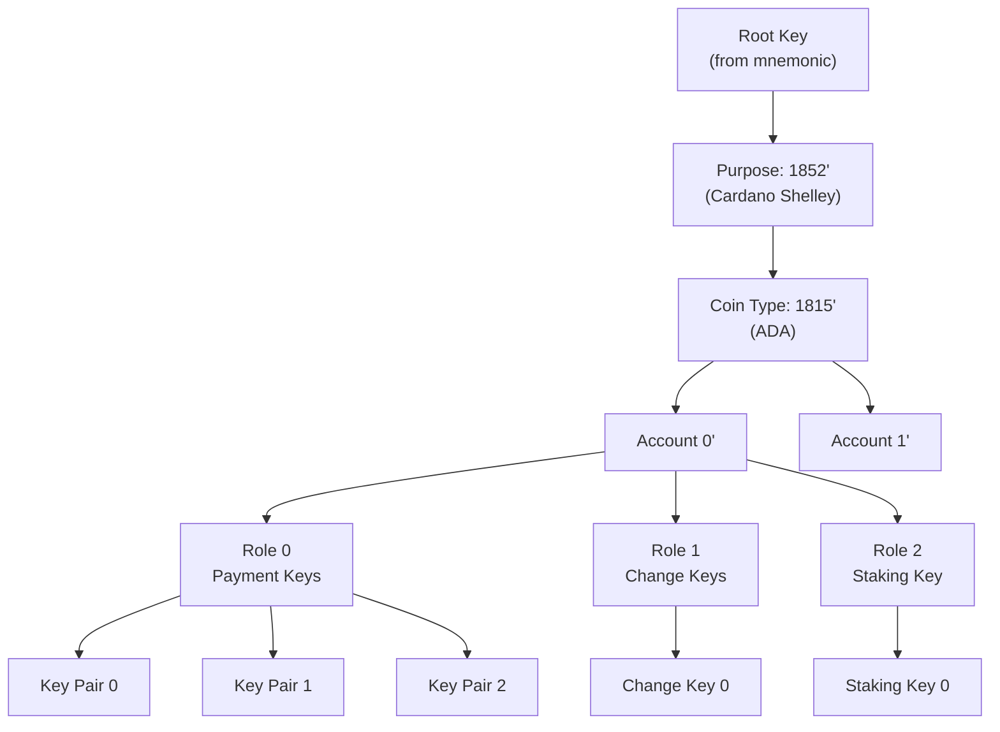
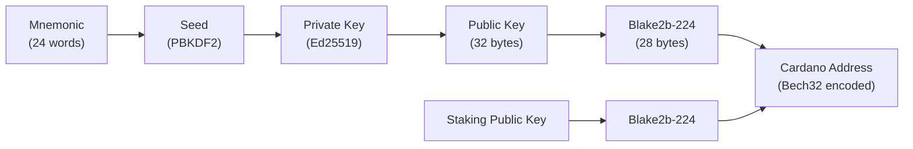

# Bài #05: Ví, khóa, và địa chỉ

Ví, khóa, và địa chỉ tạo thành lớp danh tính và truy cập của Cardano: cụm từ ghi nhớ (seed phrase) tạo ra cây phân cấp các cặp khóa, khóa công khai được hash thành địa chỉ khóa UTXO, và phần mềm ví quản lý sự phức tạp này để người dùng có thể gửi, nhận, và stake ADA. Bài học này kết nối các nguyên thủy mật mã từ Bài 2 với mô hình UTXO từ Bài 4 thành bức tranh hoàn chỉnh.

Hiểu lớp này là thiết yếu cho nhà phát triển Cardano. Dù bạn đang xây dựng dApp, tích hợp kết nối ví, hay thiết kế luồng giao dịch, bạn cần biết cách khóa, địa chỉ, và ví phối hợp với nhau và tại sao cách tiếp cận của Cardano khác với các blockchain khác.

## Cặp khóa là gì và tại sao nó là nền tảng danh tính?

Cặp khóa gồm khóa riêng tư (32 byte entropy ngẫu nhiên) và khóa công khai tương ứng (dẫn xuất qua Ed25519), và nó tạo thành nền tảng danh tính trên Cardano vì ai nắm giữ khóa riêng tư có thể ký giao dịch và chi tiêu quỹ tại địa chỉ tương ứng. Không có luồng "quên mật khẩu", không có hỗ trợ khách hàng, và không có cơ chế phục hồi nào ngoài chính khóa đó.

```
Tạo khóa:
  private_key = random_256_bits()          // 32 byte entropy
  public_key  = ed25519_derive(private_key) // 32 byte, liên kết toán học

Thuộc tính:
  - private_key -> public_key:  DỄ (một phép tính)
  - public_key -> private_key:  BẤT KHẢ THI (sẽ phá vỡ Ed25519)
  - sign(message, private_key): tạo ra chữ ký 64 byte
  - verify(message, signature, public_key): true/false
```

**Khóa riêng tư là danh tính của bạn.** Ai nắm giữ khóa riêng tư có thể chi tiêu quỹ tại địa chỉ tương ứng.

**Khóa công khai là danh tính có thể xác minh của bạn.** Nó có thể chia sẻ tự do. Người khác dùng nó để xác minh chữ ký của bạn và gửi quỹ cho bạn (qua địa chỉ dẫn xuất từ nó).

## Tại sao cặp khóa thô không thực tế cho sử dụng thực tế?

Cặp khóa thô tạo ra các vấn đề thực tế nghiêm trọng: một khóa cho mỗi địa chỉ khiến tất cả giao dịch dễ dàng liên kết, quản lý hàng trăm khóa riêng tư không liên quan dễ sai sót, sao lưu hàng trăm khóa không thực tế, và khóa bị xâm phạm không có cơ chế xoay vòng. Giải pháp cho tất cả các vấn đề này là **Ví tất định phân cấp (HD)**.

1. **Một khóa cho mỗi địa chỉ**: Nếu bạn dùng khóa công khai trực tiếp làm địa chỉ, tất cả giao dịch của bạn dễ dàng liên kết. Bất kỳ ai cũng có thể thấy toàn bộ lịch sử tài chính của bạn.

2. **Cơn ác mộng quản lý khóa**: Người dùng có thể có hàng trăm địa chỉ cho các mục đích khác nhau. Quản lý hàng trăm khóa riêng tư không liên quan dễ sai sót và nguy hiểm.

3. **Độ phức tạp sao lưu**: Mất một khóa riêng tư nghĩa là mất tất cả quỹ tại địa chỉ đó. Sao lưu hàng trăm khóa không thực tế.

4. **Không xoay vòng khóa**: Nếu khóa bị xâm phạm, bạn không thể cập nhật địa chỉ. Bạn phải tạo địa chỉ mới và chuyển tất cả quỹ.

## Cụm từ ghi nhớ (seed phrase) hoạt động như thế nào?

Cụm từ ghi nhớ (được định nghĩa bởi BIP-39) là biểu diễn có thể đọc được của 256 bit entropy ngẫu nhiên, được mã hóa thành 24 từ từ danh sách 2.048 từ chuẩn. Cụm từ duy nhất này tạo ra toàn bộ cây cặp khóa một cách tất định, biến nó thành bản sao lưu duy nhất cần thiết cho toàn bộ danh tính Cardano của bạn.

```
Ví dụ cụm từ ghi nhớ 24 từ (KHÔNG SỬ DỤNG; chỉ để minh họa):

  1. abandon   7. carbon   13. glance   19. pottery
  2. ability   8. detect   14. harvest  20. rabbit
  3. abstract  9. emerge   15. isolate  21. serial
  4. across   10. filter   16. jungle   22. timber
  5. blanket  11. flight   17. kitchen  23. urban
  6. burst    12. gauge    18. obvious  24. vendor
```

Cách hoạt động:

```
Bước 1: Tạo entropy (bit ngẫu nhiên)
  entropy = 256 bit ngẫu nhiên (cho cụm từ 24 từ)

Bước 2: Tính tổng kiểm tra
  checksum = 8 bit đầu tiên của SHA-256(entropy)

Bước 3: Kết hợp
  combined = entropy + checksum = 264 bit

Bước 4: Chia thành nhóm 11 bit
  264 bit / 11 bit = 24 nhóm

Bước 5: Ánh xạ mỗi nhóm thành từ trong danh sách BIP-39
  Nhóm 1 (00000000000) -> "abandon" (từ #0)
  Nhóm 2 (00000000001) -> "ability" (từ #1)
  ... và tương tự cho tất cả 24 nhóm

Danh sách từ chứa chính xác 2.048 từ (2^11 = 2.048).
```

**Tại sao 24 từ?** 24 từ mã hóa 256 bit entropy. Số cụm từ 24 từ có thể là 2^256, xấp xỉ 1,16 x 10^77. Để so sánh, có khoảng 10^80 nguyên tử trong vũ trụ quan sát được. Đoán cụm từ ghi nhớ bằng brute force không chỉ đơn giản là không thực tế; nó là bất khả thi về mặt vật lý với bất kỳ công nghệ nào có thể hình dung.

**Ví Cardano thường sử dụng cụm từ ghi nhớ 15 từ hoặc 24 từ.** Ví thời kỳ Shelley (Daedalus, Eternl, Lace) sử dụng 24 từ (entropy 256 bit). Một số ví nhẹ hơn sử dụng 15 từ (entropy 160 bit), vẫn an toàn ở mức thiên văn.

### Cụm từ ghi nhớ trở thành khóa gốc như thế nào?

Cụm từ ghi nhớ được chuyển đổi thành seed mật mã sử dụng PBKDF2 (Hàm dẫn xuất khóa dựa trên mật khẩu 2):

```
seed = PBKDF2(
  password: chuỗi_từ_ghi_nhớ,
  salt: "mnemonic" + mật_khẩu_tùy_chọn,
  iterations: 2048,
  key_length: 512 bit,
  hash: HMAC-SHA512
)
```

Seed 512 bit này trở thành **khóa gốc** mà tất cả khóa khác được dẫn xuất từ đó. Mật khẩu tùy chọn thêm lớp bảo mật bổ sung; cùng 24 từ với mật khẩu khác tạo ra ví hoàn toàn khác. Một số người dùng sử dụng điều này như "từ thứ 25" cho khả năng phủ nhận hợp lý hoặc bảo mật bổ sung.

## Ví HD dẫn xuất vô hạn khóa từ một seed như thế nào?

Ví tất định phân cấp (HD) (BIP-32) sử dụng cấu trúc cây để dẫn xuất số lượng không giới hạn cặp khóa từ một khóa gốc duy nhất. Mỗi khóa được dẫn xuất tất định từ khóa cha bằng hàm dẫn xuất một chiều, nên chỉ cần cụm từ ghi nhớ là đủ để tái tạo mọi cặp khóa ví đã từng tạo.



```
Khóa gốc (từ cụm từ ghi nhớ)
+-- Mục đích (1852' cho ví Cardano Shelley)
|   +-- Loại tiền (1815' cho ADA)
|       +-- Tài khoản 0'
|       |   +-- Vai trò 0 (Bên ngoài/Thanh toán)
|       |   |   +-- Chỉ số địa chỉ 0 -> Cặp khóa 0
|       |   |   +-- Chỉ số địa chỉ 1 -> Cặp khóa 1
|       |   |   +-- Chỉ số địa chỉ 2 -> Cặp khóa 2
|       |   |   +-- ...
|       |   +-- Vai trò 1 (Nội bộ/Tiền thừa)
|       |   |   +-- Chỉ số địa chỉ 0 -> Cặp khóa 0
|       |   |   +-- ...
|       |   +-- Vai trò 2 (Staking)
|       |       +-- Chỉ số địa chỉ 0 -> Cặp khóa staking
|       +-- Tài khoản 1'
|           +-- Vai trò 0 (Bên ngoài/Thanh toán)
|           |   +-- ...
|           +-- ...
```

### Đường dẫn dẫn xuất được cấu trúc như thế nào?

Đường dẫn dẫn xuất được viết như sau:

```
m / purpose' / coin_type' / account' / role / address_index

Cho Cardano:
m / 1852' / 1815' / 0' / 0 / 0

Trong đó:
  m          = khóa gốc
  1852'      = mục đích (Cardano thời kỳ Shelley, CIP-1852)
  1815'      = loại tiền cho ADA (đăng ký trong SLIP-44)
  0'         = chỉ số tài khoản (tài khoản đầu tiên)
  0          = vai trò: 0=bên ngoài, 1=nội bộ(tiền thừa), 2=staking
  0          = chỉ số địa chỉ (địa chỉ đầu tiên trong vai trò này)

Dấu nháy đơn (') biểu thị dẫn xuất "cứng"; khóa con
không thể dùng để tính khóa cha, ngay cả với khóa công khai.
```

Tại sao 1815? Ada Lovelace sinh năm 1815. Tại sao 1852? Ada Lovelace mất năm 1852, và CIP-1852 định nghĩa tiêu chuẩn dẫn xuất.

### Các thuộc tính chính của dẫn xuất HD là gì?

**Tất định**: Cho cùng khóa gốc và đường dẫn, bạn luôn nhận cùng khóa con. Điều này có nghĩa chỉ cần cụm từ ghi nhớ là đủ để tái tạo mọi cặp khóa ví đã từng tạo.

**Phân cấp**: Khóa tạo thành cây. Khóa cấp tài khoản độc lập; xâm phạm một tài khoản không ảnh hưởng đến tài khoản khác (nhờ dẫn xuất cứng ở cấp tài khoản).

**Tăng dần**: Địa chỉ mới có thể được tạo theo yêu cầu mà không cần quay lại seed. Ví chỉ cần tăng chỉ số địa chỉ.

**Dẫn xuất khóa công khai**: Ở các cấp không cứng, khóa công khai con có thể được dẫn xuất từ khóa công khai cha mà không cần khóa riêng tư. Điều này cho phép ví "chỉ xem" có thể tạo địa chỉ và theo dõi số dư mà không có khả năng ký giao dịch.

## Cardano hỗ trợ những loại địa chỉ nào?

Cardano hỗ trợ nhiều loại địa chỉ (base, enterprise, reward, pointer, và script), mỗi loại phục vụ các trường hợp sử dụng khác nhau. Địa chỉ Cardano không chỉ đơn giản là khóa công khai được hash; nó là kiểu dữ liệu có cấu trúc chứa byte tiêu đề, thông tin thanh toán, và thông tin ủy quyền tùy chọn.



### Địa chỉ Cardano được cấu trúc như thế nào?

```
Địa chỉ Cardano (thời kỳ Shelley):

+--------+-------------------+-------------------+
| Header | Phần thanh toán   | Phần ủy quyền     |
| 1 byte | 28 byte           | 28 byte           |
+--------+-------------------+-------------------+

Byte tiêu đề mã hóa:
  - Mạng (mainnet hoặc testnet)
  - Loại địa chỉ (xác định phần tiếp theo)

Phần thanh toán:
  - Hash khóa xác minh thanh toán (hash khóa), HOẶC
  - Hash Plutus script (hash script)

Phần ủy quyền (phụ thuộc loại địa chỉ):
  - Hash khóa xác minh staking, HOẶC
  - Hash staking script, HOẶC
  - Con trỏ đến chứng chỉ đăng ký stake, HOẶC
  - Không có (địa chỉ enterprise)
```

### Địa chỉ base là gì?

Loại địa chỉ phổ biến nhất. Nó chứa cả thông tin thanh toán và thông tin staking.

```
Địa chỉ base:
  Thanh toán: key_hash(payment_vk) hoặc script_hash(payment_script)
  Staking: key_hash(staking_vk) hoặc script_hash(staking_script)

Ví dụ (mã hóa Bech32):
  addr1qx2fxv2umyhttkxyxp8x0dlpdt3k6cwng5pxj3jhsydzer3jcu5d8ps7zex2k2xt3uqxgjqnnj83ws8lhrn648jjxtwq2ytjc7

Thuộc tính:
  - Có thể nhận ADA và token bản địa
  - Có thể tham gia staking (ủy quyền cho stake pool)
  - Nhận phần thưởng staking
  - Loại địa chỉ phổ biến nhất cho người dùng cuối
```

Tiền tố `addr1` chỉ địa chỉ base mainnet. Địa chỉ testnet sử dụng `addr_test1`.

### Địa chỉ enterprise là gì?

Địa chỉ enterprise chỉ chứa thông tin thanh toán, không có thành phần staking.

```
Địa chỉ enterprise:
  Thanh toán: key_hash hoặc script_hash
  Staking: KHÔNG CÓ

Ví dụ:
  addr1vx2fxv2umyhttkxyxp8x0dlpdt3k6cwng5pxj3jhsydzer3jcu5d8ps7zex2k2xt3uqxgjqnnj83ws8lhrn648jjxtwqr8jhvs

Thuộc tính:
  - Có thể nhận ADA và token bản địa
  - KHÔNG THỂ tham gia staking
  - KHÔNG nhận phần thưởng
  - Hữu ích cho: sàn giao dịch, hợp đồng thông minh, giữ tạm
```

Địa chỉ enterprise ngắn hơn (không có phần ủy quyền) và hữu ích khi không cần staking. Địa chỉ hợp đồng thông minh thường là địa chỉ enterprise.

### Địa chỉ reward là gì?

Địa chỉ reward (còn gọi là địa chỉ stake) được sử dụng riêng để nhận phần thưởng staking và không thể nhận chuyển ADA thông thường.

```
Địa chỉ reward:
  Staking: key_hash hoặc script_hash

Ví dụ:
  stake1uyehkck0lajq8gr28t9uxnuvgcqrc6070x3k9r8048z8y5gh6ffgw

Thuộc tính:
  - Nhận phần thưởng staking
  - Không thể nhận chuyển ADA thông thường
  - Một cho mỗi khóa staking (thường một cho mỗi tài khoản)
  - Phần thưởng được rút qua loại giao dịch đặc biệt
```

### Địa chỉ pointer là gì?

Địa chỉ pointer tham chiếu chứng chỉ đăng ký stake theo vị trí trong chuỗi (slot, chỉ số giao dịch, chỉ số chứng chỉ) thay vì chứa hash khóa stake đầy đủ.

```
Địa chỉ pointer:
  Thanh toán: key_hash hoặc script_hash
  Staking: pointer(slot, tx_index, cert_index)

Thuộc tính:
  - Hiệu quả không gian hơn địa chỉ base
  - Tương đương chức năng với địa chỉ base
  - Hiếm khi được sử dụng trong thực tế do độ phức tạp
```

### Địa chỉ script hoạt động như thế nào?

Khi thông tin thanh toán là hash script (thay vì hash khóa), địa chỉ là **địa chỉ script**. UTXO tại địa chỉ script chỉ có thể chi tiêu bằng cách cung cấp redeemer hợp lệ thỏa mãn script (bộ xác thực Plutus).

```
Địa chỉ script (cho bộ xác thực Plutus):
  Thanh toán: script_hash(compiled_plutus_script)
  Staking: tùy chọn

Hash script được tính:
  script_hash = blake2b_224(serialized_script)
```

Đây là cách hợp đồng thông minh được "triển khai" trên Cardano. Bạn không tải mã lên vị trí cụ thể. Thay vào đó, hash của script xác định địa chỉ. Bất kỳ ai biên dịch cùng script đều nhận cùng địa chỉ. Script có thể được bao gồm trong giao dịch chi tiêu từ địa chỉ (hoặc tham chiếu qua script tham chiếu CIP-33).

### Mã hóa Bech32 là gì?

Tất cả địa chỉ Cardano sử dụng mã hóa **Bech32**, cung cấp:

- **Tiền tố có thể đọc**: `addr` cho địa chỉ thanh toán mainnet, `addr_test` cho testnet, `stake` cho địa chỉ reward
- **Phát hiện lỗi**: Tổng kiểm tra tích hợp phát hiện lỗi đánh máy
- **Không phân biệt chữ hoa thường**: `addr1QX...` và `addr1qx...` là cùng địa chỉ
- **Không ký tự nhập nhằng**: Tránh các ký tự dễ nhầm như 0/O và 1/l/I

```
Định dạng Bech32: tiền_tố + "1" + dữ_liệu + tổng_kiểm_tra

addr1qx2fxv2umyhttkxyxp8x0dlpdt3k6cwng5pxj3jhsydzer3jcu5d8ps7zex...
|    | |                                                                |
tiền_tố phân_cách  dữ liệu (byte địa chỉ mã hóa base32)        tổng kiểm tra
```

## Khóa, địa chỉ, và UTXO kết nối như thế nào?

Luồng hoàn chỉnh từ cụm từ ghi nhớ đến UTXO có thể chi tiêu đi qua dẫn xuất khóa, tạo địa chỉ, tạo UTXO, và ký giao dịch. Mỗi bước sử dụng các nguyên thủy mật mã từ Bài 2, và kết quả cuối cùng là giao dịch đã ký mà mạng lưới có thể xác minh.

```
1. TẠO CỤM TỪ GHI NHỚ
   24 từ ngẫu nhiên -> master seed

2. DẪN XUẤT KHÓA (Ví HD, BIP-32/CIP-1852)
   master seed -> khóa gốc
   khóa gốc -> m/1852'/1815'/0'/0/0 -> cặp_khóa_thanh_toán_0
   khóa gốc -> m/1852'/1815'/0'/2/0 -> cặp_khóa_staking_0

3. TẠO ĐỊA CHỈ
   payment_vk_hash = blake2b_224(khóa_công_khai_thanh_toán_0)
   staking_vk_hash = blake2b_224(khóa_công_khai_staking_0)
   address = base_address(network=mainnet, payment_vk_hash, staking_vk_hash)
   encoded = bech32_encode("addr", address)
   Kết quả: addr1qx2fxv2umyhttkx...

4. NHẬN QUỸ
   Ai đó gửi 100 ADA đến addr1qx2fxv2umyhttkx...
   Một UTXO mới được tạo:
     UTXO { tx_id: "abc123", index: 0, address: addr1qx..., value: 100 ADA }

5. CHI TIÊU QUỸ
   Để chi tiêu UTXO này, bạn phải chứng minh quyền sở hữu khóa thanh toán:
   a. Xây dựng thân giao dịch (tiêu thụ UTXO, tạo đầu ra mới)
   b. Hash thân giao dịch: tx_hash = blake2b_256(tx_body)
   c. Ký: signature = ed25519_sign(tx_hash, khóa_riêng_tư_thanh_toán_0)
   d. Bao gồm chứng nhận: (khóa_công_khai_thanh_toán_0, signature)
   e. Mạng lưới xác minh: ed25519_verify(tx_hash, signature, khóa_công_khai_thanh_toán_0)
      VÀ blake2b_224(khóa_công_khai_thanh_toán_0) == thông tin thanh toán trong địa chỉ UTXO

6. STAKING
   Để ủy quyền cho stake pool:
   a. Đăng ký khóa staking trên chuỗi (một lần, tốn đặt cọc 2 ADA)
   b. Gửi chứng chỉ ủy quyền đã ký bằng khóa_riêng_tư_staking_0
   c. Tất cả UTXO tại địa chỉ chia sẻ thông tin staking này giờ đóng góp
      vào tiền cược của pool được ủy quyền
```

## "Ví" thực sự là gì?

Ví là phần mềm lưu trữ khóa riêng tư, quét blockchain tìm UTXO tại địa chỉ của bạn, tính tổng số dư, xây dựng và ký giao dịch, và tạo địa chỉ mới khi cần. Quỹ của bạn tồn tại trên blockchain dưới dạng UTXO; chúng không "ở trong" bất kỳ ứng dụng nào.

```
Ví "nhìn thấy":

Tập UTXO trên blockchain:
  [UTXO_1: addr1_của_tôi, 50 ADA]    <- của tôi
  [UTXO_2: addr2_người_khác, 100 ADA] <- không phải của tôi
  [UTXO_3: addr3_của_tôi, 30 ADA]    <- của tôi
  [UTXO_4: addr4_người_khác, 75 ADA]  <- không phải của tôi
  [UTXO_5: addr5_của_tôi, 20 ADA]    <- của tôi

Hiển thị ví:
  Số dư: 100 ADA (50 + 30 + 20)
  Địa chỉ đã dùng: 3
  UTXO: 3
```

### Có những loại ví Cardano nào?

**Ví nút đầy đủ (Daedalus)**: Chạy `cardano-node` hoàn chỉnh, tải và xác minh toàn bộ blockchain. Bảo mật và không tin cậy tối đa. Yêu cầu dung lượng đĩa đáng kể và thời gian đồng bộ.

**Ví nhẹ (Eternl, Lace, Yoroi, Typhon, Flint)**: Kết nối đến dịch vụ backend lập chỉ mục blockchain. Không tải toàn bộ chuỗi. Thiết lập nhanh hơn, ít tốn tài nguyên, nhưng phụ thuộc dịch vụ backend cho dữ liệu blockchain (dù ký giao dịch vẫn diễn ra cục bộ với khóa của bạn).

**Ví phần cứng (Ledger, Trezor)**: Lưu trữ khóa riêng tư trên thiết bị bảo mật chuyên dụng. Khóa không bao giờ rời thiết bị. Ký giao dịch diễn ra trên ví phần cứng. Chúng cung cấp bảo vệ mạnh nhất chống đánh cắp khóa.

**Ví tiện ích trình duyệt**: Triển khai CIP-30 (Bộ kết nối dApp Cardano), cung cấp API chuẩn cho ứng dụng web tương tác với ví người dùng. Đây là cách chính mà dApp kết nối với người dùng trên Cardano.

```
API Ví CIP-30 (khái niệm):

// dApp yêu cầu kết nối ví
wallet = await cardano.eternl.enable()

// dApp truy vấn UTXO
utxos = await wallet.getUtxos()

// dApp xây dựng giao dịch và yêu cầu ví ký
signed_tx = await wallet.signTx(unsigned_tx)

// dApp gửi giao dịch đã ký
tx_hash = await wallet.submitTx(signed_tx)
```

Ví không bao giờ tiết lộ khóa riêng tư cho dApp. Nó chỉ ký những gì người dùng phê duyệt rõ ràng.

## Khóa thanh toán và khóa staking khác nhau như thế nào?

Cardano cố tình tách biệt khóa thanh toán (kiểm soát chi tiêu quỹ) khỏi khóa staking (kiểm soát ủy quyền và rút phần thưởng). Sự tách biệt này có nghĩa bạn có thể ủy quyền tiền cược cho pool mà không cho pool bất kỳ khả năng chi tiêu quỹ nào.

```
Khóa thanh toán (m/1852'/1815'/account'/0/index):
  - Kiểm soát chi tiêu quỹ
  - Khác nhau cho mỗi địa chỉ (nhiều khóa thanh toán cho mỗi tài khoản)
  - Xâm phạm một khóa thanh toán chỉ ảnh hưởng UTXO tại địa chỉ đó

Khóa staking (m/1852'/1815'/account'/2/0):
  - Kiểm soát ủy quyền và rút phần thưởng
  - MỘT cho mỗi tài khoản (chia sẻ trên tất cả địa chỉ)
  - KHÔNG kiểm soát chi tiêu quỹ
  - Xâm phạm khóa staking không thể đánh cắp quỹ (chỉ chuyển hướng ủy quyền)
```

Sự tách biệt này cũng có nghĩa tất cả UTXO trên các địa chỉ thanh toán khác nhau trong cùng tài khoản đóng góp vào một ủy quyền stake duy nhất. Bạn không cần ủy quyền từng địa chỉ riêng biệt.

## Đa chữ ký và quyền sở hữu dựa trên script hoạt động như thế nào?

Cardano hỗ trợ quyền sở hữu phức tạp thông qua native script và Plutus script, cho phép địa chỉ yêu cầu nhiều chữ ký, điều kiện thời gian, hoặc logic xác thực tùy ý mà không cần triển khai hợp đồng thông minh cho các mẫu đa chữ ký cơ bản.

**Native script** (đơn giản, đánh giá không cần Plutus):

```
Yêu cầu tất cả:
  - Chữ ký từ key_hash_A
  - Chữ ký từ key_hash_B
  - Chữ ký từ key_hash_C

Yêu cầu bất kỳ:
  - Chữ ký từ key_hash_A
  - Chữ ký từ key_hash_B

Yêu cầu M trong N:
  - Ít nhất 2 chữ ký từ: [key_A, key_B, key_C]

Khóa thời gian:
  - Hợp lệ sau slot 50.000.000
  - Hợp lệ trước slot 60.000.000
```

Chúng có thể kết hợp tùy ý:

```
Yêu cầu tất cả:
  - Yêu cầu 2 trong 3: [Alice, Bob, Carol]
  - Hợp lệ sau slot 50.000.000

// Tạo đa chữ ký 2-trong-3 kích hoạt sau thời điểm cụ thể.
// Hữu ích cho: ký quỹ, ngân quỹ doanh nghiệp, DAO
```

**Plutus script** cung cấp logic tùy ý cho điều kiện chi tiêu UTXO, như đã trình bày trong Bài 4.

## Các phương pháp tốt nhất cho quản lý khóa là gì?

Hiểu kiến trúc khóa giúp bạn hiểu các mối đe dọa bảo mật. Bảo mật cơ bản quy về quản lý khóa: bảo vệ cụm từ ghi nhớ, cô lập khóa riêng tư trong phần cứng, thực hành vệ sinh địa chỉ tốt, và luôn xác minh giao dịch trên thiết bị đáng tin cậy.

**Bảo mật cụm từ ghi nhớ**:
- Không bao giờ lưu trữ dạng số (không chụp ảnh, không lưu đám mây, không tệp văn bản)
- Viết trên vật liệu bền (tấm kim loại chống cháy và nước)
- Lưu trữ ở nhiều vị trí vật lý an toàn
- Cân nhắc sử dụng mật khẩu tùy chọn ("từ thứ 25") như yếu tố bổ sung

**Cô lập khóa**:
- Ví phần cứng giữ khóa riêng tư trong phần tử bảo mật không bao giờ tiết lộ
- Ví tiện ích trình duyệt mã hóa khóa bằng mật khẩu chi tiêu
- Ví nút đầy đủ mã hóa tệp kho khóa

**Vệ sinh địa chỉ**:
- Ví HD tự động tạo địa chỉ mới, cải thiện quyền riêng tư
- Tái sử dụng địa chỉ khiến lịch sử giao dịch dễ liên kết
- Ví Cardano thường tạo địa chỉ tiền thừa mới cho mỗi giao dịch

**Xác minh giao dịch**:
- Luôn xác minh chi tiết giao dịch trên màn hình ví phần cứng
- Phần mềm ví có thể bị xâm phạm, nhưng ví phần cứng hiển thị những gì thực sự sẽ được ký
- Ví CIP-30 hiển thị tóm tắt giao dịch trước khi yêu cầu phê duyệt chữ ký

## So sánh với Web2

| Khái niệm Cardano | Tương đương Web2 | Khác biệt chính |
|---|---|---|
| **Khóa riêng tư** | Khóa riêng SSH hoặc khóa ký JWT | Khóa riêng tư blockchain trực tiếp kiểm soát tiền, không chỉ truy cập máy chủ |
| **Khóa công khai** | Khóa công khai SSH trong `authorized_keys` | Khóa công khai blockchain được toàn mạng lưới sử dụng, không phải một máy chủ đơn lẻ |
| **Cụm từ ghi nhớ** | Mật khẩu chủ trong trình quản lý mật khẩu | Cụm từ ghi nhớ tạo tất cả khóa tất định; mật khẩu chủ chỉ giải mã kho |
| **Đường dẫn dẫn xuất HD** | Trình quản lý mật khẩu tạo mật khẩu riêng cho mỗi trang | Cả hai dẫn xuất nhiều thông tin xác thực từ một bí mật; ví HD dùng cây toán học |
| **Địa chỉ** | Địa chỉ email | Cả hai là định danh công khai để nhận (quỹ / tin nhắn); nhưng email gắn với nhà cung cấp dịch vụ trong khi địa chỉ Cardano là tự chủ |
| **Phần mềm ví** | Trình duyệt web (lưu cookie, quản lý phiên) | Ví quản lý khóa và xây dựng giao dịch, giống trình duyệt quản lý phiên và xây dựng yêu cầu HTTP |
| **Bộ kết nối dApp CIP-30** | OAuth 2.0 / OpenID Connect | Cả hai cho phép ứng dụng yêu cầu quyền từ nhà cung cấp danh tính người dùng (ví / máy chủ OAuth) mà không thấy thông tin xác thực thô |
| **Ví phần cứng** | Mô-đun bảo mật phần cứng (HSM) / YubiKey | Cả hai lưu khóa mật mã trong phần cứng chống giả mạo; ký diễn ra trên thiết bị |
| **Native script đa chữ ký** | Yêu cầu nhiều phê duyệt (vd: 2 quản lý phải phê duyệt triển khai) | Được thực thi bởi giao thức thay vì chính sách; blockchain tự từ chối chữ ký không hợp lệ |
| **Địa chỉ base (thanh toán + staking)** | Địa chỉ email với cài đặt hồ sơ riêng | Một định danh để nhận; cơ chế riêng cho cài đặt cấp tài khoản (ủy quyền) |
| **Mã hóa Bech32** | Mã hóa Base64 URL-safe | Cả hai mã hóa dữ liệu nhị phân cho biểu diễn thân thiện với phát hiện lỗi |

**Phép so sánh khóa SSH đặc biệt phù hợp.** Với tư cách nhà phát triển, bạn đã quản lý cặp khóa SSH:

- Bạn tạo cặp khóa: `ssh-keygen -t ed25519` (cùng thuật toán với Cardano)
- Khóa riêng tư ở trên máy (`~/.ssh/id_ed25519`)
- Khóa công khai đến máy chủ (`~/.ssh/authorized_keys`)
- Để xác thực, bạn chứng minh nắm giữ khóa riêng tư (chữ ký số)
- Nếu ai đó đánh cắp khóa riêng tư, họ có thể truy cập máy chủ của bạn
- Bạn có thể có nhiều cặp khóa cho các mục đích khác nhau

Cặp khóa Cardano hoạt động y hệt, nhưng thay vì xác thực với máy chủ, bạn xác thực với toàn bộ mạng lưới. Và thay vì truy cập máy chủ, bạn có khả năng di chuyển giá trị.

**Phép so sánh OAuth/CIP-30** cũng hữu ích cho nhà phát triển dApp. Khi trang web sử dụng "Đăng nhập bằng Google":
1. Trang web chuyển hướng bạn đến Google (nhà cung cấp danh tính)
2. Bạn phê duyệt quyền yêu cầu
3. Google gửi lại token (thông tin xác thực)
4. Trang web sử dụng token; nó không bao giờ thấy mật khẩu Google của bạn

Khi dApp sử dụng CIP-30:
1. dApp gọi `cardano.walletName.enable()`
2. Popup ví yêu cầu bạn phê duyệt kết nối
3. Ví cung cấp handle API
4. dApp có thể yêu cầu chữ ký; nó không bao giờ thấy khóa riêng tư của bạn

## Điểm chính cần nhớ

- **Cụm từ ghi nhớ là gốc rễ toàn bộ danh tính Cardano của bạn.** Từ 24 từ, số lượng không giới hạn cặp khóa và địa chỉ được dẫn xuất tất định qua tiêu chuẩn ví HD (BIP-32, BIP-39, CIP-1852).
- **Cardano tách biệt khóa thanh toán và khóa staking**, cho phép bạn ủy quyền stake mà không tiết lộ thông tin chi tiêu. Đây là tính năng bảo mật cơ bản đặc trưng của thiết kế Cardano.
- **Cardano có nhiều loại địa chỉ** (base, enterprise, reward, pointer), mỗi loại phục vụ trường hợp sử dụng khác nhau. Địa chỉ base với cả thông tin thanh toán và staking phổ biến nhất cho người dùng cuối.
- **Ví là phần mềm, không phải vật chứa.** Quỹ của bạn tồn tại dưới dạng UTXO trên blockchain. Ví lưu khóa, quét UTXO của bạn, tính số dư, và ký giao dịch.
- **Bảo mật quy về quản lý khóa.** Sao lưu cụm từ ghi nhớ, ví phần cứng, và vệ sinh địa chỉ đúng cách là các biện pháp thực tế bảo vệ giá trị thực trên mạng lưới.

## Tiếp theo là gì

Chúc mừng: giờ bạn đã có nền tảng lý thuyết vững chắc để hiểu kiến trúc blockchain của Cardano. Bạn hiểu cách khối được cấu trúc và liên kết (Bài 1), các nguyên thủy mật mã bảo mật chúng (Bài 2), cách mạng lưới đạt đồng thuận về khối nào được thêm (Bài 3), cách giá trị và trạng thái được theo dõi trong mô hình eUTXO (Bài 4), và cách danh tính và truy cập hoạt động thông qua khóa, địa chỉ, và ví (bài này). Năm bài học này tạo thành nền tảng khái niệm cho mọi thứ tiếp theo trong hành trình phát triển Cardano của bạn, từ viết hợp đồng thông minh Plutus và Aiken đến xây dựng dApp full-stack tương tác với chuỗi.
