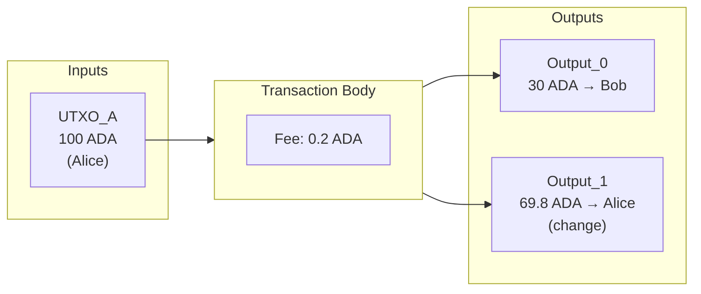
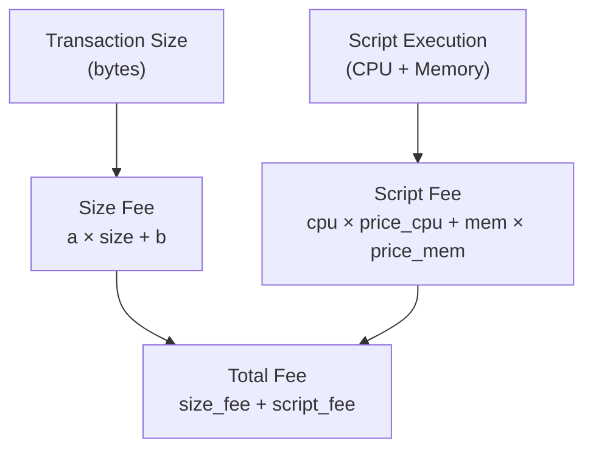
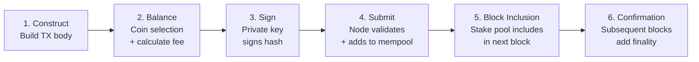

# Bài #06: Giao dịch

Giao dịch trên Cardano là một cấu trúc dữ liệu có chữ ký, tiêu thụ các UTXO hiện có làm đầu vào và tạo ra các UTXO mới làm đầu ra, chuyển giá trị theo các quy tắc của giao thức. Mọi việc chuyển giá trị, mọi lần thực thi hợp đồng thông minh và mọi lần đúc token đều bắt đầu và kết thúc bằng một giao dịch. Trên Cardano, mô hình giao dịch dựa trên UTXO mang đến một cách biểu diễn thay đổi trạng thái trên sổ cái mạnh mẽ và có thể dự đoán được.

Trong bài học này, chúng ta sẽ phân tích cấu trúc của một giao dịch Cardano từ bên trong ra bên ngoài. Bạn sẽ tìm hiểu cách đầu vào và đầu ra phối hợp với nhau, tại sao phí tồn tại và Cardano tính phí như thế nào, metadata có thể làm gì, khoảng thời gian hợp lệ bảo vệ bạn ra sao, và tất cả những điều này được tuần tự hóa thành định dạng nhị phân nhỏ gọn cho mạng lưới như thế nào.

## Cấu trúc của một giao dịch Cardano là gì?

Giao dịch Cardano là một cấu trúc dữ liệu khép kín mô tả một thay đổi được đề xuất lên sổ cái. Mỗi giao dịch bao gồm đầu vào (tham chiếu đến các UTXO hiện có để tiêu thụ), đầu ra (các UTXO mới được tạo ra), phí trả cho mạng lưới và chứng nhận (chữ ký mật mã chứng minh quyền ủy quyền).

Ngoài những yếu tố thiết yếu này, giao dịch có thể tùy chọn bao gồm metadata, khoảng thời gian hợp lệ, hướng dẫn đúc token, chứng chỉ, rút tiền và nhiều hơn nữa. Hãy bắt đầu với những yếu tố cơ bản.



### Đầu vào giao dịch

Đầu vào không phải là giá trị; nó là một *con trỏ* đến một UTXO hiện có trên sổ cái. Mỗi đầu vào được xác định bởi hai thông tin:

- **Mã hash giao dịch**: Mã hash của giao dịch đã tạo ra UTXO đó.
- **Chỉ số đầu ra**: Vị trí của đầu ra cụ thể trong giao dịch đó.

Kết hợp lại, chúng tạo thành một mã định danh duy nhất thường được viết dưới dạng `tx_hash#index`. Ví dụ, `a1b2c3...#0` tham chiếu đến đầu ra đầu tiên của giao dịch có mã hash `a1b2c3...`.

Khi một giao dịch bao gồm một đầu vào, nó tuyên bố: "Tôi muốn tiêu thụ UTXO cụ thể này." Giao thức xác minh rằng UTXO tồn tại, chưa bị tiêu dùng, và giao dịch cung cấp quyền ủy quyền hợp lệ (chữ ký hợp lệ từ khóa riêng của chủ sở hữu, hoặc đánh giá kịch bản thành công).

Hãy nghĩ về đầu vào như séc được rút tiền. Séc (UTXO) được viết tại một thời điểm nào đó trong quá khứ, và bây giờ bạn trình nó tại ngân hàng (mạng lưới) để chuyển đổi thành thứ gì đó mới.

### Đầu ra giao dịch

Mỗi đầu ra trong một giao dịch tạo ra một UTXO mới trên sổ cái. Một đầu ra chỉ định:

- **Địa chỉ**: Nơi giá trị được gửi đến (địa chỉ thanh toán, địa chỉ kịch bản, v.v.).
- **Giá trị**: Bao nhiêu ADA (tính bằng lovelace) và/hoặc các token gốc khác mà đầu ra chứa.
- **Datum tùy chọn**: Dữ liệu đính kèm vào đầu ra, chủ yếu được sử dụng với hợp đồng thông minh.

Một giao dịch có thể tạo ra nhiều đầu ra. Đây là cách bạn "trả lại tiền thừa." Nếu bạn có một UTXO trị giá 100 ADA và muốn gửi 30 ADA cho ai đó, giao dịch của bạn sẽ có hai đầu ra: một gửi 30 ADA cho người nhận, và một gửi khoảng 70 ADA trả lại cho bạn (trừ phí).

Quy tắc cơ bản là: **tổng tất cả giá trị đầu vào phải bằng tổng tất cả giá trị đầu ra cộng với phí.** Đây là nguyên tắc bảo toàn giá trị; ADA không thể được tạo ra hoặc bị phá hủy trong một giao dịch thông thường (đúc token là một cơ chế riêng biệt với các quy tắc riêng).

### Phương trình cân bằng

```
Sum(Inputs) = Sum(Outputs) + Fee
```

Phương trình này phải chính xác tuyệt đối. Không phải xấp xỉ; *chính xác*. Nếu có bất kỳ sai lệch nào, giao dịch không hợp lệ và mạng lưới sẽ từ chối. Đây là một khác biệt quan trọng so với các hệ thống dựa trên tài khoản, nơi bạn chỉ cần chỉ định "gửi X từ A đến B" và giao thức tự xử lý phép tính bên trong.

## Phí giao dịch trên Cardano được tính như thế nào?

Cardano tính phí giao dịch bằng công thức tuyến tính xác định dựa trên kích thước byte đã tuần tự hóa của giao dịch, cộng thêm thành phần dựa trên thực thi cho các kịch bản hợp đồng thông minh. Điều này có nghĩa là bạn có thể dự đoán chính xác phí trước khi gửi giao dịch; không có đấu giá, không có biến động giá gas, và không có chi phí bất ngờ.

Phí phục vụ nhiều mục đích:

1. **Ngăn chặn spam**: Nếu không có phí, kẻ tấn công có thể làm tràn mạng lưới với hàng triệu giao dịch vô nghĩa.
2. **Bồi thường cho các nhà điều hành nhóm cổ phần**: Phí là một phần của cơ chế thưởng khuyến khích các nút xác thực và tạo khối.
3. **Đảm bảo tính bền vững kinh tế**: Cơ chế phí giữ cho mạng lưới hoạt động lâu dài.

### Công thức tính phí hoạt động như thế nào?

Cardano sử dụng công thức phí đơn giản và xác định:

```
fee = a * tx_size_in_bytes + b
```

Trong đó:
- `a` là chi phí trên mỗi byte (tham số giao thức, hiện tại khoảng 44 lovelace mỗi byte).
- `b` là chi phí cơ bản cố định (hiện tại khoảng 155.381 lovelace, xấp xỉ 0,155381 ADA).
- `tx_size_in_bytes` là kích thước của giao dịch đã tuần tự hóa tính bằng byte.

Một giao dịch đơn giản thông thường tốn khoảng 0,17 đến 0,20 ADA. Các giao dịch phức tạp hơn với kịch bản, metadata hoặc nhiều đầu vào/đầu ra tốn nhiều hơn vì chúng có kích thước byte lớn hơn.



### Phí thực thi kịch bản được xử lý như thế nào?

Khi một giao dịch liên quan đến kịch bản Plutus (hợp đồng thông minh), có thêm chi phí dựa trên **đơn vị thực thi (ExUnits)**, đo thời gian CPU và mức tiêu thụ bộ nhớ. Chúng ta sẽ khám phá ExUnits chi tiết trong Bài 8, nhưng hiện tại, hãy biết rằng các giao dịch có kịch bản có hai thành phần phí: phí dựa trên kích thước và phí dựa trên thực thi.

```
total_fee = size_fee + script_execution_fee
```

Mô hình phí kép này đảm bảo rằng cả băng thông mạng (kích thước giao dịch) và tài nguyên tính toán (thực thi kịch bản) đều được định giá công bằng.

## Metadata giao dịch trên Cardano có thể làm gì?

Metadata giao dịch là dữ liệu có cấu trúc tùy ý được lưu trữ trên chuỗi, không ảnh hưởng đến tính hợp lệ của giao dịch hoặc trạng thái sổ cái một cách trực tiếp. Cardano tổ chức metadata dưới dạng bản đồ từ khóa số nguyên đến giá trị, trong đó giá trị có thể là chuỗi, số nguyên, mảng byte, danh sách hoặc bản đồ lồng nhau.

```
Metadata example:
{
  674: {
    "msg": ["Invoice #1234", "Payment for consulting services"]
  }
}
```

### Metadata được sử dụng để làm gì?

- **Tin nhắn giao dịch**: Đính kèm ghi chú có thể đọc được (tiêu chuẩn CIP-20 sử dụng khóa 674).
- **Thông tin đúc NFT**: CIP-25 định nghĩa cách metadata NFT (tên, hình ảnh, thuộc tính) được đính kèm trong quá trình đúc.
- **Danh tính phi tập trung**: Liên kết giao dịch trên chuỗi với các yêu cầu danh tính ngoài chuỗi.
- **Dấu vết kiểm toán**: Ghi lại ngữ cảnh logic kinh doanh bên cạnh các giao dịch tài chính.
- **Dữ liệu oracle**: Đăng dữ liệu bên ngoài lên chuỗi để hợp đồng thông minh tham chiếu.

### Giới hạn của metadata là gì?

Metadata **không** thể truy cập được bởi hợp đồng thông minh Plutus trong quá trình thực thi kịch bản. Một kịch bản xác thực không thể đọc metadata của giao dịch đã kích hoạt nó. Nếu bạn cần dữ liệu có sẵn cho kịch bản, bạn phải sử dụng datum (sẽ được đề cập trong Bài 9). Metadata hoàn toàn dành cho việc sử dụng ngoài chuỗi; ví, trình khám phá, bộ lập chỉ mục và ứng dụng đọc nó, nhưng logic xác thực của giao thức bỏ qua nó.

Metadata làm tăng kích thước giao dịch, từ đó tăng phí. Các tải metadata lớn có thể đẩy giao dịch đến giới hạn kích thước tối đa (hiện tại là 16 KB cho phần thân giao dịch).

## Khoảng thời gian hợp lệ bảo vệ giao dịch như thế nào?

Khoảng thời gian hợp lệ xác định một cửa sổ thời gian (biểu thị dưới dạng phạm vi số slot) trong đó giao dịch được coi là hợp lệ. Chúng cho bạn quyền kiểm soát chính xác khi nào mạng lưới có thể đưa giao dịch của bạn vào một khối, bảo vệ chống lại việc thực thi lỗi thời và cho phép logic hợp đồng thông minh có khóa thời gian.

```
validity_interval = {
  invalid_before: slot_500,
  invalid_hereafter: slot_1000
}
```

Giao dịch này chỉ hợp lệ nếu được đưa vào khối có số slot từ 500 đến 999 (bao gồm đầu, không bao gồm cuối).

### Tại sao khoảng thời gian hợp lệ quan trọng?

Trong các ứng dụng web truyền thống, yêu cầu thường được xử lý ngay lập tức hoặc hết thời gian. Nhưng giao dịch blockchain có thể nằm trong mempool hàng phút trước khi được đưa vào khối. Khoảng thời gian hợp lệ cho bạn quyền kiểm soát điều này:

- **Bảo vệ chống giao dịch lỗi thời**: Nếu giao dịch không được đưa vào đúng thời hạn, nó hết hạn thay vì thực thi trong trạng thái tương lai không mong đợi.
- **Hợp đồng có khóa thời gian**: Hợp đồng thông minh có thể thực thi rằng một số hành động chỉ xảy ra trước hoặc sau một thời điểm cụ thể. Ví dụ, hợp đồng gây quỹ cộng đồng có thể yêu cầu yêu cầu hoàn tiền chỉ hợp lệ sau thời hạn.
- **Lập luận thời gian xác định**: Vì giao thức Ouroboros của Cardano ánh xạ slot sang thời gian thực (mỗi slot là một giây trên mainnet), hợp đồng thông minh có thể lập luận về thời gian mà không cần oracle bên ngoài.

### Khoảng thời gian mở hoạt động như thế nào?

Bất kỳ giới hạn nào cũng có thể được bỏ qua:
- Không có `invalid_before`: Giao dịch hợp lệ từ đầu (slot 0).
- Không có `invalid_hereafter`: Giao dịch không bao giờ hết hạn (hợp lệ mãi mãi trong tương lai).
- Không chỉ định cả hai: Giao dịch không có ràng buộc thời gian nào.

Hầu hết các giao dịch chuyển ADA đơn giản bỏ qua giới hạn dưới và đặt giới hạn trên rộng rãi (thường là slot hiện tại cộng vài giờ), đảm bảo giao dịch không tồn tại vô thời hạn nếu có sự cố.

## Yêu cầu giá trị UTXO tối thiểu (Min ADA) là gì?

Cardano áp dụng giá trị ADA tối thiểu cho mỗi UTXO để ngăn chặn sổ cái phình to. Bạn không thể tạo đầu ra chứa ít hơn một lượng ADA nhất định vì mỗi UTXO tiêu thụ bộ nhớ trên mọi nút trong mạng lưới. Cho phép UTXO bụi (đầu ra với ADA rất nhỏ hoặc bằng không) sẽ làm phình tập UTXO và giảm hiệu suất mạng.

### Min UTXO được tính như thế nào?

ADA tối thiểu phụ thuộc vào kích thước của đầu ra. Một đầu ra đơn giản chỉ chứa ADA yêu cầu khoảng 1 ADA. Các đầu ra mang token gốc hoặc hash datum yêu cầu nhiều ADA hơn vì chúng lớn hơn:

```
Approximate min ADA values:
- Simple ADA-only output: ~1.0 ADA
- Output with one native token: ~1.2 ADA
- Output with datum hash: ~1.2 ADA
- Output with inline datum (small): ~1.5 ADA
- Output with many tokens: ~3-5 ADA (varies with count)
```

Công thức chính xác sử dụng kích thước tuần tự hóa của đầu ra và tham số giao thức gọi là `coinsPerUTxOByte` (hiện tại 4.310 lovelace mỗi byte). Đầu ra của bạn càng lớn, càng cần nhiều ADA đi kèm.

### Tác động thực tế của Min ADA là gì?

Bạn không thể gửi cho ai đó "chỉ một token"; bạn phải luôn đính kèm đủ ADA với nó. Nếu bạn đang xây dựng ứng dụng đúc NFT, bạn cần tính đến việc mỗi đầu ra NFT phải mang tối thiểu khoảng 1,5 đến 2 ADA. Đây là nguồn nhầm lẫn phổ biến cho các nhà phát triển đến từ Ethereum, nơi các token ERC-20 tồn tại độc lập với số dư ETH.

## Vòng đời giao dịch trên Cardano là gì?

Vòng đời giao dịch Cardano trải qua sáu giai đoạn: xây dựng, cân bằng, ký, gửi, đưa vào khối và xác nhận. Hiểu hành trình từ tạo ra đến hoàn tất giúp bạn xây dựng ứng dụng đáng tin cậy.



### Bước 1: Xây dựng

Ứng dụng (ví, dApp, công cụ CLI) xây dựng phần thân giao dịch: chọn đầu vào, xác định đầu ra, đặt phí, đính kèm metadata và xác định khoảng thời gian hợp lệ. Ở giai đoạn này, giao dịch chỉ là dữ liệu trong bộ nhớ.

### Bước 2: Cân bằng

Giao dịch phải được cân bằng; đầu vào phải đủ để trang trải đầu ra cộng phí. Ứng dụng chọn UTXO từ ví người dùng, tính phí dựa trên kích thước giao dịch ước tính, thêm đầu ra tiền thừa, và lặp lại cho đến khi phương trình cân bằng. Quá trình này gọi là **chọn đồng xu (coin selection)**.

### Bước 3: Ký

Phần thân giao dịch được hash, và khóa riêng của người dùng ký hash đó. Nếu nhiều đầu vào đến từ các địa chỉ khác nhau, có thể cần nhiều chữ ký. Các chữ ký trở thành chứng nhận của giao dịch.

### Bước 4: Gửi

Giao dịch đã ký được gửi đến một nút Cardano, thường thông qua API gửi cục bộ của nút hoặc dịch vụ từ xa như Blockfrost hoặc Koios. Nút thực hiện xác thực ban đầu:

- Tất cả đầu vào chưa được tiêu dùng?
- Các chứng nhận có khớp với đầu vào không?
- Phí có đáp ứng mức tối thiểu không?
- Khoảng thời gian hợp lệ có được thỏa mãn không?
- Tất cả đầu ra có đáp ứng yêu cầu min UTXO không?
- Nếu có kịch bản, chúng có vượt qua đánh giá không?

Nếu xác thực thành công, giao dịch vào **mempool** của nút (khu vực chứa các giao dịch hợp lệ nhưng chưa được xác nhận).

### Bước 5: Đưa vào khối

Nhà điều hành nhóm cổ phần, được giao thức Ouroboros chọn để tạo khối tiếp theo, chọn giao dịch từ mempool và đưa chúng vào khối mới. Khối được lan truyền qua mạng lưới.

### Bước 6: Xác nhận

Khi giao dịch nằm trong khối, nó có một xác nhận. Với mỗi khối tiếp theo, độ tin cậy tăng lên. Sau một độ sâu nhất định (thường là 2160 khối trên mainnet, tương ứng với tham số bảo mật k), giao dịch được coi là không thể thay đổi cho mục đích thực tế.

### Giao dịch có thể thất bại ở đâu?

Giao dịch có thể thất bại tại nhiều điểm:

- **Khi xây dựng**: Địa chỉ không hợp lệ, giá trị âm, vượt quá giới hạn kích thước.
- **Khi gửi**: Đầu vào đã tiêu dùng (tranh chấp UTXO), phí không đủ, khoảng thời gian hợp lệ đã hết hạn.
- **Không bao giờ sau khi mempool chấp nhận**: Giao dịch vượt qua xác thực gửi và vào mempool được *đảm bảo* sẽ cuối cùng được đưa vào khối (giả sử khoảng thời gian hợp lệ chưa qua). Không có khái niệm "giao dịch bị đảo ngược" như trên Ethereum; nếu nó hợp lệ khi gửi, nó hợp lệ khi được đưa vào.

Tính xác định này là nền tảng thiết kế của Cardano. Bạn biết chính xác kết quả của giao dịch trước khi gửi nó.

## Cardano tuần tự hóa giao dịch bằng CBOR như thế nào?

Cardano tuần tự hóa tất cả giao dịch bằng CBOR (Biểu diễn Đối tượng Nhị phân Ngắn gọn), một định dạng mã hóa nhị phân được định nghĩa trong RFC 8949. CBOR đóng vai trò tương đương JSON cho API web trên Cardano, ngoại trừ việc nó là nhị phân (nhỏ gọn và hiệu quả) thay vì dựa trên văn bản (dễ đọc).

### Tại sao Cardano sử dụng CBOR?

- **Gọn nhẹ**: Mã hóa nhị phân nhỏ hơn đáng kể so với JSON hoặc XML, giảm kích thước giao dịch và do đó giảm phí.
- **Tính xác định**: CBOR có các quy tắc mã hóa chính tắc rõ ràng, đảm bảo rằng cùng dữ liệu luôn tạo ra cùng các byte. Điều này rất quan trọng cho việc hash; nếu tuần tự hóa không xác định, cùng giao dịch logic có thể tạo ra các hash khác nhau.
- **Hỗ trợ đa ngôn ngữ**: Thư viện CBOR tồn tại cho hầu như mọi ngôn ngữ lập trình, giúp các triển khai khác nhau dễ dàng tương tác.
- **Linh hoạt lược đồ**: CBOR hỗ trợ cấu trúc dữ liệu lồng nhau phức tạp, bản đồ, mảng và giá trị có thẻ; tất cả những gì cần thiết để biểu diễn cấu trúc phong phú của giao dịch Cardano.

### CDDL là gì và nó định nghĩa cấu trúc giao dịch như thế nào?

Cardano định nghĩa cấu trúc chính xác của giao dịch bằng **CDDL (Ngôn ngữ Định nghĩa Dữ liệu Ngắn gọn)**, một ngôn ngữ lược đồ cho CBOR. Đặc tả CDDL định nghĩa mọi trường, kiểu dữ liệu, liệu nó có tùy chọn hay không, và cách nó ánh xạ sang mã hóa CBOR. Đây là tài liệu tham chiếu chính thức cho một giao dịch Cardano hợp lệ trông như thế nào ở cấp byte.

```
; Simplified CDDL for a Cardano transaction
transaction = [
  transaction_body,
  transaction_witness_set,
  bool,               ; is_valid flag
  auxiliary_data / null
]

transaction_body = {
  0 : set<transaction_input>,    ; inputs
  1 : [* transaction_output],    ; outputs
  2 : coin,                      ; fee
  ? 3 : uint,                    ; time to live (invalid_hereafter)
  ...
}
```

Bạn hiếm khi cần làm việc trực tiếp với CBOR thô. Các thư viện như `cardano-serialization-lib`, `Lucid`, `MeshJS` và `cardano-cli` xử lý tuần tự hóa và giải tuần tự hóa cho bạn. Nhưng hiểu rằng CBOR là định dạng nền tảng giúp bạn gỡ lỗi vấn đề, diễn giải dữ liệu trình khám phá khối, và hiểu cách tính kích thước giao dịch.

### Mã hash giao dịch được tính như thế nào?

Mã hash giao dịch (mã định danh duy nhất cho mỗi giao dịch) là hash Blake2b-256 của phần thân giao dịch đã tuần tự hóa CBOR (không phải toàn bộ giao dịch có chứng nhận). Điều này có nghĩa là:

- Mã hash được xác định trước khi ký (chứng nhận không phải là phần của thân).
- Bạn có thể tính ID giao dịch trước khi gửi nó.
- Các tập chứng nhận khác nhau cho cùng phần thân sẽ không thay đổi ID giao dịch.

## Tài sản thế chấp là gì và tại sao giao dịch kịch bản yêu cầu nó?

Đầu vào tài sản thế chấp là các UTXO mà Cardano tiêu thụ nếu kịch bản Plutus thất bại trong quá trình xác thực giai đoạn 2. Khi giao dịch liên quan đến kịch bản Plutus, nó phải bao gồm tài sản thế chấp vì mạng lưới đã chi tài nguyên tính toán để đánh giá kịch bản. Nếu kịch bản thất bại, các đầu vào và đầu ra thông thường bị loại bỏ, nhưng tài sản thế chấp bị lấy làm bồi thường.

Các quy tắc chính cho tài sản thế chấp:
- Đầu vào tài sản thế chấp phải là UTXO chỉ chứa ADA đơn giản (không có token gốc, không có datum).
- Tài sản thế chấp phải đủ ít nhất 150% phí giao dịch (tỷ lệ phần trăm này là tham số giao thức).
- Nếu kịch bản thành công, tài sản thế chấp không bị ảnh hưởng.
- Kể từ nâng cấp Vasil, có thể chỉ định **đầu ra hoàn trả tài sản thế chấp**, nên chỉ có đúng số tiền tài sản thế chấp bị tịch thu thay vì toàn bộ UTXO.

Cơ chế này bảo vệ mạng lưới đồng thời đảm bảo người dùng trung thực không bị phạt.

## Đầu vào tham chiếu trên Cardano hoạt động như thế nào?

Đầu vào tham chiếu (được giới thiệu trong hard fork Vasil thông qua CIP-31) cho phép giao dịch đọc UTXO mà không tiêu thụ nó. Khả năng này biến đổi nhiều trường hợp sử dụng bằng cách cho phép truy cập dữ liệu chia sẻ, không tranh chấp.

- **Dữ liệu chia sẻ**: Oracle có thể đăng dữ liệu trong UTXO, và nhiều giao dịch có thể đọc đồng thời mà không tranh chấp.
- **Kịch bản tham chiếu**: Kịch bản có thể được lưu trữ trong UTXO và tham chiếu bởi các giao dịch cần nó, thay vì bao gồm toàn bộ kịch bản trong mỗi giao dịch (tiết kiệm phí).
- **Giảm tranh chấp**: Trong mô hình chuẩn, hai giao dịch cố gắng tiêu thụ cùng đầu vào sẽ xung đột. Đầu vào tham chiếu loại bỏ điều này cho truy cập chỉ đọc.

```
Transaction:
  Inputs (consumed):
    - UTXO_A (Alice's payment)

  Reference Inputs (read-only):
    - UTXO_Oracle (price feed data)
    - UTXO_Script (reference script)

  Outputs:
    - Output_0: result of computation using oracle data
```

## So sánh với Web2

Nếu bạn đến từ phát triển web, đây là cách giao dịch Cardano ánh xạ sang các khái niệm quen thuộc:

**Giao dịch như yêu cầu HTTP**: Giao dịch Cardano giống như yêu cầu HTTP đến REST API. Bạn xây dựng nó (tạo yêu cầu), ký nó (đính kèm header xác thực), gửi nó (gửi yêu cầu), và nhận xác nhận (nhận phản hồi). Khác biệt chính là giao dịch blockchain là bất đồng bộ; bạn không nhận được phản hồi ngay lập tức, mà phải chờ đợi đưa vào khối.

**Đầu vào/Đầu ra như giao dịch cơ sở dữ liệu với ACID**: Mô hình UTXO tương tự như giao dịch cơ sở dữ liệu đọc và ghi các hàng một cách nguyên tử. Đầu vào giống như `SELECT ... FOR UPDATE` (khóa hàng để sửa đổi), và đầu ra giống như câu lệnh `INSERT` tạo hàng mới. Đảm bảo tính nguyên tử có nghĩa là toàn bộ giao dịch thành công hoặc thất bại; không có cập nhật một phần, giống như giao dịch cơ sở dữ liệu tuân thủ ACID đúng cách.

**Phí như giới hạn tốc độ API**: Phí giao dịch hoạt động giống như giới hạn tốc độ API hoặc định giá dựa trên sử dụng trong dịch vụ đám mây. Cũng như AWS tính phí theo yêu cầu API Gateway hoặc Stripe tính phí theo giao dịch, Cardano tính phí theo giao dịch dựa trên kích thước và độ phức tạp. Phí ngăn chặn lạm dụng (như giới hạn tốc độ ngăn DDoS) đồng thời bồi thường cho các nhà điều hành hạ tầng (như phí sử dụng bồi thường cho nhà cung cấp đám mây).

**Khoảng thời gian hợp lệ như thời gian chờ yêu cầu**: Trường `invalid_hereafter` tương tự thời gian chờ yêu cầu HTTP hoặc trường `exp` (hết hạn) của JWT token. Nếu giao dịch không được xử lý trong cửa sổ, nó bị loại bỏ; giống như JWT hết hạn bị máy chủ từ chối.

**CBOR như Protocol Buffers**: Cũng như dịch vụ web có thể sử dụng Protocol Buffers hoặc MessagePack thay vì JSON để hiệu quả hơn, Cardano sử dụng CBOR thay vì định dạng dựa trên văn bản. Động lực giống nhau: tải trọng nhỏ hơn, phân tích nhanh hơn, và mã hóa xác định.

**Metadata như Header HTTP**: Metadata giao dịch tương tự header HTTP tùy chỉnh; thông tin bổ sung đi kèm tải trọng chính nhưng không ảnh hưởng đến logic xử lý cốt lõi. Header `X-Request-ID` không thay đổi những gì API thực hiện, cũng như metadata không thay đổi những gì giao dịch thực hiện.

**Tài sản thế chấp như tiền đặt cọc bảo đảm**: Tài sản thế chấp giống như tiền đặt cọc bảo đảm trên tài khoản dịch vụ đám mây hoặc khoản giữ được ủy quyền trước trên thẻ tín dụng. Nếu hợp đồng thông minh của bạn thất bại (tương tự ứng dụng bị sập và tiêu thụ tài nguyên máy chủ), tài sản thế chấp trang trải chi phí. Nếu mọi thứ hoạt động tốt, bạn giữ lại tiền đặt cọc.

## Các điểm chính

- **Giao dịch là đơn vị thay đổi nguyên tử** trên Cardano. Mọi sửa đổi lên sổ cái xảy ra thông qua giao dịch tiêu thụ UTXO hiện có (đầu vào) và tạo ra UTXO mới (đầu ra).
- **Phí xác định và có thể dự đoán**, được tính từ kích thước byte của giao dịch và (cho kịch bản) chi phí thực thi. Không có đấu giá gas hoặc biến động thị trường phí.
- **Khoảng thời gian hợp lệ cho bạn kiểm soát dựa trên thời gian** về thời điểm giao dịch có thể được xử lý, cho phép bảo vệ hết hạn và logic hợp đồng thông minh có khóa thời gian.
- **Quy tắc min UTXO đảm bảo sức khỏe sổ cái** bằng cách ngăn đầu ra bụi phình tập UTXO; mỗi đầu ra phải mang đủ ADA để biện minh cho chi phí lưu trữ.
- **Tuần tự hóa CBOR là mã hóa phổ quát** giúp giao dịch Cardano nhỏ gọn, xác định và tương tác được trên mọi công cụ và ngôn ngữ.

## Tiếp theo

Bây giờ bạn đã hiểu cách giao dịch di chuyển giá trị và dữ liệu trên sổ cái, đã đến lúc khám phá tầng lập trình nằm phía trên chúng. Trong Bài 7, chúng ta giới thiệu hợp đồng thông minh về mặt khái niệm: trình xác thực là gì, cách mã trên chuỗi và ngoài chuỗi tương tác, và tại sao cách tiếp cận của Cardano đối với khả năng lập trình khác biệt cơ bản so với những gì bạn có thể đã thấy trên các blockchain khác.
