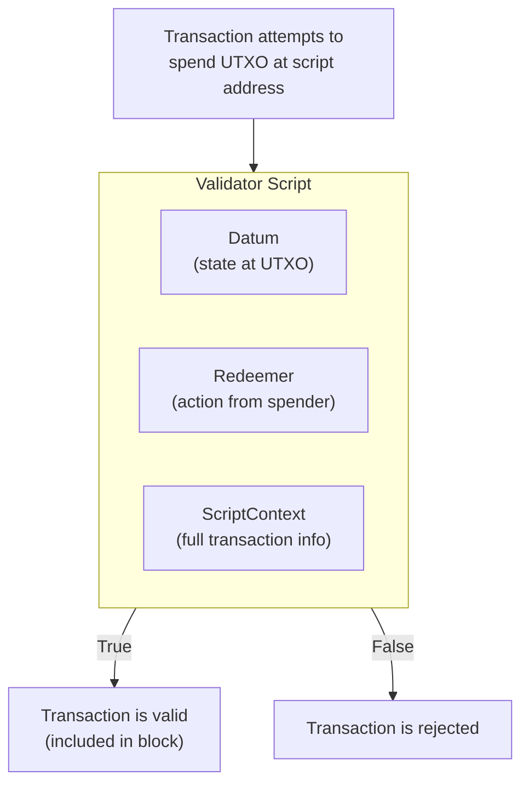
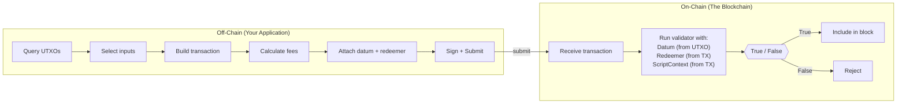
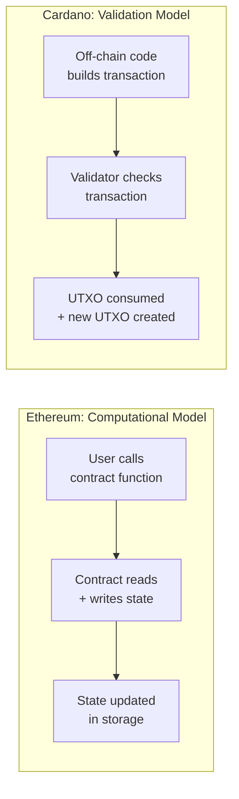

# Bài #07: Hợp đồng thông minh về mặt khái niệm

Hợp đồng thông minh trên Cardano là một trình xác thực: một hàm thuần túy kiểm tra giao dịch được đề xuất và trả về "có, điều này được phép" hoặc "không, điều này không được phép." Trình xác thực không duy trì trạng thái, không phơi bày các hàm có thể gọi, và không sửa đổi bộ nhớ. Chúng chỉ đơn giản xác thực. Điều này khiến cách tiếp cận của Cardano khác biệt cơ bản so với các chuỗi dựa trên tài khoản như Ethereum.

Trong bài học này, chúng ta xây dựng mô hình tư duy về hợp đồng thông minh trên Cardano. Bạn sẽ tìm hiểu trình xác thực làm gì, tại sao Cardano tách biệt logic trên chuỗi và ngoài chuỗi, tính xác định có ý nghĩa gì trong thực tế, và mô hình của Cardano so sánh với Ethereum như thế nào. Khi kết thúc, bạn sẽ có thể lập luận về thiết kế hợp đồng thông minh mà không cần hiểu bất kỳ ngôn ngữ lập trình cụ thể nào.

## Hợp đồng thông minh trên Cardano là gì?

Hợp đồng thông minh trên Cardano là kịch bản xác thực nhận thông tin về giao dịch được đề xuất và trả về quyết định boolean: cho phép hoặc từ chối. Khác với hợp đồng Ethereum lưu trữ trạng thái và phơi bày các hàm có thể gọi, trình xác thực Cardano là các hàm thuần túy, không trạng thái, chỉ xác thực liệu giao dịch có đáp ứng các quy tắc được xác định trước hay không.

Ở mức tổng quát nhất, hợp đồng thông minh là **mã chạy trên blockchain và thực thi các quy tắc về cách giá trị có thể di chuyển**. Nhưng định nghĩa đó mơ hồ một cách nguy hiểm, bởi vì *cách thức* rất quan trọng.

Trên Ethereum, hợp đồng thông minh là một chương trình tồn tại bền vững tại một địa chỉ, duy trì trạng thái riêng (biến lưu trữ), và phơi bày các hàm mà bất kỳ ai cũng có thể gọi. Khi bạn tương tác với hợp đồng thông minh Ethereum, về cơ bản bạn đang gọi một hàm đọc và ghi vào trạng thái có thể thay đổi toàn cục.

Trên Cardano, hợp đồng thông minh là một **trình xác thực** kiểm tra giao dịch được đề xuất và trả về `True` hoặc `False`. Nó không duy trì trạng thái. Nó không phơi bày các hàm có thể gọi. Nó không sửa đổi bộ nhớ.

Sự khác biệt này là cơ bản, và mọi thứ khác trong bài học này đều bắt nguồn từ đó.

## Trình xác thực Cardano hoạt động như thế nào?

Trình xác thực Cardano là các kịch bản được liên kết với địa chỉ blockchain, thực thi khi ai đó cố gắng chi tiêu một UTXO tại địa chỉ kịch bản đó. Trình xác thực nhận ba đối số (datum, redeemer và script context), kiểm tra giao dịch, và trả về `True` để chấp thuận hoặc `False` để từ chối toàn bộ giao dịch.



### Trình xác thực có thể thấy gì?

Trình xác thực có quyền truy cập ba thông tin (sẽ được khám phá sâu trong Bài 9):

1. **Datum**: Dữ liệu đính kèm vào UTXO đang được chi tiêu; hãy nghĩ về nó như "trạng thái" lưu trữ tại địa chỉ kịch bản này.
2. **Redeemer**: Dữ liệu được cung cấp bởi người cố gắng chi tiêu UTXO; hãy nghĩ về nó như "hành động" hoặc "đối số" họ đang gửi.
3. **ScriptContext**: Thông tin về chính giao dịch: tất cả đầu vào, tất cả đầu ra, phí, khoảng thời gian hợp lệ, ai đã ký, cái gì đang được đúc, và nhiều hơn nữa.

Trình xác thực sử dụng ba đầu vào này để đưa ra quyết định. Nó có thể kiểm tra những điều như:

- "Giao dịch này có được ký bởi khóa công khai đúng không?"
- "Đầu ra có gửi ít nhất 10 ADA trở lại địa chỉ kịch bản không?"
- "Thời gian hiện tại có sau thời hạn không?"
- "Giao dịch có đúc chính xác một token với chính sách đúng không?"

### Các giới hạn của trình xác thực là gì?

Điều này cũng quan trọng không kém. Trình xác thực Cardano **không thể**:

- Thực hiện yêu cầu mạng hoặc truy cập dữ liệu bên ngoài trực tiếp.
- Tạo số ngẫu nhiên.
- Sửa đổi trạng thái (nó không có bộ nhớ ghi được).
- Gọi các hợp đồng khác một cách bắt buộc (nó chỉ có thể kiểm tra rằng các điều kiện nhất định về giao dịch được thỏa mãn).
- Lặp vô hạn (ngân sách thực thi bắt buộc kết thúc).

Những giới hạn này là tính năng, không phải lỗi. Chúng làm cho trình xác thực **xác định**: cùng đầu vào luôn tạo ra cùng đầu ra. Đây là nền tảng cho các đảm bảo về tính dự đoán của Cardano.

## Mã trên chuỗi khác với mã ngoài chuỗi như thế nào?

Mã trên chuỗi là kịch bản xác thực chạy trên mọi nút xác thực và trả lời "giao dịch này có hợp lệ không?" Mã ngoài chuỗi chạy trên máy người dùng, xây dựng giao dịch đúng định dạng, và trả lời "làm thế nào để xây dựng giao dịch mà trình xác thực sẽ chấp nhận?" Sự tách biệt này cho phép hiệu quả, linh hoạt và khả năng kiểm thử độc lập.



### Mã trên chuỗi: Trình xác thực

Mã trên chuỗi là chính kịch bản xác thực. Nó chạy trên mọi nút xác thực giao dịch. Vì nó chạy trên hàng trăm hoặc hàng nghìn máy, nó phải:

- **Nhỏ gọn**: Mỗi byte kịch bản tốn phí và tiêu thụ tài nguyên.
- **Hiệu quả**: Thực thi bị giới hạn bởi CPU và giới hạn bộ nhớ (ExUnits).
- **Thuần túy**: Không có hiệu ứng phụ, không I/O, không thay đổi trạng thái.
- **Xác định**: Cùng đầu vào phải luôn tạo ra cùng kết quả.

Mã trên chuỗi trả lời một câu hỏi: "Giao dịch này có hợp lệ theo quy tắc của tôi không?"

### Mã ngoài chuỗi: Trình xây dựng giao dịch

Mã ngoài chuỗi chạy trên máy người dùng (hoặc máy chủ backend). Nó chịu trách nhiệm:

- Truy vấn blockchain để tìm UTXO có sẵn.
- Chọn UTXO nào để sử dụng làm đầu vào.
- Xây dựng phần thân giao dịch với đầu ra, phí và metadata đúng.
- Cung cấp giá trị datum và redeemer chính xác.
- Cân bằng giao dịch (đảm bảo đầu vào = đầu ra + phí).
- Ký và gửi giao dịch.

Mã ngoài chuỗi trả lời một câu hỏi khác: "Làm thế nào để xây dựng giao dịch mà trình xác thực sẽ chấp nhận?"

### Chúng liên quan với nhau như thế nào?

Hãy nghĩ theo cách này: mã ngoài chuỗi là **luật sư soạn hợp đồng**, và mã trên chuỗi là **thẩm phán xem xét hợp đồng**. Luật sư thực hiện công việc sáng tạo, phức tạp để tìm ra thỏa thuận nên như thế nào. Thẩm phán chỉ đơn giản kiểm tra xem nó có tuân thủ quy tắc hay không.

Sự tách biệt này có những hàm ý sâu sắc:

- **Hiệu quả**: Blockchain chỉ chạy logic xác thực, không chạy logic xây dựng. Điều này giúp thực thi trên chuỗi rẻ hơn đáng kể.
- **Linh hoạt**: Mã ngoài chuỗi có thể được viết bằng bất kỳ ngôn ngữ nào và sử dụng bất kỳ thư viện nào. Chỉ trình xác thực cần biên dịch thành mã trên chuỗi.
- **Khả năng kiểm thử**: Bạn có thể kiểm thử logic ngoài chuỗi và trên chuỗi một cách độc lập.
- **Khả năng nâng cấp**: Bạn có thể cập nhật mã ngoài chuỗi (cách xây dựng giao dịch) mà không thay đổi trình xác thực trên chuỗi.

## Tại sao tính xác định quan trọng đối với hợp đồng thông minh Cardano?

Tính xác định có nghĩa là kết quả của giao dịch hoàn toàn có thể biết trước khi gửi. Khi bạn xây dựng giao dịch Cardano cục bộ và nó vượt qua xác thực, bạn có thể tự tin rằng nó cũng sẽ vượt qua xác thực trên blockchain. Kết quả không thay đổi giữa kiểm thử cục bộ và thực thi thực tế, loại bỏ phí lãng phí, front-running và tấn công MEV.

### Cardano đạt được tính xác định như thế nào?

Một số lựa chọn thiết kế góp phần vào đặc tính này:

1. **Mô hình UTXO**: Đầu vào giao dịch là các UTXO cụ thể, không phải số dư tài khoản. Trạng thái mà giao dịch đọc được cố định tại thời điểm xây dựng, không phải tại thời điểm thực thi.

2. **Không có trạng thái có thể thay đổi toàn cục**: Trình xác thực không đọc từ hoặc ghi vào bộ nhớ chia sẻ. Chúng chỉ thấy giao dịch mà chúng đang xác thực.

3. **Xử lý thời gian rõ ràng**: Thời gian được biểu thị dưới dạng phạm vi slot trong khoảng thời gian hợp lệ, không phải "thời gian hiện tại khi nó xảy ra được thực thi." Trình xác thực biết giao dịch chỉ có thể được đưa vào trong cửa sổ thời gian cụ thể.

4. **Hàm thuần túy**: Trình xác thực là các hàm toán học; cùng đầu vào, cùng đầu ra, mọi lúc. Không có tính ngẫu nhiên, không có nguồn dữ liệu bên ngoài, không có trạng thái môi trường.

### Tại sao Ethereum không xác định?

Trên Ethereum, kết quả giao dịch có thể thay đổi giữa khi bạn gửi và khi nó thực thi vì:

- Các giao dịch khác có thể sửa đổi cùng biến trạng thái trước khi giao dịch của bạn chạy.
- Giá gas có thể thay đổi, gây ra các đường dẫn thực thi khác nhau.
- Dấu thời gian khối và các giá trị môi trường khác không được biết tại thời điểm gửi.
- Thứ tự giao dịch trong khối được kiểm soát bởi thợ đào/trình xác thực, dẫn đến các tấn công MEV (Maximal Extractable Value).

Tính không xác định này là lý do tại sao giao dịch Ethereum có thể "thất bại" sau khi gửi (hoàn ngược và tiêu thụ gas) và tại sao MEV là vấn đề nghiêm trọng. Thiết kế xác định của Cardano loại bỏ những vấn đề này ngay từ đầu.

### Lợi ích thực tế của tính xác định là gì?

Tính xác định có nghĩa là:
- **Không lãng phí phí**: Nếu giao dịch sẽ thất bại, bạn biết trước khi gửi. Bạn không bao giờ trả phí cho giao dịch thất bại (ngoại lệ duy nhất là lỗi kịch bản giai đoạn 2, khi tài sản thế chấp bị tiêu thụ; nhưng đây là lỗi trong mã ngoài chuỗi, không phải sự bất định cơ bản).
- **Không bị front-running**: Vì kết quả được cố định tại thời điểm xây dựng và không phụ thuộc vào thứ tự giao dịch, tấn công MEV không thể xảy ra cấu trúc cho hầu hết các loại giao dịch.
- **Chi phí dự đoán được**: Bạn biết chính xác giao dịch sẽ tốn bao nhiêu trước khi gửi.

## Địa chỉ kịch bản trên Cardano hoạt động như thế nào?

Địa chỉ kịch bản là địa chỉ trên chuỗi được tạo ra từ hash của kịch bản xác thực đã biên dịch. Bất kỳ ai cũng có thể gửi ADA hoặc token đến địa chỉ này, tạo ra các UTXO bị "khóa" bởi trình xác thực. Để chi tiêu những UTXO đó, giao dịch phải thỏa mãn các điều kiện của trình xác thực bằng cách cung cấp redeemer hợp lệ và vượt qua đánh giá.

### Quy trình tạo địa chỉ kịch bản là gì?

1. Bạn viết trình xác thực (bằng Plutus, Aiken hoặc ngôn ngữ khác).
2. Trình xác thực biên dịch thành UPLC (Untyped Plutus Lambda Calculus), mã byte cấp thấp trên chuỗi.
3. Hash của kịch bản đã biên dịch xác định địa chỉ kịch bản.
4. UTXO gửi đến địa chỉ này chỉ có thể được chi tiêu bởi giao dịch vượt qua trình xác thực.

```
Validator Source Code (Aiken, Plutus, etc.)
        |
        v  [Compilation]
UPLC Bytecode
        |
        v  [Blake2b-224 Hash]
Script Hash
        |
        v  [Address Construction]
Script Address (addr1w8...)
        |
        v
UTXOs locked at this address
require the validator to approve spending
```

### Địa chỉ kịch bản khác với địa chỉ thanh toán như thế nào?

Địa chỉ thanh toán thông thường (như địa chỉ ví của Alice) được tạo từ khóa công khai. Để chi tiêu từ đó, bạn cần chữ ký từ khóa riêng tương ứng. Đơn giản.

Địa chỉ kịch bản được tạo từ hash kịch bản. Để chi tiêu từ đó, bạn cần cung cấp redeemer và (tùy thuộc vào era) chính kịch bản, và kịch bản phải đánh giá thành `True`. Không có khóa riêng; kịch bản CHÍNH LÀ cơ chế ủy quyền.

Điều này cực kỳ mạnh mẽ. Nó có nghĩa là logic ủy quyền có thể phức tạp tùy ý:

- Yêu cầu đa chữ ký ("3 trong 5 thành viên hội đồng phải ký").
- Điều kiện dựa trên thời gian ("quỹ chỉ có thể được rút sau ngày 1 tháng 1 năm 2027").
- Điều kiện dựa trên giá trị ("ít nhất 50% giá trị phải đến địa chỉ cụ thể").
- Truy cập theo token ("giao dịch phải bao gồm một NFT cụ thể làm đầu vào").

## Mô hình hợp đồng thông minh của Cardano khác với Ethereum như thế nào?

Cardano sử dụng mô hình xác thực nơi trình xác thực kiểm tra xem giao dịch đã xây dựng sẵn có được phép hay không, trong khi Ethereum sử dụng mô hình tính toán nơi hợp đồng thực thi thay đổi trạng thái theo kiểu mệnh lệnh. Trình xác thực Cardano không có trạng thái tồn tại bền vững và không có hàm gọi được; hợp đồng Ethereum lưu trữ trạng thái và phơi bày điểm cuối hàm.



### Ethereum: Tính toán đa năng

Trên Ethereum, hợp đồng thông minh là các đối tượng tồn tại bền vững với:
- **Trạng thái**: Biến lưu trữ tồn tại giữa các lần gọi.
- **Hàm**: Điểm truy cập có thể gọi để sửa đổi trạng thái.
- **Gọi tin nhắn**: Hợp đồng có thể gọi các hợp đồng khác, tạo chuỗi gọi phức tạp.
- **Mô hình gas**: Bạn trả tiền cho mỗi bước tính toán, và nếu hết gas giữa chừng thực thi, giao dịch hoàn ngược (nhưng gas vẫn bị tiêu thụ).

Hợp đồng Ethereum có thể nói: "Khi ai đó gọi `transfer(to, amount)`, kiểm tra số dư của họ, trừ từ slot lưu trữ của họ, thêm vào slot lưu trữ của người nhận."

### Cardano: Xác thực, không phải tính toán

Trên Cardano, trình xác thực không tính toán kết quả; chúng xác thực giao dịch đã được xây dựng ngoài chuỗi:

- **Không có trạng thái tồn tại bền vững**: Trạng thái được mã hóa trong UTXO (qua datum), không phải trong bộ nhớ hợp đồng.
- **Không có hàm gọi được**: Không có "gọi hợp đồng này." Thay vào đó, bạn "chi tiêu UTXO tại địa chỉ kịch bản này."
- **Không có gọi hợp đồng-sang-hợp đồng**: Giao dịch có thể liên quan đến nhiều trình xác thực (chi tiêu UTXO từ các địa chỉ kịch bản khác nhau), và mỗi trình xác thực chạy độc lập. Chúng có thể quan sát cùng ngữ cảnh giao dịch, nhưng không gọi lẫn nhau.
- **Không tiêu thụ gas khi thất bại**: Nếu giao dịch thất bại xác thực cục bộ, nó không bao giờ được gửi và không tốn chi phí.

### Ví dụ cụ thể so sánh như thế nào?

Xét một escrow đơn giản: Alice khóa quỹ cho Bob, và Bob có thể yêu cầu chúng bằng cách cung cấp bí mật.

**Cách tiếp cận Ethereum:**
```
contract Escrow {
    address payable beneficiary;
    bytes32 secretHash;

    function claim(bytes secret) {
        require(hash(secret) == secretHash);   // check secret
        beneficiary.transfer(address(this).balance);  // move funds
    }
}
```
Hợp đồng lưu trữ trạng thái (beneficiary, secretHash), phơi bày hàm (claim), và chuyển quỹ theo kiểu mệnh lệnh.

**Cách tiếp cận Cardano:**
Trình xác thực chỉ kiểm tra: "Giao dịch có cung cấp redeemer có hash khớp với datum không? Nếu có, chấp thuận. Nếu không, từ chối."
```
validator escrow(datum: SecretHash, redeemer: Secret, ctx: ScriptContext) -> Bool {
    hash(redeemer) == datum
}
```
Mã ngoài chuỗi chịu trách nhiệm xây dựng giao dịch gửi quỹ cho Bob. Trình xác thực chỉ kiểm tra điều kiện có được đáp ứng hay không. Việc "chuyển quỹ" thực sự được mã hóa trong đầu ra của giao dịch, không được thực thi bởi kịch bản.

### Sự khác biệt triết học là gì?

Ethereum nói: "Hãy cho tôi biết phải làm gì, và tôi sẽ thực hiện."
Cardano nói: "Hãy cho tôi thấy bạn muốn làm gì, và tôi sẽ cho bạn biết nó có được phép không."

Đây là lý do tại sao mô hình của Cardano đôi khi được gọi là **mô hình "khai báo" hoặc "xác thực"** so với **mô hình "mệnh lệnh" hoặc "tính toán"** của Ethereum. Không cái nào tốt hơn về bản chất, nhưng chúng dẫn đến kiến trúc, mẫu thiết kế và sự đánh đổi rất khác nhau.

## Cardano hỗ trợ những loại kịch bản nào?

Cardano hỗ trợ nhiều loại kịch bản: kịch bản đơn giản (native) cho yêu cầu chữ ký và khóa thời gian cơ bản, và kịch bản Plutus (V1, V2, V3) cho logic xác thực hoàn chỉnh Turing. Ngoài ra, các kịch bản chuyên biệt phục vụ như chính sách đúc và trình xác thực staking.

### Kịch bản đơn giản (Native Scripts)

Đây là các kịch bản cơ bản, không hoàn chỉnh Turing, có sẵn trước Plutus. Chúng hỗ trợ:
- **Yêu cầu chữ ký**: "Phải được ký bởi khóa X."
- **Khóa thời gian**: "Chỉ hợp lệ sau slot N" hoặc "Chỉ hợp lệ trước slot M."
- **Đa chữ ký**: "Yêu cầu chữ ký từ ít nhất K trong N khóa này."
- **Kết hợp logic**: AND, OR, và kết hợp ngưỡng của các điều trên.

Kịch bản đơn giản nhẹ và không yêu cầu phí thực thi ngoài phí giao dịch tiêu chuẩn. Chúng thường được sử dụng cho ví đa chữ ký và chính sách đúc có khóa thời gian.

### Kịch bản Plutus (V1, V2, V3)

Kịch bản Plutus là trình xác thực hoàn chỉnh Turing được viết bằng ngôn ngữ cấp cao và biên dịch thành UPLC. Chúng có thể biểu diễn logic xác thực tùy ý và đã phát triển qua nhiều phiên bản:

- **Plutus V1** (era Alonzo): Khả năng hợp đồng thông minh ban đầu. Ngữ cảnh kịch bản hạn chế.
- **Plutus V2** (era Vasil): Thêm đầu vào tham chiếu, datum nội tuyến, kịch bản tham chiếu, và ngữ cảnh kịch bản phong phú hơn.
- **Plutus V3** (hard fork Chang, era Conway): Thêm tính năng liên quan đến quản trị, nguyên thủy mật mã mới, và tối ưu hóa thêm.

Mỗi phiên bản mở rộng những gì trình xác thực có thể thấy và làm, mà không phá vỡ tính tương thích ngược.

### Chính sách đúc

Chính sách đúc là loại kịch bản đặc biệt kiểm soát việc token gốc có thể được đúc hay đốt. Khi giao dịch bao gồm trường mint, kịch bản chính sách đúc tương ứng được thực thi. Chúng ta sẽ khám phá chính sách đúc kỹ lưỡng trong Bài 10.

### Trình xác thực staking

Các kịch bản này kiểm soát ủy quyền cổ phần và rút phần thưởng cho thông tin xác thực staking dựa trên kịch bản. Chúng ít phổ biến hơn nhưng quan trọng cho các ứng dụng cấp giao thức.

## Mô hình eUTXO cho phép hợp đồng thông minh như thế nào?

Mô hình Extended UTXO (eUTXO) nâng cao mô hình UTXO cơ bản bằng cách thêm datum (dữ liệu tùy ý đính kèm vào UTXO), redeemer (dữ liệu hành động từ người chi tiêu), ngữ cảnh kịch bản phong phú (khả năng nhìn toàn bộ giao dịch), và kịch bản xác thực (địa chỉ có thể lập trình). Những mở rộng này biến đổi việc chuyển giá trị đơn giản thành nền tảng hợp đồng thông minh đầy đủ trong khi bảo toàn tính xác định và song song.

```
Basic UTXO:                    Extended UTXO (EUTXO):
+------------------+           +---------------------------+
| Address          |           | Script Address            |
| Value (ADA)      |           | Value (ADA + tokens)      |
+------------------+           | Datum (arbitrary data)    |
                               | Reference Script (optional)|
                               +---------------------------+

Spent by:                      Spent by:
  Signature from               Transaction that passes
  private key                  the validator with a
                               redeemer and valid context
```

Những mở rộng này biến đổi mô hình UTXO từ cơ chế chuyển giá trị đơn giản thành nền tảng hợp đồng thông minh đầy đủ, đồng thời bảo toàn các lợi ích của mô hình UTXO là tính xác định, song song và xác thực cục bộ.

## So sánh với Web2

Hãy ánh xạ những khái niệm này sang các mẫu bạn đã biết từ phát triển web.

**Trình xác thực như Middleware xác thực**: Trong Express.js hoặc bất kỳ framework web nào, bạn viết middleware kiểm tra yêu cầu đến trước khi chúng đến route handler. Trình xác thực Cardano là middleware cho blockchain; nó kiểm tra "yêu cầu" (giao dịch) và cho phép đi qua hoặc từ chối. Khác biệt quan trọng là middleware blockchain bất biến khi triển khai và chạy trên mọi nút, không chỉ trên máy chủ của bạn.

**Trình xác thực như ràng buộc cơ sở dữ liệu**: Hãy nghĩ về ràng buộc `CHECK`, ràng buộc `FOREIGN KEY`, hoặc hàm trigger trong PostgreSQL. Chúng không tự thực hiện insert hay update; chúng xác thực rằng thay đổi được đề xuất đáp ứng các quy tắc nhất định. Trình xác thực Cardano chính xác là điều này: một ràng buộc về những thay đổi nào được phép đối với UTXO tại địa chỉ của nó.

**Mã ngoài chuỗi như logic API Client**: Trong kiến trúc web điển hình, frontend (React, Vue) xây dựng yêu cầu API: chọn tham số, định dạng payload, xử lý token xác thực. Máy chủ (trình xác thực) sau đó xác thực và xử lý yêu cầu. Mã ngoài chuỗi của Cardano đóng vai trò giống frontend: xây dựng "yêu cầu" (giao dịch) đúng định dạng mà "máy chủ" trên chuỗi (trình xác thực) sẽ chấp nhận.

**Hàm Serverless với Đầu vào/Đầu ra**: Hàm AWS Lambda nhận sự kiện đầu vào, xử lý, và trả về kết quả. Chúng không duy trì kết nối bền vững hoặc trạng thái tồn tại lâu dài. Trình xác thực Cardano tương tự; chúng được gọi với đầu vào cụ thể (datum, redeemer, context), chạy tính toán thuần túy, và trả về kết quả boolean. Mỗi lần gọi là độc lập.

**Địa chỉ kịch bản như điểm cuối API được bảo vệ**: Địa chỉ kịch bản giống như điểm cuối API yêu cầu xác thực và ủy quyền cụ thể để truy cập. Bất kỳ ai cũng có thể gửi dữ liệu đến nó (tạo UTXO), nhưng chỉ yêu cầu được ủy quyền, đúng định dạng (giao dịch với redeemer chính xác) mới có thể lấy dữ liệu từ nó (chi tiêu UTXO).

**Tính xác định như API idempotent**: Trong REST, các thao tác idempotent (GET, PUT, DELETE) trả về cùng kết quả bất kể bạn gọi bao nhiêu lần với cùng đầu vào. Giao dịch Cardano còn mạnh hơn; chúng không chỉ idempotent mà hoàn toàn xác định. Kết quả được biết trước khi thực thi, giống như gọi hàm thuần túy với đối số đã biết.

## Các điểm chính

- **Hợp đồng thông minh Cardano là trình xác thực**, không phải chương trình đa năng. Chúng kiểm tra xem giao dịch có được phép hay không; chúng không tự thực hiện logic của giao dịch.
- **Mã trên chuỗi và ngoài chuỗi phục vụ vai trò khác nhau**: Mã trên chuỗi xác thực; mã ngoài chuỗi xây dựng. Sự tách biệt này cho phép hiệu quả, linh hoạt và tính xác định.
- **Tính xác định là siêu năng lực của Cardano**: Bạn biết chính xác kết quả giao dịch trước khi gửi, loại bỏ phí lãng phí, front-running và tấn công MEV.
- **Địa chỉ kịch bản khóa UTXO dưới các quy tắc lập trình được**, thay thế ủy quyền bằng khóa riêng bằng logic xác thực tùy ý.
- **Mô hình eUTXO mở rộng mô hình UTXO** với datum, redeemer và ngữ cảnh kịch bản, cho phép chức năng hợp đồng thông minh đầy đủ trong khi bảo toàn các lợi ích của mô hình UTXO.

## Tiếp theo

Bây giờ bạn đã có hiểu biết khái niệm về trình xác thực là gì và tại sao cách tiếp cận của Cardano khác biệt. Trong Bài 8, chúng ta khám phá các ngôn ngữ và công cụ dùng để viết các trình xác thực này: Plutus, Aiken, và quy trình biên dịch từ mã cấp cao xuống mã byte UPLC, cùng với cách chi phí thực thi được đo lường và quản lý.
