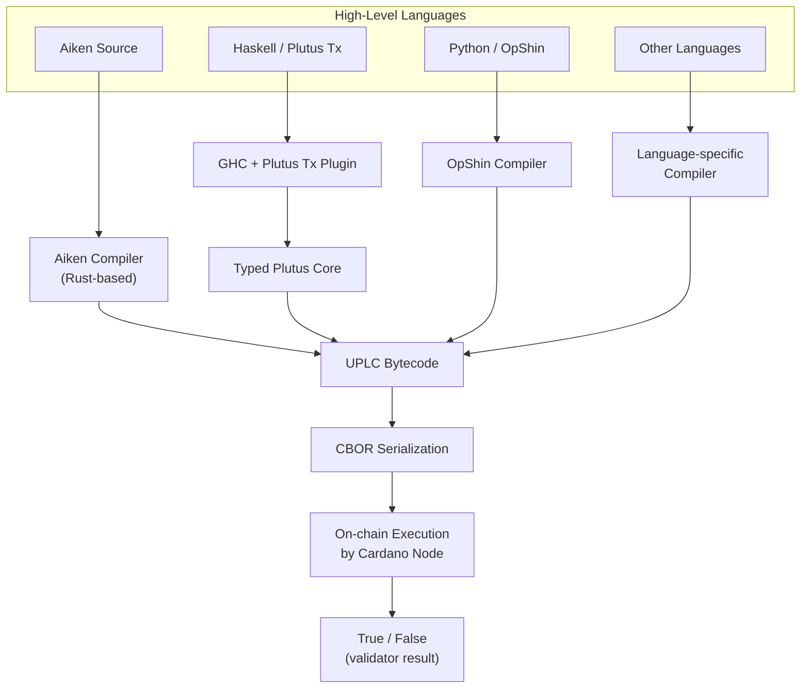
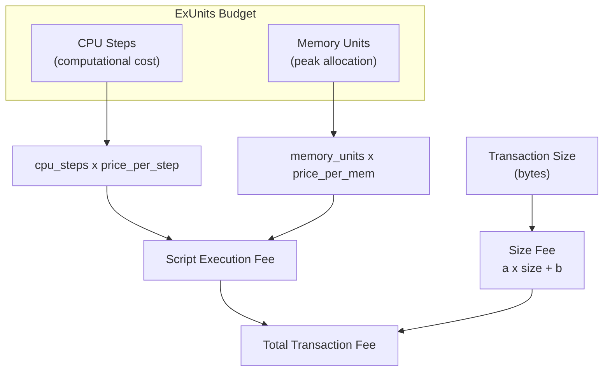

# Bài #08: Plutus, Aiken và các ngôn ngữ

Mọi hợp đồng thông minh Cardano, bất kể ngôn ngữ nguồn nào, đều biên dịch thành UPLC (Untyped Plutus Lambda Calculus), một mã byte tối giản mà các nút Cardano diễn giải và thực thi. Mục tiêu biên dịch phổ quát này cho phép một hệ sinh thái phong phú các ngôn ngữ (Aiken, Plutus Tx, OpShin, Helios, plu-ts), mỗi ngôn ngữ đưa ra các sự đánh đổi khác nhau về tính tiện dụng, hiệu suất và độ trưởng thành.

Trong bài học này, chúng ta theo dõi đường đi từ mã nguồn cấp cao đến thực thi trên chuỗi. Bạn sẽ tìm hiểu UPLC là gì và tại sao nó tồn tại, Plutus Tx và Aiken tiếp cận vấn đề biên dịch khác nhau như thế nào, chi phí thực thi được đo lường và phân bổ ngân sách ra sao, bản thiết kế CIP-57 cung cấp gì, và tại sao xác minh hình thức quan trọng trong thế giới mà mã đã triển khai là bất biến.

## UPLC là gì và tại sao nó là mã byte trên chuỗi của Cardano?

UPLC (Untyped Plutus Lambda Calculus) là mã byte cấp thấp, dựa trên phép tính lambda, mà mọi nút Cardano diễn giải và thực thi khi xác thực giao dịch hợp đồng thông minh. Nó cung cấp tầng thực thi tối giản, xác định và chặt chẽ về mặt toán học mà bất kỳ ngôn ngữ cấp cao nào cũng có thể nhắm đến làm đầu ra biên dịch.

### UPLC hoạt động như thế nào?

UPLC là ngôn ngữ lập trình hàm tối giản dựa trên phép tính lambda. Nó "không kiểu" theo nghĩa là hệ thống kiểu bị xóa ở cấp này. Nó là "Plutus" vì được thiết kế như một phần của nền tảng hợp đồng thông minh Plutus. Và nó là "Lambda Calculus" vì được xây dựng trên nền tảng toán học làm cơ sở cho mọi lập trình hàm.

UPLC hỗ trợ một tập nhỏ các phép toán:

- **Biến**: Tham chiếu đến các giá trị đã ràng buộc.
- **Trừu tượng lambda**: Hàm ẩn danh (định nghĩa hàm).
- **Ứng dụng**: Áp dụng hàm vào đối số (gọi hàm).
- **Hằng số**: Giá trị chữ (số nguyên, chuỗi byte, boolean, v.v.).
- **Hàm tích hợp**: Tập cố định các phép toán nguyên thủy (số học, so sánh, hash mật mã, thao tác dữ liệu, v.v.).
- **Force và Delay**: Cơ chế kiểm soát đánh giá (liên quan đến xóa đa hình).
- **Error**: Một biểu thức ngay lập tức dừng thực thi với thất bại.

Đó là tất cả. Không có vòng lặp, không có biến thay đổi được, không có đối tượng, không có lớp. Mọi thứ được biểu diễn thông qua ứng dụng hàm và đệ quy. Sự đơn giản cực độ này là có chủ đích; nó giúp ngôn ngữ dễ phân tích, suy luận và triển khai chính xác trên mọi nút.

### Tại sao Cardano chọn phép tính lambda?

Việc chọn phép tính lambda làm nền tảng là có chủ đích và mang tính chiến lược:

1. **Tính chặt chẽ toán học**: Phép tính lambda đã được nghiên cứu từ những năm 1930. Các đặc tính của nó được hiểu thấu đáo, cho phép suy luận hình thức về hành vi chương trình.

2. **Tính xác định**: Phép tính lambda thuần túy vốn dĩ xác định; không có hiệu ứng phụ, không thay đổi trạng thái, không I/O. Điều này phù hợp hoàn hảo với yêu cầu xác định của Cardano.

3. **Đơn giản triển khai**: Trình đánh giá UPLC trên mỗi nút Cardano là một đoạn mã nhỏ, có thể kiểm toán. Runtime đơn giản hơn có nghĩa là ít lỗi và lỗ hổng bảo mật hơn.

4. **Mục tiêu biên dịch phổ quát**: Bất kỳ ngôn ngữ cấp cao nào cũng có thể biên dịch sang phép tính lambda. Nó đóng vai trò "ngôn ngữ chung" cho các ngôn ngữ hợp đồng thông minh, giống như WebAssembly đóng vai trò mục tiêu phổ quát cho các ngôn ngữ web.

## Quy trình biên dịch hợp đồng thông minh Cardano hoạt động như thế nào?

Quy trình biên dịch biến đổi mã nguồn cấp cao (Aiken, Plutus Tx, OpShin, v.v.) thông qua các trình biên dịch riêng của từng ngôn ngữ thành mã byte UPLC, sau đó được tuần tự hóa CBOR để lưu trữ và thực thi trên chuỗi bởi các nút Cardano. Các bước trung gian chính xác khác nhau theo ngôn ngữ, nhưng điểm đến luôn là UPLC được tuần tự hóa dưới dạng CBOR.



## Plutus Tx hoạt động như thế nào cho hợp đồng thông minh dựa trên Haskell?

Plutus Tx là framework hợp đồng thông minh Cardano ban đầu, sử dụng plugin GHC (Glasgow Haskell Compiler) và siêu lập trình Template Haskell để nắm bắt biểu thức Haskell tại thời điểm biên dịch và dịch chúng sang Plutus Core, sau đó được hạ xuống UPLC. Bạn viết cái trông giống mã Haskell bình thường, chú thích nó với splice đặc biệt, và plugin biên dịch biến đổi nó thành mã byte trên chuỗi.

```
-- Conceptual Plutus Tx validator structure
mkValidator :: Datum -> Redeemer -> ScriptContext -> Bool
mkValidator datum redeemer ctx =
    -- Validation logic here
    traceIfFalse "wrong redeemer" (redeemer == expectedValue)
```

### Điểm mạnh của Plutus Tx là gì?

- **Hệ sinh thái Haskell**: Truy cập hệ thống kiểu mạnh mẽ của Haskell, bao gồm kiểu dữ liệu đại số, lớp kiểu và đa hình tham số.
- **Mã chia sẻ**: Mã trên chuỗi và ngoài chuỗi có thể chia sẻ định nghĩa kiểu, giảm khả năng không khớp.
- **Tiềm năng xác minh hình thức**: Hệ thống kiểu và tính thuần túy của Haskell phù hợp với các phương pháp hình thức.
- **Công cụ trưởng thành**: Haskell có hàng thập kỷ công cụ để kiểm thử, profiling và phân tích.

### Thách thức của Plutus Tx là gì?

- **Đường cong học tập dốc**: Haskell nổi tiếng khó cho các nhà phát triển đến từ ngôn ngữ mệnh lệnh. Sự kết hợp Haskell + blockchain + Template Haskell tạo ra rào cản học tập đáng gờm.
- **Phức tạp biên dịch**: Cách tiếp cận plugin GHC có nghĩa là thời gian build có thể dài, thông báo lỗi có thể khó hiểu, và không phải tất cả tính năng Haskell đều khả dụng (một số hàm thư viện chuẩn không thể biên dịch sang Plutus Core).
- **Kích thước kịch bản**: Trình xác thực Plutus Tx có thể tương đối lớn về byte, dẫn đến phí cao hơn.
- **Tập con hạn chế**: Bạn không thể sử dụng Haskell tùy ý; chỉ tập con mà plugin biên dịch Plutus Tx có thể dịch. Điều này có nghĩa là không có lazy I/O, không unsafePerformIO, không FFI, và sử dụng thư viện chuẩn bị hạn chế.

## Aiken là gì và tại sao nó trở thành ngôn ngữ hợp đồng thông minh Cardano phổ biến nhất?

Aiken là ngôn ngữ lập trình được xây dựng có mục đích từ đầu để viết hợp đồng thông minh Cardano. Nó ưu tiên trải nghiệm nhà phát triển, biên dịch nhanh (dưới một giây), và đầu ra UPLC hiệu quả, vay mượn cú pháp và khái niệm từ các ngôn ngữ hiện đại như Rust, Elm và Gleam để tạo ra thứ gì đó quen thuộc nhưng được xây dựng có mục đích cho xác thực trên chuỗi.

```
// Conceptual Aiken validator structure
validator my_validator {
  spend(datum: MyDatum, redeemer: MyRedeemer, ctx: ScriptContext) {
    // Validation logic returns Bool
    redeemer.secret == datum.expected_hash
  }
}
```

### Các tính năng chính của Aiken là gì?

- **Biên dịch nhanh**: Aiken biên dịch trong vài giây, không phải vài phút. Trình biên dịch được viết bằng Rust và cực kỳ nhanh.
- **Thông báo lỗi rõ ràng**: Theo truyền thống Elm/Rust, Aiken cung cấp thông báo lỗi hữu ích, dễ đọc, chỉ trực tiếp đến vấn đề.
- **Kiểm thử tích hợp**: Aiken bao gồm trình chạy kiểm thử, nên bạn có thể viết và chạy unit test cho trình xác thực mà không cần công cụ bên ngoài.
- **Đầu ra hiệu quả**: Trình biên dịch Aiken tạo ra UPLC nhỏ, tối ưu, thường dẫn đến chi phí thực thi thấp hơn so với trình xác thực Plutus Tx tương đương.
- **Thư viện chuẩn có mục đích**: Thư viện chuẩn chứa đúng những gì bạn cần cho phát triển hợp đồng thông minh; không hơn, không kém.
- **Kiểu tĩnh mạnh**: Kiểu dữ liệu đại số đầy đủ, đối sánh mẫu, generic và suy luận kiểu; tất cả sự an toàn của ngôn ngữ có kiểu hiện đại.
- **Không runtime**: Aiken không có bộ thu gom rác hoặc hệ thống runtime. Mọi thứ biên dịch trực tiếp sang UPLC.

### Tại sao Aiken được áp dụng mạnh mẽ như vậy?

Aiken đã trở thành lựa chọn phổ biến nhất cho phát triển hợp đồng thông minh Cardano mới vì nhiều lý do:

1. **Rào cản gia nhập thấp hơn**: Nhà phát triển quen thuộc với Rust, TypeScript, hoặc bất kỳ ngôn ngữ họ ML nào có thể làm việc hiệu quả trong Aiken nhanh chóng.
2. **Lặp lại nhanh hơn**: Thời gian biên dịch dưới một giây có nghĩa là vòng lặp phản hồi nhanh trong quá trình phát triển.
3. **Kịch bản nhỏ hơn**: Đầu ra UPLC tối ưu có nghĩa là phí giao dịch thấp hơn cho người dùng cuối.
4. **Cộng đồng tích cực**: Aiken có hệ sinh thái ngày càng phát triển gồm thư viện, công cụ và tài nguyên giáo dục.
5. **Tách biệt rõ ràng**: Aiken chỉ dành cho mã trên chuỗi. Mã ngoài chuỗi được viết bằng bất kỳ ngôn ngữ nào ứng dụng của bạn sử dụng (TypeScript, Python, Rust, v.v.), khuyến khích sự tách biệt sạch sẽ trên chuỗi/ngoài chuỗi mà kiến trúc của Cardano yêu cầu.

## Cardano hỗ trợ những ngôn ngữ hợp đồng thông minh nào khác?

Cardano hỗ trợ một số ngôn ngữ bổ sung ngoài Aiken và Plutus Tx, mỗi ngôn ngữ nhắm đến cộng đồng nhà phát triển khác nhau. OpShin biên dịch tập con Python sang UPLC, Helios cung cấp DSL hàm thuần túy, plu-ts cho phép viết trình xác thực bằng TypeScript, và Scalus mang hỗ trợ Scala/JVM.

### OpShin

OpShin cho phép bạn viết hợp đồng thông minh Cardano bằng Python. Nó biên dịch tập con Python sang UPLC. Đối với các nhóm có chuyên môn Python thấy Haskell và thậm chí Aiken quá xa lạ, OpShin cung cấp điểm tiếp cận dễ dàng.

### Helios

Helios là ngôn ngữ chuyên dụng thuần hàm cho hợp đồng thông minh Cardano. Nó biên dịch trực tiếp sang UPLC và có thể chạy hoàn toàn trong trình duyệt, làm cho nó thú vị cho phát triển dApp nơi toàn bộ quy trình (viết, biên dịch và gửi) diễn ra phía client.

### plu-ts

plu-ts cho phép bạn viết hợp đồng thông minh Cardano bằng TypeScript. Logic trình xác thực được biểu diễn bằng hàm TypeScript biên dịch sang UPLC tại runtime (trong JavaScript). Điều này đặc biệt hấp dẫn cho nhà phát triển TypeScript full-stack.

### Scalus

Scalus mang phát triển hợp đồng thông minh Cardano đến hệ sinh thái Scala/JVM, biên dịch biểu thức Scala sang UPLC.

### Tại sao sự đa dạng ngôn ngữ là sức mạnh?

Sự đa dạng ngôn ngữ là sức mạnh của kiến trúc Cardano. Vì UPLC là mục tiêu biên dịch sạch, được đặc tả rõ ràng, bất kỳ ngôn ngữ nào cũng có thể nhắm đến nó. Điều này tương tự cách nhiều ngôn ngữ (Rust, Go, C++) có thể biên dịch sang WebAssembly, hoặc cách nhiều ngôn ngữ JVM (Java, Kotlin, Scala, Clojure) nhắm đến cùng mã byte.

## Chi phí thực thi hợp đồng thông minh trên Cardano được tính như thế nào?

Cardano đo lường chi phí thực thi hợp đồng thông minh bằng ExUnits (Đơn vị Thực thi) trên hai chiều: bước CPU (số bước tính toán được thực hiện) và đơn vị bộ nhớ (bộ nhớ đỉnh tiêu thụ trong quá trình đánh giá). Mỗi kịch bản phải khai báo ngân sách tài nguyên trước, và phí được tính bằng cách nhân tài nguyên tiêu thụ với giá mỗi đơn vị theo tham số giao thức.



### Bước CPU và bộ nhớ hoạt động như thế nào?

**CPU (Bước)**: CPU đo lường số bước tính toán mà kịch bản thực hiện. Mỗi hàm tích hợp UPLC có chi phí CPU được xác định dựa trên đối số. Cộng các số nguyên nhỏ thì rẻ; hash mật mã thì đắt. Chi phí được xác định bởi **mô hình chi phí** ánh xạ mỗi phép toán nguyên thủy sang chi phí CPU.

**Bộ nhớ**: Bộ nhớ đo lường lượng bộ nhớ tối đa mà kịch bản sử dụng trong quá trình thực thi. Mỗi giá trị được tạo ra trong quá trình đánh giá tiêu thụ bộ nhớ, và tổng mức sử dụng bộ nhớ đỉnh xác định chi phí bộ nhớ. Khác với CPU, bộ nhớ tính theo mức sử dụng đỉnh, không phải phân bổ tích lũy.

### Giới hạn ngân sách ExUnits là gì?

Mỗi lần thực thi kịch bản Plutus phải khai báo ngân sách tài nguyên trước (như một phần của giao dịch). Ngân sách chỉ định chính xác bao nhiêu bước CPU và bao nhiêu đơn vị bộ nhớ kịch bản được phép tiêu thụ. Nếu kịch bản vượt quá bất kỳ giới hạn nào, nó thất bại.

Cũng có giới hạn theo giao dịch và theo khối:

```
Resource Hierarchy:
  Per-Block Budget (shared by all transactions in the block)
    |
    +-- Per-Transaction Budget (shared by all scripts in the transaction)
          |
          +-- Per-Script Budget (declared in the transaction)
```

Giới hạn xấp xỉ hiện tại (đây là tham số giao thức có thể thay đổi thông qua quản trị):

- **Mỗi giao dịch**: ~10 tỷ bước CPU, ~14 triệu đơn vị bộ nhớ.
- **Mỗi khối**: ~20 tỷ bước CPU, ~62 triệu đơn vị bộ nhớ.

### Tại sao ExUnits quan trọng cho phát triển?

Hiểu ExUnits là cần thiết vì chúng ảnh hưởng trực tiếp đến:

- **Tính khả thi**: Nếu trình xác thực vượt quá giới hạn mỗi giao dịch, đơn giản là nó không thể được sử dụng. Bạn phải tối ưu hoặc tái cấu trúc.
- **Chi phí**: ExUnits cao hơn có nghĩa là phí cao hơn cho người dùng.
- **Không gian khối**: Giao dịch tiêu thụ nhiều ExUnits hơn chiếm nhiều hơn ngân sách mỗi khối, nghĩa là ít giao dịch khác có thể nằm trong cùng khối.

Đây là lý do tại sao đầu ra UPLC hiệu quả của Aiken quan trọng; kịch bản nhỏ hơn, nhanh hơn chuyển trực tiếp thành chi phí thấp hơn và trải nghiệm người dùng tốt hơn.

## Bản thiết kế CIP-57 Plutus là gì và tại sao chúng quan trọng?

Bản thiết kế CIP-57 Plutus là các tài liệu JSON chuẩn hóa, có thể đọc bằng máy, mô tả giao diện hợp đồng thông minh đã biên dịch, bao gồm tên trình xác thực, lược đồ datum/redeemer, định nghĩa kiểu dữ liệu, và mã byte UPLC đã biên dịch. Chúng hoạt động như tương đương ABI (Application Binary Interface) của Cardano, cho phép tạo mã tự động và khả năng tương tác công cụ.

### Bản thiết kế chứa gì?

Bản thiết kế Plutus bao gồm:

- **Thông tin trình xác thực**: Tên, mục đích (chi tiêu, đúc, v.v.), và hash kịch bản đã biên dịch.
- **Lược đồ tham số**: Kiểu và cấu trúc của datum, redeemer, và bất kỳ tham số hóa nào.
- **Định nghĩa dữ liệu**: Định nghĩa kiểu đầy đủ cho tất cả kiểu dữ liệu tùy chỉnh được sử dụng trong hợp đồng.
- **Mã đã biên dịch**: Mã byte UPLC thực tế (hoặc tham chiếu đến nó).

```
// Simplified blueprint structure (conceptual)
{
  "preamble": {
    "title": "My Escrow Contract",
    "version": "1.0.0"
  },
  "validators": [
    {
      "title": "escrow.spend",
      "datum": {
        "schema": { "$ref": "#/definitions/EscrowDatum" }
      },
      "redeemer": {
        "schema": { "$ref": "#/definitions/EscrowAction" }
      },
      "compiledCode": "5901a2010000...",
      "hash": "a1b2c3d4e5..."
    }
  ],
  "definitions": {
    "EscrowDatum": {
      "dataType": "constructor",
      "fields": [
        { "title": "beneficiary", "dataType": "bytes" },
        { "title": "deadline", "dataType": "integer" }
      ]
    }
  }
}
```

### Bản thiết kế cải thiện quá trình phát triển như thế nào?

Trước CIP-57, tích hợp với hợp đồng thông minh Cardano yêu cầu:
- Đọc mã nguồn để hiểu định dạng datum và redeemer mong đợi.
- Dựa vào tài liệu có thể lỗi thời hoặc không đầy đủ.
- Dịch ngược UPLC đã biên dịch (cực kỳ khó).

Bản thiết kế giải quyết điều này bằng cách cung cấp một artifact duy nhất, chuẩn hóa, có thể đọc bằng máy, chứa mọi thứ ứng dụng ngoài chuỗi cần để tương tác với hợp đồng. Điều này cho phép:

- **Tạo mã**: Công cụ có thể tự động tạo kiểu TypeScript, Python hoặc Rust từ bản thiết kế, đảm bảo tương tác an toàn kiểu với hợp đồng.
- **Xác thực**: Mã ngoài chuỗi có thể xác thực giá trị datum và redeemer theo lược đồ bản thiết kế trước khi xây dựng giao dịch.
- **Khả năng khám phá**: Nhà phát triển có thể hiểu giao diện hợp đồng bằng cách kiểm tra bản thiết kế, không cần mã nguồn.
- **Khả năng tương tác công cụ**: Các framework ngoài chuỗi khác nhau (Lucid, MeshJS, PyCardano, v.v.) đều có thể sử dụng cùng định dạng bản thiết kế.

Aiken tạo bản thiết kế tự động như một phần của quá trình build. Đối với Plutus Tx, bản thiết kế có thể được tạo với công cụ bổ sung.

## Tại sao xác minh hình thức quan trọng cho hợp đồng thông minh?

Xác minh hình thức sử dụng các kỹ thuật toán học để chứng minh rằng chương trình thỏa mãn đặc tả của nó cho mọi đầu vào có thể, không chỉ các ví dụ đã kiểm thử. Đối với hợp đồng thông minh, nơi lỗi có thể gây mất quỹ không thể đảo ngược và mã đã triển khai là bất biến, xác minh hình thức cung cấp đảm bảo mạnh nhất rằng logic xác thực hoạt động chính xác trong mọi kịch bản.

### Tại sao rủi ro cao đến đặc biệt?

Hợp đồng thông minh trên Cardano là bất biến khi triển khai (tại một hash kịch bản nhất định). Bạn không thể vá hợp đồng đang chạy. Nếu trình xác thực có lỗi cho phép chi tiêu trái phép, quỹ tại địa chỉ đó gặp rủi ro, và không có cách sửa ngoài triển khai hợp đồng mới và di chuyển (có thể không khả thi nếu hợp đồng gốc không bao gồm logic di chuyển).

Rủi ro cao đến đặc biệt:
- **Tính bất biến**: Không có hotfix, không có rollback.
- **Phơi nhiễm tài chính**: Hợp đồng thường giữ giá trị đáng kể.
- **Môi trường đối kháng**: Khác với API riêng, bất kỳ ai trên thế giới đều có thể cố gắng khai thác hợp đồng thông minh.

### Cardano hỗ trợ những phương pháp xác minh nào?

1. **Kiểm thử dựa trên thuộc tính**: Công cụ như QuickCheck (trong Haskell) hoặc kiểm thử tích hợp của Aiken tạo hàng nghìn trường hợp kiểm thử ngẫu nhiên và kiểm tra thuộc tính có đúng không. Đây không phải xác minh hình thức, nhưng bắt được nhiều lỗi mà kiểm thử dựa trên ví dụ bỏ lỡ.

2. **Tính đúng đắn dựa trên kiểu**: Hệ thống kiểu mạnh (như trong Haskell và Aiken) ngăn chặn toàn bộ danh mục lỗi tại thời điểm biên dịch. Nếu giá trị phải là số nguyên dương, hệ thống kiểu có thể thực thi điều này tĩnh.

3. **Phương pháp hình thức trên UPLC**: Vì UPLC dựa trên phép tính lambda với ngữ nghĩa được hiểu rõ, về mặt lý thuyết có thể áp dụng kỹ thuật xác minh hình thức trực tiếp lên mã byte đã biên dịch.

4. **Kiểm toán**: Các công ty kiểm toán chuyên nghiệp xem xét mã nguồn hợp đồng thông minh để tìm lỗ hổng. Mặc dù không phải bằng chứng toán học, đánh giá chuyên gia bắt được lỗi mà công cụ tự động bỏ lỡ.

5. **Agda và chứng minh hình thức**: Các thư viện cốt lõi của Cardano đã được xác minh hình thức bằng Agda, ngôn ngữ kiểu phụ thuộc có thể biểu diễn và kiểm tra chứng minh toán học. Một số nỗ lực nghiên cứu mở rộng điều này sang xác minh hợp đồng thông minh.

### Con đường thực tế đến an toàn hợp đồng là gì?

Đối với hầu hết nhà phát triển, con đường thực tế đến an toàn hợp đồng là:

- Viết bằng ngôn ngữ kiểu mạnh (Aiken hoặc Plutus Tx).
- Sử dụng kiểm thử dựa trên thuộc tính rộng rãi.
- Viết unit test và integration test kỹ lưỡng.
- Thuê kiểm toán chuyên nghiệp cho bất kỳ hợp đồng nào xử lý giá trị đáng kể.
- Giữ trình xác thực nhỏ và tập trung; càng ít mã, càng ít bề mặt tấn công cho lỗi.
- Sử dụng các mẫu đã được thiết lập (đề cập trong các bài tiếp theo) thay vì phát minh mới.

## Mô hình chi phí định giá các nguyên thủy UPLC như thế nào?

Mô hình chi phí là tập tham số giao thức (có thể điều chỉnh thông qua quản trị Cardano) ánh xạ mỗi hàm tích hợp UPLC sang công thức chi phí xác định dựa trên đối số. Các phép toán đơn giản thì rẻ, các phép toán tỷ lệ với kích thước đầu vào được định giá tương ứng, và các phép toán mật mã tốn hơn do cường độ tính toán.

```
Examples of cost model entries (conceptual):
  addInteger:       cpu = 205665 + 812 * max(arg1_size, arg2_size)
  sha2_256:         cpu = 1927926 + 82523 * arg_size
  equalsByteString: cpu = 245000 + 216773 * min(arg1_size, arg2_size)
  ifThenElse:       cpu = 80556 (constant)
```

Mô hình chi phí đảm bảo rằng:
- Các phép toán đơn giản thì rẻ.
- Các phép toán tỷ lệ với kích thước đầu vào được định giá tương ứng.
- Các phép toán mật mã, tốn tài nguyên tính toán, có chi phí cao hơn.
- Chi phí là xác định; cùng phép toán với cùng đối số luôn có cùng chi phí.

Hiểu mô hình chi phí giúp bạn viết trình xác thực hiệu quả. Ví dụ, nếu bạn cần so sánh hai chuỗi byte, thực hiện một lần rẻ hơn nhiều so với hash cả hai rồi so sánh hash (vì hash đắt).

## So sánh với Web2

**UPLC như JavaScript (mục tiêu biên dịch)**: Cũng như TypeScript, CoffeeScript, Elm và PureScript đều biên dịch sang JavaScript để thực thi trong trình duyệt, Aiken, Plutus Tx, OpShin và các ngôn ngữ Cardano khác đều biên dịch sang UPLC để thực thi trên chuỗi. Bạn chọn ngôn ngữ phù hợp với chuyên môn và sở thích của nhóm, nhưng runtime là như nhau.

**UPLC như WebAssembly**: So sánh gần hơn là WASM (WebAssembly). WASM là định dạng nhị phân cấp thấp đóng vai trò mục tiêu biên dịch cho Rust, C++, Go và các ngôn ngữ khác. Nó chạy trong môi trường sandbox với giới hạn tài nguyên được kiểm soát. UPLC đóng vai trò tương tự cho Cardano: mục tiêu thực thi cấp thấp, sandbox, giới hạn tài nguyên.

**ExUnits như thanh toán Cloud Function**: AWS Lambda tính phí dựa trên số yêu cầu, thời gian thực thi (tính bằng mili giây), và bộ nhớ được phân bổ. ExUnits của Cardano hoạt động tương tự; bạn trả cho bước CPU (thời gian thực thi) và bộ nhớ (phân bổ). Cũng như bạn tối ưu hàm Lambda để giảm chi phí, bạn tối ưu trình xác thực để giảm ExUnits.

**Bản thiết kế CIP-57 như lược đồ API (OpenAPI/Swagger)**: Đặc tả OpenAPI mô tả điểm cuối REST API, thân yêu cầu, lược đồ phản hồi, và yêu cầu xác thực. Bản thiết kế Plutus mô tả lược đồ datum, lược đồ redeemer, và mã đã biên dịch của trình xác thực. Cả hai phục vụ cùng mục đích: cho phép công cụ và nhà phát triển tương tác đúng với dịch vụ mà không cần đọc triển khai.

**Mô hình chi phí như bảng giá đám mây**: Nhà cung cấp đám mây công bố trang giá chi tiết hiển thị chi phí mỗi lần gọi API, mỗi GB lưu trữ, mỗi triệu yêu cầu, v.v. Mô hình chi phí của Cardano là cùng khái niệm: cấu trúc giá công bố, minh bạch cho mỗi phép toán tính toán. Khác biệt chính là giá của Cardano được thực thi bởi đồng thuận giao thức, không phải bộ phận thanh toán của công ty.

**Xác minh hình thức như API an toàn kiểu**: Nếu bạn đã sử dụng TypeScript với chế độ nghiêm ngặt, bạn biết giá trị của việc bắt lỗi tại thời điểm biên dịch thay vì runtime. Xác minh hình thức mở rộng ý tưởng này; thay vì bắt lỗi kiểu, bạn bắt lỗi logic. Nó giống như có hệ thống kiểu TypeScript, nhưng cho logic nghiệp vụ, với bằng chứng toán học rằng quy tắc không thể bị vi phạm.

## Các điểm chính

- **UPLC là tầng thực thi phổ quát**: mọi ngôn ngữ hợp đồng thông minh Cardano biên dịch sang mã byte dựa trên phép tính lambda này, bất kể ngôn ngữ nguồn.
- **Aiken là lựa chọn phổ biến nhất** cho phát triển hợp đồng thông minh Cardano mới, cung cấp biên dịch nhanh, thông báo lỗi rõ ràng, đầu ra hiệu quả, và đường cong học tập nhẹ nhàng.
- **Plutus Tx cung cấp toàn bộ sức mạnh của Haskell** nhưng với đường cong học tập dốc hơn và quy trình build phức tạp hơn; nó vẫn quan trọng cho các dự án tích hợp sâu trong hệ sinh thái Haskell.
- **Chi phí thực thi (ExUnits) là hai chiều**: bước CPU và bộ nhớ; và trực tiếp xác định phí giao dịch cho các giao dịch có kịch bản.
- **Bản thiết kế CIP-57 chuẩn hóa giao diện hợp đồng**, cho phép tạo mã, khả năng tương tác công cụ, và tích hợp ngoài chuỗi đáng tin cậy.

## Tiếp theo

Bây giờ bạn đã biết cách trình xác thực được viết và biên dịch, đã đến lúc hiểu ba đối số mà mọi trình xác thực nhận. Trong Bài 9, chúng ta đi sâu vào Datum, Redeemer và ScriptContext: mô hình dữ liệu cung cấp sức mạnh cho toàn bộ logic hợp đồng thông minh Cardano, và khám phá các mẫu phổ biến xuất hiện từ kiến trúc này.
