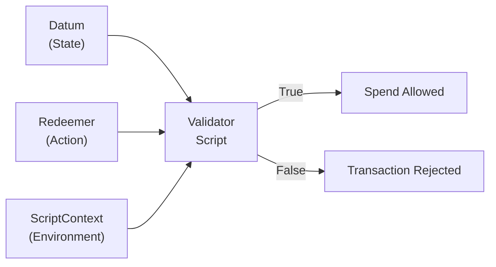
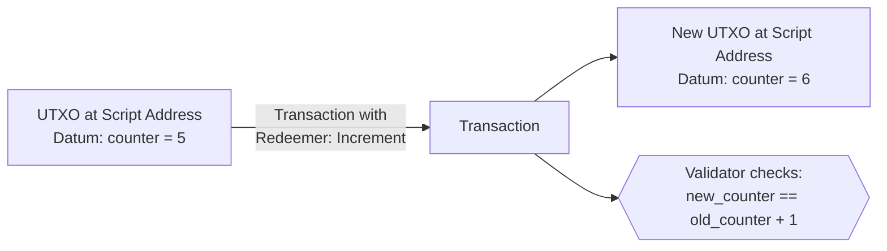

# Bài #09: Datum, Redeemer và ScriptContext

Mọi trình xác thực Cardano nhận chính xác ba đối số: datum (trạng thái được khóa tại địa chỉ kịch bản), redeemer (hành động được gửi bởi người chi tiêu), và ScriptContext (ảnh chụp toàn diện của toàn bộ giao dịch). Cùng nhau, ba đối số này cung cấp cho trình xác thực mọi thứ cần thiết để đưa ra quyết định ủy quyền về việc liệu UTXO có thể được chi tiêu hay không.

Trong bài học này, chúng ta phân tích từng đối số một cách chi tiết, khám phá cách chúng phối hợp với nhau, xem xét sự phát triển của cách datum được lưu trữ trên chuỗi, hiểu kịch bản tham chiếu, và khảo sát các mẫu thiết kế phổ biến xuất hiện từ kiến trúc ba đối số này.

## Ba đối số mà mọi trình xác thực Cardano nhận là gì?

Mọi trình xác thực Cardano nhận datum (trạng thái được khóa tại UTXO), redeemer (hành động mà người chi tiêu muốn thực hiện), và ScriptContext (ảnh chụp đầy đủ của giao dịch bao gồm tất cả đầu vào, đầu ra, chữ ký và phép đúc). Trình xác thực kiểm tra cả ba và trả về `True` (cho phép) hoặc `False` (từ chối).



Khi giao dịch cố gắng chi tiêu UTXO tại địa chỉ kịch bản, nút Cardano gọi kịch bản xác thực với ba đối số này:

```
validator(datum, redeemer, scriptContext) -> Bool
```

1. **Datum**: Dữ liệu liên kết với UTXO đang được chi tiêu. Nó đại diện cho "trạng thái" được khóa tại địa chỉ kịch bản.
2. **Redeemer**: Dữ liệu được cung cấp bởi giao dịch đang cố gắng chi tiêu UTXO. Nó đại diện cho "hành động" mà người chi tiêu muốn thực hiện.
3. **ScriptContext**: Ảnh chụp toàn diện của toàn bộ giao dịch, bao gồm tất cả đầu vào, đầu ra, chữ ký, đúc token và nhiều hơn nữa. Nó đại diện cho "môi trường" mà xác thực đang diễn ra.

Hãy khám phá từng cái chi tiết.

## Datum đại diện cho trạng thái trên Cardano như thế nào?

Datum là dữ liệu có cấu trúc đính kèm vào UTXO khi nó được tạo ra, mã hóa bất kỳ thông tin nào mà trình xác thực cần để đưa ra quyết định về UTXO cụ thể đó. Vì Cardano không có bộ nhớ hợp đồng tồn tại bền vững, trạng thái được biểu diễn thông qua datum đính kèm vào UTXO; "cập nhật" trạng thái có nghĩa là tiêu thụ UTXO cũ và tạo ra cái mới với datum đã cập nhật.

### Datum có thể chứa gì?

Datum có thể là bất kỳ dữ liệu có cấu trúc nào có thể tuần tự hóa sang định dạng dữ liệu trên chuỗi của Cardano (PlutusData). Các ví dụ phổ biến bao gồm:

- **Thông tin sở hữu**: Hash khóa công khai xác định ai được phép yêu cầu UTXO.
- **Thời hạn**: Dấu thời gian POSIX hoặc số slot sau đó một số hành động được phép hoặc bị cấm.
- **Giá trị trạng thái**: Bộ đếm, số dư, tham số cấu hình, hoặc bất kỳ trạng thái cụ thể ứng dụng nào.
- **Hash hoặc mã định danh**: Tham chiếu đến dữ liệu ngoài chuỗi, UTXO khác, hoặc ID chính sách.

```
-- Example: Escrow datum
EscrowDatum {
  beneficiary: PubKeyHash,       -- who can claim
  deadline: POSIXTime,           -- when the deadline expires
  refund_address: PubKeyHash     -- who gets a refund after deadline
}

-- Example: Auction datum
AuctionDatum {
  seller: PubKeyHash,
  highest_bid: Integer,
  highest_bidder: PubKeyHash,
  lot_asset: AssetClass,
  min_bid_increment: Integer,
  auction_end: POSIXTime
}
```

### Quản lý trạng thái dựa trên datum hoạt động như thế nào?

Trong các hệ thống dựa trên tài khoản như Ethereum, trạng thái hợp đồng thông minh nằm trong biến lưu trữ tồn tại bền vững. Trên Cardano, không có lưu trữ tồn tại bền vững. Thay vào đó, **trạng thái được mã hóa trong datum đính kèm vào UTXO**.

Khi trình xác thực muốn "cập nhật" trạng thái, giao dịch tiêu thụ UTXO cũ (với datum cũ) và tạo UTXO mới tại cùng địa chỉ kịch bản (với datum đã cập nhật). Trình xác thực kiểm tra rằng chuyển đổi trạng thái là hợp lệ.



Mẫu này (tiêu thụ UTXO và tái tạo nó với trạng thái đã cập nhật) là cơ chế cơ bản để quản lý trạng thái trên Cardano. Nó đôi khi được gọi là **mẫu "đầu ra tiếp tục" (continuing output)** vì địa chỉ kịch bản tiếp tục giữ UTXO, chỉ với dữ liệu mới.

### Sự khác biệt giữa hash datum và datum nội tuyến là gì?

Về mặt lịch sử, Cardano lưu trữ datum theo hai cách, và hiểu sự phát triển này rất quan trọng:

**Hash datum (trước Vasil)**: Bản thân UTXO chỉ chứa *hash* của datum. Dữ liệu datum thực tế phải được cung cấp trong giao dịch tạo UTXO (lưu trong dữ liệu phụ trợ của giao dịch) hoặc trong giao dịch chi tiêu nó. Điều này có nghĩa:
- Để chi tiêu UTXO, bạn cần biết datum đầy đủ (không chỉ hash).
- Datum phải được bao gồm trong giao dịch chi tiêu, tăng kích thước.
- Nếu datum lớn, điều này tăng phí đáng kể.
- Nếu bạn mất dấu datum, UTXO trở nên không thể chi tiêu được (quỹ bị khóa mãi mãi).

**Datum nội tuyến (sau Vasil, CIP-32)**: Kể từ hard fork Vasil, datum có thể được lưu trữ trực tiếp ("nội tuyến") trong bản thân UTXO. Điều này có nghĩa:
- Bất kỳ ai cũng có thể đọc datum bằng cách kiểm tra UTXO trên chuỗi.
- Giao dịch chi tiêu không cần bao gồm datum đầy đủ riêng biệt.
- Không có rủi ro mất dấu dữ liệu datum.
- Các giao dịch khác có thể tham chiếu datum này qua đầu vào tham chiếu (CIP-31).

```
Pre-Vasil UTXO:                    Post-Vasil UTXO:
+---------------------+            +---------------------+
| Address             |            | Address             |
| Value               |            | Value               |
| Datum Hash: 0xabc.. |            | Inline Datum:       |
+---------------------+            |   { counter: 5,     |
                                   |     owner: 0x123 }  |
Full datum must be                 +---------------------+
stored and provided
separately                         Datum is right there,
                                   readable by anyone
```

**Thực hành tốt nhất**: Sử dụng datum nội tuyến cho hầu như mọi phát triển mới. Hash datum vẫn hoạt động cho tương thích ngược, nhưng datum nội tuyến vượt trội trong hầu hết mọi kịch bản.

## Redeemer đại diện cho hành động trong hợp đồng thông minh Cardano như thế nào?

Redeemer là dữ liệu được cung cấp bởi giao dịch cố gắng chi tiêu UTXO, cho trình xác thực biết hành động nào người chi tiêu muốn thực hiện. Cấu trúc của nó hoàn toàn do trình xác thực xác định (giao thức không áp đặt yêu cầu nào), và nó thường có dạng các constructor hành động có thẻ cho phép một trình xác thực hỗ trợ nhiều thao tác riêng biệt.

### Redeemer có thể chứa gì?

Redeemer có thể là bất kỳ giá trị PlutusData nào. Các mẫu phổ biến bao gồm:

**Giá trị đơn giản**: Mật khẩu, bí mật, số.
```
-- Simple: just provide the secret
Redeemer = ByteString   -- the secret that hashes to the datum
```

**Thẻ hành động**: Liệt kê chỉ định hành động nào người chi tiêu muốn thực hiện.
```
-- Tagged actions for a multi-action contract
Redeemer =
  | Bid { amount: Integer }
  | Close
  | Cancel
  | Update { new_price: Integer }
```

**Dữ liệu chứng minh**: Bằng chứng rằng người chi tiêu được ủy quyền.
```
-- Merkle proof for airdrop claiming
Redeemer = MerkleProof {
  leaf_index: Integer,
  proof_hashes: List<ByteString>
}
```

### Trình xác thực đa hành động sử dụng redeemer như thế nào?

Redeemer cho trình xác thực biết *loại thao tác nào* người chi tiêu đang cố gắng thực hiện. Điều này cho phép một trình xác thực hỗ trợ nhiều thao tác riêng biệt. Trình xác thực đối sánh mẫu trên redeemer để xác định quy tắc xác thực nào cần áp dụng:

```
validator multi_action(datum: State, redeemer: Action, ctx: ScriptContext) -> Bool {
  when redeemer is {
    Bid { amount } ->
      -- Check bid is higher than current, signed by bidder, etc.
      validate_bid(datum, amount, ctx)

    Close ->
      -- Check auction has ended, winner gets the lot, seller gets payment
      validate_close(datum, ctx)

    Cancel ->
      -- Check only the seller can cancel, and only before any bids
      validate_cancel(datum, ctx)
  }
}
```

Mẫu này phổ biến khắp nơi trong phát triển hợp đồng thông minh Cardano. Hầu hết mọi trình xác thực phức tạp đều sử dụng redeemer với nhiều constructor để đại diện cho các thao tác khác nhau.

### Kích thước redeemer ảnh hưởng đến chi phí giao dịch như thế nào?

Redeemer được bao gồm trong thân giao dịch, nên kích thước của nó ảnh hưởng đến phí giao dịch. Hãy giữ redeemer nhỏ nhất có thể trong thực tế. Nếu redeemer bao gồm bằng chứng Merkle lớn hoặc dữ liệu cồng kềnh khác, điều này sẽ tăng chi phí.

## ScriptContext cung cấp thông tin gì cho trình xác thực?

ScriptContext là đối số phong phú nhất trong ba đối số: cấu trúc dữ liệu toàn diện được cung cấp bởi nút Cardano mô tả toàn bộ giao dịch đang được xác thực. Nó chứa TxInfo (tất cả đầu vào, đầu ra, chữ ký, đúc token, phí, phạm vi hợp lệ và nhiều hơn nữa) cộng với ScriptPurpose cho biết tại sao trình xác thực đang được gọi (chi tiêu, đúc, chứng nhận hoặc thưởng).

### TxInfo chứa gì?

```
TxInfo {
  inputs:             List<TxInInfo>,       -- all inputs being consumed
  reference_inputs:   List<TxInInfo>,       -- all reference inputs (read-only)
  outputs:            List<TxOut>,          -- all outputs being created
  fee:                Value,                -- transaction fee
  mint:               Value,                -- tokens being minted/burned
  certificates:       List<DCert>,          -- stake certificates
  withdrawals:        Map<StakingCred, Int>,-- reward withdrawals
  valid_range:        POSIXTimeRange,       -- validity interval
  signatories:        List<PubKeyHash>,     -- who signed the transaction
  redeemers:          Map<ScriptPurpose, Redeemer>,
  datums:             Map<DatumHash, Datum>,
  id:                 TxId                  -- the transaction hash
}
```

### ScriptPurpose là gì?

ScriptPurpose cho trình xác thực biết *tại sao* nó đang được gọi:

```
ScriptPurpose =
  | Spending TxOutRef      -- spending a UTXO at a script address
  | Minting PolicyId       -- minting/burning tokens under this policy
  | Certifying DCert       -- issuing a stake certificate
  | Rewarding StakeCred    -- withdrawing staking rewards
  | Voting Voter           -- governance voting (Plutus V3)
  | Proposing              -- governance proposals (Plutus V3)
```

### Trình xác thực thường kiểm tra gì trong ScriptContext?

ScriptContext là nơi hầu hết logic xác thực thú vị xảy ra. Đây là các kiểm tra phổ biến nhất:

**Xác minh chữ ký**: "Giao dịch có được ký bởi khóa mong đợi không?"
```
-- Check that the datum's owner signed the transaction
list.has(ctx.transaction.signatories, datum.owner)
```

**Kiểm tra đầu ra**: "Giao dịch có tạo đầu ra đúng không?"
```
-- Check that value is sent to the correct address
expect Some(output) = find_output_to(ctx.transaction.outputs, beneficiary_address)
output.value >= expected_amount
```

**Kiểm tra phạm vi thời gian**: "Giao dịch có nằm trong cửa sổ thời gian cho phép không?"
```
-- Check that the deadline has passed
valid_range_start(ctx.transaction.valid_range) > datum.deadline
```

**Kiểm tra đúc token**: "Các token đúng có đang được đúc không?"
```
-- Check that exactly one token is minted under our policy
let minted = ctx.transaction.mint
quantity_of(minted, own_policy_id, token_name) == 1
```

**Đếm đầu vào**: "Các UTXO đúng có đang được tiêu thụ không?"
```
-- Check that the oracle UTXO is included as a reference input
list.any(ctx.transaction.reference_inputs, fn(input) {
  input.output.address == oracle_address
})
```

### Tại sao ScriptContext mạnh mẽ đến vậy?

ScriptContext là thứ làm cho trình xác thực Cardano biểu cảm dù "chỉ là" hàm boolean. Trình xác thực có thể thực thi các điều kiện phức tạp về *toàn bộ giao dịch*, không chỉ UTXO đơn lẻ mà nó bảo vệ. Điều này cho phép các mẫu không thể có nếu trình xác thực chỉ thấy đầu vào của riêng mình:

- **Phối hợp đa trình xác thực**: Hai trình xác thực chạy trong cùng giao dịch có thể kiểm tra các điều kiện mà bên kia thực thi, tạo logic xác thực hợp tác mà không cần giao tiếp trực tiếp.
- **Hoán đổi nguyên tử**: Trình xác thực có thể xác minh rằng một đầu ra cụ thể tồn tại trong giao dịch, cho phép trao đổi không cần tin cậy trong một giao dịch duy nhất.
- **Mẫu chuyển tiếp**: Trình xác thực có thể ủy quyền quyết định cho trình xác thực khác bằng cách kiểm tra rằng đầu vào kịch bản khác có mặt trong giao dịch.

## Các mẫu thiết kế hợp đồng thông minh phổ biến trên Cardano là gì?

Một số mẫu thiết kế đã xuất hiện từ kiến trúc datum-redeemer-context, bao gồm máy trạng thái, phối hợp đa trình xác thực, đảm bảo tính duy nhất one-shot, thủ thuật withdraw-zero để hiệu quả, và token beacon/pointer cho khả năng tìm kiếm UTXO. Hiểu các mẫu này rất cần thiết cho thiết kế hợp đồng thông minh trên Cardano.

### Mẫu 1: Máy trạng thái

Máy trạng thái mã hóa tập trạng thái hữu hạn trong datum và tập chuyển đổi trong redeemer. Trình xác thực kiểm tra rằng mỗi chuyển đổi hợp lệ dựa trên trạng thái hiện tại.

```
Datum (State):          Redeemer (Transition):
  | Collecting          | Contribute { amount }
  | Funded              | Dispute
  | Disputed            | Resolve { ruling }
  | Completed           | Complete

Validator checks:
  Collecting + Contribute -> is amount sufficient? -> Collecting or Funded
  Funded + Dispute -> is disputer authorized? -> Disputed
  Disputed + Resolve -> is resolver the arbiter? -> Completed
  Funded + Complete -> has timeout passed? -> Completed
```

Giao dịch tiêu thụ UTXO với trạng thái cũ và tạo UTXO mới với trạng thái mới. Trình xác thực xác minh chuyển đổi là hợp pháp.

### Mẫu 2: Đa trình xác thực (Liên kết trình xác thực)

Ứng dụng phức tạp thường sử dụng nhiều trình xác thực hợp tác trong một giao dịch duy nhất. Ví dụ, một DEX (sàn giao dịch phi tập trung) có thể có:

- **Trình xác thực nhóm thanh khoản** bảo vệ dự trữ của nhóm.
- **Chính sách đúc** kiểm soát token LP.
- **Trình xác thực lệnh** giữ các lệnh hoán đổi đang chờ.

Cả ba trình xác thực chạy trong một giao dịch duy nhất. Trình xác thực nhóm thanh khoản kiểm tra rằng chính sách đúc đã tạo token LP đúng. Chính sách đúc kiểm tra rằng UTXO nhóm đang được tiêu thụ. Chúng không gọi lẫn nhau; chúng độc lập xác minh điều kiện về cùng giao dịch thông qua ScriptContext.

```
Single Transaction:
  Inputs:
    - Pool UTXO (guarded by pool validator)
    - Order UTXO (guarded by order validator)

  Mint:
    - LP tokens (guarded by minting policy)

  Outputs:
    - Updated Pool UTXO (new reserves)
    - LP tokens to liquidity provider
    - Swapped tokens to trader

Each validator independently checks its rules against ScriptContext:
  Pool validator:  "Are reserves correctly updated? Are LP tokens minted?"
  Order validator: "Is the swap executed at the correct price?"
  Minting policy:  "Is the pool UTXO consumed? Is the amount correct?"
```

### Mẫu 3: Mẫu One-Shot

Mẫu one-shot sử dụng UTXO cụ thể làm đầu vào để đảm bảo tính duy nhất. Vì mỗi UTXO chỉ có thể được chi tiêu một lần, trình xác thực hoặc chính sách đúc yêu cầu UTXO cụ thể làm đầu vào chỉ có thể thành công một lần duy nhất. Điều này thường được sử dụng cho:

- **Đúc token duy nhất**: Đúc NFT bằng cách yêu cầu UTXO cụ thể làm đầu vào. Vì UTXO đó không bao giờ có thể tồn tại lại, việc đúc không bao giờ có thể được lặp lại.
- **Khởi tạo hợp đồng**: Đảm bảo trạng thái ban đầu của hợp đồng chỉ có thể được tạo một lần.

### Mẫu 4: Thủ thuật Withdraw Zero

Một mẫu thông minh trong đó trình xác thực chi tiêu ủy quyền logic của nó cho trình xác thực staking bằng cách yêu cầu rút 0 ADA từ địa chỉ kịch bản staking. Trình xác thực staking chạy một lần cho toàn bộ giao dịch (bất kể bao nhiêu đầu vào kích hoạt nó), trong khi trình xác thực chi tiêu chạy một lần cho mỗi đầu vào. Điều này hiệu quả hơn khi giao dịch chi tiêu nhiều UTXO từ cùng địa chỉ kịch bản.

```
Spending validator (runs per input):
  "Check that the transaction includes a withdrawal from staking_script_address"

Staking validator (runs once for the whole transaction):
  "Perform the actual validation logic for all inputs"
```

### Mẫu 5: Token Beacon/Pointer

Token beacon là token gốc được khóa tại địa chỉ kịch bản cùng với datum. Nó đóng vai trò "con trỏ" giúp UTXO dễ tìm. Nếu không có beacon, tìm UTXO cụ thể tại địa chỉ kịch bản yêu cầu quét tất cả UTXO tại địa chỉ đó và kiểm tra datum. Với token beacon (token duy nhất được giữ tại địa chỉ kịch bản), bạn có thể truy vấn chuỗi để tìm vị trí token và ngay lập tức tìm đúng UTXO.

```
UTXO at script address:
  Value: 5 ADA + 1 BEACON_TOKEN
  Datum: { state data... }

Querying for BEACON_TOKEN immediately locates this specific UTXO
among potentially thousands at the same script address.
```

## Kịch bản tham chiếu (CIP-33) giảm chi phí giao dịch như thế nào?

Kịch bản tham chiếu cho phép trình xác thực đã biên dịch được lưu trữ một lần trong UTXO và tham chiếu bởi tất cả giao dịch tương lai cần nó, thay vì bao gồm toàn bộ byte kịch bản trong mỗi giao dịch. Điều này giảm kích thước giao dịch (giảm phí), loại bỏ giới hạn thực tế về độ phức tạp trình xác thực, và cho phép chi phí triển khai một lần được chia sẻ qua tất cả người dùng.

```
Step 1: Store the script in a UTXO
  Transaction creates:
    UTXO_Script at some_address
      Value: min ADA
      Reference Script: [compiled validator bytecode]

Step 2: Use the script via reference
  Transaction spends from script_address:
    Reference Input: UTXO_Script (not consumed, just referenced)
    Input: UTXO at script_address (being spent)
    Redeemer: { action data }

    The node reads the script from UTXO_Script
    and uses it to validate the spend.
```

### Lợi ích của kịch bản tham chiếu là gì?

- **Phí thấp hơn**: Giao dịch không bao gồm byte kịch bản, có thể tiết kiệm hàng nghìn byte.
- **Chi phí triển khai một lần**: Kịch bản được lưu một lần và tái sử dụng bởi tất cả giao dịch.
- **Trình xác thực lớn hơn**: Vì kịch bản không nằm trong giao dịch, giới hạn kích thước mỗi giao dịch ít ràng buộc hơn.
- **Trải nghiệm người dùng tốt hơn**: Ví không cần có kịch bản cục bộ; chúng chỉ cần tham chiếu bản sao trên chuỗi.

### Bạn triển khai kịch bản tham chiếu như thế nào?

Triển khai kịch bản tham chiếu thường hoạt động như sau:

1. Biên dịch trình xác thực sang UPLC.
2. Tạo giao dịch xuất UTXO chứa kịch bản đã biên dịch trong trường kịch bản tham chiếu.
3. Gửi UTXO này đến địa chỉ bạn kiểm soát (để quản lý, mặc dù nó không cần được chi tiêu; chỉ cần tồn tại).
4. Phân phối tham chiếu UTXO (hash giao dịch + chỉ số) cho người dùng và ứng dụng ngoài chuỗi.
5. Tất cả giao dịch tiếp theo tương tác với trình xác thực tham chiếu UTXO này thay vì bao gồm kịch bản.

UTXO kịch bản tham chiếu phải duy trì chưa chi tiêu miễn là bạn muốn nó khả dụng. Nếu nó bị tiêu thụ, các giao dịch tham chiếu nó sẽ thất bại. Đây là lý do kịch bản tham chiếu thường được gửi đến địa chỉ nơi chúng sẽ không vô tình bị chi tiêu.

## Datum, Redeemer và ScriptContext phối hợp với nhau như thế nào?

Hãy theo dõi một ví dụ hoàn chỉnh để thấy datum, redeemer và ScriptContext phối hợp với nhau. Xét hợp đồng vesting đơn giản: Alice khóa 1000 ADA cho Bob, người có thể yêu cầu sau một ngày cụ thể.

**Bước 1: Khóa quỹ**

Alice tạo giao dịch với đầu ra tại địa chỉ kịch bản vesting:
```
Output:
  Address: vesting_script_address
  Value: 1000 ADA
  Inline Datum: {
    beneficiary: Bob's PubKeyHash,
    deadline: 1735689600  (January 1, 2025, as POSIX time)
  }
```

**Bước 2: Bob yêu cầu (sau thời hạn)**

Bob xây dựng giao dịch chi tiêu:
```
Input: The UTXO Alice created (at vesting_script_address)
Redeemer: Claim   (a simple tag indicating the action)
Output: 999.8 ADA to Bob's wallet address
Fee: 0.2 ADA
Validity Interval: invalid_before = slot corresponding to Jan 2, 2025
Signatures: Bob's signature
```

**Bước 3: Trình xác thực thực thi**

Nút gọi trình xác thực vesting với:

- **Datum**: `{ beneficiary: Bob's PubKeyHash, deadline: 1735689600 }`
- **Redeemer**: `Claim`
- **ScriptContext**: Thông tin giao dịch đầy đủ, bao gồm:
  - `signatories`: [Bob's PubKeyHash]
  - `valid_range`: bắt đầu sau 1 tháng 1 năm 2025
  - `outputs`: [999.8 ADA đến địa chỉ của Bob]

Trình xác thực kiểm tra:
1. Giao dịch có được ký bởi `datum.beneficiary` (Bob) không? Kiểm tra `ctx.transaction.signatories`.
2. Thời hạn đã qua chưa? Kiểm tra rằng `datum.deadline` nằm trước đầu `ctx.transaction.valid_range`.

Cả hai điều kiện đều đúng, nên trình xác thực trả về `True`, và giao dịch được đưa vào khối tiếp theo.

**Bước 3b: Nếu ai đó cố gắng yêu cầu sớm?**

Nếu Eve cố yêu cầu trước thời hạn với khoảng thời gian hợp lệ bắt đầu trước 1 tháng 1 năm 2025, trình xác thực kiểm tra điều kiện thời gian và trả về `False`. Giao dịch bị từ chối. Eve không phải trả gì vì giao dịch không bao giờ lên chuỗi.

## So sánh với Web2

**Datum như hàng cơ sở dữ liệu**: Datum giống như một hàng trong bảng cơ sở dữ liệu. Nó giữ dữ liệu có cấu trúc ("trạng thái") liên kết với bản ghi cụ thể (UTXO). Khi bạn cập nhật trạng thái, về cơ bản bạn DELETE hàng cũ và INSERT hàng mới (tiêu thụ UTXO cũ, tạo cái mới). Trình xác thực hoạt động như ràng buộc cơ sở dữ liệu hoặc trigger kiểm tra cập nhật có hợp lệ không.

**Redeemer như thân yêu cầu API**: Redeemer giống như thân JSON của yêu cầu POST hoặc PUT đến REST API. Nó cho máy chủ (trình xác thực) biết hành động nào client muốn thực hiện và cung cấp dữ liệu cần thiết. Thân yêu cầu `{ "action": "bid", "amount": 500 }` tương đương chính xác với redeemer `Bid { amount: 500 }`.

**ScriptContext như ngữ cảnh yêu cầu / Middleware**: ScriptContext giống như ngữ cảnh yêu cầu HTTP đầy đủ có sẵn cho middleware trong Express hoặc Django; nó bao gồm header yêu cầu (chữ ký), thân yêu cầu (redeemer, đầu vào), phản hồi đang được xây dựng (đầu ra), thông tin xác thực (signatories), và thông tin thời gian (khoảng thời gian hợp lệ). Cũng như middleware có thể kiểm tra bất kỳ khía cạnh nào của yêu cầu để đưa ra quyết định ủy quyền, trình xác thực có thể kiểm tra bất kỳ khía cạnh nào của giao dịch.

**Datum nội tuyến như tài liệu nhúng (MongoDB)**: Sự chuyển đổi từ hash datum sang datum nội tuyến tương tự sự khác biệt giữa lưu khóa ngoại (tham chiếu đến dữ liệu ở nơi khác) và nhúng toàn bộ tài liệu trực tiếp (như trong MongoDB). Datum nội tuyến là cách tiếp cận "tài liệu nhúng"; dữ liệu ngay đó, khép kín và truy cập ngay lập tức.

**Kịch bản tham chiếu như thư viện chia sẻ / CDN**: Kịch bản tham chiếu giống như thư viện JavaScript được lưu trên CDN. Thay vì mỗi trang đóng gói jQuery cục bộ, tất cả đều tham chiếu cùng bản sao trên CDN. Tương tự, thay vì mỗi giao dịch bao gồm toàn bộ kịch bản trình xác thực, tất cả đều tham chiếu cùng bản sao trên chuỗi. Lợi ích tương tự: tải trọng nhỏ hơn, tải nhanh hơn, và cập nhật từ nguồn duy nhất.

**Máy trạng thái như công cụ Workflow**: Mẫu máy trạng thái ánh xạ trực tiếp sang các công cụ workflow bạn có thể đã sử dụng: công cụ như AWS Step Functions, Temporal, hoặc thậm chí máy trạng thái đơn giản trong Redux. Mỗi trạng thái (datum) có tập chuyển đổi hợp lệ (redeemer), và công cụ (trình xác thực) đảm bảo chuyển đổi tuân theo quy tắc đã định.

**Đa trình xác thực như giao dịch Microservices**: Mẫu đa trình xác thực giống giao dịch phân tán qua các microservice. Trong mẫu saga, nhiều dịch vụ mỗi cái xác thực phần của mình trong một thao tác. Trên Cardano, nhiều trình xác thực mỗi cái kiểm tra phần của mình trong giao dịch. Khác biệt chính là cách tiếp cận của Cardano là nguyên tử; tất cả trình xác thực phải đồng ý, hoặc toàn bộ giao dịch thất bại. Không có lỗi từng phần để xử lý.

## Các điểm chính

- **Datum là trạng thái**: nó đại diện cho dữ liệu được khóa tại địa chỉ kịch bản, mã hóa bất kỳ thông tin nào trình xác thực cần. Sử dụng datum nội tuyến cho mọi phát triển mới.
- **Redeemer là hành động**: nó đại diện cho những gì người chi tiêu muốn làm, thường sử dụng constructor có thẻ để hỗ trợ nhiều thao tác trong một trình xác thực.
- **ScriptContext là môi trường**: nó cung cấp cái nhìn đầy đủ về giao dịch, cho phép trình xác thực thực thi quy tắc về đầu vào, đầu ra, chữ ký, thời gian, đúc token và nhiều hơn nữa.
- **Trạng thái được quản lý thông qua tiêu thụ và tạo UTXO**: mẫu "đầu ra tiếp tục" thay thế lưu trữ có thể thay đổi bằng chuyển đổi trạng thái nguyên tử.
- **Kịch bản tham chiếu và datum nội tuyến cải thiện hiệu quả đáng kể**: chúng giảm kích thước giao dịch, giảm phí, và đơn giản hóa phát triển ngoài chuỗi.

## Tiếp theo

Với hiểu biết vững chắc về cách trình xác thực hoạt động và dữ liệu nào chúng nhận, chúng ta sẵn sàng khám phá một trong những tính năng đặc biệt nhất của Cardano: token gốc. Trong Bài 10, chúng ta tìm hiểu cách chính sách đúc sử dụng cùng kiến trúc datum-redeemer-context để kiểm soát việc tạo token và sổ cái đa tài sản của Cardano khác biệt cơ bản như thế nào so với mô hình token trên các chuỗi khác.
