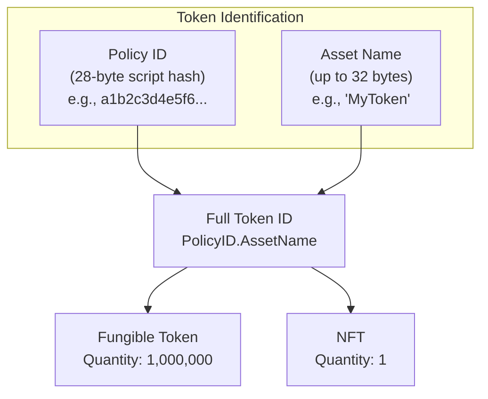
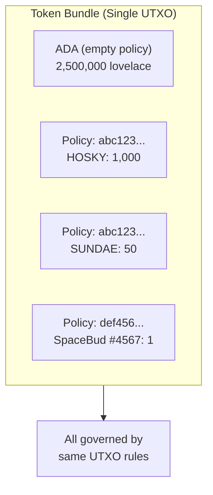
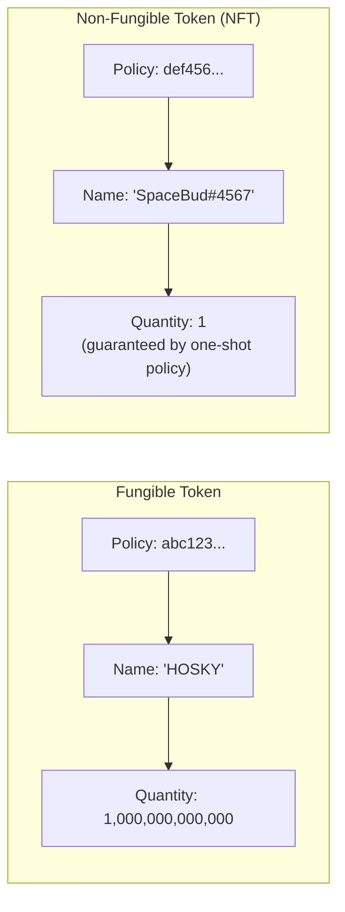
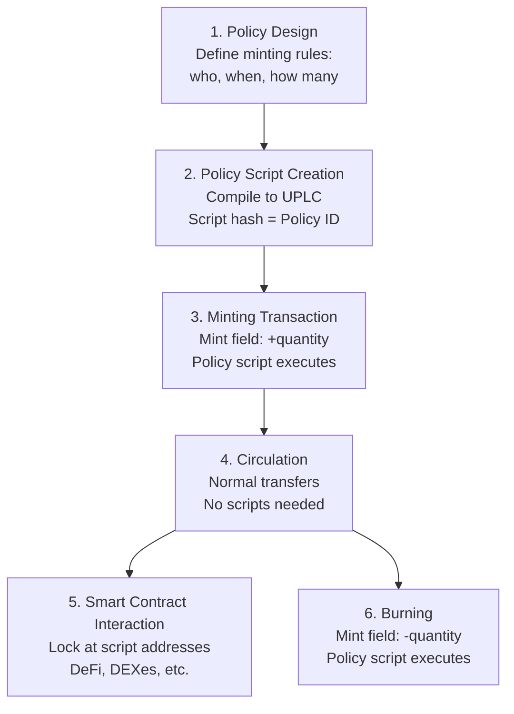

# Bài #10: Token gốc và chính sách đúc

Token gốc Cardano là tài sản tùy chỉnh được theo dõi trực tiếp bởi hạ tầng sổ cái của giao thức, bên cạnh ADA, mà không cần hợp đồng thông minh cho các giao dịch chuyển khoản cơ bản. Khác với token ERC-20 và ERC-721 của Ethereum (là các hợp đồng thông minh duy trì sổ cái riêng), token Cardano sống trong cùng hệ thống UTXO với ADA, giúp chuyển khoản rẻ hơn, an toàn hơn và có thể kết hợp nguyên tử.

Trong bài học này, chúng ta khám phá cách token gốc hoạt động trên Cardano, từ các yếu tố cơ bản của ID chính sách và tên tài sản đến các chính sách đúc kiểm soát việc tạo token. Bạn sẽ tìm hiểu sự khác biệt giữa token có thể thay thế và NFT, hiểu yêu cầu min ADA cho UTXO mang token, và thấy cách chính sách đúc kết nối với mọi thứ bạn đã học trong các bài trước về trình xác thực, datum và redeemer.

## Điều gì khiến token Cardano là "gốc" so với các blockchain khác?

Token Cardano là "gốc" vì sổ cái của giao thức theo dõi chúng bằng cùng cơ chế UTXO theo dõi ADA, không cần thực thi hợp đồng thông minh cho các giao dịch chuyển khoản cơ bản. Điều này có nghĩa là phí thấp hơn, không có rủi ro thực thi hợp đồng cho chuyển khoản, giao dịch đa tài sản nguyên tử trong một đầu ra duy nhất, và quy tắc bảo toàn ở cấp giao thức ngăn token bị tạo hoặc tiêu dùng bất hợp pháp.

Trên Ethereum, tạo token có nghĩa là triển khai hợp đồng thông minh triển khai giao diện (ERC-20 cho token có thể thay thế, ERC-721 cho NFT). Sổ cái của token (ai sở hữu bao nhiêu) được lưu trong trạng thái hợp đồng. Chuyển token có nghĩa là gọi hàm `transfer` của hợp đồng, cập nhật biến lưu trữ.

Trên Cardano, token là **gốc**; chúng được theo dõi bởi cùng cơ chế sổ cái theo dõi ADA. Khi bạn gửi token gốc trong giao dịch, giao thức xử lý giống cách xử lý ADA: thông qua đầu vào và đầu ra. Không cần thực thi hợp đồng thông minh cho các giao dịch chuyển khoản cơ bản.

## Token được xác định trên Cardano như thế nào?

Mỗi token gốc trên Cardano được xác định duy nhất bởi hai thành phần: ID chính sách (Policy ID - hash 28 byte của kịch bản chính sách đúc đã ủy quyền tạo token) và tên tài sản (Asset Name - tùy chọn, tối đa 32 byte phân biệt các token riêng lẻ trong cùng chính sách). Kết hợp lại, chúng tạo thành mã định danh duy nhất toàn cục, bất biến.



### Policy ID là gì?

**Policy ID** là hash của kịch bản chính sách đúc đã ủy quyền tạo token. Đây là mã định danh 28 byte (56 ký tự hex) nhóm các token liên quan với nhau. Tất cả token được đúc dưới cùng chính sách chia sẻ cùng policy ID.

```
Policy ID: a1b2c3d4e5f6...  (56 hex characters)
```

Policy ID là bất biến; nó được tạo từ hash kịch bản, nên thay đổi chính sách đúc sẽ thay đổi policy ID, tạo ra token hoàn toàn khác. Điều này có nghĩa là các quy tắc đúc và đốt token được mã hóa vĩnh viễn trong danh tính của nó.

### Asset Name là gì?

**Asset name** là nhãn tùy chọn (tối đa 32 byte) phân biệt các token riêng lẻ trong cùng chính sách. Đối với token có thể thay thế, thường có một asset name. Đối với bộ sưu tập NFT, mỗi NFT có asset name duy nhất dưới cùng chính sách.

```
Policy ID: a1b2c3d4e5f6...
Asset Name: "MyToken"        (for a fungible token)

Policy ID: a1b2c3d4e5f6...
Asset Name: "Ape#0001"       (for NFT #1 in a collection)
Asset Name: "Ape#0002"       (for NFT #2 in the same collection)
```

Asset name có thể trống (không byte), điều này hợp lệ và đôi khi được sử dụng cho chính sách đơn token.

### Tại sao ADA đặc biệt?

ADA là token duy nhất trên Cardano không có policy ID. Nó là **tiền tệ cơ sở** của giao thức: đơn vị thanh toán phí, phân phối phần thưởng, và tính giá trị UTXO tối thiểu. Trong cấu trúc giá trị đa tài sản, ADA được biểu diễn với policy ID trống và asset name trống:

```
Value structure:
{
  "": {                          -- ADA (empty policy ID)
    "": 5000000                  -- 5 ADA in lovelace (empty asset name)
  },
  "a1b2c3...": {                 -- Custom token policy
    "MyToken": 100               -- 100 units of MyToken
  },
  "d4e5f6...": {                 -- NFT policy
    "UniqueArt": 1               -- 1 NFT
  }
}
```

Cấu trúc giá trị này (bản đồ lồng nhau từ policy ID đến asset name đến số lượng) được gọi là **gói token (token bundle)** hoặc **giá trị đa tài sản**.

## Gói token và giá trị đa tài sản hoạt động như thế nào?

Gói token là cấu trúc bản đồ lồng nhau (`Map<PolicyID, Map<AssetName, Quantity>>`) cho phép một UTXO duy nhất mang ADA cộng với bất kỳ số lượng token gốc khác nhau nào đồng thời. Tất cả tài sản trong gói di chuyển cùng nhau, chuyển khoản trong một đầu ra giao dịch, và được quản lý bởi cùng quy tắc UTXO, cho phép giao dịch đa tài sản nguyên tử.



### Kiểu Value hoạt động như thế nào?

Trên Cardano, trường "value" của mỗi UTXO không chỉ là một số (lượng ADA). Nó là bản đồ có cấu trúc:

```
Value = Map<PolicyID, Map<AssetName, Quantity>>
```

Điều này có nghĩa là một đầu ra duy nhất có thể chứa:

```
Output value:
  2.5 ADA
  + 1000 HOSKY tokens
  + 50 SUNDAE tokens
  + 1 SpaceBudz #4567 NFT
  + 3 WingRiders LP tokens
```

Tất cả những thứ này di chuyển cùng nhau trong một UTXO, chuyển khoản trong một đầu ra giao dịch, và được quản lý bởi cùng quy tắc UTXO.

### Ý nghĩa của gói token là gì?

**Hiệu quả**: Gói nhiều tài sản trong một UTXO duy nhất hiệu quả lưu trữ hơn so với có UTXO riêng biệt cho mỗi loại token.

**Chuyển khoản nguyên tử**: Bạn có thể gửi nhiều loại token khác nhau cho ai đó trong một đầu ra duy nhất. Điều này cho phép hoán đổi nguyên tử và giao dịch đa tài sản phức tạp.

**Phức tạp trong chọn đồng xu**: Khi xây dựng giao dịch, thuật toán chọn đồng xu phải xem xét không chỉ số dư ADA mà cả thành phần đa tài sản đầy đủ của mỗi UTXO. Điều này phức tạp hơn đáng kể so với chọn đồng xu đơn tài sản.

**Ảnh hưởng min ADA**: Nhiều token hơn trong một đầu ra duy nhất có nghĩa là nhiều byte hơn, dẫn đến yêu cầu ADA tối thiểu cao hơn (đề cập bên dưới).

## Chính sách đúc kiểm soát việc tạo và phá hủy token như thế nào?

Chính sách đúc là kịch bản nhận hai đối số (redeemer và ScriptContext) và trả về quyết định boolean về việc token có thể được đúc (tạo với số lượng dương) hoặc đốt (phá hủy với số lượng âm) dưới policy ID của nó. Chính sách thực thi bất cứ khi nào trường `mint` của giao dịch bao gồm token dưới chính sách đó, và bản thân policy ID là hash của kịch bản.

Chính sách đúc nhận hai đối số (không phải ba như trình xác thực chi tiêu):

```
minting_policy(redeemer, scriptContext) -> Bool
```

Không có datum cho chính sách đúc; chúng không liên kết với UTXO cụ thể đang được chi tiêu. Thay vào đó, chúng đánh giá dựa trên redeemer được cung cấp bởi giao dịch và ScriptContext đầy đủ.

Trường `purpose` của ScriptContext sẽ là `Minting(policy_id)`, cho kịch bản biết nó đang được gọi như chính sách đúc. Kịch bản sau đó có thể kiểm tra giao dịch để xác định việc đúc hoặc đốt có nên được phép không.

### Đúc và đốt khác nhau như thế nào?

- **Đúc**: Tạo token mới. Trường `mint` chứa số lượng dương.
- **Đốt**: Phá hủy token hiện có. Trường `mint` chứa số lượng âm.

Chính sách đúc được gọi cho cả hai thao tác. Nó có thể chọn cho phép đúc nhưng không đốt, hoặc ngược lại, hoặc áp dụng quy tắc khác nhau cho mỗi thao tác.

```
Transaction with minting:
  Mint: { policy_abc: { "Token": +100 } }    -- mint 100 tokens

Transaction with burning:
  Mint: { policy_abc: { "Token": -50 } }     -- burn 50 tokens

Transaction with both:
  Mint: {
    policy_abc: { "Token": +100 },           -- mint 100 Token
    policy_xyz: { "OtherToken": -25 }         -- burn 25 OtherToken
  }
```

## Bạn có thể tạo những loại chính sách đúc nào trên Cardano?

Cardano hỗ trợ nhiều loại chính sách đúc: chính sách kịch bản native đơn giản (dựa trên chữ ký và khóa thời gian, không cần Plutus), chính sách one-shot (đảm bảo đúc sử dụng một lần qua tiêu thụ UTXO), chính sách tham số hóa (với cấu hình tại thời điểm biên dịch), và chính sách Plutus đa hành động (hỗ trợ nhiều thao tác qua đối sánh mẫu redeemer).

### Chính sách kịch bản đơn giản (Không cần Plutus)

Các chính sách đúc đơn giản nhất sử dụng ngôn ngữ kịch bản native của Cardano (không phải Plutus) và chỉ yêu cầu chữ ký và/hoặc ràng buộc thời gian:

**Dựa trên chữ ký**: "Chỉ người giữ khóa X mới có thể đúc token dưới chính sách này."
```
Policy: RequireSignature(pub_key_hash_of_issuer)
```

**Khóa thời gian**: "Token chỉ có thể được đúc trước slot N."
```
Policy: RequireAllOf [
  RequireSignature(pub_key_hash_of_issuer),
  RequireTimeBefore(slot_1000000)
]
```

Chính sách khóa thời gian đặc biệt quan trọng vì khi cửa sổ thời gian đóng, không ai (kể cả nhà phát hành ban đầu) có thể đúc thêm token. Điều này tạo ra **nguồn cung cố định có thể chứng minh**, là đảm bảo mạnh mẽ cho người giữ token.

### Chính sách đúc One-Shot

Mẫu one-shot (đề cập trong Bài 9) sử dụng Plutus để đảm bảo việc đúc chỉ có thể xảy ra một lần, mãi mãi. Chính sách yêu cầu UTXO cụ thể làm đầu vào giao dịch:

```
one_shot_policy(redeemer, ctx: ScriptContext) -> Bool {
  // Check that a specific UTXO is consumed as input
  let must_consume = TxOutRef { tx_hash: specific_tx_hash, output_index: 0 }

  list.any(ctx.transaction.inputs, fn(input) {
    input.output_reference == must_consume
  })
}
```

Vì UTXO chỉ có thể được chi tiêu một lần, và policy ID được tạo từ kịch bản (bao gồm tham chiếu UTXO cụ thể), chính sách đúc này chỉ có thể thành công một lần trong toàn bộ lịch sử blockchain. Đây là cách tiêu chuẩn để tạo NFT trên Cardano.

### Chính sách đúc tham số hóa

Chính sách đúc tham số hóa nhận tham số tại thời điểm biên dịch được nhúng vào kịch bản. Điều này tạo ra policy ID khác nhau cho các giá trị tham số khác nhau:

```
parameterized_policy(oracle_address: Address) -> MintingPolicy {
  fn(redeemer, ctx) -> Bool {
    // Check oracle UTXO for current price
    let oracle_input = find_reference_input(ctx, oracle_address)
    let price = extract_price(oracle_input)

    // Apply minting rules based on oracle price
    price > minimum_threshold
  }
}
```

Tham số hóa rất mạnh mẽ vì cho phép bạn tạo họ các chính sách liên quan với cấu hình khác nhau, mỗi cái có policy ID duy nhất riêng.

### Chính sách đúc đa hành động

Giống trình xác thực chi tiêu, chính sách đúc có thể sử dụng redeemer để hỗ trợ nhiều hành động:

```
nft_collection_policy(redeemer: Action, ctx: ScriptContext) -> Bool {
  when redeemer is {
    MintNFT { token_name } ->
      // Check: minting exactly 1 token, metadata is valid, signed by artist
      validate_mint(token_name, ctx)

    BurnNFT { token_name } ->
      // Check: burning exactly 1 token, signed by current holder
      validate_burn(token_name, ctx)

    MintCollectionToken ->
      // Check: one-shot condition met, creating collection reference NFT
      validate_collection_init(ctx)
  }
}
```

## Sự khác biệt giữa token có thể thay thế và NFT trên Cardano là gì?

Sự phân biệt giữa token có thể thay thế và NFT trên Cardano đơn giản chỉ là vấn đề số lượng: token có thể thay thế có số lượng lớn hơn một (tất cả đơn vị giống nhau và có thể hoán đổi), trong khi NFT có số lượng chính xác là một (được đảm bảo bởi chính sách đúc one-shot). Cả hai đều sử dụng cùng cấu trúc nhận dạng PolicyID/AssetName.



### Token có thể thay thế

Token có thể thay thế có số lượng lớn hơn 1 (thường lớn hơn nhiều). Tất cả đơn vị giống nhau và có thể hoán đổi; 100 token HOSKY giống nhau bất kể bạn giữ đơn vị cụ thể nào.

Token có thể thay thế trên Cardano có thể có bất kỳ nguồn cung nào. Chính sách đúc xác định:
- Bao nhiêu có thể đúc (nguồn cung cố định, lạm phát, có giới hạn, v.v.).
- Ai có thể đúc (bất kỳ ai, khóa cụ thể, bỏ phiếu quản trị, v.v.).
- Khi nào có thể đúc (trước thời hạn, liên tục, theo epoch, v.v.).

### Token không thể thay thế (NFT)

NFT đơn giản là token có số lượng chính xác là 1. Chính sách đúc đảm bảo chỉ có một đơn vị có thể tồn tại. Mẫu one-shot mô tả ở trên là cách tiếp cận tiêu chuẩn.

**Metadata NFT** (tên, hình ảnh, mô tả, thuộc tính) thường được đính kèm vào giao dịch đúc bằng tiêu chuẩn metadata CIP-25 hoặc CIP-68:

- **CIP-25**: Metadata được lưu trong trường metadata của giao dịch (khóa 721) trong quá trình đúc. Nó không nằm trên bản thân UTXO nhưng được ghi vĩnh viễn trong giao dịch trên chuỗi.
- **CIP-68**: Tiêu chuẩn nâng cao hơn lưu metadata trong datum nội tuyến trên NFT tham chiếu. Điều này cho phép metadata được cập nhật bằng cách tiêu thụ và tái tạo UTXO tham chiếu.

```
CIP-68 pattern:
  Reference NFT (quantity: 1, asset name prefix: 000643b0):
    Locked at script address
    Inline datum: { name, image, attributes, ... }
    Can be updated by authorized transactions

  User NFT (quantity: 1, asset name prefix: 000de140):
    Held in user's wallet
    Proves ownership
    Metadata is read from the reference NFT
```

### Token bán có thể thay thế

Một số token nằm giữa có thể thay thế và không thể thay thế. Số lượng, ví dụ, 100 của một tên token cụ thể có thể đại diện cho 100 vé đến sự kiện; mỗi vé giống nhau (có thể thay thế trong tập) nhưng đại diện cho danh mục riêng biệt từ các token khác.

## Min ADA ảnh hưởng đến UTXO mang token như thế nào?

Mỗi UTXO mang token trên Cardano phải chứa lượng ADA tối thiểu tỷ lệ với kích thước byte của đầu ra. Mỗi token bổ sung thêm byte policy ID (28), byte asset name (tối đa 32), và byte số lượng vào đầu ra tuần tự hóa, tăng yêu cầu ADA tối thiểu từ khoảng 1,0 ADA cho đầu ra đơn giản lên 3-5+ ADA cho đầu ra mang nhiều token khác nhau.

### Tại sao token tăng min ADA?

Mỗi token trong UTXO thêm dữ liệu vào đầu ra:
- Policy ID (28 byte).
- Asset name (tối đa 32 byte).
- Số lượng (số nguyên kích thước biến).

Nhiều token hơn có nghĩa là đầu ra tuần tự hóa lớn hơn, nghĩa là nhiều byte hơn, nghĩa là yêu cầu ADA tối thiểu cao hơn.

### Ước tính min ADA thực tế là bao nhiêu?

```
ADA-only output:                          ~1.0 ADA
1 token (1 policy, 1 name):              ~1.2 ADA
1 NFT with CIP-68 inline datum:          ~1.5-2.0 ADA
5 different tokens (5 policies):          ~2.0 ADA
20 different tokens (various policies):   ~3.5-5.0 ADA
Output with many tokens near size limit:  ~7-10+ ADA
```

### Ý nghĩa thiết kế là gì?

**Chi phí phân phối token**: Nếu bạn muốn airdrop token cho 10.000 ví, mỗi đầu ra cần ít nhất ~1,2 ADA. Đó là 12.000 ADA chỉ riêng cho yêu cầu min UTXO (ví người nhận sẽ giữ ADA này cùng với token).

**Hợp nhất token**: Nếu người dùng nhận nhiều lượng token nhỏ trong UTXO riêng biệt, mỗi cái mang min ADA riêng. Hợp nhất chúng (gộp nhiều UTXO thành một) giải phóng ADA dư thừa.

**Chi phí đúc NFT**: Mỗi NFT bạn đúc phải được gửi trong UTXO có min ADA. Đối với bộ sưu tập 10.000 NFT, điều này đại diện cho yêu cầu ADA đáng kể trong quá trình đúc.

**Tối ưu gói token**: Gửi nhiều loại token trong một đầu ra duy nhất hiệu quả ADA hơn so với gửi mỗi loại trong đầu ra riêng biệt, vì chi phí min ADA được chia sẻ.

## Vòng đời đầy đủ của token gốc trên Cardano là gì?

Vòng đời token gốc trải qua sáu giai đoạn: thiết kế chính sách (quyết định quy tắc đúc), tạo kịch bản chính sách (biên dịch để có policy ID), giao dịch đúc (tạo token trên chuỗi), lưu thông (chuyển khoản qua giao dịch tiêu chuẩn không cần kịch bản), tương tác với hợp đồng thông minh (khóa tại địa chỉ kịch bản cho DeFi), và đốt (loại bỏ vĩnh viễn token khỏi lưu thông).



### 1. Thiết kế chính sách

Người tạo quyết định các quy tắc đúc:
- Ai có thể đúc? (Khóa cụ thể, bất kỳ ai đáp ứng điều kiện, bỏ phiếu DAO?)
- Khi nào có thể đúc? (Không giới hạn, giới hạn thời gian, một lần?)
- Bao nhiêu? (Nguồn cung cố định, có giới hạn, không giới hạn?)
- Token có thể đốt được không? (Luôn luôn, chỉ người giữ, không bao giờ?)

### 2. Tạo kịch bản chính sách

Chính sách đúc được viết dưới dạng kịch bản native hoặc trình xác thực Plutus/Aiken, sau đó biên dịch. Hash kịch bản trở thành policy ID.

```
Source code (Aiken/Plutus)
  -> Compiled UPLC
  -> Script hash
  -> Policy ID: abc123def456...
```

### 3. Giao dịch đúc

Giao dịch được tạo bao gồm:
- Trường `mint`: `{ policy_id: { "TokenName": +quantity } }`
- Kịch bản chính sách đúc (hoặc tham chiếu đến nó).
- Redeemer cho chính sách đúc.
- Đầu ra nhận token mới đúc (với min ADA).

Kịch bản chính sách đúc thực thi và phải trả về `True` để giao dịch hợp lệ.

```
Minting Transaction:
  Inputs:
    - UTXO_funding (ADA to cover fees and min UTXO)

  Mint:
    - abc123...: { "MYTOKEN": +1000000 }

  Outputs:
    - 1000000 MYTOKEN + 1.5 ADA -> Creator's address
    - Change ADA -> Creator's address

  Fee: ~0.2 ADA

  Witnesses:
    - Minting policy script (or reference)
    - Redeemer: MintAction
    - Creator's signature
```

### 4. Lưu thông

Khi đã đúc, token lưu thông qua giao dịch bình thường; không cần kịch bản. Người dùng có thể gửi, nhận, chia và gộp UTXO token bằng giao dịch tiêu chuẩn với phí tiêu chuẩn.

```
Transfer Transaction (no scripts):
  Inputs:
    - UTXO with 500 MYTOKEN + 2 ADA

  Outputs:
    - 200 MYTOKEN + 1.2 ADA -> Recipient
    - 300 MYTOKEN + 0.6 ADA -> Sender (change)

  Fee: ~0.18 ADA
```

### 5. Tương tác với hợp đồng thông minh

Token có thể được khóa tại địa chỉ kịch bản, sử dụng trong giao thức DeFi, giao dịch trên DEX, hoặc tham gia vào bất kỳ logic hợp đồng thông minh nào. Trình xác thực tại địa chỉ kịch bản có thể kiểm tra giá trị token trong ScriptContext giống cách kiểm tra giá trị ADA.

### 6. Đốt

Nếu chính sách đúc cho phép, token có thể được đốt bằng cách bao gồm số lượng âm trong trường `mint`. Kịch bản chính sách đúc thực thi lại để ủy quyền việc đốt. Token đã đốt bị loại bỏ vĩnh viễn khỏi lưu thông.

```
Burn Transaction:
  Inputs:
    - UTXO with 100 MYTOKEN + 1.5 ADA

  Mint:
    - abc123...: { "MYTOKEN": -100 }  (burning all 100)

  Outputs:
    - 1.3 ADA -> Sender (recovered min ADA minus fee)

  Fee: ~0.2 ADA
```

## Các tiêu chuẩn token Cardano là gì?

Cộng đồng Cardano đã phát triển nhiều tiêu chuẩn CIP (Đề xuất Cải tiến Cardano) cho token: CIP-25 định nghĩa metadata NFT đính kèm trong quá trình đúc (dưới khóa metadata giao dịch 721), CIP-68 lưu metadata có thể cập nhật trong datum nội tuyến trên NFT tham chiếu, và CIP-26 cung cấp sổ đăng ký ngoài chuỗi cho thông tin token dễ đọc như tên, ký hiệu, số thập phân và logo.

### CIP-25: Tiêu chuẩn metadata token đa phương tiện

CIP-25 định nghĩa cách đính kèm metadata vào NFT trong quá trình đúc. Metadata được đặt trong trường metadata của giao dịch dưới khóa 721.

```
Metadata key 721:
{
  "policy_id_hex": {
    "asset_name": {
      "name": "My NFT",
      "image": "ipfs://Qm...",
      "mediaType": "image/png",
      "description": "A unique digital artwork",
      "attributes": {
        "background": "blue",
        "rarity": "legendary"
      }
    }
  }
}
```

### CIP-68: Tiêu chuẩn metadata Datum

Tiêu chuẩn nâng cao hơn lưu metadata trong datum nội tuyến trên NFT tham chiếu. Điều này cho phép:
- **Metadata có thể cập nhật**: UTXO tham chiếu có thể được tiêu thụ và tái tạo với metadata mới.
- **Có thể truy vấn trên chuỗi**: Metadata trong datum nội tuyến có thể được đọc bởi hợp đồng thông minh qua đầu vào tham chiếu.
- **Tách biệt quyền sở hữu và metadata**: Token người dùng (trong ví người giữ) và token tham chiếu (tại địa chỉ kịch bản với metadata) là riêng biệt.

### CIP-26: Metadata ngoài chuỗi Cardano

Sổ đăng ký ngoài chuỗi nơi các dự án token có thể đăng ký thông tin dễ đọc (tên, ký hiệu, số thập phân, logo) cho token của họ. Đây là những gì ví và trình khám phá sử dụng để hiển thị thông tin token thân thiện với người dùng.

### Số thập phân token có thể thay thế hoạt động như thế nào?

Lưu ý quan trọng: token gốc Cardano không có khái niệm số thập phân tích hợp. Tất cả số lượng là số nguyên. Nếu bạn muốn token có 6 chữ số thập phân (như USDC), bạn đúc token theo đơn vị nhỏ và sử dụng quy ước ngoài chuỗi (đăng ký qua CIP-26) để hiển thị với số thập phân.

```
On-chain: 1000000 (integer quantity)
Display:  1.000000 (with 6 decimals, per CIP-26 registration)
```

Điều này tương tự cách ADA và lovelace hoạt động; 1 ADA = 1.000.000 lovelace, và giao thức chỉ biết về lovelace.

## Sổ cái đa tài sản của Cardano so sánh với token hợp đồng thông minh của Ethereum như thế nào?

Token gốc Cardano sống như mục nhập sổ cái trong tập UTXO và chuyển khoản qua đầu ra giao dịch bình thường với phí tiêu chuẩn, trong khi token Ethereum là hợp đồng thông minh với bộ nhớ riêng yêu cầu gọi hàm (và gas) cho mỗi lần chuyển khoản. Cách tiếp cận của Cardano đơn giản và an toàn hơn cho chuyển khoản cơ bản nhưng không thể thực thi logic chuyển khoản tùy chỉnh (như danh sách đen) ở cấp giao thức.

```
Ethereum (ERC-20):                    Cardano (Native Tokens):
============================          ============================
Token = Smart contract                Token = Ledger entry
State in contract storage             State in UTXOs
Transfer = Contract function call     Transfer = Normal TX output
Approval pattern (approve + spend)    No approval needed
Each token has its own "ledger"       All tokens share one ledger
Transfer requires gas for execution   Transfer has standard TX fee
Transfer can fail (contract logic)    Transfer cannot fail (ledger rule)
Composability via contract calls      Composability via TX structure
```

### Ưu điểm của token gốc là gì?

- **Đơn giản và an toàn hơn**: Không có lỗi hợp đồng thông minh trong chuyển khoản token cơ bản.
- **Rẻ hơn**: Không có phí thực thi cho chuyển khoản tiêu chuẩn.
- **Đa tài sản nguyên tử**: Một đầu ra, nhiều token.
- **Xử lý đồng nhất**: Giao thức xử lý tất cả token như nhau (trừ vai trò đặc biệt của ADA trong phí).

### Các sự đánh đổi là gì?

- **Không có logic chuyển khoản tích hợp**: Bạn không thể triển khai quy tắc chuyển khoản tùy chỉnh (như danh sách đen hoặc phí chuyển khoản) ở cấp giao thức. Trên Ethereum, hợp đồng ERC-20 có thể từ chối chuyển khoản. Trên Cardano, chuyển khoản không bị hạn chế khi token tồn tại; quy tắc tùy chỉnh yêu cầu khóa token tại địa chỉ kịch bản.
- **Chi phí min ADA**: Mỗi UTXO mang token phải mang ADA, đây là chi phí thêm không có trong mô hình Ethereum.
- **Không có số thập phân tích hợp**: Như đã lưu ý, hiển thị số thập phân là quy ước ngoài chuỗi, không phải tính năng giao thức.

## So sánh với Web2

**Policy ID và Asset Name như khóa ghép cơ sở dữ liệu**: Trong cơ sở dữ liệu quan hệ, bạn có thể xác định biến thể sản phẩm bằng khóa ghép `(product_id, variant_sku)`. Policy ID giống `product_id` (nhóm các mục liên quan), và asset name giống `variant_sku` (phân biệt các mục cụ thể trong nhóm). Kết hợp lại, chúng tạo thành mã định danh duy nhất toàn cục.

**Chính sách đúc như quyền API / OAuth Scopes**: Chính sách đúc định nghĩa ai có thể tạo token và trong điều kiện nào; đây chính xác là những gì quyền API và OAuth scopes làm. Scope `admin:write` cho phép tạo tài nguyên; chính sách đúc với yêu cầu chữ ký cho phép tạo token. Chính sách khóa thời gian giống khóa API có ngày hết hạn. Chính sách one-shot giống liên kết mời dùng một lần.

**Token gốc như tài sản CMS**: Trong hệ thống quản lý nội dung (CMS), bạn tạo tài sản (hình ảnh, tài liệu, video) sống trong lưu trữ native của hệ thống. Bạn có thể gắn thẻ, tổ chức thành bộ sưu tập, và quản lý quyền. Token gốc Cardano hoạt động tương tự; chúng là tài sản được quản lý bởi "hệ thống quản lý nội dung" native của sổ cái, với chính sách đóng vai trò quy tắc quyền và asset name đóng vai trò mã định danh.

**Gói token như mặt hàng giỏ hàng**: Gói token (UTXO chứa nhiều loại token) giống giỏ hàng chứa mặt hàng từ nhiều nhà cung cấp. Mọi thứ di chuyển cùng nhau, và thanh toán (giao dịch) xử lý tất cả mặt hàng một cách nguyên tử. Bạn không cần giao dịch riêng biệt cho mặt hàng của mỗi nhà cung cấp.

**Metadata CIP-25/CIP-68 như mục nhập danh mục sản phẩm**: Tiêu chuẩn metadata token giống định dạng dữ liệu sản phẩm chuẩn hóa (như nguồn cấp dữ liệu Google Shopping hoặc danh sách sản phẩm Amazon). Chúng định nghĩa lược đồ cách mô tả token (tên, hình ảnh, thuộc tính), đảm bảo ví và sàn giao dịch có thể hiển thị token nhất quán, giống cách nền tảng thương mại điện tử hiển thị sản phẩm nhất quán bằng dữ liệu sản phẩm chuẩn hóa.

**Min ADA như hạn ngạch lưu trữ**: Yêu cầu min ADA tương tự hạn ngạch lưu trữ trong dịch vụ đám mây. Lưu trữ dữ liệu (token trong UTXO) yêu cầu phân bổ tài nguyên tối thiểu (ADA). Nhiều dữ liệu hơn (nhiều token hơn) yêu cầu nhiều tài nguyên hơn. Khi bạn xóa dữ liệu (đốt token hoặc hợp nhất UTXO), bạn lấy lại tài nguyên (lấy lại ADA).

## Các điểm chính

- **Token Cardano là gốc**: chúng sống trong cùng sổ cái với ADA, không cần hợp đồng thông minh cho chuyển khoản cơ bản. Điều này làm chúng đơn giản, rẻ và an toàn hơn token dựa trên hợp đồng thông minh.
- **Mỗi token được xác định bởi Policy ID (hash kịch bản) và Asset Name**: kết hợp tạo thành mã định danh duy nhất toàn cục, bất biến, với quy tắc đúc được ràng buộc mật mã vào danh tính token.
- **Chính sách đúc kiểm soát việc tạo và phá hủy token**: từ kịch bản chữ ký/khóa thời gian đơn giản đến trình xác thực Plutus phức tạp triển khai logic one-shot, tham số hóa hoặc đa hành động.
- **Mô hình giá trị đa tài sản** cho phép một UTXO duy nhất mang ADA cộng với bất kỳ số lượng token khác nhau nào, cho phép giao dịch đa tài sản nguyên tử và gói token hiệu quả.
- **Yêu cầu min ADA đảm bảo tính bền vững sổ cái**: mỗi UTXO mang token phải mang đủ ADA để biện minh cho chi phí lưu trữ, với số tiền tỷ lệ theo kích thước byte của đầu ra.

## Tiếp theo

Chúc mừng: bây giờ bạn đã có nền tảng lý thuyết toàn diện về công nghệ blockchain Cardano. Từ mô hình UTXO và đồng thuận đến giao dịch, hợp đồng thông minh và token gốc, bạn hiểu kiến trúc khái niệm cung cấp sức mạnh cho một trong những nền tảng blockchain có nguyên tắc nhất. Bước tiếp theo là chuyển từ lý thuyết sang thực hành, áp dụng các khái niệm này với công cụ thực, mã thực và giao dịch thực trên testnet của Cardano.
