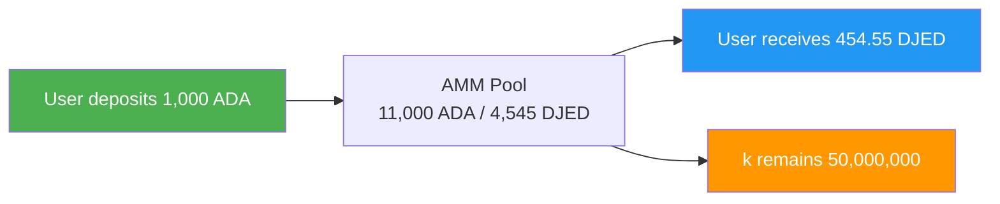
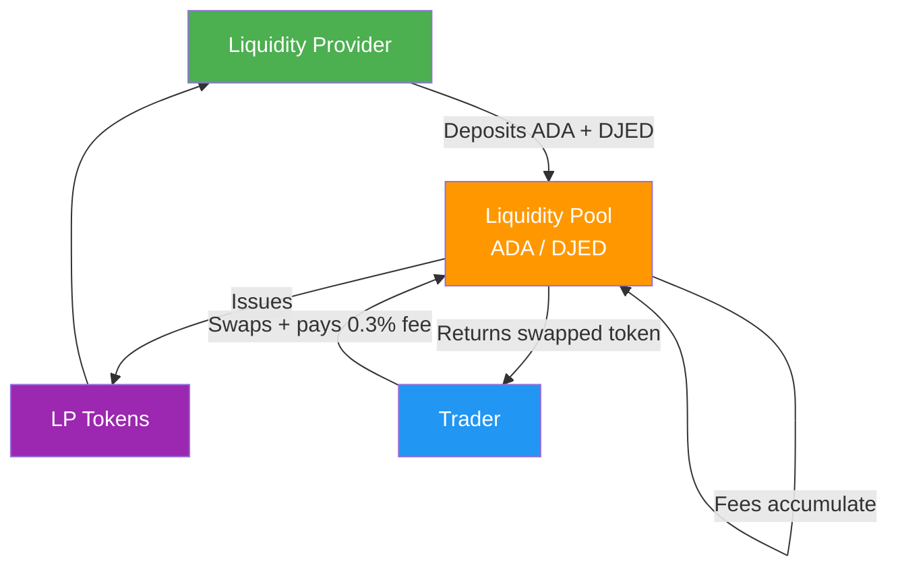
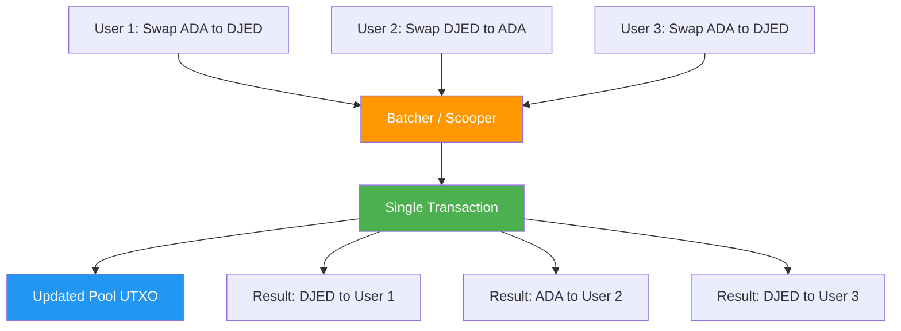

# Bài #11: Khái niệm DeFi cho Lập trình viên

Tài chính phi tập trung (DeFi) thay thế các trung gian tài chính truyền thống bằng các giao thức smart contract, cho phép giao dịch, cho vay và tạo lợi nhuận trực tiếp trên blockchain mà không cần sự cho phép. Đối với lập trình viên web2, DeFi giới thiệu một mô hình mà logic tài chính sống trên chuỗi, có thể kết hợp như microservice nhưng không cần tin cậy và không cần sự cho phép. Bài học này khám phá các thành phần cốt lõi của DeFi, cách chúng hoạt động bên trong, và những thách thức thiết kế cùng giải pháp cụ thể khi xây dựng giao thức DeFi trên mô hình eUTXO của Cardano.

## Bối cảnh DeFi là gì?

Bối cảnh DeFi bao gồm tất cả các giao thức tài chính thay thế các trung gian truyền thống (ngân hàng, công ty môi giới, trung tâm thanh toán bù trừ) bằng smart contract xác định chạy trên blockchain. Mỗi trung gian mà DeFi loại bỏ sẽ xóa đi một khoản phí, giảm độ trễ và loại bỏ một yêu cầu tin cậy.

Hệ sinh thái DeFi bao gồm nhiều loại giao thức:

- **Sàn giao dịch phi tập trung (DEX)**: Giao dịch token mà không cần sổ lệnh tập trung
- **Cho vay và Vay mượn**: Cung cấp tài sản để kiếm lợi nhuận; vay dựa trên tài sản thế chấp
- **Stablecoin**: Token neo giá với tiền pháp định thông qua cơ chế thuật toán hoặc thế chấp
- **Bộ tối ưu hóa lợi nhuận**: Tự động tối ưu lợi nhuận trên nhiều giao thức
- **Tài sản tổng hợp**: Đại diện trên chuỗi của tài sản thực
- **Bảo hiểm**: Bảo hiểm phi tập trung chống lại lỗi smart contract

Trên Cardano, hệ sinh thái DeFi bao gồm các giao thức như Minswap, SundaeSwap và WingRiders (DEX), Liqwid Finance và Lenfi (cho vay), Djed và iUSD (stablecoin), và Optim Finance (tối ưu lợi nhuận). Mỗi giao thức này hoạt động trong giới hạn và ưu thế của mô hình eUTXO của Cardano, dẫn đến các mẫu kiến trúc đặc biệt.

## Sàn giao dịch phi tập trung (DEX) là gì?

Sàn giao dịch phi tập trung (DEX) cho phép người dùng hoán đổi token này sang token khác thông qua smart contract, không cần trung gian tập trung nắm giữ tài sản. Khác với Coinbase hay Binance, nơi sàn kiểm soát tài sản của bạn trong giao dịch, DEX thực hiện hoán đổi mà bạn không bao giờ mất quyền kiểm soát.

### Sổ lệnh so với AMM như thế nào?

Các sàn chứng khoán truyền thống và sàn crypto tập trung sử dụng **sổ lệnh**: một cấu trúc dữ liệu khớp lệnh mua với lệnh bán tại các mức giá cụ thể. Các nhà tạo lập thị trường đặt lệnh giới hạn ở cả hai bên sổ, và giao dịch được thực hiện khi giá của người mua gặp giá của người bán.

```
Sổ lệnh truyền thống:
+------------------------------------------+
|  LỆNH BÁN (Asks)                        |
|  Bán 100 ADA @ $0.52                    |
|  Bán 250 ADA @ $0.51                    |
|  Bán 500 ADA @ $0.505                   |
|-------------- CHÊNH LỆCH ----------------|
|  Mua 300 ADA @ $0.50                     |
|  Mua 150 ADA @ $0.49                     |
|  Mua 400 ADA @ $0.485                    |
|  LỆNH MUA (Bids)                        |
+------------------------------------------+
```

Sổ lệnh trên chuỗi rất tốn kém vì mỗi lần đặt lệnh, hủy lệnh và sửa lệnh đều cần một giao dịch. Trên các blockchain có thông lượng hạn chế, mô hình này trở nên không thực tế. Một số DEX trên Cardano như Genius Yield có triển khai mô hình sổ lệnh trên chuỗi, sử dụng khả năng của mô hình eUTXO để biểu diễn mỗi lệnh dưới dạng một UTXO riêng biệt. Nhưng mô hình chủ đạo trong DeFi là **Nhà tạo lập thị trường tự động (AMM)**.

### Nhà tạo lập thị trường tự động (AMM) hoạt động như thế nào?

AMM thay thế sổ lệnh bằng một công thức toán học xác định giá tài sản dựa trên tỷ lệ dự trữ trong **nhóm thanh khoản**. Thay vì khớp từng người mua với người bán, bất kỳ ai cũng có thể giao dịch với nhóm, và công thức tự động điều chỉnh giá dựa trên cung và cầu.

Công thức phổ biến nhất là **công thức tích không đổi**, được Uniswap phổ biến trên Ethereum và được nhiều DEX trên Cardano áp dụng:

```
x * y = k

Trong đó:
  x = số lượng Token A trong nhóm
  y = số lượng Token B trong nhóm
  k = hằng số (tích phải không đổi sau mỗi giao dịch)
```

Đây là một ví dụ cụ thể. Giả sử một nhóm thanh khoản chứa:

- 10.000 ADA (Token A)
- 5.000 DJED (Token B)
- k = 10.000 * 5.000 = 50.000.000

Một nhà giao dịch muốn mua DJED bằng 1.000 ADA. Sau giao dịch:

```
ADA mới trong nhóm:   10.000 + 1.000 = 11.000
DJED mới trong nhóm:  k / new_x = 50.000.000 / 11.000 = 4.545,45
DJED nhận được:       5.000 - 4.545,45 = 454,55 DJED
Giá hiệu quả:        1.000 ADA / 454,55 DJED = 2,20 ADA mỗi DJED
```

Lưu ý nhà giao dịch nhận được khoảng 454,55 DJED thay vì 500 DJED như kỳ vọng (ở tỷ giá ban đầu 2 ADA mỗi DJED). Sự khác biệt này được gọi là **trượt giá**, và nó tăng lên với các giao dịch lớn so với kích thước nhóm. Công thức tích không đổi tạo ra một đường cong mà giá thay đổi mạnh hơn khi bạn rút cạn một bên của nhóm.



### Có những công thức AMM nào khác?

Công thức tích không đổi không phải là lựa chọn duy nhất. Các công thức khác nhau tối ưu cho các trường hợp sử dụng khác nhau:

- **Tổng không đổi (x + y = k)**: Không có trượt giá nhưng có thể bị rút cạn hoàn toàn một loại tài sản. Hiếm khi được sử dụng trong thực tế.
- **StableSwap (Curve)**: Công thức lai tối ưu cho các tài sản nên giao dịch gần mức 1:1 (như các cặp stablecoin). Nó hoạt động như tổng không đổi gần trung tâm và tích không đổi ở các cực, mang lại trượt giá thấp cho giao dịch cân bằng.
- **Thanh khoản tập trung**: Cho phép nhà cung cấp thanh khoản chỉ định phạm vi giá, tập trung vốn ở nơi hữu ích nhất. Điều này tăng hiệu quả vốn đáng kể nhưng thêm độ phức tạp.

Trên Cardano, Minswap sử dụng AMM tích không đổi với biến thể stableswap cho các cặp ổn định. SundaeSwap cũng triển khai mô hình tích không đổi. Việc chọn công thức ảnh hưởng đến trải nghiệm người dùng, hiệu quả vốn và độ phức tạp triển khai.

## Nhóm thanh khoản và Nhà cung cấp thanh khoản hoạt động như thế nào?

Nhóm thanh khoản nắm giữ dự trữ token theo cặp mà nhà giao dịch hoán đổi. **Nhà cung cấp thanh khoản (LP)** gửi giá trị bằng nhau của cả hai token vào nhóm và nhận lại **token LP**, đại diện cho phần của họ trong nhóm. Phí giao dịch tích lũy trong nhóm, tăng giá trị của mỗi token LP theo thời gian.



Khi LP muốn rút, họ đốt token LP của mình và nhận phần tỷ lệ của nhóm, giờ đã bao gồm phí tích lũy. Đây là cách LP kiếm lợi nhuận: phí giao dịch do người hoán đổi trả tích lũy vào nhóm, tăng giá trị của mỗi token LP theo thời gian.

### Tổn thất tạm thời là gì?

Tổn thất tạm thời (IL) là sự chênh lệch giá trị giữa việc giữ token trong nhóm AMM so với đơn giản giữ chúng trong ví. Khi tỷ giá của các tài sản trong nhóm lệch khỏi tỷ giá khi gửi, việc tái cân bằng liên tục của AMM khiến LP nắm giữ ít tài sản tăng giá hơn so với khi chỉ giữ.

Xem xét một LP gửi 1.000 ADA và 500 DJED (ở mức giá 2 ADA mỗi DJED). Nếu giá ADA tăng gấp đôi so với DJED:

```
Gửi ban đầu:  1.000 ADA + 500 DJED
Nếu giữ (không LP):  1.000 ADA (giờ giá trị gấp 2) + 500 DJED = tương đương $3.000
Là LP sau thay đổi giá: ~707 ADA + ~707 DJED = tương đương ~$2.828

Tổn thất tạm thời: ~5,7%
```

Tổn thất được gọi là "tạm thời" vì nếu giá quay lại tỷ lệ ban đầu, tổn thất sẽ biến mất. Nó chỉ trở thành vĩnh viễn khi LP rút ở một tỷ giá khác. Phí giao dịch có thể bù đắp tổn thất tạm thời, nhưng trong giai đoạn biến động mạnh, IL có thể vượt quá thu nhập phí.

Đối với lập trình viên web2, hãy nghĩ về tổn thất tạm thời như "chi phí tái cân bằng". AMM liên tục bán tài sản tăng giá và mua tài sản giảm giá. LP về cơ bản trả tiền cho quá trình khám phá giá.

## Oracle đưa dữ liệu ngoài chuỗi lên chuỗi như thế nào?

Oracle cung cấp dữ liệu bên ngoài vào blockchain, thu hẹp khoảng cách giữa smart contract trên chuỗi và các nguồn thông tin ngoài chuỗi như bảng giá, dữ liệu thời tiết, hoặc kết quả thể thao. Smart contract không thể truy vấn API một cách tự nhiên, vì vậy oracle đăng dữ liệu đã xác minh dưới dạng datum trên chuỗi mà contract có thể tham chiếu.

Trên Cardano, oracle thường đăng dữ liệu dưới dạng **datum** đính kèm vào UTXO tại một địa chỉ script đã biết. Smart contract sau đó tham chiếu các UTXO này làm đầu vào để đọc dữ liệu mới nhất. Các nhà cung cấp oracle chính trong hệ sinh thái Cardano bao gồm:

- **Charli3**: Oracle gốc Cardano cung cấp bảng giá và dữ liệu khác
- **Orcfax**: Giải pháp oracle phi tập trung nhấn mạnh tính xác thực và nguồn gốc dữ liệu
- **Iagon**: Nhà cung cấp oracle lưu trữ và tính toán phi tập trung trong hệ sinh thái Cardano

**Vấn đề oracle** là cơ bản: làm thế nào bạn tin rằng dữ liệu đăng trên chuỗi là chính xác? Các giải pháp bao gồm sử dụng nhiều nguồn dữ liệu độc lập, khuyến khích kinh tế (đặt cọc tài sản thế chấp có thể bị phạt nếu dữ liệu sai), và chứng minh mật mã. Oracle vẫn là một trong những thành phần quan trọng và dễ bị tổn thương nhất của hạ tầng DeFi. Một oracle bị xâm phạm có thể khiến giao thức cho vay thanh lý vị thế không chính xác, DEX cung cấp giao dịch sai giá, hoặc stablecoin mất neo giá.

## Thách thức thiết kế eUTXO cho DeFi là gì?

Mô hình eUTXO của Cardano yêu cầu các giao thức DeFi giải quyết tính đồng thời khác với mô hình tài khoản của Ethereum, vì một UTXO đơn lẻ chỉ có thể được tiêu thụ bởi một giao dịch mỗi block. Các lập trình viên đã tạo ra các mẫu gom lệnh và phân mảnh nhóm để xử lý ràng buộc này trong khi bảo toàn tính xác định và khả năng chống front-running của mô hình.

### Vấn đề đồng thời là gì?

Trong mô hình dựa trên tài khoản (Ethereum), một smart contract giữ một trạng thái có thể thay đổi duy nhất. Nhiều người dùng có thể tương tác với nó trong cùng một block, và blockchain xử lý thứ tự. Trong mô hình eUTXO của Cardano, một UTXO chỉ có thể được chi tiêu một lần. Nếu một nhóm thanh khoản được biểu diễn dưới dạng một UTXO duy nhất, chỉ một người dùng có thể tương tác với nó mỗi block.

```
Thách thức đồng thời:

Block N:
  Người dùng A muốn hoán đổi ADA sang DJED  --+
  Người dùng B muốn hoán đổi ADA sang DJED  --+--> Chỉ MỘT có thể chi tiêu UTXO nhóm
  Người dùng C muốn hoán đổi DJED sang ADA  --+

  Kết quả: Hai giao dịch thất bại với "UTXO đã được chi tiêu"
```

Đây không phải là lỗi trong eUTXO; đây là sự khác biệt cơ bản trong mô hình. Các lập trình viên Cardano đã tạo ra nhiều mẫu thiết kế để giải quyết thách thức này.

### Gom lệnh giải quyết đồng thời như thế nào?

Mẫu phổ biến nhất trên các DEX Cardano là **gom lệnh**. Thay vì người dùng tương tác trực tiếp với nhóm thanh khoản, họ gửi **UTXO lệnh** thể hiện ý định (ví dụ, "hoán đổi 100 ADA sang DJED với trượt giá tối đa 2%"). Một **batcher** (đôi khi gọi là scooper) thu thập nhiều lệnh và thực hiện chúng với nhóm trong một giao dịch duy nhất.



Mẫu này có nhiều ưu điểm. Nhiều lệnh được xử lý nguyên tử trong một giao dịch duy nhất, giảm tranh chấp. Batcher có thể tối ưu thứ tự thực hiện. Người dùng không cần cạnh tranh trực tiếp cho UTXO nhóm.

Tuy nhiên, gom lệnh tạo ra độ trễ (người dùng phải chờ batcher bao gồm lệnh của họ) và yêu cầu tin cậy vào batcher (mặc dù smart contract đảm bảo tính đúng đắn). Hầu hết DEX trên Cardano phi tập trung hóa vai trò batcher bằng cách cho phép bất kỳ ai chạy batcher và kiếm phí.

### Phân mảnh nhóm hoạt động như thế nào?

Một cách tiếp cận khác chia nhóm thanh khoản thành nhiều UTXO. Thay vì một UTXO chứa tất cả thanh khoản, nhóm có thể được biểu diễn dưới dạng nhiều UTXO nhỏ hơn, mỗi cái chứa một phần. Điều này cho phép nhiều giao dịch thực hiện đồng thời trên các UTXO khác nhau.

```
Nhiều UTXO nhóm:

Thay vì một UTXO nhóm với 100.000 ADA / 50.000 DJED:

+----------------+  +----------------+  +----------------+
| Pool Shard 1   |  | Pool Shard 2   |  | Pool Shard 3   |
| 33.333 ADA     |  | 33.333 ADA     |  | 33.334 ADA     |
| 16.667 DJED    |  | 16.667 DJED    |  | 16.666 DJED    |
+----------------+  +----------------+  +----------------+

Ba người dùng giờ có thể hoán đổi đồng thời trên các mảnh khác nhau.
```

Đánh đổi là tăng độ phức tạp trong việc duy trì giá nhất quán giữa các mảnh và khả năng trượt giá cao hơn trên từng mảnh (vì mỗi mảnh chứa ít thanh khoản hơn).

### Tính xác định mang lại lợi thế gì cho eUTXO trong DeFi?

Mặc dù đồng thời là một thách thức, mô hình eUTXO mang lại một lợi thế mạnh mẽ cho DeFi: **tính xác định**. Trên Ethereum, một giao dịch có thể thành công trong mô phỏng cục bộ nhưng thất bại trên chuỗi vì một giao dịch khác đã thay đổi trạng thái contract giữa lúc gửi và thực thi (được gọi là MEV, hay Giá trị có thể khai thác tối đa). Trên Cardano, kết quả giao dịch hoàn toàn xác định. Nếu giao dịch hợp lệ cục bộ, nó sẽ cho kết quả chính xác giống vậy trên chuỗi, giả sử các UTXO đầu vào chưa bị chi tiêu.

Tính xác định này cũng có nghĩa là Cardano vốn đã kháng lại **front-running**, một thực hành mà các thợ đào hoặc validator sắp xếp lại giao dịch để kiếm lợi từ người dùng. Vì giao dịch Cardano chỉ định chính xác đầu vào và đầu ra, validator không thể chèn giao dịch của họ trước giao dịch của bạn để thao túng giá.

## Điều gì khiến tính kết hợp trở thành siêu năng lực của DeFi?

Tính kết hợp cho phép lập trình viên kết hợp nhiều giao thức DeFi trong một giao dịch nguyên tử duy nhất, tạo ra các hoạt động tài chính phức tạp từ các khối xây dựng đơn giản. Theo thuật ngữ web2, hãy tưởng tượng nếu mọi API trên thế giới cùng chia sẻ một hệ thống xác thực, cùng định dạng dữ liệu, và có thể được gọi trong một yêu cầu nguyên tử duy nhất hoặc hoàn toàn thành công hoặc hoàn toàn quay lại.

Trên Cardano, tính kết hợp được thể hiện thông qua khả năng tham chiếu nhiều đầu vào và đầu ra script trong một giao dịch duy nhất. Một giao dịch duy nhất có thể:

1. Rút tài sản thế chấp từ giao thức cho vay
2. Hoán đổi tài sản đó trên DEX
3. Cung cấp thanh khoản cho nhóm khác
4. Mint một NFT biên nhận

Tất cả nguyên tử. Nếu bất kỳ bước nào thất bại, toàn bộ giao dịch không hợp lệ và không có thay đổi trạng thái nào xảy ra.

Tính kết hợp này là điều khiến các giao thức DeFi hoạt động như "Lego tiền tệ": các khối xây dựng có thể xếp chồng, hoán đổi, tạo ra các công cụ tài chính ngày càng phức tạp từ các thành phần đơn giản.

## Tại sao Flash Loan không tồn tại trên Cardano?

Flash loan trên Ethereum cho phép người dùng vay token không giới hạn mà không cần tài sản thế chấp, miễn là họ trả lại khoản vay trong cùng một giao dịch. Mô hình eUTXO của Cardano ngăn điều này vì mỗi giao dịch phải cân bằng đầu vào và đầu ra tại thời điểm xây dựng; bạn không thể "vay" tài sản giữa chừng giao dịch.

Trên Ethereum, flash loan hoạt động vì EVM xử lý giao dịch tuần tự trong một block và có thể kiểm tra ở cuối giao dịch liệu khoản vay đã được trả hay chưa. Trên Cardano, giao dịch phải được xác định đầy đủ trước khi gửi.

Một số giao thức đã khám phá các giải pháp thay thế, như các mẫu "tương tự flash loan" sử dụng nhiều giao dịch liên kết, nhưng mô hình eUTXO về cơ bản ngăn chặn việc vay không có bảo đảm trong một giao dịch đặc trưng của flash loan Ethereum.

Đây thực sự là một lợi thế bảo mật. Flash loan trên Ethereum đã được sử dụng để thực hiện các cuộc tấn công phức tạp chống lại giao thức DeFi, thao túng giá và rút cạn quỹ trong một giao dịch duy nhất. Mô hình của Cardano khiến các vector tấn công này khó khai thác hơn đáng kể.

## Yield Farming và Liquidity Mining hoạt động như thế nào?

Yield farming là thực hành triển khai vốn một cách chiến lược trên các giao thức DeFi để tối đa hóa lợi nhuận, trong khi liquidity mining cụ thể phân phối token quản trị cho nhà cung cấp thanh khoản như khuyến khích bổ sung ngoài phí giao dịch.

Trên Cardano, cơ hội yield farming bao gồm:

- Cung cấp thanh khoản trên DEX và kiếm phí giao dịch cộng token giao thức (ví dụ, token MIN từ Minswap)
- Cho vay tài sản trên các nền tảng như Liqwid và kiếm lãi cộng token giao thức
- Staking token LP trong "farm" để nhận thêm phần thưởng
- Tham gia các sự kiện khởi tạo thanh khoản cho token mới

Lợi nhuận trong DeFi không phải phép thuật. Chúng đến từ phí giao dịch (hoạt động kinh tế thực), phát hành token (phần thưởng lạm phát có thể giữ hoặc không giữ giá trị), và chia sẻ doanh thu giao thức. Hiểu nguồn gốc lợi nhuận là then chốt để đánh giá rủi ro.

## Tương tự Web2

Nếu bạn đến từ web2, nhiều khái niệm DeFi có những tương đồng quen thuộc:

**DEX giống như các công cụ khớp lệnh của sàn chứng khoán**, ngoại trừ logic khớp lệnh là công khai, bất kỳ ai cũng có thể làm nhà tạo lập thị trường, và không có nhà môi giới giữa bạn và thị trường. Trong khi sàn chứng khoán có thuật toán khớp lệnh độc quyền, AMM công bố công thức để bất kỳ ai cũng có thể xác minh và tương tác.

**Nhóm thanh khoản AMM giống như connection pool trong web server.** Một connection pool duy trì tập hợp kết nối cơ sở dữ liệu được thiết lập sẵn mà nhiều yêu cầu có thể sử dụng. Tương tự, nhóm thanh khoản duy trì dự trữ tài sản mà nhiều nhà giao dịch có thể hoán đổi. Nhóm phải được định cỡ phù hợp với nhu cầu; quá nhỏ và bạn bị tắc nghẽn (trượt giá cao), quá lớn và tài nguyên bị sử dụng không hiệu quả (lợi nhuận thấp cho LP).

**Oracle giống như bộ tổng hợp API hoặc nhà cung cấp webhook.** Trong web2, bạn có thể sử dụng dịch vụ như Plaid để tổng hợp dữ liệu ngân hàng hoặc API bảng giá như Alpha Vantage. Oracle phục vụ cùng mục đích nhưng phải giải quyết tính không cần tin cậy. Hãy tưởng tượng xây dựng hệ thống mà bạn không thể tin bất kỳ nhà cung cấp API nào, nên bạn truy vấn năm nhà cung cấp, loại bỏ giá trị ngoại lai, và lấy trung vị. Đó về cơ bản là cách oracle phi tập trung hoạt động.

**Gom lệnh giống như xử lý hàng loạt trong hàng đợi tin nhắn.** Thay vì xử lý từng tin nhắn (lệnh) riêng lẻ, một consumer (batcher) thu thập tin nhắn từ hàng đợi, xử lý chúng hàng loạt, và ghi kết quả. Hãy nghĩ đến Amazon SQS nơi một hàm Lambda lấy tin nhắn và xử lý chúng theo lô để tăng hiệu quả.

**Tổn thất tạm thời giống như chi phí duy trì cache trong khối lượng ghi nặng.** Bạn phân bổ trước tài nguyên (thanh khoản) để phục vụ yêu cầu (giao dịch) hiệu quả hơn, nhưng nếu dữ liệu nền (giá) thay đổi nhanh, cache (tỷ lệ nhóm) trở nên lỗi thời và chi phí tái cân bằng vượt quá lợi ích của caching.

**Tính kết hợp giống như Unix pipe** nơi đầu ra của một chương trình trở thành đầu vào của chương trình khác, ngoại trừ mọi lệnh trong pipeline hoặc hoàn toàn thành công hoặc hoàn toàn quay lại. Đó là `grep | sort | uniq` nhưng với đảm bảo nguyên tử mà lập trình viên web2 chỉ có thể mơ ước.

## Điểm chính

- **AMM thay thế sổ lệnh** bằng công thức toán học (như công thức tích không đổi) tự động định giá tài sản dựa trên dự trữ nhóm, cho phép giao dịch không cần phép mà không cần trung gian tập trung.
- **Nhà cung cấp thanh khoản kiếm phí nhưng đối mặt với tổn thất tạm thời**: chi phí ẩn phát sinh khi tỷ giá tài sản trong nhóm lệch khỏi tỷ lệ lúc gửi.
- **Oracle thu hẹp khoảng cách trên chuỗi/ngoài chuỗi** bằng cách đăng dữ liệu bên ngoài dưới dạng datum, nhưng chúng đưa vào các giả định tin cậy cần được quản lý cẩn thận.
- **Mô hình eUTXO của Cardano yêu cầu các mẫu đặc thù DeFi** như gom lệnh và phân mảnh nhóm để xử lý đồng thời, nhưng nó cung cấp tính xác định và khả năng chống front-running như những lợi thế bù đắp mạnh mẽ.
- **Tính kết hợp khiến giao thức DeFi trở thành các khối xây dựng tương tác**, cho phép các hoạt động tài chính phức tạp trong các giao dịch nguyên tử đơn lẻ.

## Tiếp theo

Bây giờ bạn đã hiểu các thành phần tài chính cơ bản cung cấp năng lượng cho DeFi, bài học tiếp theo khám phá hạ tầng giúp mạng lưới Cardano vận hành: stake pool, ủy quyền, và cơ chế đồng thuận bảo vệ mọi giao dịch đã thảo luận cho đến nay.
