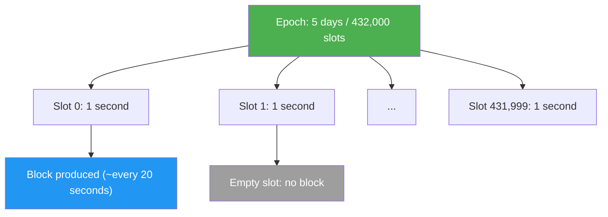
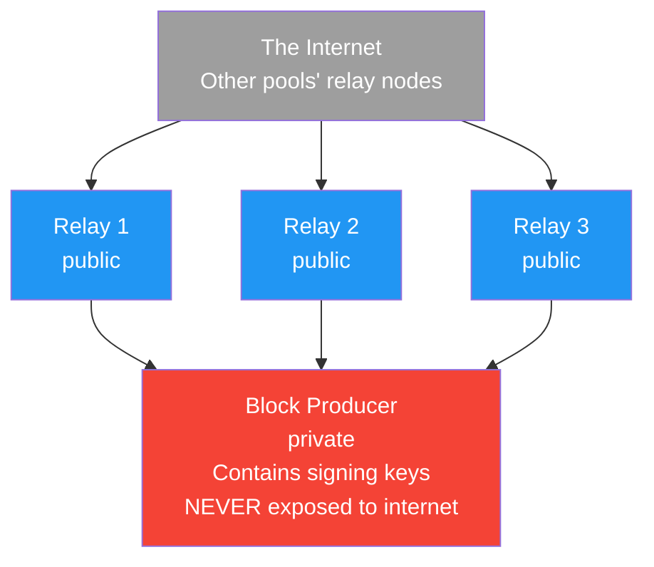
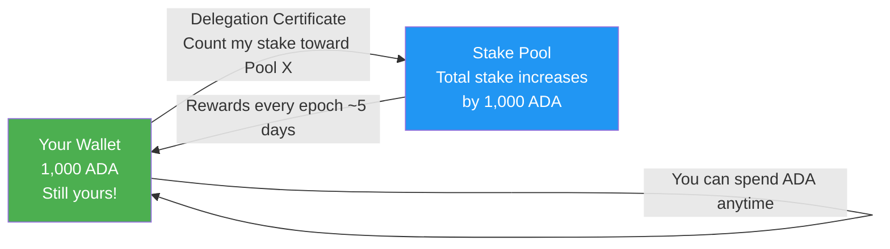
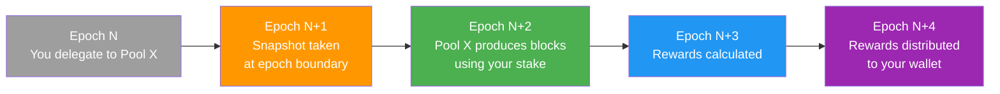

# Bài #12: Stake Pool, Ủy quyền và Mạng lưới

Đồng thuận proof-of-stake của Cardano bảo vệ mạng lưới thông qua việc người nắm giữ ADA cùng ủy quyền stake của họ cho các stake pool, nơi tạo block và kiếm phần thưởng tỷ lệ với tổng stake được ủy quyền. Đối với lập trình viên web2, hiểu cách stake pool, ủy quyền và kiến trúc mạng hoạt động là thiết yếu vì các cơ chế này ảnh hưởng trực tiếp đến tính cuối cùng của giao dịch, thông lượng mạng, và các khuyến khích kinh tế giữ cho hệ thống trung thực. Bài học này đi sâu vào bộ máy vận hành lớp đồng thuận của Cardano.

## Proof of Stake là gì và Tại sao nó quan trọng?

Proof of stake thay thế việc đào tốn năng lượng bằng stake kinh tế, đặt câu hỏi "ai có nhiều nhất để mất?" thay vì "ai có nhiều sức mạnh tính toán nhất?" Các validator cam kết tài sản của chính họ làm tài sản thế chấp: hành vi trung thực kiếm phần thưởng, trong khi hành vi sai trái có nguy cơ mất stake. Giả định bảo mật là các tác nhân hợp lý có rủi ro kinh tế đáng kể sẽ hành động vì lợi ích tốt nhất của mạng.

Trong hệ thống proof-of-work như Bitcoin, thợ đào cạnh tranh để giải các bài toán tính toán tốn kém. Người thắng đề xuất block tiếp theo và kiếm phần thưởng. Bảo mật đến từ việc tấn công mạng đòi hỏi kiểm soát phần lớn sức mạnh đào trên thế giới, một đề xuất cực kỳ tốn kém.

Giao thức proof-of-stake của Cardano được gọi là **Ouroboros**, và đây là giao thức proof-of-stake đầu tiên có chứng minh bảo mật toán học nghiêm ngặt được công bố tại các hội nghị học thuật bình duyệt. Ouroboros đã phát triển qua nhiều phiên bản:

- **Ouroboros Classic** (2017): Giao thức nền tảng chứng minh PoS có thể đạt được các đảm bảo bảo mật tương tự như PoW
- **Ouroboros Praos** (2018): Thêm giả định mạng bán đồng bộ và chọn leader riêng tư để ngăn tấn công nhắm mục tiêu vào người tạo block sắp tới
- **Ouroboros Genesis** (bài báo 2018, đang triển khai): Cho phép node mới khởi động từ block genesis mà không cần checkpoint tin cậy
- **Ouroboros Leios** (đang phát triển): Nhằm tăng thông lượng đáng kể thông qua input endorser và sản xuất block kiểu pipeline

## Ouroboros chọn người tạo block như thế nào?

Ouroboros chia thời gian thành các epoch (5 ngày mỗi epoch) và slot (1 giây mỗi slot), sau đó chọn ngẫu nhiên giả một stake pool làm slot leader cho mỗi slot, với xác suất chọn tỷ lệ với tổng stake được ủy quyền của pool. Chỉ pool được chọn biết rằng mình đã được chọn, ngăn chặn các cuộc tấn công từ chối dịch vụ nhắm vào người tạo block sắp tới.



Vào đầu mỗi epoch, giao thức chạy quy trình **chọn leader**. Cho mỗi slot trong epoch sắp tới, nó chọn ngẫu nhiên giả một stake pool làm **slot leader** (thực thể được ủy quyền tạo block cho slot đó). Xác suất được chọn tỷ lệ với tổng stake của pool (pledge riêng của pool cộng tất cả ADA được ủy quyền).

```
Xác suất chọn Leader:

Pool A:  50 triệu ADA staked  -->  ~0,14% cơ hội mỗi slot
Pool B: 200 triệu ADA staked  -->  ~0,56% cơ hội mỗi slot
Pool C:   5 triệu ADA staked  -->  ~0,014% cơ hội mỗi slot

Nguồn cung ADA lưu hành: ~37,6 tỷ (tính đến 2025)
```

Việc chọn là **riêng tư**, nghĩa là chỉ pool được chọn biết rằng mình đã được chọn cho slot cụ thể. Điều này ngăn kẻ tấn công nhắm mục tiêu vào người tạo block sắp tới bằng các cuộc tấn công từ chối dịch vụ. Pool chứng minh mình đã được chọn bằng cách tiết lộ đầu ra hàm ngẫu nhiên có thể xác minh (VRF) khi tạo block.

## Kiến trúc Stake Pool trông như thế nào?

Một stake pool Cardano bao gồm một node tạo block riêng tư (giữ khóa ký mật mã) được che chắn sau nhiều node relay công khai kết nối với mạng rộng hơn. Sự tách biệt này đảm bảo rằng ngay cả khi kẻ tấn công xâm phạm một relay, khóa ký vẫn được cách ly và an toàn.

### Các loại Node nào tạo nên Stake Pool?



**Node tạo block**: Đây là lõi của stake pool. Nó giữ các khóa mật mã của pool (cold key, KES key, VRF key) và chịu trách nhiệm đúc block khi pool được chọn làm slot leader. Node tạo block không bao giờ nên truy cập trực tiếp từ internet. Nó chỉ giao tiếp với các node relay riêng của pool.

**Node relay**: Đây là các node có thể truy cập công khai kết nối với mạng Cardano rộng hơn. Chúng nhận giao dịch và block từ các node khác, chuyển tiếp chúng đến node tạo block, và phát tán các block mới đúc của pool ra mạng. Chạy nhiều relay ở các vùng địa lý khác nhau cải thiện khả năng dự phòng và kết nối mạng.

### Stake Pool sử dụng những khóa và chứng chỉ nào?

Vận hành stake pool liên quan đến nhiều khóa mật mã, mỗi khóa phục vụ mục đích khác nhau:

- **Cold Key**: Khóa danh tính của pool. Dùng để ký chứng chỉ đăng ký pool. Lưu trữ ngoại tuyến để bảo mật tối đa. Hãy nghĩ đến nó như chứng chỉ CA gốc cho pool của bạn.
- **KES Key (Key Evolving Signature)**: Dùng để ký block. Nó tiến hóa định kỳ (mỗi 129.600 slot, khoảng 36 giờ) và khóa cũ bị xóa, cung cấp **bảo mật thuận**. Ngay cả khi kẻ tấn công có được KES key hiện tại, họ không thể giả mạo block cho các giai đoạn trước.
- **VRF Key (Verifiable Random Function)**: Dùng để chứng minh quyền của pool tạo block trong slot cụ thể. Đầu ra VRF được bao gồm trong header block như bằng chứng.
- **Chứng chỉ vận hành**: Liên kết cold key với KES key, cho phép node tạo block ký block thay mặt pool mà không lộ cold key.

```
Phân cấp khóa:

Cold Key (ngoại tuyến, danh tính pool)
    |
    +--> Ký: Chứng chỉ đăng ký Pool
    |              (đăng ký/cập nhật pool trên chuỗi)
    |
    +--> Ký: Chứng chỉ vận hành
                    |
                    +--> Ủy quyền: KES Key (trực tuyến, ký block)
                                         |
                                         +--> Chứng minh: Đầu ra VRF Key
                                                      (quyền tạo block slot)
```

## Ủy quyền phi lưu ký hoạt động như thế nào?

Ủy quyền trên Cardano là phi lưu ký: ADA của bạn không bao giờ rời khỏi ví. Thay vào đó, bạn phát hành chứng chỉ trên chuỗi giao quyền staking cho pool bạn chọn, trong khi vẫn giữ toàn quyền chi tiêu mà không có thời gian khóa, không có số tiền tối thiểu, và không có rủi ro bị phạt cắt.



Điều này khác biệt cơ bản so với staking trên nhiều blockchain khác nơi bạn phải khóa token, gửi chúng cho validator, hoặc chờ qua "thời gian unbonding" để lấy lại. Trên Cardano:

- **Không khóa**: ADA của bạn luôn có tính thanh khoản. Bạn có thể chi tiêu bất cứ lúc nào.
- **Không tối thiểu**: Bạn có thể ủy quyền bất kỳ lượng ADA nào.
- **Không phạt cắt**: ADA được ủy quyền của bạn không bao giờ bị rủi ro. Nếu nhà điều hành pool hành xử sai, bạn chỉ bỏ lỡ phần thưởng cho epoch đó; bạn không bao giờ mất vốn gốc.
- **Tự động tái ủy quyền**: Nếu bạn thêm ADA vào ví, nó tự động được bao gồm trong ủy quyền từ ảnh chụp tiếp theo.

Tính chất không phạt cắt đặc biệt đáng chú ý. Trên Ethereum, validator có thể mất một phần ETH đã stake thông qua slashing nếu họ ký các block mâu thuẫn hoặc offline trong thời gian dài. Cardano chọn cách tiếp cận khác: thay vì trừng phạt hành vi xấu bằng hình phạt tài chính, giao thức đơn giản không thưởng cho nó. Một pool bỏ lỡ block được giao không kiếm phần thưởng cho các slot đó, tự nhiên thúc đẩy người ủy quyền chuyển sang các pool đáng tin cậy hơn.

### Chu kỳ ủy quyền là gì?

Ủy quyền tuân theo một chu kỳ thời gian cụ thể gắn với epoch:



Độ trễ này tồn tại vì cách Ouroboros tính toán quyền tạo block slot. Ảnh chụp stake từ Epoch N xác định slot leader cho Epoch N+2, và phần thưởng cho Epoch N+2 được tính và phân phối trong Epoch N+3 và N+4. Sau độ trễ ban đầu (~15 đến 20 ngày), phần thưởng đến mỗi epoch (mỗi 5 ngày) miễn là pool tạo block.

## Phần thưởng Staking được phân phối như thế nào?

Phần thưởng staking đến từ hai nguồn: mở rộng tiền tệ (ADA mới đúc từ dự trữ) và phí giao dịch người dùng trả. Giao thức chia tổng phần thưởng giữa kho bạc (20%) và phần thưởng stake pool (80%), với phần thưởng pool được chia thêm dựa trên hiệu suất, pledge, và tỷ lệ hoa hồng.

### Những yếu tố nào quyết định phần thưởng Pool?

Công thức phần thưởng tính đến nhiều yếu tố:

```
Các yếu tố phần thưởng Pool:

1. Hiệu suất: Tỷ lệ block thực sự tạo so với block kỳ vọng
   (Một pool được giao 100 slot mà tạo 98 block có hiệu suất = 0,98)

2. Pledge (s): ADA riêng của nhà điều hành pool cam kết cho pool
   (Pledge cao hơn dẫn đến phần thưởng cao hơn một chút qua tham số a0)

3. Tổng Stake (z): Phần của pool trong tổng ADA staked
   (Nhiều stake hơn dẫn đến nhiều slot hơn, nhiều block hơn, nhiều phần thưởng hơn)

4. Bão hòa (k): Kích thước pool hiệu quả tối đa
   (Hiện tại k = 500, nghĩa là kích thước pool tối ưu khoảng 71 triệu ADA)
   (Pool trên mức bão hòa kiếm ÍT hơn mỗi ADA staked)

5. Chi phí cố định (tối thiểu 170 ADA mỗi epoch): Trang trải chi phí vận hành
   (Trừ trước khi phần thưởng được chia với người ủy quyền)

6. Tỷ lệ hoa hồng (0-100%): Phần của nhà điều hành pool từ phần thưởng còn lại
   (Tỷ lệ hoa hồng điển hình từ 1% đến 5%)
```

## Bão hòa thúc đẩy phi tập trung hóa như thế nào?

Cơ chế bão hòa ngăn chặn tập trung stake bằng cách giảm phần thưởng mỗi ADA cho các pool vượt quá điểm bão hòa (tổng nguồn cung ADA chia cho tham số k, hiện khoảng 71 triệu ADA). Điều này tạo ra động lực tự nhiên cho người ủy quyền chuyển stake sang các pool nhỏ hơn, chưa bão hòa.

**Điểm bão hòa** được tính như sau:

```
Điểm bão hòa = Tổng Stake hoạt động / k
             ≈ 37,6 tỷ / 500
             ≈ 75 triệu ADA
```

Khi tổng stake của pool vượt quá điểm bão hòa, phần thưởng mỗi ADA staked bắt đầu giảm. Điều này tạo ra động lực tự nhiên cho người ủy quyền chuyển stake sang các pool nhỏ hơn, chưa bão hòa.

Nếu cộng đồng Cardano quyết định muốn phi tập trung hóa nhiều hơn, tham số k có thể được tăng (ví dụ, lên 1.000), điều này sẽ hạ điểm bão hòa và khuyến khích stake phân tán trên nhiều pool hơn. Đây là quyết định quản trị được thực hiện thông qua quy trình quản trị trên chuỗi.

## Pledge đóng vai trò gì trong kinh tế Stake Pool?

Pledge là lượng ADA mà nhà điều hành pool cá nhân cam kết cho pool của chính họ, đóng vai trò kháng Sybil, căn chỉnh khuyến khích, và tín hiệu tin cậy cho người ủy quyền. Tham số a0 trong công thức phần thưởng cho thưởng thêm cho pool có pledge cao hơn, khiến việc vận hành một pool có pledge tốt có lợi hơn nhiều pool không có pledge.

1. **Kháng Sybil**: Không có khuyến khích pledge, kẻ tấn công có thể tạo hàng ngàn pool mà không có đầu tư cá nhân.

2. **Căn chỉnh khuyến khích**: Nhà điều hành pool có pledge đáng kể có động lực mạnh để giữ pool chạy ổn định, vì họ cá nhân kiếm phần thưởng tỷ lệ với stake của mình.

3. **Tín hiệu tin cậy**: Pledge cao hơn thể hiện sự tự tin của nhà điều hành vào pool của chính họ và cung cấp cho người ủy quyền sự đảm bảo rằng nhà điều hành có "da trong cuộc chơi".

```
Ví dụ tác động Pledge:

Pool A: 100.000 ADA pledge, 50M tổng stake
Pool B: 1.000.000 ADA pledge, 50M tổng stake

Cả hai pool tạo cùng số block, nhưng Pool B
kiếm phần thưởng tổng cao hơn một chút nhờ tham số a0,
thưởng cho pledge cao hơn.

Sự khác biệt hiện tại khiêm tốn (a0 = 0,3), nhưng nó cung cấp
tín hiệu và khuyến khích có ý nghĩa ở quy mô lớn.
```

## Mạng lưới Cardano được cấu trúc như thế nào?

Mạng lưới Cardano là hệ thống ngang hàng nơi các node khám phá và kết nối động với các peer thông qua giao thức gossip, phân loại kết nối thành hot (hoạt động), warm (chờ), hoặc cold (biết nhưng ngắt kết nối) để tối ưu hiệu suất và khả năng phục hồi.

### Cardano chuyển đổi từ kiến trúc tĩnh sang động như thế nào?

Ban đầu, Cardano sử dụng **kiến trúc tĩnh** nơi node relay được cấu hình thủ công với danh sách peer. Với việc triển khai **mạng Peer-to-Peer (P2P)** (được kích hoạt trong stack mạng Ouroboros), node giờ có thể khám phá và kết nối động với peer mà không cần phối hợp tập trung:

Hệ thống P2P bao gồm nhiều thành phần:

- **Khám phá Peer**: Node chia sẻ peer đã biết với node khác thông qua giao thức gossip
- **Chọn Peer**: Node phân loại peer thành "hot" (trao đổi dữ liệu tích cực), "warm" (kết nối nhưng chờ), hoặc "cold" (biết nhưng chưa kết nối), và điều chỉnh kết nối động dựa trên hiệu suất
- **Quản lý kết nối**: Xử lý giới hạn kết nối, ưu tiên, và chuyển giao mượt mà giữa các peer

### Phát tán block hoạt động như thế nào?

Khi stake pool tạo block, nó phải phát tán qua mạng đủ nhanh để tất cả node khác nhận được trước khi block tiếp theo đến hạn. Mục tiêu là block đạt 95% mạng trong vòng 5 giây.

Kích thước block, độ trễ mạng, và số bước nhảy giữa các node đều ảnh hưởng đến thời gian phát tán. Đây là lý do phân bố địa lý của node relay quan trọng: pool có relay ở Bắc Mỹ, Châu Âu, và Châu Á sẽ phát tán block nhanh hơn pool có tất cả relay trong một trung tâm dữ liệu duy nhất.

## Yêu cầu vận hành để chạy Stake Pool là gì?

Mặc dù đây là khóa học lý thuyết, hiểu các yêu cầu vận hành giúp lập trình viên đánh giá cao những gì SPO làm:

- **Phần cứng**: Tối thiểu 16 GB RAM, 4 lõi CPU, 200 GB ổ SSD (tăng theo thời gian khi blockchain lớn lên), và kết nối internet ổn định
- **Thời gian hoạt động**: Pool phải trực tuyến khi được giao slot leadership. Bỏ lỡ block nghĩa là bỏ lỡ phần thưởng và mất niềm tin từ người ủy quyền
- **Quản lý khóa**: Cold key phải được lưu trữ an toàn ngoại tuyến. KES key phải được xoay mỗi 62 kỳ KES (~90 ngày). Chứng chỉ vận hành phải được phát hành lại với mỗi lần xoay KES
- **Giám sát**: SPO giám sát sản xuất block, kết nối mạng, sử dụng tài nguyên, và kết nối peer. Bỏ lỡ một block duy nhất có thể được phát hiện và chẩn đoán qua các công cụ như CNCLI, Prometheus, và Grafana
- **Cập nhật**: SPO phải nâng cấp phần mềm node khi phiên bản mới được phát hành, đặc biệt cho các sự kiện hard fork nơi quy tắc giao thức thay đổi

## Tương tự Web2

Hệ sinh thái staking Cardano ánh xạ tốt đến các mẫu hạ tầng web2:

**Stake pool giống như CDN edge node.** Mạng phân phối nội dung (như Cloudflare hay AWS CloudFront) phân phối bản sao nội dung trên nhiều máy chủ toàn cầu. Mỗi edge node phục vụ một phần yêu cầu. Tương tự, stake pool phân phối công việc tạo block trên nhiều nhà điều hành. Giống như nhà cung cấp CDN cạnh tranh về hiệu suất, thời gian hoạt động, và giá cả, stake pool cạnh tranh về độ tin cậy, phí, và sự gắn kết cộng đồng.

**Node relay giống như load balancer.** Trong triển khai web2 điển hình, load balancer (như Nginx, HAProxy, hoặc AWS ALB) đứng trước server ứng dụng, phân phối traffic đến và cung cấp điểm vào ổn định. Node relay phục vụ cùng mục đích: chúng chấp nhận kết nối từ mạng rộng hơn và định tuyến traffic đến node tạo block, mà (như server ứng dụng) không bao giờ lộ trực tiếp.

**Ủy quyền giống như định tuyến traffic dựa trên DNS.** Khi bạn cấu hình DNS trỏ đến CDN hoặc nhà cung cấp hosting cụ thể, bạn đang "ủy quyền" traffic cho hạ tầng của họ. Bạn vẫn sở hữu tên miền (ADA của bạn), bạn có thể thay đổi nhà cung cấp bất cứ lúc nào (tái ủy quyền), và không có khóa cứng. Nhà cung cấp xử lý gánh nặng vận hành phục vụ traffic (tạo block).

**Cơ chế bão hòa giống như chính sách tự động mở rộng.** Trong môi trường cloud, bạn đặt số lượng instance tối đa và chính sách mở rộng để ngăn bất kỳ server nào quá tải. Bão hòa phục vụ cùng mục đích ở cấp mạng: ngăn bất kỳ pool nào trở nên quá lớn và khuyến khích phân tải trên nhiều nhà điều hành. Đó là tương đương blockchain của cài đặt "số kết nối tối đa mỗi server".

**Xoay KES key giống như gia hạn chứng chỉ TLS.** Giống như bạn phải gia hạn định kỳ chứng chỉ SSL/TLS (và dịch vụ như Let's Encrypt tự động xoay 90 ngày), SPO phải xoay KES key mỗi ~129 ngày. Tính bảo mật thuận của KES key tương tự như forward secrecy của TLS: xâm phạm khóa hiện tại không xâm phạm các phiên hoặc block trước đó.

**Phân phối phần thưởng theo epoch giống như thanh toán cloud hàng tháng.** Bạn không bị tính phí thời gian thực cho mỗi lệnh gọi API; thay vào đó, mức sử dụng được tổng hợp và thanh toán cuối kỳ. Tương tự, phần thưởng staking được tính theo epoch và phân phối theo lô, không trả từng block.

## Điểm chính

- **Ouroboros là giao thức proof-of-stake của Cardano**, chia thời gian thành epoch và slot, với stake pool được chọn ngẫu nhiên để tạo block tỷ lệ với tổng stake được ủy quyền.
- **Ủy quyền là phi lưu ký**: ADA của bạn không bao giờ rời ví, không có thời gian khóa, và không có rủi ro phạt cắt, khiến staking Cardano thân thiện với người dùng một cách đặc biệt.
- **Bão hòa (tham số k) thúc đẩy phi tập trung hóa** bằng cách giảm phần thưởng mỗi ADA cho pool quá lớn, tự nhiên khuyến khích phân tán stake trên nhiều nhà điều hành.
- **Hạ tầng stake pool tách biệt node tạo block khỏi relay** để bảo mật, với hệ thống phân cấp khóa tinh vi (cold, KES, VRF) cung cấp bảo mật thuận và linh hoạt vận hành.
- **Mạng P2P** đã thay thế bộ cập nhật kiến trúc tập trung, cho phép khám phá peer và quản lý kết nối thực sự phi tập trung trên mạng Cardano.

## Tiếp theo

Với hiểu biết vững chắc về cách mạng hoạt động ở lớp đồng thuận, bài học tiếp theo khám phá các công cụ và hạ tầng lập trình viên bạn sẽ sử dụng để thực sự xây dựng trên Cardano: từ chạy node riêng đến sử dụng API quản lý và bộ lập chỉ mục chuỗi.
