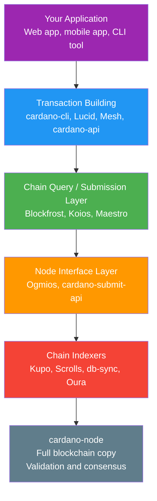
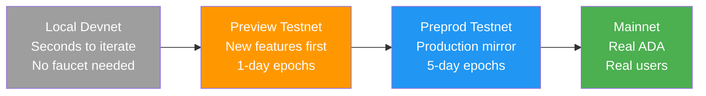
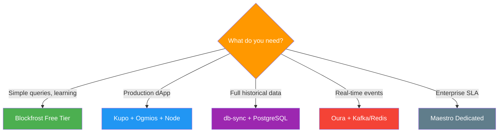

# Bài #13: Hạ tầng Lập trình viên

Hạ tầng lập trình viên Cardano cung cấp một ngăn xếp công cụ phân lớp (từ full node đến API quản lý đến bộ lập chỉ mục chuỗi) biến đổi dữ liệu blockchain thô thành định dạng có thể truy vấn, sẵn sàng cho ứng dụng để xây dựng dApp. Mọi lập trình viên web2 đều biết rằng xây dựng ứng dụng đòi hỏi nhiều hơn viết logic nghiệp vụ: bạn cần cơ sở dữ liệu, API, hosting, giám sát, môi trường staging, và quy trình triển khai. Bài học này lập bản đồ bối cảnh hạ tầng lập trình viên Cardano, từ chạy full node riêng đến sử dụng dịch vụ API quản lý, và từ bộ lập chỉ mục chuỗi đến testnet nơi bạn có thể thử nghiệm mà không rủi ro ADA thật.

## Ngăn xếp hạ tầng lập trình viên Cardano trông như thế nào?

Ngăn xếp lập trình viên Cardano có năm lớp: ứng dụng của bạn ở trên cùng, thư viện xây dựng giao dịch ở giữa, dịch vụ truy vấn và gửi chuỗi bên dưới, bộ lập chỉ mục chuỗi để chuyển đổi dữ liệu, và cardano-node ở nền tảng. Mỗi lớp phục vụ mục đích riêng, và lập trình viên chọn ngăn xếp dựa trên nhu cầu về phi tập trung, hiệu suất, chi phí, và sự tiện lợi.



## cardano-node là gì và Khi nào nên chạy?

cardano-node là triển khai full node chính thức của Cardano (viết bằng Haskell) xác thực độc lập mọi block và giao dịch, duy trì tập UTXO hiện tại, và cung cấp cách tương tác không cần tin cậy nhất với blockchain. Chạy node riêng nghĩa là bạn tự xác minh toàn bộ chuỗi mà không phụ thuộc bất kỳ bên thứ ba nào.

Node:

- Kết nối với peer và tải mọi block từ genesis
- Xác thực mọi giao dịch và block theo quy tắc sổ cái
- Duy trì tập UTXO hiện tại ("trạng thái" của blockchain)
- Chuyển tiếp giao dịch hợp lệ đến mempool mạng
- Có thể gửi giao dịch trực tiếp đến mạng

### Khi nào nên chạy Node riêng?

Chạy cardano-node riêng là tùy chọn không cần tin cậy nhất. Bạn không phụ thuộc bất kỳ bên thứ ba nào để cho bạn biết trạng thái blockchain; bạn đã tự xác minh. Điều này quan trọng cho:

- **Nhà điều hành stake pool**: Bắt buộc theo định nghĩa để tạo block
- **Ứng dụng bảo mật cao**: Khi bạn không thể tin tưởng API bên thứ ba
- **Nhà điều hành bộ lập chỉ mục chuỗi**: Hầu hết bộ lập chỉ mục kết nối trực tiếp với node cục bộ
- **Lập trình viên giao thức**: Khi xây dựng và thử nghiệm thay đổi lớp đồng thuận

Tuy nhiên, chạy node đi kèm chi phí vận hành đáng kể:

```
Yêu cầu tài nguyên cardano-node (Mainnet, 2025):

Lưu trữ:    ~180 GB (và tăng ~15 GB/năm)
RAM:        16+ GB (24 GB khuyến nghị)
CPU:        4+ lõi
Thời gian đồng bộ: 12-48 giờ cho đồng bộ ban đầu từ genesis
Băng thông:  Trao đổi dữ liệu liên tục với peer
Thời gian chạy: Phải đang chạy để phục vụ truy vấn
```

Đối với nhiều lập trình viên ứng dụng, chạy full node là quá mức. Đây là lúc dịch vụ quản lý hữu ích.

## Dịch vụ API quản lý nào có sẵn cho Cardano?

Dịch vụ API quản lý (Blockfrost, Koios, và Maestro) cung cấp truy cập RESTful và WebSocket đến dữ liệu blockchain Cardano mà không cần chạy node riêng, xử lý độ phức tạp vận hành của node, bộ lập chỉ mục, và cơ sở dữ liệu phía sau các endpoint API gọn gàng.

### Blockfrost là gì?

**Blockfrost** là dịch vụ API Cardano được sử dụng rộng rãi nhất. Nó cung cấp REST API toàn diện bao gồm block, giao dịch, địa chỉ, tài sản, script, epoch, và nhiều hơn nữa.

```
Ví dụ Blockfrost API (Khái niệm):

GET /addresses/{address}/utxos
Response:
[
  {
    "tx_hash": "abc123...",
    "output_index": 0,
    "amount": [
      { "unit": "lovelace", "quantity": "5000000" },
      { "unit": "policy_id.asset_name", "quantity": "1" }
    ],
    "data_hash": "datum_hash_if_present"
  }
]
```

Blockfrost cung cấp gói miễn phí và trả phí, với giới hạn tốc độ trên gói miễn phí. Nó hỗ trợ mainnet, testnet (Preview và Preprod), và IPFS pinning cho lưu trữ metadata ngoài chuỗi.

**Điểm mạnh**: Bao phủ toàn diện, tài liệu xuất sắc, hỗ trợ nhiều ngôn ngữ qua SDK, tích hợp IPFS, thời gian hoạt động ổn định.

**Đánh đổi**: Dịch vụ tập trung (bạn tin Blockfrost trả về dữ liệu chính xác), giới hạn tốc độ trên gói miễn phí, không phù hợp cho streaming sự kiện chuỗi thời gian thực.

### Koios là gì?

**Koios** là lớp API phi tập trung, do cộng đồng điều hành cho Cardano. Khác với Blockfrost (do một công ty vận hành), Koios chạy trên nhiều nhà điều hành độc lập, giảm điểm lỗi duy nhất. Nó cung cấp API dựa trên PostgREST với khả năng truy vấn mạnh mẽ, bao gồm lọc, phân trang, và truy vấn phức tạp mà sẽ cần nhiều lệnh gọi trên các dịch vụ khác. Miễn phí sử dụng (được tài trợ bởi đề xuất Catalyst và hỗ trợ cộng đồng).

**Điểm mạnh**: Vận hành phi tập trung, cú pháp truy vấn mạnh mẽ (tận dụng PostgREST), không cần API key cho sử dụng cơ bản, quản trị bởi cộng đồng.

**Đánh đổi**: Cú pháp truy vấn có thể phức tạp cho người mới, thời gian phản hồi có thể thay đổi giữa các instance, ít SDK wrapper hơn Blockfrost.

### Maestro là gì?

**Maestro** là nền tảng lập chỉ mục blockchain và API định vị mình là lớp hạ tầng để xây dựng ứng dụng Cardano cấp sản xuất. Nó cung cấp nhiều sản phẩm:

- **Blockchain API**: REST API để truy vấn dữ liệu chuỗi (tương tự Blockfrost)
- **Transaction Manager**: Xử lý gửi giao dịch, giám sát, và gửi lại tự động
- **DEX Market API**: Dữ liệu DEX tổng hợp để xây dựng ứng dụng giao dịch
- **Hạ tầng quản lý**: Cụm node và bộ lập chỉ mục chuyên dụng cho khách hàng doanh nghiệp

**Điểm mạnh**: Tính năng quản lý giao dịch (tự động thử lại, giám sát), tổng hợp dữ liệu DEX, hỗ trợ doanh nghiệp, công cụ debug Plutus script.

**Đánh đổi**: Chủ yếu thương mại (gói trả phí), gói miễn phí nhỏ hơn Blockfrost.

## Lớp giao diện Node là gì?

Lớp giao diện node (Ogmios và cardano-submit-api) nằm giữa cardano-node thô và API cấp cao, dịch giao thức nhị phân tùy chỉnh của node thành giao diện WebSocket/JSON và HTTP thân thiện với lập trình viên, có thể truy cập từ bất kỳ ngôn ngữ lập trình nào.

### Ogmios là gì?

**Ogmios** là cầu nối nhẹ phơi bày các giao thức nội bộ của cardano-node thông qua giao diện WebSocket JSON. Node Cardano sử dụng giao thức nhị phân tùy chỉnh gọi là mini-protocol **Node-to-Client** cho giao tiếp cục bộ. Ogmios dịch điều này thành JSON qua WebSocket, giúp có thể truy cập từ bất kỳ ngôn ngữ lập trình nào.

Ogmios phơi bày nhiều khả năng mạnh mẽ:

- **Chain Sync**: Stream blockchain từ bất kỳ điểm nào, nhận mỗi block dưới dạng đối tượng JSON. Thiết yếu để xây dựng bộ lập chỉ mục tùy chỉnh.
- **Transaction Submission**: Gửi giao dịch đã serialize trực tiếp đến mempool của node.
- **State Query**: Truy vấn trạng thái sổ cái hiện tại (tham số giao thức, phân phối stake, tập UTXO).
- **Mempool Monitoring**: Quan sát giao dịch trong mempool cục bộ trước khi chúng được đưa vào block.

Ogmios đặc biệt có giá trị cho lập trình viên xây dựng ứng dụng theo dõi chuỗi tùy chỉnh hoặc những ai cần truy cập thời gian thực đến sự kiện chuỗi mà không cần chi phí cơ sở dữ liệu bộ lập chỉ mục đầy đủ.

### cardano-submit-api là gì?

**cardano-submit-api** là dịch vụ HTTP đơn giản chấp nhận giao dịch đã serialize và gửi đến cardano-node cục bộ. Đây là cách tối thiểu nhất để gửi giao dịch mà không sử dụng cardano-cli trực tiếp.

```
Các tùy chọn gửi giao dịch:

Option 1: cardano-cli (cục bộ, dựa CLI)
  $ cardano-cli transaction submit --tx-file signed.tx

Option 2: cardano-submit-api (cục bộ, dựa HTTP)
  POST /api/submit/tx
  Content-Type: application/cbor
  Body: <raw transaction bytes>

Option 3: Ogmios (cục bộ, dựa WebSocket)
  { "jsonrpc": "2.0", "method": "submitTransaction",
    "params": { "transaction": { "cbor": "84a4..." } } }

Option 4: Blockfrost/Koios/Maestro (từ xa, dựa HTTP)
  POST /api/v0/tx/submit
  Content-Type: application/cbor
  Body: <raw transaction bytes>
```

## Bộ lập chỉ mục chuỗi là gì và Tại sao bạn cần chúng?

Bộ lập chỉ mục chuỗi theo dõi blockchain thời gian thực, đọc block khi được tạo và lưu trữ dữ liệu ở định dạng tối ưu cho truy vấn ứng dụng (cơ sở dữ liệu SQL, kho khóa-giá trị, hoặc luồng sự kiện) mà cardano-node thô không hỗ trợ tự nhiên.

### db-sync là gì?

**cardano-db-sync** là bộ lập chỉ mục chuỗi chính thức do IOG (Input Output Global) duy trì. Nó theo dõi cardano-node và điền cơ sở dữ liệu PostgreSQL với schema quan hệ toàn diện bao phủ mọi khía cạnh của blockchain (hơn 40 bảng cho block, giao dịch, tài sản, stake, phần thưởng, và nhiều hơn nữa).

db-sync toàn diện nhưng tốn tài nguyên:

- Cần instance PostgreSQL riêng với 150+ GB lưu trữ
- Đồng bộ ban đầu mất 2-3 ngày
- Sử dụng RAM cao khi đồng bộ (32+ GB khuyến nghị)
- Cơ sở dữ liệu "mọi thứ" nghĩa là bạn lập chỉ mục dữ liệu có thể không bao giờ truy vấn

**Khi nào dùng db-sync**: Khi bạn cần truy vấn SQL phức tạp trên toàn bộ lịch sử blockchain, hoặc khi xây dựng nền tảng phân tích, trình duyệt block, hoặc dịch vụ dữ liệu toàn diện.

### Kupo là gì?

**Kupo** là bộ lập chỉ mục chuỗi nhẹ tập trung vào theo dõi **matches**: UTXO khớp với mẫu cấu hình được (theo địa chỉ, payment credential, policy ID, v.v.). Thay vì lập chỉ mục mọi thứ như db-sync, Kupo cho phép bạn chỉ lập chỉ mục những gì ứng dụng cần.

Kupo nhanh, nhẹ (có thể chạy trên phần cứng tối thiểu), và đồng bộ trong vài giờ thay vì vài ngày. Lý tưởng cho backend dApp cần theo dõi UTXO tại các địa chỉ script cụ thể.

**Điểm mạnh**: Đồng bộ nhanh, sử dụng tài nguyên thấp, mẫu cấu hình được, bao gồm giải quyết datum.

**Đánh đổi**: Không lập chỉ mục mọi thứ (theo thiết kế), không có truy vấn đồ thị giao dịch lịch sử, giới hạn ở dữ liệu hướng UTXO.

### Scrolls và Oura là gì?

**Scrolls** xử lý dữ liệu blockchain qua các **reducer** cấu hình được (các phép biến đổi trích xuất dữ liệu cụ thể và lưu vào backend bạn chọn: Redis, Elasticsearch, file, hoặc sink tùy chỉnh). Nó là phần của hệ sinh thái **TxPipe** và được thiết kế để xây dựng kiến trúc hướng sự kiện.

**Oura** (cũng từ TxPipe) đọc sự kiện blockchain từ cardano-node và chuyển tiếp đến nhiều sink: Kafka, Elasticsearch, webhook, file, hoặc đích tùy chỉnh. Hãy nghĩ đến nó như công cụ pipeline dữ liệu đặc thù Cardano xuất sắc cho xây dựng hệ thống phản ứng đáp ứng sự kiện trên chuỗi gần thời gian thực.

## Testnet phục vụ như môi trường Staging như thế nào?

Cardano cung cấp nhiều mạng thử nghiệm (Preview, Preprod, và devnet cục bộ) phản ánh tiến trình môi trường staging mà lập trình viên web2 đã quen, cho phép bạn lặp từ phát triển cục bộ nhanh qua xác thực giống sản xuất trước khi triển khai lên mainnet với ADA thật.



### Preview Testnet là gì?

**Preview** là testnet "tiên phong" của Cardano. Đây là mạng đầu tiên nhận nâng cấp giao thức và tính năng mới, thường vài tuần trước khi đến mainnet. Preview sử dụng thời lượng epoch nhanh hơn (1 ngày thay vì 5 ngày) để tăng tốc chu kỳ phát triển. Tốt nhất cho lập trình viên thử nghiệm tính năng giao thức mới và lặp smart contract nhanh.

### Preprod Testnet là gì?

**Preprod** (Pre-Production) phản ánh mainnet gần nhất có thể. Nó sử dụng cùng thời lượng epoch (5 ngày), cùng tham số giao thức, và theo cùng lịch hard fork như mainnet (chỉ hơi trước). Preprod là giai đoạn kiểm thử cuối cùng trước khi triển khai mainnet. Tốt nhất cho kiểm thử tích hợp cuối, kiểm thử nhạy cảm về thời gian, và diễn tập triển khai thực tế.

### Làm thế nào để nhận test ADA?

Cả hai testnet đều sử dụng "test ADA" (tADA) không có giá trị tiền tệ. Bạn có thể nhận tADA từ **Cardano Faucet** (faucet.cardano.org), phân phát token thử nghiệm cho bất kỳ địa chỉ testnet hợp lệ nào. Một số faucet cộng đồng và bot Discord cũng phân phối test ADA.

### Devnet và Tùy chọn kiểm thử cục bộ là gì?

Để lặp nhanh hơn nữa, lập trình viên có thể chạy mạng phát triển cục bộ:

- **Cardano-testnet**: Khởi động mạng Cardano riêng tư trên máy cục bộ để prototype nhanh
- **Yaci DevKit**: Bộ công cụ lập trình viên cung cấp devnet Cardano cục bộ được quản lý với API và công cụ tích hợp, đơn giản hóa đáng kể trải nghiệm phát triển cục bộ
- **Demeter.run**: Nền tảng phát triển trên cloud cung cấp môi trường phát triển Cardano được cấu hình sẵn, bao gồm node, bộ lập chỉ mục, và API, truy cập qua trình duyệt web

## Làm thế nào để chọn ngăn xếp hạ tầng phù hợp?

Ngăn xếp hạ tầng phù hợp phụ thuộc vào trường hợp sử dụng. Đây là các mẫu phổ biến:

### Dự án Hobby / Học tập
```
Ngăn xếp: Blockfrost (gói miễn phí) + Preview testnet
Lý do:    Không có hạ tầng để quản lý, giới hạn miễn phí hào phóng,
          lặp nhanh với epoch 1 ngày của Preview
```

### Backend dApp sản xuất
```
Ngăn xếp: Kupo + Ogmios + cardano-node (tự host)
          HOẶC Maestro (quản lý) + Preprod cho staging
Lý do:    Kupo cho truy vấn UTXO nhanh tại địa chỉ script,
          Ogmios cho gửi giao dịch và theo dõi chuỗi,
          toàn quyền kiểm soát hạ tầng
```

### Trình duyệt Block / Nền tảng phân tích
```
Ngăn xếp: db-sync + PostgreSQL + cardano-node
Lý do:    Cần dữ liệu lịch sử toàn diện với truy vấn SQL
          phức tạp trên toàn bộ blockchain
```

### Ứng dụng hướng sự kiện
```
Ngăn xếp: Oura + Kafka/Redis + Blockfrost (cho truy vấn)
Lý do:    Phản ứng với sự kiện trên chuỗi gần thời gian thực,
          đưa dữ liệu vào pipeline sự kiện hiện có
```

### Doanh nghiệp / Thông lượng cao
```
Ngăn xếp: Maestro (chuyên dụng) + nhiều instance node
          + Scrolls cho lập chỉ mục tùy chỉnh
Lý do:    Đảm bảo SLA, hạ tầng chuyên dụng,
          biến đổi dữ liệu tùy chỉnh
```



## Tương tự Web2

Hạ tầng lập trình viên Cardano ánh xạ gọn gàng với các mẫu mà lập trình viên web2 đã biết:

**cardano-node giống như chạy server cơ sở dữ liệu riêng.** Giống như bạn có thể chạy PostgreSQL trên phần cứng riêng để kiểm soát hoàn toàn và không phụ thuộc bên thứ ba, chạy cardano-node cho bạn truy cập chủ quyền đến blockchain. Nhưng giống như quản lý server cơ sở dữ liệu riêng (sao lưu, cập nhật, giám sát, mở rộng), nó đòi hỏi cam kết vận hành.

**Blockfrost, Koios, và Maestro giống như dịch vụ cơ sở dữ liệu quản lý.** Chúng là tương đương Cardano của AWS RDS, PlanetScale, hoặc Supabase. Bạn đánh đổi một phần kiểm soát và tin cậy để đơn giản vận hành. Giống như bạn sẽ không chạy cụm PostgreSQL riêng cho dự án phụ khi PlanetScale có gói miễn phí, bạn có lẽ không nên chạy node riêng cho dự án hackathon khi có Blockfrost.

**Ogmios giống như driver cơ sở dữ liệu hoặc ORM.** Nó dịch giữa giao thức nội bộ của node và giao diện thân thiện lập trình viên, giống như `pg` (driver Node.js cho PostgreSQL) dịch giữa mã ứng dụng và giao thức wire PostgreSQL, hoặc Prisma cung cấp API cấp cao trên SQL thô.

**Bộ lập chỉ mục chuỗi giống như materialized view hoặc read replica.** Trong cơ sở dữ liệu web2, bạn có thể tạo materialized view tính toán trước truy vấn phức tạp, hoặc dùng read replica tối ưu cho mẫu truy vấn cụ thể. db-sync là materialized view toàn diện của toàn bộ blockchain. Kupo là materialized view nhắm mục tiêu chỉ UTXO bạn quan tâm. Scrolls cho phép bạn xây dựng materialized view tùy chỉnh cho nhu cầu dữ liệu cụ thể.

**Testnet giống như môi trường staging.** Preview là server dev/staging nơi bạn triển khai trước và có thể gây lỗi. Preprod là môi trường pre-production phản ánh prod gần nhất. Mainnet là production. Giống như bạn sẽ không bao giờ triển khai tính năng quan trọng trực tiếp lên production mà không test trên staging, bạn sẽ không bao giờ triển khai smart contract lên mainnet mà không test trên Preprod.

**Oura giống như công cụ change data capture (CDC).** Trong web2, công cụ như Debezium bắt thay đổi cơ sở dữ liệu và stream đến Kafka topic. Oura làm điều tương tự cho dữ liệu blockchain: bắt sự kiện trên chuỗi và stream đến hạ tầng messaging của bạn.

**Cardano Faucet giống như chế độ test của Stripe.** Khi xây dựng với Stripe, bạn dùng API key test và số thẻ test. Bạn nhận tiền giả để test luồng thanh toán. Cardano Faucet cung cấp ADA giả cho cùng mục đích: test tương tác ứng dụng với blockchain bằng token không có giá trị.

## Điểm chính

- **cardano-node là nền tảng chủ quyền**: chạy node riêng cho bạn truy cập không cần tin cậy đến blockchain nhưng đi kèm chi phí vận hành đáng kể mà không cần thiết cho hầu hết lập trình viên ứng dụng.
- **API quản lý (Blockfrost, Koios, Maestro) mang lại sự tiện lợi**: chúng xử lý độ phức tạp hạ tầng và phơi bày REST API gọn gàng, giống như dịch vụ cơ sở dữ liệu quản lý trong web2.
- **Bộ lập chỉ mục chuỗi biến đổi dữ liệu blockchain thô thành định dạng có thể truy vấn**: db-sync cho truy cập SQL toàn diện, Kupo cho theo dõi UTXO nhẹ, Scrolls và Oura cho pipeline dữ liệu tùy chỉnh và kiến trúc hướng sự kiện.
- **Testnet (Preview và Preprod) là môi trường staging của bạn**: dùng Preview cho lặp nhanh với tính năng mới, Preprod cho xác thực giống sản xuất, và devnet cục bộ cho vòng phản hồi nhanh nhất.
- **Chọn ngăn xếp dựa trên nhu cầu**: người yêu thích có thể bắt đầu với gói miễn phí Blockfrost, trong khi ứng dụng sản xuất có thể cần hạ tầng tự host để đảm bảo độ tin cậy và giảm thiểu tin cậy.

## Tiếp theo

Với bản đồ bối cảnh hạ tầng lập trình viên đã được vẽ, bài học tiếp theo giải quyết một trong những chủ đề quan trọng nhất cho mọi lập trình viên blockchain: bảo mật. Chúng ta sẽ khám phá các mối đe dọa mà hệ thống blockchain đối mặt, các lỗ hổng đặc thù của smart contract, và các lợi thế bảo mật cụ thể mà mô hình eUTXO của Cardano mang lại.
