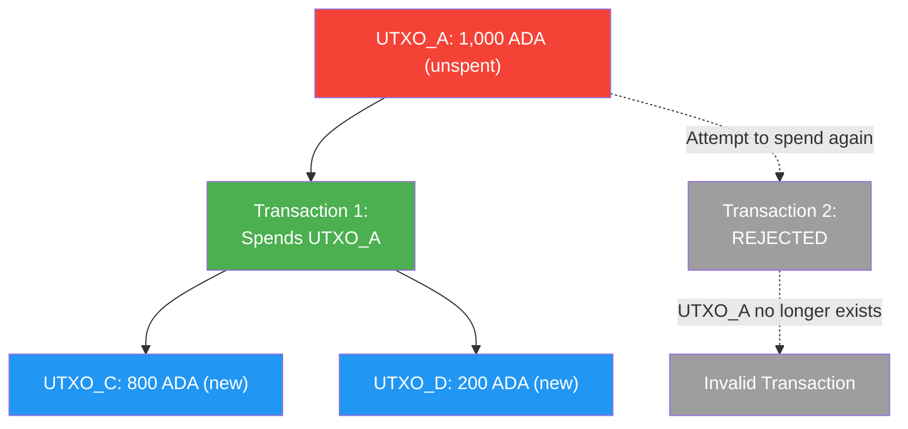
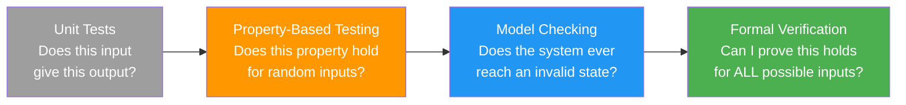
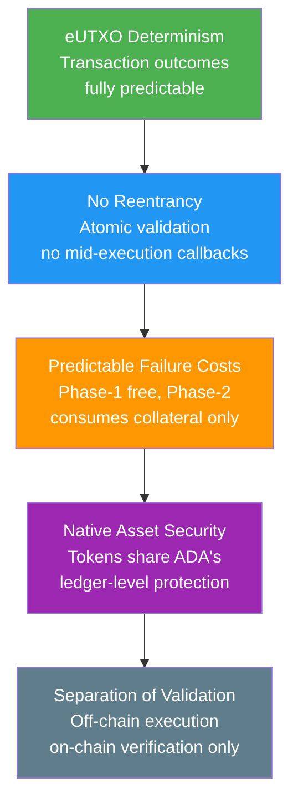

# Bài #14: Bảo mật Blockchain

Bảo mật blockchain bao gồm toàn bộ phổ phòng thủ (từ bảo vệ đồng thuận cấp mạng đến ngăn chặn lỗ hổng smart contract) đảm bảo khả năng kháng kiểm duyệt, tính bất biến, và thực thi giao dịch không cần tin cậy trên chuỗi. Đối với lập trình viên web2 bước vào không gian blockchain, mô hình bảo mật khác biệt cơ bản: lỗi trong smart contract không chỉ đáng xấu hổ; chúng là tổn thất tài chính không thể đảo ngược. Bài học này bao phủ toàn bộ bối cảnh bảo mật, từ tấn công cấp mạng đến lỗ hổng smart contract, và giải thích tại sao thiết kế của Cardano cung cấp bảo vệ có ý nghĩa chống lại nhiều vector tấn công tàn khốc nhất.

## Các mối đe dọa bảo mật cấp mạng chính là gì?

Mối đe dọa cấp mạng nhắm vào cơ chế đồng thuận, với tấn công 51% (yêu cầu kiểm soát đa số stake), tấn công tầm xa (khai thác vị trí stake lịch sử), và tấn công eclipse (cô lập node khỏi mạng trung thực) đại diện cho các loại chính mà giao thức Ouroboros của Cardano phòng thủ chống lại.

### Tấn công 51% là gì?

**Tấn công 51%** (hay tấn công đa số) cho phép kẻ tấn công kiểm soát hơn một nửa sức mạnh đồng thuận chi tiêu hai lần, kiểm duyệt giao dịch, và tổ chức lại chuỗi. Trong hệ thống proof-of-work, điều này nghĩa là kiểm soát đa số sức mạnh đào; trong mô hình proof-of-stake của Cardano, nó đòi hỏi kiểm soát hơn 50% tổng ADA đã staked.

```
Tấn công 51% (Chi tiêu hai lần):

Chuỗi trung thực: [Block 1] -> [Block 2] -> [Block 3: Trả Alice 100 ADA]
                                              Alice thấy thanh toán,
                                              giao hàng cho kẻ tấn công

Chuỗi kẻ tấn công: [Block 1] -> [Block 2] -> [Block 3': Không trả Alice]
(tạo bí mật                                  -> [Block 4': Kẻ tấn công chi tiêu
 với >50% stake)                                  coin ở nơi khác]

Khi kẻ tấn công công bố chuỗi dài hơn, mạng chấp nhận nó.
Thanh toán của Alice biến mất. Kẻ tấn công có cả hàng VÀ coin.
```

Với khoảng 22-24 tỷ ADA staked trên hàng ngàn stake pool, tấn công 51% sẽ đòi hỏi mua và stake hàng tỷ đô la ADA, điều này tự nó sẽ đẩy giá lên đáng kể, khiến cuộc tấn công ngày càng tốn kém. Mô hình ủy quyền phi lưu ký cũng có nghĩa là kẻ tấn công không thể đơn giản "thuê" stake; họ cần thực sự mua và stake token.

Hơn nữa, Ouroboros cung cấp **bảo mật có thể chứng minh** dưới các giả định nhất định. Các chứng minh bảo mật đảm bảo rằng miễn là stake trung thực vượt quá 50%, xác suất tấn công thành công giảm theo hàm mũ với số lượng xác nhận.

### Tấn công tầm xa là gì?

Tấn công tầm xa là mối lo ngại đặc thù của hệ thống proof-of-stake nơi kẻ tấn công từng giữ stake đáng kể (nhưng đã bán) cố gắng tạo chuỗi thay thế bắt đầu từ điểm khi họ có đủ stake để thống trị. Giao thức Ouroboros Genesis của Cardano giải quyết điều này bằng cách cho phép node mới phân biệt giữa chuỗi trung thực và chuỗi tấn công tầm xa bằng cách phân tích mật độ chuỗi và mẫu sản xuất block.

### Tấn công Eclipse và Sybil là gì?

**Tấn công eclipse** cô lập node khỏi mạng trung thực bằng cách bao quanh nó với peer do kẻ tấn công kiểm soát. Node nạn nhân chỉ thấy cái nhìn blockchain của kẻ tấn công, có thể bao gồm giao dịch chi tiêu hai lần hoặc block bị kiểm duyệt.

**Tấn công Sybil** tạo nhiều danh tính giả (node, stake pool) để có ảnh hưởng không cân xứng trên mạng. Trong bối cảnh Cardano, cơ chế bão hòa và yêu cầu pledge (thảo luận trong Bài 12) đóng vai trò kháng Sybil: tạo nhiều pool yêu cầu vốn tương ứng, và pool không có pledge kiếm phần thưởng giảm.

Lớp mạng P2P của Cardano bao gồm phòng thủ chống tấn công eclipse thông qua chọn peer đa dạng, đảm bảo node duy trì kết nối với peer trên các phân đoạn mạng và vùng địa lý khác nhau.

## eUTXO ngăn chặn chi tiêu hai lần như thế nào?

Mô hình eUTXO ngăn chặn chi tiêu hai lần ở cấp giao thức bằng cách theo dõi mọi đầu ra giao dịch chưa chi tiêu và loại bỏ nó khỏi tập UTXO ngay khi nó được tiêu thụ, khiến bất kỳ nỗ lực nào chi tiêu cùng đầu ra lần nữa trở nên không hợp lệ về cấu trúc.



Điều này đơn giản và mạnh mẽ hơn mô hình tài khoản, nơi chi tiêu hai lần phải được ngăn chặn thông qua theo dõi nonce và quản lý trạng thái cẩn thận. Mô hình UTXO khiến ngăn chặn chi tiêu hai lần mang tính cấu trúc thay vì thủ tục.

## Lập trình viên nên biết những lỗ hổng Smart Contract nào?

Lỗi smart contract đặc biệt nguy hiểm vì contract đã triển khai là bất biến (hoặc rất khó sửa đổi), và chúng thường kiểm soát giá trị tài chính đáng kể. Một lỗ hổng duy nhất có thể dẫn đến mất tiền không thể đảo ngược. Các loại lỗ hổng chính bao gồm reentrancy (không thể trên Cardano), datum hijacking, double satisfaction, và token forgery.

### Tại sao Cardano miễn nhiễm với tấn công Reentrancy?

**Tấn công reentrancy** là lỗ hổng smart contract nổi tiếng nhất, chịu trách nhiệm cho vụ hack DAO 2016 mất 60 triệu đô la ETH. Trong mô hình tài khoản của Ethereum, contract có thể gọi contract khác, contract đó có thể gọi lại contract gốc trước khi lệnh gọi đầu tiên hoàn thành. Nếu contract gốc chưa cập nhật trạng thái, lệnh gọi reentrancy khai thác dữ liệu cũ.

**Cardano vốn miễn nhiễm với tấn công reentrancy.** Trong mô hình eUTXO, giao dịch là đơn vị nguyên tử hoàn chỉnh. Script validator chạy một lần cho mỗi đầu vào, đánh giá liệu UTXO có thể được chi tiêu trong điều kiện cho trước. Không có khái niệm contract "gọi" contract khác giữa chừng thực thi. Toàn bộ giao dịch (với tất cả đầu vào, đầu ra, và thực thi script) được xác thực như một đơn vị duy nhất. Hoặc mọi thứ thành công hoặc mọi thứ thất bại. Không có trạng thái giữa chừng nơi lệnh gọi reentrancy có thể khai thác dữ liệu cũ.

### Datum Hijacking là gì?

**Datum hijacking** xảy ra khi đầu ra script không xác thực đúng datum đính kèm, cho phép kẻ tấn công thay thế datum độc hại thay đổi quyền sở hữu hoặc các trường quan trọng khác trong UTXO tiếp tục.

```
Datum Hijacking:

Luồng bình thường:
  Input UTXO:  [Script Address, Datum: {owner: "Alice", amount: 100}]
  Output UTXO: [Script Address, Datum: {owner: "Alice", amount: 80}]
  (Alice rút 20 ADA)

Tấn công:
  Input UTXO:  [Script Address, Datum: {owner: "Alice", amount: 100}]
  Output UTXO: [Script Address, Datum: {owner: "Attacker", amount: 100}]
  (Kẻ tấn công thay đổi owner trong datum tiếp tục!)
```

**Phòng ngừa**: Validator phải kiểm tra rõ ràng rằng datum đầu ra đáp ứng tất cả ràng buộc mong đợi. Điều này bao gồm xác minh rằng các trường bất biến (như quyền sở hữu) không thay đổi, các trường có thể thay đổi (như số dư) đã thay đổi theo quy tắc cho phép, và cấu trúc datum khớp schema mong đợi.

### Lỗ hổng Double Satisfaction là gì?

**Double satisfaction** xảy ra khi một UTXO duy nhất thỏa mãn điều kiện của nhiều validator trong cùng giao dịch, cho phép kẻ tấn công đáp ứng yêu cầu hai script với một đầu ra thay vì hai.

```
Tấn công Double Satisfaction:

Script A (DEX Pool): "Hoán đổi hợp lệ nếu output chứa 100 DJED"
Script B (Lending):  "Rút tiền hợp lệ nếu output chứa 100 DJED"

Giao dịch kẻ tấn công:
  Inputs:
    - DEX Pool UTXO (Script A)
    - Lending Pool UTXO (Script B)
  Outputs:
    - MỘT output với 100 DJED

  Cả Script A và Script B đều thấy output 100 DJED và coi
  điều kiện được thỏa mãn, nhưng chỉ CÓ MỘT output tồn tại.
  Kẻ tấn công thực chất nhận 100 DJED với giá 0.
```

**Phòng ngừa**: Script nên bao gồm mã định danh duy nhất trong đầu ra (như NFT cụ thể, thường gọi là "state token" hoặc "beacon token") và xác thực rằng đầu ra cụ thể của chúng tồn tại, thay vì chỉ kiểm tra rằng "một đầu ra nào đó" đáp ứng điều kiện.

### Tấn công cạn kiệt tài nguyên hoạt động như thế nào?

Validator Cardano có ngân sách thực thi (giới hạn CPU và bộ nhớ mỗi giao dịch). Một tấn công tinh vi hơn liên quan đến tạo giao dịch tiêu thụ tài nguyên tối đa cho phép, tạo ra điều kiện từ chối dịch vụ cho giao thức.

**Phòng ngừa**: Tác giả script nên ý thức chi phí thực thi trường hợp xấu nhất. Sử dụng script tham số hóa, giới hạn vòng lặp, và tính toán trước các phép tính tốn kém ngoài chuỗi đều giúp giữ xác thực trên chuỗi nhẹ nhàng.

### Token Forgery và lỗ hổng Policy là gì?

Nếu minting policy không được viết cẩn thận, kẻ tấn công có thể mint token trái phép. Các lỗ hổng phổ biến bao gồm:

- **Thiếu kiểm tra ủy quyền**: Policy không xác minh sự hiện diện của UTXO đầu vào hoặc chữ ký cụ thể
- **Minting policy tái sử dụng**: Policy mint một lần (cho NFT) thực sự có thể gọi nhiều lần
- **Thao túng tham số policy**: Policy chấp nhận tham số nhưng không xác thực đúng

```
Minting một lần (Mẫu đúng):

Policy: "Mint chỉ được phép NẾU UTXO cụ thể này được tiêu thụ làm input"

  Giao dịch 1 (Minting):
    Inputs: [UTXO_Unique_123]    <-- UTXO này được tiêu thụ (hủy)
    Mints:  [1 MyNFT]

  Giao dịch 2 (Thử mint lại):
    Inputs: [???]                <-- UTXO_Unique_123 không còn tồn tại!
    Mints:  [1 MyNFT]           <-- THẤT BẠI: Không thể thỏa mãn minting policy
```

## Xác minh hình thức cải thiện bảo mật Smart Contract như thế nào?

Xác minh hình thức sử dụng chứng minh toán học để chứng minh rằng chương trình hoạt động đúng cho tất cả đầu vào có thể (không chỉ đầu vào bạn tình cờ test), khiến nó trở thành tiêu chuẩn vàng của xác minh phần mềm được sử dụng trong hệ thống an toàn quan trọng như hàng không, thiết bị y tế, và giao thức mật mã.

Ngôn ngữ smart contract Plutus của Cardano được xây dựng trên Haskell, ngôn ngữ lập trình hàm tự nhiên phù hợp cho suy luận hình thức. Mô hình hàm thuần túy (không tác dụng phụ, không trạng thái có thể thay đổi) giúp chứng minh tính chất về hành vi mã dễ dàng hơn nhiều.



**Agda** là ngôn ngữ lập trình có kiểu phụ thuộc và trợ lý chứng minh được sử dụng trong đặc tả hình thức của Cardano. Đặc tả sổ cái Cardano chính nó đã được hình thức hóa trong Agda, nghĩa là các quy tắc quản lý blockchain đã được xác minh toán học. Mặc dù hầu hết lập trình viên ứng dụng sẽ không viết Agda, việc giao thức nền tảng đã được xác minh hình thức cung cấp nền tảng vững chắc.

### Kiểm thử dựa trên tính chất tăng cường Smart Contract như thế nào?

**Kiểm thử dựa trên tính chất** (PBT) là trung gian giữa unit testing và xác minh hình thức. Thay vì chỉ định từng trường hợp test riêng lẻ, bạn định nghĩa các tính chất nên luôn đúng, và framework testing tạo hàng ngàn đầu vào ngẫu nhiên để tìm vi phạm.

Cho validator Cardano, các tính chất có thể bao gồm:

- "Không giao dịch nào có thể trích xuất nhiều giá trị hơn đã gửi cộng phần thưởng cho phép"
- "Chỉ chủ sở hữu được chỉ định mới có thể ủy quyền rút tiền"
- "Tổng giá trị khóa trong script không bao giờ có thể giảm ngoại trừ qua hoạt động được ủy quyền"
- "Bất kỳ giao dịch nào vượt qua xác thực tạo đầu ra có tổng giá trị bằng đầu vào trừ phí"

Kiểm thử dựa trên tính chất đặc biệt hiệu quả cho smart contract vì không gian đầu vào (giao dịch, datum, redeemer có thể) phức tạp và khó bao phủ bằng trường hợp test thủ công. Các công cụ như QuickCheck (Haskell) và Hedgehog có thể khám phá có hệ thống các trường hợp biên mà lập trình viên sẽ không bao giờ nghĩ đến để test thủ công.

### Tại sao Audit và Peer Review thiết yếu?

Ngoài kiểm thử tự động, audit smart contract bởi các công ty bảo mật chuyên biệt là thực hành tiêu chuẩn trong ngành blockchain. Một audit thường bao gồm:

1. **Đánh giá mã**: Kiểm tra từng dòng mã smart contract
2. **Đánh giá kiến trúc**: Phân tích thiết kế giao thức tổng thể và giả định tin cậy
3. **Phân tích bề mặt tấn công**: Xác định tất cả vector tấn công có thể
4. **Phân tích hình thức**: Xác minh toán học các tính chất quan trọng (nếu áp dụng)
5. **Kiểm thử xâm nhập**: Thử khai thác contract trên testnet

Trên Cardano, nhiều công ty chuyên về audit smart contract Plutus, bao gồm Tweag, MLabs, Anastasia Labs, và những công ty khác. Các giao thức như Minswap, Liqwid, và SundaeSwap đã trải qua nhiều vòng audit trước khi triển khai mainnet.

## Kiến trúc Cardano mang lại lợi thế bảo mật nào?

Kiến trúc Cardano cung cấp bốn lợi thế bảo mật cấu trúc: đánh giá giao dịch xác định (loại bỏ MEV), miễn nhiễm reentrancy vốn có, chi phí thất bại có thể dự đoán (lỗi xác thực Phase-1 không tốn gì; lỗi script Phase-2 chỉ tiêu thụ tài sản thế chấp), và bảo mật tài sản gốc chia sẻ bảo vệ cấp sổ cái của ADA.



### Đánh giá xác định loại bỏ MEV như thế nào?

Trên Ethereum, kết quả giao dịch phụ thuộc vào trạng thái toàn cục tại thời điểm thực thi, có thể khác với trạng thái khi giao dịch được xây dựng. Điều này tạo ra một loại tấn công gọi chung là **MEV (Maximal Extractable Value)**, nơi thợ đào hoặc validator kiếm lợi bằng cách sắp xếp lại, chèn, hoặc kiểm duyệt giao dịch.

Trên Cardano, kết quả giao dịch **hoàn toàn xác định**. Giao dịch chỉ định chính xác đầu vào (UTXO để tiêu thụ) và đầu ra chính xác (UTXO để tạo). Nếu đầu vào chỉ định vẫn tồn tại khi giao dịch đến chuỗi, nó thực thi đúng như đã xây dựng. Nếu bất kỳ đầu vào nào đã bị chi tiêu, giao dịch đơn giản thất bại mà không có thực thi một phần hay tác dụng phụ không mong muốn.

Tính xác định này loại bỏ toàn bộ loại tấn công và giúp dễ dàng hơn nhiều để suy luận về bảo mật smart contract.

### Tài sản gốc tăng cường bảo mật như thế nào?

Trên Ethereum, token được triển khai như smart contract (ERC-20), và mỗi token contract là bề mặt tấn công riêng. Lỗ hổng trong token contract đã dẫn đến tổn thất đáng kể. Trên Cardano, tài sản gốc (token) được xử lý bởi sổ cái chính nó, chia sẻ cùng đảm bảo bảo mật như ADA. Không có token contract để khai thác. Minting policy kiểm soát việc tạo, nhưng khi token tồn tại, cùng quy tắc sổ cái quản lý ADA cũng chuyển, giữ, và tính toán chúng.

### Tách biệt xác thực và thực thi giúp gì?

Trong Cardano, "thực thi" smart contract xảy ra hoàn toàn ngoài chuỗi (xây dựng giao dịch với đầu vào và đầu ra đúng). Validator trên chuỗi chỉ xác minh giao dịch đúng. Sự tách biệt này nghĩa là:

- Ít mã chạy trên chuỗi hơn, giảm bề mặt tấn công
- Mã ngoài chuỗi có thể được cập nhật mà không sửa đổi validator trên chuỗi
- Logic nghiệp vụ phức tạp có thể được test kỹ ngoài chuỗi trước khi giao dịch được gửi

## Các mẫu bảo mật phổ biến trên Cardano là gì?

Lập trình viên Cardano có kinh nghiệm tuân theo các mẫu đã thiết lập để viết validator an toàn:

### Mẫu State Token
Sử dụng NFT duy nhất (mint với policy một lần) làm "state token" phải có mặt trong mọi UTXO tại địa chỉ script. Điều này ngăn UTXO trái phép được tạo tại địa chỉ và giải quyết vấn đề double satisfaction.

### Kiểm tra bảo toàn giá trị
Luôn xác minh rằng tổng giá trị trong đầu ra script bằng giá trị mong đợi (giá trị đầu vào trừ bất kỳ rút tiền được ủy quyền nào, cộng bất kỳ gửi tiền được ủy quyền nào). Đừng phụ thuộc vào bảo toàn giá trị ngầm định.

### Xác thực tính liên tục Datum
Khi UTXO script phải "tiếp tục" (được tiêu thụ và tạo lại với trạng thái cập nhật), xác thực rõ ràng mọi trường của datum đầu ra theo quy tắc chuyển đổi mong đợi. Đừng bao giờ giả định datum đúng chỉ vì nó có mặt.

### Thực thi thời hạn
Sử dụng phạm vi hiệu lực giao dịch (slot valid-from và valid-to) để thực thi điều kiện dựa trên thời gian. Khoảng hiệu lực giao dịch Cardano được kiểm tra ở cấp giao thức, cung cấp ranh giới thời gian đáng tin cậy cho logic script.

### Logic trên chuỗi tối thiểu
Giữ validator đơn giản nhất có thể. Mỗi dòng mã trên chuỗi là lỗ hổng tiềm tàng. Chuyển logic phức tạp ngoài chuỗi và chỉ dùng validator để kiểm tra các bất biến quan trọng.

## Tương tự Web2

Bảo mật blockchain có nhiều song song với bảo mật web2, và kiến thức hiện có của bạn chuyển đổi tốt:

**Reentrancy giống như tấn công CSRF (Cross-Site Request Forgery).** Trong CSRF, website độc hại kích hoạt hành động trong phiên xác thực của bạn trên site khác vì server không xác minh nguồn gốc yêu cầu. Trong reentrancy, contract độc hại kích hoạt callback vào contract tại điểm không mong đợi trong thực thi. Cả hai khai thác thiếu quản lý trạng thái đúng trong hoạt động. Cardano loại bỏ điều này cấu trúc, giống như SameSite cookie và CSRF token giải quyết trong web2.

**Datum hijacking giống như SQL injection.** Trong SQL injection, kẻ tấn công thao túng dữ liệu đầu vào để thay đổi ý nghĩa truy vấn. Trong datum hijacking, kẻ tấn công thao túng datum để thay đổi ý nghĩa trạng thái script. Cả hai được ngăn chặn bằng xác thực tất cả dữ liệu đầu vào; đừng bao giờ tin rằng dữ liệu tại ranh giới được định dạng tốt hoặc được ủy quyền.

**Double satisfaction giống như parameter tampering hoặc insecure direct object references (IDOR).** Kẻ tấn công tham chiếu tài nguyên (output) của người khác để thỏa mãn kiểm tra ủy quyền của chính họ. Phòng ngừa trong cả hai lĩnh vực đòi hỏi đảm bảo tài nguyên được xác thực thực sự thuộc về thực thể nó được cho là thuộc về.

**Audit smart contract giống như penetration testing và code audit.** Giống như bạn thuê công ty bảo mật pen-test ứng dụng web trước khi ra mắt (theo hướng dẫn OWASP), bạn thuê auditor đánh giá smart contract trước khi triển khai mainnet. Rủi ro tương tự (rò rỉ dữ liệu vs mất tiền), nhưng tính không thể đảo ngược của exploit smart contract khiến audit càng quan trọng hơn.

**Xác minh hình thức giống như hệ thống kiểu ở mức cường độ cao.** TypeScript bắt nhiều lỗi tại compile time bằng cách xác minh mã xử lý kiểu đúng. Xác minh hình thức mở rộng khái niệm này sang tính chất tùy ý: không chỉ "đây có phải số không?" mà "số dư có thể đi âm không?" và "có thể nào người dùng trái phép rút tiền không?"

**Tấn công 51% giống như chiếm quyền cơ sở hạ tầng.** Hãy tưởng tượng kẻ tấn công kiểm soát đa số CDN edge node. Họ có thể phục vụ nội dung độc hại cho người dùng tin rằng họ đang nhận dữ liệu hợp lệ. Tấn công 51% là tương đương blockchain: kiểm soát đa số sức mạnh đồng thuận để phục vụ lịch sử giả.

## Điểm chính

- **Tấn công cấp mạng (51%, tầm xa, eclipse) được giảm thiểu bởi giao thức Ouroboros của Cardano**, cung cấp bảo mật có thể chứng minh dưới giả định đa số trung thực và phòng thủ thực tế qua phân phối stake và mạng P2P.
- **Lỗ hổng smart contract trên Cardano khác Ethereum**: reentrancy không thể xảy ra theo thiết kế, nhưng lập trình viên phải đề phòng datum hijacking, double satisfaction, và token forgery qua thiết kế validator cẩn thận.
- **Xác minh hình thức và kiểm thử dựa trên tính chất** cung cấp đảm bảo mạnh hơn nhiều so với unit testing đơn thuần, và hệ sinh thái dựa Haskell của Cardano phù hợp tốt cho các kỹ thuật xác minh nghiêm ngặt này.
- **Mô hình giao dịch xác định của Cardano loại bỏ MEV và front-running**, mang lại cho người dùng sự tin tưởng rằng giao dịch sẽ thực thi đúng như đã xây dựng hoặc không thực thi gì.
- **Bảo mật là nguyên tắc thiết kế, không phải tính năng**: mô hình eUTXO, tài sản gốc, và tách biệt xác thực khỏi thực thi đều đóng góp vào nền tảng an toàn hơn về cấu trúc cho xây dựng ứng dụng tài chính.

## Tiếp theo

Bảo mật bảo vệ hệ thống, nhưng ai quyết định hệ thống phát triển như thế nào? Bài học cuối cùng trong khóa học này bao gồm mô hình quản trị của Cardano: cách thay đổi giao thức được đề xuất, thảo luận, bỏ phiếu, và ban hành thông qua hệ thống quản trị trên chuỗi tham vọng nhất trong blockchain.
