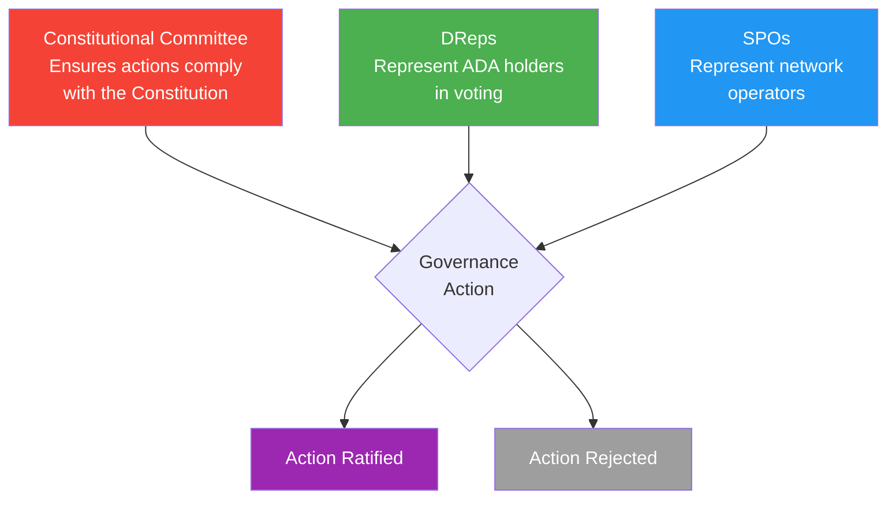
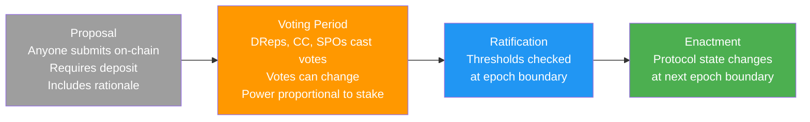
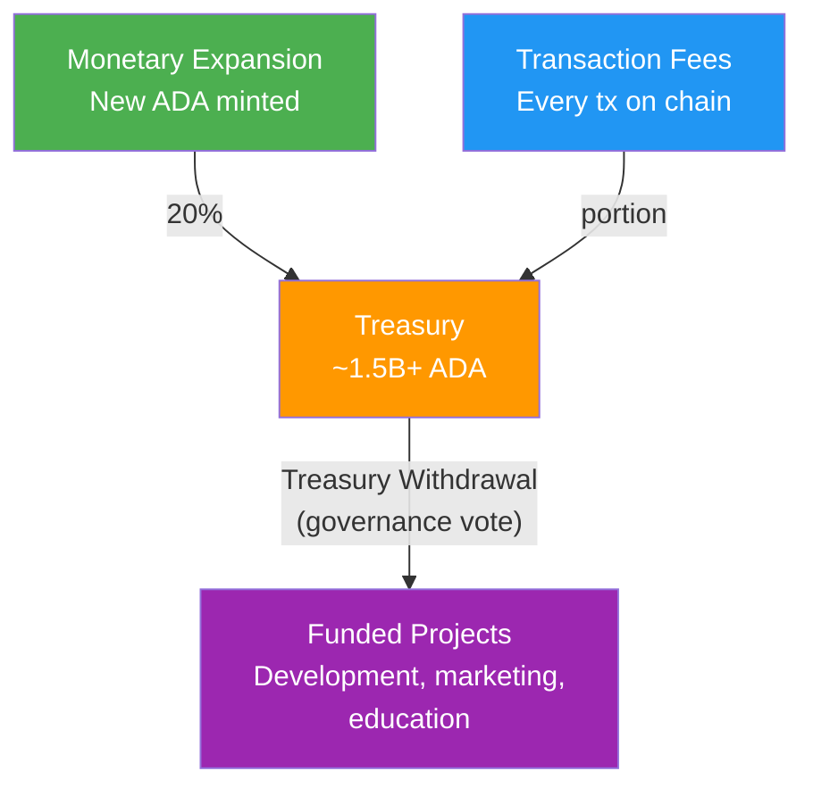

# Bài #15: Quản trị Cardano

Hệ thống quản trị trên chuỗi của Cardano (được định nghĩa bởi CIP-1694) cho phép người nắm giữ ADA đề xuất, bỏ phiếu, và ban hành thay đổi giao thức thông qua ba cơ quan: Ủy ban Hiến pháp, Đại biểu được Ủy quyền (DRep), và Nhà điều hành Stake Pool (SPO). Bài học này khám phá cách kỷ nguyên Voltaire hoạt động, tại sao nó quan trọng, và ý nghĩa với lập trình viên xây dựng trên nền tảng.

## Tại sao Quản trị quan trọng với Lập trình viên?

Quản trị trực tiếp định hình các tham số, phiên bản ngôn ngữ, và cơ chế tài trợ mà lập trình viên Cardano phụ thuộc, khiến hiểu biết quản trị trở nên thiết yếu cho bất kỳ ai xây dựng hoặc duy trì smart contract trên nền tảng.

- **Tham số giao thức ảnh hưởng đến mã của bạn**: Giới hạn kích thước giao dịch, ngân sách đơn vị thực thi, giá trị UTXO tối thiểu, và tính toán phí đều là tham số do quản trị kiểm soát. Một cuộc bỏ phiếu quản trị có thể thay đổi các tham số này, ảnh hưởng trực tiếp đến smart contract của bạn.
- **Hard fork cần phối hợp**: Khi giao thức nâng cấp (như hard fork Alonzo giới thiệu smart contract, hoặc hard fork Chang kích hoạt quản trị trên chuỗi), mọi stake pool và nhà điều hành node phải nâng cấp. Hiểu quy trình quản trị giúp bạn dự đoán và chuẩn bị cho những thay đổi này.
- **Tài trợ từ kho bạc**: Kho bạc Cardano nắm giữ hàng trăm triệu ADA, và quản trị quyết định cách chi tiêu. Là lập trình viên, bạn có thể đề xuất dự án để nhận tài trợ từ kho bạc.
- **Người dùng của bạn tham gia**: Người nắm giữ ADA là những người tham gia quản trị. Nếu bạn xây ví, giao thức DeFi, hoặc bất kỳ ứng dụng Cardano nào, người dùng có thể tương tác với tính năng quản trị qua giao diện của bạn.

## Cardano đạt đến kỷ nguyên Voltaire như thế nào?

Sự phát triển của Cardano theo lộ trình theo giai đoạn (Byron, Shelley, Goguen, Basho, Voltaire), với mỗi giai đoạn thêm các khả năng nền tảng dẫn đến quản trị trên chuỗi đầy đủ của kỷ nguyên Voltaire, chuyển giao quyền kiểm soát từ các tổ chức sáng lập sang cộng đồng người nắm giữ ADA.

```
Các giai đoạn phát triển Cardano:

Byron (2017)       : Nền tảng; giao dịch cơ bản, chuyển ADA
Shelley (2020)     : Phi tập trung; staking, ủy quyền, stake pool
Goguen (2021)      : Smart Contract; Plutus, tài sản gốc, DeFi
Basho (đang diễn)  : Mở rộng; Hydra, sidechain, tối ưu hiệu suất
Voltaire (2024+)   : Quản trị; bỏ phiếu trên chuỗi, kho bạc, tự bền vững
```

Kỷ nguyên Voltaire đại diện cho sự chuyển đổi của Cardano từ hệ thống được quản lý bởi các tổ chức sáng lập (Input Output Global, Cardano Foundation, và EMURGO) sang hệ thống được quản lý bởi cộng đồng người nắm giữ ADA. Đây không phải thay đổi hình thức. Nó nghĩa là không một công ty hay tổ chức nào có quyền kiểm soát đơn phương tương lai giao thức.

**Hard fork Chang** (tháng 9 năm 2024) kích hoạt giai đoạn đầu tiên của quản trị trên chuỗi, và **hard fork Plomin** (29 tháng 1 năm 2025, ban đầu gọi là Chang #2) kích hoạt các tính năng quản trị còn lại, triển khai đầy đủ CIP-1694.

## Ba cơ quan quản trị trong CIP-1694 là gì?

CIP-1694 thiết lập ba cơ quan quản trị (Ủy ban Hiến pháp, Đại biểu được Ủy quyền, và Nhà điều hành Stake Pool) tạo thành hệ thống kiểm tra và cân bằng nơi mỗi cơ quan đại diện cho một nhóm cử tri khác nhau và bỏ phiếu cho các loại hành động quản trị khác nhau.



**Ủy ban Hiến pháp (CC)**: Nhóm thành viên được bầu phục vụ như người bảo vệ hiến pháp. Vai trò của họ là xác minh rằng các hành động quản trị đề xuất tuân thủ Hiến pháp Cardano, tài liệu nền tảng định nghĩa các giá trị, nguyên tắc, và quy tắc quản lý blockchain. CC không quyết định hành động có phải ý tưởng tốt hay không; họ quyết định liệu nó có được phép theo hiến pháp. Hãy nghĩ đến họ như tòa án hiến pháp.

CC có nhiệm kỳ giới hạn (thành viên phục vụ trong thời gian xác định và phải được tái bầu), ngưỡng số lượng (số thành viên tối thiểu phải bỏ phiếu), và có thể bị thay thế qua phiếu "bất tín nhiệm" nếu cộng đồng tin rằng họ không thực hiện vai trò.

**Đại biểu được Ủy quyền (DRep)**: DRep là tiếng nói chính của người nắm giữ ADA trong quản trị. Bất kỳ người nắm giữ ADA nào cũng có thể đăng ký làm DRep hoặc ủy quyền bỏ phiếu cho DRep họ tin tưởng. Điều này tương tự dân chủ đại diện: bạn có thể không có thời gian đánh giá mọi đề xuất quản trị, nên bạn ủy quyền phiếu cho người sẽ đại diện lợi ích của bạn.

**Nhà điều hành Stake Pool (SPO)**: SPO tham gia bỏ phiếu quản trị cho các loại hành động cụ thể, đặc biệt là khởi tạo hard fork và thay đổi tham số giao thức nhất định. Phiếu bầu của họ phản ánh góc nhìn của nhà điều hành hạ tầng mạng, những người phải triển khai thay đổi giao thức.

### Ủy quyền quản trị hoạt động như thế nào?

Giống như người nắm giữ ADA ủy quyền stake cho stake pool để tạo block (Bài 12), họ ủy quyền quyền bỏ phiếu cho DRep cho quản trị. Quan trọng là ủy quyền stake và ủy quyền quản trị là độc lập. Bạn có thể ủy quyền stake cho Pool A để nhận phần thưởng trong khi ủy quyền phiếu cho DRep B cho quản trị.

```
Ủy quyền: Stake vs. Quản trị

+------------------+
|   Người giữ ADA  |
|   (10.000 ADA)   |
+--------+---------+
         |
    +----+----+
    |         |
    v         v
+--------+ +--------+
| Ủy     | | Ủy     |
| quyền  | | quyền  |
| Stake  | | Phiếu  |
|        | |        |
| Pool A | | DRep B |
|(phần   | |(bỏ    |
| thưởng | | phiếu |
| & tạo  | | quản  |
| block) | | trị)  |
+--------+ +--------+

Đây là các ủy quyền RIÊNG BIỆT.
Bạn có thể thay đổi cái này mà không ảnh hưởng cái kia.
```

Cũng có hai lựa chọn ủy quyền đặc biệt cho người nắm giữ ADA không muốn chọn DRep cụ thể:

- **Abstain**: Quyền bỏ phiếu của bạn không được tính trong bất kỳ cuộc bỏ phiếu nào. Bạn chọn rõ ràng không tham gia.
- **No Confidence**: Quyền bỏ phiếu của bạn tự động phản đối bất kỳ hành động quản trị nào, thể hiện sự mất lòng tin vào hệ thống quản trị hiện tại. Đây là hình thức ủy quyền phản đối.

Mỗi người nắm giữ ADA phải chọn ủy quyền quản trị (DRep cụ thể, Abstain, hoặc No Confidence) để đủ điều kiện nhận phần thưởng staking. Điều này đảm bảo sự tham gia rộng rãi vào quản trị.

## Bảy loại hành động quản trị là gì?

CIP-1694 định nghĩa bảy loại hành động quản trị (bất tín nhiệm, ủy ban mới, cập nhật hiến pháp, khởi tạo hard fork, thay đổi tham số, rút kho bạc, và hành động thông tin), mỗi loại yêu cầu phê duyệt từ kết hợp cụ thể các cơ quan quản trị ở ngưỡng bỏ phiếu cụ thể.

```
Các loại hành động quản trị:

+-------------------------+----------+-------+------+
| Loại hành động          |    CC    | DReps | SPOs |
+-------------------------+----------+-------+------+
| 1. Bất tín nhiệm       |    --    |  Có   | Có   |
| 2. Ủy ban mới/          |    --    |  Có   | Có   |
|    Ngưỡng               |          |       |      |
| 3. Cập nhật Hiến pháp  |   Có     |  Có   |  --  |
| 4. Khởi tạo Hard Fork  |   Có     |  Có   | Có   |
| 5. Thay đổi tham số    |   Có     |  Có   |  *   |
|    giao thức            |          |       |      |
| 6. Rút kho bạc         |   Có     |  Có   |  --  |
| 7. Hành động thông tin  |    --    |  Có   | Có   |
+-------------------------+----------+-------+------+

CC  = Ủy ban Hiến pháp phải phê duyệt
Có  = Cơ quan này bỏ phiếu cho hành động
--  = Cơ quan này không bỏ phiếu
*   = SPO bỏ phiếu cho nhóm tham số cụ thể
```

**1. Kiến nghị bất tín nhiệm**: Bỏ phiếu giải tán Ủy ban Hiến pháp hiện tại. Nếu thông qua, CC bị giải thể, và ủy ban mới phải được bầu trước khi hầu hết hành động quản trị khác có thể tiến hành. Đây là cơ chế khẩn cấp của cộng đồng để loại bỏ CC đã mất tính hợp pháp.

**2. Ủy ban Hiến pháp mới / Thay đổi ngưỡng**: Đề xuất thành viên CC mới, loại bỏ thành viên hiện có, hoặc thay đổi yêu cầu kích thước/ngưỡng CC. Đây là cách cộng đồng bầu hoặc thay thế người bảo vệ hiến pháp.

**3. Cập nhật Hiến pháp**: Sửa đổi chính Hiến pháp Cardano. Đây là thay đổi quản trị cấp cao nhất, sửa đổi tài liệu nền tảng mà tất cả hành động khác phải tuân thủ. Nó yêu cầu phê duyệt CC và DRep nhưng không cần phiếu SPO.

**4. Khởi tạo Hard Fork**: Kích hoạt nâng cấp giao thức thay đổi quy tắc đồng thuận. Điều này yêu cầu cả ba cơ quan quản trị vì hard fork ảnh hưởng mọi người: hiến pháp (phải được phép), cộng đồng (phải chấp nhận thay đổi), và nhà điều hành (phải cập nhật phần mềm).

**5. Thay đổi tham số giao thức**: Sửa đổi bất kỳ tham số giao thức nào có thể cấu hình trong hàng chục tham số, được nhóm thành mạng (thông lượng), kinh tế (phí và khuyến khích), kỹ thuật (giới hạn script), và loại quản trị.

**6. Rút kho bạc**: Rút ADA từ kho bạc trên chuỗi để tài trợ dự án, phát triển, hoặc sáng kiến hệ sinh thái. Đây là cơ chế mà cộng đồng phân bổ tài nguyên.

**7. Hành động thông tin**: Bỏ phiếu không ràng buộc "cảm nhận cộng đồng". Hành động thông tin không thay đổi giao thức nhưng phục vụ như cơ chế chính thức cho cộng đồng thể hiện ý kiến, đặt hướng, hoặc ủng hộ vị trí.

## Vòng đời hành động quản trị là gì?

Một hành động quản trị di chuyển qua bốn giai đoạn: đề xuất (bất kỳ ai gửi trên chuỗi kèm tiền cọc), giai đoạn bỏ phiếu (DRep, CC, và SPO bỏ phiếu), phê chuẩn (giao thức kiểm tra ngưỡng tại ranh giới epoch), và ban hành (trạng thái giao thức thay đổi tại ranh giới epoch tiếp theo).



### Ngưỡng bỏ phiếu là gì?

Mỗi loại hành động quản trị có yêu cầu ngưỡng cụ thể cho mỗi cơ quan quản trị. Các ngưỡng này chính chúng là tham số do quản trị kiểm soát, nghĩa là cộng đồng có thể điều chỉnh qua quy trình quản trị.

Ví dụ, khởi tạo hard fork có thể yêu cầu:

- CC: Đa số thành viên hoạt động phải phê duyệt
- DRep: 67% quyền bỏ phiếu hoạt động phải bỏ phiếu Đồng ý
- SPO: 51% stake hoạt động phải bỏ phiếu Đồng ý

Hành động thông tin có thể yêu cầu:

- DRep: 51% quyền bỏ phiếu hoạt động
- SPO: 51% stake hoạt động

Ngưỡng chính xác được đặt làm tham số giao thức và có thể xem trên chuỗi.

## Hiến pháp Cardano là gì?

Hiến pháp Cardano là tài liệu nền tảng (được phê chuẩn qua bỏ phiếu quản trị trên chuỗi) thiết lập các nguyên tắc, giá trị, quyền, và rào cản quản lý blockchain, phục vụ như "luật tối cao" mà Ủy ban Hiến pháp đánh giá mọi hành động quản trị.

Hiến pháp bao gồm:

- **Mục đích và Nguyên tắc**: Tại sao Cardano tồn tại và giá trị nào hướng dẫn quản trị
- **Quyền của người nắm giữ ADA**: Bảo vệ cho người tham gia hệ sinh thái
- **Khung Quản trị**: Cấu trúc và quy tắc được định nghĩa bởi CIP-1694
- **Tham số giao thức**: Rào cản ràng buộc mức thay đổi tham số trong một hành động duy nhất (ngăn thay đổi cực đoan hoặc nguy hiểm)
- **Quy trình sửa đổi**: Cách chính Hiến pháp có thể được sửa đổi

Ủy ban Hiến pháp đánh giá mọi hành động quản trị theo tài liệu này. Nếu hành động vi phạm Hiến pháp (ví dụ, đề xuất thay đổi tham số ngoài phạm vi rào cản), CC nên bỏ phiếu chống, ngăn phê chuẩn bất kể DRep hoặc SPO có ủng hộ.

```
Ví dụ rào cản Hiến pháp:

Tham số: Kích thước block tối đa
Giá trị hiện tại: 90.112 bytes
Rào cản: Không thể thay đổi hơn 2 lần trong một hành động duy nhất

Hành động đề xuất: Đặt kích thước block tối đa thành 200.000 bytes
Đánh giá CC: 200.000 > 90.112 * 2 = 180.224
              Vượt quá rào cản. CC bỏ phiếu KHÔNG.

Hành động đề xuất: Đặt kích thước block tối đa thành 131.072 bytes
Đánh giá CC: 131.072 < 180.224
              Trong rào cản. CC đánh giá theo nội dung.
```

## Kho bạc Cardano hoạt động như thế nào?

Kho bạc Cardano tích lũy ADA từ mở rộng tiền tệ (20% phần thưởng mỗi epoch) và phí giao dịch, hiện nắm giữ hơn 1,5 tỷ ADA chỉ có thể chi tiêu qua bỏ phiếu quản trị trên chuỗi, khiến nó trở thành một trong những kho bạc phi tập trung lớn nhất trong blockchain.



Trước CIP-1694, rút kho bạc được quản lý qua **Project Catalyst**, cơ chế tài trợ một phần trên chuỗi, một phần ngoài chuỗi. Với kỷ nguyên Voltaire, rút kho bạc giờ là loại hành động quản trị chính thức, cho người nắm giữ ADA quyền kiểm soát trực tiếp cách tài nguyên chung được phân bổ.

## Intersect đóng vai trò gì trong Quản trị?

**Intersect** là tổ chức dựa trên thành viên phục vụ như xương sống hành chính của quản trị Cardano, phối hợp bảo trì codebase, công cụ quản trị, và chương trình cộng đồng mà không thực thi quyền quản lý.

Vai trò của Intersect bao gồm:

- **Bảo trì codebase Cardano**: Phối hợp phát triển phần mềm lõi (cardano-node, Plutus, v.v.)
- **Hỗ trợ quy trình quản trị**: Cung cấp công cụ, tài liệu, và hạ tầng cho tham gia quản trị
- **Quản lý hệ sinh thái quản trị**: Hỗ trợ DRep, phối hợp bầu cử Ủy ban Hiến pháp, và duy trì công cụ quản trị
- **Phối hợp cộng đồng**: Tổ chức hội thảo, town hall, và chương trình giáo dục về quản trị

Tư cách thành viên Intersect mở cho tổ chức và cá nhân. Thành viên có thể tham gia nhóm làm việc, đóng góp quyết định kỹ thuật, và giúp định hình quy trình quản trị. Nó được cấu trúc để ngăn bất kỳ thực thể nào thống trị, với hội đồng đa dạng và hoạt động minh bạch.

## Công cụ quản trị nào có sẵn?

Để quản trị hoạt động, người tham gia cần công cụ để khám phá, đánh giá, và bỏ phiếu cho đề xuất. Hệ sinh thái Cardano bao gồm nhiều công cụ quản trị:

- **GovTool**: Giao diện web để duyệt hành động quản trị, ủy quyền cho DRep, và bỏ phiếu. Nó kết nối với ví Cardano (như Eternl, Lace, hoặc Yoroi) để ký giao dịch.
- **SanchoNet**: Testnet quản trị chuyên dụng nơi tính năng quản trị được test trước khi triển khai mainnet. Được đặt tên theo Sancho Panza, người bạn thực tế của Don Quixote (Voltaire là tên kỷ nguyên).
- **DRep Explorer**: Công cụ khám phá DRep, xem lịch sử bỏ phiếu, và đánh giá quan điểm.
- **Cardanoscan / CExplorer**: Trình duyệt block hiển thị hành động quản trị, phiếu bầu, và thông tin ủy ban cùng dữ liệu giao dịch.

Cho lập trình viên ví, tích hợp quản trị nghĩa là hỗ trợ:
- Giao dịch đăng ký DRep
- Giao dịch ủy quyền bỏ phiếu (tách biệt khỏi ủy quyền stake)
- Hiển thị đề xuất quản trị và trạng thái bỏ phiếu
- Cho phép bỏ phiếu trực tiếp cho DRep đã đăng ký

## Quản trị ảnh hưởng đến phát triển Smart Contract như thế nào?

Quyết định quản trị ảnh hưởng trực tiếp đến lập trình viên smart contract theo cách cụ thể, từ thay đổi ngân sách thực thi đến nâng cấp ngôn ngữ Plutus đến cơ hội phát triển được tài trợ từ kho bạc.

**Thay đổi tham số ảnh hưởng ngân sách thực thi script.** Nếu quản trị giảm đơn vị thực thi tối đa mỗi giao dịch, script hiện có sử dụng gần giới hạn hiện tại có thể ngừng hoạt động. Lập trình viên smart contract nên thiết kế với dư địa và giám sát đề xuất quản trị ảnh hưởng tham số kỹ thuật.

**Hard fork có thể thay đổi ngôn ngữ Plutus.** Nâng cấp giao thức có thể giới thiệu phiên bản Plutus mới (Plutus V1, V2, V3) với khả năng mới. Mặc dù tương thích ngược được duy trì (script V1 tiếp tục hoạt động), tính năng mới có thể yêu cầu script V3. Hard fork Chang, chẳng hạn, giới thiệu Plutus V3 với hàm built-in mới cho tương tác quản trị.

**Rút kho bạc tài trợ phát triển hệ sinh thái.** Là lập trình viên, bạn có thể gửi đề xuất rút kho bạc để tài trợ dự án. Đây là giải pháp thay thế trực tiếp, trên chuỗi cho vốn đầu tư mạo hiểm hoặc tài trợ từ thực thể tập trung.

**Hành động quản trị là giao dịch trên chuỗi.** Đăng ký DRep, ủy quyền bỏ phiếu, và phiếu quản trị đều là giao dịch Cardano tiêu chuẩn. Chúng sử dụng cùng hạ tầng (ví, API, node) mà bạn đã tương tác với tư cách lập trình viên. Bạn có thể xây dựng công cụ quản trị, bảng phân tích, hoặc nền tảng DRep sử dụng cùng kỹ năng và công cụ từ Bài 13.

## Điều gì đã xảy ra trong giai đoạn khởi động?

Khi hard fork Chang lần đầu kích hoạt quản trị, Cardano bước vào **giai đoạn khởi động** với Ủy ban Hiến pháp tạm thời, hành động quản trị hạn chế, và Hiến pháp lâm thời có hiệu lực trong khi cộng đồng làm quen với hệ thống mới và quy trình phê chuẩn đầy đủ diễn ra song song.

- Ủy ban Hiến pháp tạm thời ("lâm thời") được thiết lập
- Hành động quản trị bị hạn chế để ngăn thay đổi sớm khi cộng đồng đang làm quen với hệ thống mới
- Đăng ký và ủy quyền DRep đang hoạt động, cho phép hệ sinh thái quản trị phát triển tự nhiên
- Hiến pháp lâm thời có hiệu lực, với quy trình phê chuẩn đầy đủ cho Hiến pháp cuối cùng diễn ra song song

Giai đoạn khởi động kết thúc với hard fork Plomin (29 tháng 1 năm 2025), kích hoạt đầy đủ khả năng quản trị và chuyển sang Hiến pháp được phê chuẩn và Ủy ban Hiến pháp được bầu.

## Quản trị trên chuỗi đối mặt những thách thức gì?

Quản trị trên chuỗi là một thí nghiệm, và triển khai của Cardano đối mặt nhiều thách thức phổ biến cho mọi hệ thống dân chủ: sự tham gia bỏ phiếu, bất đối xứng thông tin, động lực tài phiệt, và khả năng phục hồi trước đối thủ.

**Sự tham gia bỏ phiếu**: Giống mọi hệ thống dân chủ, quản trị đòi hỏi tham gia tích cực. Nếu hầu hết người nắm giữ ADA ủy quyền cho "Abstain" hoặc đơn giản không tham gia, một thiểu số nhỏ có thể kiểm soát quyết định quản trị. Yêu cầu chọn tùy chọn ủy quyền để kiếm phần thưởng staking là một cơ chế khuyến khích tham gia.

**Bất đối xứng thông tin**: Đánh giá đề xuất kỹ thuật phức tạp (như thay đổi tham số giao thức) yêu cầu chuyên môn mà hầu hết người nắm giữ ADA có thể không có. DRep giải quyết điều này bằng cách chuyên môn hóa đánh giá quản trị, nhưng hệ sinh thái DRep vẫn đang phát triển.

**Mối lo ngại tài phiệt**: Quyền bỏ phiếu tỷ lệ với stake. Một cá voi nắm giữ 100 triệu ADA có quyền bỏ phiếu gấp 10.000 lần người nắm giữ 10.000 ADA. Đây vốn có trong quản trị dựa trên stake và là lựa chọn thiết kế có chủ đích (người có nhiều hơn để mất từ quyết định xấu), nhưng nó đặt câu hỏi về tính công bằng và khả năng tiếp cận.

**Vector tấn công quản trị**: Đối thủ được tài trợ tốt có thể mua đủ ADA để ảnh hưởng phiếu quản trị. Hệ thống kiểm tra và cân bằng (ba cơ quan quản trị, rào cản hiến pháp, ngưỡng phân tầng) khiến điều này khó khăn, nhưng không có hệ thống nào miễn nhiễm với tấn công.

Những thách thức này không đặc thù của Cardano. Mọi hệ thống quản trị (từ chính phủ quốc gia đến dự án mã nguồn mở) đều vật lộn với sự tham gia, chuyên môn, phân phối quyền lực, và khả năng phục hồi. Quản trị trên chuỗi của Cardano làm cho các động lực này minh bạch và có thể lập trình, điều này tự nó là một lợi thế.

## Tương tự Web2

Quản trị Cardano ánh xạ đến nhiều mẫu quen thuộc trong thế giới web2 và mã nguồn mở:

**DRep giống như đại biểu được bầu trong các tổ chức mã nguồn mở.** Linux Foundation có hội đồng quản trị được bầu bởi thành viên. Apache Software Foundation có hội đồng được bầu bởi thành viên. DRep phục vụ vai trò tương tự: được bầu (qua ủy quyền) bởi người nắm giữ ADA để đại diện lợi ích trong quyết định quản trị. Khác biệt chính là ủy quyền DRep linh hoạt (bạn có thể thay đổi DRep bất cứ lúc nào) và tỷ lệ (trọng số bỏ phiếu bằng lượng ADA nắm giữ).

**Ủy ban Hiến pháp giống như tổ chức tiêu chuẩn.** IETF (Internet Engineering Task Force) đánh giá RFC để đảm bảo chúng đáp ứng tiêu chuẩn kỹ thuật. CC đánh giá hành động quản trị để đảm bảo chúng đáp ứng tiêu chuẩn hiến pháp. Không cơ quan nào quyết định nên xây gì; họ xác minh đề xuất tuân thủ quy tắc và nguyên tắc đã thiết lập.

**Quy trình hành động quản trị giống như RFC (Request for Comments).** Trong IETF, bất kỳ ai có thể gửi RFC đề xuất tiêu chuẩn mới. RFC trải qua đánh giá, thảo luận, và cuối cùng được chấp nhận, từ chối, hoặc rút lại. Hành động quản trị Cardano theo vòng đời tương tự: đề xuất, đánh giá cộng đồng, bỏ phiếu, và hoặc ban hành hoặc hết hạn.

**Kho bạc giống như quỹ đầu tư mạo hiểm doanh nghiệp hoặc chương trình tài trợ mã nguồn mở.** OSPO của Google (Open Source Programs Office), Sovereign Tech Fund, hoặc tài trợ Apache Software Foundation đều phân bổ tài nguyên chung cho dự án có lợi cho cộng đồng. Kho bạc Cardano phục vụ cùng mục đích nhưng với ra quyết định hoàn toàn minh bạch, trên chuỗi.

**Intersect giống như Linux Foundation hoặc Apache Foundation.** Nó cung cấp phối hợp hành chính, bảo trì hạ tầng chung, và hỗ trợ quản trị cộng đồng mà không kiểm soát. Giống như Linux Foundation không chỉ đạo mã nào đi vào Linux kernel (đó là Linus Torvalds và maintainer), Intersect không chỉ đạo quyết định quản trị Cardano (đó là DRep, CC, và SPO).

**Rào cản giống như rate limiter và circuit breaker.** Trong hệ thống web2, bạn đặt rate limit để ngăn bất kỳ người dùng nào làm quá tải API, và circuit breaker để ngăn lỗi lan truyền. Rào cản hiến pháp phục vụ cùng mục đích: ngăn bất kỳ hành động quản trị nào thực hiện thay đổi cực đoan có thể gây bất ổn mạng.

## Điểm chính

- **CIP-1694 thiết lập ba cơ quan quản trị** (Ủy ban Hiến pháp, DRep, và SPO) với kiểm tra và cân bằng, đảm bảo không nhóm nào có thể đơn phương kiểm soát hướng đi của Cardano.
- **Bảy loại hành động quản trị** bao phủ mọi khía cạnh quản lý giao thức, từ hard fork và thay đổi tham số đến rút kho bạc và sửa đổi hiến pháp, mỗi loại có ngưỡng bỏ phiếu phù hợp.
- **Ủy quyền quản trị tách biệt khỏi ủy quyền stake**: người nắm giữ ADA có thể chọn DRep cho bỏ phiếu quản trị độc lập với lựa chọn stake pool, với mọi người nắm giữ phải tham gia (hoặc rõ ràng từ chối) để kiếm phần thưởng staking.
- **Kho bạc Cardano**, nắm giữ hơn 1,5 tỷ ADA, hoàn toàn được kiểm soát qua quản trị trên chuỗi, cung cấp cơ chế tài trợ bền vững cho phát triển hệ sinh thái mà không phụ thuộc bất kỳ thực thể tập trung nào.
- **Quản trị trên chuỗi ảnh hưởng trực tiếp đến lập trình viên**: tham số giao thức, phiên bản ngôn ngữ Plutus, và cơ hội tài trợ đều do quản trị kiểm soát, khiến hiểu biết quản trị thiết yếu cho bất kỳ ai xây dựng trên Cardano.

## Tiếp theo

Xin chúc mừng! Bạn đã hoàn thành khóa học Lý thuyết Blockchain. Qua mười lăm bài học này, bạn đã hành trình từ nền tảng hàm băm mật mã và đồng thuận phân tán qua smart contract, tài sản gốc, DeFi, và quản trị. Bạn giờ có nền tảng lý thuyết vững chắc để hiểu cách Cardano hoạt động và tại sao nó được thiết kế như vậy.

Bước tiếp theo tự nhiên là đưa kiến thức này vào thực hành. Hãy đến khóa học lập trình [Hello Cardano](/vn/course-cardano), nơi bạn sẽ bắt đầu xây dựng trên Cardano: thiết lập môi trường phát triển, xây dựng giao dịch, tương tác với smart contract, và triển khai ứng dụng đầu tiên trên chuỗi. Lý thuyết bạn đã học ở đây sẽ là la bàn khi bạn điều hướng những thách thức thực tế của phát triển blockchain.
