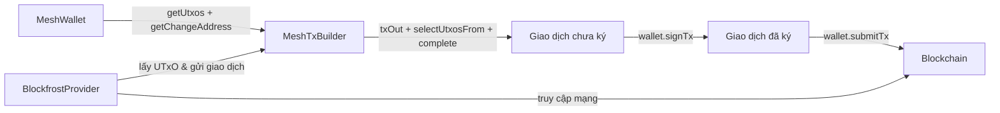

# Bài #01: Hello World

Bài học này giới thiệu các kiến thức cơ bản về phát triển ứng dụng Cardano: cài đặt [Mesh SDK](https://meshjs.dev/), tạo ví với `MeshWallet`, và gửi lovelace sử dụng `MeshTxBuilder`.

> Mã nguồn: [GitHub](https://github.com/cardanobuilders/cardanobuilders.github.io/tree/main/codes/course-cardano/01-wallet-send-lovelace)

## Thiết lập hệ thống

Khóa học này yêu cầu Node.js v24+. Chúng tôi khuyên bạn nên sử dụng [nvm](https://github.com/nvm-sh/nvm) để quản lý các phiên bản Node của bạn.

### Tạo file package.json

Trước tiên, tạo file `package.json` mới trong thư mục gốc của dự án với nội dung sau:

```json
{
  "type": "module",
  "dependencies": {},
  "scripts": {}
}
```

### Cài đặt các gói cần thiết

Mở terminal và chạy các lệnh sau để cài đặt MeshSDK:

```bash
npm install
npm install @meshsdk/core
```

Đây là file `package.json` của bạn sau khi cài đặt gói:

```json
{
  "type": "module",
  "dependencies": {
    "@meshsdk/core": "^1.9.0",
  },
  "scripts": {}
}
```

- `@meshsdk/core`: Chức năng cốt lõi cho tương tác mạng, ví và giao dịch.

## Tạo ví


[`MeshWallet`](https://meshjs.dev/apis/wallets/meshwallet) cung cấp các phương thức để tạo ví, tạo cụm từ ghi nhớ (mnemonic) và lấy địa chỉ ví.

### Tạo cụm từ ghi nhớ

Cụm từ ghi nhớ (mnemonic phrase) là một tập hợp các từ được sử dụng để khôi phục ví của bạn. Hãy giữ cụm từ ghi nhớ an toàn và bảo mật; bất kỳ ai có quyền truy cập vào nó đều có thể kiểm soát tiền của bạn.

Tạo cụm từ ghi nhớ mới:

```ts
import { MeshWallet } from "@meshsdk/core";

// Generate new mnemonic phrases for your wallet
const mnemonic = MeshWallet.brew();
console.log("Your mnemonic phrases are:", mnemonic);
```

- Sử dụng phương thức `brew` để tạo cụm từ ghi nhớ mới.

### Khởi tạo ví và lấy địa chỉ ví

Với cụm từ ghi nhớ đã tạo, khởi tạo ví:

```ts
// Initialize the wallet with a mnemonic key
const wallet = new MeshWallet({
  networkId: 0, // preprod testnet
  key: {
    type: "mnemonic",
    words: mnemonic as string[],
  },
});

// Get the wallet address
const address = await wallet.getChangeAddress();
console.log("Your wallet address is:", address);
```

- `networkId`: Chỉ định mạng, 0 cho preprod testnet.
- `key`: Chỉ định loại khóa và cụm từ ghi nhớ.
- `getChangeAddress`: Phương thức để lấy địa chỉ ví.

### Chạy mã

Tạo file mới `mnemonic.ts` với mã sau:

```ts
import { MeshWallet } from "@meshsdk/core";

// Generate new mnemonic phrases for your wallet
const mnemonic = MeshWallet.brew();
console.log("Your mnemonic phrases are:", mnemonic);

// Initialize the wallet with a mnemonic key
const wallet = new MeshWallet({
  networkId: 0, // preprod testnet
  key: {
    type: "mnemonic",
    words: mnemonic as string[],
  },
});

// Get the wallet address
const address = await wallet.getChangeAddress();
console.log("Your wallet address is:", address);
```

Cập nhật file `package.json` để thêm script chạy mã:

```json
{
  "type": "module",
  "dependencies": {
    "@meshsdk/core": "^1.9.0",
  },
  "scripts": {
    "mnemonic": "node mnemonic.ts"
  }
}
```

Chạy script:

```bash
npm run mnemonic
```
Lệnh này tạo cụm từ ghi nhớ mới và địa chỉ ví. Kết quả sẽ tương tự như sau:

```bash
> mnemonic
> node mnemonic.ts

Your mnemonic phrases are: [
  'access',  'spawn',   'taxi',
  'prefer',  'fortune', 'sword',
  'nerve',   'price',   'valid',
  'panther', 'sure',    'hello',
  'layer',   'try',     'grace',
  'seven',   'fossil',  'voice',
  'tobacco', 'circle',  'measure',
  'solar',   'pride',   'together'
]
Your wallet address is: addr_test1qptwuv6dl863u3k93mjrg0hgs0ahl08lfhsudxrwshcsx59cjxatme29s6cl7drjceknunry049shu9eudnsjvwqq9qsuem66d
```

## Gửi lovelace

Với ví đã được nạp tiền, bạn có thể gửi lovelace sử dụng lớp `MeshTxBuilder` để xây dựng và gửi giao dịch lên mạng.

### Nhận lovelace từ faucet

Sử dụng [Cardano Preprod Testnet Faucet](https://docs.cardano.org/cardano-testnets/tools/faucet) để nhận lovelace thử nghiệm. Dán địa chỉ ví của bạn, nhấn "Request funds," và bạn sẽ nhận được lovelace trong thời gian ngắn.

### Lấy khóa API Blockfrost

Việc xây dựng giao dịch yêu cầu lấy UTxO từ mạng. Đăng ký tài khoản [Blockfrost](https://blockfrost.io/) miễn phí và lấy khóa API preprod (bắt đầu bằng `preprod`). Bạn có thể tìm khóa trong phần "Projects" trên bảng điều khiển Blockfrost của bạn.

### Lấy thông tin ví

Lấy UTxO và địa chỉ thay đổi của ví:

```ts
// Get wallet data needed for the transaction
const utxos = await wallet.getUtxos();
const changeAddress = await wallet.getChangeAddress();
```

- `getUtxos`: Phương thức để lấy UTxO từ ví.
- `getChangeAddress`: Phương thức để lấy địa chỉ thay đổi.

### Tạo giao dịch gửi lovelace

Xây dựng giao dịch sử dụng [`MeshTxBuilder`](https://meshjs.dev/apis/txbuilder):

```ts
// Create the transaction
const txBuilder = new MeshTxBuilder({
  fetcher: provider,
  verbose: true, // optional, prints the transaction body
});

const unsignedTx = await txBuilder
  .txOut(
    "addr_test1qpvx0sacufuypa2k4sngk7q40zc5c4npl337uusdh64kv0uafhxhu32dys6pvn6wlw8dav6cmp4pmtv7cc3yel9uu0nq93swx9",
    [{ unit: "lovelace", quantity: "1500000" }]
  )
  .changeAddress(changeAddress)
  .selectUtxosFrom(utxos)
  .complete();
```

- `txOut`: Thêm địa chỉ người nhận và số tiền.
- `changeAddress`: Đặt địa chỉ thay đổi.
- `selectUtxosFrom`: Cung cấp UTxO của ví làm đầu vào giao dịch.
- `complete`: Tạo giao dịch.

### Ký và gửi giao dịch

Ký và gửi giao dịch lên mạng:

```ts
const signedTx = await wallet.signTx(unsignedTx);
const txHash = await wallet.submitTx(signedTx);
console.log("Transaction hash:", txHash);
```

- `signTx`: Phương thức để ký giao dịch, trả về giao dịch đã ký.
- `submitTx`: Phương thức để gửi giao dịch lên mạng.

### Chạy mã

Tạo file mới `send-lovelace.ts` với mã hoàn chỉnh:

```ts
import { BlockfrostProvider, MeshTxBuilder, MeshWallet } from "@meshsdk/core";

// Set up the blockchain provider with your key
const provider = new BlockfrostProvider("YOUR_KEY_HERE");

// Initialize the wallet with a mnemonic key
const wallet = new MeshWallet({
  networkId: 0,
  fetcher: provider,
  submitter: provider,
  key: {
    type: "mnemonic",
    words: ["your", "mnemonic", "...", "here"],
  },
});

// Get wallet data needed for the transaction
const utxos = await wallet.getUtxos();
const changeAddress = await wallet.getChangeAddress();

// Create the transaction
const txBuilder = new MeshTxBuilder({
  fetcher: provider,
  verbose: true, // optional, prints the transaction body
});

const unsignedTx = await txBuilder
  .txOut(
    "addr_test1qpvx0sacufuypa2k4sngk7q40zc5c4npl337uusdh64kv0uafhxhu32dys6pvn6wlw8dav6cmp4pmtv7cc3yel9uu0nq93swx9",
    [{ unit: "lovelace", quantity: "1500000" }]
  )
  .changeAddress(changeAddress)
  .selectUtxosFrom(utxos)
  .complete();

const signedTx = await wallet.signTx(unsignedTx);
const txHash = await wallet.submitTx(signedTx);
console.log("Transaction hash:", txHash);
```

Cập nhật file `package.json` để thêm script chạy mã:

```json
{
  "type": "module",
  "dependencies": {
    "@meshsdk/core": "^1.9.0",
  },
  "scripts": {
    "mnemonic": "node mnemonic.ts",
    "send-lovelace": "node send-lovelace.ts"
  }
}
```

Chạy script:

```bash
npm run send-lovelace
```

Lệnh này xây dựng, ký và gửi giao dịch lovelace. Kết quả sẽ tương tự như sau:

```bash
> send-lovelace
> node send-lovelace.ts

txBodyJson - before coin selection {"inputs":[],"outputs":[{"address":"addr_test1qpvx0sacufuypa2k4sngk7q40zc5c4npl337uusdh64kv0uafhxhu32dys6pvn6wlw8dav6cmp4pmtv7cc3yel9uu0nq93swx9","amount":[{"unit":"lovelace","quantity":"1500000"}]}],"fee":"0","collaterals":[],"requiredSignatures":[],"referenceInputs":[],"mints":[],"changeAddress":"addr_test1qp2k7wnshzngpqw0xmy33hvexw4aeg60yr79x3yeeqt3s2uvldqg2n2p8y4kyjm8sqfyg0tpq9042atz0fr8c3grjmysdp6yv3","metadata":{},"validityRange":{},"certificates":[],"withdrawals":[],"votes":[],"signingKey":[],"chainedTxs":[],"inputsForEvaluation":{},"network":"mainnet","expectedNumberKeyWitnesses":0,"expectedByronAddressWitnesses":[]}
txBodyJson - after coin selection {"inputs":[{"type":"PubKey","txIn":{"txHash":"99d859b305ab8021e497fad0dc55373e50fffd3e7026142fa3cf5accfe0d3aab","txIndex":1,"amount":[{"unit":"lovelace","quantity":"9823719"}],"address":"addr_test1qp2k7wnshzngpqw0xmy33hvexw4aeg60yr79x3yeeqt3s2uvldqg2n2p8y4kyjm8sqfyg0tpq9042atz0fr8c3grjmysdp6yv3"}}],"outputs":[{"address":"addr_test1qpvx0sacufuypa2k4sngk7q40zc5c4npl337uusdh64kv0uafhxhu32dys6pvn6wlw8dav6cmp4pmtv7cc3yel9uu0nq93swx9","amount":[{"unit":"lovelace","quantity":"1500000"}]},{"address":"addr_test1qp2k7wnshzngpqw0xmy33hvexw4aeg60yr79x3yeeqt3s2uvldqg2n2p8y4kyjm8sqfyg0tpq9042atz0fr8c3grjmysdp6yv3","amount":[{"unit":"lovelace","quantity":"8153730"}]}],"fee":"169989","collaterals":[],"requiredSignatures":[],"referenceInputs":[],"mints":[],"changeAddress":"addr_test1qp2k7wnshzngpqw0xmy33hvexw4aeg60yr79x3yeeqt3s2uvldqg2n2p8y4kyjm8sqfyg0tpq9042atz0fr8c3grjmysdp6yv3","metadata":{},"validityRange":{},"certificates":[],"withdrawals":[],"votes":[],"signingKey":[],"chainedTxs":[],"inputsForEvaluation":{"99d859b305ab8021e497fad0dc55373e50fffd3e7026142fa3cf5accfe0d3aab1":{"input":{"outputIndex":1,"txHash":"99d859b305ab8021e497fad0dc55373e50fffd3e7026142fa3cf5accfe0d3aab"},"output":{"address":"addr_test1qp2k7wnshzngpqw0xmy33hvexw4aeg60yr79x3yeeqt3s2uvldqg2n2p8y4kyjm8sqfyg0tpq9042atz0fr8c3grjmysdp6yv3","amount":[{"unit":"lovelace","quantity":"9823719"}]}}},"network":"mainnet","expectedNumberKeyWitnesses":0,"expectedByronAddressWitnesses":[]}
Transaction hash: 62a825c607e4ca5766325c2fccd7ee98313ff81b7e8a4af67eac421b0f0866ff
```

Mã giao dịch (transaction hash) xác nhận giao dịch của bạn đã được gửi. Thiết lập `verbose: true` trong `MeshTxBuilder` sẽ in nội dung giao dịch trước và sau quá trình chọn coin, rất hữu ích cho việc debug.

## Hướng Dẫn Mã Nguồn

Phần này kết nối toàn bộ bức tranh về những gì bạn đã xây dựng, cách các file liên quan với nhau, và cách các khái niệm ánh xạ đến các mẫu bạn đã biết từ phát triển web.

### Cấu trúc dự án

```
01-wallet-send-lovelace/
├── package.json          # Cấu hình dự án với dependency @meshsdk/core
├── mnemonic.ts           # Tạo thông tin xác thực ví (mnemonic + địa chỉ)
└── send-lovelace.ts      # Xây dựng, ký và gửi giao dịch chuyển lovelace
```

Đây là một dự án Node.js tối giản không có framework -- chỉ hai script TypeScript độc lập và một dependency duy nhất. Hãy nghĩ về nó như một công cụ CLI giao tiếp với API từ xa, ngoại trừ "API" ở đây chính là blockchain Cardano.

- **package.json** khai báo dự án là một ES module và kéo `@meshsdk/core`, thư viện xử lý tất cả giao tiếp blockchain, quản lý ví và xây dựng giao dịch.
- **mnemonic.ts** là script thiết lập một lần. Nó tạo thông tin xác thực ví của bạn (cụm từ ghi nhớ + địa chỉ được dẫn xuất). Bạn chạy nó một lần, lưu kết quả và sử dụng trong script tiếp theo.
- **send-lovelace.ts** là script chính. Nó khởi tạo ví từ cụm từ ghi nhớ đã lưu, kết nối với blockchain thông qua Blockfrost, xây dựng giao dịch, ký và gửi nó.

### Luồng giao dịch




Luồng tuân theo mẫu **xây dựng-ký-gửi**:
1. **Lấy trạng thái** -- Ví truy vấn blockchain (qua Blockfrost) để lấy các UTxO khả dụng của bạn.
2. **Xây dựng giao dịch** -- `MeshTxBuilder` lắp ráp giao dịch: ai nhận tiền, UTxO nào được chi tiêu và tiền thối đi đâu.
3. **Ký** -- Khóa riêng của ví bạn ký giao dịch, chứng minh bạn đã ủy quyền chi tiêu.
4. **Gửi** -- Giao dịch đã ký được gửi đến mạng blockchain thông qua Blockfrost.

### So sánh với Web2

Nếu bạn đến từ lĩnh vực phát triển web truyền thống, bảng này ánh xạ các khái niệm blockchain trong bài học này với các mẫu bạn đã biết.

| Khái niệm Cardano | Tương đương Web2 | Giải thích |
|---|---|---|
| Cụm từ ghi nhớ | Mật khẩu chính / khóa khôi phục | Một tập hợp từ dẫn xuất tất cả khóa riêng của bạn. Mất nó nghĩa là mất quyền truy cập vĩnh viễn -- không có luồng "quên mật khẩu". |
| MeshWallet | Thông tin xác thực + phiên đăng nhập | Giữ khóa của bạn và ký yêu cầu thay mặt bạn, tương tự như cách phiên đăng nhập đã xác thực ủy quyền các lệnh gọi API. |
| UTxO (Unspent Transaction Output) | Bản ghi cơ sở dữ liệu với số dư | Mỗi UTxO là một khối giá trị riêng biệt. Chi tiêu nghĩa là tiêu thụ các bản ghi hiện có và tạo bản ghi mới, không phải cập nhật trường số dư tại chỗ. |
| BlockfrostProvider | REST API client / SDK | Xử lý tất cả giao tiếp HTTP với mạng Cardano. Bạn cấu hình nó bằng khóa API, giống như bất kỳ SDK dịch vụ bên thứ ba nào. |
| MeshTxBuilder | Trình xây dựng request (như ORM query builder) | Nối chuỗi các phương thức để xây dựng giao dịch, tương tự như cách query builder nối chuỗi `.where()`, `.select()`, `.limit()`. |
| Ký giao dịch | Ký request (HMAC / JWT) | Chứng minh bằng mật mã rằng bạn đã ủy quyền giao dịch cụ thể này. Tương tự như ký các yêu cầu API bằng khóa bí mật. |
| Hash giao dịch | ID phản hồi / biên nhận | Mã định danh duy nhất cho giao dịch đã gửi. Sử dụng nó để tra cứu giao dịch trên block explorer, giống như theo dõi thanh toán bằng ID xác nhận. |
| Testnet faucet | Môi trường sandbox với dữ liệu thử nghiệm | Cung cấp token thử nghiệm miễn phí để thử nghiệm, giống như chế độ test của Stripe hoặc sandbox API. |

## Mã nguồn

Mã nguồn cho bài học này có sẵn trên [GitHub](https://github.com/cardanobuilders/cardanobuilders.github.io/tree/main/codes/course-cardano/01-wallet-send-lovelace).

## Thách thức

Tạo một giao dịch gửi nhiều tài sản đến nhiều địa chỉ. Khám phá tài liệu Mesh SDK để biết thêm!
