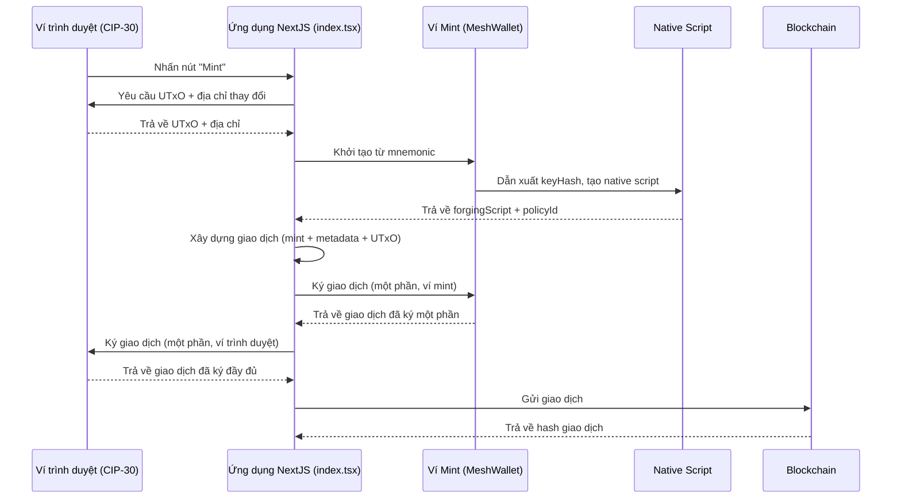

# Bài #02: Giao dịch đa chữ ký

Giao dịch đa chữ ký (multi-sig) yêu cầu nhiều bên ký trước khi có thể gửi lên blockchain. Multi-sig hoạt động giống như tài khoản chung, nơi tất cả các bên bắt buộc phải đồng ý việc chi tiêu. Giao dịch có thể yêu cầu hai hoặc nhiều người ký, có thể là ví hoặc script.


Trong bài học này, bạn sẽ:
- Xây dựng giao dịch đa chữ ký để mint token
- Thiết lập ứng dụng NextJS với giao diện web để tương tác với blockchain Cardano

> Mã nguồn: [GitHub](https://github.com/cardanobuilders/cardanobuilders.github.io/tree/main/codes/course-cardano/02-multisig)

## Thiết lập hệ thống

### Tải extension ví CIP30

Bạn cần một extension ví trình duyệt hỗ trợ chuẩn CIP30. Chọn và cài đặt một extension từ [Cardano developer showcase](https://developers.cardano.org/showcase/?tags=wallet).

Sau khi cài đặt, khôi phục ví bằng cụm từ ghi nhớ (seed phrase) bạn đã tạo trong bài học trước.

### Thiết lập NextJS và Mesh

Tạo ứng dụng NextJS mới:

```bash
npx create-next-app@latest --typescript mesh-multisig
```

Làm theo các hướng dẫn:

```bash
Need to install the following packages:
Ok to proceed? (y)

✔ Would you like to use ESLint? … Yes
✔ Would you like to use Tailwind CSS? … Yes
✔ Would you like your code inside a `src/` directory? … Yes
✔ Would you like to use App Router? … No
✔ Would you like to use Turbopack for next dev? … No
✔ Would you like to customize the import alias (@/* by default)? … No
```

Di chuyển đến thư mục vừa tạo:

```bash
cd mesh-multisig
```

Cài đặt phiên bản mới nhất của Mesh:

```bash
npm install @meshsdk/core @meshsdk/react
```

### Thêm MeshProvider

Bọc ứng dụng của bạn với `MeshProvider` để sử dụng các component React của Mesh. Mở `src/app/layout.tsx` và thêm:

```ts
import "@/styles/globals.css";
import type { AppProps } from "next/app";
import "@meshsdk/react/styles.css";
import { MeshProvider } from "@meshsdk/react";

export default function App({ Component, pageProps }: AppProps) {
  return (
    <MeshProvider>
      <Component {...pageProps} />
    </MeshProvider>
  );
}
```

### Thêm component CardanoWallet

Thêm component ví để tương tác với blockchain. Thay thế nội dung của `src/pages/index.tsx` bằng:

```ts
import { CardanoWallet, useWallet } from "@meshsdk/react";

export default function Home() {
  const { wallet, connected } = useWallet();
  return (
    <div>
      <CardanoWallet isDark={true} />
    </div>
  );
}
```

Khởi động server phát triển:

```bash
npm run dev
```

Truy cập [http://localhost:3000](http://localhost:3000/) để xem ứng dụng của bạn. Nhấn **CTRL+C** để dừng server.

Bạn sẽ thấy component "Connect Wallet". Thử kết nối với ví của bạn.

## Script Mint

Phần này hướng dẫn tạo script mint cho việc mint token đa chữ ký.

### Định nghĩa Script Mint

Thiết lập các hằng số cho script mint:

```ts
const provider = new BlockfrostProvider("YOUR_KEY_HERE");

const demoAssetMetadata = {
  name: "Mesh Token",
  image: "ipfs://QmRzicpReutwCkM6aotuKjErFCUD213DpwPq6ByuzMJaua",
  mediaType: "image/jpg",
  description: "This NFT was minted by Mesh (https://meshjs.dev/).",
};

const mintingWallet = ["your", "mnemonic", "...", "here"];
```

- Thay `YOUR_KEY_HERE` bằng khóa API Blockfrost của bạn.
- Định nghĩa metadata tài sản trong `demoAssetMetadata`.
- Sử dụng cụm từ ghi nhớ cho ví mint.

### Tạo ví ứng dụng Mint

Tạo hàm để xây dựng giao dịch mint:

```ts
async function buildMintTx(inputs: UTxO[], changeAddress: string) {
  const wallet = new MeshWallet({
    networkId: 0,
    key: {
      type: "mnemonic",
      words: mintingWallet,
    },
  });

  const { pubKeyHash: keyHash } = deserializeAddress(
    await wallet.getChangeAddress()
  );
}
```

- `inputs`: UTxO từ ví của bạn để trả phí mint.
- Khởi tạo ví với cụm từ ghi nhớ.
- Lấy `pubKeyHash` cho script mint.

### Tạo Native Script


Định nghĩa native script:

```ts
const nativeScript: NativeScript = {
  type: "all",
  scripts: [
    {
      type: "before",
      slot: "99999999",
    },
    {
      type: "sig",
      keyHash: keyHash,
    },
  ],
};
const forgingScript = ForgeScript.fromNativeScript(nativeScript);
```

- `nativeScript`: Các tham số cho script.
- `ForgeScript.fromNativeScript`: Tạo forging script.

### Định nghĩa Metadata tài sản

Thiết lập metadata tài sản:

```ts
const policyId = resolveScriptHash(forgingScript);
const tokenName = "MeshToken";
const tokenNameHex = stringToHex(tokenName);
const metadata = { [policyId]: { [tokenName]: { ...demoAssetMetadata } } };
```

- `policyId`: Được trích xuất từ forging script.
- `tokenName`: Tên của token.
- `metadata`: Metadata tài sản.

### Tạo giao dịch

Xây dựng giao dịch mint:

```ts
const txBuilder = new MeshTxBuilder({
  fetcher: provider,
  verbose: true,
});

const unsignedTx = await txBuilder
  .mint("1", policyId, tokenNameHex)
  .mintingScript(forgingScript)
  .metadataValue(721, metadata)
  .changeAddress(changeAddress)
  .invalidHereafter(99999999)
  .requiredSignerHash(keyHash)
  .selectUtxosFrom(inputs)
  .complete();
```

- `mint`: Thêm chi tiết token.
- `mintingScript`: Đính kèm script mint.
- `metadataValue`: Thêm metadata tài sản.
- `changeAddress`: Chỉ định địa chỉ thay đổi.
- `invalidHereafter`: Đặt thời hạn hết hạn giao dịch.
- `selectUtxosFrom`: Sử dụng UTxO để trả phí.
- `requiredSignerHash` để khai báo rằng pub key hash của ví mint là bắt buộc.
- `complete`: Hoàn tất giao dịch.

### Ký giao dịch

Ký giao dịch với ví mint:

```ts
const signedTx = await wallet.signTx(unsignedTx, true);
```

### Mã nguồn

Đây là mã hoàn chỉnh để xây dựng giao dịch mint:

```ts
async function buildMintTx(inputs: UTxO[], changeAddress: string) {
  // minting wallet
  const wallet = new MeshWallet({
    networkId: 0,
    key: {
      type: "mnemonic",
      words: mintingWallet,
    },
  });

  const { pubKeyHash: keyHash } = deserializeAddress(
    await wallet.getChangeAddress()
  );

  // create minting script
  const nativeScript: NativeScript = {
    type: "all",
    scripts: [
      {
        type: "before",
        slot: "99999999",
      },
      {
        type: "sig",
        keyHash: keyHash,
      },
    ],
  };
  const forgingScript = ForgeScript.fromNativeScript(nativeScript);

  // create metadata
  const policyId = resolveScriptHash(forgingScript);
  const tokenName = "MeshToken";
  const tokenNameHex = stringToHex(tokenName);
  const metadata = { [policyId]: { [tokenName]: { ...demoAssetMetadata } } };

  // create transaction
  const txBuilder = new MeshTxBuilder({
    fetcher: provider,
    verbose: true,
  });

  const unsignedTx = await txBuilder
    .mint("1", policyId, tokenNameHex)
    .mintingScript(forgingScript)
    .metadataValue(721, metadata)
    .changeAddress(changeAddress)
    .invalidHereafter(99999999)
    .requiredSignerHash(keyHash)
    .selectUtxosFrom(inputs)
    .complete();

  const signedTx = await wallet.signTx(unsignedTx, true);
  return signedTx;
}
```

## Thực thi giao dịch

Sau khi xây dựng giao dịch mint, thực thi nó từ giao diện:

```ts
async function mint() {
  if (connected) {
    const inputs = await wallet.getUtxos();
    const changeAddress = await wallet.getChangeAddress();

    const tx = await buildMintTx(inputs, changeAddress);
    const signedTx = await wallet.signTx(tx, true);

    const txHash = await wallet.submitTx(signedTx);
    console.log("Transaction hash:", txHash);
  }
}
```

- Kiểm tra kết nối ví.
- Lấy UTxO và địa chỉ thay đổi.
- Xây dựng, ký và gửi giao dịch.

## Hướng Dẫn Mã Nguồn

Phần này giải thích kiến trúc tổng thể của ứng dụng mint đa chữ ký, cách các file kết nối với nhau, và cách các khái niệm blockchain này ánh xạ đến các mẫu phát triển web mà bạn đã biết.

### Cấu trúc dự án

```
02-multisig/
├── package.json              # Ứng dụng NextJS với @meshsdk/core và @meshsdk/react
├── src/
│   └── pages/
│       ├── _app.tsx          # MeshProvider wrapper (kích hoạt wallet context)
│       └── index.tsx         # Trang chính: giao diện ví, buildMintTx và logic mint
└── ...                       # Các file NextJS chuẩn (cấu hình, styles, v.v.)
```

Đây là ứng dụng NextJS Pages Router với hai file chính mà bạn đã viết:

- **_app.tsx** bọc toàn bộ ứng dụng trong `MeshProvider`, là một React context provider. Đây là cùng mẫu như bọc ứng dụng trong auth provider hoặc theme provider -- nó làm cho trạng thái ví (trạng thái kết nối, các phương thức ví) khả dụng cho mọi component thông qua hook `useWallet`.
- **index.tsx** chứa tất cả logic nghiệp vụ trong một trang duy nhất. Nó render nút kết nối `CardanoWallet`, định nghĩa `buildMintTx` (xây dựng và ký một phần giao dịch mint ở phía server), và định nghĩa `mint` (điều phối toàn bộ luồng từ trình duyệt).

Sự phân tách này quan trọng: `_app.tsx` là hạ tầng thuần túy (bạn thiết lập một lần rồi quên đi), trong khi `index.tsx` là nơi chứa logic miền.

### Luồng mint đa chữ ký



Điểm mấu chốt là **ký hai bước**. Khác với Bài 1 nơi một ví duy nhất ký mọi thứ, đa chữ ký yêu cầu cả hai ví ký cùng một giao dịch trước khi nó hợp lệ:

1. **Xây dựng** -- Ứng dụng xây dựng giao dịch sử dụng UTxO từ ví trình duyệt (trả phí) và native script được dẫn xuất từ key hash của ví mint.
2. **Chữ ký thứ nhất** -- Ví mint (phía server, từ mnemonic) ký một phần giao dịch. Tham số `true` trong `wallet.signTx(unsignedTx, true)` có nghĩa là "ký một phần" -- giao dịch chưa hoàn tất.
3. **Chữ ký thứ hai** -- Ví trình duyệt (CIP-30, phía người dùng) cũng ký một phần. Giờ cả hai chữ ký bắt buộc đã có mặt.
4. **Gửi** -- Giao dịch đã ký đầy đủ được gửi đến blockchain.

Native script đảm bảo rằng **cả hai** chữ ký phải có mặt. Nếu thiếu một trong hai, blockchain sẽ từ chối giao dịch.

### So sánh với Web2

| Khái niệm Cardano | Tương đương Web2 | Giải thích |
|---|---|---|
| Giao dịch đa chữ ký | Phê duyệt đa yếu tố (ví dụ: chuyển khoản hai người ký) | Yêu cầu nhiều bên độc lập ủy quyền một hành động trước khi nó thực thi. Giống như yêu cầu cả quản lý và tài chính phê duyệt đơn mua hàng lớn. |
| Native script | Quy tắc nghiệp vụ / công cụ chính sách | Các quy tắc khai báo xác định điều kiện nào phải được đáp ứng. Loại `"all"` nghĩa là mọi điều kiện phải đạt -- giống mệnh đề AND trong công cụ chính sách. |
| Điều kiện `type: "sig"` | Người phê duyệt bắt buộc | Chỉ định một khóa cụ thể phải ký. Giống như thêm người review bắt buộc cho pull request. |
| Điều kiện `type: "before"` | Hết hạn / TTL | Giao dịch chỉ hợp lệ trước một slot (thời điểm) nhất định. Giống như đặt hạn cho link mời hoặc token JWT. |
| Ví trình duyệt CIP-30 | OAuth / SSO login | Giao diện chuẩn hóa cho các ứng dụng web tương tác với ví người dùng, tương tự cách OAuth chuẩn hóa luồng đăng nhập giữa các nhà cung cấp danh tính. |
| MeshProvider | Auth context provider (React) | React context cung cấp trạng thái ví cho toàn bộ cây component. Hoàn toàn giống mẫu `<AuthProvider>` hoặc `<SessionProvider>`. |
| Metadata NFT (CIP-25) | Bản ghi cơ sở dữ liệu / tài nguyên API | Dữ liệu có cấu trúc được đính kèm vào token trên chuỗi. Schema metadata (nhãn 721) là chuẩn Cardano, tương tự cách REST API định nghĩa schema phản hồi. |
| Policy ID | Namespace / tenant ID | Mã định danh duy nhất được dẫn xuất từ minting script. Tất cả token được mint dưới cùng script chia sẻ policy ID, giống như tài nguyên trong ứng dụng multi-tenant chia sẻ tenant ID. |
| Ký một phần (`signTx(tx, true)`) | Luồng phê duyệt tăng dần | Mỗi bên thêm chữ ký mà không hoàn tất. Giống tài liệu thu thập chữ ký từ nhiều bên liên quan trước khi gửi. |

## Mã nguồn

Mã nguồn cho bài học này có sẵn trên [GitHub](https://github.com/cardanobuilders/cardanobuilders.github.io/tree/main/codes/course-cardano/02-multisig).

## Thách thức

Tạo ví đa chữ ký yêu cầu 2 trong 3 người ký để phê duyệt giao dịch. Xây dựng và ký giao dịch với hai người ký, gửi giao dịch và xác minh thành công.
