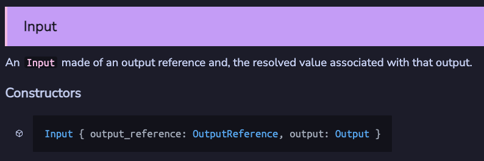
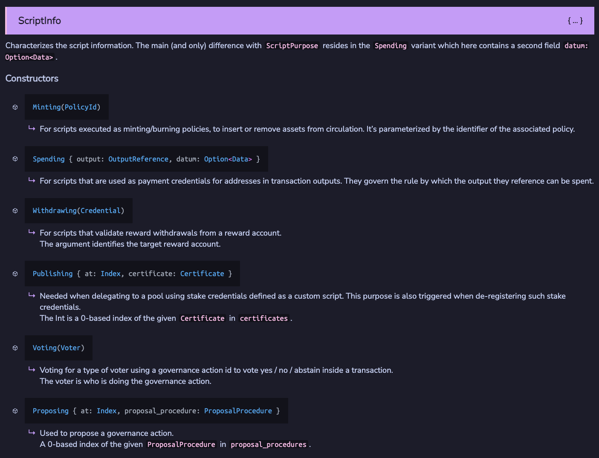

# Bài #03: Hợp đồng Aiken

Bài học 3 đến 6 bao gồm các khái niệm cốt lõi của việc xây dựng smart contract Aiken. Một số tài liệu được điều chỉnh từ [AikenPBL của Andamio](https://app.andamio.io/course/db22e013578fcead6c2fed5446d61891ad31f3cb4955e88d980107e7).

### Tổng quan

- **Khóa học Hello Cardano**: Bao gồm các khái niệm trọng yếu được chọn lọc của việc phát triển smart contract Aiken.
- **AikenPBL**: Khóa học đầy đủ dựa trên dự án từ đầu đến cuối, bao gồm các khái niệm thiết yếu và nền tảng.

Phát triển smart contract Aiken là một lĩnh vực chuyên biệt. Để đi sâu hơn và theo đuổi sự nghiệp như một nhà phát triển on-chain Cardano, chúng tôi khuyên bạn nên hoàn thành cả hai khóa học.

> Mã nguồn: [GitHub](https://github.com/cardanobuilders/cardanobuilders.github.io/tree/main/codes/course-cardano/03-aiken-contracts)

## Thiết lập hệ thống

Cài đặt Aiken sử dụng một trong các hướng dẫn sau:

1. [Hướng dẫn cài đặt chính thức Aiken](https://aiken-lang.org/installation-instructions)
2. [Hướng dẫn thiết lập AikenPBL của Andamio](https://app.andamio.io/course/db22e013578fcead6c2fed5446d61891ad31f3cb4955e88d980107e7/101/lesson/1)

### Thiết lập dự án Aiken trống

Chạy lệnh sau để tạo dự án Aiken mới sử dụng template của Mesh:

```bash
npx meshjs 03-aiken-contracts
```

Chọn template `Aiken` khi được hỏi.


Sau khi cài đặt, thư mục mới `03-aiken-contracts` sẽ được tạo với cấu trúc sau:

```
03-aiken-contracts
├── aiken-workspace  // Thư mục dự án Aiken chính được sử dụng trong bài học
└── mesh             // Thư mục cho mã off-chain Mesh tương đương (không sử dụng trong bài học)
```

### Tùy chọn: Cài đặt Cardano-Bar

Nếu bạn sử dụng VSCode làm IDE, cài đặt extension [Cardano-Bar](https://marketplace.visualstudio.com/items/?itemName=sidan-lab.cardano-bar-vscode) để có các đoạn mã mẫu giúp theo dõi khóa học dễ dàng hơn.


## Tìm hiểu Transaction Context


Các hợp đồng Cardano hoạt động khác với smart contract trên các blockchain khác. Chúng hoạt động như các quy tắc xác thực để xác định xem một giao dịch có hợp lệ hay không. **Validator** là thuật ngữ chính xác hơn cho các hợp đồng Cardano.

Xây dựng validator yêu cầu hiểu cách giao dịch hoạt động. Tham khảo [tài liệu Aiken](https://aiken-lang.github.io/stdlib/cardano/transaction.html#Transaction) để xem cấu trúc `Transaction` đầy đủ.


### Đầu vào & Đầu ra

Tất cả các giao dịch Cardano phải có đầu vào và đầu ra:
- **Đầu vào (Inputs)**: UTXO được chi tiêu trong giao dịch.
- **Đầu ra (Outputs)**: UTXO được tạo ra trong giao dịch.

Xem [tài liệu Aiken](https://aiken-lang.github.io/stdlib/cardano/transaction.html#Input) để biết định nghĩa kiểu:




Các khái niệm chính:
- Một đầu vào tham chiếu đến đầu ra của giao dịch trước, được xác định bởi `output_reference`.
- Validator có thể kiểm tra:
  - Nếu một đầu vào chi tiêu từ một địa chỉ cụ thể.
  - Nếu một đầu vào chi tiêu một tài sản cụ thể.
  - Nếu một đầu ra gửi đến một địa chỉ cụ thể.
  - Nếu một đầu ra gửi một tài sản cụ thể.
  - Nếu datum của đầu vào/đầu ra chứa thông tin cụ thể.

### Reference Inputs

`reference_inputs` trong `Transaction` là các đầu vào không bị chi tiêu mà được tham chiếu trong validator. Hữu ích cho việc đọc datum từ UTXO mà không cần chi tiêu nó.

### Mint

`mint` trong `Transaction` liệt kê các tài sản được mint hoặc đốt (burn). Hữu ích cho việc tạo hoặc hủy token.

### Chữ ký

`extra_signatories` trong `Transaction` liệt kê các public key hash bắt buộc phải ký giao dịch. Hữu ích cho việc yêu cầu người dùng cụ thể phải ký.

### Thời gian

`validity_range` trong `Transaction` chỉ định phạm vi slot mà giao dịch có hiệu lực. Hữu ích cho việc thiết lập khóa thời gian.

## Các loại Script

Xem [tài liệu Aiken](https://aiken-lang.github.io/stdlib/cardano/script_context.html#ScriptContext) để biết các loại script. Phổ biến nhất:
- **Minting**
- **Spending**
- **Withdrawing**



### Minting Script

Xác thực minting script được kích hoạt khi tài sản được mint hoặc đốt theo policy của script.

Ví dụ: `/aiken-workspace/validators/mint.ak`:

```rs
use cardano/assets.{PolicyId}
use cardano/transaction.{Transaction, placeholder}

validator always_succeed {
  mint(_redeemer: Data, _policy_id: PolicyId, _tx: Transaction) {
    True
  }

  else(_) {
    fail @"unsupported purpose"
  }
}

test test_always_succeed_minting_policy() {
  let data = Void
  always_succeed.mint(data, #"", placeholder)
}
```

Script này sẽ được biên dịch thành một script với hash `def68337867cb4f1f95b6b811fedbfcdd7780d10a95cc072077088ea`, còn gọi là `policy Id`. Nó xác thực các giao dịch mint hoặc đốt tài sản theo policy này.

#### Tham số

Nâng cấp script để chỉ cho phép mint/đốt khi được ký bởi một khóa cụ thể:

```rs
validator minting_policy(owner_vkey: VerificationKeyHash) {
  mint(_redeemer: Data, _policy_id: PolicyId, tx: Transaction) {
    key_signed(tx.extra_signatories, owner_vkey)
  }

  else(_) {
    fail @"unsupported purpose"
  }
}
```

- `owner_vkey`: Public key hash của chủ sở hữu được phép mint/đốt tài sản.
- Sử dụng `key_signed` từ [vodka](https://github.com/sidan-lab/vodka) để xác thực.

#### Redeemer

Mở rộng policy để bao gồm redeemer chỉ định hành động giao dịch (mint hoặc đốt):

```rs
pub type MyRedeemer {
  MintToken
  BurnToken
}

validator minting_policy(
  owner_vkey: VerificationKeyHash,
  minting_deadline: Int,
) {
  mint(redeemer: MyRedeemer, policy_id: PolicyId, tx: Transaction) {
    when redeemer is {
      MintToken -> {
        let before_deadline = valid_before(tx.validity_range, minting_deadline)
        let is_owner_signed = key_signed(tx.extra_signatories, owner_vkey)
        before_deadline? && is_owner_signed?
      }
      BurnToken -> check_policy_only_burn(tx.mint, policy_id)
    }
  }

  else(_) {
    fail @"unsupported purpose"
  }
}
```

### Spending Script

Xác thực spending script được kích hoạt khi một UTXO tại địa chỉ script được chi tiêu trong giao dịch.

Ví dụ: `/aiken-workspace/validators/spend.ak`:

```rs
pub type Datum {
  oracle_nft: PolicyId,
}

validator hello_world {
  spend(
    datum_opt: Option<Datum>,
    _redeemer: Data,
    _input: OutputReference,
    tx: Transaction,
  ) {
    when datum_opt is {
      Some(datum) ->
        when inputs_with_policy(tx.reference_inputs, datum.oracle_nft) is {
          [_ref_input] -> True
          _ -> False
        }
      None -> False
    }
  }

  else(_) {
    fail @"unsupported purpose"
  }
}
```

#### Datum

- `Datum`: Dữ liệu đính kèm vào UTXO tại địa chỉ script.
- Mẫu thiết kế phổ biến: Sử dụng oracle NFT (state thread token) để đảm bảo tính duy nhất của UTXO.

### Withdrawing Script

Xác thực withdrawal script được kích hoạt khi rút từ tài khoản thưởng.

Ví dụ: `/aiken-workspace/validators/withdraw.ak`:

```rs
use aiken/crypto.{VerificationKeyHash}
use cardano/address.{Credential, Script}
use cardano/certificate.{Certificate}
use cardano/transaction.{Transaction, placeholder}

validator always_succeed(_key_hash: VerificationKeyHash) {
  withdraw(_redeemer: Data, _credential: Credential, _tx: Transaction) {
    True
  }

  publish(_redeemer: Data, _certificate: Certificate, _tx: Transaction) {
    True
  }

  else(_) {
    fail @"unsupported purpose"
  }
}

test test_always_succeed_withdrawal_policy() {
  let data = Void
  always_succeed.withdraw("", data, Script(#""), placeholder)
}
```

#### Xử lý Publishing

Tất cả withdrawal script phải được đăng ký on-chain trước khi sử dụng. Việc này được thực hiện bằng cách xuất bản chứng chỉ đăng ký với script hash làm stake credential. Việc xuất bản script cũng được xác thực bởi hàm `publish` trong withdrawal script, hàm này được kích hoạt mỗi khi withdrawal script hiện tại được đăng ký hoặc hủy đăng ký.

#### Khi nào withdrawal script được sử dụng?

Hầu hết người dùng Cardano stake và rút thưởng bằng khóa thanh toán tiêu chuẩn. Tuy nhiên, các DApp Cardano thường sử dụng withdrawal script để cải thiện hiệu quả xác thực. Kỹ thuật này được trình bày trong [Bài 5](./05-avoid-redundant-validation.mdx).

## Hướng Dẫn Mã Nguồn

Phần này cung cấp hướng dẫn chi tiết về kho mã nguồn của bài học, kết nối các khái niệm Aiken ở trên với cấu trúc dự án mà bạn có thể clone và build cục bộ.

### Cấu trúc dự án

```
03-aiken-contracts/
├── aiken-workspace/          # Thư mục dự án Aiken chính (sử dụng trong bài này)
│   └── validators/
│       ├── mint.ak           # Minting validator (luôn thành công + có tham số)
│       ├── spend.ak          # Spending validator (mẫu oracle NFT)
│       └── withdraw.ak       # Withdrawal validator (luôn thành công)
├── mesh/                     # Thư mục mã off-chain (không sử dụng trong bài này)
└── package.json
```

**`aiken-workspace/`** chứa các validator on-chain -- mã chạy trên blockchain Cardano. Hãy nghĩ đây là thư mục "logic backend" của bạn. Mỗi file `.ak` được biên dịch thành script Plutus mà mạng thực thi trong quá trình xác thực giao dịch.

**`mesh/`** chứa mã off-chain TypeScript xây dựng và gửi giao dịch. Nó tương đương với frontend hoặc API client giao tiếp với các validator. Thư mục này không được sử dụng trong bài học hiện tại nhưng trở nên liên quan trong các bài học sau khi bạn kết nối ứng dụng web với hợp đồng.

Nếu bạn đến từ nền tảng web2, sự phân chia này tương tự như có thư mục `contracts/` cho các ràng buộc cơ sở dữ liệu và thư mục `client/` cho API server.

### Các loại Validator và điều kiện kích hoạt giao dịch

Ba file `.ak` tương ứng với ba loại validator phổ biến nhất trên Cardano. Mỗi loại được kích hoạt trong một điều kiện giao dịch khác nhau:


- **`mint.ak`** chạy khi giao dịch đúc hoặc đốt token theo policy ID của validator. Nó bắt đầu là policy "luôn thành công", sau đó phát triển để yêu cầu chữ ký chủ sở hữu và thời hạn.
- **`spend.ak`** chạy khi giao dịch cố gắng chi tiêu UTXO nằm tại địa chỉ script của validator. Ví dụ này sử dụng mẫu oracle NFT -- nó kiểm tra rằng một reference input cụ thể có mặt trước khi cho phép chi tiêu.
- **`withdraw.ak`** chạy khi giao dịch rút phần thưởng staking từ tài khoản thưởng của validator. Phiên bản "luôn thành công" ở đây là khung sườn; Bài 5 cho thấy cách withdrawal validator được sử dụng để xác thực nhiều UTXO hiệu quả.

### So sánh với Web2

Nếu bạn quen thuộc với việc xây dựng REST API hoặc ứng dụng server-side, các ánh xạ này sẽ giúp kết nối mô hình tư duy:

| Khái niệm Cardano | Tương đương Web2 | Giải thích |
|---|---|---|
| **Validator** | Route middleware / auth guard | Hàm thuần túy trả về cho phép hoặc từ chối. Nó không trực tiếp thay đổi trạng thái -- nó chỉ quyết định giao dịch có được phép hay không. |
| **Datum** | Bản ghi cơ sở dữ liệu / hàng | Dữ liệu đính kèm vào UTXO tại địa chỉ script. Khi bạn "khóa" tiền, bạn đính kèm datum giống cách bạn ghi một hàng vào bảng. |
| **Redeemer** | Body yêu cầu API | Dữ liệu người dùng cung cấp khi tương tác với validator. Validator đọc redeemer để quyết định nhánh mã nào thực thi (ví dụ: `MintToken` vs `BurnToken`). |
| **Policy ID** | Phạm vi khóa API / bộ quyền | Hash duy nhất xác định minting policy. Token được đúc dưới các policy khác nhau là khác biệt, tương tự cách các khóa API khác nhau cấp quyền truy cập vào các tài nguyên khác nhau. |
| **Transaction** | Yêu cầu HTTP | Gói hoàn chỉnh gồm đầu vào, đầu ra, chữ ký và metadata mà validator kiểm tra -- tương tự đối tượng request đầy đủ mà middleware nhận được. |

### Điểm mấu chốt

Mọi validator Aiken là một hàm thuần túy: nó nhận ngữ cảnh giao dịch và trả về `True` hoặc `False`. Không có tác dụng phụ, không ghi cơ sở dữ liệu, không gọi mạng bên trong validator. Blockchain runtime chỉ xử lý thay đổi trạng thái nếu validator chấp thuận. Điều này khác biệt cơ bản với backend web2 nơi route handler vừa xác thực vừa thay đổi trạng thái.

## Mã nguồn

Mã nguồn cho bài học này có sẵn trên [GitHub](https://github.com/cardanobuilders/cardanobuilders.github.io/tree/main/codes/course-cardano/03-aiken-contracts).
