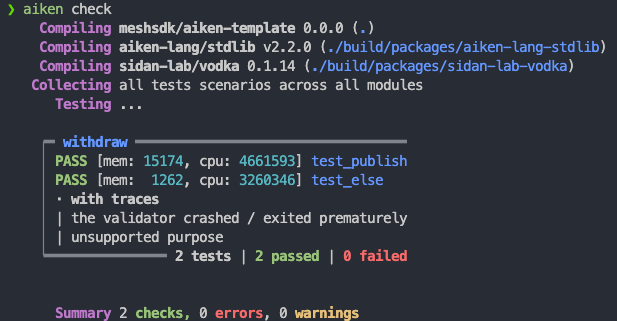
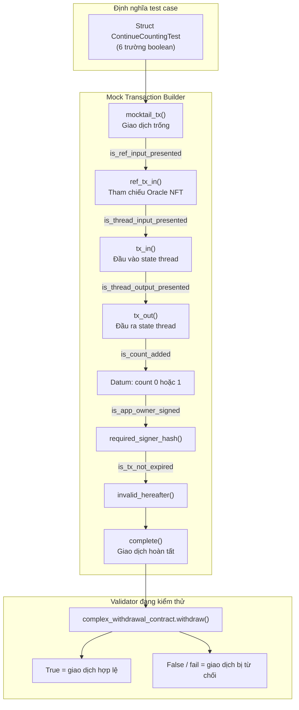

# Bài #04: Kiểm thử hợp đồng

Kiểm thử hợp đồng Aiken đảm bảo chúng hoạt động đúng như mong đợi trước khi triển khai. Bài học này bao gồm:

- Chuẩn bị một hợp đồng phức tạp để kiểm thử
- Xây dựng giao dịch giả lập trong Aiken và chạy kiểm thử với `aiken check`

> Mã nguồn: [GitHub](https://github.com/cardanobuilders/cardanobuilders.github.io/tree/main/codes/course-cardano/04-contract-testing)

## Chuẩn bị một hợp đồng phức tạp

Bắt đầu bằng cách nâng cấp hợp đồng withdrawal từ bài học trước với hai hành động người dùng: `ContinueCounting` và `StopCounting`.

1. **ContinueCounting**:
   - Xác minh giao dịch được ký bởi chủ sở hữu ứng dụng.
   - Đảm bảo ứng dụng chưa hết hạn (sử dụng dấu thời gian POSIX).
   - Chuyển tiếp state thread token đến đầu ra.
   - Tăng giá trị đếm trong datum của state thread token thêm 1.

2. **StopCounting**:
   - Xác minh giao dịch được ký bởi chủ sở hữu ứng dụng.
   - Đảm bảo state thread token bị đốt (không được chuyển tiếp đến bất kỳ đầu ra nào).

### Mã hợp đồng

```rs
use aiken/crypto.{VerificationKeyHash}
use cardano/address.{Address, Credential}
use cardano/assets.{PolicyId}
use cardano/certificate.{Certificate}
use cardano/transaction.{Transaction}
use cocktail.{input_inline_datum, inputs_with_policy, key_signed, valid_before}

pub type OracleDatum {
  app_owner: VerificationKeyHash,
  app_expiry: Int,
  spending_validator_address: Address,
  state_thread_token_policy_id: PolicyId,
}

pub type MyRedeemer {
  ContinueCounting
  StopCounting
}

validator complex_withdrawal_contract(oracle_nft: PolicyId) {
  withdraw(redeemer: MyRedeemer, _credential: Credential, tx: Transaction) {
    let Transaction {
      reference_inputs,
      mint,
      extra_signatories,
      validity_range,
      ..
    } = tx

    expect [oracle_ref_input] = inputs_with_policy(reference_inputs, oracle_nft)
    expect OracleDatum {
      app_owner,
      app_expiry,
      ..
    } = input_inline_datum(oracle_ref_input)

    let is_app_owner_signed = key_signed(extra_signatories, app_owner)

    when redeemer is {
      ContinueCounting -> {
        let is_app_not_expired = valid_before(validity_range, app_expiry)
        let is_nothing_minted = mint == assets.zero

        is_app_owner_signed? && is_app_not_expired? && is_nothing_minted?
      }
      StopCounting -> todo
    }
  }

  publish(_redeemer: Data, _credential: Certificate, _tx: Transaction) {
    True
  }

  else(_) {
    fail @"unsupported purpose"
  }
}
```

Thiết lập này định nghĩa hai hành động người dùng với `MyRedeemer`: `ContinueCounting` và `StopCounting`. Logic một phần cho `ContinueCounting` áp dụng các mẫu xác thực đã được đề cập trong Bài 3.

### `expect`

Từ khóa `expect` yêu cầu khớp chính xác mẫu trên một biến. Trong ví dụ này, `inputs_with_policy(reference_inputs, oracle_nft)` trả về `List<Input>`. Vì `oracle_nft` là duy nhất, danh sách luôn chứa đúng một phần tử, nên `expect [oracle_ref_input]` là một phép phân rã an toàn.

### Toán tử `?`

Toán tử `?` trong nhánh `ContinueCounting` là toán tử truy vết. Khi một validator thất bại, nó báo cáo điều kiện nào có giá trị false. Ví dụ, nếu `is_app_owner_signed` là false, validator thất bại với thông báo `is_app_owner_signed?`, giúp dễ dàng xác định nguyên nhân gốc rễ.

## Xác thực đầu vào và đầu ra

Chúng ta hoàn thành hợp đồng bằng cách xác thực đầu vào và đầu ra:

```rs
use aiken/crypto.{VerificationKeyHash}
use cardano/address.{Address, Credential}
use cardano/assets.{PolicyId, without_lovelace}
use cardano/certificate.{Certificate}
use cardano/transaction.{Transaction}
use cocktail.{
  input_inline_datum, inputs_at_with_policy, inputs_with_policy, key_signed,
  output_inline_datum, outputs_at_with_policy, valid_before,
}

pub type OracleDatum {
  app_owner: VerificationKeyHash,
  app_expiry: Int,
  spending_validator_address: Address,
  state_thread_token_policy_id: PolicyId,
}

pub type SpendingValidatorDatum {
  count: Int,
}

pub type MyRedeemer {
  ContinueCounting
  StopCounting
}

validator complex_withdrawal_contract(oracle_nft: PolicyId) {
  withdraw(redeemer: MyRedeemer, _credential: Credential, tx: Transaction) {
    let Transaction {
      reference_inputs,
      inputs,
      outputs,
      mint,
      extra_signatories,
      validity_range,
      ..
    } = tx

    expect [oracle_ref_input] = inputs_with_policy(reference_inputs, oracle_nft)
    expect OracleDatum {
      app_owner,
      app_expiry,
      spending_validator_address,
      state_thread_token_policy_id,
    } = input_inline_datum(oracle_ref_input)

    expect [state_thread_input] =
      inputs_at_with_policy(
        inputs,
        spending_validator_address,
        state_thread_token_policy_id,
      )

    let is_app_owner_signed = key_signed(extra_signatories, app_owner)

    when redeemer is {
      ContinueCounting -> {
        expect [state_thread_output] =
          outputs_at_with_policy(
            outputs,
            spending_validator_address,
            state_thread_token_policy_id,
          )
        expect input_datum: SpendingValidatorDatum =
          input_inline_datum(state_thread_input)
        expect output_datum: SpendingValidatorDatum =
          output_inline_datum(state_thread_output)

        let is_app_not_expired = valid_before(validity_range, app_expiry)
        let is_count_added = input_datum.count + 1 == output_datum.count
        let is_nothing_minted = mint == assets.zero

        is_app_owner_signed? && is_app_not_expired? && is_count_added && is_nothing_minted?
      }
      StopCounting -> {
        let state_thread_value =
          state_thread_input.output.value |> without_lovelace()
        let is_thread_token_burned = mint == assets.negate(state_thread_value)
        is_app_owner_signed? && is_thread_token_burned?
      }
    }
  }

  publish(_redeemer: Data, _credential: Certificate, _tx: Transaction) {
    True
  }

  else(_) {
    fail @"unsupported purpose"
  }
}
```

Phiên bản này giới thiệu một số kỹ thuật mới:

- `input_inline_datum` và `output_inline_datum` trích xuất inline datum từ đầu vào và đầu ra của state thread token
- `inputs_at_with_policy` và `outputs_at_with_policy` lọc đầu vào và đầu ra theo địa chỉ và policy ID
- Phép so sánh datum đảm bảo giá trị đếm tăng chính xác 1

Đối với `StopCounting`, validator đảm bảo state thread token bị đốt bằng cách kiểm tra trường `mint`. Hàm `without_lovelace` loại bỏ phần lovelace của giá trị để so sánh chính xác.

## Xây dựng giao dịch giả lập trong Aiken

Tất cả hợp đồng Aiken là các hàm nhận tham số và trả về giá trị boolean. Điều này giúp việc kiểm thử trở nên đơn giản: cung cấp dữ liệu giả lập và kiểm tra kết quả.

Định nghĩa các hàm kiểm thử với từ khóa `test`, sau đó chạy `aiken check` từ thư mục gốc của dự án để thực thi chúng.

Một ví dụ tối thiểu:

```rs
test always_true() {
  True
}
```

Với `aiken check`, chúng ta sẽ thấy:


### Kiểm thử trường hợp luôn thành công và luôn thất bại

Hợp đồng withdrawal phức tạp có hàm `publish` luôn trả về `True`. Kiểm thử nó như sau:

```rs
use mocktail.{complete, mock_utxo_ref, mocktail_tx}

test test_publish() {
  let data = Void
  complex_withdrawal_contract.publish(
    "",
    data,
    RegisterCredential(Script(#""), Never),
    mocktail_tx() |> complete(),
  )
}
```

Bài kiểm thử này gọi `publish` với các tham số giả lập. `mocktail_tx()` tạo một giao dịch giả lập và `complete()` hoàn thành nó thành một `Transaction` trống.

Tất cả các mục đích script khác rơi vào nhánh `else`, luôn thất bại. Kiểm thử sự thất bại mong đợi này:

```rs
test test_else() fail {
  complex_withdrawal_contract.else(
    "",
    ScriptContext(
      mocktail_tx() |> complete(),
      Void,
      Spending(mock_utxo_ref(0, 0), None),
    ),
  )
}
```

Bài kiểm thử không trả về `False`; chương trình dừng lại với `fail`. Thêm `fail` sau tên bài kiểm thử đánh dấu rằng bài kiểm thử được kỳ vọng sẽ thất bại.

Chạy `aiken check` sẽ hiển thị:



### Kiểm thử hàm `withdraw`

Hàm `withdraw` xác thực cấu trúc `Transaction`, vì vậy việc tạo dữ liệu giả lập chính xác là rất quan trọng. Xây dựng thủ công tất cả các kiểu Aiken cần thiết rất tốn công sức, đây là lúc thư viện `vodka` hữu ích.

Module `mocktail` trong `vodka` cung cấp các hàm để tạo dữ liệu giả lập. Bắt đầu với `mocktail_tx()` để tạo một `Transaction` cơ sở, sau đó nối chuỗi các hàm chỉnh sửa để phù hợp với trường hợp kiểm thử của bạn:

```rs
const mock_oracle_nft = mock_policy_id(0)

const mock_oracle_address = mock_script_address(0, None)

const mock_oracle_value =
  assets.from_asset(mock_oracle_nft, "", 1) |> assets.add("", "", 2_000_000)

const mock_app_owner = mock_pub_key_hash(0)

const mock_spending_validator_address = mock_script_address(1, None)

const mock_state_thread_token_policy_id = mock_policy_id(1)

const mock_state_thread_value =
  assets.from_asset(mock_state_thread_token_policy_id, "", 1)
    |> assets.add("", "", 2_000_000)

const mock_oracle_datum =
  OracleDatum {
    app_owner: mock_app_owner,
    app_expiry: 1000,
    spending_validator_address: mock_spending_validator_address,
    state_thread_token_policy_id: mock_state_thread_token_policy_id,
  }

fn mock_datum(count: Int) -> SpendingValidatorDatum {
  SpendingValidatorDatum { count }
}

fn mock_continue_counting_tx() -> Transaction {
  mocktail_tx()
    |> ref_tx_in(
        True,
        mock_tx_hash(0),
        0,
        mock_oracle_value,
        mock_oracle_address,
      )
    |> ref_tx_in_inline_datum(True, mock_oracle_datum)
    |> tx_in(
        True,
        mock_tx_hash(1),
        0,
        mock_state_thread_value,
        mock_spending_validator_address,
      )
    |> tx_in_inline_datum(True, mock_datum(0))
    |> tx_out(True, mock_spending_validator_address, mock_state_thread_value)
    |> tx_out_inline_datum(True, mock_datum(1))
    |> required_signer_hash(True, mock_app_owner)
    |> invalid_hereafter(True, 999)
    |> complete()
}
```

Các hàm `mock_...` từ module `mocktail` xây dựng các kiểu cần thiết. Giao dịch giả lập này cho `ContinueCounting` bao gồm đầu vào tham chiếu oracle NFT với inline datum, đầu vào và đầu ra state thread token với inline datum, chữ ký bắt buộc, và khoảng thời gian hợp lệ.

Kiểm thử hành động `ContinueCounting`:

```rs
test success_continue_counting() {
  complex_withdrawal_contract.withdraw(
    mock_oracle_nft,
    ContinueCounting,
    Credential.Script(#""),
    mock_continue_counting_tx(),
  )
}
```

### Kiểm thử động các trường hợp thất bại


Các phương thức xây dựng mocktail chấp nhận tham số boolean để bao gồm hoặc loại trừ các trường. Điều này cho phép tạo trường hợp thất bại động bằng cách bật/tắt từng điều kiện riêng lẻ:

```rs
type ContinueCountingTest {
  is_ref_input_presented: Bool,
  is_thread_input_presented: Bool,
  is_thread_output_presented: Bool,
  is_count_added: Bool,
  is_app_owner_signed: Bool,
  is_tx_not_expired: Bool,
}

fn mock_continue_counting_tx(test_case: ContinueCountingTest) -> Transaction {
  let ContinueCountingTest {
    is_ref_input_presented,
    is_thread_input_presented,
    is_thread_output_presented,
    is_count_added,
    is_app_owner_signed,
    is_tx_not_expired,
  } = test_case

  let output_datum =
    if is_count_added {
      mock_datum(1)
    } else {
      mock_datum(0)
    }
  mocktail_tx()
    |> ref_tx_in(
        is_ref_input_presented,
        mock_tx_hash(0),
        0,
        mock_oracle_value,
        mock_oracle_address,
      )
    |> ref_tx_in_inline_datum(is_ref_input_presented, mock_oracle_datum)
    |> tx_in(
        is_thread_input_presented,
        mock_tx_hash(1),
        0,
        mock_state_thread_value,
        mock_spending_validator_address,
      )
    |> tx_in_inline_datum(is_thread_input_presented, mock_datum(0))
    |> tx_out(
        is_thread_output_presented,
        mock_spending_validator_address,
        mock_state_thread_value,
      )
    |> tx_out_inline_datum(is_thread_output_presented, output_datum)
    |> required_signer_hash(is_app_owner_signed, mock_app_owner)
    |> invalid_hereafter(is_tx_not_expired, 999)
    |> complete()
}
```

Cập nhật bài kiểm thử thành công để sử dụng cấu trúc tham số hóa:

```rs
test success_continue_counting() {
  let test_case =
    ContinueCountingTest {
      is_ref_input_presented: True,
      is_thread_input_presented: True,
      is_thread_output_presented: True,
      is_count_added: True,
      is_app_owner_signed: True,
      is_tx_not_expired: True,
    }

  complex_withdrawal_contract.withdraw(
    mock_oracle_nft,
    ContinueCounting,
    Credential.Script(#""),
    mock_continue_counting_tx(test_case),
  )
}
```

Các trường hợp thất bại giờ đây rất dễ tạo bằng cách bật/tắt một giá trị boolean duy nhất:

```rs
test fail_continue_counting_no_ref_input() fail {
  let test_case =
    ContinueCountingTest {
      is_ref_input_presented: False,
      is_thread_input_presented: True,
      is_thread_output_presented: True,
      is_count_added: True,
      is_app_owner_signed: True,
      is_tx_not_expired: True,
    }

  complex_withdrawal_contract.withdraw(
    mock_oracle_nft,
    ContinueCounting,
    Credential.Script(#""),
    mock_continue_counting_tx(test_case),
  )
}

test fail_continue_counting_no_thread_input() fail {
  let test_case =
    ContinueCountingTest {
      is_ref_input_presented: True,
      is_thread_input_presented: False,
      is_thread_output_presented: True,
      is_count_added: True,
      is_app_owner_signed: True,
      is_tx_not_expired: True,
    }

  complex_withdrawal_contract.withdraw(
    mock_oracle_nft,
    ContinueCounting,
    Credential.Script(#""),
    mock_continue_counting_tx(test_case),
  )
}

test fail_continue_counting_no_thread_output() fail {
  let test_case =
    ContinueCountingTest {
      is_ref_input_presented: True,
      is_thread_input_presented: True,
      is_thread_output_presented: False,
      is_count_added: True,
      is_app_owner_signed: True,
      is_tx_not_expired: True,
    }

  complex_withdrawal_contract.withdraw(
    mock_oracle_nft,
    ContinueCounting,
    Credential.Script(#""),
    mock_continue_counting_tx(test_case),
  )
}

test fail_continue_counting_incorrect_count() {
  let test_case =
    ContinueCountingTest {
      is_ref_input_presented: True,
      is_thread_input_presented: True,
      is_thread_output_presented: True,
      is_count_added: False,
      is_app_owner_signed: True,
      is_tx_not_expired: True,
    }

  !complex_withdrawal_contract.withdraw(
    mock_oracle_nft,
    ContinueCounting,
    Credential.Script(#""),
    mock_continue_counting_tx(test_case),
  )
}

test fail_continue_counting_not_signed_by_owner() {
  let test_case =
    ContinueCountingTest {
      is_ref_input_presented: True,
      is_thread_input_presented: True,
      is_thread_output_presented: True,
      is_count_added: True,
      is_app_owner_signed: False,
      is_tx_not_expired: True,
    }

  !complex_withdrawal_contract.withdraw(
    mock_oracle_nft,
    ContinueCounting,
    Credential.Script(#""),
    mock_continue_counting_tx(test_case),
  )
}

test fail_continue_counting_app_expired() {
  let test_case =
    ContinueCountingTest {
      is_ref_input_presented: True,
      is_thread_input_presented: True,
      is_thread_output_presented: True,
      is_count_added: True,
      is_app_owner_signed: True,
      is_tx_not_expired: False,
    }

  !complex_withdrawal_contract.withdraw(
    mock_oracle_nft,
    ContinueCounting,
    Credential.Script(#""),
    mock_continue_counting_tx(test_case),
  )
}
```

Chạy `aiken check` sẽ hiển thị:


### Bài tập

Viết các bài kiểm thử cho hành động `StopCounting` sử dụng cùng mẫu. Tham khảo các bài kiểm thử `ContinueCounting` làm ví dụ. Đáp án gợi ý có sẵn trong mã nguồn mẫu.

## Hướng Dẫn Mã Nguồn

Phần này hướng dẫn chi tiết cấu trúc dự án và các mẫu kiểm thử được sử dụng trong mã nguồn, kết nối chúng với các phương pháp kiểm thử mà bạn đã biết từ phát triển web2.

### Cấu trúc dự án

```
04-contract-testing/
├── validators/
│   └── withdraw.ak       # Hợp đồng withdrawal phức tạp với tất cả các test
├── aiken.toml             # Cấu hình dự án (giống package.json cho Aiken)
├── aiken.lock             # File khóa dependency (giống package-lock.json)
└── plutus.json            # Blueprint đã biên dịch (sản phẩm build)
```

So với dự án scaffolded của Bài 3, đây là dự án Aiken độc lập không có thư mục `mesh/` hay wrapper `aiken-workspace/`. Mọi thứ nằm ở thư mục gốc.

| File Aiken | Tương đương Web2 | Mục đích |
|---|---|---|
| `aiken.toml` | `package.json` | Khai báo tên dự án, phiên bản và dependency (ví dụ: `vodka` cho tiện ích test). |
| `aiken.lock` | `package-lock.json` / `bun.lockb` | Cố định phiên bản dependency chính xác để build có thể tái tạo. |
| `plutus.json` | Sản phẩm build đã biên dịch (ví dụ: `dist/`) | Blueprint Plutus đã biên dịch. Được tạo bởi `aiken build` và được mã off-chain sử dụng để tương tác với hợp đồng. |
| `validators/withdraw.ak` | `src/` + `__tests__/` kết hợp | Chứa cả logic hợp đồng và các hàm test trong cùng một file. Aiken không tách riêng thư mục source và test. |

### Kiến trúc kiểm thử: Mẫu Mock Transaction Builder

Mẫu kiểm thử cốt lõi trong bài học này là xây dựng giao dịch giả lập với các toggle boolean có thể cấu hình. Đây là phiên bản Aiken của kiểm thử tham số hóa với factory fixture.



Luồng hoạt động như sau:

1. **Định nghĩa struct test case** với các trường boolean -- mỗi trường tương ứng một điều kiện xác thực trong hợp đồng.
2. **Truyền struct vào hàm builder** nối chuỗi các helper `mocktail`. Mỗi boolean kiểm soát xem một phần dữ liệu giao dịch cụ thể có được bao gồm hay loại trừ.
3. **Gọi validator** với giao dịch giả lập đã lắp ráp và kiểm tra kết quả.

Mẫu này ánh xạ trực tiếp đến các khái niệm kiểm thử web2:

| Khái niệm kiểm thử Aiken | Tương đương Web2 | Giải thích |
|---|---|---|
| `aiken check` | `npm test` / `bun test` | Lệnh CLI phát hiện và chạy tất cả hàm `test` trong dự án. |
| `mocktail_tx()` + chuỗi builder | Test fixture factory / request builder | Xây dựng giao dịch giả lập giống cách bạn xây dựng mock HTTP request với header, body và auth token. |
| Struct `ContinueCountingTest` | Cấu hình test tham số hóa | Struct boolean bật/tắt từng điều kiện, tương tự `test.each()` trong Jest hoặc table-driven test trong Go. |
| Toggle boolean (`True`/`False`) | Feature flag trong test fixture | Mỗi boolean bao gồm hoặc loại trừ một phần giao dịch giả lập, cô lập một điều kiện thất bại duy nhất cho mỗi test. |
| Từ khóa `test ... fail` | `expect(...).toThrow()` | Đánh dấu test được kỳ vọng thất bại. Test chỉ đạt nếu validator crash hoặc trả về `False`. |
| Từ khóa `expect` | `assert` / kiểm tra kiểu runtime | Khớp mẫu giá trị và crash nếu hình dạng không khớp -- giống xác thực schema runtime. |
| Toán tử truy vết `?` | Debug logging khi assertion thất bại | Thêm tên biến vào trace lỗi khi điều kiện là `False`, để bạn ngay lập tức thấy kiểm tra nào thất bại. |

### Tại sao mẫu này hiệu quả

Trong kiểm thử web2, bạn thường viết một test cho mỗi chế độ thất bại: thiếu auth header, token hết hạn, body sai định dạng, v.v. Mẫu toggle boolean đạt được điều tương tự cho validator Cardano. Test thành công có tất cả boolean đặt thành `True`. Mỗi test thất bại đảo chính xác một boolean thành `False`, cô lập quy tắc xác thực cụ thể đang được kiểm tra.

Phương pháp này mở rộng sạch sẽ: khi bạn thêm điều kiện xác thực mới vào hợp đồng, bạn thêm một boolean vào struct, đặt nó thành `True` trong test thành công, và viết một test thất bại mới với boolean đó đặt thành `False`.

## Mã nguồn

Mã nguồn cho bài học này có sẵn trên [GitHub](https://github.com/cardanobuilders/cardanobuilders.github.io/tree/main/codes/course-cardano/04-contract-testing).
