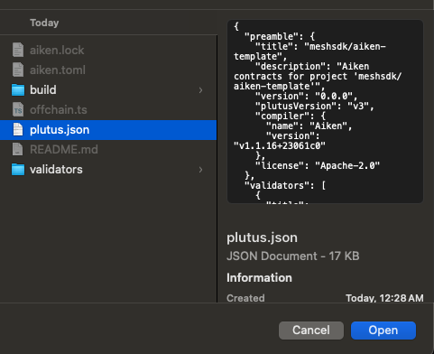

# Bài #06: Giải thích Blueprint

Plutus blueprint là cầu nối giữa mã on-chain và off-chain. Bài học này đề cập cách giải thích blueprint được tạo bởi Aiken và chuyển đổi nó thành mã offchain TypeScript để tương tác với hợp đồng thông minh của bạn.

> Mã nguồn: [GitHub](https://github.com/cardanobuilders/cardanobuilders.github.io/tree/main/codes/course-cardano/06-interpreting-blueprint)

## Blueprint là gì?


Blueprint là một tệp JSON chuẩn hóa được định nghĩa bởi [CIP-57](https://cips.cardano.org/cip/CIP-57). Đây là đầu ra chính của quá trình biên dịch hợp đồng thông minh Cardano và chứa mọi thứ cần thiết để tương tác với hợp đồng. Mỗi blueprint bao gồm:

- **`preamble`**: Thông tin meta về hợp đồng.
- **`validators`**: Các validator được đặt tên với định nghĩa kiểu và mã đã biên dịch.
- **`definitions`**: Bộ đăng ký các định nghĩa có thể tái sử dụng trong toàn bộ đặc tả.

### Tạo Blueprint

Tạo blueprint với Aiken:

1. Biên dịch hợp đồng của bạn:

```sh
aiken build
```

2. Tìm blueprint trong tệp `plutus.json` tại thư mục gốc của dự án.

## Hiểu về Blueprint

### `preamble`

`preamble` chứa metadata của hợp đồng: tên, mô tả, phiên bản, và phiên bản Plutus. Phiên bản Plutus rất quan trọng cho việc chuẩn bị mã offchain.

Ví dụ:

```json
{
  "preamble": {
    "title": "meshsdk/aiken-template",
    "description": "Aiken contracts for project 'meshsdk/aiken-template'",
    "version": "0.0.0",
    "plutusVersion": "v3", // Key information for offchain code
    "compiler": {
      "name": "Aiken",
      "version": "v1.1.16+23061c0"
    },
    "license": "Apache-2.0"
  }
}
```

### `validators`

Phần `validators` chứa thông tin kiểu cho `datum`, `redeemer`, và `parameters`, cùng với mã validator đã biên dịch. Các kiểu có thể tham chiếu đến các định nghĩa tái sử dụng từ phần `definitions`.

Ví dụ:

```json
{
  "title": "spend.spending_logics_delegated.spend",
  "datum": {
    "title": "_datum_opt",
    "schema": {
      "$ref": "#/definitions/Data"
    }
  },
  "redeemer": {
    "title": "_redeemer",
    "schema": {
      "$ref": "#/definitions/Data"
    }
  },
  "parameters": [
    {
      "title": "delegated_withdrawal_script_hash",
      "schema": {
        "$ref": "#/definitions/aiken~1crypto~1ScriptHash"
      }
    }
  ],
  "compiledCode": "58ac010100229800aba2aba1aba0aab9faab9eaab9dab9a9bae0024888888896600264646644b30013370e900118039baa001899914c004c03400a601a601c0052259800800c528456600266ebc00cc02cc03c00629462660040046020002805100d2444660020026eacc040c044c044c044c044c044c044c034dd518080048c020dd500099ba548008cc028dd4802a5eb822c8030c024004c024c028004c024004c010dd5004c52689b2b200401",
  "hash": "9c9666ddc12fc42f0151cd029c150c7d410ede9fe3885c248c8c26a0"
}
```

Lưu ý rằng `spend.spending_logics_delegated.else` biên dịch cùng hash với `spend.spending_logics_delegated.spend`. Cả hai mục đích chia sẻ cùng một script đã biên dịch. Validator đa mục đích biên dịch thành một hash duy nhất, điều mà một số kiến trúc có thể tận dụng.

```json
{
  "title": "spend.spending_logics_delegated.else",
  "redeemer": {
    "schema": {}
  },
  "parameters": [
    {
      "title": "delegated_withdrawal_script_hash",
      "schema": {
        "$ref": "#/definitions/aiken~1crypto~1ScriptHash"
      }
    }
  ],
  "compiledCode": "58ac010100229800aba2aba1aba0aab9faab9eaab9dab9a9bae0024888888896600264646644b30013370e900118039baa001899914c004c03400a601a601c0052259800800c528456600266ebc00cc02cc03c00629462660040046020002805100d2444660020026eacc040c044c044c044c044c044c044c034dd518080048c020dd500099ba548008cc028dd4802a5eb822c8030c024004c024c028004c024004c010dd5004c52689b2b200401",
  "hash": "9c9666ddc12fc42f0151cd029c150c7d410ede9fe3885c248c8c26a0"
}
```

### `definitions`

Phần `definitions` chứa các schema kiểu tái sử dụng được tham chiếu bởi phần `validators`.

Ví dụ:

```json
{
  "definitions": {
    "Data": {
      "title": "Data",
      "description": "Any Plutus data."
    },
    "aiken/crypto/ScriptHash": {
      "title": "ScriptHash",
      "dataType": "bytes"
    },
    "cardano/assets/PolicyId": {
      "title": "PolicyId",
      "dataType": "bytes"
    },
    "withdraw/MyRedeemer": {
      "title": "MyRedeemer",
      "anyOf": [
        {
          "title": "ContinueCounting",
          "dataType": "constructor",
          "index": 0,
          "fields": []
        },
        {
          "title": "StopCounting",
          "dataType": "constructor",
          "index": 1,
          "fields": []
        }
      ]
    }
  }
}
```

## Tự động hóa tạo mã Offchain

Chuyển đổi thủ công blueprint thành mã offchain rất tốn thời gian. Tiện ích mở rộng [`Cardano Bar VSCode Extension`](https://marketplace.visualstudio.com/items/?itemName=sidan-lab.cardano-bar-vscode) tự động hóa quy trình này. Tạo mã offchain từ blueprint của bạn trong ba bước:

1. Tạo một tệp TypeScript mới, ví dụ: `offchain.ts`.
2. Mở bảng lệnh trong VSCode (Ctrl+Shift+P hoặc Cmd+Shift+P).
3. Nhập `Parse blueprint to Typescript - Mesh` và chọn nó.


4. Chọn tệp `plutus.json` chứa blueprint.


Tệp `offchain.ts` được tạo ra bao gồm tất cả các hàm cần thiết để tương tác với mã on-chain: spending, minting, và truy vấn hợp đồng. Xem [tài liệu Mesh SDK](https://meshjs.dev/apis/utilities/blueprints) để biết chi tiết.

## Kết luận

Giải thích Plutus blueprint là bước thiết yếu để kết nối validator on-chain với ứng dụng off-chain. Các công cụ như lớp `Blueprint` của Mesh và tiện ích mở rộng Cardano Bar tự động hóa phần lớn công việc chuyển đổi, cho phép bạn tập trung vào việc xây dựng ứng dụng.

## Hướng Dẫn Mã Nguồn

Phần này hướng dẫn chi tiết các file trong dự án, tập trung vào cách Plutus blueprint (`plutus.json`) kết nối mã on-chain Aiken với ứng dụng off-chain TypeScript.

### Cấu trúc dự án

```
06-interpreting-blueprint/
├── validators/
│   ├── withdraw.ak    # Withdrawal validator (các kiểu OracleDatum, MyRedeemer)
│   ├── spend.ak       # Spending validator ủy quyền cho withdrawal
│   └── mint.ak        # Minting validator ủy quyền cho withdrawal
├── aiken.toml         # Manifest dự án (giống package.json)
├── aiken.lock         # Lockfile dependency (giống bun.lockb)
└── plutus.json        # Blueprint CIP-57 -- FILE QUAN TRỌNG cho bài học này
```

Ba validator `.ak` tuân theo cùng mẫu ủy quyền từ Bài 5. Điều mới ở đây là hiểu `plutus.json` -- sản phẩm đã biên dịch giúp tích hợp off-chain trở nên khả thi.

### Pipeline biên dịch


Đây là đường đi đầy đủ từ mã nguồn hợp đồng thông minh đến ứng dụng đang chạy. Blueprint nằm ở trung tâm -- đó là sản phẩm mà cả blockchain và mã TypeScript của bạn đều hiểu được.

### Mô hình tư duy Web2

Nếu bạn đã làm việc với REST API, blueprint ánh xạ rõ ràng đến các khái niệm bạn đã biết:

| Phần Blueprint | Tương đương Web2 | Chức năng |
|---|---|---|
| `preamble` | Metadata `package.json` | Tên dự án, phiên bản, thông tin compiler, phiên bản Plutus |
| `validators` | Định nghĩa API endpoint | Mục đích, tham số và bytecode đã biên dịch của mỗi validator |
| `validators[].compiledCode` | Binary đã biên dịch hoặc module WASM | Mã thực thi thực sự được triển khai on-chain |
| `validators[].parameters` | Tham số hàm / route params | Giá trị phải được cung cấp trước khi validator có thể chạy |
| `definitions` | JSON Schema / định nghĩa kiểu TypeScript | Schema kiểu tái sử dụng được tham chiếu bởi các validator |
| Toàn bộ `plutus.json` | Đặc tả OpenAPI (Swagger) | Nguồn thông tin duy nhất mô tả giao diện hợp đồng của bạn |

Giống như đặc tả OpenAPI cho phép bạn tự động tạo API client, Plutus blueprint cho phép các công cụ như Mesh SDK tự động tạo mã TypeScript để tương tác với hợp đồng.

### `plutus.json` -- Chi tiết Blueprint

Đây là file quan trọng nhất trong dự án cho phát triển off-chain. Khi bạn chạy `aiken build`, compiler đọc tất cả file `.ak` và tạo ra file JSON duy nhất này chứa:

**Preamble** -- Metadata về dự án của bạn. Trường `plutusVersion` (ví dụ: `"v3"`) rất quan trọng vì nó cho thư viện off-chain biết phiên bản ngôn ngữ Plutus nào cần nhắm đến khi xây dựng giao dịch.

**Validators** -- Mỗi mục validator bao gồm `title` mã hóa tên file, tên module và mục đích (ví dụ: `"spend.spending_logics_delegated.spend"`). Nó cũng bao gồm `compiledCode` (CBOR mã hóa hex của script Plutus) và `hash` (mã định danh địa chỉ on-chain của script). Lưu ý rằng validator đa mục đích như `spend.spending_logics_delegated.spend` và `spend.spending_logics_delegated.else` chia sẻ cùng mã biên dịch và hash.

**Definitions** -- Bộ đăng ký các kiểu tái sử dụng. Khi datum hoặc redeemer của validator tham chiếu `"$ref": "#/definitions/withdraw/MyRedeemer"`, schema kiểu thực tế nằm ở đây. Điều này giống hệt cách JSON Schema sử dụng `$ref` để tránh trùng lặp định nghĩa kiểu.

### Các file Validator

Ba file `.ak` định nghĩa logic on-chain được biên dịch thành blueprint:

**`withdraw.ak`** định nghĩa các kiểu cốt lõi (`OracleDatum`, `MyRedeemer` với các biến thể `ContinueCounting` và `StopCounting`) và logic xác thực chung. Các kiểu này xuất hiện trong phần `definitions` của blueprint.

**`spend.ak`** và **`mint.ak`** ủy quyền cho withdrawal script, như đã đề cập trong Bài 5. Mã biên dịch của chúng xuất hiện dưới dạng các mục validator riêng biệt trong blueprint, mỗi cái có hash riêng cho việc định địa chỉ on-chain.

### Từ Blueprint đến TypeScript

Tiện ích mở rộng Cardano Bar VSCode (được mô tả trong phần trên) đọc `plutus.json` và tạo các hàm TypeScript khớp với mỗi validator. Mã được tạo ra sử dụng lớp `Blueprint` của Mesh SDK để giải tuần tự hóa mã đã biên dịch, áp dụng tham số và xây dựng giao dịch. Đây là cùng luồng công việc như tạo API client từ đặc tả OpenAPI -- blueprint là hợp đồng, và mã được tạo ra là client.

## Mã nguồn

Mã nguồn cho bài học này có sẵn trên [GitHub](https://github.com/cardanobuilders/cardanobuilders.github.io/tree/main/codes/course-cardano/06-interpreting-blueprint).
