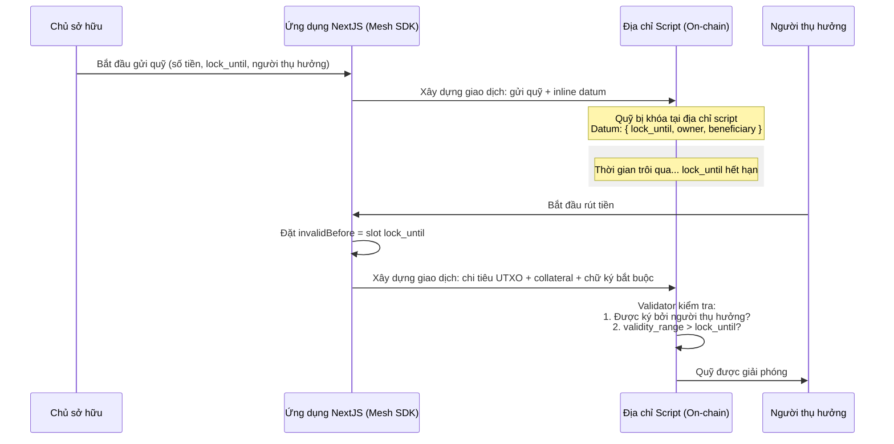

# Bài #07: Hợp đồng Vesting

Hợp đồng vesting khóa quỹ trong một khoảng thời gian xác định và chỉ cho phép người thụ hưởng được chỉ định rút tiền sau khi thời gian khóa kết thúc. Bài học này đề cập việc triển khai và tương tác với hợp đồng vesting trên Cardano sử dụng Aiken và Mesh SDK.

> Mã nguồn: [GitHub](https://github.com/cardanobuilders/cardanobuilders.github.io/tree/main/codes/course-cardano/07-vesting)

## Tổng quan

### Hợp đồng Vesting là gì?
Hợp đồng vesting khóa quỹ và chỉ giải phóng cho người thụ hưởng sau một khoảng thời gian xác định. Nó cung cấp tính bảo mật và kiểm soát trong việc phân phối quỹ.


### Tính năng chính:
- **Thời gian khóa**: Quỹ bị khóa cho đến một dấu thời gian cụ thể.
- **Chủ sở hữu và Người thụ hưởng**: Chủ sở hữu gửi quỹ, và người thụ hưởng rút tiền sau khi thời gian khóa kết thúc.

## Chi tiết hợp đồng thông minh

### Định nghĩa Datum
Datum cấu hình hợp đồng vesting với ba tham số:

- **`lock_until`**: Dấu thời gian POSIX cho đến khi quỹ bị khóa
- **`owner`**: Thông tin xác thực của chủ sở hữu quỹ
- **`beneficiary`**: Thông tin xác thực của người thụ hưởng

```
pub type VestingDatum {
  /// POSIX time in milliseconds, e.g. 1672843961000
  lock_until: Int,
  /// Owner's credentials
  owner: ByteArray,
  /// Beneficiary's credentials
  beneficiary: ByteArray,
}
```

Datum này có thể được tìm thấy trong `aiken-vesting/aiken-workspace/lib/vesting/types.ak`.

Tiếp theo, chúng ta định nghĩa spend validator.

```
validator vesting {
  spend(
    datum_opt: Option<VestingDatum>,
    _redeemer: Data,
    _input: OutputReference,
    tx: Transaction,
  ) {
    // In principle, scripts can be used for different purpose (e.g. minting
    // assets). Here we make sure it's only used when 'spending' from a eUTxO
    expect Some(datum) = datum_opt
    or {
      key_signed(tx.extra_signatories, datum.owner),
      and {
        key_signed(tx.extra_signatories, datum.beneficiary),
        valid_after(tx.validity_range, datum.lock_until),
      },
    }
  }

  else(_) {
    fail
  }
}
```

Validator `vesting` cho phép rút tiền trong hai điều kiện:

1. Giao dịch được ký bởi **chủ sở hữu** (có thể rút bất cứ lúc nào), HOẶC
2. Giao dịch được ký bởi **người thụ hưởng** VÀ thời gian hiện tại đã qua thời gian khóa


### Cách hoạt động

Chủ sở hữu gửi quỹ vào hợp đồng vesting, khóa chúng cho đến khi thời gian khóa hết hạn.

Giao dịch Cardano bao gồm khoảng thời gian hợp lệ xác định khi nào giao dịch có hiệu lực. Sổ cái xác minh các giới hạn này trước khi thực thi bất kỳ script nào. Điều này cung cấp cho script cảm nhận về thời gian trong khi vẫn duy trì tính xác định: nếu giao dịch có giới hạn dưới `A`, thời gian hiện tại ít nhất là `A`.

Vì giới hạn trên không được kiểm soát, giao dịch có thể thực thi rất lâu sau thời gian vesting. Từ góc nhìn của script, điều này chấp nhận được; hợp đồng chỉ áp dụng thời gian chờ tối thiểu.

### Kiểm thử

Một script kiểm thử toàn diện được cung cấp sẵn. Chạy kiểm thử với `aiken check`.

Script kiểm thử bao gồm các trường hợp sau:

- Mở khóa thành công
- Mở khóa thành công chỉ với chữ ký của chủ sở hữu
- Mở khóa thành công với chữ ký của người thụ hưởng và thời gian đã qua
- Mở khóa thất bại chỉ với chữ ký của người thụ hưởng
- Mở khóa thất bại chỉ với thời gian đã qua

Xem toàn bộ mã nguồn kiểm thử trong [`vesting.ak`](https://github.com/cardanobuilders/cardanobuilders.github.io/blob/main/codes/course-cardano/07-vesting/src/aiken-workspace/validators/vesting.ak).

### Biên dịch và xây dựng script

Để biên dịch script, chạy lệnh sau:

```sh
aiken build
```

Lệnh này sẽ tạo ra CIP-0057 Plutus blueprint, bạn có thể tìm thấy trong [`plutus.json`](https://github.com/cardanobuilders/cardanobuilders.github.io/blob/main/codes/course-cardano/07-vesting/src/aiken-workspace/plutus.json).

## Gửi quỹ

Chủ sở hữu gửi quỹ vào hợp đồng vesting và chỉ định thời gian khóa.

```ts
const assets: Asset[] = [
  {
    unit: "lovelace",
    quantity: "10000000",
  },
];

const lockUntilTimeStamp = new Date();
lockUntilTimeStamp.setMinutes(lockUntilTimeStamp.getMinutes() + 1);
```

Đoạn mã này gửi 10 ADA vào hợp đồng vesting với thời gian khóa 1 phút.

```ts
// app wallet
const wallet = new MeshWallet({
  networkId: 0,
  key: {
    type: "mnemonic",
    words: appWallet,
  },
  fetcher: provider,
  submitter: provider,
});

const utxos = await wallet.getUtxos();
const changeAddress = await wallet.getChangeAddress();

const { pubKeyHash: ownerPubKeyHash } = deserializeAddress(changeAddress);
const { pubKeyHash: beneficiaryPubKeyHash } =
  deserializeAddress(beneficiaryAddress);
```

Hướng dẫn này sử dụng một ví ứng dụng riêng biệt để cấp quỹ cho khoản gửi. Cả hash khóa công khai của chủ sở hữu và người thụ hưởng đều được trích xuất bằng `deserializeAddress`.

```ts
const txBuilder = new MeshTxBuilder({
  fetcher: provider,
  verbose: true,
});

const unsignedTx = await txBuilder
  .txOut(script.address, amount)
  .txOutInlineDatumValue(
    mConStr0([lockUntilTimeStampMs, ownerPubKeyHash, beneficiaryPubKeyHash])
  )
  .changeAddress(changeAddress)
  .selectUtxosFrom(utxos)
  .complete();
```

Giao dịch gửi quỹ đến địa chỉ script của hợp đồng vesting với inline datum chứa thời gian khóa, chủ sở hữu, và người thụ hưởng.

Ký và gửi:

```ts
const signedTx = await wallet.signTx(unsignedTx);
const txHash = await wallet.submitTx(signedTx);
```

Lưu lại hash giao dịch được trả về; bạn sẽ cần nó để rút quỹ.

Ví dụ về [giao dịch gửi quỹ thành công](https://preprod.cardanoscan.io/transaction/556f2bfcd447e146509996343178c046b1b9ad4ac091a7a32f85ae206345e925).

## Rút quỹ

Sau khi thời gian khóa hết hạn, người thụ hưởng (hoặc chủ sở hữu) có thể rút quỹ.

Đầu tiên, lấy các UTXO chứa quỹ bị khóa:

```ts
const txHashFromDesposit =
  "556f2bfcd447e146509996343178c046b1b9ad4ac091a7a32f85ae206345e925";
const utxos = await provider.fetchUTxOs(txHash);
const vestingUtxo = utxos[0];
```

Đoạn mã này lấy UTXO từ giao dịch gửi quỹ. Tiếp theo, chuẩn bị datum và tính toán số slot cho khoảng thời gian hợp lệ của giao dịch:

```ts
const datum = deserializeDatum<VestingDatum>(vestingUtxo.output.plutusData!);

const invalidBefore =
  unixTimeToEnclosingSlot(
    Math.min(datum.fields[0].int as number, Date.now() - 15000),
    SLOT_CONFIG_NETWORK.preprod
  ) + 1;
```

Thời gian khóa từ datum xác định slot `invalidBefore`, đảm bảo giao dịch chỉ hợp lệ sau khi thời gian khóa hết hạn.

Xây dựng giao dịch rút tiền:

```ts
const txBuilder = new MeshTxBuilder({
  fetcher: provider,
  verbose: true,
});

const unsignedTx = await txBuilder
  .spendingPlutusScript("V3")
  .txIn(
    vestingUtxo.input.txHash,
    vestingUtxo.input.outputIndex,
    vestingUtxo.output.amount,
    script.address
  )
  .spendingReferenceTxInInlineDatumPresent()
  .spendingReferenceTxInRedeemerValue("")
  .txInScript(script.cbor)
  .txOut(walletAddress, [])
  .txInCollateral(
    collateralInput.txHash,
    collateralInput.outputIndex,
    collateralOutput.amount,
    collateralOutput.address
  )
  .invalidBefore(invalidBefore)
  .requiredSignerHash(pubKeyHash)
  .changeAddress(walletAddress)
  .selectUtxosFrom(inputUtxos)
  .complete();
```

Giao dịch chi tiêu UTXO đã khóa từ hợp đồng vesting, chỉ định script, datum, redeemer, tài sản thế chấp, khoảng thời gian hợp lệ, và chữ ký bắt buộc.

Ký và gửi:

Ví dụ về [giao dịch rút tiền thành công](https://preprod.cardanoscan.io/transaction/13d6b2258680bbdf08f50a3bbc03e7ed674f5614844ce773fc191c9582282b04).

## Hướng Dẫn Mã Nguồn

Phần này phân tích cấu trúc dự án và ánh xạ các khái niệm blockchain đến các mẫu web2 quen thuộc để giúp bạn hiểu cách hợp đồng vesting hoạt động từ đầu đến cuối.

### Cấu trúc dự án

```
07-vesting/
├── src/                    # Ứng dụng NextJS
│   ├── app/                # Trang App Router và API route
│   ├── components/         # Component React cho giao diện gửi/rút tiền
│   └── lib/                # Tiện ích chung và helper hợp đồng
├── aiken-workspace/        # Mã hợp đồng thông minh on-chain
│   ├── lib/
│   │   └── vesting/
│   │       └── types.ak    # Định nghĩa kiểu VestingDatum
│   ├── validators/
│   │   └── vesting.ak      # Spend validator + các test
│   └── plutus.json         # Blueprint Plutus đã biên dịch (CIP-0057)
├── eslint.config.mjs
├── next.config.ts
├── package.json            # Dependency: NextJS + @meshsdk/core
├── postcss.config.mjs
└── tsconfig.json
```

Dự án có hai nửa rõ ràng. Thư mục `aiken-workspace/` chứa validator on-chain được viết bằng Aiken -- đây là hợp đồng thông minh mà sổ cái Cardano thực thi khi ai đó cố gắng chi tiêu quỹ đã khóa. Thư mục `src/` là ứng dụng NextJS chuẩn xây dựng và gửi các giao dịch gửi và rút tiền bằng Mesh SDK. Hãy nghĩ mã Aiken như logic nghiệp vụ backend chạy trên blockchain, và ứng dụng NextJS là frontend client gọi đến nó.

### Vòng đời Vesting



### So sánh với Web2

Nếu bạn đã xây dựng tính năng escrow hoặc giải phóng theo lịch trong ứng dụng web, bạn đã hiểu ý tưởng cốt lõi. Đây là cách mỗi khái niệm Cardano ánh xạ:

| Khái niệm Cardano | Tương đương Web2 | Chức năng |
|---|---|---|
| **Hợp đồng vesting** | Dịch vụ escrow (ví dụ: Stripe Connect thanh toán trì hoãn) | Giữ quỹ và giải phóng khi đáp ứng điều kiện |
| **Datum** (`VestingDatum`) | Điều khoản escrow lưu trong bản ghi cơ sở dữ liệu | Ghi thời gian khóa, chủ sở hữu và người thụ hưởng on-chain |
| **`lock_until`** | Ngày giải phóng theo lịch / thời điểm kích hoạt cron job | Dấu thời gian POSIX khi quỹ trở nên khả rút |
| **`validity_range`** | Xác thực dấu thời gian request (ví dụ: claim `nbf` của JWT) | Sổ cái đảm bảo giao dịch chỉ hợp lệ trong khoảng thời gian này, cung cấp cho script cảm nhận đáng tin cậy về "hiện tại" |
| **Collateral** | Tiền đặt cọc an ninh cho lệnh gọi API thất bại (giống khoản giữ) | UTXO nhỏ cam kết để trang trải chi phí nếu script thực thi thất bại -- bạn nhận lại khi thành công |
| **Địa chỉ script** | Tài khoản escrow / tài khoản giữ hộ | Địa chỉ blockchain được kiểm soát bởi mã thay vì khóa riêng |

Điểm khác biệt chính so với web2: không có server quyết định có giải phóng quỹ hay không. Logic validator chạy một cách xác định trên mọi node Cardano, và cơ chế `validity_range` cho phép chính sổ cái áp dụng ràng buộc thời gian mà không cần dựa vào đồng hồ bên trong script.

## Mã nguồn

Mã nguồn cho bài học này có sẵn trên [GitHub](https://github.com/cardanobuilders/cardanobuilders.github.io/tree/main/codes/course-cardano/07-vesting).

## Thử thách

Sửa đổi hợp đồng vesting để triển khai lịch trình vesting dần dần, trong đó quỹ được giải phóng theo thời gian thay vì tất cả cùng một lúc. Hoặc thêm giai đoạn cliff, nơi người thụ hưởng phải chờ trước khi bất kỳ token nào trở nên khả dụng.
