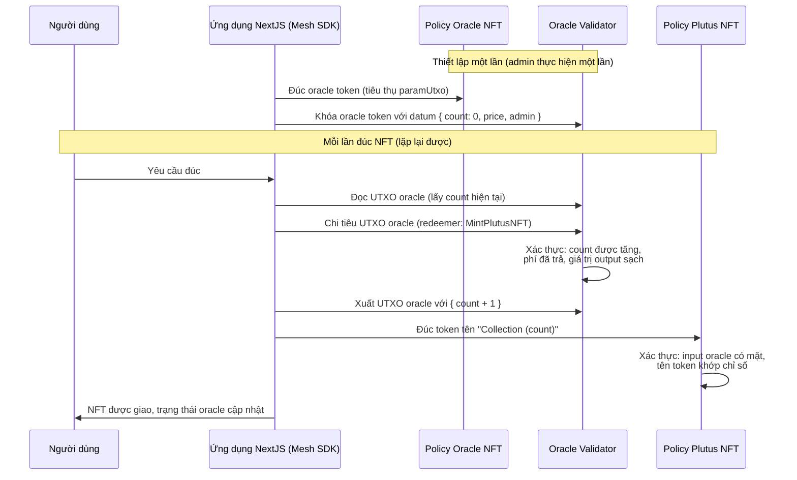

# Bài #08: Hợp đồng Plutus NFT

Bài học này được xây dựng dựa trên hợp đồng vesting với kiến trúc đa validator phức tạp hơn. Bạn sẽ tạo một hợp đồng Plutus NFT trong đó nhiều validator tương tác với nhau để đảm bảo tính không thể thay thế, tính duy nhất và chỉ số token tự động tăng.

## Tổng quan

Hợp đồng này đúc NFT với chỉ số tự động tăng, đảm bảo tính không thể thay thế và duy nhất dưới một policy duy nhất. Kiến trúc sử dụng ba thành phần:

1. Thiết lập một minting policy sử dụng một lần để tạo oracle token.
2. Sử dụng oracle token để duy trì trạng thái và chỉ số của các NFT.
3. Tăng chỉ số token với mỗi NFT mới được đúc.


## Bước 1: Oracle NFT

Oracle NFT đóng vai trò là nguồn thông tin duy nhất đáng tin cậy, sử dụng state thread token để đảm bảo tính nhất quán. Minting policy sử dụng một lần đảm bảo chỉ tồn tại một oracle NFT duy nhất.

### Giải thích mã nguồn

Đoạn mã sau định nghĩa minting policy cho oracle NFT:

```rs
pub type MintPolarity {
  RMint
  RBurn
}

validator oracle_nft(utxo_ref: OutputReference) {
  mint(redeemer: MintPolarity, policy_id: PolicyId, tx: Transaction) {
    when redeemer is {
      RMint -> {
        let Transaction { inputs, .. } = tx
        let hash_equal =
          fn(input: Input) {
            let hash = input.output_reference
            utxo_ref == hash
          }
        let target_input_exist = list.find(inputs, hash_equal)
        when target_input_exist is {
          Some(_) -> True
          None -> False
        }
      }
      RBurn -> check_policy_only_burn(tx.mint, policy_id)
    }
  }

  else(_) {
    fail
  }
}
```

**Điểm chính:**
- `RMint` đảm bảo token chỉ được đúc một lần duy nhất.
- `RBurn` cho phép đốt token nhưng ngăn chặn việc đúc lại.

## Bước 2: Oracle Validator

Oracle validator duy trì chỉ số NFT hiện tại dưới dạng trạng thái on-chain. Nó định nghĩa các kiểu datum và redeemer cho các chuyển đổi trạng thái.

### Định nghĩa Datum

```rs
pub type OracleDatum {
  count: Int,
  lovelace_price: Int,
  fee_address: Address,
}
```

### Các kiểu Redeemer

```rs
pub type OracleRedeemer {
  MintPlutusNFT
  StopOracle
}
```

### Logic của Validator

Validator đảm bảo các chuyển đổi trạng thái hợp lệ:

```rs
validator oracle {
  spend(
    datum_opt: Option<OracleDatum>,
    redeemer: OracleRedeemer,
    input: OutputReference,
    tx: Transaction,
  ) {
    let Transaction { mint, inputs, outputs, extra_signatories, .. } = tx
    expect Some(OracleDatum { count, lovelace_price, fee_address }) = datum_opt
    expect Some(own_input) = find_input(inputs, input)
    expect [(oracle_nft_policy, _, _)] =
      list.filter(flatten(own_input.output.value), fn(x) { x.1st != "" })

    todo
  }

  else(_) {
    fail
  }
}
```

Hàm `find_input` tìm input của chính validator bằng output reference. Oracle NFT policy phải có mặt trong giá trị của input.

Đối với các thay đổi trạng thái, có đúng một input từ và một output đến địa chỉ oracle. Khớp mẫu trên cấu trúc này:

```rs
    let own_address = own_input.output.address
    when
      (
        redeemer,
        inputs_at_with_policy(inputs, own_address, oracle_nft_policy),
        outputs_at_with_policy(outputs, own_address, oracle_nft_policy),
      )
    is {
      (MintPlutusNFT, [_], [only_output]) -> {
        todo
      }
      _ -> False
    }

```

Thêm các kiểm tra cốt lõi cho `MintPlutusNFT`:

```rs
        let is_output_value_clean = list.length(flatten(only_output.value)) == 2
        let is_count_updated =
          only_output.datum == InlineDatum(
            OracleDatum { count: count + 1, lovelace_price, fee_address },
          )
        let is_fee_paid =
          get_all_value_to(outputs, fee_address)
            |> value_geq(from_lovelace(lovelace_price))
        is_output_value_clean? && is_count_updated? && is_fee_paid?
```

Kiểm tra `is_output_value_clean` đảm bảo UTXO trạng thái chỉ chứa state thread token và ADA. Điều này ngăn chặn lỗ hổng `Unbounded Value`, trong đó kẻ tấn công đính kèm nhiều tài sản vào output, khiến nó không thể chi tiêu được do vượt quá kích thước giao dịch.

Hoàn thiện với logic `StopOracle`:

```rs
      (StopOracle, [_], _) -> {
        let is_oracle_nft_burnt =
          only_minted_token(mint, oracle_nft_policy, "", -1)
        let owner_key = address_payment_key(fee_address)
        let is_owner_signed = key_signed(extra_signatories, owner_key)
        is_oracle_nft_burnt? && is_owner_signed?
      }
```

Oracle validator hoàn chỉnh trông như sau:

```rs
validator oracle {
  spend(
    datum_opt: Option<OracleDatum>,
    redeemer: OracleRedeemer,
    input: OutputReference,
    tx: Transaction,
  ) {
    let Transaction { mint, inputs, outputs, extra_signatories, .. } = tx
    expect Some(OracleDatum { count, lovelace_price, fee_address }) = datum_opt
    expect Some(own_input) = find_input(inputs, input)
    expect [(oracle_nft_policy, _, _)] =
      list.filter(flatten(own_input.output.value), fn(x) { x.1st != "" })
    let own_address = own_input.output.address
    when
      (
        redeemer,
        inputs_at_with_policy(inputs, own_address, oracle_nft_policy),
        outputs_at_with_policy(outputs, own_address, oracle_nft_policy),
      )
    is {
      (MintPlutusNFT, [_], [only_output]) -> {
        let is_output_value_clean = list.length(flatten(only_output.value)) == 2
        let is_count_updated =
          only_output.datum == InlineDatum(
            OracleDatum { count: count + 1, lovelace_price, fee_address },
          )
        let is_fee_paid =
          get_all_value_to(outputs, fee_address)
            |> value_geq(from_lovelace(lovelace_price))
        is_output_value_clean? && is_count_updated? && is_fee_paid?
      }
      (StopOracle, [_], _) -> {
        let is_oracle_nft_burnt =
          only_minted_token(mint, oracle_nft_policy, "", -1)
        let owner_key = address_payment_key(fee_address)
        let is_owner_signed = key_signed(extra_signatories, owner_key)
        is_oracle_nft_burnt? && is_owner_signed?
      }
      _ -> False
    }
  }

  else(_) {
    fail
  }
}
```

**Điểm chính:**
- `MintPlutusNFT` tăng chỉ số NFT và đảm bảo phí được thanh toán.
- `StopOracle` đốt oracle NFT và yêu cầu ủy quyền từ chủ sở hữu.

## Bước 3: Plutus NFT Minting Validator

Plutus NFT minting validator đảm bảo tính duy nhất và không thể thay thế bằng cách đọc chỉ số hiện tại của oracle.

### Giải thích mã nguồn

```rs
pub type MintPolarity {
  RMint
  RBurn
}

validator plutus_nft(collection_name: ByteArray, oracle_nft: PolicyId) {
  mint(redeemer: MintPolarity, policy_id: PolicyId, tx: Transaction) {
    when redeemer is {
      RMint -> {
        let Transaction { inputs, mint, .. } = tx
        expect [auth_input] = inputs_with_policy(inputs, oracle_nft)
        expect InlineDatum(input_datum) = auth_input.output.datum
        expect OracleDatum { count, .. }: OracleDatum = input_datum
        let asset_name =
          collection_name
            |> concat(" (")
            |> concat(convert_int_to_bytes(count))
            |> concat(")")
        only_minted_token(mint, policy_id, asset_name, 1)
      }

      RBurn -> check_policy_only_burn(tx.mint, policy_id)
    }
  }

  else(_) {
    fail
  }
}
```

**Điểm chính:**
- Đảm bảo tên NFT bao gồm chỉ số được tăng lên.
- Xác thực quy trình đúc và đốt.

Mã nguồn đầy đủ và các bài test có sẵn trong [kho lưu trữ Mesh](https://github.com/MeshJS/mesh/tree/main/packages/mesh-contract/src/plutus-nft/aiken-workspace).

### Biên dịch và xây dựng script

1. Biên dịch script bằng lệnh:

```sh
aiken build
```

Lệnh này sẽ tạo ra Plutus blueprint theo chuẩn CIP-0057, bạn có thể tìm thấy trong [`plutus.json`](https://github.com/cardanobuilders/cardanobuilders.github.io/blob/main/codes/course-cardano/07-vesting/src/aiken-workspace/plutus.json).

## Thiết lập Oracle

Thiết lập oracle yêu cầu đúc oracle NFT và khóa nó trong oracle validator. Đây là thao tác chỉ thực hiện một lần.

Chuẩn bị ví, trình xây dựng giao dịch và thông tin tĩnh:


```ts
const compiledCode = <the compile code from blueprint>;

const utxos = await wallet?.getUtxos();
const collateral = (await wallet.getCollateral())[0]!;
const walletAddress = await wallet.getChangeAddress()

const paramUtxo = utxos[0]!;
const param: Data = mOutputReference(
  paramUtxo.input.txHash,
  paramUtxo.input.outputIndex,
);
const paramScript = applyParamsToScript(compiledCode, [param]);
const policyId = resolveScriptHash(paramScript, "V3");
const tokenName = "";
const { pubKeyHash, stakeCredentialHash } =
  deserializeAddress(walletAddress);
```

Thực hiện giao dịch thiết lập:


```ts
const txHex = await txBuilder
  .txIn(
    paramUtxo.input.txHash,
    paramUtxo.input.outputIndex,
    paramUtxo.output.amount,
    paramUtxo.output.address,
  )
  .mintPlutusScriptV3()
  .mint("1", policyId, tokenName)
  .mintingScript(paramScript)
  .mintRedeemerValue(mConStr0([]))
  .txOut(oracleAddress, [{ unit: policyId, quantity: "1" }])
  .txOutInlineDatumValue(
    mConStr0([
      0,
      lovelacePrice,
      mPubKeyAddress(pubKeyHash, stakeCredentialHash),
    ]),
  )
  .txInCollateral(
    collateral.input.txHash,
    collateral.input.outputIndex,
    collateral.output.amount,
    collateral.output.address,
  )
  .changeAddress(walletAddress)
  .selectUtxosFrom(utxos)
  .complete();
```

Lưu thông tin `paramUtxo` để sử dụng sau.

## Đúc Plutus NFT

Định nghĩa thông tin tĩnh cần thiết cho việc đúc:

```ts
type OracleDatum = ConStr0<[Integer, Integer, PubKeyAddress]>;

const oracleCompileCode = <the compile code from oracle blueprint>;
const oracleNftCbor = applyParamsToScript(blueprint.validators[2]!.compiledCode, [
  mOutputReference(paramUtxo.txHash, paramUtxo.outputIndex),
])
const oracleNftPolicyId = resolveScriptHash(oracleNftCbor, "V3");

const oracleCbor = applyCborEncoding(<the oracle compile code>)
const oracleAddress = serializePlutusScript(
      {
        code: oracleCbor,
        version: "V3",
      },
      "", // the stake credential, we can supply if we have one
      "preprod",
    ).address

const getAddressUtxosWithToken = async (
    walletAddress: string,
    assetHex: string,
  ) => {
    let utxos = await fetcher.fetchAddressUTxOs(walletAddress);
    return utxos.filter((u) => {
      const assetAmount = u.output.amount.find(
        (a: any) => a.unit === assetHex,
      )?.quantity;
      return Number(assetAmount) >= 1;
    });
  };
```

Thêm hàm trợ giúp để lấy trạng thái oracle hiện tại:

```ts
const getOracleData = async () => {
  const oracleUtxo = (
    await getAddressUtxosWithToken(oracleAddress, oracleNftPolicyId)
  )[0]!;
  const oracleDatum: OracleDatum = parseDatumCbor(
    oracleUtxo!.output.plutusData!,
  );

  const nftIndex = oracleDatum.fields[0].int;
  const lovelacePrice = oracleDatum.fields[1].int;
  const feeCollectorAddressObj = oracleDatum.fields[2];
  const feeCollectorAddress = serializeAddressObj(
    feeCollectorAddressObj,
    "preprod",
  );

  const policyId = resolveScriptHash(oracleNftCbor, "V3");

  return {
    nftIndex,
    policyId,
    lovelacePrice,
    oracleUtxo,
    oracleNftPolicyId,
    feeCollectorAddress,
    feeCollectorAddressObj,
  };
};
```

Xây dựng giao dịch đúc chính:

```ts
const utxos = await wallet?.getUtxos();
const collateral = (await wallet.getCollateral())[0]!;
const walletAddress = await wallet.getChangeAddress()

const collectionName = "MyNFTCollection";
const nftCbor = applyParamsToScript(<the plutus NFT compiled code>, [
  stringToHex(collectionName),
  oracleNftPolicyId,
]);


const {
  nftIndex,
  policyId,
  lovelacePrice,
  oracleUtxo,
  oracleNftPolicyId,
  feeCollectorAddress,
  feeCollectorAddressObj,
} = await getOracleData();

const tokenName = `${collectionName} (${nftIndex})`;
const tokenNameHex = stringToHex(tokenName);

const updatedOracleDatum: OracleDatum = conStr0([
  integer((nftIndex as number) + 1),
  integer(lovelacePrice),
  feeCollectorAddressObj,
]);

const tx = txBuilder
  .spendingPlutusScriptV3()
  .txIn(
    oracleUtxo.input.txHash,
    oracleUtxo.input.outputIndex,
    oracleUtxo.output.amount,
    oracleUtxo.output.address,
    0
  )
  .txInRedeemerValue(mConStr0([]))
  .txInScript(oracleCbor)
  .txInInlineDatumPresent()
  .txOut(oracleAddress, [{ unit: oracleNftPolicyId, quantity: "1" }])
  .txOutInlineDatumValue(updatedOracleDatum, "JSON")
  .mintPlutusScriptV3()
  .mint("1", policyId, tokenNameHex)
  .mintingScript(nftCbor);

const assetMetadata = {
  name: `MyNFTCollection (${nftIndex})`,
  image: "ipfs://QmRzicpReutwCkM6aotuKjErFCUD213DpwPq6ByuzMJaua",
  mediaType: "image/jpg",
  description: "This NFT was minted by Mesh (https://meshjs.dev/).",
};

const metadata = { [policyId]: { [tokenName]: { ...assetMetadata } } };
tx.metadataValue(721, metadata);

tx.mintRedeemerValue(mConStr0([]))
  .txOut(feeCollectorAddress, [
    { unit: "lovelace", quantity: lovelacePrice.toString() },
  ])
  .txInCollateral(
    collateral.input.txHash,
    collateral.input.outputIndex,
    collateral.output.amount,
    collateral.output.address,
  )
  .changeAddress(walletAddress)
  .selectUtxosFrom(utxos);

const txHex = await tx.complete();
```

## Hướng Dẫn Mã Nguồn

Phần này ánh xạ kiến trúc đa validator đến các mẫu web2 và giải thích cách ba validator phối hợp để đúc NFT duy nhất, tự động tăng chỉ số.

### Cấu trúc dự án

```
08-plutus-nft/
├── src/                    # Ứng dụng NextJS
│   ├── app/                # Trang App Router và API route
│   ├── components/         # Component React cho giao diện thiết lập oracle + đúc
│   └── lib/                # Helper hợp đồng, tải blueprint, tiện ích Mesh
├── aiken-workspace/        # Mã hợp đồng thông minh on-chain
│   ├── lib/
│   │   └── plutus-nft/
│   │       └── types.ak    # OracleDatum, MintPolarity, OracleRedeemer
│   ├── validators/
│   │   ├── oracle_nft.ak   # Policy đúc một lần
│   │   ├── oracle.ak       # Validator quản lý trạng thái
│   │   └── plutus_nft.ak   # Validator đúc NFT
│   └── plutus.json         # Blueprint Plutus đã biên dịch (CIP-0057)
├── eslint.config.mjs
├── next.config.ts
├── package.json            # Dependency: NextJS + @meshsdk/core
├── postcss.config.mjs
└── tsconfig.json
```

Dự án tuân theo cùng cấu trúc hai phần như bài vesting: `aiken-workspace/` chứa các validator on-chain và `src/` là frontend NextJS. Điểm khác biệt quan trọng là dự án này có ba validator phối hợp với nhau thay vì một validator độc lập. Ứng dụng NextJS điều phối các giao dịch đa validator chạm đến cả ba trong một thao tác nguyên tử duy nhất.

### Kiến trúc ba Validator

Hệ thống giải quyết một vấn đề cơ bản: làm thế nào bạn đảm bảo NFT duy nhất, đánh số tuần tự khi bất kỳ ai cũng có thể gửi giao dịch đúc bất cứ lúc nào? Câu trả lời là bộ ba validator phối hợp.

**1. Oracle NFT Validator (`oracle_nft.ak`)** -- Policy đúc một lần. Nó đảm bảo chính xác một oracle token tồn tại bằng cách yêu cầu một UTXO cụ thể phải được tiêu thụ trong quá trình đúc. Khi UTXO đó đã chi tiêu, token không bao giờ có thể được đúc lại. Đây là bước khởi tạo.

**2. Oracle Validator (`oracle.ak`)** -- Trình quản lý trạng thái. Nó giữ oracle NFT tại địa chỉ script cùng với datum chứa chỉ số NFT hiện tại (`count`), giá đúc (`lovelace_price`) và địa chỉ admin (`fee_address`). Mỗi khi một NFT được đúc, oracle validator đảm bảo count tăng chính xác 1 và phí được thanh toán.

**3. Plutus NFT Validator (`plutus_nft.ak`)** -- Minting policy cho các NFT thực tế. Nó đọc datum hiện tại của oracle để xác định chỉ số tiếp theo, xây dựng tên token là `TenBoSuuTap (chỉ số)`, và đảm bảo chính xác một token với tên đó được đúc.

### Luồng tương tác đa Validator



Tất cả điều này xảy ra trong một giao dịch nguyên tử duy nhất. Hoặc mọi validator đều đạt và toàn bộ giao dịch thành công, hoặc không có gì thay đổi. Không có trạng thái trung gian nơi oracle đã cập nhật nhưng NFT chưa được đúc.

### So sánh với Web2

Nếu bạn đã xây dựng hệ thống với ID tự động tăng, ràng buộc duy nhất và khóa cấp hàng, bạn đã hiểu các mẫu đang hoạt động ở đây.

| Khái niệm Cardano | Tương đương Web2 | Chức năng |
|---|---|---|
| **Oracle validator** | Bảng cơ sở dữ liệu với khóa chính tự tăng | Duy trì nguồn thông tin duy nhất cho chỉ số khả dụng tiếp theo |
| **Đúc một lần (oracle NFT)** | Ràng buộc `UNIQUE` / hàng singleton trong bảng cấu hình | Đảm bảo chính xác một oracle tồn tại -- không thể trùng lặp |
| **State thread token** | Khóa cấp hàng (`SELECT ... FOR UPDATE`) | Oracle NFT phải có mặt trong cả input và output, đảm bảo chỉ một giao dịch có thể thay đổi trạng thái tại một thời điểm |
| **`OracleDatum`** | Bản ghi cơ sở dữ liệu: `{ id SERIAL, price INT, admin_address TEXT }` | Trạng thái on-chain lưu bộ đếm, giá và admin -- tương đương hàng trong bảng trạng thái |
| **Trường `count`** | Cột tự tăng (`SERIAL` / `AUTO_INCREMENT`) | Theo dõi chỉ số NFT tiếp theo, được tăng nguyên tử với mỗi lần đúc |
| **Kiểm tra `is_output_value_clean`** | Kiểm tra đầu vào / ngăn SQL injection | Ngăn kẻ tấn công nhồi thêm token vào UTXO oracle, làm phình giao dịch và có thể khiến oracle không chi tiêu được -- tương đương blockchain của tấn công từ chối dịch vụ qua đầu vào sai định dạng |
| **Redeemer `StopOracle`** | Endpoint admin `DELETE` với kiểm tra xác thực | Cho phép admin đốt oracle NFT và tắt hệ thống đúc, yêu cầu chữ ký (giống lệnh gọi API đã xác thực) |
| **Giao dịch nguyên tử đơn** | Giao dịch cơ sở dữ liệu với `BEGIN` / `COMMIT` | Cả ba validator thực thi trong một giao dịch -- nếu bất kỳ kiểm tra nào thất bại, mọi thứ đều rollback |

Sự thay đổi khái niệm lớn nhất từ web2: không có server cơ sở dữ liệu trung tâm tuần tự hóa các yêu cầu. Thay vào đó, mô hình UTXO cung cấp kiểm soát đồng thời tự nhiên. Vì UTXO oracle chỉ có thể được tiêu thụ một lần, hai yêu cầu đúc đồng thời sẽ cạnh tranh -- một cái thành công và cái kia phải thử lại với trạng thái đã cập nhật. Điều này tương tự kiểm soát đồng thời lạc quan với cột phiên bản trong cơ sở dữ liệu quan hệ.

## Các hàm đã đóng gói

Hợp đồng Plutus NFT có sẵn dưới dạng triển khai đóng gói trong `@meshsdk/contract`. Xem [tài liệu Mesh](https://meshjs.dev/smart-contracts/plutus-nft) để biết chi tiết cách sử dụng và [kho lưu trữ Mesh](https://github.com/MeshJS/mesh/tree/main/packages/mesh-contract/src/plutus-nft) để xem mã nguồn đầy đủ.