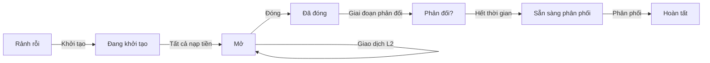

# Bài #09: Luồng Hydra hoàn chỉnh từ đầu đến cuối

Hydra là giải pháp mở rộng Layer 2 cho Cardano, cho phép các giao dịch gần như tức thì và chi phí thấp giữa các bên tham gia. Nó hoạt động như một kênh trạng thái: một sổ cái tạm thời ngoài chuỗi, nơi nhiều bên có thể giao dịch hàng nghìn lần mỗi giây trong khi vẫn duy trì các đảm bảo bảo mật của chuỗi chính Cardano (Layer 1).

Trong bài học này, bạn sẽ:
- Thiết lập và kết nối đến các node Hydra
- Mở một Hydra Head giữa hai người tham gia
- Nạp tiền từ Layer 1 vào Head
- Xây dựng và gửi các giao dịch Layer 2 tức thì bằng MeshJS
- Đóng Head và thanh toán trạng thái cuối cùng trở lại Layer 1

> Mã nguồn: [GitHub](https://github.com/cardanobuilders/cardanobuilders.github.io/tree/main/codes/course-cardano/09-hydra)

## Tổng quan

### Cách Hydra hoạt động

Hydra Head là một kênh trạng thái với vòng đời được xác định:

1. **Khởi tạo**: Các bên tham gia đồng ý mở một Head trên Layer 1
2. **Nạp tiền**: Mỗi bên tham gia khóa tiền từ Layer 1 vào Head
3. **Giao dịch**: Xử lý không giới hạn giao dịch tức thì ngoài chuỗi
4. **Đóng**: Gửi trạng thái cuối cùng đã được thống nhất trở lại Layer 1
5. **Phân phối**: Phân phối tiền trên Layer 1 theo trạng thái cuối cùng

Bên trong Head, các giao dịch sử dụng cùng định dạng như Cardano Layer 1. Phí bằng không, xác nhận tức thì (chỉ giới hạn bởi độ trễ mạng giữa các bên tham gia), và tất cả các bên phải đồng ý về mọi chuyển đổi trạng thái.


### Khi nào nên sử dụng Hydra

Hydra phù hợp cho:
- **Giao dịch tần suất cao**: Trò chơi, thanh toán vi mô, ứng dụng thời gian thực
- **Ứng dụng nhạy cảm về chi phí**: Gộp nhiều giao dịch ngoài chuỗi, chỉ trả phí L1 khi mở và đóng
- **Giao dịch riêng tư**: Giữ chi tiết giao dịch ngoài chuỗi cho đến khi thanh toán
- **Ứng dụng tương tác**: Các giao thức đa bên yêu cầu cập nhật trạng thái nhanh chóng


## Thiết lập hệ thống

### Yêu cầu tiên quyết

Trước khi bắt đầu, bạn cần:
- Một node Cardano với quyền truy cập `cardano-cli` (đã đồng bộ với preprod testnet)
- File thực thi `hydra-node` ([hướng dẫn cài đặt](https://hydra.family/head-protocol/docs/getting-started/installation))
- Test ADA trên preprod (ít nhất 30 tADA cho mỗi bên tham gia để trả phí node, cộng thêm tiền để nạp vào Head)
- Kết nối mạng giữa các máy của bên tham gia

### Cài đặt các gói

Tạo thư mục dự án mới và cài đặt các gói MeshJS cần thiết:

```bash
mkdir mesh-hydra && cd mesh-hydra
npm init -y
npm install @meshsdk/hydra @meshsdk/core @meshsdk/wallet
npm install -D typescript tsx
```

### Tạo khóa

Mỗi bên tham gia cần hai cặp khóa: khóa Cardano (cho các thao tác Layer 1) và khóa Hydra (để ký các snapshot trong Head).

Tạo khóa cho Alice:

```bash
mkdir -p credentials

# Cardano keys (for L1 fees and identity)
cardano-cli address key-gen \
  --verification-key-file credentials/alice-node.vk \
  --signing-key-file credentials/alice-node.sk

cardano-cli address build \
  --payment-verification-key-file credentials/alice-node.vk \
  --out-file credentials/alice-node.addr \
  --testnet-magic 1

# Funds keys (for committing to the Head)
cardano-cli address key-gen \
  --verification-key-file credentials/alice-funds.vk \
  --signing-key-file credentials/alice-funds.sk

cardano-cli address build \
  --payment-verification-key-file credentials/alice-funds.vk \
  --out-file credentials/alice-funds.addr \
  --testnet-magic 1

# Hydra keys (for Head protocol signing)
hydra-node gen-hydra-key --output-file credentials/alice-hydra
```

Lặp lại các bước tương tự cho Bob (thay `alice` bằng `bob` trong tất cả tên file).

Nạp tiền vào các địa chỉ node với ít nhất 30 tADA mỗi địa chỉ từ [Cardano testnet faucet](https://docs.cardano.org/cardano-testnets/tools/faucet/). Các địa chỉ quỹ có thể chứa bất kỳ số lượng nào bạn muốn nạp vào Head.

### Cấu hình tham số giao thức

Tạo file `protocol-parameters.json`. Bên trong Hydra Head, phí được đặt bằng không:

```json
{
  "txFeeFixed": 0,
  "txFeePerByte": 0,
  "executionUnitPrices": {
    "priceMemory": 0,
    "priceSteps": 0
  }
}
```

Sao chép các tham số giao thức preprod của bạn và ghi đè các trường liên quan đến phí ở trên về không. Tất cả các tham số khác giữ nguyên như Layer 1.

### Khởi động các node Hydra

Khởi động node Hydra của Alice:

```bash
hydra-node \
  --node-id alice-node \
  --api-host 0.0.0.0 \
  --api-port 4001 \
  --listen 0.0.0.0:5001 \
  --peer <BOB_IP>:5001 \
  --hydra-scripts-tx-id <HYDRA_SCRIPTS_TX_ID> \
  --cardano-signing-key credentials/alice-node.sk \
  --cardano-verification-key credentials/bob-node.vk \
  --hydra-signing-key credentials/alice-hydra.sk \
  --hydra-verification-key credentials/bob-hydra.vk \
  --ledger-protocol-parameters protocol-parameters.json \
  --testnet-magic 1 \
  --node-socket "${CARDANO_NODE_SOCKET_PATH}" \
  --contestation-period 300s
```

Khởi động node của Bob tương tự với thông tin xác thực của anh ấy, cổng API `4002`, và Alice là peer.

Các tham số quan trọng:
- `--api-port`: Cổng API HTTP/WebSocket để MeshJS kết nối
- `--peer`: Địa chỉ lắng nghe của bên tham gia khác
- `--hydra-scripts-tx-id`: Hydra script đã được công bố trên preprod ([tham khảo](https://hydra.family/head-protocol/docs/getting-started/quickstart))
- `--contestation-period`: Khoảng thời gian để phản đối trạng thái cuối cùng (300 giây ở đây)

## Kết nối đến Hydra

Khi các node đang chạy, kết nối đến một node Hydra bằng `HydraProvider`:

```ts
import { HydraProvider, HydraInstance } from "@meshsdk/hydra";
import { BlockfrostProvider } from "@meshsdk/core";

const blockfrost = new BlockfrostProvider("YOUR_BLOCKFROST_KEY");

const hydraProvider = new HydraProvider({
  httpUrl: "http://localhost:4001",
});

const instance = new HydraInstance({
  provider: hydraProvider,
  fetcher: blockfrost,
  submitter: blockfrost,
});

await hydraProvider.connect();
const connected = await hydraProvider.isConnected();
console.log("Connected to Hydra node:", connected);
```

- `HydraProvider` quản lý kết nối WebSocket đến API của node Hydra.
- `HydraInstance` cung cấp các phương thức cấp cao hơn để nạp tiền.
- `BlockfrostProvider` được sử dụng cho các thao tác Layer 1 (lấy UTxO, gửi giao dịch nạp tiền).

## Khởi tạo Head

Sau khi kết nối, bất kỳ bên tham gia nào cũng có thể khởi tạo Head:

```ts
await hydraProvider.init();
```

Lệnh này gửi lệnh `Init` đến node Hydra. Tất cả các node đã kết nối sẽ nhận được sự kiện `HeadIsInitializing`. Head chuyển từ trạng thái `Idle` sang `Initializing`.

## Nạp tiền

Trong giai đoạn `Initializing`, mỗi bên tham gia phải nạp tiền (hoặc nạp rỗng) vào Head. Tiền đã nạp sẽ có sẵn trên Layer 2 khi Head được mở.

Tạo ví từ khóa CLI và nạp một UTxO:

```ts
import { MeshCardanoHeadlessWallet, AddressType } from "@meshsdk/wallet";

const wallet = await MeshCardanoHeadlessWallet.fromCliKeys({
  networkId: 0,
  walletAddressType: AddressType.Base,
  fetcher: blockfrost,
  submitter: blockfrost,
  paymentSkey: "credentials/alice-funds.sk",
});

const utxos = await wallet.getUtxosMesh();
const utxo = utxos[0];

const commitTx = await instance.commitFunds(
  utxo.input.txHash,
  utxo.input.outputIndex
);
const signedTx = await wallet.signTx(commitTx, true, false);
const txHash = await wallet.submitTx(signedTx);
console.log("Committed funds:", txHash);
```

- `commitFunds` soạn một giao dịch Layer 1 khóa UTxO được chỉ định vào Head.
- Giao dịch yêu cầu ký một phần (`true` là tham số thứ hai của `signTx`).
- Cả hai bên tham gia phải nạp tiền trước khi Head có thể mở. Sử dụng `commitEmpty()` nếu một bên tham gia không muốn nạp tiền.

Lắng nghe sự kiện Head mở:

```ts
hydraProvider.onMessage((message) => {
  if (message.tag === "HeadIsOpen") {
    console.log("Head is open! Ready for L2 transactions.");
  }
});
```

## Giao dịch trên Layer 2

Khi Head đã mở, bạn có thể xây dựng và gửi các giao dịch được thanh toán tức thì. Các giao dịch Layer 2 sử dụng cùng `MeshTxBuilder` với cờ `isHydra` được đặt thành `true`:

```ts
import { MeshTxBuilder } from "@meshsdk/core";

const protocolParams = await hydraProvider.fetchProtocolParameters();
const aliceAddress = await wallet.getChangeAddressBech32();
const l2Utxos = await hydraProvider.fetchAddressUTxOs(aliceAddress);

const txBuilder = new MeshTxBuilder({
  fetcher: hydraProvider,
  submitter: hydraProvider,
  isHydra: true,
  params: protocolParams,
});

const unsignedTx = await txBuilder
  .txOut(bobAddress, [{ unit: "lovelace", quantity: "5000000" }])
  .changeAddress(aliceAddress)
  .selectUtxosFrom(l2Utxos)
  .setNetwork("preprod")
  .complete();

const signedTx = await wallet.signTx(unsignedTx, false);
const txHash = await hydraProvider.submitTx(signedTx);
console.log("L2 transaction submitted:", txHash);
```

- `fetchProtocolParameters()` trả về các tham số giao thức của Head (với phí bằng không).
- `fetchAddressUTxOs()` lấy các UTxO bên trong Head cho một địa chỉ nhất định.
- `isHydra: true` cho `MeshTxBuilder` biết cần xây dựng cho môi trường Hydra.
- `submitTx()` gửi giao dịch đến Head (không phải đến Layer 1).

Lắng nghe xác nhận giao dịch:

```ts
hydraProvider.onMessage((message) => {
  if (message.tag === "TxValid") {
    console.log("Transaction confirmed:", message.transactionId);
  }
  if (message.tag === "TxInvalid") {
    console.log("Transaction rejected:", message.validationError);
  }
  if (message.tag === "SnapshotConfirmed") {
    console.log("New snapshot confirmed by all participants");
  }
});
```

Bạn có thể gửi bao nhiêu giao dịch tùy thích bên trong Head. Mỗi giao dịch được xác nhận sẽ cập nhật trạng thái chung thông qua một snapshot mới được ký bởi tất cả các bên tham gia.

## Đóng Head

Bất kỳ bên tham gia nào cũng có thể đóng Head khi việc giao dịch đã hoàn tất:

```ts
await hydraProvider.close();
```

Lệnh này đăng snapshot được xác nhận mới nhất lên Layer 1. Giai đoạn phản đối bắt đầu (300 giây theo cấu hình của chúng ta). Trong khoảng thời gian này, bất kỳ bên tham gia nào cũng có thể phản đối nếu họ có snapshot mới hơn.

Sau khi giai đoạn phản đối kết thúc, phân phối trạng thái cuối cùng lên Layer 1:

```ts
hydraProvider.onMessage(async (message) => {
  if (message.tag === "ReadyToFanout") {
    await hydraProvider.fanout();
    console.log("Fanout initiated");
  }
  if (message.tag === "HeadIsFinalized") {
    console.log("Head finalized! Funds are back on Layer 1.");
    await hydraProvider.disconnect();
  }
});
```

- `close()` bắt đầu quá trình đóng và đăng trạng thái cuối cùng lên chuỗi.
- `fanout()` phân phối tiền trên Layer 1 theo trạng thái cuối cùng của Head.
- Sau `HeadIsFinalized`, tất cả tiền đã trở lại Layer 1 tại các địa chỉ cuối cùng.

## Ví dụ hoàn chỉnh

Script sau đây chạy toàn bộ luồng hoàn chỉnh: khởi tạo Head, nạp tiền, gửi giao dịch và đóng.

```ts
import { HydraProvider, HydraInstance } from "@meshsdk/hydra";
import { BlockfrostProvider, MeshTxBuilder } from "@meshsdk/core";
import { MeshCardanoHeadlessWallet, AddressType } from "@meshsdk/wallet";

async function main() {
  const blockfrost = new BlockfrostProvider("YOUR_BLOCKFROST_KEY");

  const hydraProvider = new HydraProvider({
    httpUrl: "http://localhost:4001",
  });

  const instance = new HydraInstance({
    provider: hydraProvider,
    fetcher: blockfrost,
    submitter: blockfrost,
  });

  const wallet = await MeshCardanoHeadlessWallet.fromCliKeys({
    networkId: 0,
    walletAddressType: AddressType.Base,
    fetcher: blockfrost,
    submitter: blockfrost,
    paymentSkey: "credentials/alice-funds.sk",
  });

  const aliceAddress = await wallet.getChangeAddressBech32();
  const bobAddress = "addr_test1..."; // Bob's address

  await hydraProvider.connect();

  hydraProvider.onMessage(async (message) => {
    switch (message.tag) {
      case "HeadIsInitializing": {
        console.log("Head initializing, committing funds...");
        const utxos = await wallet.getUtxosMesh();
        const commitTx = await instance.commitFunds(
          utxos[0].input.txHash,
          utxos[0].input.outputIndex
        );
        const signedCommit = await wallet.signTx(commitTx, true, false);
        await wallet.submitTx(signedCommit);
        break;
      }

      case "HeadIsOpen": {
        console.log("Head is open, sending transaction...");
        const pp = await hydraProvider.fetchProtocolParameters();
        const l2Utxos = await hydraProvider.fetchAddressUTxOs(aliceAddress);

        const txBuilder = new MeshTxBuilder({
          fetcher: hydraProvider,
          submitter: hydraProvider,
          isHydra: true,
          params: pp,
        });

        const unsignedTx = await txBuilder
          .txOut(bobAddress, [{ unit: "lovelace", quantity: "5000000" }])
          .changeAddress(aliceAddress)
          .selectUtxosFrom(l2Utxos)
          .setNetwork("preprod")
          .complete();

        const signedTx = await wallet.signTx(unsignedTx, false);
        await hydraProvider.submitTx(signedTx);
        break;
      }

      case "SnapshotConfirmed": {
        console.log("Transaction confirmed, closing Head...");
        await hydraProvider.close();
        break;
      }

      case "ReadyToFanout": {
        console.log("Contestation period ended, fanning out...");
        await hydraProvider.fanout();
        break;
      }

      case "HeadIsFinalized": {
        console.log("Head finalized! Funds are back on L1.");
        await hydraProvider.disconnect();
        break;
      }
    }
  });

  await hydraProvider.init();
}

main().catch(console.error);
```

## Hướng Dẫn Mã Nguồn

Dự án này tách biệt thiết lập hạ tầng (shell script) khỏi logic ứng dụng (TypeScript), một mẫu tương tự cách dự án web2 có thể tách cấu hình Docker/Terraform khỏi mã Node.js.

### Cấu trúc dự án

```
09-hydra/
├── src/                        # Logic ứng dụng TypeScript
│   └── (Hydra flow scripts)    #   Kết nối, nạp tiền, giao dịch, đóng
├── generate-keys.sh            # Hạ tầng: tạo cặp khóa Cardano + Hydra
├── start-node-alice.sh         # Hạ tầng: khởi động node Hydra của Alice
├── start-node-bob.sh           # Hạ tầng: khởi động node Hydra của Bob
├── protocol-parameters.json    # Cấu hình L2: phí bằng không trong Head
├── package.json                # @meshsdk/hydra, @meshsdk/core, @meshsdk/wallet
└── tsconfig.json
```

**Shell script** xử lý lớp hạ tầng: tạo khóa mật mã và khởi động node Hydra với cấu hình peer đúng. Hãy nghĩ chúng như `docker-compose.yml` hoặc script triển khai trong dự án web2 điển hình. Bạn chạy chúng một lần để dựng lên môi trường.

**Các file TypeScript trong `src/`** chứa logic ứng dụng kết nối đến node Hydra đang chạy, nạp tiền, xây dựng giao dịch và quản lý vòng đời Head. Đây là nơi MeshJS cung cấp API hướng đến nhà phát triển.

**`protocol-parameters.json`** định nghĩa các quy tắc bên trong Hydra Head. Điểm khác biệt chính so với Layer 1 là tất cả trường phí được đặt bằng không, nghĩa là giao dịch bên trong Head là miễn phí. Điều này giống cấu hình lớp cache cục bộ không có chi phí cho mỗi truy vấn.

### Vòng đời Hydra Head

Hydra Head tuân theo một máy trạng thái nghiêm ngặt. Mọi bên tham gia phải đồng ý về mỗi chuyển đổi, tương tự giao thức đồng thuận trong nhóm nhỏ.



- **Rảnh rỗi sang Đang khởi tạo**: Bất kỳ bên tham gia nào gọi `hydraProvider.init()`. Một giao dịch Layer 1 công bố Head trên chuỗi.
- **Đang khởi tạo sang Mở**: Mỗi bên tham gia nạp tiền (hoặc nạp rỗng). Khi tất cả khoản nạp được thu thập, Head tự động mở.
- **Mở (vòng lặp L2)**: Các bên tham gia tự do xây dựng và gửi giao dịch. Mỗi giao dịch được xác nhận tạo snapshot mới được ký bởi tất cả các bên. Phí bằng không và xác nhận gần như tức thì.
- **Đóng**: Bất kỳ bên tham gia nào gọi `hydraProvider.close()`, đăng snapshot mới nhất lên Layer 1.
- **Giai đoạn phản đối**: Khoảng thời gian (300 giây trong bài học này) nơi bất kỳ bên tham gia nào có thể phản đối trạng thái đã đăng nếu họ có snapshot mới hơn.
- **Phân phối**: Sau khi giai đoạn phản đối kết thúc mà không có tranh chấp, `hydraProvider.fanout()` phân phối số dư cuối cùng trở lại các địa chỉ Layer 1.

### So sánh với Web2

Nếu bạn đến từ nền tảng web2, các ánh xạ này sẽ giúp bạn suy luận về Hydra:

| Khái niệm Hydra | Tương đương Web2 | Lý do |
|---|---|---|
| Hydra Head | Cơ sở dữ liệu riêng hoặc lớp cache | Môi trường tạm thời, nhanh được chia sẻ bởi tập hợp bên tham gia đã biết |
| Layer 1 (Cardano) | Cơ sở dữ liệu chính (PostgreSQL) | Kho lưu trữ có thẩm quyền, bền vững |
| Layer 2 (trong Head) | Cache trong bộ nhớ (Redis) | Đọc và ghi nhanh không có chi phí cho mỗi thao tác |
| Nạp tiền | Tải dữ liệu vào cache | Di chuyển trạng thái từ kho lưu trữ bền vững chậm sang lớp nhanh |
| Phân phối | Flush cache sang DB chính | Lưu trữ lâu dài trạng thái cuối cùng trở lại kho có thẩm quyền |
| Giai đoạn phản đối | Cửa sổ giải quyết xung đột | Khoảng thời gian ân hạn để phát hiện và giải quyết sự không nhất quán trước khi hoàn tất |
| API WebSocket | Luồng sự kiện thời gian thực (Socket.io) | Node Hydra đẩy các sự kiện như `HeadIsOpen`, `TxValid` và `SnapshotConfirmed` qua WebSocket |
| Phí bằng không trên L2 | Không có chi phí cho mỗi truy vấn trong cache | Khi bạn đã trả chi phí mở Head, giao dịch bên trong là miễn phí |
| Snapshot | Checkpoint cache | Các trạng thái được thống nhất định kỳ mà tất cả bên tham gia ký xác nhận |

Mô hình tư duy chính: bạn trả chi phí Layer 1 để mở và đóng Head (giống cung cấp và thu hồi cụm cache), nhưng mọi thứ bên trong đều nhanh và miễn phí.

## Mã nguồn

Mã nguồn cho bài học này có sẵn trên [GitHub](https://github.com/cardanobuilders/cardanobuilders.github.io/tree/main/codes/course-cardano/09-hydra).

## Thử thách

Mở một Hydra Head giữa hai bên tham gia, nạp tiền từ cả hai phía, và thực hiện nhiều giao dịch qua lại. Sau đó đóng Head, phân phối tiền, và xác minh trên [preprod.cardanoscan.io](https://preprod.cardanoscan.io) rằng số dư Layer 1 cuối cùng phản ánh tất cả các giao dịch Layer 2.