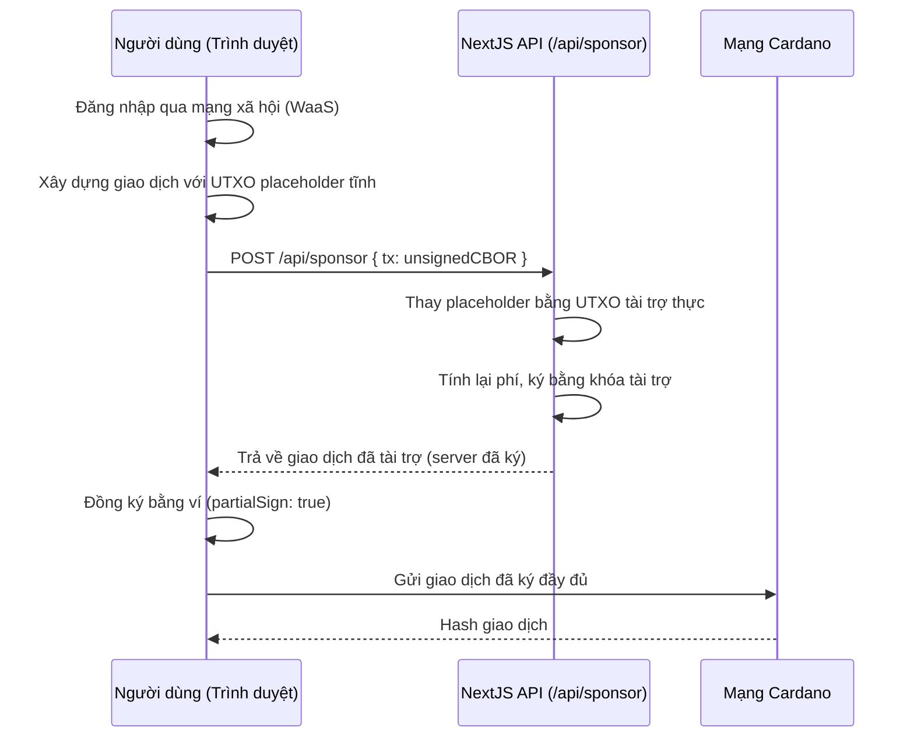

# Bài #10: Dịch vụ Web3 cho việc đưa người dùng vào hệ thống liền mạch

Dịch vụ Web3 loại bỏ hai rào cản lớn nhất đối với việc áp dụng blockchain: thiết lập ví và phí giao dịch. Thay vì yêu cầu người dùng cài đặt tiện ích mở rộng trình duyệt và mua ADA, ứng dụng của bạn cung cấp ví đăng nhập mạng xã hội và chi trả phí mạng thay cho họ.

Trong bài học này, bạn sẽ:
- Tích hợp Wallet-as-a-Service (WaaS) để người dùng tạo ví bằng đăng nhập mạng xã hội
- Thiết lập proxy Blockfrost để giữ khóa API ở phía server
- Xây dựng giao dịch được tài trợ, nơi nhà phát triển chi trả phí mạng
- Gửi giao dịch chuyển ADA được tài trợ hoàn toàn trên Cardano preprod

## Cách hoạt động

### Wallet as a Service

Wallet-as-a-Service (WaaS) cho phép người dùng giao dịch on-chain mà không cần quản lý khóa riêng. Người dùng đăng nhập bằng Google, Discord, Twitter hoặc Apple và nhận được ví không lưu ký tức thì.


Hệ thống quản lý khóa sử dụng Shamir's Secret Sharing để chia khóa riêng thành ba phần được lưu trữ ở các vị trí riêng biệt. Cả UTXOS lẫn ứng dụng của nhà phát triển đều không có quyền truy cập vào khóa hoàn chỉnh. Trong quá trình ký giao dịch, khóa chỉ được tái tạo trên thiết bị của người dùng bên trong một iframe cô lập, tồn tại trong bộ nhớ, và bị hủy sau khi ký hoàn tất.

### Tài trợ giao dịch

Phí mạng trên Cardano được thanh toán bằng ADA. Điều này tạo ra điểm ma sát: người dùng cuối phải nắm giữ ADA trước khi có thể tương tác với bất kỳ ứng dụng nào.


Tài trợ giao dịch loại bỏ rào cản này. Một ví do nhà phát triển kiểm soát chi trả các input giao dịch và phí mạng thay cho người dùng. SDK xây dựng giao dịch với một placeholder tĩnh, thay thế bằng UTXO thực từ ví tài trợ, ký ở phía server, và trả về giao dịch để người dùng đồng ký.

## Thiết lập hệ thống

### Yêu cầu tiên quyết

Bạn cần những thứ sau trước khi bắt đầu:

- Tài khoản và dự án UTXOS từ [utxos.dev/dashboard](https://utxos.dev/dashboard)
- Khóa API [Blockfrost](https://blockfrost.io/) (mạng preprod)
- Một khoản tài trợ đã tạo trong bảng điều khiển UTXOS với ví đã nạp tiền
- Node.js 18+ đã cài đặt

### Tạo ứng dụng NextJS

Tạo ứng dụng NextJS mới:

```bash
npx create-next-app@latest --typescript web3-services-demo
```

Làm theo các lời nhắc:

```bash
Need to install the following packages:
Ok to proceed? (y)

✔ Would you like to use ESLint? … Yes
✔ Would you like to use Tailwind CSS? … Yes
✔ Would you like your code inside a `src/` directory? … Yes
✔ Would you like to use App Router? … Yes
✔ Would you like to use Turbopack for next dev? … No
✔ Would you like to customize the import alias (@/* by default)? … No
```

Di chuyển đến thư mục dự án:

```bash
cd web3-services-demo
```

### Cài đặt các thư viện phụ thuộc

Cài đặt UTXOS SDK và các gói Mesh:

```bash
npm install @utxos/sdk @meshsdk/core
```

### Cấu hình biến môi trường

Tạo file `.env` trong thư mục gốc của dự án:

```bash
# Client-side (safe to expose)
NEXT_PUBLIC_UTXOS_PROJECT_ID=your_project_id
NEXT_PUBLIC_NETWORK_ID=0

# Server-side only (never expose to client)
BLOCKFROST_API_KEY_PREPROD=your_blockfrost_preprod_key
UTXOS_API_KEY=your_utxos_api_key
UTXOS_PRIVATE_KEY=your_entity_secret_private_key
SPONSORSHIP_ID=your_sponsorship_id
```

- `NEXT_PUBLIC_UTXOS_PROJECT_ID`: ID dự án của bạn từ bảng điều khiển UTXOS.
- `NEXT_PUBLIC_NETWORK_ID`: `0` cho preprod, `1` cho mainnet.
- `BLOCKFROST_API_KEY_PREPROD`: Khóa API Blockfrost của bạn cho mạng preprod.
- `UTXOS_API_KEY`: Khóa API của bạn từ bảng điều khiển UTXOS.
- `UTXOS_PRIVATE_KEY`: Khóa riêng bí mật của thực thể để ký các giao dịch được tài trợ.
- `SPONSORSHIP_ID`: ID tài trợ từ bảng điều khiển UTXOS.

## Proxy Blockfrost

Khóa API Blockfrost phải được giữ ở phía server. Tạo một route proxy chuyển tiếp yêu cầu đến Blockfrost trong khi giữ khóa ẩn khỏi trình duyệt.

Tạo file `src/app/api/blockfrost/[...slug]/route.ts`:

```ts
import { NextRequest } from "next/server";

export async function GET(
  request: NextRequest,
  { params }: { params: { slug: string[] } }
) {
  return handleBlockfrostRequest(request, params.slug, "GET");
}

export async function POST(
  request: NextRequest,
  { params }: { params: { slug: string[] } }
) {
  return handleBlockfrostRequest(request, params.slug, "POST");
}

async function handleBlockfrostRequest(
  request: NextRequest,
  slug: string[],
  method: string
) {
  const network = slug[0]; // "preprod" | "mainnet"
  const key =
    network === "mainnet"
      ? process.env.BLOCKFROST_API_KEY_MAINNET
      : process.env.BLOCKFROST_API_KEY_PREPROD;

  const baseUrl =
    network === "mainnet"
      ? "https://cardano-mainnet.blockfrost.io/api/v0"
      : "https://cardano-preprod.blockfrost.io/api/v0";

  if (!key) {
    return Response.json(
      { error: `Missing Blockfrost API key for ${network}` },
      { status: 500 }
    );
  }

  const endpointPath = slug.slice(1).join("/") || "";
  const queryString = request.url.includes("?")
    ? request.url.substring(request.url.indexOf("?"))
    : "";
  const url = `${baseUrl}/${endpointPath}${queryString}`;

  const isCborEndpoint =
    endpointPath === "tx/submit" || endpointPath === "utils/txs/evaluate";

  const response = await fetch(url, {
    method,
    headers: {
      project_id: key,
      "Content-Type": isCborEndpoint
        ? "application/cbor"
        : "application/json",
    },
    body: method !== "GET" ? request.body : undefined,
    // @ts-ignore
    duplex: method !== "GET" ? "half" : undefined,
  });

  if (response.status === 404 && endpointPath.includes("/utxos")) {
    return Response.json([]);
  }

  if (!response.ok) {
    const errorBody = await response.text();
    return Response.json(
      { error: `Blockfrost error: ${response.status}`, details: errorBody },
      { status: response.status }
    );
  }

  if (isCborEndpoint) {
    const data = await response.text();
    return Response.json(data);
  }

  const data = await response.json();
  return Response.json(data);
}
```

Proxy này chuyển tiếp các yêu cầu như `/api/blockfrost/preprod/addresses/addr_test1...` đến API Blockfrost với khóa được thêm vào ở phía server.

## Tích hợp Wallet-as-a-Service

### Khởi tạo ví

Phương thức `Web3Wallet.enable()` mở một cửa sổ popup nơi người dùng xác thực với nhà cung cấp mạng xã hội. Sau khi xác thực, SDK trả về một đối tượng ví với ví Cardano hỗ trợ truy vấn địa chỉ, tra cứu UTxO, ký giao dịch và ký dữ liệu.

Tạo file `src/lib/wallet.ts`:

```ts
import { Web3Wallet, EnableWeb3WalletOptions } from "@utxos/sdk";
import { BlockfrostProvider } from "@meshsdk/core";

const provider = new BlockfrostProvider("/api/blockfrost/preprod/");

export async function connectWallet() {
  const options: EnableWeb3WalletOptions = {
    projectId: process.env.NEXT_PUBLIC_UTXOS_PROJECT_ID!,
    networkId: 0,
    fetcher: provider,
    submitter: provider,
  };

  const wallet = await Web3Wallet.enable(options);
  return wallet;
}

export { provider };
```

- `Web3Wallet.enable()`: Mở popup xác thực và trả về đối tượng ví.
- `projectId`: Xác định dự án của bạn cho danh sách trắng và phân tích.
- `networkId`: `0` cho preprod testnet, `1` cho mainnet.
- `fetcher` và `submitter`: Nhà cung cấp Blockfrost định tuyến qua proxy của bạn.

### Xây dựng trang ví

Thay thế nội dung của `src/app/page.tsx`:

```tsx
"use client";

import { useState } from "react";
import { Web3Wallet } from "@utxos/sdk";
import { connectWallet, provider } from "@/lib/wallet";

export default function Home() {
  const [wallet, setWallet] = useState<Web3Wallet | null>(null);
  const [address, setAddress] = useState("");
  const [status, setStatus] = useState("");

  async function handleConnect() {
    try {
      setStatus("Connecting...");
      const w = await connectWallet();
      setWallet(w);
      const addr = await w.cardano.getChangeAddress();
      setAddress(addr);
      setStatus("Connected");
    } catch (error) {
      setStatus("Connection failed");
      console.error(error);
    }
  }

  return (
    <main className="flex min-h-screen flex-col items-center justify-center gap-4 p-8">
      <h1 className="text-2xl font-bold">Web3 Services Demo</h1>

      {!wallet ? (
        <button
          onClick={handleConnect}
          className="rounded bg-blue-600 px-6 py-2 text-white hover:bg-blue-700"
        >
          Connect Wallet
        </button>
      ) : (
        <div className="flex flex-col items-center gap-4">
          <p className="text-sm text-gray-500">
            {address.slice(0, 20)}...{address.slice(-10)}
          </p>
          <p className="text-green-600">{status}</p>
        </div>
      )}
    </main>
  );
}
```

Khởi động server phát triển:

```bash
npm run dev
```

Truy cập [http://localhost:3000](http://localhost:3000/) và nhấn "Connect Wallet." Một popup sẽ mở ra để đăng nhập mạng xã hội. Sau khi xác thực, địa chỉ ví của bạn sẽ hiển thị trên trang.

## Tài trợ giao dịch

### Endpoint tài trợ phía server

Logic tài trợ chạy ở phía server vì nó yêu cầu khóa riêng bí mật của thực thể. Tạo file `src/app/api/sponsor/route.ts`:

```ts
import { NextRequest } from "next/server";
import { Web3Sdk } from "@utxos/sdk";
import { BlockfrostProvider } from "@meshsdk/core";

const provider = new BlockfrostProvider(
  process.env.BLOCKFROST_API_KEY_PREPROD!
);

const sdk = new Web3Sdk({
  projectId: process.env.NEXT_PUBLIC_UTXOS_PROJECT_ID!,
  apiKey: process.env.UTXOS_API_KEY!,
  network: "testnet",
  privateKey: process.env.UTXOS_PRIVATE_KEY!,
  fetcher: provider,
  submitter: provider,
});

export async function POST(request: NextRequest) {
  try {
    const { tx } = await request.json();

    const result = await sdk.sponsorship.sponsorTx({
      sponsorshipId: process.env.SPONSORSHIP_ID!,
      tx,
    });

    if (!result.success) {
      return Response.json(
        { error: result.error },
        { status: 400 }
      );
    }

    return Response.json({ tx: result.data });
  } catch (error: any) {
    return Response.json(
      { error: error.message },
      { status: 500 }
    );
  }
}
```

- `Web3Sdk`: SDK phía server quản lý ví do nhà phát triển kiểm soát và tài trợ.
- `sponsorTx`: Nhận giao dịch CBOR chưa ký, thay thế placeholder UTXO tĩnh bằng UTXO thực từ ví tài trợ, ký và trả về giao dịch đã được tài trợ.

### Xây dựng giao dịch được tài trợ

Luồng tài trợ hoạt động theo ba bước:

1. **Xây dựng** giao dịch ở phía client sử dụng các input placeholder tĩnh từ SDK
2. **Tài trợ** giao dịch ở phía server bằng cách gọi endpoint `/api/sponsor` của bạn
3. **Ký và gửi** giao dịch đã được tài trợ bằng ví của người dùng

Thêm hàm gửi vào `src/app/page.tsx`:

```tsx
"use client";

import { useState } from "react";
import { Web3Wallet, Web3Sdk } from "@utxos/sdk";
import { MeshTxBuilder } from "@meshsdk/core";
import { connectWallet, provider } from "@/lib/wallet";

// Static sponsorship info for building the transaction
const staticInfo = {
  changeAddress:
    "addr_test1qrsj3xj6q99m4g9tu9mm2lzzdafy04035eya7hjhpus55r204nlu6dmhgpruq7df228h9gpujt0mtnfcnkcaj3wj457q5zv6kz",
  utxo: {
    input: {
      outputIndex: 0,
      txHash:
        "5a1edf7da58eff2059030abd456947a96cb2d16b9d8c3822ffff58d167ed8bfc",
    },
    output: {
      address:
        "addr_test1qrsj3xj6q99m4g9tu9mm2lzzdafy04035eya7hjhpus55r204nlu6dmhgpruq7df228h9gpujt0mtnfcnkcaj3wj457q5zv6kz",
      amount: [{ unit: "lovelace", quantity: "5000000" }],
    },
  },
};

export default function Home() {
  const [wallet, setWallet] = useState<Web3Wallet | null>(null);
  const [address, setAddress] = useState("");
  const [status, setStatus] = useState("");
  const [recipient, setRecipient] = useState("");
  const [txHash, setTxHash] = useState("");

  async function handleConnect() {
    try {
      setStatus("Connecting...");
      const w = await connectWallet();
      setWallet(w);
      const addr = await w.cardano.getChangeAddress();
      setAddress(addr);
      setStatus("Connected");
    } catch (error) {
      setStatus("Connection failed");
      console.error(error);
    }
  }

  async function handleSend() {
    if (!wallet || !recipient) return;

    try {
      setStatus("Building transaction...");

      // Step 1: Build the transaction with static sponsorship placeholders
      const txBuilder = new MeshTxBuilder({ fetcher: provider });

      txBuilder
        .txOut(recipient, [{ unit: "lovelace", quantity: "2000000" }])
        .changeAddress(staticInfo.changeAddress)
        .txIn(
          staticInfo.utxo.input.txHash,
          staticInfo.utxo.input.outputIndex,
          staticInfo.utxo.output.amount,
          staticInfo.utxo.output.address,
          0
        );

      const unsignedTx = await txBuilder.complete();

      // Step 2: Send to server for sponsorship
      setStatus("Requesting sponsorship...");
      const res = await fetch("/api/sponsor", {
        method: "POST",
        headers: { "Content-Type": "application/json" },
        body: JSON.stringify({ tx: unsignedTx }),
      });

      const data = await res.json();
      if (!res.ok) throw new Error(data.error);

      // Step 3: User signs the sponsored transaction
      setStatus("Awaiting signature...");
      const signedTx = await wallet.cardano.signTx(data.tx, true);

      // Step 4: Submit to the network
      setStatus("Submitting...");
      const hash = await provider.submitTx(signedTx);
      setTxHash(hash);
      setStatus("Transaction submitted!");
    } catch (error: any) {
      setStatus(`Error: ${error.message}`);
      console.error(error);
    }
  }

  return (
    <main className="flex min-h-screen flex-col items-center justify-center gap-4 p-8">
      <h1 className="text-2xl font-bold">Web3 Services Demo</h1>

      {!wallet ? (
        <button
          onClick={handleConnect}
          className="rounded bg-blue-600 px-6 py-2 text-white hover:bg-blue-700"
        >
          Connect Wallet
        </button>
      ) : (
        <div className="flex flex-col items-center gap-4 w-full max-w-md">
          <p className="text-sm text-gray-500">
            {address.slice(0, 20)}...{address.slice(-10)}
          </p>

          <input
            type="text"
            placeholder="Recipient address (addr_test1...)"
            value={recipient}
            onChange={(e) => setRecipient(e.target.value)}
            className="w-full rounded border px-4 py-2"
          />

          <button
            onClick={handleSend}
            className="rounded bg-green-600 px-6 py-2 text-white hover:bg-green-700"
          >
            Send 2 ADA (Sponsored)
          </button>

          {status && <p className="text-sm">{status}</p>}

          {txHash && (
            <a
              href={`https://preprod.cardanoscan.io/transaction/${txHash}`}
              target="_blank"
              rel="noopener noreferrer"
              className="text-blue-600 underline text-sm"
            >
              View on Cardanoscan
            </a>
          )}
        </div>
      )}
    </main>
  );
}
```

Giao dịch gửi 2 ADA đến địa chỉ người nhận. Ví của người dùng không bao giờ cần giữ ADA để trả phí vì ví tài trợ của nhà phát triển chi trả mọi thứ.

### Cách luồng tài trợ hoạt động

1. **Placeholder tĩnh**: `getStaticInfo()` trả về một UTXO cố định và địa chỉ thay đổi được sử dụng làm placeholder khi xây dựng giao dịch. Đây không phải là UTXO thực; chúng chỉ tồn tại để tạo ra CBOR hợp lệ cho SDK viết lại.

2. **Viết lại phía server**: `sponsorTx()` phân tích giao dịch CBOR, loại bỏ các input placeholder tĩnh, thêm UTXO thực từ ví tài trợ, tính toán lại phí, và ký giao dịch bằng ví do nhà phát triển kiểm soát.

3. **Người dùng đồng ký**: Người dùng ký với `partialSign: true` vì ví nhà phát triển đã ký. Cả hai chữ ký kết hợp thành giao dịch cuối cùng.

4. **Gửi giao dịch**: Giao dịch đã ký đầy đủ được gửi đến mạng Cardano. Người dùng trả phí bằng không.

## Hướng Dẫn Mã Nguồn

Dự án này là ứng dụng NextJS App Router chuẩn. Nếu bạn đã xây dựng bất kỳ ứng dụng NextJS nào trước đây, cấu trúc sẽ quen thuộc. Các phần liên quan đến blockchain nằm trong API route và một helper ví nhỏ.

### Cấu trúc dự án

```
10-web3-services/
├── src/
│   ├── app/
│   │   ├── api/
│   │   │   ├── blockfrost/[...slug]/route.ts  # API gateway: proxy Blockfrost, ẩn khóa
│   │   │   └── sponsor/route.ts               # Endpoint server: tài trợ giao dịch người dùng
│   │   └── page.tsx                            # UI client: kết nối ví + gửi ADA
│   └── lib/
│       └── wallet.ts                           # Helper kết nối ví (khởi tạo WaaS)
├── eslint.config.mjs
├── next.config.ts
├── package.json      # NextJS + @utxos/sdk + @meshsdk/core
├── postcss.config.mjs
└── tsconfig.json
```

**`api/blockfrost/[...slug]/route.ts`** là API gateway. Nó hoạt động chính xác như proxy backend-for-frontend trong web2: trình duyệt gọi route NextJS của bạn, và route chuyển tiếp yêu cầu đến Blockfrost với khóa API được thêm phía server. Đây là cùng mẫu bạn sẽ dùng để ẩn khóa bí mật Stripe hoặc bất kỳ thông tin xác thực API bên thứ ba nào sau endpoint của riêng bạn.

**`api/sponsor/route.ts`** là endpoint tài trợ. Nó nhận giao dịch chưa ký từ client, thay thế UTXO thực từ ví nhà phát triển, ký và trả về giao dịch đã được tài trợ. Hãy nghĩ đây giống endpoint xử lý thanh toán nơi người bán (nhà phát triển) chi trả thay cho khách hàng (người dùng).

**`lib/wallet.ts`** khởi tạo kết nối Wallet-as-a-Service. Nó cấu hình `Web3Wallet.enable()` với project ID và mạng, trỏ fetcher và submitter qua proxy Blockfrost. Đây là tương đương của việc khởi tạo OAuth client trong web2.

**`page.tsx`** là React client component chuẩn với các hook `useState` cho trạng thái ví, hiển thị địa chỉ và trạng thái giao dịch. Tương tác blockchain được trừu tượng hóa sau `connectWallet()` và `MeshTxBuilder`, nên component đọc giống bất kỳ trang React dựa trên form nào.

### Luồng tài trợ

Luồng giao dịch được tài trợ liên quan đến sự phối hợp giữa client (trình duyệt), server của bạn (NextJS API route) và mạng blockchain. Điều này tương tự cách cổng thanh toán hoạt động: client khởi tạo, server ủy quyền và cấp vốn, và client xác nhận.



**Bước 1 - Đăng nhập mạng xã hội**: Người dùng nhấn "Connect Wallet" và xác thực qua popup nhà cung cấp mạng xã hội (Google, Discord, v.v.). Phía sau, `Web3Wallet.enable()` tạo ví không lưu ký sử dụng Shamir's Secret Sharing. Không cần seed phrase, không cần extension trình duyệt.

**Bước 2 - Xây dựng với Placeholder**: Client xây dựng giao dịch sử dụng `MeshTxBuilder` với UTXO placeholder tĩnh và địa chỉ thay đổi. Đây không phải giá trị on-chain thực. Chúng chỉ tồn tại để tạo CBOR hợp lệ mà server có thể viết lại. Hãy nghĩ đây giống xây dựng form với dữ liệu giả được thay thế phía server trước khi xử lý.

**Bước 3 - Server tài trợ**: Endpoint `/api/sponsor` gọi `sdk.sponsorship.sponsorTx()`, phân tích CBOR, loại bỏ input placeholder, thêm UTXO thực từ ví đã nạp tiền của nhà phát triển, tính lại phí và ký. Điều này tương tự bộ xử lý thanh toán thay token thẻ bằng giao dịch thực.

**Bước 4 - Người dùng đồng ký**: Giao dịch đã tài trợ trở lại với chữ ký server đã đính kèm. Người dùng ký với `partialSign: true`, thêm ủy quyền của họ. Giờ cả hai chữ ký đã có mặt. Đây là ủy quyền đa bên, giống yêu cầu cả thẻ nhân viên và phê duyệt quản lý để xử lý hoàn tiền.

**Bước 5 - Gửi**: Giao dịch đã ký đầy đủ được gửi đến mạng Cardano. Người dùng trả phí bằng không. Ví tài trợ của nhà phát triển chi trả mọi thứ.

### So sánh với Web2

| Khái niệm Web3 | Tương đương Web2 | Lý do |
|---|---|---|
| Wallet-as-a-Service (WaaS) | OAuth / đăng nhập mạng xã hội (Auth0, Firebase Auth) | Người dùng xác thực với nhà cung cấp quen thuộc, không cần thiết lập riêng cho crypto |
| Route proxy Blockfrost | API gateway (nginx proxy, mẫu BFF) | Ẩn khóa API bên thứ ba phía server, cung cấp endpoint nội bộ sạch |
| Tài trợ giao dịch | Stripe/xử lý thanh toán nơi người bán trả | Nhà phát triển chi trả phí mạng nên người dùng không trả gì |
| UTXO placeholder tĩnh | Mock/stub cho testing | Input giả được sử dụng để xây dựng cấu trúc hợp lệ rồi được thay bằng dữ liệu thực |
| Ký một phần (`partialSign: true`) | Ủy quyền đa bên (2FA, đồng ký) | Nhiều bên phải phê duyệt trước khi hành động được hoàn tất |
| Shamir's Secret Sharing | Quản lý khóa phân tán (HSM, vault sharding) | Khóa riêng được chia qua các vị trí nên không bên đơn lẻ nào nắm khóa hoàn chỉnh |
| `Web3Sdk` (phía server) | Admin SDK (Firebase Admin, Stripe server SDK) | SDK phía server với đặc quyền nâng cao cho các thao tác yêu cầu khóa bí mật |
| Định dạng giao dịch CBOR | Protocol Buffers / tuần tự hóa nhị phân | Mã hóa nhị phân gọn cho dữ liệu blockchain có cấu trúc |

Mẫu tổng thể quen thuộc với bất kỳ nhà phát triển web2 nào đã xây dựng luồng thanh toán: client khởi tạo, server ủy quyền và cấp vốn, client xác nhận, và kết quả được gửi đến mạng.

## Mã nguồn

Mã nguồn hoàn chỉnh cho bài học này có sẵn trên [GitHub](https://github.com/cardanobuilders/cardanobuilders.github.io/tree/main/codes/course-cardano/10-web3-services).

## Thử thách

Xây dựng ứng dụng đúc NFT được tài trợ. Người dùng kết nối qua đăng nhập mạng xã hội, cung cấp metadata cho NFT của họ, và ví của nhà phát triển tài trợ giao dịch đúc. Người dùng ký để ủy quyền đúc, nhưng không trả phí.

Gợi ý:
- Sử dụng `ForgeScript.withOneSignature(userAddress)` để tạo minting policy gắn với địa chỉ của người dùng
- Thêm `.mint("1", policyId, tokenNameHex)` và `.mintingScript(forgingScript)` vào trình xây dựng giao dịch
- Bao gồm `.metadataValue(721, metadata)` cho metadata NFT theo chuẩn CIP-25
- Thông tin tài trợ tĩnh bao gồm UTXO collateral cho các giao dịch script