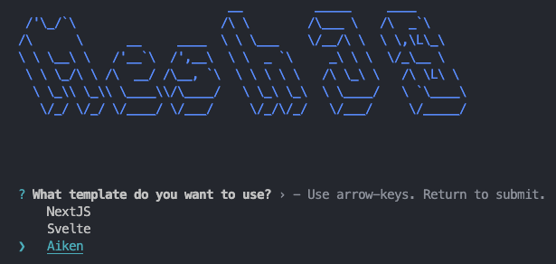
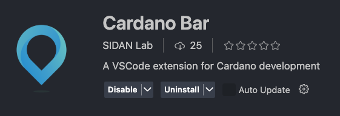
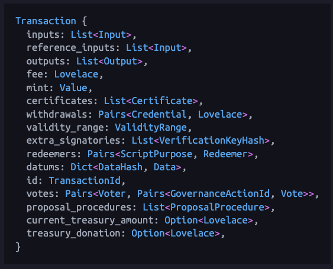
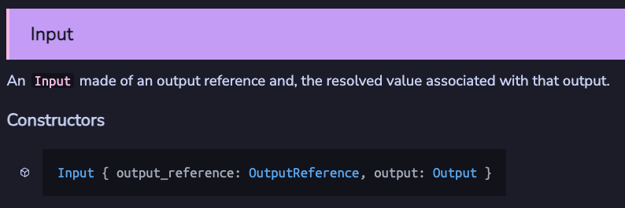
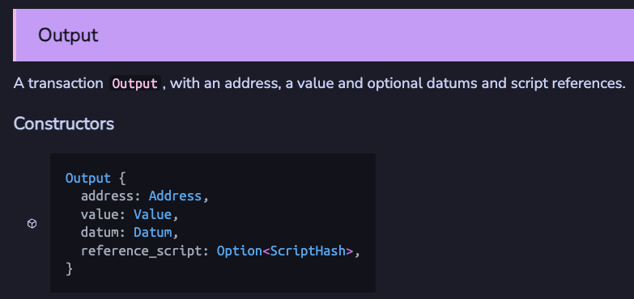
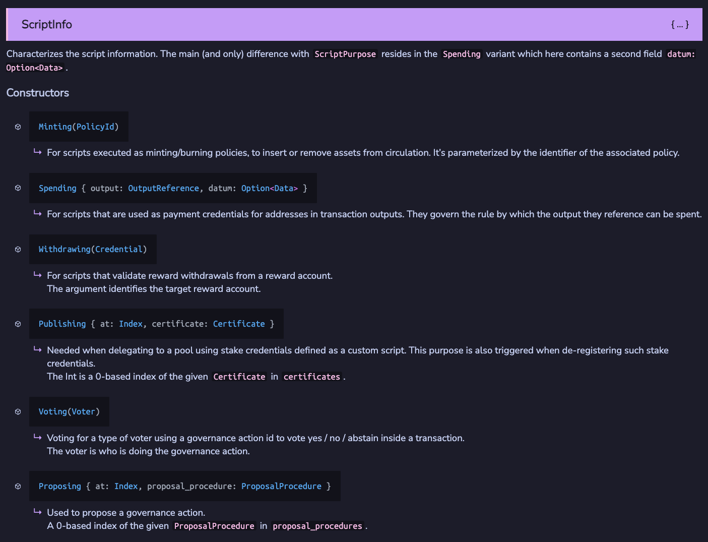

# Bài #03: Hợp đồng Aiken

Bài học 3 đến 6 bao gồm các khái niệm cốt lõi của việc xây dựng smart contract Aiken. Một số tài liệu được điều chỉnh từ [AikenPBL của Andamio](https://app.andamio.io/course/db22e013578fcead6c2fed5446d61891ad31f3cb4955e88d980107e7).

### Tổng quan

- **Khóa học Hello Cardano**: Bao gồm các khái niệm trọng yếu được chọn lọc của việc phát triển smart contract Aiken.
- **AikenPBL**: Khóa học đầy đủ dựa trên dự án từ đầu đến cuối, bao gồm các khái niệm thiết yếu và nền tảng.

Phát triển smart contract Aiken là một lĩnh vực chuyên biệt. Để đi sâu hơn và theo đuổi sự nghiệp như một nhà phát triển on-chain Cardano, chúng tôi khuyên bạn nên hoàn thành cả hai khóa học.

> Mã nguồn: [GitHub](https://github.com/cardanobuilders/cardanobuilders.github.io/tree/main/codes/course-hello-cardano/03-aiken-contracts)

## Thiết lập hệ thống

Cài đặt Aiken sử dụng một trong các hướng dẫn sau:

1. [Hướng dẫn cài đặt chính thức Aiken](https://aiken-lang.org/installation-instructions)
2. [Hướng dẫn thiết lập AikenPBL của Andamio](https://app.andamio.io/course/db22e013578fcead6c2fed5446d61891ad31f3cb4955e88d980107e7/101/lesson/1)

### Thiết lập dự án Aiken trống

Chạy lệnh sau để tạo dự án Aiken mới sử dụng template của Mesh:

```bash
npx meshjs 03-aiken-contracts
```

Chọn template `Aiken` khi được hỏi.



Sau khi cài đặt, thư mục mới `03-aiken-contracts` sẽ được tạo với cấu trúc sau:

```
03-aiken-contracts
├── aiken-workspace  // Thư mục dự án Aiken chính được sử dụng trong bài học
└── mesh             // Thư mục cho mã off-chain Mesh tương đương (không sử dụng trong bài học)
```

### Tùy chọn: Cài đặt Cardano-Bar

Nếu bạn sử dụng VSCode làm IDE, cài đặt extension [Cardano-Bar](https://marketplace.visualstudio.com/items/?itemName=sidan-lab.cardano-bar-vscode) để có các đoạn mã mẫu giúp theo dõi khóa học dễ dàng hơn.



## Tìm hiểu Transaction Context

Các hợp đồng Cardano hoạt động khác với smart contract trên các blockchain khác. Chúng hoạt động như các quy tắc xác thực để xác định xem một giao dịch có hợp lệ hay không. **Validator** là thuật ngữ chính xác hơn cho các hợp đồng Cardano.

Xây dựng validator yêu cầu hiểu cách giao dịch hoạt động. Tham khảo [tài liệu Aiken](https://aiken-lang.github.io/stdlib/cardano/transaction.html#Transaction) để xem cấu trúc `Transaction` đầy đủ.



### Đầu vào & Đầu ra

Tất cả các giao dịch Cardano phải có đầu vào và đầu ra:
- **Đầu vào (Inputs)**: UTXO được chi tiêu trong giao dịch.
- **Đầu ra (Outputs)**: UTXO được tạo ra trong giao dịch.

Xem [tài liệu Aiken](https://aiken-lang.github.io/stdlib/cardano/transaction.html#Input) để biết định nghĩa kiểu:




Các khái niệm chính:
- Một đầu vào tham chiếu đến đầu ra của giao dịch trước, được xác định bởi `output_reference`.
- Validator có thể kiểm tra:
  - Nếu một đầu vào chi tiêu từ một địa chỉ cụ thể.
  - Nếu một đầu vào chi tiêu một tài sản cụ thể.
  - Nếu một đầu ra gửi đến một địa chỉ cụ thể.
  - Nếu một đầu ra gửi một tài sản cụ thể.
  - Nếu datum của đầu vào/đầu ra chứa thông tin cụ thể.

### Reference Inputs

`reference_inputs` trong `Transaction` là các đầu vào không bị chi tiêu mà được tham chiếu trong validator. Hữu ích cho việc đọc datum từ UTXO mà không cần chi tiêu nó.

### Mint

`mint` trong `Transaction` liệt kê các tài sản được mint hoặc đốt (burn). Hữu ích cho việc tạo hoặc hủy token.

### Chữ ký

`extra_signatories` trong `Transaction` liệt kê các public key hash bắt buộc phải ký giao dịch. Hữu ích cho việc yêu cầu người dùng cụ thể phải ký.

### Thời gian

`validity_range` trong `Transaction` chỉ định phạm vi slot mà giao dịch có hiệu lực. Hữu ích cho việc thiết lập khóa thời gian.

## Các loại Script

Xem [tài liệu Aiken](https://aiken-lang.github.io/stdlib/cardano/script_context.html#ScriptContext) để biết các loại script. Phổ biến nhất:
- **Minting**
- **Spending**
- **Withdrawing**



### Minting Script

Xác thực minting script được kích hoạt khi tài sản được mint hoặc đốt theo policy của script.

Ví dụ: `/aiken-workspace/validators/mint.ak`:

```rs
use cardano/assets.{PolicyId}
use cardano/transaction.{Transaction, placeholder}

validator always_succeed {
  mint(_redeemer: Data, _policy_id: PolicyId, _tx: Transaction) {
    True
  }

  else(_) {
    fail @"unsupported purpose"
  }
}

test test_always_succeed_minting_policy() {
  let data = Void
  always_succeed.mint(data, #"", placeholder)
}
```

Script này sẽ được biên dịch thành một script với hash `def68337867cb4f1f95b6b811fedbfcdd7780d10a95cc072077088ea`, còn gọi là `policy Id`. Nó xác thực các giao dịch mint hoặc đốt tài sản theo policy này.

#### Tham số

Nâng cấp script để chỉ cho phép mint/đốt khi được ký bởi một khóa cụ thể:

```rs
validator minting_policy(owner_vkey: VerificationKeyHash) {
  mint(_redeemer: Data, _policy_id: PolicyId, tx: Transaction) {
    key_signed(tx.extra_signatories, owner_vkey)
  }

  else(_) {
    fail @"unsupported purpose"
  }
}
```

- `owner_vkey`: Public key hash của chủ sở hữu được phép mint/đốt tài sản.
- Sử dụng `key_signed` từ [vodka](https://github.com/sidan-lab/vodka) để xác thực.

#### Redeemer

Mở rộng policy để bao gồm redeemer chỉ định hành động giao dịch (mint hoặc đốt):

```rs
pub type MyRedeemer {
  MintToken
  BurnToken
}

validator minting_policy(
  owner_vkey: VerificationKeyHash,
  minting_deadline: Int,
) {
  mint(redeemer: MyRedeemer, policy_id: PolicyId, tx: Transaction) {
    when redeemer is {
      MintToken -> {
        let before_deadline = valid_before(tx.validity_range, minting_deadline)
        let is_owner_signed = key_signed(tx.extra_signatories, owner_vkey)
        before_deadline? && is_owner_signed?
      }
      BurnToken -> check_policy_only_burn(tx.mint, policy_id)
    }
  }

  else(_) {
    fail @"unsupported purpose"
  }
}
```

### Spending Script

Xác thực spending script được kích hoạt khi một UTXO tại địa chỉ script được chi tiêu trong giao dịch.

Ví dụ: `/aiken-workspace/validators/spend.ak`:

```rs
pub type Datum {
  oracle_nft: PolicyId,
}

validator hello_world {
  spend(
    datum_opt: Option<Datum>,
    _redeemer: Data,
    _input: OutputReference,
    tx: Transaction,
  ) {
    when datum_opt is {
      Some(datum) ->
        when inputs_with_policy(tx.reference_inputs, datum.oracle_nft) is {
          [_ref_input] -> True
          _ -> False
        }
      None -> False
    }
  }

  else(_) {
    fail @"unsupported purpose"
  }
}
```

#### Datum

- `Datum`: Dữ liệu đính kèm vào UTXO tại địa chỉ script.
- Mẫu thiết kế phổ biến: Sử dụng oracle NFT (state thread token) để đảm bảo tính duy nhất của UTXO.

### Withdrawing Script

Xác thực withdrawal script được kích hoạt khi rút từ tài khoản thưởng.

Ví dụ: `/aiken-workspace/validators/withdraw.ak`:

```rs
use aiken/crypto.{VerificationKeyHash}
use cardano/address.{Credential, Script}
use cardano/certificate.{Certificate}
use cardano/transaction.{Transaction, placeholder}

validator always_succeed(_key_hash: VerificationKeyHash) {
  withdraw(_redeemer: Data, _credential: Credential, _tx: Transaction) {
    True
  }

  publish(_redeemer: Data, _certificate: Certificate, _tx: Transaction) {
    True
  }

  else(_) {
    fail @"unsupported purpose"
  }
}

test test_always_succeed_withdrawal_policy() {
  let data = Void
  always_succeed.withdraw("", data, Script(#""), placeholder)
}
```

#### Xử lý Publishing

Tất cả withdrawal script phải được đăng ký on-chain trước khi sử dụng. Việc này được thực hiện bằng cách xuất bản chứng chỉ đăng ký với script hash làm stake credential. Việc xuất bản script cũng được xác thực bởi hàm `publish` trong withdrawal script, hàm này được kích hoạt mỗi khi withdrawal script hiện tại được đăng ký hoặc hủy đăng ký.

#### Khi nào withdrawal script được sử dụng?

Hầu hết người dùng Cardano stake và rút thưởng bằng khóa thanh toán tiêu chuẩn. Tuy nhiên, các DApp Cardano thường sử dụng withdrawal script để cải thiện hiệu quả xác thực. Kỹ thuật này được trình bày trong [Bài 5](./05-avoid-redundant-validation.mdx).

## Mã nguồn

Mã nguồn cho bài học này có sẵn trên [GitHub](https://github.com/cardanobuilders/cardanobuilders.github.io/tree/main/codes/course-hello-cardano/03-aiken-contracts).
