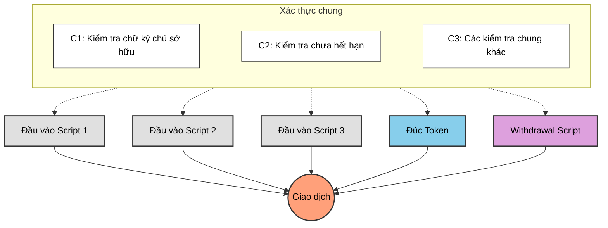
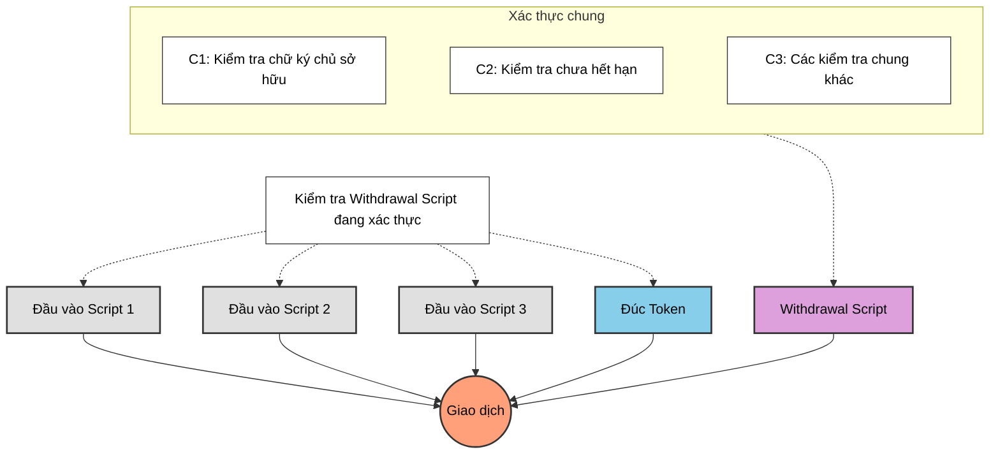

# Bài #05: Tránh xác thực trùng lặp

Một câu hỏi phổ biến từ các bài học trước: tại sao sử dụng withdrawal script cho minting và cập nhật trạng thái thay vì xác thực trực tiếp trong spending validator? Mỗi UTXO được chi tiêu từ spending validator đều kích hoạt xác thực, vậy tại sao không đặt logic ở đó?

> Mã nguồn: [GitHub](https://github.com/cardanobuilders/cardanobuilders.github.io/tree/main/codes/course-hello-cardano/05-avoid-redundant-validation)

## Giao dịch với nhiều xác thực script

Xem xét một giao dịch phức tạp liên quan đến nhiều xác thực script: minting token, chi tiêu nhiều script UTXO, và rút tiền. Mỗi hành động có thể yêu cầu bộ kiểm tra riêng.



Áp dụng các kiểm tra chung trong mọi script gây ra xác thực trùng lặp: cùng một logic được thực thi nhiều lần, làm tăng chi phí giao dịch và kích thước script.

## Làm thế nào để tối ưu hơn?

Tập trung các kiểm tra chung vào một script duy nhất thực thi một lần. Tất cả các script khác ủy quyền cho nó, loại bỏ logic trùng lặp trong khi vẫn bảo toàn tất cả các xác thực cần thiết.



`WithdrawalCheck` script thực hiện các xác thực chung một lần, kiểm tra các điều kiện cho tất cả các script khác trong giao dịch.

## Ví dụ: Tiếp nối từ Bài 4

Giả sử withdrawal script của Bài 4 chứa tất cả logic xác thực chung. Thay vì lặp lại các kiểm tra đó trong spending và minting validator, hãy ủy quyền cho withdrawal script:

### Spending

```rs
use aiken/crypto.{ScriptHash}
use cardano/transaction.{OutputReference, Transaction}
use cocktail.{withdrawal_script_validated}

validator spending_logics_delegated(
  delegated_withdrawal_script_hash: ScriptHash,
) {
  spend(
    _datum_opt: Option<Data>,
    _redeemer: Data,
    _input: OutputReference,
    tx: Transaction,
  ) {
    withdrawal_script_validated(
      tx.withdrawals,
      delegated_withdrawal_script_hash,
    )
  }

  else(_) {
    fail @"unsupported purpose"
  }
}
```

### Minting

```rs
use aiken/crypto.{ScriptHash}
use cardano/assets.{PolicyId}
use cardano/transaction.{Transaction}
use cocktail.{withdrawal_script_validated}

validator minting_logics_delegated(
  delegated_withdrawal_script_hash: ScriptHash,
) {
  mint(_redeemer: Data, _policy_id: PolicyId, tx: Transaction) {
    withdrawal_script_validated(
      tx.withdrawals,
      delegated_withdrawal_script_hash,
    )
  }

  else(_) {
    fail @"unsupported purpose"
  }
}
```

## Tại sao ủy quyền cho withdrawal script?

Ủy quyền xác thực cho withdrawal script là một mẫu thiết kế phổ biến trong hợp đồng thông minh Cardano. Mặc dù bạn có thể ủy quyền cho spending hoặc minting validator, withdrawal script có một lợi thế riêng biệt.

### Kích hoạt sạch

Xác thực spending được kích hoạt khi một UTXO được chi tiêu, và xác thực minting được kích hoạt khi một token được đúc. Cả hai đều yêu cầu một hành động on-chain thực sự. Ngược lại, withdrawal script có thể được kích hoạt bằng cách rút 0 lovelace ([`thủ thuật withdraw 0`](https://aiken-lang.org/fundamentals/common-design-patterns#forwarding-validation--other-withdrawal-tricks)). Điều này kích hoạt xác thực một cách sạch sẽ mà không ảnh hưởng đến logic hoặc trạng thái của giao dịch.

## Giải thích đơn giản

### Tại sao nên tránh xác thực trùng lặp?
Khi nhiều script tham gia vào một giao dịch, lặp lại cùng các kiểm tra trong mỗi script lãng phí ngân sách thực thi và tăng phí. Tập trung các kiểm tra chung vào một script chỉ chạy chúng một lần.

### Cách ủy quyền hoạt động
Withdrawal script đóng vai trò là validator trung tâm:

- **Spending Validator**: Kiểm tra rằng withdrawal script có mặt trong giao dịch
- **Minting Validator**: Cũng kiểm tra withdrawal script
- **Withdrawal Script**: Chạy tất cả logic xác thực chung một lần

### Thủ thuật Withdraw-Zero
Withdrawal script được kích hoạt thông qua `thủ thuật withdraw 0`: rút 0 lovelace kích hoạt xác thực mà không ảnh hưởng đến trạng thái giao dịch. Phương pháp này được áp dụng rộng rãi nhờ tính đơn giản.

### Lợi ích chính
- **Hiệu quả**: Các kiểm tra chung chỉ thực thi một lần thay vì mỗi script một lần
- **Phí thấp hơn**: Giảm ngân sách thực thi đồng nghĩa với chi phí giao dịch thấp hơn
- **Dễ bảo trì**: Logic xác thực nằm ở một nơi duy nhất

## Mã nguồn

Mã nguồn cho bài học này có sẵn trên [GitHub](https://github.com/cardanobuilders/cardanobuilders.github.io/tree/main/codes/course-hello-cardano/05-avoid-redundant-validation).
